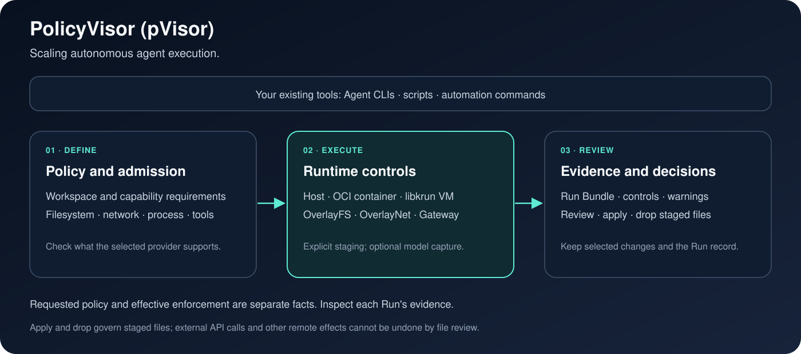

#  PolicyVisor (pVisor)

**Scaling autonomous agent execution.**  
**让自主 Agent 的执行可以规模化。**

**Higher execution density. Lower supervision cost.**  
**提升执行密度，降低监督成本。**

[](https://github.com/DeepLink-org/pvisor/actions/workflows/ci.yml)
[](https://deeplink-org.github.io/pvisor/)
[](LICENSE)

PolicyVisor runs Agent CLIs and scripts within a policy boundary, stages their file changes, and records the execution. Review the result like a pull request and apply only the paths you want. The same workflow works across agents, with platform-specific controls provided by each executor.

Running more agents takes both compute resources and human attention.
PolicyVisor uses resource sharing and idle-memory reclamation to improve machine
capacity, and staged file changes, execution records, and review mechanisms to
reduce supervision overhead. These **bounded, recoverable, and checkable**
executions provide a basis for batch review and automated checks.



## What you get

- **Hands off.** Let the agent finish unattended. Its file changes land in a
  stage; network and sensitive paths follow your policy.
- **Gate the result.** Review the changeset like a PR, apply the paths you want,
  discard the rest. If you changed the same file meanwhile, pVisor refuses to
  overwrite your edit.
- **Keep a record.** Every run leaves a checkable record of the limits actually in
  effect, the access that was blocked, and optional model requests.

## Install

```bash
pip install pvisor
pvisor --version
```

The rolling nightly build installs the same command without a Rust toolchain:

```bash
curl -fsSL https://raw.githubusercontent.com/DeepLink-org/pvisor/main/scripts/install-nightly.sh | bash
```

See the [installation guide](https://deeplink-org.github.io/pvisor/en/start/installation/)
for platform requirements and executor setup.

## Run it

```bash
pvisor run --safe -- claude
pvisor status --review last
pvisor apply last --path src   # or: pvisor drop last
```

Replace the command after `--` with your script or installed Agent CLI. `--safe`
keeps workspace changes in Job storage for review, and `last` addresses the most
recent Job in the default storage. To put the stage elsewhere, use `--stage PATH`
and address later commands with that path or the printed Job ID (`run-*`) instead
of `last`.

## Bounded, recoverable, checkable

| Property | Meaning | Mechanism today |
|---|---|---|
| Bounded | the blast radius is known up front | executor boundary, capability admission |
| Recoverable | staged changes can be selectively merged, discarded, or forked before apply | staging, `apply`/`drop`, `fork` |
| Checkable | execution leaves checkable evidence | Run Bundle, evidence model, optional capture |

## Where we are today

pVisor focuses on bounded, recoverable, checkable execution and high sandbox
density on a single machine. Native Jobs retain the run-review-apply workflow;
the separate `pvisor-daemon` provides a partial OpenSandbox 1.1.0 API profile
through a VM-only `NativeRuntime` that embeds pVisor in detached supervisor
subprocesses. The runtime is implemented for Linux x86_64/KVM with delegated
cgroup v2, with the daemon CLI integrated. Prepared-image bootstrap
is neither supplied nor end-to-end validated. The daemon API does not implement
stage/apply or checkpoints, does not automatically acquire node sharing resources,
and has no SDK-conformance or density evidence.
Cross-node placement, workflows and retries belong to external orchestrators
such as Kubernetes or Ray, not a pVisor Cluster control plane.

For the four levels, where pVisor places its bet, and the status of L2/L3, see the
[trust ladder](https://deeplink-org.github.io/pvisor/en/why/trust-ladder/).

## Scope

Check execution observations to see which controls were installed.
`apply`/`drop` govern staged files; remote API calls, database writes, and sent
messages retain their effects. Host, container, and VM executors provide different
controls, with platform-dependent container/VM support. See [capabilities and evidence](https://deeplink-org.github.io/pvisor/en/concepts/capabilities-and-evidence/).

## Documentation

- [Start here](https://deeplink-org.github.io/pvisor/en/start/) — the path from install to a reviewed run
- [Your first run](https://deeplink-org.github.io/pvisor/en/start/first-run/) — the run-review-apply loop
- [Why pVisor](https://deeplink-org.github.io/pvisor/en/why/) — vision, trust ladder, use cases, and comparisons
- [Capabilities and evidence](https://deeplink-org.github.io/pvisor/en/concepts/capabilities-and-evidence/) — how far a guarantee goes
- [Security](https://deeplink-org.github.io/pvisor/en/security/) — threat model, executor boundaries, and known limitations
- [Benchmarks](https://deeplink-org.github.io/pvisor/en/benchmarks/) — methods and current data
- [Design and research](https://deeplink-org.github.io/pvisor/en/design/) — architecture, isolation, and research directions
- [Experimental features](experimental/README.md) — proposed capabilities, implementation stages, and validation gates
- [Community](https://deeplink-org.github.io/pvisor/en/community/) — contributing, testing, and roadmap
- [中文文档](https://deeplink-org.github.io/pvisor/zh/start/)

Security issues: see [SECURITY.md](SECURITY.md). Contributions: see [CONTRIBUTING.md](CONTRIBUTING.md).

## Crate layout

The Cargo workspace contains 13 crates. `pvisor` is the embeddable execution
runtime and durable Job service; `pvisor-cli` is the default workspace member and
owns the `pvisor`, `pvisor-cache`, `pvisor-memory-pool`, `pvisor-tui` and
`pvisor-replay` executables. The TUI implementation is integrated into
`pvisor-cli`; there is no separate `pvisor-tui` crate. The runtime has no CLI or
Clap normal dependency, and the `pvisor-replay` engine depends on shared Core and
Journal contracts rather than the runtime or Clap.

The remaining crates are `pvisor-core`, `pvisor-journal`, `pvisor-gateway`,
`pvisor-vm`, `pvisor-daemon`, `pvisor-guest`, `pvisor-shim`, `pvisor-overlay-core`,
`pvisor-overlayfs` and `pvisor-overlaynet`. See the
[engineering guide](docs/src/en/community/development.md) for source ownership,
dependencies and targeted tests (`just test pvisor` for the runtime,
`just test cli` for application frontends).

## Guest firmware

The customized libkrunfw sources, guest kernel configurations, patches and
bundle tests are maintained in [`fw/`](fw/README.md). CLI, daemon and single-wheel
builds use this source-built firmware by default, with verified kernel downloads
and input-keyed build caching. Use `just fw-build` to build it independently and
`just test-fw` to run its bundle/ABI regression tests. See the directory README
for toolchain requirements, cache settings and corresponding-source export.
Published wheels remain ready to install without a kernel build toolchain.

## License

[Apache License 2.0](LICENSE). See [`NOTICE`](NOTICE) for third-party
attributions and separately licensed bundled components.
