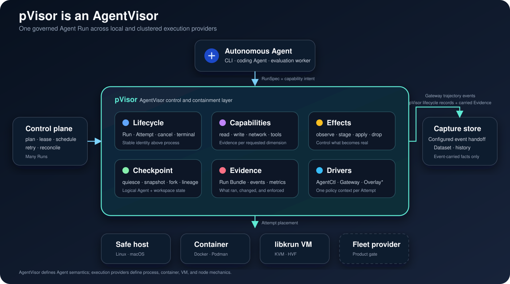

# PolicyVisor (pVisor)

**Policy-governed, reviewable execution.**

PolicyVisor (pVisor) manages execution for Agent CLIs, scripts, and automation
commands. The **p** stands for **Policy**: connect requested capabilities,
effective runtime controls, and reviewable results.

Owns one Run, its Attempts, capability admission, staged filesystem Effects,
execution placement, and the host CLI (`pvisor`). It can place Runs on host,
container, and libkrun VM executors while preserving one Run contract.
It is not an Agent framework, an OCI runtime, or an operating system.

OverlayFS, OverlayNet, Gateway, and AgentCtl are pVisor runtime drivers.



| Product area | Current responsibility |
| --- | --- |
| Run lifecycle | One logical `Run`, currently one `Attempt` per execution, cancellation, deadlines, terminal publication, and parent lineage |
| Agent control | Optional authenticated AgentCtl v1 for Sessions, client state, directives, and cooperative quiescence |
| Capabilities | Models, tools, filesystem read/write, network, secrets, subprocess, and resources, with evidence recorded per dimension |
| Filesystem effects | Copy-on-write staging, classified review, logical checkpoint/fork, repeated selective apply, terminal apply/drop, and an apply ledger |
| Network and model access | Gateway capture plus OverlayNet policy; enforcement strength depends on executor and is never inferred from a product label |
| Execution placement | Host process, native OCI container executor, or libkrun VM using an OCI image, prepared rootfs, or Linux host rootfs |
| Evidence | Run Bundle, lifecycle events, capability enforcement, filesystem changes, network counters, AgentCtl observations, output, and artifact references |

The standalone product loop is `RunSpec → admission → Attempt → terminal
RunResult + private Run Bundle + staged Effects → later review/apply/drop`.
Capture is a Gateway capability, not a second product.

The default build excludes Jujutsu. Use `jujutsu-overlay` for the Jujutsu upper
backend. Default features are empty.

## Develop

```bash
just build release          # release build + macOS Hypervisor signing
just build    # debug build + macOS signing
just test persisting-pvisor
just examples
```

```bash
cargo build --locked -p persisting-pvisor --bin pvisor --release
```

On macOS, source builds that use HVF must be signed. `just build release` does this;
the equivalent entitlements file is `macos-hypervisor.entitlements`. Building
from source on macOS also requires Zig (`brew install zig`) to cross-compile
libkrun's embedded Linux guest init.

The vendored libkrun is built only as an `rlib` and statically linked into
`pvisor`; no `libkrun.so` or `libkrun.dylib` is required. The separate guest
kernel payload, `libkrunfw.so.5` / `libkrunfw.5.dylib`, is still loaded at runtime.

## Links

- [Operation-chain IR and Trace v3](../../docs/pvisor-ir.md): operation terms with ordered context wrappers, ordered rewrites,
  readable serialization and a runnable backend example; driver migration follows separately.
- [The PolicyVisor model](../../docs/src/en/concepts/policyvisor.md)
- [Get started](../../docs/src/en/start/first-run.md)
- [Isolation architecture](../../docs/src/en/design/isolation.md)
- [Gateway architecture](../../docs/src/en/design/gateway.md)
- [OverlayNet architecture](../../docs/src/en/design/overlaynet.md)
- [pVisor CLI](../../docs/src/en/reference/cli.md)
- [System architecture](../../docs/src/en/design/architecture.md)
- [`persisting-overlayfs`](../persisting-overlayfs/README.md)
- [`persisting-overlaynet`](../persisting-overlaynet/README.md)
- [`persisting-gateway`](../persisting-gateway/README.md)
- [`persisting-control`](../persisting-control/README.md)
