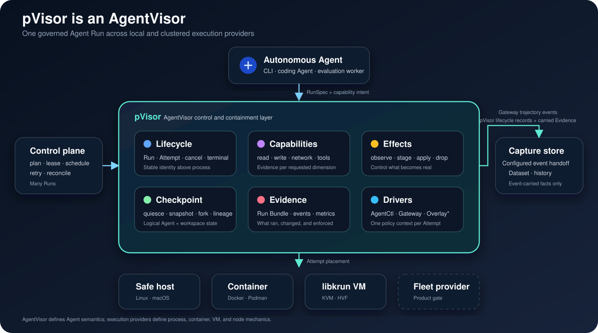

# PolicyVisor (pVisor)

**Policy-governed, reviewable execution.**

PolicyVisor (pVisor) manages execution for Agent CLIs, scripts, and automation
commands. The **p** stands for **Policy**: connect requested capabilities,
effective runtime controls, and reviewable results.

Owns one Job, its internal Run record and Attempts, capability admission,
filesystem Effects, execution placement, and the host CLI (`pvisor`). It can
place Jobs on host, container, and libkrun VM executors while preserving one
Run contract.
It is not an Agent framework, an OCI runtime, or an operating system.

OverlayFS, OverlayNet, Gateway, and AgentCtl are pVisor runtime drivers.
The core `Session` owns each Attempt and exposes ordered lifecycle hooks and
versioned control/observation contracts. Job lifecycle commands are built into `pvisor`. Cache, TUI and replay remain
independent executable extensions discovered through embedded manifests.
Guest injection uses the core `pvisor` execution runtime.



| Product area | Current responsibility |
| --- | --- |
| Run lifecycle | One logical `Run`, currently one `Attempt` per execution, cancellation, deadlines, terminal publication, and parent lineage |
| Agent control | Optional authenticated AgentCtl v1 for Sessions, client state, directives, and cooperative quiescence |
| Capabilities | Models, tools, filesystem read/write, network, secrets, subprocess, and resources, with evidence recorded per dimension |
| Filesystem effects | Copy-on-write staging, classified review, logical checkpoint/fork, repeated selective apply, terminal apply/drop, and an apply ledger |
| Network and model access | Gateway capture plus OverlayNet policy; enforcement strength depends on executor and is never inferred from a product label |
| Execution placement | Host process, native OCI container executor, or libkrun VM using an OCI image, prepared rootfs, or Linux host rootfs |
| Evidence | Run Bundle, lifecycle events, capability enforcement, filesystem changes, network counters, AgentCtl observations, output, and artifact references |

With `--stage PATH`, the product loop is `RunSpec → admission → Attempt →
RunResult + private Run Bundle + staged Effects → review/apply/drop`. Ordinary
host Jobs without `--stage` write through to the workspace. `--safe` creates a
temporary stage that is removed at Job exit unless `--stage PATH` retains it;
removing that stage also removes its Run Bundle.
Capture is a Gateway capability, not a second product.

## Develop

```bash
just build release          # release build + macOS Hypervisor signing
just build    # debug build + macOS signing
just test persisting-pvisor
just examples
```

On macOS, source builds that use HVF must be signed. `just build release` does this;
the equivalent entitlements file is `macos-hypervisor.entitlements`. The embedded
`persisting-guest` supervisor is built as a static Linux musl ELF
with Rust's bundled linker. On Apple Silicon, install its stdlib once with
`rustup target add aarch64-unknown-linux-musl`. It launches workloads directly,
without a shell helper, and reports their exit codes through libkrun's root filesystem ioctl.

The vendored libkrun is built only as an `rlib` and statically linked into
`pvisor`; no `libkrun.so` or `libkrun.dylib` is required. The separate guest
kernel is embedded in Linux static musl builds; macOS loads `libkrunfw.5.dylib`
at runtime. Linux source builds require Zig, `cargo-zigbuild`, and
`rustup target add x86_64-unknown-linux-musl`. Use `just build` so target
selection and kernel preparation match release builds.

## Links

- [Operation-chain IR and Trace v3](../../docs/pvisor-ir.md): operation terms with ordered context wrappers, ordered rewrites,
  readable serialization and a runnable backend example; driver migration follows separately.
- [The PolicyVisor model](../../docs/src/en/concepts/policyvisor.md)
- [Get started](../../docs/src/en/start/first-run.md)
- [Isolation architecture](../../docs/src/en/design/isolation.md)
- [Gateway architecture](../../docs/src/en/design/gateway.md)
- [OverlayNet architecture](../../docs/src/en/design/overlaynet.md)
- [pVisor CLI](../../docs/src/en/reference/cli.md)
- [System architecture](../../docs/src/en/design/architecture.md)
- [`persisting-overlayfs`](../persisting-overlayfs/README.md)
- [`persisting-overlaynet`](../persisting-overlaynet/README.md)
- [`persisting-gateway`](../persisting-gateway/README.md)
- [`persisting-control`](../persisting-control/README.md)
