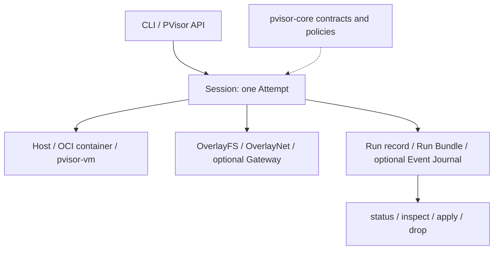

# PolicyVisor (pVisor)

**Scaling autonomous agent execution.**

PolicyVisor (pVisor) manages execution for Agent CLIs, scripts, and automation
commands. The **p** stands for **Policy**: connect requested capabilities,
effective runtime controls, and reviewable results.

Owns one Job, its internal Run record and Attempts, capability admission,
filesystem Effects, and execution placement. It is an embeddable library, not
an application frontend. The host CLI (`pvisor`) lives in
[`pvisor-cli`](../pvisor-cli/README.md). The runtime can
place Jobs on host, native OCI container, and `pvisor-vm` executors while preserving one
Run contract.
It is not an Agent framework, an OCI runtime, or an operating system.

OverlayFS, OverlayNet, Gateway, and AgentCtl are pVisor runtime drivers.
`pvisor-core` defines Operations, Events and cross-component contracts. This crate
owns Session lifecycle, scheduling, policy adaptation and execution. The
`pvisor-cli` application owns Job lifecycle commands, the persistent Host Job
listener/worker adapters, terminal/rendering code and companion discovery.
Cache storage and node resource protocols remain runtime components; cache
argument parsing and the independent `pvisor-cache` executable live in the app.
Job commands use `pvisor`; `pvisor-daemon` owns sandbox services and its optional
pool. TUI and replay are
Job frontends, not runtime dependencies. Cross-node placement and distributed scheduling
belong to external orchestrators, not this crate.
Guest injection uses the core `pvisor` execution runtime.



| Product area | Current responsibility |
| --- | --- |
| Run lifecycle | One logical `Run`, currently one `Attempt` per execution, cancellation, deadlines, terminal publication, and parent lineage |
| Agent control | Host AgentCtl v1 for typed Job CLI authority; isolated optional Guest AgentCtl for client state, directives and cooperative quiescence |
| Capabilities | Models, tools, filesystem read/write, network, secrets, subprocess, and resources, with evidence recorded per dimension |
| Filesystem effects | Copy-on-write staging, classified review, logical checkpoint/fork, repeated selective apply, terminal apply/drop, and an apply ledger |
| Network and model access | Gateway capture plus OverlayNet policy; enforcement strength depends on executor and is never inferred from a product label |
| Execution placement | Host process, native OCI container executor, or `pvisor-vm` (Linux KVM / macOS HVF) using an OCI image, prepared rootfs, or Linux host rootfs |
| Evidence | Run Bundle, lifecycle events, capability enforcement, filesystem changes, network counters, AgentCtl observations, output, and artifact references |

With `--stage PATH`, the product loop is `RunSpec → admission → Attempt →
RunResult + private Run Bundle + staged Effects → review/apply/drop`. Ordinary
host Jobs without staging write through to the workspace. `--safe` and `--ask`
retain the workspace stage in Job storage by default; `--stage PATH` selects
another location. HOME and VM rootfs writes have separate lifetimes; see
[staging and storage](../../docs/src/en/reference/cli.md#staging-and-storage).
Capture is a Gateway capability, not a second product.

Admission carries the final network configuration into every Attempt driver;
preparation does not re-resolve policy from mutable Run metadata or configuration.
Guest workspace overlays require `RunExecutor::supports_guest_workspace_overlay`
(default false), independently of VM network attachment support. Executor names
remain persisted descriptions, not runtime capability checks.

Containers use the host architecture. `--container-platform` (configuration:
`container.platform = "linux-amd64"` or `"linux-arm64"`) optionally asserts that
native platform; an explicit non-native selection is rejected before execution,
including with a prepared rootfs or custom injected pVisor. It does not enable
cross-platform emulation or artifact auto-discovery. A configured platform also
requires the container executor rather than being ignored by host/VM execution.
Without the option, image preparation and container execution use the native platform.

## Explicit runtime experiments

Runtime feature names and metadata live in `src/features.rs::REGISTRY`, with
`name`, `stage`, `default` and `description`. This registry does not imply
upstream Codex behavior or compatibility. Runtime features are not Cargo build
features.

```bash
pvisor feature                       # name / stage / default / enabled / description
pvisor feature list --json           # same list as a JSON array
pvisor --feature workload-aware-memory-offloading feature --json
pvisor --feature workload-aware-memory-offloading run --executor vm -- /bin/sleep 10
pvisor run --executor vm --feature workload-aware-memory-offloading -- /bin/sleep 10
pvisor --feature workload-aware-memory-offloading --executor vm -- /bin/sleep 10
```

`--feature NAME` is global, repeatable, accepts comma-separated names and rejects
unknown names. Arguments after `--` belong to the guest and are never feature
options. Feature queries run locally without starting/contacting the Host Job
service. Their `enabled` column means registry defaults plus this invocation's
CLI enables, not a live VM status or a scan of personal/project config files.
Global enables are supported by `run` and feature queries, not other Job actions
or extensions; extension arguments and help requests are forwarded to
companions. Companion help also supports leading feature options, without
forwarding those options as runtime enables; use `pvisor help COMMAND` or
`pvisor COMMAND --help`.

Run TOML supports strict bool keys in a centralized table:

```toml
[run]
executor = "vm"
command = ["/bin/sleep", "10"]

[features]
workload-aware-memory-offloading = false
```

Run configuration and personal Agent defaults are loaded during Run resolution;
omitting `--feature` preserves their value, while CLI enables override `false`.
There is no CLI disable switch yet. VM-only features require the resolved VM
executor (`--executor vm`, `--vm`, or existing VM inference/config); otherwise
execution is refused, never silently ignored or switched from host/container.
Host-only delegated JSON `--spec` cannot enable this feature.

The registered name `workload-aware-memory-offloading` (workload aware memory
offloading) registers **EXP-001 M0**, stage `experimental`, default `false`.
The former CLI/config name is rejected; there is no compatibility alias.
It travels as serialized `RunArgs.features` in the internal typed
Host request, resolves into `RunConfig.features`, and is explicitly passed through
`VmExecutor::with_features()` into `RunnerSpec.features`. Resume/execution-fork
retain the stored Run feature settings. Embedded callers use public
`features::Feature::WorkloadAwareMemoryOffloading`,
`features::FeatureSettings::workload_aware_memory_offloading` and
`VmExecutor::with_features()`; a stored RunConfig alone does not configure an
independently constructed executor.

The native runner calls `pvisor_vm::api::VcpuObservationControl::
set_vcpu_observation(true)` on the built VM handle. Failure aborts VM startup;
default-off runs do not call the observer control. Supported builds are Linux
x86_64/KVM and Apple Silicon macOS/HVF; other builds reject enabling it. This
only turns on the runtime's wait observation: it neither samples/exports
observations through CLI status nor decides guest idleness, wake deadlines, cold
reclamation, or automatic offload. Embedded callers query observations through
`vcpu_observation()`; there is no Host VM observation operation. Cold/memory
flags are independent and are not implicitly enabled. Parser/config/control unit tests are not
real-guest, macOS platform, energy/density, or upstream validation evidence.

## Host Job service and AgentCtl

All built-in Job CLI operations (`run`, `status`, `kill`, `suspend`, `resume`,
`fork`, `checkpoint`, `inspect`, `review`, `apply`, `drop`) submit typed
`pvisor-cli/src/cli/host.rs::JobCommand` requests through the on-demand persistent
listener in `pvisor-cli/src/cli/host_service.rs`. Ordinary persisted Jobs need no endpoint options or manual
service startup. Bare `pvisor` displays help; default execution via
`pvisor -- COMMAND` enters the same service. This listener is separate from
daemon sandbox/pool ownership and the independent cache; embedded `PVisor`
remains a direct API.

Host authority lives under canonical `/tmp/pvisor-host-<effective-UID>`
(usually `/private/tmp` on macOS): a same-user, non-symlink `0700` root with
`0600` sockets and generation/capability state. Kernel same-UID credentials,
frontend PID, generation and worker registration are checked before admission.
The frontend retains the terminal and spawns a listener-authorized request
worker; `SCM_RIGHTS` transfers stdio and its private channel. Cwd, environment,
stdio, cancellation and exit status remain request-local. Executors exclude the
shared authority root from guest exposure; Guest AgentCtl `Hello`/`Sync` tokens
cannot authorize Host Job, VM or daemon-supervisor operations.

Core's version-1 Host envelopes carry `request_id`, optional Job/Attempt/generation
`target`, typed commands and correlated results/errors. Core's envelope and
supervisor contracts are pure shared definitions/validation. `JobCommand`
embeds internal CLI DTOs tied to an exact schema/build, not a stable public API.
The Job listener, internal workers and daemon native supervisors use shared
`runtime/host_transport.rs` async/sync newline JSON framing and same-effective-UID
peer authentication: 1 MiB of JSON excluding the newline, consuming
only through the delimiter. `SCM_RIGHTS` FD markers are separate transport
records, not JSON. The internal version-1 handshake checks the Job ticket schema,
Cargo package version and BLAKE3 executable content digest before descriptor/
command transfer; package version alone is insufficient. Worker executable
ownership, permissions, device/inode and content are checked.

Linux hashes `/proc/self/exe`. On macOS, `pvisor-cli/src/cli/host_image.rs` compares dyld's loaded
main-image UUID with on-disk Mach-O `LC_UUID` for the matching CPU slice before
hashing the same open file. Admission requires a matching source Mach-O UUID;
missing, malformed, ambiguous or mismatched metadata fails closed. UUID
matching detects pathname replacement but does not attest loaded memory
byte-for-byte or provide kernel-pinned exec authority. The macOS platform path
remains uncompiled and untested; parser checks do not validate dyld access,
platform linking or real replacement behavior.

SIGINT/SIGTERM/SIGHUP are latched before admission; frontend and listener retain
worker/cleanup ownership and terminal restoration. Linux implements subreaper,
`/proc` descendant tracking and pidfd signalling, excluding the listener from
cleanup. macOS tracks birth-identified descendants and known workload groups
across ordinary process-group changes, freezes the root and discovered forkers,
and rescans before individually birth-checked cleanup signals. It is not limited
to the worker process group, but it cannot guarantee ownership of already-
reparented orphans missed by discovery. libproc checks followed by numeric-PID
signals are not atomic pidfd operations or Linux-equivalent containment. The
macOS cleanup path remains uncompiled and untested.

Host transport and process checks do not establish guest correctness or full
platform validation. Real-VM TUI end-to-end validation remains unavailable;
macOS identity and cleanup paths retain the platform-specific limits above.

The listener is persistent, not a durable request queue. Request IDs correlate
responses and cancellation; they do not deduplicate every operation or promise
exactly-once execution. Some durable Job operations have scoped receipts only.
Lost responses, timeouts and cancellation can follow effects; the CLI reports
ambiguity and does not automatically retry. Reconcile state before resubmitting.
Drain active requests and stop old listeners with the old binary before upgrade.
Daemon native supervisors use newline-delimited version-1 Host envelopes;
the wire is incompatible with old supervisors, so drain their sandboxes using
the old binary before upgrade too. There is no legacy fallback. See
[Host and Guest AgentCtl](../../docs/src/en/design/architecture.md#host-agentctl)
for contract bounds, ownership and limitations.

### Shared runtime implementation

`runtime/job_service.rs::RuntimeJobService` provides typed persisted-Job status,
review, apply/drop, workspace checkpoint mutations, native capture and execution
resume/fork operations without CLI argument or rendering dependencies. Request-local
`ServiceContext` hooks retain cancellation and exact Job/Attempt/generation fences;
mutations recheck admission under their leases. Capture rechecks before sending,
not after an effectful request has been sent. Scoped receipts and lost-response
ambiguity remain; this is not a universal exactly-once dispatcher.

Ordinary Job execution uses `RuntimeJobService::start_managed()` and
`ManagedJobRun`. The runtime retains the actual Attempt completion task, installs
the durable execution Job server for VM Attempts and publishes its completion
after native teardown. The server binds to the runtime's prepared record, not a
frontend selector or caller-supplied stage metadata. Non-VM Attempts retain their
Session-owned record/Bundle publication without creating an execution checkpoint
ledger. Managed VM starts require durable Run storage. The supplied `RunConfig`
is retained for execution restoration; it does not configure or replace the
caller's already-built `PVisor`.

Restored execution uses `RestoredAttempt::start_with()` to project the captured
environment and restore metadata, then enters the same managed completion path.
`ManagedRestoredRun` remains a compatibility alias for `ManagedJobRun`. Frontends
supply runtime configuration, terminal/cancellation adapters and rendering; they
do not install or finish the execution Job server. Failed handoff cancels and
drains the accepted Attempt; partially published Job state is retained for
reconciliation rather than forged into a completed receipt. Frontend wait errors
and early success cannot bypass native teardown or hide publication failures.
Dropping the managed run or its wait future requests cancellation; the completion
task retains publication ownership while its Tokio runtime remains alive. This
is not crash recovery or persistence after process/runtime shutdown. Resume/fork
do not report `Finished` solely because a launcher callback returned success.

Managed starts with durable storage also retain a private, versioned
`workspace-launch-policy.json` derived from runtime-resolved policy, not the
caller's restoration `RunConfig`. Workspace fork reconstructs supported network,
filesystem, resource and environment-projection policy without loading current
user/workspace defaults. It does not retain environment values or Gateway
credentials, and it is not an enforcement attestation. The reconstruction path
currently supports standard host execution with an OverlayNet proxy; legacy Jobs
without this snapshot and unsupported VM/container/custom executor, Gateway or
unrepresentable controls are refused before checkpoint/stage mutation rather
than silently downgraded.

Bundle validation checks identity and safety-summary consistency against recorded
executor observations; it does not authenticate the producer or prove artifact
contents. Wall-clock timestamps can move backwards and are not a monotonic audit
clock. Capture completion and replay tool receipts have narrower scopes than a
complete-run capture or an exactly-once external side-effect guarantee.

The lower-level `PVisor::run()` and `RuntimeJobService::start()` still return a bare
`RunHandle`. Embedded Attempt callers and daemon detached supervisors retain their
own lifecycle and resource ownership; they are not implicitly enrolled in the
managed Job/checkpoint server.

`AttemptService` is the shared in-process dispatcher for live status, termination
and native controls. Host VM and daemon supervisor endpoints adapt their own
command/authentication contracts to it. Termination requests cancellation, not
reaping, cgroup absence or resource-release proof. CLI `JobCommand` and daemon
Sandbox registry/lifecycle remain separate; Guest AgentCtl remains isolated.
The daemon does not acquire checkpoint/fork or apply/drop API support merely by
linking these services.

## Per-instance VM controls and memory CLI

By default every native VM Attempt gets a host-only Unix control endpoint, even
for embedded runs without retained Job storage. Embedded owners with their own
authenticated control endpoint may use `PVisorBuilder::instance_control(false)`;
a custom `control_socket` combined with this setting is rejected at admission.
Native control authority remains available through the handle/service. The daemon
uses this setting to avoid publishing a second control endpoint for the same VM. `pvisor run` prints `--vm-socket PATH
--vm-job-id ID --vm-attempt-id ID` to stderr; copy those exact values into normal
commands in another host terminal. The example root assumes Linux effective UID
`1000`; replace it and the identities with the printed values:

```bash
pvisor run --executor vm -- /bin/sleep 600
pvisor status --vm-socket /tmp/pvisor-host-1000/vm-EXAMPLE.sock --vm-job-id run-EXAMPLE --vm-attempt-id attempt-EXAMPLE
pvisor suspend run-EXAMPLE --vm-socket /tmp/pvisor-host-1000/vm-EXAMPLE.sock --vm-job-id run-EXAMPLE --vm-attempt-id attempt-EXAMPLE --vm-pause
pvisor resume run-EXAMPLE --vm-socket /tmp/pvisor-host-1000/vm-EXAMPLE.sock --vm-job-id run-EXAMPLE --vm-attempt-id attempt-EXAMPLE --vm-load
pvisor suspend run-EXAMPLE --vm-socket /tmp/pvisor-host-1000/vm-EXAMPLE.sock --vm-job-id run-EXAMPLE --vm-attempt-id attempt-EXAMPLE --vm-offload --vm-ram-file /private/vm-ram/offloaded.ram
pvisor resume run-EXAMPLE --vm-socket /tmp/pvisor-host-1000/vm-EXAMPLE.sock --vm-job-id run-EXAMPLE --vm-attempt-id attempt-EXAMPLE --vm-load
```

The live VM flags are command-local: `status` accepts only `--vm-socket`,
`--vm-job-id` and `--vm-attempt-id`; `suspend` accepts those identity flags plus
`--vm-pause`, `--vm-offload` and `--vm-ram-file`; `resume` accepts the identity
flags plus `--vm-load`. Place them after the command. Root-prefixed live VM
flags and live VM flags on other commands are rejected.

All three addressing options are required together, including
for live `status`; suspend/resume's positional selector must match `--vm-job-id`.
Only `status`, `suspend --vm-pause` / `--vm-offload` and `resume --vm-load` support
live mode. Pause and offload are mutually exclusive. `--vm-ram-file` requires
`--vm-offload`; omit it to use the current backing, or provide a new
guest-inaccessible path on the same filesystem. `--vm-load` selects
`HostVmCommand::Resume`, mapped to `RunResume` of the same live Attempt; there is
no `Load` wire operation. It is not a persistent snapshot restart or eager RAM
prefault. Without live options, persisted-Job suspend/resume retain their
checkpoint capture/restoration behavior. Pause stops vCPUs; offload uses the
stronger CPU/device quiescence boundary. Successful live replies are JSON;
typed Host errors and transport/parsing failures exit nonzero but need not
produce JSON. Non-VM controls are unsupported, not signal emulation.

Core's `host_protocol` defines `HostVmCommand` and `HostVmResult`; this crate
exports them with the Host envelopes and `host_vm_exchange` for embedded callers.
The exchange takes an `AgentCtlHostRequest<HostVmCommand>` and returns an
`AgentCtlHostResponse<HostVmResult>`. Successful CLI output contains the result's
`status` and `value` fields.

| Run CLI | `[vm]` field | Default |
| --- | --- | --- |
| `--vm-control-socket PATH` | `control_socket` | Unset: CLI automatic `/tmp/pvisor-host-<effective-UID>/vm-<UUID>.sock` (canonical `/tmp`) |
| `--vm-ram-backing FILE` | `ram_backing` | Unset: attempt-local file in ordinary file-backed mode |
| `--vm-ram-compression[=BOOL]` | `ram_compression` | `false`; FUSE/macFUSE backing |
| `--vm-cold-ram-compression[=BOOL]` | `cold_ram_compression` | `false`; Linux x86_64 local cold pager |
| `--vm-ram-dedup[=BOOL]` | `ram_dedup` | `false`; best-effort host advice |
| `--vm-memory-pool SOCKET` | `memory_pool` | Unset; experimental Apple Silicon pool, unsupported on Linux |
| `--vm-node-socket SOCKET` | `node_socket` | Unset; same-host resource service |
| `--vm-snapshot-filesystem-pool DIR` | `snapshot_filesystem_pool` | Unset; Linux x86_64 no-network native checkpoint lower pool |

Boolean flags accept bare=true or `=true` / `=false`; omission preserves config.
True flags and explicit path options infer VM when `--executor` is omitted;
`=false` alone does not. Explicit executors are not silently replaced. Path
options override only their corresponding field. A custom CLI control path must
be directly under the canonical private Host service root. The root must be
non-symlink, same-effective-UID and exactly `0700`; arbitrary private parents
are rejected by CLI workers. Embedded callers retain private custom-parent validation and
automatic private `vm-*` directories under the authority root. Existing paths
are never overwritten. The `0600` socket accepts same-UID peers and is removed
at Attempt termination. It must never be guest-accessible, including in
host-rootfs VMs; the host parent provides executor exclusions. It is separate
from staged Job control and is not exported as a guest discovery file.
`--vm-control-socket` selects the creation path; `--vm-socket` addresses a live
endpoint. The command-local live addressing/action options are not `[vm]` fields.

The local cold pager has one combined reclaim/compression toggle; it conflicts
with dedup, file/FUSE backing, external pools, snapshot capture/restore, snapshot
filesystem pools and whole-VM offload. Dedup conflicts with both compression
modes and external pools. The snapshot filesystem pool must be host-owned,
outside VM-writable roots and snapshot stores, and on the Job's volume. Conflicts
apply after config/CLI merging. Existing storage/control tests and compressed
artifacts provide limited evidence, not end-to-end guest correctness or memory
savings; compressed exit still does not commit writes after the last resume.
See the [CLI commands and limits](../../docs/src/en/reference/cli.md#vm-instance-control)
and [configuration example](../../docs/src/en/reference/config.md#vm-control-memory).

## Resource ownership and local cold compression

`pvisor-daemon serve --memory-pool` enables the daemon-owned experimental pool;
the daemon starts or reuses its detached `pvisor-daemon memory-pool --directory DIR`
component. Keep the pool alive until dependent VMs exit; API restart does not
provide pool-process or host-reboot recovery. Reserve pool/host overhead outside
sandbox admission limits. See the [daemon boundary](../pvisor-daemon/README.md).

`pvisor-cache` remains independent, with `prepare`, `publish`, `serve`, `list`,
`stat` and `read`. Node runtime protocols own immutable mounts and snapshot
RAM with same-user authorization, compatibility checks and connection pins.
The daemon has no node acquire/release adapter. Embedded callers retain explicit
resource ownership and must release consumers before backing owners.

Linux x86_64 also has default-off experimental instance-local live cold
compression: `VmSettings.cold_ram_compression` / `[vm].cold_ram_compression` or
`pvisor run --vm-cold-ram-compression -- COMMAND`. The flag selects VM execution;
the runner automatically starts the runtime-owned userfaultfd pager over private
anonymous ordinary RAM using `LocalColdRamStore`, without a live backing file,
FUSE or a service. This is separate from `vm.ram_compression` (FUSE backing).
Kernel-fault syscall or `/dev/userfaultfd` authority is required; compiled support
is not permission, and missing authority fails startup without fallback or global
sysctl changes. Linux external `memory_pool` is deliberately unsupported.

The store rejects raw/poorly compressed blocks, caps encoded payload at half
configured RAM and bounds object count by the configured 64 KiB block count.
Two quiescence windows capture/recheck bounded batches before discard; validated
`UFFD_COPY` restores refaults. Guest execution continues between windows without
guest application participation; this is experimental eviction/refault probing,
not ordinary pause or a read-access heat detector. Admission rejects dedup,
file/FUSE backing, snapshot capture/restore and whole-VM offload combinations.
See [local compression](../../docs/src/en/design/memory-optimization/compression-local.md)
for user-specific device ACLs, restricted mappings/build features and ownership.
This delivers an experimental mechanism, not a production-density claim; sealed
`memfd` pooling remains proposed.

The daemon's VM-only `NativeRuntime` embeds this crate in detached supervisor
subprocesses. Its CLI uses explicit flags.
The daemon API has no stage/apply or checkpoint/fork implementation. The daemon
is a separate executable linking `pvisor` and `pvisor-core`; synchronous internal
VM dispatch runs before Tokio. Packaging does not supply or validate the
prepared-image bootstrap, SDK conformance or density.

## Source and application boundary

Runtime APIs are exported explicitly from `src/lib.rs`: `PVisor`, Session/Attempt
handles, configuration and feature settings, `job_service`, durable Job/checkpoint
records, transport, and filesystem review primitives. The implementation module
`runtime` remains private. The runtime library has no Clap dependency and does
not depend on `pvisor-cli`; application enums are parsed by app-local Clap
adapters. Clap is retained only as a development dependency for standalone
runtime demonstration/measurement examples.

Journal storage and trace production use `pvisor_journal::api::{JournalStore,
TraceProducer}` alongside the opaque `Journal` and `Trace` owners. The existing
`trace` module explicitly re-exports these contracts; trace identity is immutable
and supplied through `Trace::with_id` when it must match a Run. Durable filesystem
barriers call `Persistence` through `DurableFiles` directly, while runtime JSON
publication and Run persistence diagnostics retain their own helpers.

Application sources live under `../pvisor-cli/`: `src/cli/`, `src/companions.rs`,
`src/tui/`, and four entries in `src/bin/`: `pvisor`, `pvisor-cache`, `pvisor-tui`
and `pvisor-replay`. Daemon pool lifecycle belongs in
`../pvisor-daemon/src/memory_pool.rs`; node protocols remain in `src/node.rs`
and `src/node/`. Feature listing and cache argument
parsing also live in the application. Executable-dependent integration tests
live in its `tests/`; runtime-only tests remain here. Tests combining command
execution with runtime APIs link both crates from the application test suite.
The detailed command, platform, storage and memory limits above remain relevant
to embedded callers where they describe runtime behavior, and to the installed
application where they describe frontend behavior.

## Develop

```bash
just build release          # release build + macOS Hypervisor signing
just build    # debug build + macOS signing
just test pvisor            # runtime tests
just test pvisor-cli        # application/executable tests
just examples
```

On macOS, source builds that use HVF must be signed. `just build release` does this;
the equivalent entitlements file is `macos-hypervisor.entitlements`. The embedded
`pvisor-guest` supervisor is built as a static Linux musl ELF
with Rust's bundled linker. On Apple Silicon, install its stdlib once with
`rustup target add aarch64-unknown-linux-musl`. It launches workloads directly,
without a shell helper, and reports their exit codes through the VM runtime's root filesystem ioctl.

The Rust `pvisor-vm` runtime is linked into `pvisor`, with KVM on Linux and
HVF on macOS. Its implementation derives from libkrun components, but no separate
vendored libkrun `rlib`, `libkrun.so` or `libkrun.dylib` is required. The separate guest
kernel is embedded in Linux static musl builds; macOS loads `libkrunfw.5.dylib`
at runtime. Linux source builds require Zig, `cargo-zigbuild`, and
`rustup target add x86_64-unknown-linux-musl`. Use `just build` so target
selection and kernel preparation match release builds.

## Links

- [Operation and Event](../../docs/src/zh/design/operations-events.md): operation requests, actual rewrites,
  VM/Overlay placement, execution facts and boundary observations.
- [The PolicyVisor model](../../docs/src/zh/start/what-is-pvisor.md)
- [Get started](../../docs/src/en/start/first-run.md)
- [Isolation architecture](../../docs/src/zh/design/isolation.md)
- [Gateway architecture](../../docs/src/zh/design/gateway.md)
- [OverlayNet architecture](../../docs/src/zh/design/overlaynet.md)
- [pVisor CLI](../../docs/src/en/reference/cli.md)
- [System architecture](../../docs/src/zh/design/architecture.md)
- [`pvisor-overlayfs`](../pvisor-overlayfs/README.md)
- [`pvisor-overlaynet`](../pvisor-overlaynet/README.md)
- [`pvisor-gateway`](../pvisor-gateway/README.md)
- [`pvisor-core`](../pvisor-core/README.md)
