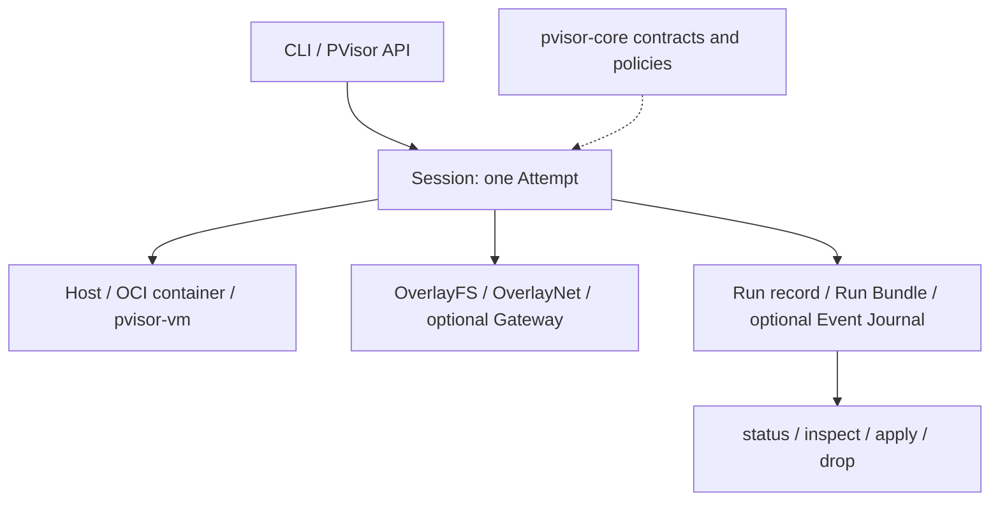

# PolicyVisor (pVisor)

**Scaling autonomous agent execution.**

PolicyVisor (pVisor) manages execution for Agent CLIs, scripts, and automation
commands. The **p** stands for **Policy**: connect requested capabilities,
effective runtime controls, and reviewable results.

Owns one Job, its internal Run record and Attempts, capability admission,
filesystem Effects, execution placement, and the host CLI (`pvisor`). It can
place Jobs on host, native OCI container, and `pvisor-vm` executors while preserving one
Run contract.
It is not an Agent framework, an OCI runtime, or an operating system.

OverlayFS, OverlayNet, Gateway, and AgentCtl are pVisor runtime drivers.
`pvisor-core` defines Operations, Events and cross-component contracts. This crate
owns Session lifecycle, scheduling, policy adaptation and execution. Job lifecycle
commands are built into `pvisor`; local node lifecycle, cache and memory-pool
tools are grouped under `pvisor service`, while TUI and replay are optional Job
frontends found beside it. The old Cluster Controller/Worker control plane and
`pvisor-worker` executable have been retired from this crate.
Guest injection uses the core `pvisor` execution runtime.



| Product area | Current responsibility |
| --- | --- |
| Run lifecycle | One logical `Run`, currently one `Attempt` per execution, cancellation, deadlines, terminal publication, and parent lineage |
| Agent control | Optional authenticated AgentCtl v1 for Sessions, client state, directives, and cooperative quiescence |
| Capabilities | Models, tools, filesystem read/write, network, secrets, subprocess, and resources, with evidence recorded per dimension |
| Filesystem effects | Copy-on-write staging, classified review, logical checkpoint/fork, repeated selective apply, terminal apply/drop, and an apply ledger |
| Network and model access | Gateway capture plus OverlayNet policy; enforcement strength depends on executor and is never inferred from a product label |
| Execution placement | Host process, native OCI container executor, or `pvisor-vm` (Linux KVM / macOS HVF) using an OCI image, prepared rootfs, or Linux host rootfs |
| Evidence | Run Bundle, lifecycle events, capability enforcement, filesystem changes, network counters, AgentCtl observations, output, and artifact references |

With `--stage PATH`, the product loop is `RunSpec → admission → Attempt →
RunResult + private Run Bundle + staged Effects → review/apply/drop`. Ordinary
host Jobs without staging write through to the workspace. `--safe` and `--ask`
retain the workspace stage in Job storage by default; `--stage PATH` selects
another location. HOME and VM rootfs writes have separate lifetimes; see
[staging and storage](../../docs/src/en/reference/cli.md#staging-and-storage).
Capture is a Gateway capability, not a second product.

Admission carries the final network configuration into every Attempt driver;
preparation does not re-resolve policy from mutable Run metadata or configuration.
Guest workspace overlays require `RunExecutor::supports_guest_workspace_overlay`
(default false), independently of VM network attachment support. Executor names
remain persisted descriptions, not runtime capability checks.

Containers use the host architecture. `--container-platform` (configuration:
`container.platform = "linux-amd64"` or `"linux-arm64"`) optionally asserts that
native platform; an explicit non-native selection is rejected before execution,
including with a prepared rootfs or custom injected pVisor. It does not enable
cross-platform emulation or artifact auto-discovery. A configured platform also
requires the container executor rather than being ignored by host/VM execution.
Without the option, native image preparation and container execution are unchanged.

## Per-instance VM controls and memory CLI

Every native VM Attempt gets a host-only Unix control endpoint, even without
retained Job storage. `pvisor run` prints `--socket PATH --run-id ID --attempt-id ID`
to stderr; copy those exact values into `pvisor ctrl` in another host terminal:

```bash
pvisor run --executor vm -- /bin/sleep 600
pvisor ctrl --socket /tmp/pvctrl-EXAMPLE/ctrl.sock --run-id run-EXAMPLE --attempt-id attempt-EXAMPLE status
pvisor ctrl --socket /tmp/pvctrl-EXAMPLE/ctrl.sock --run-id run-EXAMPLE --attempt-id attempt-EXAMPLE pause
pvisor ctrl --socket /tmp/pvctrl-EXAMPLE/ctrl.sock --run-id run-EXAMPLE --attempt-id attempt-EXAMPLE resume
pvisor ctrl --socket /tmp/pvctrl-EXAMPLE/ctrl.sock --run-id run-EXAMPLE --attempt-id attempt-EXAMPLE offload --file /private/vm-ram/offloaded.ram
pvisor ctrl --socket /tmp/pvctrl-EXAMPLE/ctrl.sock --run-id run-EXAMPLE --attempt-id attempt-EXAMPLE load
```

Replace example identities with the stderr values. All three identity arguments
are required, including for `status`. Only `offload` accepts optional `--file`;
omit it to use the current backing, or provide a new guest-inaccessible path on
the same filesystem. `load` maps to `RunResume` of the same live Attempt, not a
persistent snapshot restart or eager RAM prefault. Pause stops vCPUs; offload
uses the stronger CPU/device quiescence boundary. Rejected operations produce
JSON `ok: false` replies and nonzero exits; transport/parsing failures need not
produce JSON. Non-VM controls are explicitly unsupported, not signal emulation.

| Run CLI | `[vm]` field | Default |
| --- | --- | --- |
| `--vm-control-socket PATH` | `control_socket` | Unset: automatic private `/tmp/pvctrl-*/ctrl.sock` |
| `--vm-ram-backing FILE` | `ram_backing` | Unset: attempt-local file in ordinary file-backed mode |
| `--vm-ram-compression[=BOOL]` | `ram_compression` | `false`; FUSE/macFUSE backing |
| `--vm-cold-ram-compression[=BOOL]` | `cold_ram_compression` | `false`; Linux x86_64 local cold pager |
| `--vm-ram-dedup[=BOOL]` | `ram_dedup` | `false`; best-effort host advice |
| `--vm-memory-pool SOCKET` | `memory_pool` | Unset; experimental Apple Silicon pool, unsupported on Linux |
| `--vm-node-socket SOCKET` | `node_socket` | Unset; same-host resource service |
| `--vm-snapshot-filesystem-pool DIR` | `snapshot_filesystem_pool` | Unset; Linux x86_64 no-network native checkpoint lower pool |

Boolean flags accept bare=true or `=true` / `=false`; omission preserves config.
True flags and explicit path options infer VM when `--executor` is omitted;
`=false` alone does not. Explicit executors are not silently replaced. Path
options override only their corresponding field. A custom control parent must
already exist, be non-symlink, same-effective-UID and exactly `0700`; existing
paths are never overwritten. The `0600` socket accepts same-UID peers and is
removed at Attempt termination. It must never be guest-accessible, including in
host-rootfs VMs; the host parent provides executor exclusions. It is separate
from staged Job control and is not exported as a guest discovery file.

The local cold pager has one combined reclaim/compression toggle; it conflicts
with dedup, file/FUSE backing, external pools, snapshot capture/restore, snapshot
filesystem pools and whole-VM offload. Dedup conflicts with both compression
modes and external pools. The snapshot filesystem pool must be host-owned,
outside VM-writable roots and snapshot stores, and on the Job's volume. Conflicts
apply after config/CLI merging. Existing storage/control tests and compressed
artifacts provide limited evidence, not end-to-end guest correctness or memory
savings; compressed exit still does not commit writes after the last resume.
See the [CLI commands and limits](../../docs/src/en/reference/cli.md#vm-instance-control)
and [configuration example](../../docs/src/en/reference/config.md#vm-control-memory).

## Local service boundary

`pvisor service run --config service.toml` supervises local resource owners;
`status`, `restart ROLE` and `stop [--role ROLE]` manage their lifecycle. The
`node` role shares immutable image mounts and snapshot RAM while retaining
same-user authorization, compatibility checks and active-pin restart/stop
fences. The optional `pool` role serves the experimental Apple Silicon cold-page
pool. `service cache` and `service memory-pool` dispatch their installed tools.

Linux x86_64 also has default-off experimental instance-local live cold
compression: `VmSettings.cold_ram_compression` / `[vm].cold_ram_compression` or
`pvisor run --vm-cold-ram-compression -- COMMAND`. The flag selects VM execution;
the runner automatically starts the runtime-owned userfaultfd pager over private
anonymous ordinary RAM using `LocalColdRamStore`, without a live backing file,
FUSE or a service. This is separate from `vm.ram_compression` (FUSE backing).
Kernel-fault syscall or `/dev/userfaultfd` authority is required; compiled support
is not permission, and missing authority fails startup without fallback or global
sysctl changes. Linux external `memory_pool` is deliberately unsupported.

The store rejects raw/poorly compressed blocks, caps encoded payload at half
configured RAM and bounds object count by the configured 64 KiB block count.
Two quiescence windows capture/recheck bounded batches before discard; validated
`UFFD_COPY` restores refaults. Guest execution continues between windows without
guest application participation; this is experimental eviction/refault probing,
not ordinary pause or a read-access heat detector. Admission rejects dedup,
file/FUSE backing, snapshot capture/restore and whole-VM offload combinations.
See [local compression](../../docs/src/en/design/memory-optimization/compression-local.md)
for user-specific device ACLs, restricted mappings/build features and ownership.
This delivers an experimental mechanism, not a production-density claim; sealed
`memfd` pooling remains proposed.

A minimal configuration is:

```toml
state = '.pvisor/services'

[node]
cache_backend = 'filesystem'
cache_location = 'cache'
snapshot_roots = ['snapshots']
```

Paths resolve relative to the configuration file; node state/socket paths resolve
under service state. Linux deployments can set `cgroup_root = ':self:'` **before
`[node]`**, using a real delegated unified cgroup v2 hierarchy. Service limits
remain installed before child execution, with positive per-role `[limits.node]`
(and optional `[limits.pool]`) budgets. Without delegation, process ownership is
not evidence of kernel-enforced limits. Resource owners are not transparently
recoverable after a crash; drain pins before restart/stop. Node pin checks do not
prove the pool has no direct VM clients. Drain those clients separately: SIGINT
puts the pool into draining, and a stop timeout can leave it rejecting new clients
while retaining existing data owners.

`controller`, `worker` and `workers` configuration keys are rejected, including
empty legacy sections/lists. There is no implicit migration to a new scheduler.
`pvisor service daemon ...` passes arguments unchanged to a trusted, separately
installed `pvisor-daemon` beside `pvisor`; it does not add a daemon role to this
configuration or link a daemon dependency. The daemon's VM-only `NativeRuntime`
embeds this crate in detached supervisor subprocesses. The daemon CLI is wired
to that runtime; companion dispatch does not automatically acquire node sharing
resources. The daemon API has no stage/apply or checkpoint/fork implementation.

Cluster-only tests and fixtures are retired. Local service tests retain delegated
limits, cleanup, shared image pins and shared RAM/COW ownership fences. The
mixed service gate's two-guest private-write checks now use native local Jobs
with retained node image pins, without a Controller or Worker. Native
Job checkpoint/fork/suspend/resume tests and snapshot/cache/rootless tests remain;
`native_cpu_qos` preserves the real anchor lifecycle gate using `pvisor` itself.

### Build and validation boundary

The current root `service-build` already selects local binaries and builds the
daemon separately; the old `test-service` / `test-service-vm` recipes are absent.
The ignored local gates need explicit selection in a future root test recipe;
their environment requirements remain in the test annotations. Install
`pvisor-daemon` beside `pvisor` if companion dispatch is desired. The root
Cluster alias and daemon legacy feature have been removed; the daemon remains
a separate executable. Cargo links `pvisor` and `pvisor-core`; synchronous internal
VM dispatch runs before Tokio, and hidden supervisor dispatch is implemented.
Packaging includes both executables, but does
not supply or validate the prepared-image bootstrap, SDK conformance or density.
See the [daemon boundary](../pvisor-daemon/README.md).

## Develop

```bash
just build release          # release build + macOS Hypervisor signing
just build    # debug build + macOS signing
just test pvisor
just examples
```

On macOS, source builds that use HVF must be signed. `just build release` does this;
the equivalent entitlements file is `macos-hypervisor.entitlements`. The embedded
`pvisor-guest` supervisor is built as a static Linux musl ELF
with Rust's bundled linker. On Apple Silicon, install its stdlib once with
`rustup target add aarch64-unknown-linux-musl`. It launches workloads directly,
without a shell helper, and reports their exit codes through the VM runtime's root filesystem ioctl.

The Rust `pvisor-vm` runtime is linked into `pvisor`, with KVM on Linux and
HVF on macOS. Its implementation derives from libkrun components, but no separate
vendored libkrun `rlib`, `libkrun.so` or `libkrun.dylib` is required. The separate guest
kernel is embedded in Linux static musl builds; macOS loads `libkrunfw.5.dylib`
at runtime. Linux source builds require Zig, `cargo-zigbuild`, and
`rustup target add x86_64-unknown-linux-musl`. Use `just build` so target
selection and kernel preparation match release builds.

## Links

- [Operation and Event](../../docs/src/zh/design/operations-events.md): operation requests, actual rewrites,
  VM/Overlay placement, execution facts and boundary observations.
- [The PolicyVisor model](../../docs/src/zh/start/what-is-pvisor.md)
- [Get started](../../docs/src/en/start/first-run.md)
- [Isolation architecture](../../docs/src/zh/design/isolation.md)
- [Gateway architecture](../../docs/src/zh/design/gateway.md)
- [OverlayNet architecture](../../docs/src/zh/design/overlaynet.md)
- [pVisor CLI](../../docs/src/en/reference/cli.md)
- [System architecture](../../docs/src/zh/design/architecture.md)
- [`pvisor-overlayfs`](../pvisor-overlayfs/README.md)
- [`pvisor-overlaynet`](../pvisor-overlaynet/README.md)
- [`pvisor-gateway`](../pvisor-gateway/README.md)
- [`pvisor-core`](../pvisor-core/README.md)
