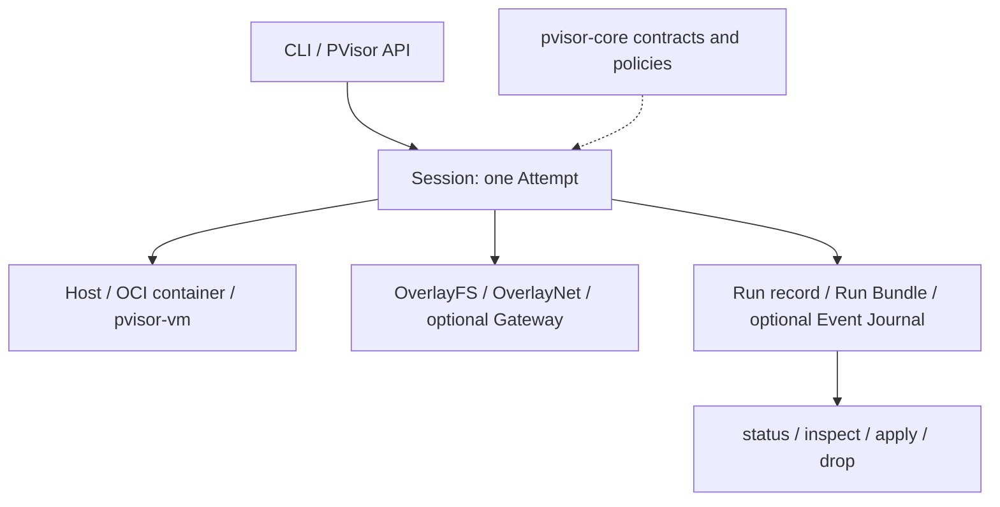

# PolicyVisor (pVisor)

**Scaling autonomous agent execution.**

PolicyVisor (pVisor) manages execution for Agent CLIs, scripts, and automation
commands. The **p** stands for **Policy**: connect requested capabilities,
effective runtime controls, and reviewable results.

Owns one Job, its internal Run record and Attempts, capability admission,
filesystem Effects, and execution placement. It is an embeddable library, not
an application frontend. The host CLI (`pvisor`) lives in
[`pvisor-cli`](../pvisor-cli/README.md). The runtime can
place Jobs on host, native OCI container, and `pvisor-vm` executors while preserving one
Run contract.
It is not an Agent framework, an OCI runtime, or an operating system.

OverlayFS, OverlayNet, Gateway, and AgentCtl are pVisor runtime drivers.
`pvisor-core` defines Operations, Events and cross-component contracts. This crate
owns Session lifecycle, scheduling, policy adaptation and execution. The
`pvisor-cli` application owns Job lifecycle commands, the per-Job owner
bootstrap, terminal/rendering code and companion discovery.
Cache storage and node resource protocols remain runtime components; cache
argument parsing lives under `pvisor cache` in the app; `pvisor-daemon serve --cache`
owns the server entry point.
Job commands use `pvisor`; `pvisor-daemon` owns cache and sandbox services and its optional
pool. TUI and replay are
Job frontends, not runtime dependencies. Cross-node placement and distributed scheduling
belong to external orchestrators, not this crate.
Guest injection uses the core `pvisor` execution runtime.


```mermaid
flowchart TD
    Entry[CLI / PVisor API] --> Session[Session: one Attempt]
    Core[pvisor-core contracts and policies] -.-> Session
    Session --> Executor[Host / OCI container / pvisor-vm]
    Session --> Drivers[OverlayFS / OverlayNet / optional Gateway]
    Session --> Records[Run record / Run Bundle / optional Event Journal]
    Records --> Review[status / inspect / apply / drop]
```

| Product area | Current responsibility |
| --- | --- |
| Run lifecycle | One logical `Run`, currently one `Attempt` per execution, cancellation, deadlines, terminal publication, and parent lineage |
| Agent control | Host AgentCtl v1 for typed Job CLI authority; isolated optional Guest AgentCtl for client state, directives and cooperative quiescence |
| Capabilities | Models, tools, filesystem read/write, network, secrets, subprocess, and resources, with evidence recorded per dimension |
| Filesystem effects | Copy-on-write staging, classified review, logical checkpoint/fork, repeated selective apply, terminal apply/drop, and an apply ledger |
| Network and model access | Gateway capture plus OverlayNet policy; enforcement strength depends on executor and is never inferred from a product label |
| Execution placement | Host process, native OCI container executor, or `pvisor-vm` (Linux KVM / macOS HVF) using an OCI image, prepared rootfs, or Linux host rootfs |
| Evidence | Run Bundle, lifecycle events, capability enforcement, filesystem changes, network counters, AgentCtl observations, output, and artifact references |

With `--stage PATH`, the product loop is `RunSpec → admission → Attempt →
RunResult + private Run Bundle + staged Effects → review/apply/drop`. Ordinary
host Jobs without staging write through to the workspace. `--safe` and `--ask`
retain the workspace stage in Job storage by default; `--stage PATH` selects
another location. HOME and VM rootfs writes have separate lifetimes; see
[staging and storage](../../docs/src/en/reference/cli.md#staging-and-storage).
Capture is a Gateway capability, not a second product.

Admission carries the final network configuration into every Attempt driver;
preparation does not re-resolve policy from mutable Run metadata or configuration.
Guest workspace overlays require `RunExecutor::supports_guest_workspace_overlay`
(default false), independently of VM network attachment support. Executor names
remain persisted descriptions, not runtime capability checks.

Containers use the host architecture. `--container-platform` (configuration:
`container.platform = "linux-amd64"` or `"linux-arm64"`) optionally asserts that
native platform; an explicit non-native selection is rejected before execution,
including with a prepared rootfs or custom injected pVisor. It does not enable
cross-platform emulation or artifact auto-discovery. A configured platform also
requires the container executor rather than being ignored by host/VM execution.
Without the option, image preparation and container execution use the native platform.

## Explicit runtime experiments

Runtime feature names and metadata live in `src/features.rs::REGISTRY`, with
`name`, `stage`, `default` and `description`. This registry does not imply
upstream Codex behavior or compatibility. Runtime features are not Cargo build
features.

```bash
pvisor feature                       # name / stage / default / enabled / description
pvisor feature list --json           # same list as a JSON array
pvisor --feature workload-aware-memory-offloading feature --json
pvisor --feature workload-aware-memory-offloading run --executor vm -- /bin/sleep 10
pvisor run --executor vm --feature workload-aware-memory-offloading -- /bin/sleep 10
pvisor --feature workload-aware-memory-offloading --executor vm -- /bin/sleep 10
```

`--feature NAME` is global, repeatable, accepts comma-separated names and rejects
unknown names. Arguments after `--` belong to the guest and are never feature
options. Feature queries run locally without starting a Job or contacting its
owner. Their `enabled` column means registry defaults plus this invocation's
CLI enables, not a live VM status or a scan of personal/project config files.
Global enables are supported by `run` and feature queries, not other Job actions
or extensions; extension arguments and help requests are forwarded to
companions. Companion help also supports leading feature options, without
forwarding those options as runtime enables; use `pvisor help COMMAND` or
`pvisor COMMAND --help`.

Run TOML supports strict bool keys in a centralized table:

```toml
[run]
executor = "vm"
command = ["/bin/sleep", "10"]

[features]
workload-aware-memory-offloading = false
```

Run configuration and personal Agent defaults are loaded during Run resolution;
omitting `--feature` preserves their value, while CLI enables override `false`.
There is no CLI disable switch yet. VM-only features require the resolved VM
executor (`--executor vm`, `--vm`, or existing VM inference/config); otherwise
execution is refused, never silently ignored or switched from host/container.
Host-only delegated JSON `--spec` cannot enable this feature.

The registered name `workload-aware-memory-offloading` (workload aware memory
offloading) registers **EXP-001 M0**, stage `experimental`, default `false`.
The former CLI/config name is rejected; there is no compatibility alias.
It travels as serialized `RunArgs.features` in the internal typed
Host request, resolves into `RunConfig.features`, and is explicitly passed through
`VmExecutor::with_features()` into `RunnerSpec.features`. Resume/execution-fork
retain the stored Run feature settings. Embedded callers use public
`features::Feature::WorkloadAwareMemoryOffloading`,
`features::FeatureSettings::workload_aware_memory_offloading` and
`VmExecutor::with_features()`; a stored RunConfig alone does not configure an
independently constructed executor.

The native runner calls `pvisor_vm::api::VcpuObservationControl::
set_vcpu_observation(true)` on the built VM handle. Failure aborts VM startup;
default-off runs do not call the observer control. Supported builds are Linux
x86_64/KVM and Apple Silicon macOS/HVF; other builds reject enabling it. This
only turns on the runtime's wait observation: it neither samples/exports
observations through CLI status nor decides guest idleness, wake deadlines, cold
reclamation, or automatic offload. Embedded callers query observations through
`vcpu_observation()`; there is no Host VM observation operation. Cold/memory
flags are independent and are not implicitly enabled. Parser/config/control unit tests are not
real-guest, macOS platform, energy/density, or upstream validation evidence.

## Cooperative native model waits (EXP-003 M0)

With the `gateway` Cargo feature, embedded callers can enable
`GatewayDriverConfig::native_model_wait(NativeModelWait::Pause)` or
`NativeModelWait::Offload`. The default is off. Session creates a fresh adapter
bound to the actual Run/Attempt before starting Gateway. Linux x86_64 VM execution
and an enabled Gateway are required; a custom `model_wait` lifecycle conflicts.
There is no CLI/config-file toggle for this prototype.

The trusted workload declares whole-guest quiescence with
`x-pvisor-inference-idle: true`. It must be the guest's only runnable work and
have no outstanding filesystem/device operations. Ordinary model calls retain
normal forwarding. This declaration does not discover other runnable processes
or transfer dirty guest pages. Pause stops vCPUs; Offload also uses the existing
shared file-backed RAM/device barrier. Private COW/pager RAM remains unsupported
for offload. A failed device drain fails the Attempt instead of probing idleness.

At most one declared wait is reserved per Attempt, including accepted controls
and cancellation cleanup. Foreign/missing Run or Attempt identities and parallel
waits are rejected before upstream dispatch. Entry waits for native ACK; delivery
waits for resume ACK. Buffered bodies and supplier failures use the existing
Gateway barrier; SSE resumes on its first nonempty network chunk, which may be a
heartbeat. Full inference spooling and the guest submit/wait/cancel/ack protocol
remain unimplemented.

Manual pause, resume and offload share the native transition lock and revoke the
automatic pause epoch when admitted, even if the later native operation fails.
Delivery after manual pause waits for an explicit resume or Attempt cancellation.
Dropped handlers enqueue bounded cleanup of only their own pause; uncertain
native ACKs or failed cleanup cancel the Attempt. Execution capture/suspend is
rejected while a reservation exists. The existing runtime retains resource
admission and its storage lease; this prototype does not release/reacquire CPU
reservations or introduce a scheduler lease. Control observations include
`model_wait_epoch` (null for manual operations).

`native_model_wait_case` drives a real guest through Gateway and a gated local
model supplier, with an 8 MiB guest-memory digest checked after delivery. Build
with `cargo build --locked -p pvisor --features gateway --example
native_model_wait_case`; pass `running`, `pause`, `offload`, `manual` or `cancel`
and a fresh output directory. Dynamic builds require
`PVISOR_CASE_VM_LIBRARY_DIR`; optional `PVISOR_CASE_ROOTFS` and
`PVISOR_CASE_VM_PYTHON` select guest inputs (defaults `/` and `/usr/bin/python3`).
Each run writes `result.json` with final status and control observations. These
are correctness checks, not memory-saving, throughput or density measurements.

## Job owners and AgentCtl

`pvisor run` starts a terminal frontend and one owner over an inherited private
socketpair. The owner stays in the original session, in its own process group;
Linux makes it the subreaper and retains pidfd-based descendant cleanup. For an
interactive Job the frontend gives the original controlling terminal to the
owner/workload, so terminal Ctrl-C can reach the workload, and restores the
foreground group at exit. Pipes inherit their descriptors directly. The owner
installs signal handlers before unblocking SIGINT/SIGTERM/SIGHUP. Frontend
cancellation and disconnection are handled by the owner. No user-wide Job
listener or per-command worker is required. Once the Attempt has published
terminal status, owner escalation allows the runtime's bounded RAM/macFUSE
resource teardown to finish before forced exit and Job completion publication.

Each running Job publishes `live_control` in its host-only Run record before
executor entry. It contains the canonical path, device/inode, protocol
`pvisor-instance-control-1`, owner PID, executable path and BLAKE3 digest:

```text
/tmp/pvisor-host-<UID>/jobs/<job-id>/<attempt-id>/control.sock
```

The root and every directory are owned by the effective UID, non-symlink and
`0700`; sockets are `0600`. Long Job/Attempt paths are accessed through a checked
directory descriptor rather than truncating the canonical address. Clients check
socket identity before and after connecting and authenticate the peer UID.
Executors exclude the entire private authority root from guest projections.
Guest AgentCtl tokens do not authorize Host operations. Terminal publication
clears the record and the owner removes its own socket. Embedded runs with
retained storage publish the same discovery record; runs without it are visible
to the CLI only through durable state.

Live status, kill, VM pause/resume/offload, execution checkpoint/suspend and live
inspect connect to the recorded owner. Operations execute in the binary that
started the Job. Compatible protocol versions allow a different caller binary;
an incompatible Job protocol reports that owner's binary without blocking other
Jobs. The socket accepts no terminal descriptors. It uses the existing correlated
Host envelopes and newline JSON codec, with a 1 MiB frame limit and at most eight
accepted connections. Existing native operation locks serialize transitions.
The process-local endpoint table is only an owner cache.

The runtime still retains `RunControlServer` for Overlay status/observations and
legacy inspect, plus `execution.sock` for native capture. Owner requests can still
call these internal sockets in their own process; the TUI uses Overlay
observations. Consolidating them requires migrating callers and preserving
capture receipts/locks. See [existing channels and cleanup order](../../docs/src/en/design/architecture.md#owner-internal-control).

Stopped status, review, apply, drop and inspect execute in the calling process.
Checkpoint restoration/fork starts a new owner directly. Durable operations take
exclusive `flock` on the Job root's `job.lock`: same UID, `0600`, one hard link,
no symlink. Its diagnostic record names the lock protocol, PID and operation;
unknown disk schemas refuse mutation. Different compatible binaries share this
lock. Residual lock metadata is cleared only after its process has died and no
valid live owner remains. Apply/drop refuse a valid owner that still holds stage;
the Attempt lease remains an additional fence. Read-only inspect uses the stage's
ordered lower-mutability declaration; absent or rebound declarations use Mutable.
Read-only sharing does not guarantee freshness.

The frontend verifies its loaded image before self-executing the owner. Linux
hashes `/proc/self/exe`; macOS checks the loaded Mach-O UUID against the opened
executable before hashing. This is not byte-for-byte loaded-memory attestation.
macOS retains its existing birth-identity/polling limitations: numeric signals
are not atomic pidfd operations, and already-reparented orphans missed by
discovery are not guaranteed contained. Moving the listener does not establish
new macOS isolation guarantees.

Lost responses, timeouts and cancellation may follow accepted effects.
Record-based CLI control reports uncertainty and does not automatically retry.
The explicit `--vm-socket` debug path still uses the older asynchronous exchange:
Ctrl-C does not interrupt its response wait, and disconnect errors may omit that
warning. Unifying this path is pending. Reconcile state before
resubmitting; scoped checkpoint receipts are not universal exactly-once delivery.

For upgrade, drain Jobs and stop the old `--pvisor-internal-host` with the old
binary. New CLIs never connect to `<generation>.sock`. Old records without
`live_control` expose disk state only; old running VMs are not automatically
discovered. The daemon supervisor listener, framing and admission are unchanged.

### Shared runtime implementation

`runtime/job_service.rs::RuntimeJobService` provides typed persisted-Job status,
review, apply/drop, workspace checkpoint mutations, native capture and execution
resume/fork operations without CLI argument or rendering dependencies. Request-local
`ServiceContext` hooks retain cancellation and exact Job/Attempt/generation fences;
mutations recheck admission under their leases. Capture rechecks before sending,
not after an effectful request has been sent. Scoped receipts and lost-response
ambiguity remain; this is not a universal exactly-once dispatcher.

Ordinary Job execution uses `RuntimeJobService::start_managed()` and
`ManagedJobRun`. The runtime retains the actual Attempt completion task, installs
the durable execution Job server for VM Attempts and publishes its completion
after native teardown. The server binds to the runtime's prepared record, not a
frontend selector or caller-supplied stage metadata. Non-VM Attempts retain their
Session-owned record/Bundle publication without creating an execution checkpoint
ledger. Managed VM starts require durable Run storage. The supplied `RunConfig`
is retained for execution restoration; it does not configure or replace the
caller's already-built `PVisor`.

Restored execution uses `RestoredAttempt::start_with()` to project the captured
environment and restore metadata, then enters the same managed completion path.
`ManagedRestoredRun` remains a compatibility alias for `ManagedJobRun`. Frontends
supply runtime configuration, terminal/cancellation adapters and rendering; they
do not install or finish the execution Job server. Failed handoff cancels and
drains the accepted Attempt; partially published Job state is retained for
reconciliation rather than forged into a completed receipt. Frontend wait errors
and early success cannot bypass native teardown or hide publication failures.
Dropping the managed run or its wait future requests cancellation; the completion
task retains publication ownership while its Tokio runtime remains alive. This
is not crash recovery or persistence after process/runtime shutdown. Resume/fork
do not report `Finished` solely because a launcher callback returned success.

Managed starts with durable storage also retain a private, versioned
`workspace-launch-policy.json` derived from runtime-resolved policy, not the
caller's restoration `RunConfig`. Workspace fork reconstructs supported network,
filesystem, resource and environment-projection policy without loading current
user/workspace defaults. It does not retain environment values or Gateway
credentials, and it is not an enforcement attestation. The reconstruction path
currently supports standard host execution with an OverlayNet proxy; legacy Jobs
without this snapshot and unsupported VM/container/custom executor, Gateway or
unrepresentable controls are refused before checkpoint/stage mutation rather
than silently downgraded.

Bundle validation checks identity and safety-summary consistency against recorded
executor observations; it does not authenticate the producer or prove artifact
contents. Wall-clock timestamps can move backwards and are not a monotonic audit
clock. Capture completion and replay tool receipts have narrower scopes than a
complete-run capture or an exactly-once external side-effect guarantee.

The lower-level `PVisor::run()` and `RuntimeJobService::start()` still return a bare
`RunHandle`. Embedded Attempt callers and daemon detached supervisors retain their
own lifecycle and resource ownership; they are not implicitly enrolled in the
managed Job/checkpoint server.

`AttemptService` is the shared in-process dispatcher for live status, termination
and native controls. Host VM and daemon supervisor endpoints adapt their own
command/authentication contracts to it. Termination requests cancellation, not
reaping, cgroup absence or resource-release proof. CLI `JobCommand` and daemon
Sandbox registry/lifecycle remain separate; Guest AgentCtl remains isolated.
The daemon does not acquire checkpoint/fork or apply/drop API support merely by
linking these services.

## Per-instance VM controls and memory CLI

By default every native VM Attempt gets a host-only Unix control endpoint, even
for embedded runs without retained Job storage. Embedded owners with their own
authenticated control endpoint may use `PVisorBuilder::instance_control(false)`;
a custom `control_socket` combined with this setting is rejected at admission.
Native control authority remains available through the handle/service. The daemon disables the extra instance endpoint because it already owns a
supervisor endpoint. Ordinary CLI controls discover the owner from the Job:

```bash
pvisor run --executor vm -- /bin/sleep 600
pvisor status last --json
pvisor suspend last --vm-pause
pvisor resume last
pvisor suspend last --vm-offload --vm-ram-file /private/vm-ram/offloaded.ram
pvisor resume last --vm-load
```

The live VM flags are command-local: `status` accepts only `--vm-socket`,
`--vm-job-id` and `--vm-attempt-id`; `suspend` accepts those identity flags plus
`--vm-pause`, `--vm-offload` and `--vm-ram-file`; `resume` accepts the identity
flags plus `--vm-load`. Place them after the command. Root-prefixed live VM
flags and live VM flags on other commands are rejected.

`--vm-socket` is a debugging override and requires explicit `--vm-job-id` and
`--vm-attempt-id`; a positional selector must match that explicit Job ID. Its
path must remain inside the private authority root. Normal commands need none
of these addressing options. Pause/offload are mutually exclusive;
`--vm-ram-file` requires offload. Live resume continues the same Attempt. When
there is no valid live owner, ordinary resume restores a sealed execution
checkpoint. Ordinary suspend captures an execution checkpoint and stops the
Attempt; `--vm-pause` pauses without capturing.
Pause stops vCPUs; offload uses the
stronger CPU/device quiescence boundary. Successful live replies are JSON;
typed Host errors and transport/parsing failures exit nonzero but need not
produce JSON. Non-VM controls are unsupported, not signal emulation.

Core's `host_protocol` defines `HostVmCommand` and `HostVmResult`; this crate
exports them with the Host envelopes and `host_vm_exchange` for embedded callers.
The exchange takes an `AgentCtlHostRequest<HostVmCommand>` and returns an
`AgentCtlHostResponse<HostVmResult>`. Successful CLI output contains the result's
`status` and `value` fields.

| Run CLI | `[vm]` field | Default |
| --- | --- | --- |
| `--vm-control-socket PATH` | `control_socket` | Unset: owner uses `/tmp/pvisor-host-<effective-UID>/jobs/<job-id>/<attempt-id>/control.sock` (canonical `/tmp`) |
| `--vm-ram-backing FILE` | `ram_backing` | Unset: attempt-local file in ordinary file-backed mode |
| `--vm-ram-compression[=BOOL]` | `ram_compression` | `false`; FUSE/macFUSE backing |
| `--vm-cold-ram-compression[=BOOL]` | `cold_ram_compression` | `false`; Linux x86_64 local cold pager |
| `--vm-ram-dedup[=BOOL]` | `ram_dedup` | `false`; best-effort host advice |
| `--vm-memory-pool SOCKET` | `memory_pool` | Unset; experimental Linux physical/sealed-compressed or Apple Silicon legacy pool |
| `--vm-node-socket SOCKET` | `node_socket` | Unset; same-host resource service |
| `--vm-snapshot-filesystem-pool DIR` | `snapshot_filesystem_pool` | Unset; Linux x86_64 no-network native checkpoint lower pool |

Boolean flags accept bare=true or `=true` / `=false`; omission preserves config.
True flags and explicit path options infer VM when `--executor` is omitted;
`=false` alone does not. Explicit executors are not silently replaced. Path
options override only their corresponding field. Custom CLI and embedded control
paths must remain under the canonical private Host authority root, with checked
`0700` ancestors. Existing sockets are never overwritten. The socket is removed
at termination and is never exported as guest discovery metadata.
`--vm-control-socket` selects the creation path; `--vm-socket` overrides discovery.
The command-local live addressing/action options are not `[vm]` fields.

The local cold pager has one combined reclaim/compression toggle; it conflicts
with dedup, file/FUSE backing, external pools, snapshot capture/restore, snapshot
filesystem pools and whole-VM offload. Dedup conflicts with both compression
modes and external pools. The snapshot filesystem pool must be host-owned,
outside VM-writable roots and snapshot stores, and on the Job's volume. Conflicts
apply after config/CLI merging. Existing storage/control tests and compressed
artifacts provide limited evidence, not end-to-end guest correctness or memory
savings; compressed exit still does not commit writes after the last resume.
See the [CLI commands and limits](../../docs/src/en/reference/cli.md#vm-instance-control)
and [configuration example](../../docs/src/en/reference/config.md#vm-control-memory).

## Resource ownership and local cold compression

`pvisor-daemon serve --sandbox --memory-pool` enables the daemon-owned experimental pool;
the daemon starts or reuses its detached `pvisor-daemon memory-pool --directory DIR`
component. Linux `--memory-pool-mode compressed` selects shared sealed compressed
objects instead of default physical-page sharing. Compressed clients retain
validated handles and local recovery after pool loss, while new publication
stops. Physical/legacy pool loss still fails dependent VMs. API restart does not
provide pool-process or host-reboot recovery. Reserve pool/host overhead outside
sandbox admission limits. See the [daemon boundary](../pvisor-daemon/README.md).

Physical pool publication computes the complete page identity once per incoming
page. Existing slots are compared byte-for-byte through the owner's read-only
mapping, under the pool mutex, instead of being read and hashed again. Only the
owner can write its size-sealed backing; referenced slots cannot be reused.
Client publication validation, live-RAM revalidation and checksum-verified
restore remain required. This removes redundant server work without treating
a matching digest as proof of equal contents.

Pool sessions also maintain bounded per-object local reference counts as PUT and
RELEASE complete. STATS reads these counts through weak object observers, without
rebuilding an index of every token. Local aliases are not counted as cross-session
sharing; weak observers do not keep payloads alive or change pidfd pinning.
The index is bounded by the existing per-connection reference limit and is removed
with the last local reference. Live cross-session counts remain approximate under
concurrent activity in other connections, as before.

The `pool_memory_case` engineering helper runs the same static guest byte oracle
as the Firecracker memory control through `pvisor-vm::api`. Its parent owns the
four-VM resource budget and sampling. It selects off/KSM/physical/sealed/local
mechanisms explicitly; it does not use a periodic filesystem heartbeat. The
optional `--libraries` attachment uses the existing caller-owned immutable DAX
contract, with `--buffered-libraries` selecting the same window and ordinary
guest reads. Library mode requires off and a Python rootfs/script; it does not
automatically promote mutable rootfs paths or enable DAX for normal VM launches.
The separate `--rootfs-library` mode loads `/libraries/libpayload.so` from the
ordinary overlay rootfs and accepts the usual memory modes. It needs the same
Python script/rootfs, conflicts with `--libraries` and does not attach a DAX
window. This exercises the physical pager's successful-file-READ hints through
the normal rootfs path, with full payload and private-write validation.

`pvisor cache` provides `prepare`, `publish`, `list`, `stat` and `read`;
`pvisor-daemon serve --cache` serves the cache. Node runtime protocols own immutable mounts and snapshot
RAM with same-user authorization, compatibility checks and connection pins.
The daemon has no node acquire/release adapter. Embedded callers retain explicit
resource ownership and must release consumers before backing owners.

Linux x86_64 also has default-off experimental instance-local live cold
compression: `VmSettings.cold_ram_compression` / `[vm].cold_ram_compression` or
`pvisor run --vm-cold-ram-compression -- COMMAND`. The flag selects VM execution;
the runner automatically starts the runtime-owned userfaultfd pager over private
anonymous ordinary RAM using `LocalColdRamStore`, without a live backing file,
FUSE or a service. This is separate from `vm.ram_compression` (FUSE backing).
Kernel-fault syscall or `/dev/userfaultfd` authority is required; compiled support
is not permission, and missing authority fails startup without fallback or global
sysctl changes. Linux external `memory_pool` negotiates physical-page sharing or
sealed compression; only the latter uses the 64 KiB userfaultfd pager.

The store rejects raw/poorly compressed blocks, caps encoded payload at half
configured RAM and bounds object count by the configured 64 KiB block count.
Two quiescence windows capture/recheck bounded batches before discard; validated
`UFFD_COPY` restores refaults. Guest execution continues between windows without
guest application participation; this is experimental eviction/refault probing,
not ordinary pause or a read-access heat detector. Admission rejects dedup,
file/FUSE backing, snapshot capture/restore and whole-VM offload combinations.
See [local compression](../../docs/src/en/design/memory-optimization/compression-local.md)
for user-specific device ACLs, restricted mappings/build features and ownership.
This delivers an experimental mechanism, not a production-density claim. Sealed
pool handoff and service-exit recovery have process-level tests; guest UFFD
recovery and production latency/density need separate validation.

The daemon's VM-only `NativeRuntime` embeds this crate in detached supervisor
subprocesses. Its CLI uses explicit flags.
The daemon API has no stage/apply or checkpoint/fork implementation. The daemon
is a separate executable linking `pvisor` and `pvisor-core`; synchronous internal
VM dispatch runs before Tokio. Packaging does not supply or validate the
prepared-image bootstrap, SDK conformance or density.

## Source and application boundary

Runtime APIs are exported explicitly from `src/lib.rs`: `PVisor`, Session/Attempt
handles, configuration and feature settings, `job_service`, durable Job/checkpoint
records, transport, and filesystem review primitives. The implementation module
`runtime` remains private. The runtime library has no Clap dependency and does
not depend on `pvisor-cli`; application enums are parsed by app-local Clap
adapters. Clap is retained only as a development dependency for standalone
runtime demonstration/measurement examples.

Journal storage and trace production use `pvisor_journal::api::{JournalStore,
TraceProducer}` alongside the opaque `Journal` and `Trace` owners. The existing
`trace` module explicitly re-exports these contracts; trace identity is immutable
and supplied through `Trace::with_id` when it must match a Run. Durable filesystem
barriers call `Persistence` through `DurableFiles` directly, while runtime JSON
publication and Run persistence diagnostics retain their own helpers.

Application sources live under `../pvisor-cli/`: `src/cli/`, `src/companions.rs`,
`src/tui/`, and three entries in `src/bin/`: `pvisor`, `pvisor-tui`
and `pvisor-replay`. Daemon pool lifecycle belongs in
`../pvisor-daemon/src/memory_pool.rs`; node protocols remain in `src/node.rs`
and `src/node/`. Feature listing and cache argument
parsing also live in the application. Executable-dependent integration tests
live in its `tests/`; runtime-only tests remain here. Tests combining command
execution with runtime APIs link both crates from the application test suite.
The detailed command, platform, storage and memory limits above remain relevant
to embedded callers where they describe runtime behavior, and to the installed
application where they describe frontend behavior.

## Lazy image V2

Lazy images keep the existing immutable published-image format and handles.
V2 optimizes the private host reader; it does not change OCI contents, guest
commands, copy-up/export ownership, or the physical-lower stability declaration.

- Capable TCP/Unix services advertise optional `metadata_pages` in Prepared.
  The client reads the existing 64 KiB binary B+tree and file records locally,
  including permissions, ownership and symlink metadata, instead of issuing
  Stat/List RPCs. The pinned COMMIT authenticates the checksum catalog and pages;
  only eight immutable metadata basenames are readable, with bounded ranges.
  Legacy JSON response receipts are neither trusted nor written in this mode.
  Invalid metadata propagates an error without silently falling back to RPC;
  invalid local binary cache entries may be refetched and authenticated.
  Authenticated raw pages and decoded B+tree nodes share a 256-entry LRU.
  Nodes are validated once per residency rather than decoded on every lookup;
  raw/node allocations remain budget-charged through their last active reference.
  Persistent disk caches have no aggregate eviction quota. File-content reads remain unchanged. Initial immutable-object,
  header and root-page reads are synchronous: runner lower reconstruction happens
  before Linux user-namespace setup, which requires kernel-level single-threadedness;
  joining temporary reader threads is not a safe substitute.
- Services without the capability, older private bindings and non-socket
  transports retain the RPC path. On the second uncached child lookup in a
  directory, fetch up to two validated directory metadata pages. At most 64 directories are admitted per backend
  lifetime, and only eight pages remain resident. Retained nodes and exact
  persistent positive/negative metadata hits take precedence over prefetch.
  Complete inventories can establish absence; partial, evicted or failed
  inventories fall back to exact stat. Looked-up attributes and proven negative
  results are persisted under the immutable metadata identity for remounts.
  Prefetch never downloads file content or projects speculative guest names.
- Remote list continuations are opaque and separate from local directory/FUSE
  cookies. Resume after page eviction replays from a retained boundary or zero;
  local ordinals are never passed to the portable B-tree as remote cursors.
- TCP/Unix readers negotiate framed protocol 2 with harmless Ping requests and
  reuse up to four connections per client. TCP uses NODELAY on both endpoints.
  Idle client streams expire after four seconds, before the server's five-second
  idle timeout. Authorization is checked on every envelope; bodies remain
  length-bounded and SHA-256 verified. Fully framed application errors preserve
  their error kinds and permit reuse; framing, transport or integrity errors
  discard the stream. Ordinary cache clients do not replay failed actual requests;
    the private bridge's pinned read clients have the bounded exception below.
- Protocol 1 remains one-request-per-connection. A V2 client falls back before
  sending the actual request when an old service rejects the version or closes
  the harmless handshake. Authentication failures, malformed replies and
  handshake timeouts are not downgrade signals. Filesystem/S3 object transports
  do not use the socket pool; metadata prefetch still applies.
- The service admits at most 64 connections, separates their framing/idle waits
  from 16 file workers and two preparation workers, and bounds each pending
  request queue to 16. Saturation returns a busy error or closes an unadmitted
  connection; callers must handle these failures. Idle connections and long
  preparations do not occupy file workers.

The Linux private host-network bridge accepts envelope 1 (one exchange) and
2 (sequential persistent exchanges). It admits at most 32 connection handlers,
separates frame/idle/write waits from four execution workers, and bounds queued
requests to 16. Queue saturation returns a framed busy error; unadmitted
connections close. Each exchange is confined to the pinned immutable handle
and metadata whitelist. Bridge V2 is enabled by default. On both bridge hops,
private clients retry an exact-handle Stat/List/Read or whitelisted Metadata at
most once on EOF, broken/reset/aborted/disconnected transport or connect refusal.
The failed lease is released, and retry uses a fresh stream (negotiated V2, or
already-established V1 fallback). Pool wait, connect, handshake and body I/O
share the original per-hop deadline. Timeout, busy/not-found/auth errors,
malformed frames/digest declarations and verified-body digest mismatches are
not retryable. Prepare/Open and ordinary clients retain no-replay semantics.
Old private bindings without retry context default to no replay.

The allowance is per hop, not a propagated end-to-end budget: failure on both
legs can produce up to four upstream read attempts. A downstream timeout does
not cancel already queued/executing upstream work, whose outcome may be unknown.
Only immutable read operations qualify; no mutation is replayed. Detached bridge
threads live in the dedicated child process, never the pre-namespace VM runner.

For private engineering A/B, `PVISOR_LAZY_BRIDGE_V2=0` retains the previous
single-exchange bridge and socket-worker scheduling independently of upstream
V2. Optional `PVISOR_LAZY_BRIDGE_METRICS_DIR` must name an existing same-user
private directory. Bridge-created shared counter files contain only aggregate
counts/timings, not credentials or image paths; read after process teardown.
Live snapshots are approximate, killed-process gauges may remain nonzero,
and files are not reboot-durable. The benchmark caller owns file cleanup.

V2 is enabled by default. For engineering comparison only, set
`PVISOR_LAZY_IMAGE_V2=0` before constructing the client and VM runner to disable
client index pages, metadata prefetch and connection reuse; other values retain
V2. Set `PVISOR_LAZY_INDEX_PAGES=0` with V2 enabled to retain the previous
RPC/prefetch path and pooling. These are private
rollout/benchmark overrides, not a persisted image-format version or CLI feature.
Both A/B modes retain the shared pagination and correctness fixes. The inherited
host environment carries the setting through private runner reconstruction.
See `benchmark/pvisor/lazy_image_v2.py` for same-artifact NumPy A/B; historical
Docker measurements are a different cohort. Contract tests cover real portable
pagination, negative-cache remounts, bounded prefetch, Unix/TCP framing, legacy
fallback and concurrent service progress. Linux KVM performance measurements do
not establish macOS/HVF, live S3 or WAN coverage.

## Physical lower stability (explicit experiment contract)

Embedded callers may set `OverlayHint::lower_mutability` to a per-physical-lower
`Vec<pvisor_overlay_core::LayerMutability>` in `lower_dirs` order. Empty defaults
to all mutable. Attempt preparation validates nonempty length and exact canonical
identity/order against the final normalized stack; promises cannot silently
transfer to inserted targets or frozen copies. Host mounts receive the declarations
through `OverlayMountConfig`; native VM handoff serializes `lower_mutability`
alongside `lowers`, retains it in `OverlayDeviceSpec`, and projects it into
`pvisor_vm::api::OverlayConfig`. Legacy runner metadata omitting the field defaults
to mutable. Restored/rebound copies are not automatically promoted. The enum
lives only in overlay-core; no duplicate runtime contract is introduced.
New low-level host/VM mount APIs default their lowers to Immutable. The runtime
expands unspecified transparent rootfs/live workspace declarations to explicit
Mutable at handoff, preserving external-edit visibility and legacy restoration.
Authenticated prepared bases retain their explicit Immutable declarations.
When VM networking prepends the attempt-owned synthetic resolver lower, it prepends
an immutable declaration to an explicit mutability vector as well. Existing
declarations keep their original physical-layer association. Legacy empty vectors stay empty.
Resolver preparation tests exercise the production preparation function and VM
builder validation, including disabled networking and local write failure, without
booting a guest or requiring firmware.

**No automatic image/frozen promotion in this first version.** Host rootfs and
arbitrary prepared `--rootfs` directories are mutable. OCI extraction uses
content-addressed atomic publication (`image/oci.rs`) but retains writable host
permissions and does not enforce a lifetime lease against external changes.
VM lazy images have immutable remote logical metadata, but their physical
projection (`image/cache/direct.rs::Projection::project`) creates names/links and
updates metadata on demand; that projection is not a stable physical lower.
Host lazy read-only mounting alone is not a lifetime stability proof. Frozen
baseline selects observation semantics, not an immutability guarantee. All
these paths therefore conservatively retain mutable declarations; an owned,
externally stabilized experimental lower can use the explicit contract.

For a sealed root lower, embedded callers can explicitly transfer a
`SnapshotBase` from `SnapshotStore::import_base` into
`VmExecutor::with_rootfs_base`. The configured `VmSettings.rootfs` must name that
exact canonical generation; a different directory or restored executor is
rejected. The executor and its clones retain the base GC lease through native
teardown. Ordinary rootfs paths and `rootfs_immutable` do not opt in. The owned
store must remain private and unmodified by external writers. An attempt-owned
synthetic resolver lower, when needed, is fully written before VM entry and
retains its owner through exit; its declaration preserves the lower stack's
identity and order. Writable uppers retain their normal behavior.

Ordinary VM CLI runs can select a durably prepared physical rootfs independently
of the live workspace:

```bash
pvisor cache prepare-rootfs --rootfs /opt/rootfs-source --base-store /opt/pvisor-bases
# Use the prepared_rootfs.base.id from the JSON result:
pvisor run --vm --rootfs-base-store /opt/pvisor-bases --rootfs-base BASE_ID -- /bin/sh
```

The source must be quiescent and independent of the store. Initial preparation
copies and fully verifies its content/native metadata; external hardlinks and
special objects fail. `SnapshotStore::prepare_rootfs` imports and durably pins
the generation; `retain_prepared_rootfs` idempotently pins an existing owner from
the same store. The private catalog atomically publishes a versioned record and
a hardlink to the base reference marker. No removal API is provided: these pins
survive preparer/process exit, GC and stopped Jobs until a future controlled
deletion mechanism. A saved JSON path/id alone does not retain an ordinary base.

`open_prepared_rootfs` checks the bounded record, pin identity and small seal,
then acquires a lease without a full tree audit. External store mutation is
unsupported; use `SnapshotBase::verify` for an explicit audit. CLI Job owners
open before resolving their layout; `VmExecutor::new` also consumes the typed
`VmSettings::prepared_rootfs` selector for SDK callers and retains the owner.
Its optional resolved `rootfs` must match exactly; `image` conflicts. A restored
executor rejects the selector override. This source does not support native
execution checkpoint capture/restore: capabilities report capture unavailable,
Job capture admission rejects it, and no native capture binding is installed.
Ordinary workspace logical checkpoints retain their separate behavior.
Native runners independently re-lease
the base before their sandbox and retain it until teardown.

Configuration uses `[vm.prepared_rootfs]` with `store` and `base = { id = "..." }`.
The two CLI options are required together and conflict with `--rootfs`; host,
container and JSON `--spec` reject them. Store/workspace/stage/extra guest sources
must be independent canonical trees. The store must not be guest-visible or
writable. Only its selected rootfs subtree becomes an Immutable lower; workspace
snapshot/version semantics remain separate. Legacy configurations default to no
selector; host `/`, arbitrary paths, OCI caches and lazy projections retain their
original declarations. Lower-data caching and writeback/DAX are not enabled by
rootfs selection.

On Linux x86_64, a fresh native launch with an authenticated prepared-rootfs
selector, its matching retained `SnapshotBase`, and no capture/restore binding
requests read-only local-FLUSH elision when
`PVISOR_VM_FS_READONLY_FLUSH_ELISION` is unset. This preference is applied only to
that native child, without changing the Host environment or generic VM worker
default. Explicit `0` disables it; explicit `1`, invalid values and non-UTF8
values pass unchanged to the existing strict worker parser. Other platforms,
ordinary rootfs/Immutable declarations, and SDK callers using only
`with_rootfs_base` retain the unset-off behavior and their existing checkpoint
capabilities. SDK callers consuming the authenticated `prepared_rootfs` selector
share its existing capture-unsupported contract and this scoped Linux default.
Actual negotiation still requires the guest capability, guest cache, WB0/DAX0
and compatible lock support; each successful OPEN still checks Core policy and
the actual read-only Immutable regular lower descriptor's native filesystem.
Upper, Mutable, writable and otherwise ineligible handles retain ordinary FLUSH.
Older guests fall back without the capability. Guest write/error barriers and
RELEASE remain unchanged; this default does not enable data caching or repair
unrelated page-mapping or writeback behavior. Launch-environment contract tests
do not establish additional platform or workload performance coverage.
Local CLI preparation rejects both source and destination paths that overlap
the canonical Host authority before any store initialization or copying, even
without an active Job owner. It never copies Host credentials into a base.

The runtime also exposes `SnapshotStore::prepare_workspace`,
`retain_prepared_workspace` and `open_prepared_workspace`, returning the existing
`SnapshotBase` owner. They import a quiescent workspace or retain an already
imported base in a separate `prepared-workspace` catalog. Its versioned,
purpose-bound record and hardlink pin survive preparer exit, GC and stopped
consumers. Rootfs-only catalog entries cannot authenticate as workspace entries,
or vice versa; a base may be explicitly retained in both catalogs. Existing
`prepared-rootfs` directory names and version-1 record bytes remain compatible.
Warm workspace opens authenticate the small record, pin and seal, without a full
tree audit; `SnapshotBase::verify` remains the explicit audit. Keep each acquired
lease until its consumers stop, and keep the private store externally unmodified.
Source and store must be independent canonical trees, and import retains all
existing content/native-metadata, special-object and external-hardlink checks.
These APIs provide storage ownership only: they do not add a CLI selector,
change workspace/stage/apply semantics, or enable VM cache experiments.

Embedded callers can transfer a prepared workspace owner into
`PVisorBuilder::with_workspace_base(base, live_target, Arc<VmExecutor>)`.
The actual native executor must own an authenticated prepared rootfs, and its
store must be independent of the workspace store. The builder selects and binds
that exact executor; replacing it with another executor or a transparent wrapper
is rejected at admission. Host `/`, arbitrary rootfs paths, restored executors,
compose layers, host-mounted merged views and existing workspace stages are
unsupported. Explicit durable storage and a fresh stage are required. Existing
canonical writable/control/Gateway paths must not overlap either private store.

The runtime retains the workspace and rootfs owners through the builder, admitted
Attempt and native teardown. Under the original RunLease, it creates a new compact
Core/stage with the sealed generation as its single Immutable lower and frozen
baseline; `live_target` remains the separate writable apply destination. This is
fresh initialization, not `ExecutionOverlayHint` restoration. Ordinary SDK RunSpec
inputs receive the trusted workspace/rootfs split without private VM metadata.
The actual native handoff checks the lower, baseline, target and declaration
against that owner. The child retains its existing independent seal/lease/content
index authentication; it does not add a second catalog-purpose wire protocol.

Reads stay on the selected generation while external edits to the live target
remain external. Mutations retain normal copy-up/preimage behavior, and applying
selected changes rejects conflicting target edits. This is not whole-read-set
transaction isolation. A private `workspace-baseline.json` records the exact
workspace/rootfs selectors and live target. Stopped-Job apply reauthenticates both
catalogs and their relationship to the record under the existing lease, retaining
both owners through commit; a receipt path alone is no proof. The initial version
rejects apply-target overrides before creating directories. General compose
restrictions remain. Workspace logical checkpoints remain distinct from native
execution capture/restore, which the required prepared-rootfs executor rejects;
workspace checkpoint creation/read-only review remain available, while logical
checkpoint restore/fork is refused before creating child backing. A retained
workspace-catalog owner also identifies this limit if the original stage is no
longer present. Native capture/fork/resume independently reject the actual owned
stage receipt, even if a supplied restoration config omits the selector.
Relaunch must explicitly reconstruct supported ownership, not promote saved
paths; a managed prepared-workspace selector without a matching runtime owner is
refused before starting an Attempt. This entry alone adds no CLI selection, automatic reimport, cache switch
or measured performance benefit.

`PVisorBuilder::on_executor_output(Fn(&ExecutorOutput) + Send + Sync + 'static)`
provides read-only executor observation without a wrapper. It runs synchronously
after an invoked executor returns and before any driver teardown or stage seal;
it does not run for admission failure or cancellation before invocation. The
callback must not block, panic or reenter runtime operations. CLI adapters can
retain their pre-teardown cancellation notifications while keeping the exact
native executor binding.

The `filesystem_owned_inputs` engineering example prepares independently copied,
verified rootfs/workspace generations once with `prepare --rootfs DIR
--workspace DIR --store NEW_DIR --manifest NEW_JSON`. Its `run` subcommand accepts
the offline VM argument subset used by `reference_baselines.py`. Set
`PVISOR_FS_OWNED_INPUTS_MANIFEST` to that manifest and
`PVISOR_FS_OWNED_INPUTS_CONDITION` to `baseline`, `rootfs`, `workspace` or `both`.
All conditions read the same sealed physical rootfs; its baseline declaration
remains mutable. Baseline/rootfs workspace controls retain the ordinary mutable
trial lower and live-baseline read observations. Workspace/both attach a sealed
copy of the same fixture with an independent trial workspace apply destination;
this treatment combines immutable caching and frozen-baseline observation
semantics. Each run owns a fresh upper, authenticates seals without a full
content rescan, and retains both leases until managed Job completion. Explicit
`PVISOR_VM_FS_WRITEBACK=0` is required; the normal VM overlay runner keeps DAX
disabled. The optional
`PVISOR_FS_OWNED_INPUTS_RECEIPT` selects a fresh JSON receipt path; otherwise it
uses `stage/owned-inputs-receipt.json`. The receipt records actual generation
identities, condition and manifest digest after teardown. This entry preserves
PVisor, managed Job completion, compact journals, Bundle generation and self-exec
VM isolation, but omits CLI frontend/owner orchestration. Its Ready timings are
comparable within this four-condition cohort, not to previous CLI Ready measurements.

For same-artifact/same-input A/B keep declarations unchanged and set
`PVISOR_DISABLE_IMMUTABLE_LOWER_CACHE=1` before constructing the serving host
process/VM runner for the no-cache control; unset for caching.
`PVISOR_FS_PROFILE=1` reports `overlay-core` hit/miss/eviction `units`; see
that crate's README for exact names and capacity. This is a metadata/path/parent
cache only: no directory inventory/content cache or kernel TTL change. Native
VM root devices now additionally retain guest data pages on read-only regular
OPENs from explicitly immutable physical lowers; workspace, upper and mutable
lowers keep their original OPEN behavior. This defaults to the `root-data`
profile; `PVISOR_VM_CACHE_EXPERIMENT=off` in the serving runner disables it.
This does not promote any of the mutable sources listed above or use
`VmSettings.rootfs_immutable`'s apply restriction as a stability proof. See
the [VM data-cache contract](../pvisor-vm/README.md#rootfs-data-cache-default).
The conditional default has no independent real-guest performance claim.
Upper/merged state must never be labeled immutable.

## Develop

```bash
just build release          # release build + macOS Hypervisor signing
just build    # debug build + macOS signing
just test pvisor            # runtime tests
just test pvisor-cli        # application/executable tests
just examples
```

On macOS, source builds that use HVF must be signed. `just build release` does this;
the equivalent entitlements file is `macos-hypervisor.entitlements`. The embedded
`pvisor-guest` supervisor is built as a static Linux musl ELF
with Rust's bundled linker. On Apple Silicon, install its stdlib once with
`rustup target add aarch64-unknown-linux-musl`. It launches workloads directly,
without a shell helper, and reports their exit codes through the VM runtime's root filesystem ioctl.

The Rust `pvisor-vm` runtime is linked into `pvisor`, with KVM on Linux and
HVF on macOS. Its implementation derives from libkrun components, but no separate
vendored libkrun `rlib`, `libkrun.so` or `libkrun.dylib` is required. The separate guest
kernel is embedded in Linux static musl builds; macOS loads `libkrunfw.5.dylib`
at runtime. Linux source builds require Zig, `cargo-zigbuild`, and
`rustup target add x86_64-unknown-linux-musl`. Use `just build` so target
selection and kernel preparation match release builds.

## Links

- [Operation and Event](../../docs/src/zh/design/operations-events.md): operation requests, actual rewrites,
  VM/Overlay placement, execution facts and boundary observations.
- [The PolicyVisor model](../../docs/src/zh/start/what-is-pvisor.md)
- [Get started](../../docs/src/en/start/first-run.md)
- [Isolation architecture](../../docs/src/zh/design/isolation.md)
- [Gateway architecture](../../docs/src/zh/design/gateway.md)
- [OverlayNet architecture](../../docs/src/zh/design/overlaynet.md)
- [pVisor CLI](../../docs/src/en/reference/cli.md)
- [System architecture](../../docs/src/zh/design/architecture.md)
- [`pvisor-overlayfs`](../pvisor-overlayfs/README.md)
- [`pvisor-overlaynet`](../pvisor-overlaynet/README.md)
- [`pvisor-gateway`](../pvisor-gateway/README.md)
- [`pvisor-core`](../pvisor-core/README.md)
