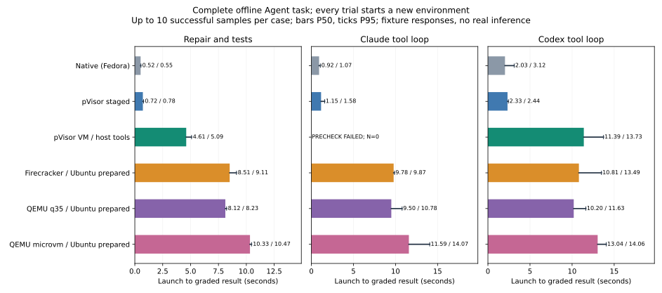
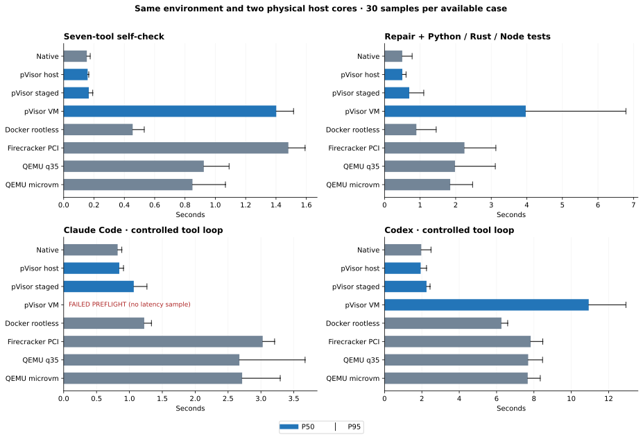

# Agent tool loop: real CLIs, controlled responses

Complete repair/testing takes about **4.61 s** in image-free pVisor VM and **8.51 s** on Firecracker / complete Ubuntu; staging takes **0.72 s**. Ubuntu boot affects short jobs, while pVisor retains substantial tool-execution costs: fast startup does not establish leading tools. Claude/VM: initialization timeout / N=0; real Codex tool-loop results follow below.

## Motivation

To detect interference, first fix tool actions and remove inference/Internet variability, then measure real-model tasks. This supplies a repeatable tool-loop baseline.

## Experiment design {#interpretation}

Pin client versions, project inputs and local model responses to compare environment/tool costs across native, staged, container and VM paths. Require correct repairs, zero-exit tests, returned real tool results and client completion; staging must preserve the original faulty file. Fake credentials, no inference or paid calls. The complete Ubuntu comparison uses 10 samples per available case; the historical shared-tool environment uses 30, both with 3 warmups and randomized order. Historical arithmetic tasks use six inputs, three repetitions, no warmups and fixed ordering. Report them separately without pooling distributions.

## macOS

These workloads were measured on Linux; macFUSE/FSKit overhead and capacity remain unmeasured. Existing macOS/HVF results are retained in [VM startup](startup.md) and [VM memory](vm-memory/index.md), and are not substituted for this workload.

## Linux: 2026-10-04 {#results}

### Image-free pVisor and complete Ubuntu: full Agent Env {#full-ubuntu}

pVisor reuses installed host Python/Node/Rust/Git/rg/Claude/Codex without making an OS image. Firecracker/QEMU install distribution tools and the same Rust/Agent CLIs in complete official Ubuntu 26.04.1 LTS. Each trial creates a new environment, then runs the same repair plan and tests. VMs use 2 vCPU / 16 GiB; all groups share the two-core budget and warm host caches, with 10 planned samples, 3 warmups and randomized order; cells state effective N when below 10. Ubuntu Python/Node/Git versions differ from the host; full versions and kernel differences are in the [method](methodology.md#full-ubuntu).



| Backend | Tool self-check P50/P95 s | Repair/tests P50/P95 s | Claude loop P50/P95 s | Codex loop P50/P95 s |
|---|---|---|---|---|
| Native / Fedora | 0.16 / 0.17 | 0.52 / 0.55 | 0.92 / 1.07 | 2.03 / 3.12 |
| pVisor staged | 0.18 / 0.19 | 0.72 / 0.78 | 1.15 / 1.58 | 2.33 / 2.44 |
| pVisor VM / host | 1.21 / 1.77 | 4.61 / 5.09 | FAILED / N=0 | 11.39 / 13.73 |
| Firecracker / Ubuntu | 7.79 / 10.13 | 8.51 / 9.11 | 9.78 / 9.87 | 10.81 / 13.49 |
| QEMU q35 / Ubuntu | — | 8.12 / 8.23 | 9.50 / 10.78 | 10.20 / 11.63 |
| QEMU microvm / Ubuntu | — | 10.33 / 10.47 | 11.59 / 14.07 | 13.04 / 14.06 |

The QEMU rows use the same complete Ubuntu template; all 60/60 new formal task samples pass, with N=10 and 3 warmups per case. Standalone version self-check timing is unmeasured (—). QEMU and the earlier pVisor/Firecracker cohorts are separate; the chart does not pool distributions.

**Repair/testing has lower launch-to-result time; tools after boot do not have the same advantage.** Repair/testing is 4.61 s end to end in pVisor VM versus 8.51 s on Firecracker/Ubuntu; internal tool/grading time is 4.02 / 2.30 s respectively. Avoiding complete OS boot reduces waiting; worker time exposes tool/storage costs. If a VM executes multiple tasks, boot is amortized and worker time matters more. Resident pools and sustained throughput are unmeasured.

| Backend | Repair worker P50/P95 s | Peak tree RSS P50/P95 MiB |
|---|---|---|
| Native / Fedora | 0.48 / 0.50 | 169.28 / 190.85 |
| pVisor staged | 0.67 / 0.72 | 209.52 / 248.59 |
| pVisor VM / host | 4.02 / 4.49 | 729.46 / 756.93 |
| Firecracker / Ubuntu | 2.30 / 2.69 | 1743.02 / 1766.67 |
| QEMU q35 / Ubuntu | 2.75 / 2.79 | 1862.13 / 1876.98 |
| QEMU microvm / Ubuntu | 2.81 / 2.88 | 1844.82 / 1881.06 |

| Phase | Native P50 ms | staged P50 ms | pVisor VM P50 ms | Firecracker Ubuntu P50 ms | QEMU q35 P50 ms | QEMU microvm P50 ms |
|---|---|---|---|---|---|---|
| inspect | 3.1 | 18.6 | 74.4 | 17.1 | 16.4 | 18.7 |
| search | 2.2 | 2.4 | 20.8 | 12.9 | 7.6 | 7.4 |
| python-tests | 28.0 | 34.2 | 149.7 | 45.3 | 47.2 | 47.8 |
| rust-tests | 96.5 | 206.7 | 822.3 | 981.6 | 1299.9 | 1327.5 |
| node-install | 221.9 | 260.9 | 2210.9 | 876.7 | 956.7 | 975.9 |
| node-tests | 126.3 | 140.3 | 595.2 | 389.6 | 421.9 | 423.1 |
| diff | 0.9 | 2.8 | 18.6 | 1.2 | 1.7 | 1.4 |

The largest pVisor VM phase is `node-install`, at about 2.21 seconds P50. This identifies a concrete optimization path. Phase medians do not sum to the total median, and ext4/virtio-fs differences do not independently establish the entire cause.

Repair covers inspection, rg search, Python repair, Python/Rust/Node tests, installing 32 local npm dependencies and a diff. CLI columns use real clients with fixed local model responses and require passing test output in the returned model request and normal completion, without simulated CLIs or real inference. Staged/VM trials also verify the unchanged source workspace, completed Bundle and requested executor. All groups use private workspace temporary files to accommodate hostroot read-only `/tmp`. Initial linker failures from the incorrect configuration are retained as diagnostics outside formal distributions.

Claude/VM preflight still exceeds 90 seconds during initialization, with formal N=0. This is not a completed loop or evidence of full compatibility. Firecracker/Ubuntu Claude/Codex values use a separate ten-sample follow-up after correcting serial prompt and terminal control interference, with identical parameters. They are not pooled with the original client samples; collection failures remain archived.

Codex uses uniform inner `danger-full-access`, with the outer runtime supplying its stated boundary; default nested sandbox compatibility is unmeasured. N=10 gives first-version budgets and repeatability, not long-term tail or real-model success guarantees. RSS sums the launcher tree every 20 ms, including separate Firecracker DNS/NAT support; QEMU uses built-in user networking. Shared pages may be counted twice and short peaks missed. Configured 16 GiB is not 16 GiB resident, and short-task RSS does not establish concurrency capacity.

[Per-sample CSV](../../assets/benchmarks/full-ubuntu-20261004/samples.csv) · [Distributions and phases](../../assets/benchmarks/full-ubuntu-20261004/summary.json) · [Method and reproduction](methodology.md#full-ubuntu) · [Runtime evidence](../../assets/benchmarks/full-ubuntu-20261004/ubuntu-workflows-private-tmp-20261004/evidence.tar.gz) · [Ubuntu client follow-up evidence](../../assets/benchmarks/full-ubuntu-20261004/ubuntu-clients-console-v2-20261004/evidence.tar.gz)

Complete-Ubuntu repair/testing takes **8.12 s** on q35 and **10.33 s** on microvm, with internal tools taking **2.75 / 2.81 s**. Image-free pVisor reduces waiting for fresh jobs, while its 4.02 s worker time remains above these complete-Ubuntu paths, a priority when environments are reused. Selecting microvm does not automatically improve complete tasks in this configuration. Networking, devices and exposed CPU features differ; the entire difference cannot be assigned to block devices or FUSE.

[QEMU samples and cohorts](../../assets/benchmarks/full-ubuntu-qemu-20261004/manifest.json) · [QEMU distributions](../../assets/benchmarks/full-ubuntu-qemu-20261004/summary.json) · [QEMU evidence](../../assets/benchmarks/full-ubuntu-qemu-20261004/ubuntu-qemu-complete-20261004/evidence.tar.gz) · [QEMU method](methodology.md#full-ubuntu-qemu)

### Historical controlled environment: shared tools and trimmed reference VMs {#reference-env}

This batch shares tool artifacts to control some version differences. Firecracker/QEMU use trimmed Linux 6.12.109 and static init, without a complete distribution boot. pVisor shares a tool directory through virtio-fs without an image. These results retain Docker and minimal-VM context; see the [complete Ubuntu and image-free hostroot deployment](#full-ubuntu) above.

The deployed environment contains Python 3.14.7, Node 24.18.0/npm, Rust/Cargo 1.98.1, Git, rg, Claude Code 2.1.128, and Codex 0.160.0: about 3.58 GiB and 76,000 files. Native, Docker and VMs use the same tool artifacts, projects and checks. Each case has 30 samples and 3 warmups, a two-core budget, and 2 vCPU / 16 GiB for complete VMs. Full [parameters and boundaries](methodology.md#reference-env) are stated separately.

The workflow inspects a project, searches for the bug, repairs Python, runs Python/Rust/Node tests, installs 32 local dependencies, and generates a diff. Fixed model responses request that plan. Real CLIs must return actual passing tool results and exit normally. This covers environment deployment and tool execution, not large repositories, real model success rates or Internet dependency installation.



| Backend | Tool self-check P50/P95 s | Repair/tests P50/P95 s | Claude loop P50/P95 s | Codex loop P50/P95 s |
|---|---|---|---|---|
| Native | 0.15 / 0.17 | 0.50 / 0.78 | 0.82 / 0.88 | 1.97 / 2.49 |
| pVisor host | 0.16 / 0.17 | 0.50 / 0.61 | 0.85 / 0.91 | 1.94 / 2.25 |
| pVisor staged | 0.17 / 0.19 | 0.70 / 1.10 | 1.07 / 1.27 | 2.25 / 2.44 |
| pVisor VM | 1.40 / 1.52 | 3.97 / 6.79 | FAILED / N=0 | 10.93 / 12.93 |
| Docker rootless | 0.46 / 0.53 | 0.90 / 1.45 | 1.23 / 1.33 | 6.26 / 6.59 |
| Firecracker PCI | 1.48 / 1.59 | 2.25 / 3.13 | 3.03 / 3.21 | 7.83 / 8.47 |
| QEMU q35 | 0.92 / 1.09 | 1.98 / 3.11 | 2.67 / 3.67 | 7.69 / 8.46 |
| QEMU microvm | 0.85 / 1.07 | 1.85 / 2.48 | 2.71 / 3.29 | 7.67 / 8.34 |


Version checks establish that tools launch. The repair column includes environment startup, repair, testing and result validation. CLI columns add client initialization, local protocol requests and returned tool output. The endpoint is the host receiving a validated result, followed by checks of zero exit, Run Bundle and files. Exit/unmount time is recorded separately. Bars show P50 and lines P95; failed cases have no latency sample. Phase medians do not sum to the total median.

**The staged path fits an interactive tool budget; the VM path still needs substantial work.** Staged repair adds about 0.20 s over native and takes about 0.20 s less than Docker. It supplies a separate change view and Run Bundle; Docker uses a writable mount, so the workflows are not identical. The VM's 3.97 s is about 4.4 times Docker and 2.1 times QEMU microvm. Roughly 86 ms startup does not imply equally fast task execution.

| Phase | Native ms | Docker ms | pVisor staged ms | pVisor VM ms | QEMU microvm ms |
|---|---|---|---|---|---|
| inspect | 2.9 | 4.2 | 18.4 | 60.3 | 20.4 |
| search | 2.3 | 2.3 | 2.4 | 18.9 | 8.6 |
| python-tests | 25.5 | 53.3 | 31.9 | 118.3 | 57.6 |
| rust-tests | 99.5 | 99.1 | 213.2 | 835.8 | 533.8 |
| node-install | 183.6 | 230.3 | 219.1 | 1736.6 | 603.6 |
| node-tests | 135.8 | 125.4 | 145.7 | 466.3 | 167.8 |
| diff | 1.0 | 0.9 | 2.9 | 16.2 | 1.1 |


VM npm installation takes about 1.74 s, its largest phase here; Rust compilation takes about 0.84 s. Together with the [file-operation comparison](filesystem.md#reference-fs), this identifies dense small-file operations and offline installation as priorities for investigation. Guest configuration, filesystems and initialization also differ; the table locates costs rather than establishing a single cause.

**Compatibility is a measured result.** Claude passes 30/30 on native/staged/Docker/Firecracker/QEMU. Its pVisor VM preflight exceeds 90 s during initialization without a completed tool loop; formal N=0. Logs and diagnostics are retained; the root cause remains unresolved. Codex passes 30/30 on all eight backends with uniform inner `danger-full-access`, leaving the declared boundary to the outer runtime. This does not establish default `workspace-write` support everywhere. Native and staged retain access outside the workspace.

Do not rank Claude against Codex by absolute time. Codex also has seconds of client waiting in this path: roughly 6.26 s in Docker and 10.93 s in pVisor VM. These numbers describe the complete client experience more closely than bare startup, for these versions and controlled tasks, not model speed.

**Deployment is separate.** Offline tool copying, image import and ext4 creation take about 109 s; adding the CPU affinity helper takes another 5.3 s. Downloads and kernel compilation are excluded. Per-run workspace/private-disk preparation is recorded as `prepare_ms`, outside the task table. These are prepared-environment task budgets, not first-install-to-completion costs. See the [memory audit](methodology.md#reference-resources); 16 GiB configured RAM does not mean each Agent consumes 16 GiB resident memory.

[Per-sample CSV](../../assets/benchmarks/reference-env-20261004/samples.csv) · [Distributions and phase timing](../../assets/benchmarks/reference-env-20261004/summary.json) · [Runtime evidence](../../assets/benchmarks/reference-env-20261004/evidence.tar.gz) · [Compatibility matrix](../../assets/benchmarks/reference-env-20261004/compatibility.json)

### First-edition arithmetic tasks: separate historical batch

The following 72/72 results use a smaller task, another GNU artifact, and fixed ordering. Their statistics remain separate from the complete environment.

| CLI | Backend | Passed/planned | Wall P50/P95/P99 ms | P50 vs native |
|---|---|---|---|---|
| claude | native | 18/18 | 302.15 / 318.58 / 340.44 | +0.0% |
| claude | staged | 18/18 | 345.69 / 365.95 / 366.29 | +14.4% |
| codex | native | 18/18 | 1433.75 / 1543.04 / 1546.18 | +0.0% |
| codex | staged | 18/18 | 1401.23 / 1521.71 / 1521.86 | -2.3% |

### Analysis

Checks require the corrected file, passing grading observation in the next model request, normal CLI completion, and the original faulty file retained under staging. Compare native/staged within each CLI; client startup differences are not model-speed differences. Codex staged P50 is -2.3%, but native/staged order is fixed and the desktop has background work. This does not establish acceleration or an equivalence confidence interval. Inputs and server source are archived.

A deterministic 100% pass rate does not establish unchanged SWE-bench performance or a statistical success-rate interval. Coverage is these client versions and this Bash/exec_command repair path.
## Limits and next measurements {#acceptance}

Real-model SWE-bench Lite, actual tokens, complex multi-tool tasks and output variation remain unmeasured; paid accounts were not authorized. Follow-up should pin task IDs, commits, models, budgets and permissions, randomize native/staged order and retain failures/native trajectories.

## Reproduction and evidence {#run}

Run from the repository root with a new output directory. This dynamic firmware entry requires the GNU/Linux CLI; static musl builds use a different firmware entry. This host has Linux, KVM/FUSE/user namespaces, Python 3.14, Rust/GCC, Git/rg, Node 24/npm and Podman/crun. The agent suite also needs the Claude/Codex CLIs.

```bash
python3 benchmark/pvisor/product_v1.py \
  --binary /absolute/path/to/gnu-linux/pvisor \
  --firmware /absolute/path/to/libkrunfw-directory \
  --replay-binary /absolute/path/to/pvisor-replay \
  --output target/product-benchmark-new \
  --suites agent --samples 3 --warmups 0
```

Start with `--samples 1 --warmups 0` to check prerequisites. Workloads and correctness assertions live in `benchmark/pvisor/v1/`. Reports pin binaries, firmware and harness source with hashes. Failed operations never enter performance distributions. Effective sample counts are stated per page; P95/P99 from small samples describe this batch rather than production tail probabilities.

[Environment, artifacts and method](methodology.md#product-v1) · [Batch manifest](../../assets/benchmarks/product-v1-20261004/manifest.json) · [Per-sample CSV](../../assets/benchmarks/product-v1-20261004/samples.csv) · [Raw reports and diagnostic logs](../../assets/benchmarks/product-v1-20261004/evidence.tar.gz). Reports retain dirty source status; executable SHA256 identifies the measured artifact. The archive excludes large rootfs/binaries and reproducible workspace payloads, while retaining input hashes and each batch's harness.
