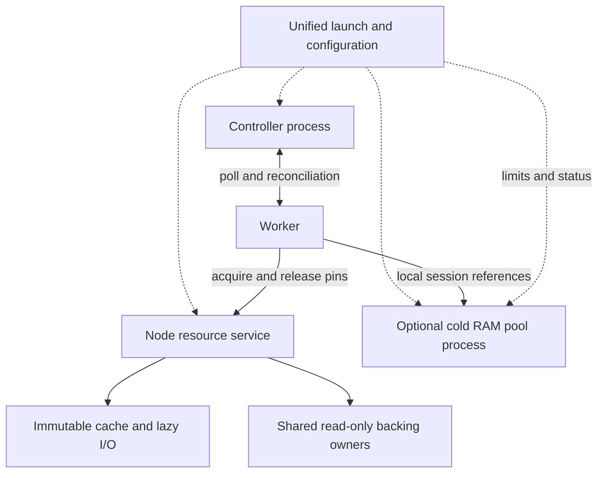

# Consolidating Cache, Memory Pool and Cluster Services

**Unify deployment and node resource management while retaining separate failure boundaries for the Controller and live VM data.** Cluster server here means the current `pvisor-cluster serve`. `pvisor service`, cross-Worker node ownership and an aggregate retained-cache payload budget are now implemented; see the [unified service guide](../../guides/cluster/service.md) for deployment and correctness gates. The remaining targets and performance questions below are retained; unmeasured speed or memory gains are not completed results.

The main value is eliminating duplicated resource management, sharing immutable environments/backing within a node, and bounding caches and transient work together. Fewer processes or ports alone do not establish faster startup or lower memory usage.

## Converging responsibilities {#roles}

| Responsibility | Appropriate owner | Consolidation target |
|---|---|---|
| Task intents, execution identities, scheduling, control revisions, terminal receipts | Cluster Controller | One control plane; Worker reconciliation still reconstructs runtime observations |
| Environment CAS, demand reads, fetching/decoding, read-only mounts, shared RAM backing ownership | Node resource service | Node-wide identity, active pins, warming and resource budgets |
| Experimental compressed cold RAM objects and session references | Optional pool module managed with node resources | Shared management and budgeting, retaining active-data preservation and failure isolation |
| Final admission, executors, watchdog, terminal outbox | Worker | Own task lifetimes; acquire node resources and report facts to the Controller |

One node may serve multiple Workers. Immutable storage supports content reuse across nodes, not physical RAM sharing. Do not route every Worker's page faults through a central Controller.

The target layout follows. One launch entry can manage several capped processes without requiring users to operate three daemons manually.



The implementation keeps a separate pool process, with configuration, limits and status managed by the service entry. Its internal payload budget remains separate, without dynamic arbitration against node caches. Later it may share a process with cache if node-wide failure impact is explicitly accepted; module, queue and data-retention contracts still remain distinct.

## Opportunities and limits in current code {#current}

- `image/cache/server.rs` already separates slow registry/extraction preparation from file service: a preparation queue of 16 with two threads, and a connection queue of 16 with 16 service threads. Retain this isolation instead of putting all I/O on one executor or global lock.
- `bin/pvisor-memory-pool.rs` independently accepts Unix connections, capped at 16 by default. `ram_backing/ipc.rs` holds references per connection with serialized RPCs. Disconnect releases session references; there is no disk recovery or transparent reconnect recovery contract.
- `node.rs` and `node/registry.rs` provide cross-Worker ownership. Environment identity is handle/digest; RAM identity is sealed ID/compatibility, with authorized store roots and publication checked at each acquire. Same-identity mount preparation is single-flight; each task holds a connection pin, with last-release teardown or bounded warming. The process-local registries remain the fallback when no node socket is configured.
- Controller `server/dispatcher.rs` has a control-command queue of 256 and a dedicated single-writer thread. Object reads, decompression, FUSE faults and pool RPCs must stay outside it.
- Executor support for `vm.memory_pool` still requires macOS/Apple Silicon. Linux native restore's read-only RAM inode/COW path can be integrated first, without waiting for the experimental cold pool or broadening its support through packaging.

Node mode currently delivers environments through a shared FUSE mount; Linux native Workers without a node socket can use direct virtio-fs lowers. These are distinct data paths. Performance A/B must fix the backend, without attributing independent direct-lower gains to service-entry consolidation.

## Unified object management with distinct data authority {#authority}

Unify identity, budgets, observation and lifecycle interfaces, rather than treating every byte as evictable cache.

| Object class | Content source and retention | Restart/eviction boundary |
|---|---|---|
| Refetchable image blocks and decoded caches | Valid immutable revisions, FS/S3/CAS sources; reads retain validation | Hot data may be discarded and refetched; hits cannot replace publication authorization |
| Active read-only RAM backing / FUSE mounts | Valid sealed snapshots and their pins; guest modifications use private COW | Unused decoded blocks can be reread; TTL cannot unmount active owners. A durable source does not imply automatic live-VM recovery after owner-process failure |
| Active cold RAM pool objects | After private pages leave original backing, the pool may hold their only remaining copy | No LRU/TTL discard; lost sessions/pool contents or failed restoration can fail-stop dependent VMs |
| Committed checkpoints and terminal evidence | Durable storage, published references and GC roots | Existing commit/retention rules apply; node warmth cannot authorize deletion |

**Eventual consistency lets a restarted Controller learn Worker state; it cannot reconstruct lost VM RAM.** Consolidation does not require per-page WAL, nor does querying Workers replace cold-pool data preservation.

A Controller-only restart must not also restart Workers, pool sessions or node backing owners. Workers operate and reconcile within existing lease/watchdog contracts, without promising indefinite Controller-free execution. Unified entry commands for `restart controller` and whole-node `stop` need distinct scope.

## Node budgets and concurrency {#budget}

The target node accounting is:

```text
node memory = service overhead
            + shared resident working-set union
            + private task state
            + pinned cold-pool objects
            + bounded caches, metadata and in-flight scratch
```

Count physically shared contents once and keep logical RAM reservations separate. Userspace cannot promise precise kernel page-cache eviction; kernel caps and observation still constrain the service group. A cold pool's payload cap is not its whole-process memory cap.

Reserve capacity for active objects, fault restoration and decoding scratch before allocating evictable caches and optional prefetch. Under pressure, stop prefetch, evict unpinned/refetchable hot contents and reject new warming/admission. Do not evict the only bytes of live VMs or allocate all restoration headroom to compressed objects.

Use identity-based single-flight and bounded fetching/decoding while preserving authorization and revision boundaries. Demand reads, restoration, background preparation/prefetch and management requests need separate bounded queues; demand takes precedence over optional prefetch. Avoid network I/O or compression under management locks. Track active references and evictable shares by Worker/tenant to prevent one large environment consuming all capacity.

Workers report fresh local-cache/pressure summaries; Controller in-memory views converge through reconciliation. Cache hits, page-residency changes and pool GETs do not need Controller journal entries. Management APIs may have one entry, while local fault data retains Unix sockets/handles and does not inherit Controller-admin token privileges automatically.

## Deployment and migration {#migration}

Single-node mode starts Controller, Workers and node resources from one entry; multi-host mode selects control or node roles from the same artifacts, with Workers connecting to a remote Controller. Existing commands remain supported. `pvisor service run/status/restart/stop` now provides separate status, logs, role stops and delegated cgroup caps. Controller exit does not restart other roles; automatic restart and cross-node migration remain unimplemented. Resolved configuration is saved to private `active-config.toml`, reused by role restarts.

1. **Unify entry and configuration first.** Keep existing processes/protocols; define startup order, socket lifetime, health and stopping. Reduce deployment burden while leaving performance gains unmeasured.
2. **Extract node resource ownership.** Connect immutable environments and Linux shared RAM backing first. Define node-local identity, pin/acquire/release, handle or mount delivery, cancellation and abnormal-exit cleanup; keep active owners until native runners are reaped. A remote registry is not shared backing.
3. **Unify controllable budgets.** Include metadata, hot blocks, warm owners, decoding and transient requests; complete capacity reclamation and pressure observation. Validate sharing/lazy paths with S1/S2 before checking duplicate misses with S3.
4. **Attach the optional cold pool.** Retain session authorization, references and fail-stop behavior in a separately capped process by default. Do not transparently disconnect/reconnect or upgrade active sessions. Without lossless draining, upgrades wait for dependent VMs to exit.
5. **Evaluate one process after evidence.** Shared cache/pool memory arbitration may help, but account for the larger failure scope. A same-process Controller is only an experimental mode explicitly accepting whole-process restart impact, not an equivalent online-recovery deployment.

## Implemented scope in this iteration {#implemented}

| Capability | Implementation and boundary |
|---|---|
| Unified entry | One TOML manages independent roles; trusted companions from the same installation; management socket restricted to the same UID; Controller admin tokens withheld from data roles |
| Node lifecycle | Bounded active pins, total owners, strong warming and preparation concurrency; cancellation releases preparation capacity, slow teardown runs on blocking workers; stop waits for pins and preparations |
| Shared environments and RAM | Worker layers share a node mount with private uppers; identical sealed RAM in authorized stores shares one inode, with native guests retaining `MAP_PRIVATE`; each acquire validates publication and compatibility |
| Cache budget | Aggregate retained payload for same-process content blocks, paged metadata and Linux decoded RAM; local LRU/FIFO can replace old entries, and insufficient capacity yields validated uncached reads; complete metadata, scratch, external Arcs and kernel pages are excluded |
| Kernel limits | Dedicated delegated cgroups install memory/CPU/zero-swap caps before role exec; uncapped preview is explicit in status; a separate Apple Silicon pool is outside the node payload counter |
| Stops and failures | Independent Controller restart; active pins block node restart; Workers → pool → node → Controller drain order; 30-second timeout retains data owners, without live owner/pool reconnect recovery |

This implements migration steps 1–2, payload/count/concurrency boundaries from step 3, and independent process management with session-aware stopping from step 4. Complete metadata/scratch arbitration, dynamic cache hints, prefetch, shared cold-pool budgets and lossless migration remain future work. Step 5's process merging has not been implemented.

`just test-service` covers real service restart, shared RAM inodes, host `MAP_PRIVATE` isolation and actual cgroup caps. `just test-service-vm` separately covers shared environments and private uppers with at most two native 128 MiB/one-vCPU guests. The latter does not establish physical residency gains for restored RAM, and the former does not replace real restored-VM fault/COW sampling; macOS pools still require separate hardware acceptance.

## Acceptance questions to freeze first {#acceptance}

These are draft experiments, not PASS claims. A/B must use identical tasks, environments, backends and total CPU/memory budgets. Run at most four simultaneous real sandboxes including source VMs, install per-sandbox RAM/CPU caps, and bound every service.

| Question | Required observations and counterexamples |
|---|---|
| B1: Does consolidation eliminate duplicate backing, reads and decoding? | Combine S1/S3 for identical/distinct objects; record inodes, shared/private pages, origin requests, decoding counts and group physical memory. Fewer daemons alone do not establish sharing |
| B2: Does unified budgeting improve useful work under fixed resources? | Combine S2/S5 and Q3 for first result, correct completion throughput, CPU seconds/task, memory-time/task, peaks and queueing. Larger budgets or deferred reads do not establish improvement |
| B3: Can slow cache disrupt control or restoration? | Delay/fail a private test backend and cap prefetch; measure poll/control responses, fault waits and watchdog behavior. Unbounded queueing, deadlock or unexpected lease expiry is failure |
| B4: Do independent restarts match the promise? | Restart Controller and verify Worker/owner/pool sessions and execution identities survive with reconciliation. Separately fault owner/pool and record affected VMs, without claiming unimplemented live reconnect |
| B5: Do references and permissions remain correct? | Private COW write isolation, revision validation, unauthorized handle/session rejection, final release and GC. Process consolidation must not bypass checks or delete active data |

Freeze workloads, sample counts, tail-latency thresholds, resource caps and meaningful gains before collection. Do not raise scores from the diagram alone. Deployment/resource-management convergence is the first benefit; the acceptance work determines performance scores.

Related designs: [shared working sets](shared-working-set.md), [state and recovery](state-and-recovery.md), [cold RAM pool](../memory-sharing/index.md) and [question-driven experiments](../../benchmarks/cluster-questions.md).
