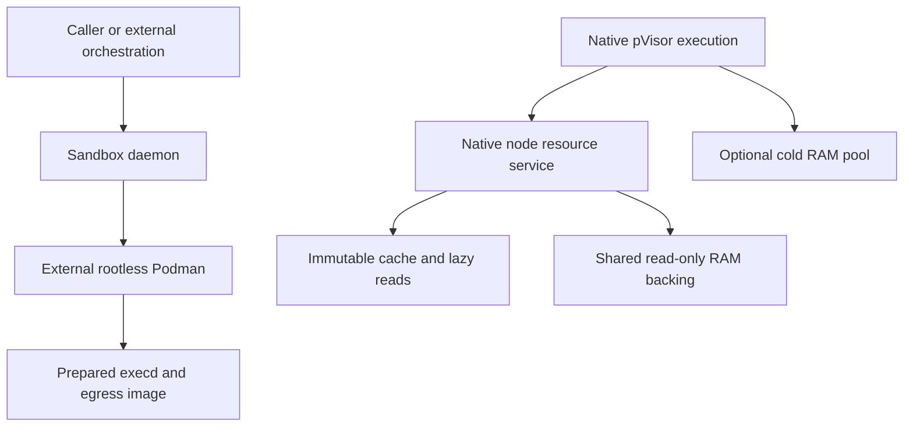

# Service responsibility convergence

Reduce duplicated management by giving each local resource a clear owner, not by combining every service into the daemon process. Sandbox lifecycle, native immutable backing and indispensable live RAM have different authority and failure boundaries.

## Current responsibilities {#roles}

| Responsibility | Owner | Relationship to daemon |
| --- | --- | --- |
| Sandbox admission, intentions, expiration, endpoints | `pvisor-daemon` | Implemented through the external rootless Podman runtime |
| Job/Attempt lifecycle, staging, Gateway and native VM checkpoints | `pvisor` Session/executors | Separate execution path; not wired into daemon |
| Immutable environment mounts and shared read-only RAM backing | Native node resource service (`pvisor/src/node.rs`) | Retained same-user, same-host service; no daemon acquire/release adapter |
| Image cache reads and decoded payload | Native cache modules | Separate native data path and budgets |
| Experimental cold RAM objects/session references | Optional native memory-pool process | Separate process; macOS/Apple Silicon support boundary remains |
| Host selection, workflows and retry policy | External orchestration | Outside the product control plane |

The native node service remains useful independently of retired distributed roles. Its identity is an image handle/digest or sealed RAM identity/compatibility, not a sandbox ID. A connection pins one owner. Same-identity preparation is single-flight; active owner/session/preparation counts and warming are bounded. A process-local registry remains available where native callers do not configure a node socket.

There is deliberately no daemon-to-node arrow. Shared packaging, a common launch entry or fewer ports does not supply a missing runtime adapter or establish faster startup, lower memory or improved useful-work density.

## Data authority and restart boundaries {#authority}

| Object | What may be reclaimed? | Failure boundary |
| --- | --- | --- |
| Refetchable image/decoded blocks | Unpinned hot contents with a valid durable source | Hits do not replace publication authorization |
| Active read-only RAM/FUSE owner | Idle warmth after active pins end, not active mounts | Durable source does not automatically recover a live VM after owner failure |
| Private cold RAM transferred to pool | Not its only remaining copy | Lost sessions/pool contents may fail-stop dependent VMs |
| Published checkpoints/evidence | Only through their own retention and GC roots | Native registry warmth cannot authorize deletion |
| Daemon sandbox record | After confirmed native deletion | Normal daemon shutdown preserves containers and registry |

A daemon-only restart need not restart Podman containers or native owners. Restarting a backing owner or cold pool is a different operation and cannot promise transparent session reconnect. Keep pins until native runners are reaped; without lossless draining, wait for dependent VMs before upgrades. Do not infer live RAM reconstruction from a restored metadata file.

## Budgets and concurrency {#budget}

Native node configuration bounds owners, warm owners, sessions, preparations and retained cache payload. That payload counter aggregates content blocks, paged metadata and Linux decoded RAM; it excludes complete metadata, scratch, external references and kernel residency. The separate cold-pool payload budget is not dynamically arbitrated against node caches or equal to a whole-process cap.

Reserve headroom for active objects and restoration before optional caches/prefetch. Under pressure, drop expendable warmth/refetchable contents or refuse new preparations, never the only live bytes. Slow teardown and I/O stay outside management map locks; same-identity serialization must retain authorization and compatibility checks.

Daemon CPU/memory admission remains a separate conservative sum of container hard limits. It has no combined physical-memory accounting with native node/pool resources. Host cgroup supervision and observations must include services and transient work, not only workloads.

## Integration direction {#migration}

1. Retain separate owners and failure scopes while obsolete distributed roles are retired.
2. If a native daemon backend is added, define acquisition, private writable state, cancellation, native termination and pin release before sharing resources.
3. Unify observations and controllable budgets only after distinguishing reservations, shared physical pages, evictable payload and indispensable RAM.
4. Consider process merging only after explicit restart/drain and data-preservation contracts, followed by fixed-budget measurements.

No live-VM takeover, shared cold-pool arbitration, daemon native-backend wiring or density advantage is established by consolidation. Native resource correctness evidence and legacy service experiments keep their original scope; they are not daemon acceptance results.

Related contracts: [shared working sets](shared-working-set.md), [state and recovery](state-and-recovery.md), [native shared image storage](../shared-image-cache-storage.md) and [experimental pool](../memory-optimization/proof-of-concept.md).
