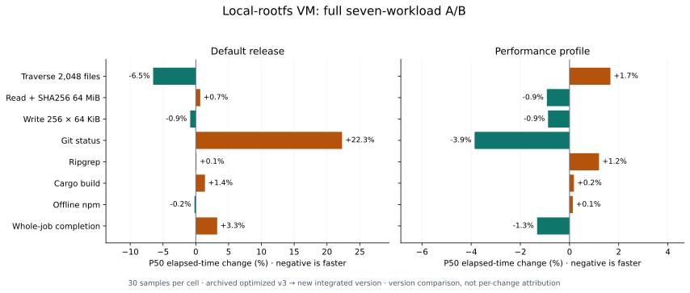

# Filesystem performance: technical analysis and experiment records

The new default-release local VM completes at P50 **4.15 s (+3.3% versus optimized v3)**, with traversal at **157.57 ms (-6.5%)**. Warm lazy-image open/read improves **8.6%** and 64 MiB reads improve **6.6%**, but traversal slows and copy-up takes about **2.5×** as long. This batch shows no general end-to-end acceleration; see the [new-version evaluation](#filesystem-service) for complete distributions and cache conditions.

## Motivation

Agents repeatedly list, search and modify files. Tool time and full job time together show the cost of choosing staging or a VM.

## Experiment design {#interpretation}

The latest batch randomizes native and both versions of staged and libkrun VM. Historical matrices also include host, safe, Docker, rootless Podman/crun and pVisor OCI. Cells usually have 3 warmups and 30 measurements with warm host caches; the complete Ubuntu follow-up uses N=10, labeled separately. Image/input preparation is excluded. Worker time includes tool execution and validation; wall time includes launch and teardown. metadata/git/rg use 2,048 files in 32 directories; read validates a 64 MiB hash. product-v1 write creates 256×60 KiB files; the complete tool environment and latest A/B retain the 256×64 KiB fixture. cargo builds 64 dependency-free modules and verifies 2016. npm installs 32 local packages offline, without registry access.

## macOS

These workloads were measured on Linux; macFUSE/FSKit overhead and capacity remain unmeasured. Existing macOS/HVF results are retained in [VM startup](../benchmarks/startup.md) and [VM memory](../benchmarks/vm-memory/index.md), and are not substituted for this workload.

## Linux: evaluation after the shared filesystem service refactor {#filesystem-service}

The frozen new source retains host FUSE while local, staged and lazy VM views
enter the shared service through virtio-fs. Lazy images no longer create an
intermediate host FUSE mount. The [implementation](overlayfs.md#filesystem-service)
still keeps protocol state in the two adapters; DAX, writeback and long attribute
TTLs remain disabled.

### Comparison and measurement scope {#service-protocol}

The baseline is the final optimized v3 artifact from the earlier five-item
campaign, including path indexing, lazy directory allocation and queue changes;
it is not a pre-P0 version. The new integrated worktree was frozen before
building, with source and executable hashes recorded. Concurrent cluster/service
changes are also present, so this is a version-artifact comparison, not an
attribution to one function or solely to removing FUSE.

Both artifacts use identical firmware and complete tool fixtures, 2 vCPU/4 GiB
and physical cores 0,1. Both staged variants must report rootless_process with
read/write isolation. Each cell has one correctness preflight, three warmups and
30 measurements; preflight and warmups are excluded. Five cells shuffle each
round and seven tools run in their fixed order. These workloads use local rootfs,
which already had no intermediate host FUSE, making a separate lazy-image
measurement necessary. Host caches are warm and CPUs are not exclusive. Release
one-minute host load is **1.37 → 2.27**; independent batches are not pooled.

### Default release: complete local-rootfs workloads {#service-release}

P50 values below are milliseconds; negative changes mean less time. All
**150 jobs and 1,050 tool measurements** passed existing output, Run Bundle,
untouched-lower and complete 256-file upper checks. Both release artifacts use
the same size-oriented opt-level=z build.

| Operation | Native | Host staged before → after | VM before → after | VM change |
|---|---:|---:|---:|---:|
| metadata | 4.58 | 76.14 → 76.29 | 168.53 → 157.57 | -6.5% |
| read | 32.21 | 65.65 → 66.18 | 116.12 → 116.91 | +0.7% |
| write | 3.60 | 200.70 → 200.46 | 245.18 → 243.09 | -0.9% |
| git | 13.79 | 165.87 → 165.75 | 359.63 → 439.83 | +22.3% |
| rg | 6.84 | 89.95 → 90.46 | 448.42 → 448.88 | +0.1% |
| cargo | 46.49 | 102.49 → 102.65 | 488.15 → 494.97 | +1.4% |
| npm | 163.74 | 250.12 → 250.71 | 1337.35 → 1334.66 | -0.2% |
| Launch to exit | 426.43 | 1240.79 → 1242.06 | 4021.54 → 4152.52 | +3.3% |

New VM traversal P50 decreases **6.5%**, but completion increases **3.3%** and
Git increases **22.3%**. Host staged completion changes only **+0.1%**. This batch
does not show general local-rootfs acceleration. Relative to its native control,
the new VM takes approximately **34.4×** for traversal, **67.5×** for small-file
writes, **3.6×** for 64 MiB reads and **8.2×** for npm. Small-file and metadata
costs remain substantial.

| Operation | VM before → after P95 | VM before → after P99 |
|---|---:|---:|
| metadata | 199.59 → 199.24 | 208.31 → 201.96 |
| read | 120.75 → 134.33 | 123.49 → 141.60 |
| write | 260.44 → 269.16 | 262.67 → 272.02 |
| git | 719.48 → 723.31 | 738.35 → 746.02 |
| Launch to exit | 4384.50 → 4406.12 | 4550.35 → 4469.82 |

Traversal tails decrease slightly, while read/write tails increase. Completion
P95 is close and P99 decreases slightly. With 30 samples P99 is sensitive to
individual jobs; median or isolated tail changes do not establish stable gains.
The Local raw record `docs/src/assets/benchmarks/.data/filesystem-service-20261005/local-release.tsv`
retains all seven worker timings and launch-to-exit time for every job.

### Performance artifacts: local comparison with matched build settings {#service-performance}

A separate complete batch has **150 jobs and 1,050 tool measurements**, all
passing correctness and isolation checks. Baseline and new versions both use
opt-level=3. Host load is **0.93 → 3.87** and CPUs are not exclusive. Values are
P50 milliseconds. Distributions are not pooled with release, and the new
4.15/3.81 s across those batches is not a causal build-optimization measurement.

| Operation | Native | Host staged before → after | VM before → after | VM change |
|---|---:|---:|---:|---:|
| metadata | 4.59 | 67.30 → 67.91 | 146.11 → 148.54 | +1.7% |
| read | 32.12 | 65.60 → 65.41 | 116.28 → 115.21 | -0.9% |
| write | 3.68 | 196.60 → 195.74 | 233.49 → 231.45 | -0.9% |
| git | 14.12 | 156.56 → 155.28 | 345.22 → 331.88 | -3.9% |
| rg | 6.99 | 80.93 → 81.58 | 389.81 → 394.48 | +1.2% |
| cargo | 47.14 | 103.71 → 101.63 | 459.17 → 460.00 | +0.2% |
| npm | 166.44 | 254.44 → 252.32 | 1236.33 → 1237.97 | +0.1% |
| Launch to exit | 430.56 | 1187.74 → 1186.28 | 3860.30 → 3809.40 | -1.3% |

New VM completion changes **-1.3%**, Git **-3.9%** and metadata **+1.7%**, with
smaller median changes elsewhere; host staged completion changes **-0.1%**.
Release completion **+3.3%** versus this batch's **-1.3%** is inconsistent with
general acceleration. Current performance VM traversal is about **32.4×** its
same-batch native control, small-file writes **62.8×**, reads **3.6×** and npm
**7.4×**. The new performance binary is **19.38 MiB**, versus release
**14.99 MiB**, approximately **29.3%** larger.

| Operation | VM before → after P95 | VM before → after P99 |
|---|---:|---:|
| metadata | 272.19 → 250.74 | 294.65 → 429.29 |
| read | 263.26 → 239.29 | 336.18 → 308.37 |
| write | 740.64 → 559.34 | 970.78 → 797.87 |
| git | 1096.91 → 1071.94 | 1158.24 → 1095.24 |
| Launch to exit | 9616.95 → 7328.27 | 9971.15 → 10148.77 |

The Local raw record `docs/src/assets/benchmarks/.data/filesystem-service-20261005/local-performance.tsv`
retain every sample. The two figure panels are independent batches, each
comparing old/new artifacts with matched build settings. They are not a same-batch
release/performance A/B or individual-mechanism gains.



### Lazy images: cold/warm comparison without intermediate host FUSE {#service-lazy}

Both artifacts use performance builds (opt-level=3) and read the same immutable
rootfs through a local Unix-socket cache-v1 fixture. The Python cache server
responds and verifies content hashes on separate physical cores 2,3; VM and
runner use 0,1. No artificial latency is added. This is not a WAN, TCP/S3,
registry-download or production Rust cache-server throughput measurement.
One-minute host load is **1.00 → 1.85**.

Each round shuffles version order, running cold then warm for each version.
Cold uses fresh client content/metadata caches; warm reuses those disk caches
but starts a new guest, backend projection and upper. Host page caches are not
evicted. After tool startup the script waits a fixed 1.2 s, then measures first
and immediate repeat traversal, first and immediate repeat open/read, 64 MiB
SHA256 and 32 file copy-ups. “Immediate repeat” describes order, not guaranteed
kernel cache hits: the default TTL can expire during long operations. The wait
is excluded from workers and included in launch-to-exit, diluting whole-job
percentage changes.

Four cells have three warmups and 30 measurements each, plus preflight:
**120 jobs and 720 operation measurements**. The 2,048 small files occupy 32
directories and contain 1,023 bytes each; 32 copy-up files are rewritten to
17 bytes and verified. All guest content/attribute, Run Bundle VM isolation,
staged workspace-write and immutable-source checks pass. Mount monitoring
observed host FUSE in all **60** baseline measurement jobs and no FUSE mount
in the image store of all **60** new jobs.

Values below are P50 milliseconds; negative means less time.

| Operation | Cold before → after | Change | Warm disk cache before → after | Change |
|---|---:|---:|---:|---:|
| First traversal of 2,048 files | 257.74 → 285.25 | +10.7% | 223.41 → 254.04 | +13.7% |
| Immediate repeat traversal | 41.21 → 54.63 | +32.6% | 42.43 → 54.69 | +28.9% |
| Open/read/close 2,048 files | 823.29 → 795.42 | -3.4% | 637.58 → 582.75 | -8.6% |
| Immediate repeat open/read | 671.61 → 686.14 | +2.2% | 740.57 → 695.84 | -6.0% |
| 64 MiB read + SHA256 | 189.80 → 185.68 | -2.2% | 124.72 → 116.43 | -6.6% |
| Copy up and verify 32 small files | 28.30 → 73.41 | +159.4% | 28.83 → 72.56 | +151.7% |
| Launch to exit (includes 1.2 s wait) | 3596.20 → 3678.45 | +2.3% | 3314.47 → 3335.84 | +0.6% |

Reads improve locally: warm-cache open/read/close decreases **8.6%**, and 64 MiB
reads decrease **6.6%**. First traversal instead increases **10.7%/13.7%** for
cold/warm caches, immediate repeat traversal increases **32.6%/28.9%**, and
copy-up takes **2.5–2.6×** as long. Whole-job P50 changes **+2.3%** cold and
**+0.6%** warm, without overall acceleration. A shorter call chain does not
automatically remove metadata projection, content materialization, preimage
recording and synchronization costs. This batch does not separately profile
those costs or attribute a regression to one specific mechanism.

Every cold job downloads the same fixture data in both versions: **2,112 content
reads and 69,203,968 bytes**, comprising 2,048 small files and 64 large-file
blocks. Including the interpreter and other rootfs content gives **2,164 reads
and 86,924,150 bytes**. Both warm versions download **zero content** and perform
no remote stat/list queries. Differences are not due to extra prefetching or
omitted data validation in the new version.

| Operation | Warm before → after P95 | Warm before → after P99 |
|---|---:|---:|
| First traversal of 2,048 files | 230.50 → 262.88 | 233.89 → 264.27 |
| Open/read/close 2,048 files | 643.50 → 599.41 | 644.50 → 633.51 |
| 64 MiB read + SHA256 | 126.19 → 119.56 | 126.61 → 119.89 |
| Copy up and verify 32 small files | 29.02 → 79.89 | 29.43 → 81.43 |
| Launch to exit (includes 1.2 s wait) | 3335.95 → 3377.97 | 3350.71 → 3438.46 |

Warm read tails improve in some cases; metadata/copy-up and whole-job tails
increase. Baseline cold open/read P99 of **1,628.39 ms** and completion P99 of
**4,406.78 ms** are affected by one slow job; the new values are
**804.34/3,736.05 ms**. Selecting only those tails would not establish stable gains.
Local raw record `docs/src/assets/benchmarks/.data/filesystem-service-20261005/lazy-performance.tsv`
are retained. The first preflight failed because the script misstated fixture
byte size; corrected preflight and formal results are stored separately, with
that failure excluded from timing distributions.

## Linux: retained results of the earlier five-item optimization campaign {#indexed-optimizations}

These independent earlier batches produced this campaign's baseline artifacts.
Their percentage changes cannot be added to the new results; the historical
16 GiB VM's 5.27 s versus the new 4.15 s is not solely a refactor gain. Final v3
combines path indexing, lazy directory allocation, queue changes and related
work, with 2 vCPU/4 GiB, three warmups and 30 measurements per cell. It does not
attribute gains to each mechanism. The mutable fixture does not quantify
immutable-image receipt reuse.

| Comparison | VM P50 before → after | Change |
|---|---:|---:|
| Combined code changes, release: completion | 4,416.25 → 4,236.61 ms | -4.1% |
| Same batch: metadata | 194.21 → 169.20 ms | -12.9% |
| Same batch: npm | 1,504.83 → 1,395.37 ms | -7.3% |
| Same-source release → performance: completion, separate batch | 4,233.32 → 3,839.44 ms | -9.3% |

Combined release completion P95 changes **+2.4%** and Git P99 **+25.5%**;
separate performance completion P95/P99 change **-7.9%/-6.9%**. These tradeoffs
cannot be pooled into one speed curve. The Local raw record `docs/src/assets/benchmarks/.data/filesystem-optimizations-20261005/code-v3-4g.tsv`,
Local raw record `docs/src/assets/benchmarks/.data/filesystem-optimizations-20261005/profile-v3-4g.tsv`
and Local raw record `docs/src/assets/benchmarks/.data/filesystem-optimizations-20261005/manifest.tsv`
retain full provenance. Kernel-mechanism and P0 batches below are also historical.

## Linux: full kernel-mechanism and concurrency evaluation {#kernel-campaign}

Screening precedes the unchanged seven-tool evaluation below. These are real
filesystem jobs, not extrapolated adapter timings or three-sample screens.
Retained changes fuse parent statx queries, share the lock for read-only OPEN,
and add opt-in lock/pool diagnostics with no clock reads when disabled.
READDIRPLUS_AUTO and inline metadata dispatch remain; DAX, writeback and
long-lived caches are not enabled.

### Completed experiments {#kernel-experiments}

| Experiment | Samples and measurement boundary | Results |
|---|---|---|
| Real KVM / host FUSE screening | Five candidate comparisons, each with five cells, one warmup and three measurements per cell; includes reruns after implementation corrections | [Screening and decisions](#kernel-screening), Local raw record `docs/src/assets/benchmarks/.data/filesystem-kernel-20261005/process.tsv` |
| Release adapter microbenchmarks | Four lookup/getattr/open/directory PLUS workloads, two warmups and eight measurements per case and artifact; no VM, FUSE mount or preimage journaling | Local raw record `docs/src/assets/benchmarks/.data/filesystem-kernel-20261005/micro-final.tsv` |
| Cache, concurrency and guest tmpfs controls | Three measurements for traversal and single/four-thread stat; one for partial writes and readback on 64 files | [Control results](#kernel-probes), Local raw record `docs/src/assets/benchmarks/.data/filesystem-kernel-20261005/kernel-probe.tsv` |
| Same-source full seven-tool A/B | Five cells, three warmups and 30 measurements per cell; 150 jobs and 1,050 tool measurements | [Full distributions and conclusions](#kernel-full) |
| Same-batch full comparison of published P0 and final candidate | Five additional cells, three warmups and 30 measurements per cell; 150 jobs and 1,050 tool measurements; source and staged isolation types differ | [Historical-artifact rerun](#kernel-history) |
| Separate profiling and OPEN concurrency regression | One profile measurement per cell, excluded from acceptance timings; regression checks old blocking behavior, new read-only concurrency and retained writable exclusion | [Queue and lock diagnostics](#kernel-probes), [implementation and regression](#kernel-screening) |

The five cells are native, baseline/candidate host FUSE staged, and
baseline/candidate KVM VM. The earlier P0 modification's N=30 A/B remains
[separate](#e2e-baseline), outside the latest two rounds' 300 measured jobs.
DAX, writeback cache, FUSE passthrough, FUSE-over-io_uring, long-lived TTLs and
replacement with virtiofsd have only been assessed for feasibility; no performance
A/B has been implemented for them.

### Screening and implementation selection {#kernel-screening}

Each real screen uses five cells, one warmup and three measurements per cell,
frozen source, firmware and fixtures, with mandatory preflight. Combined
variants are labeled; separate batches are not single-change comparisons.
Screens select further work, not tail or whole-task performance claims.

| Candidate | VM traversal P50 change | VM completion P50 change | Decision |
|---|---:|---:|---|
| Initial fused statx | +4.8% | +5.9% | Missing upper parents still triggered duplicate fallback queries; fix and rerun |
| OPEN shared lock + metadata pool on statx | +1.4% | +8.2% | Do not promote this combination; npm +21.8% in this screen |
| Force READDIRPLUS, disable AUTO | -30.6% | +4.5% | Git +93.6%; do not enable globally |
| Fused statx + shared OPEN lock before correcting namespace-error fallback | -17.7% | +4.2% | Intermediate version; retain records, correct and rerun |
| Corrected statx + shared OPEN lock | +5.0% | +1.0% | Correctness passes; use full N=30 for evaluation |

Initially ordinary ENOENT/ENOTDIR also fell back from statx to metadata,
offsetting some savings on lower queries. The final implementation returns
those namespace results directly. Unsupported/restricted queries or missing
fields fall back safely, with no guessed mount ID or native parent reuse.
Physical ancestor and leaf checks remain, without cross-request attribute or
permission caching.

A separate release adapter microbenchmark uses two warmups, eight measurements
and one separate diagnostic per case, without VM, FUSE or preimage journaling.
Deep-directory P50 is **97.52 → 88.16 ms (-9.6%)**; shallow lookup/open/getattr
**28.39 → 27.61 ms (-2.8%)**. The final normal fixture has no metadata fallbacks
and avoids 33,664 separate mount-identity queries in the deep case. This verifies
reduced duplicate work, not a predicted VM-task gain.

The new regression reproduces read-only OPEN waiting behind independent backing
READ: it fails the old implementation and passes the shared-lock implementation.
Writable OPEN still waits and lower content stays unchanged. APPEND/TRUNC,
non-read-only and kill_priv opens, mutations, release and snapshots remain
exclusive. Per-path journals still synchronize first observations; handle,
descriptor RAM-lease, used-ring and freeze-drain contracts remain. All five
implementation-file hashes match the actual worktree.

### Same-source full seven-tool A/B {#kernel-full}

Both release binaries use frozen `bc08f457` source, differing by the retained
implementation patch. Each cell has three warmups and 30 measurements:
**150 measured jobs and 1,050 tool measurements**, all passing original output,
Run Bundle, isolation, lower-write absence and complete 256-file upper checks.
Each job has a fresh workspace/upper and runs the seven tools in their original
order; five cells shuffle with a fixed seed. The retained fixture still writes
256 × 64 KiB, checks 64 MiB and traverses 2,048 files with the original cargo/npm
inputs. Host cache is warm; affinity uses physical cores 0,1, VM 2 vCPU/16 GiB,
and firmware matches P0. Both same-source staged variants are
**rootless_process**, requiring read/write/non-bypassable boundaries. Published
P0 staged used host_process; its comparison is separate. CPUs are not exclusive;
host one-minute load is **2.02 → 2.70**. Units below are ms; negative is faster.

| Workload | Native | Staged before → after | Change | VM before → after | Change |
|---|---:|---:|---:|---:|---:|
| metadata | 4.88 | 77.96 → 78.14 | +0.2% | 188.38 → 194.35 | +3.2% |
| read | 32.62 | 69.39 → 68.94 | -0.7% | 154.14 → 156.15 | +1.3% |
| write | 3.89 | 202.64 → 202.92 | +0.1% | 252.50 → 254.62 | +0.8% |
| git | 15.13 | 172.44 → 173.35 | +0.5% | 493.02 → 433.31 | -12.1% |
| rg | 7.76 | 90.78 → 91.63 | +0.9% | 457.09 → 452.03 | -1.1% |
| cargo | 55.25 | 116.54 → 114.56 | -1.7% | 734.07 → 719.18 | -2.0% |
| npm | 175.58 | 267.20 → 263.22 | -1.5% | 1631.39 → 1625.45 | -0.4% |
| launch to exit | 468.52 | 1345.29 → 1310.05 | -2.6% | 5298.80 → 5273.93 | -0.5% |

The full run does not establish universal acceleration. Staged completion is
**-2.6%**, VM completion **-0.5%**; VM Git is **-12.1%** in this batch, while
metadata is **+3.2%**. The adapter's -9.6% must not be reported as VM traversal
improvement, and Git cannot stand in for npm, writes or the complete task.

| Workload | Staged P95 before → after | VM P95 before → after | Staged after P99 | VM after P99 |
|---|---:|---:|---:|---:|
| metadata | 84.63 → 88.98 | 254.15 → 270.13 | 97.68 | 296.52 |
| read | 85.22 → 85.02 | 197.53 → 201.65 | 86.04 | 214.19 |
| write | 222.86 → 222.09 | 330.15 → 295.80 | 228.31 | 335.81 |
| git | 206.08 → 197.27 | 814.82 → 776.87 | 226.71 | 796.34 |
| rg | 96.04 → 98.05 | 478.63 → 531.83 | 101.09 | 660.30 |
| cargo | 147.37 → 144.05 | 812.44 → 831.76 | 150.25 | 846.64 |
| npm | 297.90 → 294.31 | 1909.17 → 1947.07 | 306.96 | 2093.77 |
| launch to exit | 5633.02 → 3808.26 | 5812.36 → 5766.30 | 5321.95 | 6031.76 |

Tails do not improve together. Candidate VM rg P99 goes **526 → 660 ms**, npm
**2001 → 2094 ms**, completion **5917 → 6032 ms**, while write tails fall.
Staged completion tails include a few slow tasks and are not the sum of seven
worker times. All distributions remain available; this is one full batch on a
nonexclusive host.

Against same-batch native, candidate VM traversal is **39.8×**, 256-file writes
**65.4×**, 64 MiB reads **4.8×**, npm **9.3×**. Repeated directory/attribute
operations, small writes and VM tool execution remain substantial costs.

### Published P0 artifact rerun in the same batch {#kernel-history}

The published pinned P0 candidate (`a1020d4b` plus shared stdio readiness fix)
is then compared with final P1: again three warmups and 30 measurements per cell,
an additional **150 measured jobs and 1,050 tool measurements**, all passing
the same checks. Original fixture, firmware and two-core budget remain; load is
**0.45 → 3.44**. Units are ms. This is a same-batch artifact comparison with
*different source bases*, not attribution of every difference to statx or OPEN.
P0 staged is **host_process**, P1 **rootless_process**; each observed boundary
is validated strictly.

| Workload | P0 → P1 staged P50 | Change | P0 → P1 VM P50 | Change |
|---|---:|---:|---:|---:|
| metadata | 76.26 → 77.26 | +1.3% | 225.02 → 228.47 | +1.5% |
| read | 68.11 → 68.69 | +0.9% | 121.06 → 120.93 | -0.1% |
| write | 198.12 → 200.20 | +1.0% | 240.25 → 253.10 | +5.3% |
| git | 167.50 → 170.04 | +1.5% | 449.65 → 430.24 | -4.3% |
| rg | 89.01 → 89.85 | +0.9% | 465.98 → 460.27 | -1.2% |
| cargo | 111.08 → 111.62 | +0.5% | 654.27 → 625.52 | -4.4% |
| npm | 215.91 → 261.39 | +21.1% | 1662.16 → 1666.95 | +0.3% |
| launch to exit | 1224.50 → 1290.69 | +5.4% | 5164.78 → 5187.46 | +0.4% |

Second-batch VM completion is **+0.4%**, again without overall acceleration;
Git is **-4.3%**, writes **+5.3%**. Staged npm is **+21.1%**, versus -1.5% in
the previous same-source rootless comparison. Different execution boundaries
and other source changes enter this artifact comparison; it is not a causal
claim about the filesystem patch. The same P1 artifact traverses in
**194 / 228 ms** and reads in **156 / 121 ms** across the two batches, demonstrating
batch sensitivity. Neither faster-batch selection nor percentile pooling is valid.

Original P0 published traversal **195.24 ms** remains below; the identical P0
artifact measures **225.02 ms** here. Published-to-current differences likewise
cannot be equated with code gains. Both complete evaluations total
**300 measured jobs and 2,100 tool measurements**. Evidence supports eliminating
duplicate parent queries and read-only OPEN serialization, not universal
end-to-end acceleration.

Local raw record `docs/src/assets/benchmarks/.data/filesystem-kernel-20261005/full-historical.tsv` ·
Local raw record `docs/src/assets/benchmarks/.data/filesystem-kernel-20261005/historical-summary.tsv` ·
Local raw record `docs/src/assets/benchmarks/.data/filesystem-kernel-20261005/samples.csv`

### Cache, concurrency and guest-local controls {#kernel-probes}

The separate diagnostic repeats traversal of the same 2,048-file fixture,
waiting 1.2 seconds before every expired-cache pass, including after the initial
rglob. Candidate VM results below are in ms. Tmpfs is verified as `/dev/shm`
inside the same guest; file preparation is excluded.

| Control | Measurements per group | P50 |
|---|---:|---:|
| Expired-cache traversal → immediate repeat | 3 | 233.11 → 105.11 |
| Single-thread → four-thread partitioned stat | 3 | 164.17 → 91.86 |
| Traversal on tmpfs in the same guest | 3 | 3.28 |
| 64 files, eight 1 KiB writes each with readback: shared view → guest tmpfs | 1 | 69.64 → 2.78 |

Immediate repetition shows caching helps, with substantial cumulative cost
remaining. Overlapping submission reduces waits without proving concurrent Core
execution. The partial-write control has one sample and is not acceptance
evidence. Tmpfs excludes virtio-fs, Core, journal and storage latency together;
the difference cannot all be attributed to transport.

A separate profile batch is excluded from acceptance timings. Last candidate VM
checkpoints show **21,340 / 24,743 inline** and **357 / 65 pool** requests.
Pool queue waits total **12.80 / 1.67 ms**; completion-to-used-ring publication
**5.16 / 1.22 ms**. Combined read/write lock acquisition waits are about
**1.09 / 2.55 ms**, with individual maxima below **0.38 ms**. This diagnostic
does not show long lock waits, but excludes guest-to-host admission waiting and
does not rule out inline serialization. Core checkpoints still show
**121,768 / 169,649** parent observations and **63,375 / 65,488** fused statx
queries, with no fallback records. Complete staged profiling records 341 journal
fsync calls totaling about **119 ms**. VM checkpoints are not final and may have
different cutoffs. Inclusive spans are not summed; counters are not a complete
syscall census.

The initial diagnostic stopped because it searched runs only, while --stage
places the Run Bundle in stage. The failed batch is retained and corrected runs
use new directories. The intermediate successful batch did not expire initial
rglob caches; it is kept separately, excluded from final diagnostic timings.
All normal staged writes remain in upper, with lower unchanged.

### Priorities for further kernel mechanisms {#kernel-paths}

1. **Directory/attribute/negative caches and invalidations.** Repeated traversal
   remains expensive. Establish immutable or single-owner tree contracts before
   testing longer TTL and FOPEN_CACHE_DIR. Live lowers allow external host
   changes, and no active invalidation transport exists; do not extend TTL globally.
2. **Workload-aware READDIRPLUS and host concurrency.** AUTO already exists,
   and forced PLUS has tradeoffs. Host fuser uses one synchronous callback loop.
   VM uses one request and one hiprio queue; short metadata runs inline, and a
   full pool pauses normal admission. More workers alone do not prove gains;
   measure queue/lock waits. ASYNC_READ/PARALLEL_DIROPS are already negotiated
   by the protocol server.
3. **Writeback cache.** It may coalesce small writes, but requires durable
   preimages before mutation, dirty-page draining before terminal/export/snapshot,
   and partial-write/append/truncate correctness.
   [Kernel I/O modes](https://kernel.org/doc/html/latest/filesystems/fuse/fuse-io.html)
4. **Data paths and local filesystems.** DAX primarily removes data copies; no
   DAX A/B is performed here. FUSE-over-io-uring addresses host /dev/fuse, not
   direct replacement of VM virtqueues. FUSE passthrough needs a backing FD in
   the same kernel, not a host FD handed to the guest. Guest-local tmpfs or
   read-only block images/kernel filesystems merit separate evaluation with
   staging/recording/restore contracts preserved.
   [DAX](https://docs.kernel.org/filesystems/dax.html) ·
   [io-uring](https://docs.kernel.org/filesystems/fuse/fuse-io-uring.html) ·
   [Passthrough](https://docs.kernel.org/filesystems/fuse/fuse-passthrough.html)

Validation passes: **97 Core tests (five skipped)**, **12 overlayfs tests**,
**294 VM tests (two skipped)**, **25 benchmark tests**, all-targets Clippy for
three relevant packages and benchmark Ruff. No semspec ledgers/snapshots were
modified or approved. Evidence includes samples and failures, not only successful
summaries. These numbers do not update macOS, startup, networking or complete
Agent-loop measurements.

Local raw record `docs/src/assets/benchmarks/.data/filesystem-kernel-20261005/full-same-source.tsv` ·
Local raw record `docs/src/assets/benchmarks/.data/filesystem-kernel-20261005/summary.tsv` ·
Local raw record `docs/src/assets/benchmarks/.data/filesystem-kernel-20261005/process.tsv` ·
Local raw record `docs/src/assets/benchmarks/.data/filesystem-kernel-20261005/micro-final.tsv` ·
Local raw record `docs/src/assets/benchmarks/.data/filesystem-kernel-20261005/kernel-probe.tsv` ·
Local raw record `docs/src/assets/benchmarks/.data/filesystem-kernel-20261005/profiles.tsv` ·
Local raw record `docs/src/assets/benchmarks/.data/filesystem-kernel-20261005/implementation.patch` ·
Local raw record `docs/src/assets/benchmarks/.data/filesystem-kernel-20261005/evidence.tar.gz` ·
Local raw record `docs/src/assets/benchmarks/.data/filesystem-kernel-20261005/manifest.tsv`

## Linux: 2026-10-05, P0 real VM/FUSE A/B baseline {#e2e-baseline}

This batch boots actual KVM VMs and mounts actual host FUSE, completing the
end-to-end check missing from the adapter experiment. Host devices are available;
the initial sandbox hid `/dev/kvm` and `/dev/fuse`. Both GNU/Linux release binaries
come from the same `a1020d4b` source archive and differ only in OverlayCore's
`core.rs`. Both include the same guest stdio readiness fix. Binary, firmware,
source patch and harness hashes are retained.

“After” means this pinned candidate artifact, measuring the incremental benefit
of skipping marker probes for an unavailable upper. Other optimizations already
in the archive are shared by both binaries and are outside the A/B difference;
later commits do not automatically enter these measurements.

Each round shuffles five cells: native and both versions of FUSE staged and VM.
Each cell has three warmups and 30 measurements: 150 measured jobs and 1,050 tool
measurements, all correct. Every job has a fresh workspace/upper and executes the
seven workloads in order in one environment. Fixture copying is excluded. Host
caches are warm; all launch trees use physical host cores `0,1`; VMs have 2 vCPU
and 16 GiB. The pinned historical fixture writes 256×64 KiB (16 MiB), unlike the
current product-v1 60 KiB files. Historical percentiles are not pooled. Concurrent
host activity remained: one-minute load average fell from 10.38 to 3.06. Affinity
is a shared execution budget, not exclusive CPUs. This is one screening batch.

Tool operation and validation P50 in ms; negative changes mean less elapsed time:

| Workload | Native | FUSE before→after | Change | VM before→after | Change |
|---|---:|---:|---:|---:|---:|
| metadata | 4.93 | 92.38 → 78.25 | -15.3% | 224.36 → 195.24 | -13.0% |
| read | 32.56 | 68.30 → 67.82 | -0.7% | 116.98 → 117.90 | +0.8% |
| write | 3.90 | 201.36 → 198.92 | -1.2% | 243.10 → 257.16 | +5.8% |
| git | 15.11 | 190.36 → 170.46 | -10.5% | 484.14 → 494.86 | +2.2% |
| rg | 7.66 | 100.80 → 90.58 | -10.1% | 476.92 → 464.97 | -2.5% |
| cargo | 52.92 | 112.30 → 110.11 | -1.9% | 513.46 → 512.74 | -0.1% |
| npm | 173.19 | 221.67 → 217.47 | -1.9% | 1570.05 → 1503.67 | -4.2% |

Launch-to-exit P50 for the seven-workload job is **454.50 ms** native,
**1288.69 → 1230.93 ms (-4.5%)** FUSE staged and
**4829.04 → 4777.55 ms (-1.1%)** VM. Metadata savings reproduce in the actual
paths. This does not establish improvements for VM git, writes or overall jobs:
VM write and git became slower in this batch. Small changes and write behavior
need a quieter-host rerun; a single P50 cannot establish their cause.

### P95 and remaining costs {#optimization-tails}

P95 from the same samples, in ms. Lower medians did not consistently produce
lower tail latency:

| Workload | FUSE before→after P95 | Change | VM before→after P95 | Change |
|---|---:|---:|---:|---:|
| metadata | 112.02 → 107.34 | -4.2% | 344.81 → 322.87 | -6.4% |
| write | 312.85 → 300.82 | -3.8% | 349.50 → 780.11 | +123.2% |
| git | 294.83 → 378.19 | +28.3% | 892.72 → 1181.58 | +32.4% |
| rg | 153.51 → 172.53 | +12.4% | 604.35 → 850.17 | +40.7% |
| Whole job, launch to exit | 2078.80 → 2152.45 | +3.5% | 6796.10 → 8565.53 | +26.0% |

Candidate staged / VM whole-job P99 is **13.36 s / 10.46 s**, also retained in
the raw summary. With N=30, a few slow samples influence the tail, and concurrent
host load remains uncontrolled. These observations need reproduction before
attributing them to an implementation change. Evidence supports metadata-path
improvement; overall performance acceptance still needs repeated quieter-host
batches.

Against same-batch native, candidate staged / VM metadata still takes
**15.9 / 39.6 times** as long, adding **73 / 190 ms** per traversal. Writing
256 files still takes **199 / 257 ms**, versus **3.90 ms** native. VM offline
npm takes **1.50 s**, versus **0.17 s** native. Repeated traversal, small-file
writes and VM tool execution remain the next optimization targets.

An earlier warmup exited zero and completed writes without any workload stdout
markers. The harness stopped and retained the failure. The ordinary VM runner now
declares the named ports required by its actual non-terminal standard descriptors.
The guest waits for their names before launching tools, failing after at most five
seconds. Regression tests cover delayed names, later port creation and absent
ports; there is no unconditional startup delay. All 68 VM runs in the formal batch,
including preflight and warmups, passed output checks. The harness also verifies
observed isolation, no writes in lower and all 256 upper files with correct sizes.
Identical binaries, a mismatched build manifest, missing samples or interruption
cannot produce a successful A/B summary.

A separate profiled batch does not enter the timing table. The candidate VM's two
nonempty Core instances still record **126,034 / 168,027** parent metadata calls
and **57,547 / 53,161** mount identity attempts at their last checkpoints.
Dispatch checkpoints show **20,545 inline / 424 pool** and
**24,398 inline / 100 pool**, with two workers each. The complete candidate host
Core profile records 341 journal fsync calls totaling about 110 ms. Repeated Core
physical path checks, first-observation/write journal costs and inline dispatch
of small requests warrant separate experiments. Neither more workers nor
virtiofsd can be assumed to remove these costs. VM checkpoints lack final records
and are partial; nested inclusive spans must not be added, and admission time is
not queue waiting time.

Validation passed: five guest tests, 292 full VM-package tests (two skipped),
24 executor tests excluding control and 24 benchmark tests, plus guest Clippy and
benchmark Ruff. The wider executor subset in the worktree at measurement time had nine
VM-control test failures, retained separately in the validation archive. This
change does not modify control implementation or count those checks as passed.

Build both GNU/Linux binaries from the same source, applying only the proposed
change between builds. Use a fresh output directory and start with
`--samples 1 --warmups 0` for preflight.

```bash
python3 benchmark/pvisor/filesystem_ab.py \
  --assets target/reference-env-final-20261004 \
  --baseline /absolute/path/to/pvisor-before \
  --candidate /absolute/path/to/pvisor-after \
  --firmware /absolute/path/to/libkrunfw-directory \
  --output target/filesystem-ab-new \
  --cpu-affinity 0,1 --samples 30 --warmups 3
```

Local raw record `docs/src/assets/benchmarks/.data/filesystem-ab-20261005/samples.csv` ·
Local raw record `docs/src/assets/benchmarks/.data/filesystem-ab-20261005/summary.tsv` ·
Local raw record `docs/src/assets/benchmarks/.data/filesystem-ab-20261005/profiles.tsv` ·
Local raw record `docs/src/assets/benchmarks/.data/filesystem-ab-20261005/evidence.tar.gz`

### Retained historical-to-P0 comparison {#historical-progress}

This compares the 2026-10-04 complete-tool-environment N=30 batch with the latest
candidate N=30 batch: internal tool P50 in ms. Both retain the tool fixture, but
artifacts, host load and run protocols differ. Percentages describe differences
across batches and cannot establish the controlled causal benefit of all
optimizations. Use the [same-batch A/B](#e2e-baseline) for the latest change's
incremental benefit.

| Workload | Historical→latest staged | Across-batch change | Historical→latest VM | Across-batch change |
|---|---:|---:|---:|---:|
| metadata | 180.13 → 78.25 | -56.6% | 310.54 → 195.24 | -37.1% |
| read | 48.77 → 67.82 | +39.1% | 89.27 → 117.90 | +32.1% |
| write | 189.28 → 198.92 | +5.1% | 144.66 → 257.16 | +77.8% |
| git | 177.81 → 170.46 | -4.1% | 456.21 → 494.86 | +8.5% |
| rg | 144.61 → 90.58 | -37.4% | 545.82 → 464.97 | -14.8% |
| cargo | 112.80 → 110.11 | -2.4% | 549.57 → 512.74 | -6.7% |
| npm | 222.97 → 217.47 | -2.5% | 1727.04 → 1503.67 | -12.9% |

Existing measurements show lower traversal and search times; reads and writes
did not improve alongside them. Docker, complete repair tasks and real Agent CLI
loops were not rerun here. Historical data below retains its original dates and
artifacts; filesystem percentages cannot predict their latest performance.

Local raw record `docs/src/assets/benchmarks/.data/reference-env-20261004/summary.tsv` ·
Local raw record `docs/src/assets/benchmarks/.data/filesystem-ab-20261005/summary.tsv`

## Linux: 2026-10-05, OverlayCore resolution optimization {#resolution-optimization}

This release-mode experiment measures only the virtio-fs OverlayFs adapter,
without a VM, host FUSE mount or preimage journal. Fixtures live on `/tmp`
tmpfs: 32 directories with 64 files of 18 B each; deep paths have eight parent
components. Each trial has fresh inode tables and warm host caches. Fixture and
adapter construction are excluded from timing.

Preserved baseline and candidate test binaries were run through nextest binaries
metadata in three alternating batches: old→new, new→old, old→new. Each case and
batch has two warmups, eight unprofiled samples and one diagnostic sample. P50
uses only the 24 unprofiled samples per version. CPU affinity was not pinned;
binary digests and individual batch medians are retained in the raw summary.

| Adapter operation, 2,048 files | Before P50 ms | After P50 ms | Elapsed reduction |
|---|---:|---:|---:|
| lookup + getattr | 35.15 | 26.35 | 25.0% |
| lookup + open + getattr + release | 37.61 | 28.07 | 25.4% |
| Deep lookup + open + getattr + release | 170.51 | 96.85 | 43.2% |
| opendir + readdirplus + releasedir | 29.00 | 20.24 | 30.2% |

The shared OverlayCore now skips whiteout/opaque probes when this candidate's
physical upper parent was just found missing or non-directory. Attributes and
absence are not cached across requests; later components and final physical
ancestors are still checked afresh. Deep-path diagnostic counts fell from 38,016
to 4,352 for each marker probe. Markers behind upper ancestor symlinks cannot
hide lower entries. New tests also cover upper directories and whiteouts appearing
within a walk and upper content changes between requests.

All 106 Core/host-adapter tests and 57 virtio-fs/descriptor/filesystem-snapshot
tests passed, as did Clippy for all targets of the three relevant packages. The initial
sandbox hid `/dev/kvm` and `/dev/fuse`, so that full VM-package attempt failed
at KVM initialization. This microbenchmark did not measure actual VM/FUSE jobs,
journaling, payload I/O or macOS. Subsequent host validation and end-to-end runs
appear in the [P0 baseline above](#e2e-baseline). Unrelated VM refactors
also occurred between builds; this adapter case does not execute UART/VMM/CPU
initialization. Binary digests identify the measured artifacts. These reductions
do not replace new measurements of the historical tool workloads below.

Reproduce one version's adapter measurement:

```bash
cargo nextest run --locked --release -p pvisor-vm \
  --run-ignored only --no-capture -E 'test(small_file_adapter_benchmark)'
```

Local raw record `docs/src/assets/benchmarks/.data/overlay-resolution-20261005/samples.tsv` · Local raw record `docs/src/assets/benchmarks/.data/overlay-resolution-20261005/summary.tsv`

## Linux: 2026-10-04 {#results}

### Tool execution inside complete Ubuntu {#full-ubuntu}

The table excludes environment boot, measuring operations and grading. This new batch uses N=10 with 3 warmups, the same fixture and two-core budget, and 16 GiB VMs. pVisor uses host directories and staged virtio-fs; Ubuntu uses its vendor generic kernel, distribution tools and private ext4. The old Docker N=30 matrix remains separate without pooling percentiles.

| Workload | Native P50/P95 ms | pVisor staged P50/P95 ms | pVisor VM P50/P95 ms | Ubuntu P50/P95 ms |
|---|---|---|---|---|
| metadata | 4.85 / 5.11 | 177.80 / 195.52 | 291.82 / 359.75 | 18.64 / 19.90 |
| read | 33.29 / 48.97 | 48.12 / 61.21 | 88.83 / 127.21 | 115.51 / 117.69 |
| write | 3.75 / 4.43 | 186.95 / 208.86 | 134.37 / 154.03 | 36.07 / 36.35 |
| git | 14.66 / 17.07 | 172.18 / 194.52 | 613.69 / 807.73 | 136.50 / 140.81 |
| rg | 7.58 / 10.90 | 140.52 / 145.52 | 521.65 / 554.49 | 20.40 / 22.89 |
| cargo | 52.79 / 57.17 | 104.21 / 131.18 | 563.24 / 658.37 | 969.09 / 977.41 |
| npm | 218.82 / 245.85 | 256.29 / 292.67 | 2260.17 / 2408.63 | 1079.89 / 1110.93 |

These values locate waiting in traversal, search, compilation and installation. A single read does not establish that block devices always outperform FUSE: kernels, tool versions, storage and staging semantics differ together. For longer tasks, combine worker time with the [complete loop](../benchmarks/agent-tasks.md#full-ubuntu) rather than startup alone.

Local raw record `docs/src/assets/benchmarks/.data/full-ubuntu-20261004/samples.csv` · Local raw record `docs/src/assets/benchmarks/.data/full-ubuntu-20261004/summary.tsv` · [Method and reproduction](../benchmarks/methodology.md#full-ubuntu)

### Docker baseline in the complete tool environment {#reference-fs}

This adds a same-host Docker Engine measurement rather than relabeling Podman. Same two-core budget and inputs, 30 samples and 3 warmups per case; fixtures match the first edition, with seven operations executed sequentially in each fresh environment. Timings cover operations and validation, excluding environment startup. See the [complete environment](../benchmarks/agent-tasks.md#reference-env) for the repair workflow. The two batches remain separate; percentiles are not pooled.

| Workload | Native P50/P95 ms | Docker P50/P95 ms | pVisor staged P50/P95 ms | pVisor VM P50/P95 ms |
|---|---|---|---|---|
| metadata | 5.04 / 6.78 | 5.06 / 7.50 | 180.13 / 202.88 | 310.54 / 351.59 |
| read | 33.07 / 41.44 | 33.24 / 45.06 | 48.77 / 61.60 | 89.27 / 99.34 |
| write | 3.96 / 5.09 | 3.95 / 5.65 | 189.28 / 204.67 | 144.66 / 164.67 |
| git | 15.75 / 20.50 | 16.07 / 20.07 | 177.81 / 195.97 | 456.21 / 786.35 |
| rg | 7.98 / 11.81 | 8.03 / 9.63 | 144.61 / 159.00 | 545.82 / 673.25 |
| cargo | 58.71 / 70.16 | 56.40 / 73.75 | 112.80 / 140.81 | 549.57 / 659.23 |
| npm | 183.46 / 197.57 | 231.45 / 288.60 | 222.97 / 256.33 | 1727.04 / 1978.79 |


This establishes a concrete position: Docker metadata/read/write stay close to native. Staged small-file traversal adds about **175 ms** over Docker, and a 64 MiB read about **16 ms**. An individual read costs tens of additional milliseconds; repeated small-file scans accumulate. VM offline npm installation takes about **1.73 seconds**, against Docker's **0.23 seconds**, a clear remaining gap. The roughly 86 ms VM startup figure cannot stand in for this tool budget.

Tasks verify file counts/sizes, SHA256, clean Git state, search matches, compiled output, and installed package counts. Docker uses a writable bind mount, pVisor a staged view, and Firecracker/QEMU private ext4. Different file paths are part of actual deployment cost; this is not a causal experiment changing only the VMM over an identical filesystem. The summary also contains each operation's distribution for other runtimes.

[Configuration and reproduction](../benchmarks/methodology.md#reference-env) · Local raw record `docs/src/assets/benchmarks/.data/reference-env-20261004/samples.csv` · Local raw record `docs/src/assets/benchmarks/.data/reference-env-20261004/summary.tsv` · Local raw record `docs/src/assets/benchmarks/.data/reference-env-20261004/evidence.tar.gz` · Local raw record `docs/src/assets/benchmarks/.data/reference-env-20261004/compatibility.tsv`


### First-edition Linux matrix: separate batch

| Workload | Backend | N | Worker P50 ms | vs native | Wall P50 / P95 / P99 ms |
|---|---|---|---|---|---|
| metadata | native | 30 | 4.84 | +0.0% | 23.44 / 29.17 / 30.71 |
| metadata | host | 30 | 4.94 | +2.0% | 34.02 / 44.90 / 58.18 |
| metadata | staged | 30 | 149.60 | +2988.5% | 225.03 / 295.08 / 314.55 |
| metadata | safe | 30 | 171.26 | +3435.6% | 288.73 / 346.47 / 363.59 |
| metadata | vm | 30 | 263.08 | +5331.3% | 636.44 / 828.38 / 892.94 |
| metadata | podman | 30 | 4.95 | +2.1% | 138.99 / 158.58 / 159.34 |
| metadata | container | 30 | 4.83 | -0.3% | 320.21 / 419.26 / 479.51 |
| read | native | 30 | 32.66 | +0.0% | 52.81 / 125.98 / 143.36 |
| read | host | 30 | 31.80 | -2.6% | 64.65 / 213.37 / 232.88 |
| read | staged | 30 | 40.76 | +24.8% | 95.24 / 338.92 / 378.04 |
| read | safe | 30 | 41.38 | +26.7% | 153.98 / 386.69 / 390.96 |
| read | vm | 30 | 100.58 | +208.0% | 476.56 / 1379.77 / 1436.40 |
| read | podman | 30 | 32.68 | +0.1% | 170.64 / 408.95 / 452.05 |
| read | container | 30 | 33.57 | +2.8% | 405.55 / 945.63 / 1092.93 |
| write | native | 30 | 3.81 | +0.0% | 22.95 / 26.54 / 55.29 |
| write | host | 30 | 3.81 | -0.1% | 34.16 / 46.23 / 93.69 |
| write | staged | 30 | 192.46 | +4945.6% | 252.61 / 444.20 / 812.30 |
| write | safe | 30 | 199.56 | +5131.6% | 312.83 / 549.31 / 762.48 |
| write | vm | 30 | 114.68 | +2906.4% | 476.94 / 694.88 / 1003.73 |
| write | podman | 30 | 3.76 | -1.4% | 139.68 / 151.53 / 340.87 |
| write | container | 30 | 3.82 | +0.1% | 356.89 / 406.97 / 627.19 |
| git | native | 30 | 14.72 | +0.0% | 36.14 / 79.21 / 165.50 |
| git | host | 30 | 14.51 | -1.4% | 54.34 / 65.11 / 92.63 |
| git | staged | 30 | 203.33 | +1281.7% | 333.16 / 458.84 / 1316.66 |
| git | safe | 30 | 225.99 | +1435.7% | 394.38 / 491.36 / 960.78 |
| git | vm | 30 | 535.06 | +3536.0% | 929.22 / 1558.97 / 2447.31 |
| git | podman | 30 | 15.55 | +5.7% | 158.87 / 209.35 / 215.16 |
| git | container | 30 | 15.78 | +7.2% | 375.18 / 434.76 / 490.77 |
| rg | native | 30 | 6.72 | +0.0% | 26.54 / 28.70 / 29.90 |
| rg | host | 30 | 6.64 | -1.2% | 44.01 / 44.79 / 45.02 |
| rg | staged | 30 | 167.90 | +2399.9% | 288.07 / 312.76 / 320.23 |
| rg | safe | 30 | 190.82 | +2741.2% | 349.80 / 380.69 / 389.61 |
| rg | vm | 30 | 340.98 | +4976.9% | 717.00 / 769.33 / 780.18 |
| rg | podman | 30 | 5.90 | -12.2% | 141.36 / 154.73 / 160.82 |
| rg | container | 30 | 6.39 | -4.8% | 355.33 / 390.96 / 395.69 |
| cargo | native | 30 | 49.09 | +0.0% | 67.21 / 84.93 / 86.36 |
| cargo | host | 30 | 47.07 | -4.1% | 83.86 / 94.88 / 95.49 |
| cargo | staged | 30 | 90.31 | +84.0% | 146.28 / 167.31 / 168.42 |
| cargo | safe | 30 | 96.00 | +95.6% | 188.83 / 209.83 / 224.90 |
| cargo | vm | 30 | 541.56 | +1003.1% | 897.61 / 959.14 / 959.43 |
| npm | native | 30 | 157.56 | +0.0% | 175.60 / 205.84 / 434.16 |
| npm | host | 30 | 156.38 | -0.7% | 184.73 / 204.95 / 552.20 |
| npm | staged | 30 | 187.87 | +19.2% | 235.76 / 256.13 / 608.48 |
| npm | safe | 30 | 232.30 | +47.4% | 318.58 / 432.25 / 708.12 |
| npm | podman | 30 | 208.41 | +32.3% | 339.64 / 474.65 / 857.37 |
| npm | container | 30 | 195.29 | +23.9% | 515.88 / 552.03 / 891.62 |

### Analysis

Staged sequential reads cost about +25% and offline npm +19%. Metadata is about 31× native and small-file writes about 50×, adding roughly 150–190 ms to native operations lasting only milliseconds. Host worker time is near native; full jobs include CLI/recording overhead. Safe adds namespace/policy/proxy setup. Most measured VM jobs take roughly 0.5–1 second.

This historical batch uses Podman as the OCI control; Docker daemon access was unavailable then. A later batch adds rootless Docker Engine bind-mount measurements, shown in the complete-environment comparison above. Docker overlay2 and Docker Desktop remain unmeasured. pVisor OCI prepares a private rootfs per Job; wall time includes this while worker time isolates tool execution.

### Compatibility follow-up

Container cargo initially lacked linker startup files, a fixture-image error. After adding glibc/GCC files, Fedora linker scripts still required /lib64/libmvec.so.1. The final cargo-ready batch supplies that path and passes every sample, listed separately; both setup failures remain in reports. VM Node failed to reserve V8 address space with the 1 GiB shape; follow-up uses a **16 GiB address-space configuration**, kept separate from the main 1 GiB batch.

| Workload | Backend | N | Worker P50 / P95 / P99 ms | Wall P50 / P95 / P99 ms |
|---|---|---|---|---|
| cargo | native | 30 | 52.90 / 65.79 / 76.17 | 71.96 / 89.41 / 103.04 |
| cargo | host | 30 | 52.60 / 70.49 / 75.30 | 84.38 / 111.79 / 124.56 |
| cargo | staged | 30 | 116.07 / 139.93 / 233.90 | 166.65 / 210.57 / 397.55 |
| cargo | safe | 30 | 119.77 / 138.77 / 228.23 | 209.92 / 242.16 / 342.22 |
| cargo | vm | 30 | 567.42 / 1365.43 / 2047.17 | 1271.15 / 2683.43 / 3889.27 |
| npm | native | 30 | 162.86 / 433.44 / 488.04 | 181.47 / 472.60 / 531.93 |
| npm | host | 30 | 163.56 / 430.53 / 475.14 | 205.34 / 522.04 / 595.23 |
| npm | staged | 30 | 213.17 / 437.03 / 612.15 | 266.48 / 544.87 / 780.57 |
| npm | safe | 30 | 256.70 / 717.56 / 777.67 | 339.63 / 983.34 / 1085.49 |
| npm | vm | 30 | 985.29 / 3238.12 / 4617.06 | 1661.91 / 5172.18 / 5755.11 |
| npm | podman | 30 | 217.06 / 547.44 / 833.45 | 365.17 / 883.42 / 1239.59 |
| npm | container | 30 | 202.48 / 587.65 / 601.74 | 550.89 / 1368.06 / 1469.75 |


| Cargo corrected /lib64 image | N | Worker P50/P95/P99 ms | Wall P50/P95/P99 ms |
|---|---|---|---|
| native | 30 | 51.52 / 59.70 / 62.44 | 70.85 / 80.25 / 82.02 |
| podman | 30 | 49.29 / 54.35 / 55.75 | 181.18 / 187.71 / 189.70 |
| container | 30 | 51.99 / 57.94 / 59.96 | 405.08 / 425.10 / 425.46 |

## Limits and next measurements {#acceptance}

Main VM jobs use host rootfs `/`, 2 vCPU/1 GiB and a host read view. This is a tool compatibility profile; host-secret protection is tested separately in [isolation](../benchmarks/isolation-tests.md). These small offline warm-cache tasks do not establish full-repository build performance or cold-disk throughput. macFUSE/FSKit, actual registry installs and Docker/overlay2 await comparable measurements.

## Reproduction and evidence {#run}

Run from the repository root with a new output directory. This dynamic firmware entry requires the GNU/Linux CLI; static musl builds use a different firmware entry. This host has Linux, KVM/FUSE/user namespaces, Python 3.14, Rust/GCC, Git/rg, Node 24/npm and Podman/crun. The agent suite also needs the Claude/Codex CLIs.

```bash
python3 benchmark/pvisor/product_v1.py \
  --binary /absolute/path/to/gnu-linux/pvisor \
  --firmware /absolute/path/to/libkrunfw-directory \
  --replay-binary /absolute/path/to/pvisor-replay \
  --output target/product-benchmark-new \
  --suites filesystem --samples 30 --warmups 3
```

Start with `--samples 1 --warmups 0` to check prerequisites. Workloads and correctness assertions live in `benchmark/pvisor/v1/`. Reports pin binaries, firmware and harness source with hashes. Failed operations never enter performance distributions. Effective sample counts are stated per page; P95/P99 from small samples describe this batch rather than production tail probabilities.

[Environment, artifacts and method](../benchmarks/methodology.md#product-v1) · Local raw record `docs/src/assets/benchmarks/.data/product-v1-20261004/manifest.tsv` · Local raw record `docs/src/assets/benchmarks/.data/product-v1-20261004/samples.csv` · Local raw record `docs/src/assets/benchmarks/.data/product-v1-20261004/evidence.tar.gz`. Reports retain dirty source status; executable SHA256 identifies the measured artifact. The archive excludes large rootfs/binaries and reproducible workspace payloads, while retaining input hashes and each batch's harness.
