# pVisor design and underlying mechanisms

Letting an Agent work continuously means entrusting a system with processes, file changes, network requests and memory state. Once the task starts, a developer needs to know what it can access, which state can survive an interruption, and which results to accept. Running many tasks adds another question: which contents can be stored once, and which costs necessarily grow with task count?

pVisor implements these responsibilities along execution, filesystem, network and storage paths. Consider a small task: an Agent reads `config.toml`, queries an external HTTPS service, and writes an updated configuration. Assume VM execution with workspace staging enabled. This task connects the user request to the guest kernel, virtual devices, host files and final apply. Ordinary Host Jobs write through by default; staging requires `--safe`, `--ask` or an explicit stage.

## 1. Overall design: execution and result boundaries {#architecture}

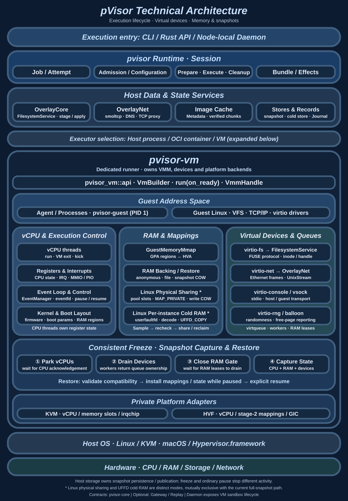

The runtime organizes an execution as a Session: admission resolves effective configuration, drivers prepare resources, an executor runs the workload, and the Session reclaims resources and publishes results. `pvisor-core` defines shared identities, policies and facts. Executors and drivers own actual system calls and platform resources.

Files and networks have different publication behavior. File changes can remain in a private upper until someone accepts them; a request sent to a remote service may already have produced an effect. File apply is consequently a separate publication action, while execution controls must act before requests leave. Examining logs afterwards cannot replace runtime restrictions.

| Layer | Main owner | Question it must answer |
| --- | --- | --- |
| User and service entry | `pvisor-cli`, embedded applications, `pvisor-daemon` | Who requests an operation, which execution is targeted, and how do cancellation and results travel? |
| Execution lifecycle | `pvisor` Job service and Session | Who owns the Attempt and dispatches, cleans up, saves and publishes its terminal state? |
| Execution and access paths | Host/OCI/VM executors, OverlayCore, OverlayNet | Which kernel or device processes a request, and where does authorization take effect? |
| State and facts | Snapshot store, image cache, Journal, apply ledger | Which contents are immutable, who holds references, and how is failure reconciled? |

The separate daemon embeds the runtime in a supervisor for each sandbox. After an API-process restart it can reconcile ownership of surviving supervisors; the VM does not automatically end with that API process. The daemon exposes sandbox lifecycle and service proxies, while native Jobs expose file review and supported checkpoint workflows. Their interfaces are described in [Core architecture](architecture.md) and [Daemon design](daemon/index.md). External orchestration owns cross-node placement, queues and application retries.

Memory, filesystems and networking are organized around address mappings, exported file trees and the virtual NIC. Snapshots combine their local state at a consistent cut; execution records retain reconcilable operation facts. The single-node daemon manages admission, ownership and shared resources across VMs. Each subsystem owns state while sharing lifecycle requirements with the VM and Session.

## 2. Starting a task and owning its completion {#execution}

### Job, Attempt and Session

A Job is the persistent identity of managed work; an Attempt identifies one actual execution. Supported execution resume retains the Job and creates a new Attempt. Execution fork creates an independent Job with lineage. A Session is the runtime object owning one Attempt's resources.

Cancellation shows why these identities matter. Closing a frontend changes observation or waiting. Requesting cancellation expresses an intent to stop. Even after a process exits, filesystem teardown, device shutdown and recording may remain. Giving each action to a frontend that can disappear creates a window where execution has ended but resources or Job state remain unfinished.

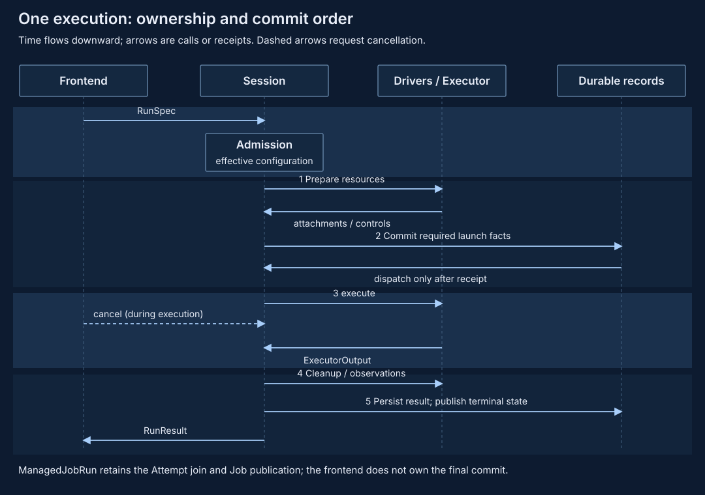

The runtime resolves RunSpec, effective policy and executor capabilities before preparing filesystem, network and execution attachments. It calls `RunExecutor::execute` only after required launch facts commit successfully. Preparation may already have created directories or sockets, so a commit failure still requires resource cleanup.

The executor returns `ExecutorOutput`; the Session continues with cleanup, observation checks and result storage. The durable Job service's `ManagedJobRun` separately owns the real Attempt join and `Server::finish`, while the frontend receives a wait adapter. A failed or dropped frontend wait requests cancellation. Accepted completion publication remains owned by a runtime task while its Tokio runtime survives.

### Why resolve policy once?

Suppose a request allows networking but workspace policy denies all network access. Admission must derive an effective network configuration and pass that same configuration to both driver and executor. If preparation reads mutable configuration again, the recorded decision and installed egress may disagree.

Requested snapshots, policy narrowing, Placement and final observations therefore remain distinct records. `resolve_operation` supports pre-execution review; resolution alone does not establish installed controls. See [Execution model](execution-model.md) for identity, result and cancellation contracts.

Source entry points: `pvisor/src/runtime/run.rs::resolve_run`, `pvisor/src/session.rs` and `pvisor/src/runtime/job_service/managed.rs`.

## 3. VM and virtual devices: the OS beneath executors {#os-foundations}

The overall diagram expands `pvisor-vm` into vCPU, RAM and device state: CPUs execute the guest, devices handle host I/O, and RAM connects them. The [VM subsystem](vm-runtime.md) explains startup, queue ownership and consistency boundaries.

### Processes, kernels and virtual machines

When a program calls `read`, `write` or `connect`, its kernel interprets file descriptors, address spaces and permissions. A Host process directly uses the host kernel. An OCI container also uses that kernel, with namespaces, resource controls and runtime configuration establishing boundaries. A VM program first enters the guest kernel, which uses virtual devices to reach resources supplied by the host.

Most ordinary instructions and guest-kernel work run through hardware virtualization. pVisor need not interpret every guest syscall: it owns exported file trees, the virtual network attachment and VM lifecycle. Device requests requiring service enter their corresponding host implementations. Guest tmpfs operations and kernel-cache hits do not automatically become OverlayCore requests.

This determines the available control points. A proxy environment variable on the Host requires program cooperation. Attaching the VM's sole virtual NIC to a controlled path allows programs that ignore those variables to pass through the same egress. A VM also introduces guest RAM, device processing and startup costs. Controls depend on executor and platform; see [Isolation mechanisms](isolation.md).

### Virtio: carrying I/O through shared queues

A virtio device lets a guest driver and host device implementation share queues. The guest prepares request buffers in its RAM and publishes descriptors to an available queue. A descriptor identifies a guest buffer address, length and access direction. The host consumes the request, writes response buffers, publishes a used entry and notifies the guest according to the protocol.

Guest-supplied addresses must be validated: the range must belong to permitted RAM, lengths must not overflow, and buffer directions must be valid. Those RAM mappings must remain usable throughout device processing. This explains why parking CPUs alone does not make RAM safe to capture or reclaim: device threads can still access request buffers.

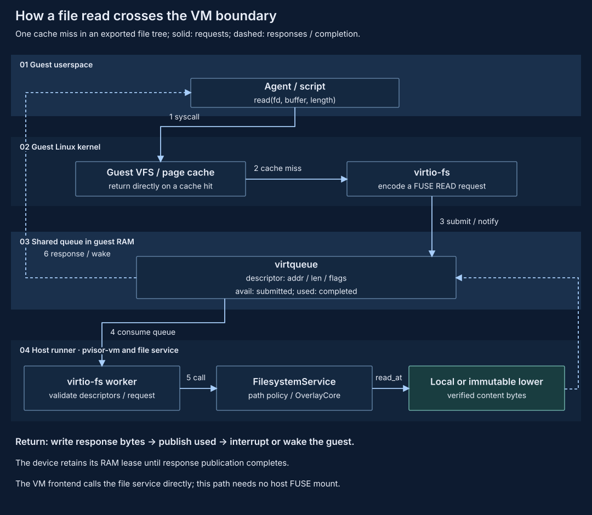

For a read that misses the guest page cache:

1. `read(fd, …)` enters guest VFS and reaches the file's virtio-fs mount.
2. virtio-fs encodes a FUSE `READ` message. Here FUSE denotes the file-operation protocol.
3. The guest submits a descriptor chain to the virtqueue and notifies the host device.
4. The `pvisor-vm` worker reads and validates the request, using the adapter's inode and handle state.
5. Operations in the exported tree enter the shared `FilesystemService` and OverlayCore for path authorization, layered lookup or backend reads.
6. After response bytes reach guest buffers, the queue owner publishes the used entry. Its device RAM lease remains held through publication.

Host staging reaches the same file service through a host FUSE mount. The VM calls it directly from virtio-fs, without another trip through host `/dev/fuse`. File semantics are shared; each adapter still owns protocol state, permission translation and queue lifecycle.

Source entry points: `pvisor-vm/src/devices/virtio/fs/worker.rs` and `pvisor-overlay-core/src/service.rs`. See [Shared filesystem service](overlayfs.md#filesystem-service).

## 4. Memory: what is shared and where writes go {#resources}

### Three addresses and one physical content page

A guest process uses a virtual address, GVA, translated by guest page tables into a guest physical address, GPA. The VMM creates host virtual RAM mappings, HVA, and registers guest memory regions with KVM/HVF. Hardware virtualization maps guest physical addresses to host physical pages. Host device implementations also use HVA to access guest buffers.

Two VMs using GPA `0x1000` need not share any physical page. Sharing requires host private mappings to reference the same immutable backing, with kernel copy-on-write creating private pages on modification. The arrows below describe mapping relationships, not software calls made on every CPU memory access.

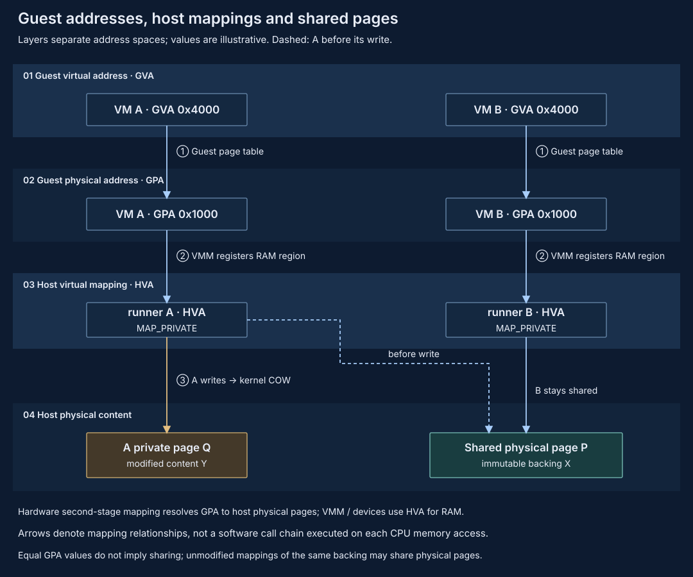

Snapshot restore can create private COW mappings from the same validated baseline. A and B initially read the same backing. A's write creates its own page while B keeps reading the baseline. Sharing reduces duplicate unmodified residency and defers allocation and copying until writes occur.

### Moving equal live pages into a physical pool

The optional Linux daemon physical pool handles equal resident 4 KiB pages across VM sessions. Candidates initially retain bounded hashes. When equal content appears across sessions, the pool supplies a reference-pinned memfd slot. The VM rechecks live bytes with CPUs parked and device access drained, then replaces the relevant region with a read-only FD's `MAP_PRIVATE` mapping.

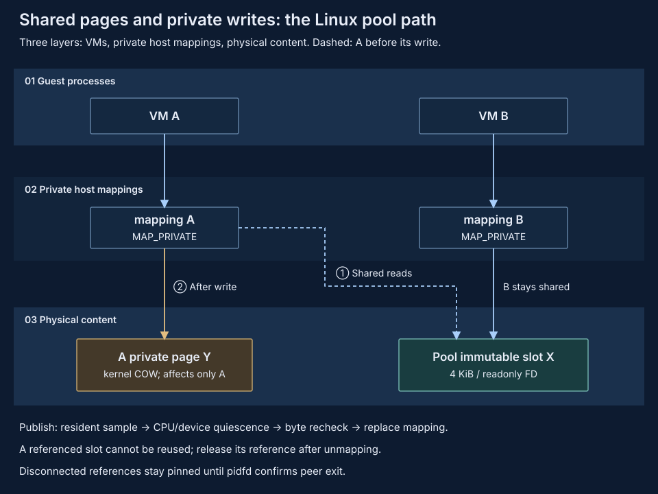

Two orderings matter. Recheck content before replacing a mapping, or writes after sampling can be lost. Release a still-mapped old slot only after removing its mapping, or slot reuse can change bytes visible to another VM. A disconnected connection alone cannot release those references: the pool waits for pidfd confirmation of peer exit.

Raw-page sharing needs no userfaultfd and does not compress unique contents. It adds reference overhead and a pool-process failure domain; losing the current pool fails dependent VMs. Snapshot COW, KSM, physical pooling, cold compression and offload each have compatibility constraints. Their separate savings cannot be added into an assumed delivered combination. See [Memory optimization](memory-optimization/index.md) for budgets.

### Why cold compression needs two quiescent windows

Per-instance live compression addresses contents that are not duplicated across VMs but encode into fewer bytes. Before releasing original RAM, the system needs a recovery object and confirmation that contents have not changed between sampling and publication.

The experimental Linux pager captures candidate blocks in a first short window, releases the guest, and encodes and publishes outside it. A second window rechecks live contents. Changed blocks, incompressible blocks and rejected publications remain resident. Only unchanged contents with a retained recovery source are discarded.

Accessing reclaimed memory triggers kernel-fault-capable userfaultfd, blocking the accessor. The pager decodes, checks length and checksum, completes `UFFD_COPY`, and only then wakes access and releases its cold reference. Corrupt recovery fails the runner rather than substituting zeroes. Unchanged bytes can still be read frequently, so this remains experimental eviction/refault probing rather than a reliable read-heat measurement.

Capacity planning includes shared pages, private COW, pool indexes, compressed objects, encoding scratch and restoration peaks. Summing per-process RSS double-counts shared pages; compression ratios omit CPU costs and refault tails.

Source entry points: `pvisor-vm/src/handle.rs` and `pvisor-vm/src/cold_ram_linux.rs`; public contracts are in `pvisor_vm::api`. See [Per-instance compression](memory-optimization/compression-local.md) and [Whole-VM offload](memory-optimization/offload.md) for their recovery paths.

## 5. File staging: copy-up and conflict detection {#file-mechanism}

### Lower, upper and the read view

A layered filesystem separates read sources from write destinations. Lowers supply existing contents; an upper retains this execution's changes. Lookup first checks the upper, then the lowers in priority order. The merged view does not require copying the entire tree in advance.

On the first in-place edit of lower `config.toml`, OverlayCore records the target preimage, copies the original contents and metadata into a private temporary node, then renames it into the upper. Subsequent writes affect the upper, leaving the lower unchanged. A regular file generally requires whole-file copy-up. The implementation skips copying old bytes in safe `O_TRUNC` cases; ordinary writes are not block deltas.

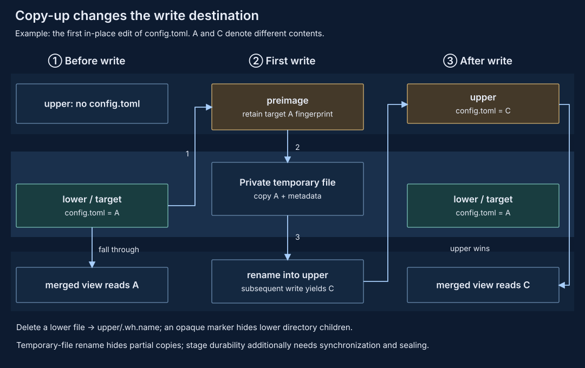

Deletions need an explicit representation. Removing an upper entry alone can expose its lower counterpart, so deleting a lower file creates a `.wh.name` whiteout. Opaque markers stop old lower children reappearing when certain directories are recreated or replaced. Renaming a lower directory also requires materializing its merged contents before moving it, rather than moving an empty directory shell.

Rename keeps partially copied files out of view; durability still requires synchronization. Managed stages default to syncing the observation log and upper after the task ends and writers stop, then publishing a seal. An unsealed managed stage rejects apply or reuse. Strict mode synchronizes first-mutation records earlier; [OverlayCore](overlayfs.md#preimages) defines the ordering.

### Why the upper is insufficient

While an Agent reads A and produces C, a developer may change the target to D. The upper says what should be written, but does not identify the old state on which it depends. A preimage retains the target's content and metadata fingerprint so apply can detect that conflict.

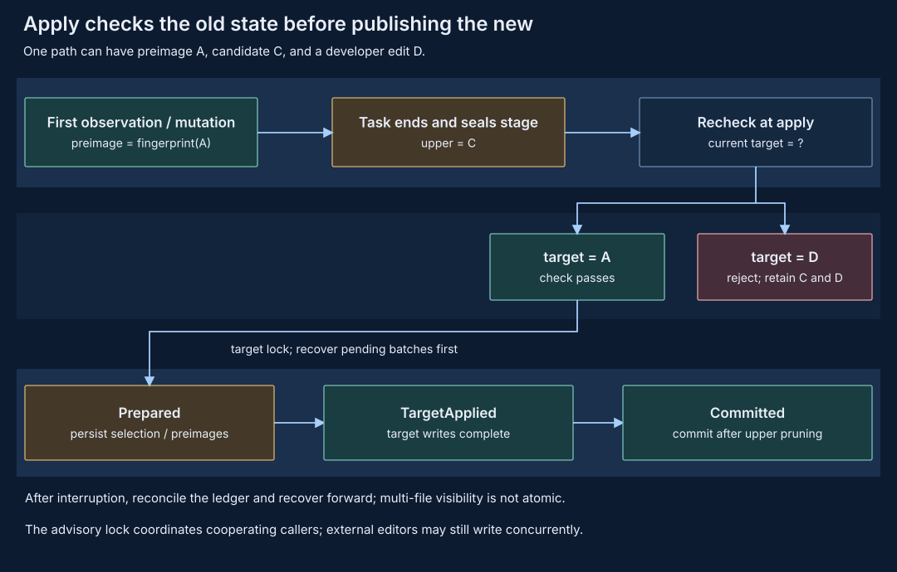

For a live lower, protection begins with the first actual content observation, or the pre-mutation state for a write without a prior read. Frozen layouts use an explicit target baseline. Ordinary stat and directory listing do not hash every file. If an extra lower supplies B while the eventual target contains A, A remains the conflict baseline.

Under the target lock, apply first recovers pending batches, closes the selected paths over required dependencies, and compares the target with preimages. It persists Prepared intent before modifying the target, records TargetApplied after target updates, prunes accepted upper entries and finally records Committed. An interrupted operation can reconcile retained phases and recover forward.

These are ordered file operations. External readers may see intermediate states, and the advisory lock coordinates only cooperating callers. The mechanism supplies conflict checks, selective acceptance and recovery information; it does not serialize arbitrary external editors. `drop` discards candidate files without undoing HTTPS requests already sent.

Source entry points: `pvisor-overlay-core/src/core.rs::copy_up_for_open` and `apply.rs::apply_overlay_selected`. See [OverlayCore details](overlayfs.md#detailed-design) for path validation, hard links and recovery.

## 6. Images: shared contents and demand reads {#image-mechanism}

Fully unpacking every image duplicates files and pays download costs before a task accesses them. The shared image cache keeps paths, permissions, directories and hard-link identities in each image's metadata, while storing file contents as reusable immutable objects.

Separating paths from content identity lets different paths in two images reference equal bytes, while the same path in different revisions can contain different bytes. A run pins `image + platform + revision` at startup instead of following mutable tags or HEAD, avoiding a mixture of old and new versions.

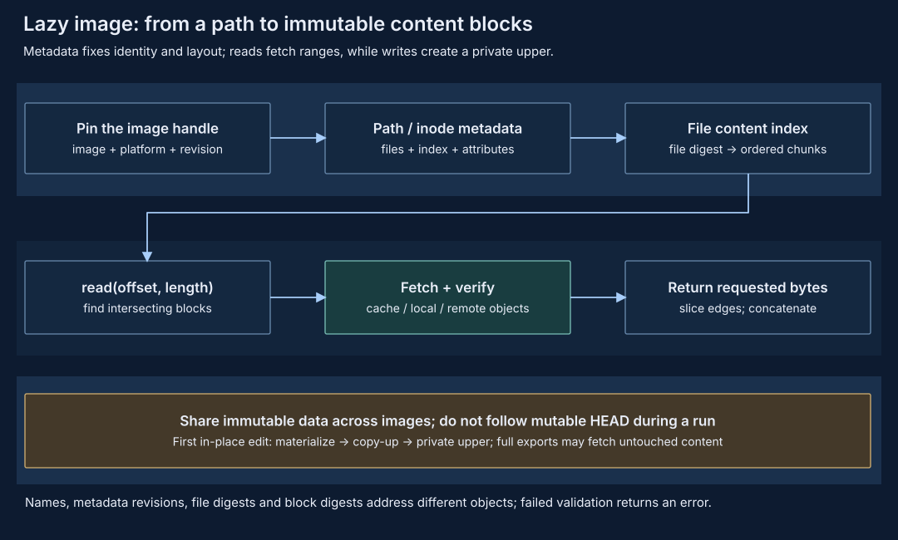

A `read(offset, length)` locates the inode and file-content index, computes intersecting blocks, and fetches local or remote objects only on cache misses. After the corresponding integrity checks it slices the requested range. Metadata paging and content caching have separate boundaries. Content misses do not hold a global file-service lock.

A VM lazy lower directly uses the shared file service. A private metadata projection preserves structures needed for native inode/FD and path checks, while READ contents come from the content backend; sparse placeholder holes are not returned as actual file bytes. A first ordinary modification must materialize the original file and copy it up. Complete export or snapshot can also fetch previously untouched content.

Lazy loading consequently moves some preparation work into first access. Hot-cache benefits, cold misses, metadata and copy-up costs need separate measurements. See [Shared image cache](shared-image-cache-storage.md) for storage and publication contracts. Source entry points are `pvisor/src/image/cache/backend.rs`, `direct.rs` and `storage.rs`.

## 7. Networking: the interception point determines control strength {#network-mechanism}

### From a hostname to two TCP connections

The VM path carries guest virtio-net Ethernet frames over a length-prefixed UnixStream into OverlayNet's smoltcp userspace stack. The guest believes it connects to the target service; the host opens an upstream connection and bridges bytes between two TCP connections.

Hostname policy encounters a basic problem: `connect` uses an IP address, losing the name the application originally requested. pVisor's synthetic DNS assigns a stable address within an Attempt and retains its name mapping. When a guest SYN arrives, egress can recover the logical name before checking port, transport, resolution and scoped policy.

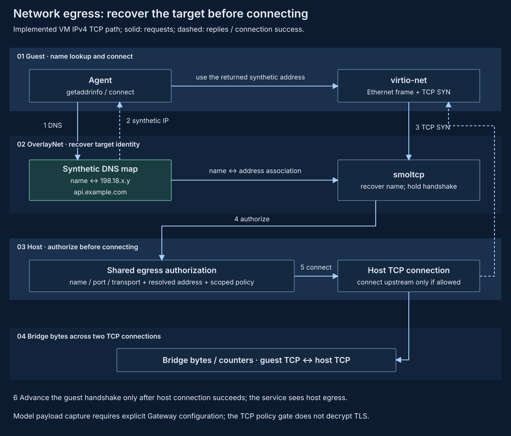

For `api.example.com:443`, the path authorizes the name and connection parameters, handles host resolution and corresponding address restrictions, then advances the guest handshake after authorization and a successful upstream connection. The synthetic address is an association identity, not a public destination. A host connector that hides its final endpoint behind an opaque alias also limits IP/CIDR policy visibility.

The VM currently provides IPv4 TCP and local DNS service. General UDP, IPv6, QUIC, incoming connections and unsupported destinations are rejected; TSI remains disabled. Host/container selective policy still primarily uses an explicit proxy. Proposed netns/seccomp drivers retain separate implementation status. See [OverlayNet](overlaynet.md) for the full matrix.

### Egress authorization and model observations

A TCP gate decides whether to establish a connection but cannot inspect model messages inside ordinary TLS ciphertext. Gateway receives model requests through explicit protocol configuration for known Agents, supplying routing, conversion and optional capture. Its observations cover model traffic that reaches it; filesystem writes and other network requests follow their respective paths.

An allowed HTTPS connection and a captured complete model call are therefore different facts. Their observation points explain why network counters, Gateway trajectories and Event Journal records need explicit scopes.

Source entry points: `ensure_listener` and `connect_vm_egress` in `pvisor-overlaynet/src/vm.rs`, plus `pvisor-gateway`. See [Gateway design](gateway.md) for protocol routing.

## 8. Snapshots: saving RAM is insufficient {#snapshot-mechanism}

Suppose guest CPUs are parked while a virtio-fs worker is about to write a read response into guest RAM. Capturing RAM now and queue state later can produce a snapshot containing a used ring that says the request completed alongside a buffer that never received its data. After restore, the guest may read incomplete results without resubmitting the request.

A full checkpoint therefore needs CPU, RAM, device queues and captured filesystems at one consistent cut. pvisor-vm acknowledges CPU parking, asks device workers to return queue ownership and drain RAM leases, then closes the memory-access gate. The caller captures compatible state within this window.

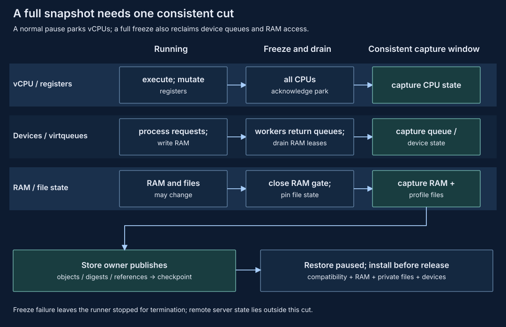

The VM runtime owns freezing and capture; storage owns objects, digests, references and durable checkpoint publication. Restore validates build/host/profile compatibility and RAM topology, prepares independent filesystem copies and private RAM mappings, installs CPU/device state, then releases execution. Failed freeze or device drain leaves the runner stopped for caller termination.

A workspace checkpoint retains a file branch. An Agent trajectory retains model context and tool history. An execution checkpoint retains machine state for a supported profile. Current native Job full VM checkpoints require no network device, private RAM and an owned complete rootfs. The networked example above cannot simply assume support for this capture mode.

Remote server state lies outside the machine cut. Saving local socket data cannot rewind that server. Current profile restrictions avoid treating distributed recovery as a property of local snapshots.

Source entry points: `pvisor-vm/src/vmm/mod.rs::freeze_for_snapshot`, `handle.rs` and `pvisor/src/environment_snapshot/`. See [Full environment snapshots](environment-snapshot.md) and [Job checkpoints](job-checkpoint-cli.md) for user contracts.

## 9. Journal: when a fact becomes committed {#boundaries}

Execution facts can originate in different asynchronous tasks, so timestamps cannot supply a reliable commit order. A disk Journal serializes appends with a single writer and in-process mutex, assigning increasing positions. Event IDs identify retries; `caused_by` expresses causal dependencies.

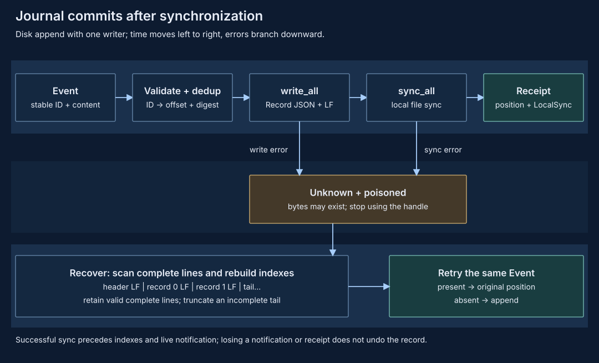

The normal path validates the Event, checks duplicate IDs, appends a JSON Record plus LF, calls `sync_all`, updates indexes, then sends live notification and returns a LocalSync receipt. Position is a record number, not a byte offset. Notifications serve live display; the file owns durable history.

A write or sync failure can leave partial or complete bytes. An error cannot establish that nothing committed. The Journal returns Unknown and isolates the current handle. Reopening scans complete lines and rebuilds indexes. An incomplete tail without LF can be truncated; a complete corrupt line fails validation. Retrying the same Event ID and content returns its original position if present; the same ID with different contents is rejected.

This distinguishes retrying a record from rerunning a task or resending a remote request. The Journal's deduplication contract covers the first operation; the others may create new effects. RunRecord, Bundle, Event Journal and apply ledger also lack a shared atomic commit point, so recovery must reconcile their respective states.

Source entry points: `pvisor-journal/src/journal.rs::append` and `trace.rs`. See [Journal design](journal.md) for format, cancellation and recovery, the [Version matrix](records-and-versions.md) for cross-module compatibility, and [Failure semantics and retries](failure-semantics.md) for reconciliation when effects are uncertain.

## 10. Turning design tradeoffs into research questions {#principles}

These mechanisms move costs. Copy-up defers file copying, lazy images defer content reads, COW defers private-page allocation, and cold compression exchanges CPU and recovery latency for residency. Whether they improve task density depends on whether the shifted costs are smaller for the actual workload.

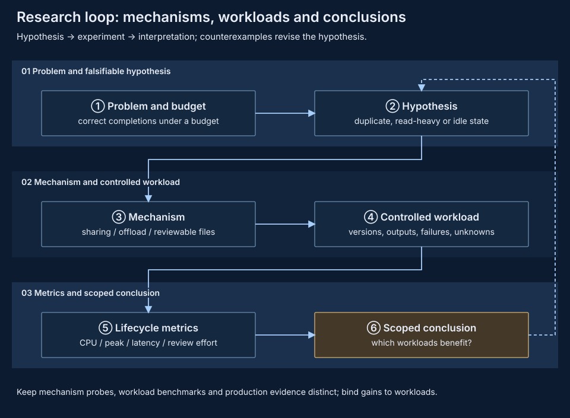

Concrete counterexamples guide experiments. Repeated, read-heavy VMs can expose sharing benefits; write-heavy tasks break sharing. Tasks touching a small image subset may benefit from lazy loading, while full traversal or extensive copy-up can shift preparation costs into execution. Repeated cold-block refaults may reduce ready memory while worsening tool-call tails.

Pin tasks, inputs, output checks, versions and total budgets, then measure correct completions, CPU, memory peaks, memory-time and restoration latency separately. Supervision cost additionally needs actual review, rejection and rework data; machine runtime cannot stand in for human attention. [Research directions](research/index.md) retain these hypotheses and integration boundaries. [Benchmarks](../benchmarks/index.md) retain each dataset's measurement scope.

## 11. Returning to the whole system {#results}

The example now forms a complete path. Admission fixes policy; the Session prepares VM, files and networking; the guest reads a lower through virtio-fs and opens HTTPS through controlled egress; writes copy up into the upper; completion synchronizes the stage, reclaims resources and retains facts. Finally, the developer uses preimage checks to publish selected candidate files into the target.

Execution isolation constrains access, staging constrains file publication, snapshots constrain recoverable state, and Journal constrains committed facts. Each module has a state owner, publication point and failure result on which an external orchestrator can base retry, fork or acceptance decisions.

Implementation scope remains explicit: the daemon has a VM-only NativeRuntime and an opt-in Linux physical pool, while its API does not expose native Job stage/apply or execution checkpoints. External orchestration and RL integration still need a separate handoff and end-to-end validation. Implemented mechanisms alone do not establish production density or long-term recovery conclusions.

The organization follows [ByteHook's project introduction and principles](https://github.com/bytedance/bhook/blob/main/doc/overview.zh-CN.md): explain prerequisite mechanisms, request paths and engineering constraints continuously. See [Open-source design references](research/design-documents.md) for further writing references and their application.
