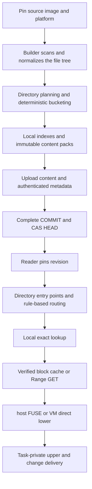

# Lazy Image V2: Directory-Local Packing and On-Demand Indexes

Use directories as access-locality boundaries, combine small files at publication time, and load exact indexes and content blocks on demand at read time to reduce small-object requests and startup index residency for S3-backed images.

| Item | Status / scope |
| --- | --- |
| Document status | RFC / design proposal, 2026-10-06; unapproved, unimplemented, with no performance acceptance results |
| Prerequisite implementation | [Shared image cache V1](shared-image-cache-storage.md), currently the only supported format |
| Target entry points | Filesystem / S3 backing store; host FUSE lower and VM direct virtio-fs lower |
| Format relationship | New format, new prefix, new handle; no in-place interpretation or rewriting of V1 |
| Tracking entry | [Roadmap: small-file delivery optimization](../community/roadmap.md#lazy-image-small-files) |

## 1. Problem and Decision Summary {#summary}

V1 already has separate image metadata, paginated indexes, content addressing, and conditional publication; it does not require expanding the entire directory tree at startup. Its content chunks are split independently starting at offset 0 of each file, with a maximum size of 1 MiB. Different files do not share a pack, and small files use objects of their own size: **not every small file is padded to 1 MiB**. Large numbers of distinct small files can still generate many GET / PUT requests; cold metadata queries also require dependent page reads.

V2 proposes:

1. Use one pack for the set of direct files in a small directory; use hash-prefix buckets with a fixed algorithm for small files in large directories, recursively subdividing buckets that exceed limits.
2. Store directory and rule entry points at the top level, not an image-wide table of per-file physical locations; keep exact file entries in directory-local, paginated indexes.
3. Separate file content identity from pack location; keep pack contents immutable and range-readable, without forcing content packs to be rewritten when indexes or attributes change.
4. Use metadata caches, verified content-block caches, adjacent-request coalescing, and bounded prefetching rather than translating every file access directly into an S3 GET.
5. Preserve V1's principles of platform separation, pinned revisions, HEAD CAS, and content verification; format evolution does not change executor isolation or task modification semantics.

This is a hypothesis for reducing preparation and access costs, not a guarantee that every task will be faster. Pure hash grouping loses locality, and packing causes update amplification and loss of physical deduplication; low-reuse first publication must be included in the accounting.

## 2. Goals and Non-Goals {#scope}

Goals: reduce the number of small objects, the index download / parsing / RSS required for cold startup, and remote waiting for small-file-intensive workloads; bound reads, caches, publication memory, and request concurrency; preserve filesystem correctness.

Non-goals: eliminate all file metadata, provide mutable shared packs, build a global cross-image reference-counting database, replace OCI build pipelines, provide cluster scheduling or online concurrent GC, or automatically obtain DAX / guest-host page sharing. Full scans, copy-up, and self-contained exports may still read all relevant content.

Nydus / EROFS are implementation approaches to evaluate, not current dependency commitments. If mature components meet integration and semantic requirements, their data plane can be reused; implementing this proposal does not require rebuilding every mechanism.

## 3. Invariants That Must Be Preserved {#invariants}

- Each open pins `image-key + platform + revision`; tag changes do not change a running view.
- Image / platform metadata remains separate; only immutable content may be shared. Sharing across tenants must also respect authorization boundaries.
- Successful routing does not mean a file exists; absence is confirmed by exact lookup, and network / verification failures must not become ENOENT.
- File paths, basenames, and symlink targets retain their raw bytes without requiring UTF-8; hashes do not replace path comparisons.
- Attributes, directory entries, content identity, and hardlink identity are modeled separately. Identical content does not imply an identical inode.
- All returned data and all index pages used are verified first; S3 ETags serve only as CAS tokens, not as SHA-256 digests.
- No metadata or content miss holds a service-wide lock; downloads, parsing, decompression, and caches all have budgets.
- HEAD is the visibility commit point for a new revision; a readable COMMIT does not mean the tag has been committed.

## 4. Architecture and Responsibilities {#architecture}



The builder owns source-content pinning, directory planning, serialization, verification, and publication. The reader owns path lookup, enumeration, range reads, and failure propagation. The node cache owns budgets, eviction, and miss coalescing. The Overlay / runner continues to own private modifications, copy-up, and lifecycle management; no task may write to a shared pack.

## 5. Directory Boundaries and Initial Policy {#policy}

### 5.1 Definition of a Directory

The base policy plans around **the direct children of one directory**; subdirectories are planned recursively and independently, without automatically absorbing the entire root directory or subtree. This keeps component-by-component path resolution clear and avoids repacking every subdirectory when its parent changes.

For example, `pkg/` and `pkg/sub/` can each have a pack. Future “whole small-subtree packing” must define ownership, subdirectory entry points, and split-migration rules, and use a new policy ID; it is not implicit behavior of the base format.

### 5.2 Initial Candidate Parameters

These parameters are for the prototype and must be selected through experiments; they are not existing defaults or performance commitments. Each revision records its actual policy, and readers must not depend on local default configuration.

| Parameter | Initial candidate | Measurement definition |
| --- | --- | --- |
| small_file_max_bytes | 64 KiB | Logical length of a regular file; larger files use separate large-file chunks |
| pack_max_payload_bytes | 1 MiB | Total raw content length after deduplication; excludes indexes and is not determined by compressed size |
| bucket_max_entries | 4,096 | Number of exact directory entries, including empty files and non-regular files |
| bucket_max_metadata_bytes | 1 MiB | Full encoded length of the local index, including page padding |
| metadata_page_bytes | 64 KiB | Page size for local indexes and routing indexes |
| payload_block_bytes | 64 KiB | Read and verification block size for raw packs |
| large_file_chunk_bytes | 1 MiB | Size of separate large-file content chunks |
| route_radix_bits | 4 | Number of bits used in each hash-prefix subdivision |
| initial_encoding | raw | No whole-pack compression in the initial version |

Small-file selection and bucket limits are separate concerns: a directory may contain large files, and its local index still stores their entries, but their large-file contents are not placed in the small-file pack. Empty files occupy no content space but still count toward entry and metadata budgets.

A bucket is split if any content, entry-count, or metadata-length limit is exceeded. A 1 MiB content threshold cannot bound a million empty files; publication is explicitly rejected if a single record exceeds format limits.

### 5.3 Deterministic Hash Bucketing

Directories use `single` or `hash-prefix` mode: use `single` when all entries and deduplicated small-file contents fit within the limits; otherwise partition their direct children according to the following rules, including entries for subdirectories, large files, empty files, and symlinks.

The routing key is defined as `SHA256(domain || u32_le(basename_length) || basename_bytes)`; domain is the version-fixed byte string `pvisor-lazy-v2-route` followed by a NUL. The basename excludes the parent path and contains neither `/` nor NUL; no case folding or Unicode normalization is performed. The root uses a separate directory identifier and does not participate in this algorithm as a basename.

First divide entries into 16 buckets using the highest 4 bits; subdivide over-limit buckets using the next group of 4 bits until they fit the budgets. Empty buckets use explicit EMPTY; normal buckets use LEAF; split buckets use SPLIT. A full SHA-256 provides at most 64 prefix levels; extreme collisions or different names with the same hash that exceed limits use a bounded raw-basename B+tree overflow bucket, rather than recursing indefinitely or assuming collisions cannot occur.

The overflow bucket's B+tree partitions raw names into leaves that satisfy the same content / metadata budgets, with one pack per partition. Only the overflow entry point may exceed the aggregate per-bucket limits; page size, tree depth, and total accesses remain bounded. Duplicate names are rejected at publication; hash-collision handling must not admit duplicate directory entries.

The same input, policy, and encoding version must produce identical routing, entry ordering, object bytes, and digests. Use raw-basename sorting, not HashMap iteration order. Gather statistics before bucketing; input traversal order must not determine boundaries.

Hash prefixes allow local bucket splits without using `hash % bucket_count`, which would redistribute the entire directory. Threshold changes may still alter the layout and therefore belong to a different policy; readers must not recompute the published layout.

## 6. Two-Level Indexes and “Wildcard” Semantics {#index}

### 6.1 A Routing Index, Not a File-Existence Index

Conceptually, a route can be written as `hash=a* -> bucket-X`, but it is **not a path glob** and must not be interpreted as guaranteeing that a class of paths exists. The on-disk representation uses radix routing records, not wildcard strings.

A routing leaf points to an authenticated local-index root; SPLIT points to the next routing page; only EMPTY proves that the bucket has no entries. Readers must verify prefix coverage, mutual exclusion, depth, and page references.

A small directory needs only one exact-index entry point; the routing structure for a huge directory is itself paginated, rather than placing every bucket mapping into startup JSON. Startup reads bounded control objects and root pages, without recursively downloading the entire directory tree.

### 6.2 Local Exact Indexes

Local indexes use read-only B+trees sorted by raw basename, recording names, types, attributes, inode/link-group, symlink targets, and subdirectory or content descriptors. Variable-length bytes are stored in authenticated arena pages; leaf records may reference an arena but must not rely on unverified external offsets.

Regular-file content descriptors are `EMPTY`, `PACK_SPAN`, or `CHUNKS`:

| Type | Required information |
| --- | --- |
| EMPTY | File length 0 and empty-content digest, with no data object |
| PACK_SPAN | Whole-file SHA-256, length, pack ID, offset within the pack, and reference to an authenticated block directory |
| CHUNKS | Whole-file SHA-256, length, and digest / length of ordered independent chunks; the descriptor list is paginated |

File metadata is separate from packs, so path or permission changes need not change the payload. Hardlinks use link-groups assigned stably within an image revision; inconsistent attributes and content are prohibited. V1 does not implement xattr storage, and V2 must not treat it as an existing capability: enabling xattrs requires explicit encoding / budgets and entry-point support; unsupported required attributes must not be silently discarded.

### 6.3 readdir and Negative Lookups

`lookup(parent, basename)` computes the route, reads the target local index, and compares the name exactly; raw names distinguish hash collisions. Absence is returned only when verified pages establish that no entry exists.

`readdir` emits entries in radix bucket order, then raw-basename order within each bucket; it does not promise directory-wide lexicographic order across buckets. Cookies bind the revision, directory, leaf bucket, and page / slot, remaining reproducible within the same revision; V1's cookie encoding cannot be reused. Full enumeration traverses all relevant pages and is O(N) work, with no constant-time promise.

Negative-lookup caches are isolated by revision and parent directory / basename; errors are not cached as negative entries. The file service performs symbolic-link resolution, path permission checks, and escape protection under existing contracts; the index must not traverse a symlink directly as a directory.

### 6.4 Index Scaling Boundaries

Total file metadata remains O(N), and routing size grows with the number of buckets. The optimization targets are less repetition of full paths, compact local records, and startup downloads / RSS that need not be O(N), not elimination of file information. Full scans and full-tree projections still consume corresponding resources.

### 6.5 Lookup Example

To access `/usr/lib/pkg/config.py`, the reader resolves verified entries for `usr`, `lib`, and `pkg` component by component from the pinned root, obtaining the `pkg` directory descriptor. In `single` mode it searches the local index directly; in `hash-prefix` mode it computes the routing key for `config.py` and follows the published LEAF / SPLIT records to the bucket. Prefixes such as `a*` and `a3*` illustrate routing only; they are not the actual hashes of these names.

The reader matches `config.py` exactly within the bucket, obtains its attributes and PACK_SPAN, verifies the associated block directory, and fetches blocks covering the span from cache or the remote store. Another file hitting the same block requires no further S3 request; another uncached block within the same pack may still require a request. Cached directory metadata avoids the corresponding remote accesses; no fixed GET count is promised for a first miss.

A missing name is established only by an authenticated EMPTY route or absence in the exact index. A missing S3 object indicates corruption / a missing dependency, not an absent path.

## 7. Pack Content Layout, Reads, and Integrity {#packs}

### 7.1 Decoupling Content from Physical Location

Within a bucket, content is deduplicated and sorted by whole-file digest; the payload is a gapless concatenation of unique non-empty small-file contents. Publication is rejected if different contents have the same digest but inconsistent lengths / bytes. The index stores spans; file attributes and paths are not written into the payload.

`pack_id = SHA256(payload_bytes)`. The same content set produces the same payload regardless of directory names, permissions, or publication time; different sets of neighboring contents may still produce different packs. This rule gives attribute changes / some renames an opportunity for reuse, but does not promise arbitrary cross-image deduplication.

Each pack has at most the candidate limit of 1 MiB of raw content, covered by 64 KiB verification blocks. Small files may span blocks; reads fetch the blocks covering their ranges, with the final block using its actual length. An unverified exact-byte Range GET must not be returned directly to the application.

### 7.2 Authentication Chain for Partial Reads

COMMIT authenticates the metadata-root descriptor; internal directory / routing / local-index pages carry child-page digests, and leaves reference authenticated content descriptors. A pack descriptor references a size-bounded block directory whose digest / length is covered by the authenticated index; the directory contains each block's length and SHA-256. The block directory need not contain its own digest.

The first read verifies the block directory, then fetches and verifies only the content blocks covering the requested range. A whole-pack download additionally verifies pack_id; whole-file materialization additionally verifies the whole-file digest. Page references contain object length, page offset / length, and digest, and records are interpreted only after successful verification. The authentication tree does not require downloading an image-wide checksums list at startup.

All page encodings use a fixed version, little-endian fields, length-prefixed raw bytes, and deterministic padding; digests do not depend on native struct layout. COMMIT's exact-byte hash is the revision, and COMMIT does not contain its own revision; child references point only to lower-level objects, and authentication dependency cycles are prohibited.

This is a logical schema, not a frozen byte-level ABI. Before implementing the encoding, headers, record widths, offsets, error codes, and golden fixtures must be specified; publishing production V2 objects based solely on this document is prohibited.

### 7.3 Compression Evolution

The initial raw encoding isolates the benefits of packing and coalesced reads. Future versions may add independently compressed frames: record compressed / decompressed lengths, offsets, codec, encoded digest, and decompression limits, and decompress only the required frames each time. Codec parameters and versions enter policy / feature identifiers. Whole-pack gzip must not be presented as supporting low-amplification random access, and compressed size must not be used to bypass logical capacity budgets.

## 8. Storage Tree and Identity {#storage}

The following is the proposed V2 layout; it uses a different bucket prefix / directory from V1.

```text
<v2-prefix>/
├── format.json
├── meta/<image-key>/identity.json
├── meta/<image-key>/platforms/<platform>/HEAD.json
├── meta/<image-key>/platforms/<platform>/revisions/<revision>/
│   ├── manifest.json
│   ├── config.json
│   ├── policy.json
│   ├── tree/                 # Paginated directories, routing, and local exact indexes
│   ├── inventory/            # Paginated complete object inventory; not required at startup
│   └── COMMIT.json
├── meta/<image-key>/platforms/<platform>/uploads/<upload-id>/
│   ├── plan.json
│   └── progress.json
└── data/
    ├── packs/sha256/<p0>/<p1>/<full-digest>
    ├── pack-tables/sha256/<p0>/<p1>/<full-digest>
    └── chunks/sha256/<p0>/<p1>/<full-digest>
```

The format fixes the version, hash, supported encodings, and hard limits; the policy fixes planning parameters for this revision and is authenticated by COMMIT. Directory descriptors and content locations belong to an image revision, without a mutable global location table. Identity rules retain V1's canonical reference, image-key, and platform definitions.

The proposed handle is `pvisor-v2:<image-key>:<platform>:<revision-hex>`, not a currently available interface. The manifest digest continues to represent OCI provenance rather than replacing the complete physical handle. Reader caches must isolate V1 / V2, storage authorization domains, and object types.

## 9. Publication, Deduplication, and Incremental Updates {#publication}

Publication flow: pin the source manifest / platform and observe the HEAD CAS token; scan the file tree and build a deterministic plan; generate / upload packs, chunks, and block directories; upload authenticated metadata and inventory bottom-up; verify the complete closure; write COMMIT; finally CAS HEAD.

Immutable objects are conditionally created, with digest / length verified before reuse; conflicts for the same image and platform fail explicitly rather than blindly overwriting. HEAD contains a unique publication_id; if the commit response is lost, reread and match the complete contents and this ID to distinguish this commit from other publications. Upload progress contains no credentials and does not participate in the revision hash.

Build memory must have a budget, with temporary-disk sorting and bucketing available; candidate limits must not be bypassed by “loading the entire image into a HashMap first.” The source must be immutable or frozen; changes during scanning cause failure / retry rather than producing a mixed-state image.

### Deduplication Boundaries

- Identical complete packs / chunks / block directories can be reused across images; large files retain V1-style content-chunk reuse.
- Small-file content identity remains independent, but **the physical bytes of an identical small file may be duplicated when it appears in different packs**. Separating content identity from location is only a prerequisite for further reuse, not a guarantee of physical deduplication.
- Prefer reusing unchanged directory buckets and existing packs for common dependencies. Reusing an entire identical bucket from a known base revision is allowed, but the base identity and policy must be pinned.
- Do not introduce a global mutable database queried for single-file deduplication. If fine-grained reuse across different buckets / directories requires an additional location layer, establish a separate RFC and account for index and request costs.

Modifying one file regenerates its pack; changes in entry count may trigger bucket splits / merges. The initial layout is determined only by current input and policy, without history-dependent hysteresis; update amplification is an explicit cost. Measure object churn and reuploaded bytes for renames, file additions / deletions, and changes to common dependencies.

## 10. Reads, Caches, and Request Budgets {#runtime}

Startup verifies only the format, HEAD / pinned handle, COMMIT, required config / policy, and root index; it does not read the complete inventory or every subdirectory. Control objects and root entry points use bounded parallel groups, while dependent traversal may still be serial.

Caches have three layers: authenticated metadata pages, authenticated content blocks, and optional complete verified packs. Keys include storage location / authorization domain, format, object digest, and block / page location; directory results additionally bind the revision. Cross-image deduplication must not bypass authorization, and a cache from one authorization domain must not be used in another.

Concurrent misses for the same block use singleflight; unrelated requests are not serialized. Adjacent blocks can be coalesced into a contiguous Range GET, then verified individually before being marked ready. Short responses, incorrect ranges, or verification failures are discarded without contaminating hit state. Persistent caches record verified ranges through atomic commits and do not treat partial files as complete objects after a crash.

Prefetching must have concurrency, byte, and cache budgets, with foreground requests taking priority; the initial version prefetches only selected buckets and adjacent blocks, without downloading an entire directory by default. Pausing a task or canceling a read releases only its waiters and must not unconditionally cancel downloads shared by other tasks. Timeouts, retry counts, and overall deadlines are explicitly configured; authorization errors are not retried indefinitely.

copy-up fully materializes the original file before writing to the private upper; checkpoints / self-contained exports fetch all required content within their existing scope, without omitting unaccessed files because of packing. The VM direct backend should not automatically fall back to an intermediate host FUSE layer to adopt V2; if a Nydus mount approach is selected, evaluate its additional path and deployment costs separately.

## 11. Compatibility, Migration, and GC {#compatibility}

The V1 prefix and format.json remain unchanged, and old programs reject V2. V2 read support requires explicit version-based dispatch; changing `format_version` to 2 or renaming a directory must not be treated as migration.

The migration tool reads a pinned V1 revision, verifies metadata / content, generates a V2 revision, and outputs an old-handle-to-new-handle mapping and a logical-tree equivalence report; migration may require a full download, and bytes and costs should be recorded. Republishing from a pinned OCI manifest is also possible. Old Job / checkpoint lower handles must not be silently replaced.

Rollback depends on retained V1 revisions and objects; running both formats consumes extra space. Failed V2 publication does not affect the old HEAD. Before deleting source code or storage, it must be demonstrated that all dependencies of Jobs / checkpoints still requiring recovery have been migrated or explicitly retired.

Packs are shared objects, so deleting an image must not directly delete its packs. The initial offline GC boundary follows V1: freeze publication and metadata changes, confirm that affected readers / publishers have stopped, traverse the inventories of all retained COMMITs, mark all packs, block directories, chunks, and metadata dependencies, then sweep. A grace period cannot establish that read-only clients without leases have exited; S3 lifecycle rules must not blindly delete data still referenced by pinned revisions.

Online concurrent GC is outside this proposal. Bounded eviction of read caches and reclamation of backing-store objects are different mechanisms; node-cache hits must not determine which objects offline recovery requires.

## 12. Security and Resource Limits {#security}

Beyond per-bucket limits, readers must limit control-object length, image-wide entry count, path / target length, directory depth, B+tree depth, page accesses per operation, total downloaded bytes, concurrent misses, and prefetch memory. Specific hard limits and rejection error codes must be decided before the encoding is frozen; V2 must not inherit V1's 200,000-entry limit while claiming support for a million files.

Validate integer overflow, offset+length, duplicate names, invalid parents, link-group consistency, prefix overlaps / gaps, page cycles, and invalid object references. Reject opens with unknown required features. Device / special nodes follow executor admission and are not automatically created on the host merely because an image contains them.

SHA-256 verification is not publisher authentication. Bucket permissions protect mutable HEAD, format, and provenance; readers receive minimal GetObject permissions, publishers receive conditional read / write permissions, and GC receives separate list / delete permissions. Digests, object sizes, and access timing may also reveal content relationships; cross-tenant sharing requires separate evaluation.

## 13. Validation and Observability {#validation}

Correctness precedes timing. Use pinned inputs and output verification to compare the complete logical trees, attributes, hardlinks, and read contents of V1 and V2; cover non-UTF-8 names, empty files, symlinks, threshold boundaries, cross-block spans, large directories, single overlong records, and artificially injected hash collisions.

Format tests include golden bytes, reproducible builds across processes, randomized traversal order, unknown versions, truncated pages, incorrect Range responses, corrupted blocks, malicious offsets / cycles, and cache interruption and repair. State tests include concurrent operations across images / platforms, HEAD conflicts and lost responses, pinned old revisions, cancellation of shared misses, first copy-up, and complete exports. Validate the host / VM entry points separately; a pass for one does not substitute for the other.

| Metric group | Required metrics |
| --- | --- |
| Indexes | Control / routing / exact-index request counts, downloaded bytes, parsing / verification CPU, startup and peak RSS |
| Content | GET / PUT, request coalescing rate, singleflight waiters, useful bytes / transferred bytes, cache hits and occupancy |
| Publication | Scan / hash / packing / upload time, peak memory and temporary disk, object count, unique physical bytes, update churn |
| Tasks | First useful tool call, time to correct completion, failures / retries / timeouts, interference with active tasks on the same machine |
| Cost | First publication, persistent storage, requests, transfer, node cache, and execution resources; total cost per correctly completed task |

Metrics record the format, policy, source digest, cache state, and concurrency budgets, distinguishing foreground from prefetch traffic; do not record failures as zero elapsed time.

### Engineering Experiment Plan

No experiments have been run. Before measurement begins, register the question, role, entry point, and controls in the benchmark registry; do not create completed benchmark IDs or performance conclusions in this RFC.

Controls are V1; V2 packs with per-file range requests; and V2 packs with block caching / request coalescing / prefetching. Also evaluate Nydus / EROFS approaches, keeping isolation method, backend, and total budgets as consistent as possible, and distinguishing format benefits from runtime-path benefits.

Workloads cover Python imports, Node.js dependency loading, directory stat / readdir, Git scans, and real compilation / tests; construct small-file-intensive directories, nested directories, empty-file-intensive directories, and sparse / full access patterns. Scales cover 1,000 / 10,000 / 100,000 entries, adding larger scales once hard limits permit; fanout covers 1 / 3 / 28, and access ratios cover 5% / 10% / 50% / 100%.

Measure first import / publication, published images on cold nodes, warm caches, concurrent bursts, and sustained eviction separately. First-time OCI preparation must not be excluded from total cost. Sweep thresholds and granularities, reporting the Pareto trade-off between request savings and read amplification.

Follow repository benchmark rules for randomized controls within the same batch, reporting sample counts, failures, interference exclusions, and the 95% CI of the median difference. Tail latency requires sufficient samples; do not report P99 from a small sample. Engineering A/B and diagnostics remain in design / evidence documents rather than directly becoming percentage-advantage claims on user-facing pages.

## 14. Implementation Phases and Open Questions {#delivery}

| Phase | Outputs and exit criteria |
| --- | --- |
| P0: Design review | Confirm direct-directory boundaries, routing key, and the trade-offs between local metadata and physical deduplication; evaluate Nydus / EROFS; do not declare the architecture approved |
| P1: Format prototype | Freeze byte encoding and hard limits; planner / builder / offline validator and golden fixtures; verify determinism and rejection of invalid inputs |
| P2: Read path | Implement filesystem support first, followed by S3 Range / verification / bounded caching; host and VM integration, complete semantic and failure tests |
| P3: Publication and migration | CAS / recovery, inventory, support for reading both formats including V1, and explicit migration tools; define retention and offline GC operational boundaries |
| P4: Performance acceptance | Complete registered engineering A/B experiments and full-cost evaluation; results determine thresholds, prefetch defaults, and whether to enable V2 |

Decisions still required before enabling V2: whether 1 MiB / 64 KiB are appropriate, whether raw is sufficient, the trade-off between directory and package grouping, whether physical reuse of small files across different packs justifies an additional location index, the precise xattr / special-node support matrix, and whether to choose a custom format or a mature component's data plane.

V2 must not enter the default path solely because it reduces object counts: it must also demonstrate file semantics, recoverability, resource bounds, and end-to-end benefits for target workloads. If those benefits do not hold, retain V1 / full-preparation options without weakening acceptance criteria.
