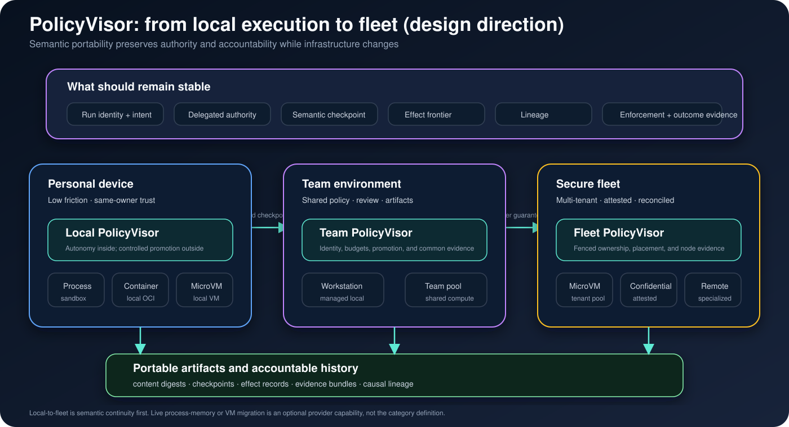

# Local to fleet

!!! note "Design direction"

    This page describes a future deployment model. The current CLI provides local executors, not a fleet scheduler, lease service or remote attestation system.

The portable unit is a logical Run, not a live virtual machine.

Across local and fleet placement, the following must remain stable:

- Run identity and parent/child lineage;
- delegated authority and its generation;
- semantic checkpoint and effect frontier;
- artifact identity and durable evidence;
- terminal result ownership.

The process, kernel, root filesystem, node, scheduler, and execution provider
may change. A provider is admissible only when it can satisfy the capability
dimensions requested by the Run. Unsupported guarantees must fail explicitly;
they must not silently become weaker after migration.

On a personal device, the main experience is a staged workspace and reviewable
effects. In a fleet, the same model adds placement, tenant isolation, leases,
attestation, recovery, and reconciliation without redefining the Run.

The stable identity model is defined in
[Run, Attempt, and Effect](../concepts/run-model.md). Provider admission
belongs to [pVisor isolation](isolation.md). Fleet coordination—placement, leases, and reconciliation—belongs to the
deployment control plane and does not change the logical Run contract.
