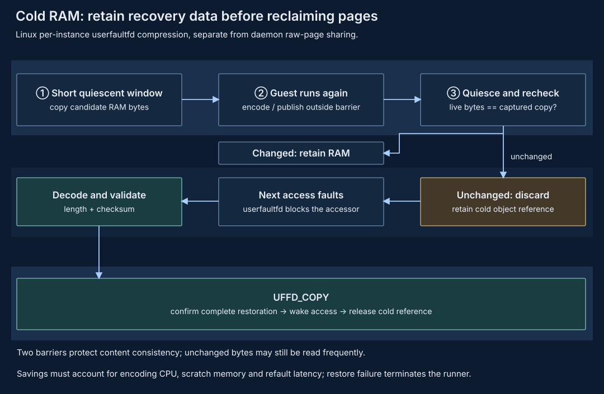

# Per-instance compression

Keep compressible cold content under one instance's control, without needing a
pool to save or recover it. This favors a narrow ownership and failure boundary
over cross-instance sharing.

## Target and current status {#status}

Linux x86_64 supports an experimental instance-local live pager. Enable the
default-off `VmSettings.cold_ram_compression` (`[vm].cold_ram_compression`) or
`--vm-cold-ram-compression`; the runner automatically starts it over private
anonymous RAM with a `LocalColdRamStore`. This is not `vm.ram_compression`,
which uses FUSE compressed file backing. The guest keeps running independently
of guest applications; this is not ordinary pause or whole-VM offload.

Independent checkpoint save/compress/restore remains a separate architectural
requirement. Live cold compression cannot currently combine with snapshot
capture or restore. The macOS/HVF heap pool is a separate experimental path.

## Ownership and data flow {#architecture}



The instance coordinator owns [complete checkpoints](../environment-snapshot.md),
including CPU/device state, compatibility, and persistent storage. Checkpoint
encoding may reuse codec code without adopting runtime cold-object lifetimes or
durability. Saving a compressed checkpoint alone does not shrink running RAM.

The runtime captures 64 KiB blocks with CPUs parked and device leases drained,
retaining at most 4 MiB per publication batch. Encoding/publication happens
outside that quiescence window while the guest runs. A second quiescence window
rechecks the live bytes; changed blocks stay resident. Only unchanged blocks
with a validated, instance-owned object are discarded with `MADV_DONTNEED`.
While the pager owns the mappings, balloon free-page reports are acknowledged
without discarding RAM, so they cannot bypass the pager's recovery ownership.

Kernel-fault-capable userfaultfd blocks CPU/KVM and kernel/device accesses to
missing RAM. The runtime decodes and validates length and checksums before
`UFFD_COPY`, verifies the complete copy, then wakes access and releases the cold
reference. Store references cannot be restored or released by another instance.
Guest applications need not participate. Cold objects are not persistent
recovery after a host crash; mapping or restore corruption fails the runner
rather than silently exposing zeroed data.

## Choices and tradeoffs {#tradeoffs}

Local storage removes publication IPC and service availability from recovery,
but each instance keeps its own encoded payload and pays its own codec cost.
Cross-instance [deduplication](deduplication.md) is not required for correctness;
`vm.ram_dedup` is explicitly incompatible with this pager.

Long-lived, compressible cold content is the useful target. Hot or incompressible
content can cost more than resident RAM once object overhead and repeated decoding
are included. The local store rejects raw blocks and encoded payloads for which
`encoded_bytes + 256 > decoded_bytes * 7 / 8`. Budget or compression rejection
leaves the original RAM resident. Encoded payload is capped at half configured
RAM, with an object-count cap of `ceil(configured_ram_bytes / 65536)`; these are
separate bounds, not a process-RSS limit.

Reserve temporary memory for stable copies and encoding, and recovery headroom
for decoded pages and scratch. Background work must yield to restoration;
compression ratio alone says nothing about CPU cost or application tail latency.

## Direction and constraints {#direction}

Linux requires 4 KiB host pages and ordinary private anonymous writable RAM.
The builder-authorized immutable raw firmware mapping is excluded only after
matching its pointer, length and guest topology; unknown raw mappings,
file-backed/restored COW, shared and hugetlb RAM are rejected. Device/DAX windows
are not candidates. Builds with `tee`, `aws-nitro`, `gpu`, `snd` or `input` are
rejected, as are existing device preparation, dedup advice or a second pager.
Compiled fault support is not proof of host permission.

Kernel-fault authority must come from the userfaultfd syscall or access to
`/dev/userfaultfd`; user-mode-only faults are insufficient for KVM and kernel I/O.
Missing authority fails startup without fallback. pVisor changes no global
sysctl. An administrator can grant and later revoke access for just one user
(`reiase` in this example), if the device is available:

```bash
sudo setfacl -m u:reiase:rw /dev/userfaultfd
```

After the opted-in VMs exit, revoke the grant:

```bash
sudo setfacl -x u:reiase /dev/userfaultfd
```

Admission rejects `vm.ram_backing`, `vm.ram_compression`, `vm.ram_dedup`,
`vm.snapshot_filesystem_pool`, snapshot capture/restore and whole-VM
[offload/FUSE backing](offload.md) combinations. Local compression and external
`vm.memory_pool` are mutually exclusive. The current Linux daemon `--memory-pool`
uses raw-page physical sharing: reference-pinned slots in a read-only,
size-sealed memfd are mapped by VMs with `MAP_PRIVATE`. It registers no
userfaultfd and does not compress unique contents. The paths reuse sampling
and recheck barriers but have different restoration and object lifetimes.
See [daemon memory pool](../../guides/daemon/index.md#memory-pool) for deployment.

Selection is experimental eviction/refault probing, not a read-access heat
detector: unchanged bytes can still be read frequently. Rechecks protect content,
not workload latency. Historical encoded-object pooling and broader client-owned
proposals remain in [pooled compression](compression-pool.md); they do not replace
the current physical-pool contract. macOS has no equivalent delivered daemon
physical-sharing path.

## Evidence boundary {#evidence}

[Memory evidence](proof-of-concept.md#memory-evidence) does not establish known
production net gains. Compare total host occupancy, temporary peaks, CPU cost,
and application tails, not encoded size alone. See the [overview](compression.md)
and [pooled alternative](compression-pool.md) for the ownership choice.
