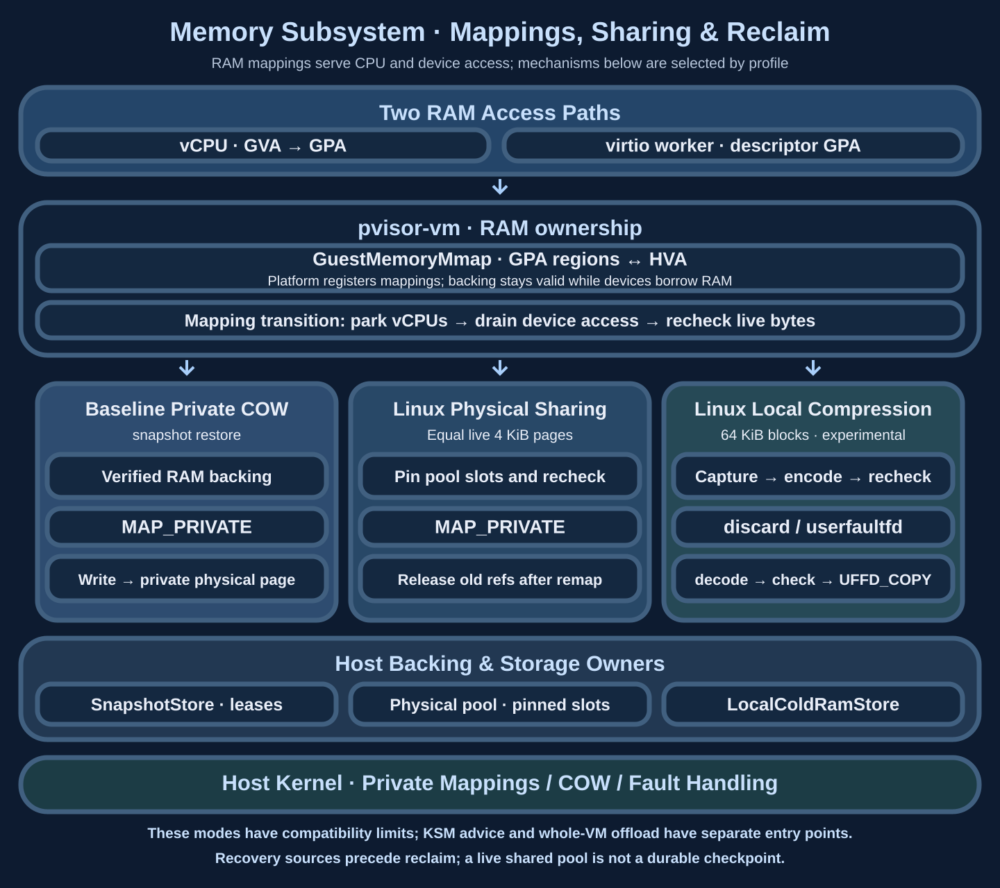

# Memory subsystem: mappings, sharing and reclamation

Similar environments and temporarily idle working sets need different policies: sharing removes duplicate copies, compression reduces retained bytes, and offload lowers residency. Select mechanisms by recovery sources, private writes, CPU, peaks and latency of the next tool access.

## Overall architecture and principles {#architecture}

The RAM block in the overall architecture serves both vCPUs and virtual devices. vCPUs access RAM through hardware address translation; devices take GPAs from descriptors and reach the same bytes through VMM mappings. Sharing, compression and reclamation must account for both access paths.

| Object | Owner | Lifetime constraint |
| --- | --- | --- |
| GPA regions and HVA mappings | `pvisor-vm` guest memory / backend | Mappings remain valid while devices retain leases |
| Snapshot backing and leases | Snapshot store; VM owns mappings | Validate identity/ranges before mapping; release after every user finishes |
| Shared slots and references | Daemon physical pool; VM owns private mappings | Mapped slots cannot be reused; disconnect requires process-liveness reconciliation |
| Encoded cold blocks and restore references | Cold store; VM pager owns block state | Reclaim only with verifiable recovery objects; release cold references after successful restore |

### Address translation and private writes {#address-space}

GVA is a guest-process address, translated by guest page tables to GPA. KVM/HVF registers guest regions so GPAs resolve to host physical pages. HVA is the host virtual address used by device implementations to access that RAM. Equal GPAs identify positions in separate machines; shared physical content additionally requires common backing and appropriate mappings.

`MAP_PRIVATE` allows instances to read the same immutable backing while writes create private physical pages. GPA and HVA can remain unchanged while the host physical page changes: that is the COW isolation point. Guest translation, host mappings and shared file content are different layers, so summing process RSS does not directly measure physical consumption.

The VM runtime owns mappings and consistent CPU/device access; Jobs and snapshot stores own complete-state publication and persistent references. The Linux physical page pool retains referenced shared slots; local compressed stores retain encoded instance-cold pages. Their recovery and failure contracts differ.

Pin a reliable backing or recovery source before unmapping or reclaiming original RAM. Private COW isolates writes; live pool references prevent slot reuse. Runtime sharing is separate from a durable machine checkpoint, and pool uptime does not replace durable state.

## Mechanisms and working sets {#capabilities}

| Mechanism | Suitable content | Costs and boundaries |
| --- | --- | --- |
| Snapshot baseline + private COW | Unmodified pages restored from the same verified backing | Writes become private; backing identity and compatible profiles are required |
| Linux KSM advice | Duplicate content in eligible private RAM, including private file COW candidates | Asynchronous scanning and COW; host administrators control the scanner |
| Daemon physical page pool | Equal resident 4 KiB pages in different VM sessions | Bounded scans and references, separate pool failure domain; no compression of unique pages |
| Local live compression | Unique compressible cold content within an instance | userfaultfd permissions, encoding CPU and refault costs |
| Whole-VM offload | Idle state with a retained recovery source | Write/restore costs, storage and peak headroom |

See [Memory deduplication](deduplication.md), [Memory compression](compression.md), [Per-instance compression](compression-local.md) and [Offload format](offload-format.md). Historical [pooled-server compression](compression-pool.md) retains encoded objects; the current Linux daemon physical pool shares raw pages. They remain separate mechanisms.

## Ownership and publication order {#ownership}

1. Select resident candidates and snapshot their content without touching all sparse RAM merely to optimize it.
2. Recheck live bytes with CPUs and devices quiesced.
3. Pin the pool object and replace matching pages with `MAP_PRIVATE`; kernel COW isolates writes.
4. Release old references after replacing their mappings. Disconnects retain references until pidfd confirms peer exit.

This sequence describes the Linux physical pool. Snapshot COW, local compression and offload own their publication, recovery and cleanup sequences. VM owners perform mapping transitions and freezing; the pool receives neither guest pointers nor authority to publish complete checkpoints.

Same-UID peer checks and private sockets define the current host trust boundary rather than general multi-tenant isolation. Content presence and sharing latency remain considerations when selecting a trust domain.

### Compression, fault restoration and whole-VM offload {#reclaim-path}

Linux per-instance cold compression operates on 64 KiB blocks. A first short quiescent window captures candidates; encoding and publication run outside it; a second window rechecks live bytes. Only unchanged blocks with recovery references are discarded. Encoding failures, rejected budgets and changed content leave original pages resident. The mode requires userfaultfd authorization for kernel faults and a compatible RAM profile; userspace-only fault support cannot restore vCPU kernel accesses.

On access, the pager obtains the recovery object, verifies length and checksum, installs the complete block at its original address through `UFFD_COPY`, then wakes the accessor. Corruption fails the runner. Encoding, captured raw bytes and restore buffers add peak usage. Unchanged blocks may still be read frequently, so the current strategy is eviction/refault probing.

Whole-VM offload preserves recoverable state at a machine consistency boundary before reducing RAM residency. Its stopping scope differs from online block optimization. Current vCPU observation is experimental and lacks complete wake deadlines, so it cannot automatically decide that offload is safe. [RAM offload](offload.md) owns platform, profile and restoration order; [Per-instance compression](compression-local.md) owns block state transitions.

## Capacity and failure budgets {#budgets}

A node budget includes shared working sets, private COW, per-instance overhead, pool indexes, in-flight scratch and restoration headroom. Sandbox hard limits, pool payload limits, PSS and whole-group cgroup charges are accounted for separately. The pool sits outside individual sandbox cgroups, so lower RSS alone cannot relax admission.

The default Linux daemon pool specifies 512 MiB storage, 32,768 objects, 32 connections and 32,768 references per connection. The 4 KiB object ceiling bounds distinct shared content to 128 MiB. Indexes, mappings and threads add overhead; rejected puts leave original pages resident. See [Shared working sets](../daemon/shared-working-set.md) and [daemon operations](../daemon/operations.md) for deployment.

Losing the pool fails dependent VMs. API restart can reuse a live pool; pool-process or host-reboot recovery is unimplemented. Compression restoration needs uncompressed pages and buffers, so savings cannot directly become equal capacity for new instances.

## Implementation and combinations {#direction}

The Linux daemon enables raw-page sharing explicitly with `serve --memory-pool`; it does not require userfaultfd. Per-instance live compression uses a separate userfaultfd mode. Snapshot capture/restore, file backing, whole-VM offload, KSM advice and cold-page paths have explicit incompatibility checks. Callers select supported profiles; combinations do not switch automatically at runtime.

[VM memory benchmarks](../../benchmarks/vm-memory/index.md) retain sharing and offload evidence by configuration, samples and accounting scope. Ready-stage savings do not guarantee lower lifecycle peaks, and writes reduce sharing. [Proofs of concept](proof-of-concept.md) retain historical mechanisms and failures; [Environment snapshots](../environment-snapshot.md) define complete-state contracts.

## System connections and source map {#integration}

Mappings and block state stay inside the VM; pools and stores supply referenced content. Virtual devices join the same quiescence boundary through RAM leases. [Complete snapshots](../environment-snapshot.md#consistent-cut) additionally combine CPU, RAM, devices and files. [Daemon admission](../daemon/admission.md) must budget private pages, shared services and restore peaks across the node, rather than converting a local compression ratio directly into concurrency.

Source entries: `crates/pvisor-vm/src/memory.rs`, `handle.rs`, `cold_ram_linux.rs`, `ram_dedup.rs` and `devices/virtio/memory_gate.rs`. `api.rs` defines interfaces and lifecycles; [Shared working sets](../daemon/shared-working-set.md) covers daemon object budgets and process ownership.
