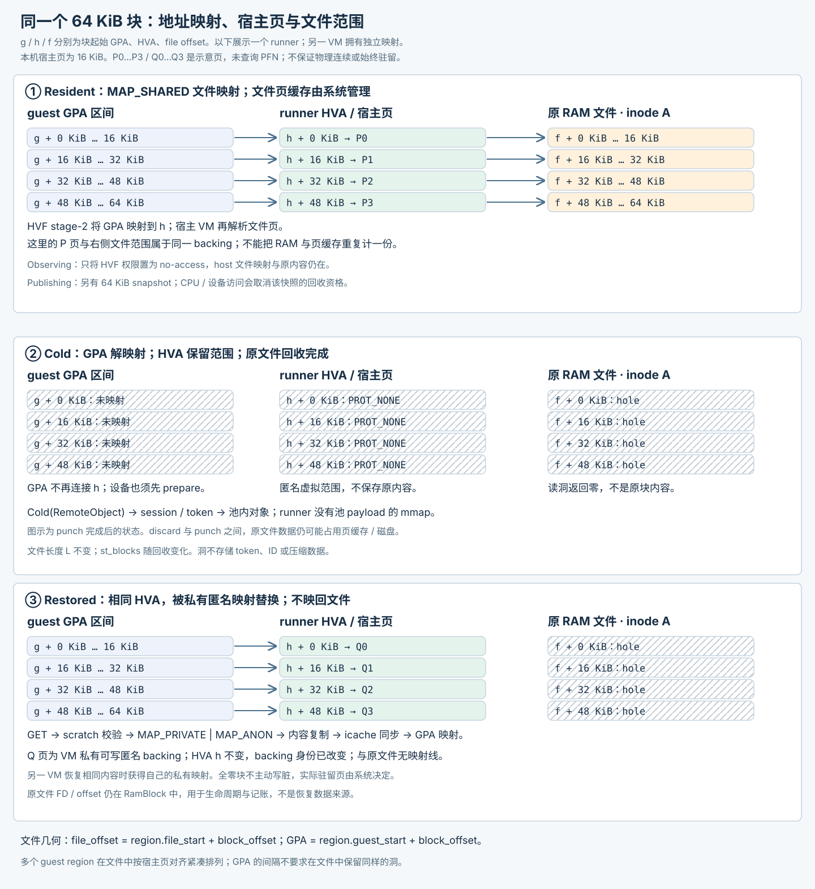
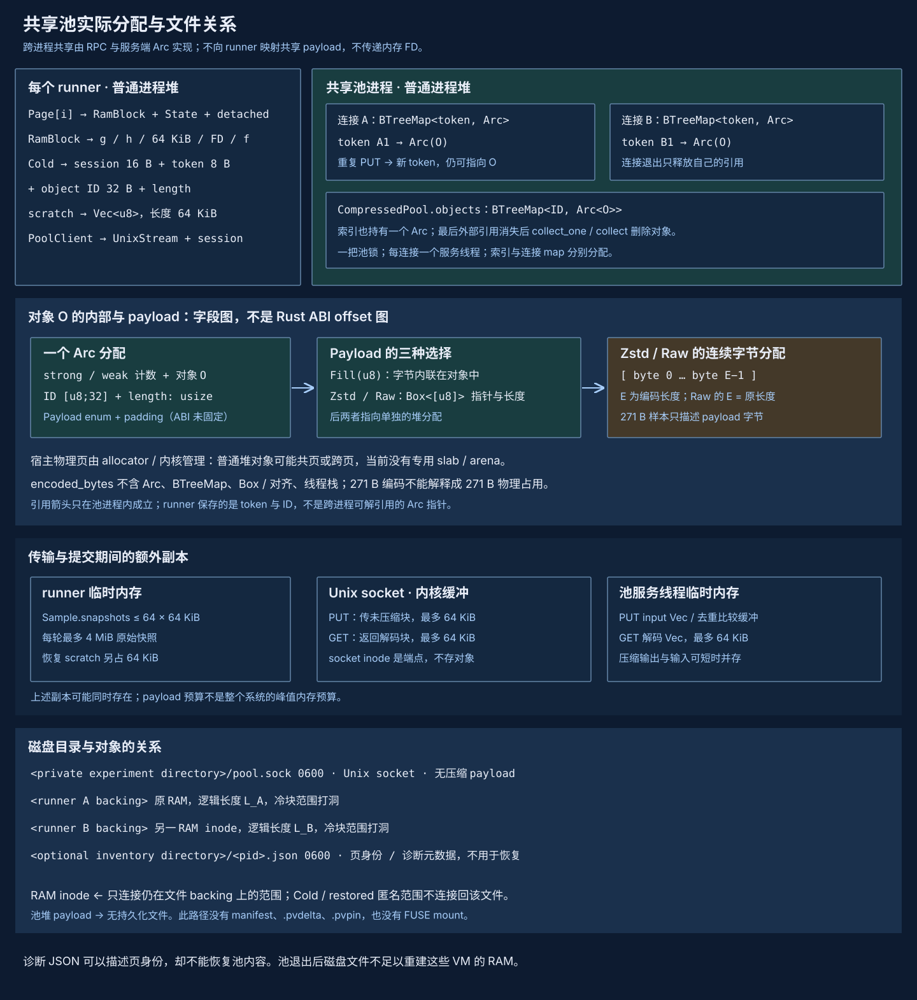

# Experimental proof of concept

Shared-baseline, COW, and cold-pool experiments provide foundations for memory optimization while exposing service availability, restoration contention, and physical-accounting limitations. [Memory optimization](index.md), [Memory deduplication](deduplication.md), and [Memory compression](compression.md) define the target architecture. The implementation, experiments, and failures below retain their version scope rather than establishing production guarantees for future approaches.


The current Linux daemon pool uses physical shared pages with COW; reads do not restore private copies. See the [daemon guide](../../guides/daemon/index.md#memory-pool) for activation and budgets. This page retains the macOS cold-compression and historical Linux mechanism records.
## How experiments inform the architecture {#architectural-lessons}

- Shared-baseline and independent-write probes support reusing system COW first, without building a merger for arbitrary hot pages.
- The cold pool shares encoded content but restores private RAM. Service-loss experiments show why the only copy should not remain in a service heap.
- Two-window publication supports moving encoding and IPC outside freeze windows, but does not establish that restoration contention or tail latency is solved.
- Logical reclamation, encoded payloads, and residency proxies are not net host physical savings. Historical percentages cannot directly determine production density.

Targets and evidence remain separate. Experimental parameters, protocols, and explicit interfaces describe their respective implementations, not constraints on the new architecture.

## 1. Motivation {#motivation}

Agent VMs often run the same system and tools, retaining similar code, caches and runtime data. Separate RAM copies make isolation straightforward, but charge each VM for repeated content. Between interactions, a VM may also retain a working set that it will need later. Pausing vCPUs does not release those pages.

The recorded macOS approach handles cold blocks on the host: observe RAM ranges without CPU or device access, compress their contents and transfer ownership to a shared pool on the same host. Identical contents retain one encoded object; accesses restore writable pages owned by each VM. This requires neither guest zram nor application-managed state saving.

The benefit depends on content duplication, compressibility and the length of cold windows. Observation changes guest access permissions, and restoration costs transport, validation and remapping. Write-heavy workloads or repeated full-working-set scans may consume the initial savings quickly. Memory and execution latency must be evaluated together.

The experimental macOS / Apple Silicon working-tree implementation recorded on 2026-10-03 was disabled by default. Its first version used a foreground pool and explicit CLI/SDK integration. Pool-restart recovery and whole-system physical-memory acceptance were incomplete. Historical iterations remain in repository file `docs/macos-memory-sharing.md`, and raw evidence in `review_project/06-evidence/macos-memory/`. These mechanism records and measurements apply only to the execution versions recorded with each dataset.

## 2. Core design {#core-design}

### Shared objects, private restored pages {#ownership}

The pool owns immutable content, with no guest addresses, vCPUs or device objects. Each runner owns its mappings, block states and connection references. When two VMs submit identical blocks, the pool retains one object and releases their references independently. Restored writable anonymous pages belong to each VM; writes by one VM cannot change the other's content.

See [physical layout and file relationships](#physical-layout) below for actual mappings, pool allocations and disk relationships.

Deduplication occurs in the compressed state. The current pager neither merges arbitrary hot anonymous pages into a shared writable mapping nor runs background KSM scanning. Two resident copies after restoration are permitted. Native shared-base COW has probe evidence but is not the current pager's hot-page sharing strategy.

| Approach | Existing work | Tradeoff |
|---|---|---|
| A: common read-only file base with `MAP_PRIVATE` COW | Two-process HVF probes, page identity and write isolation | Uses system COW; private modifications need a separate commit/reclaim contract |
| B: shared base with HVF write protection and explicit privatization | Stage-2 write faults, instruction retry and unchanged-base checks | More direct control; CPU and device writes must both enter privatization |
| C: immutable compressed pool with host cold-block pager | Historical Linux cold-pool path | Compressed-state deduplication with private restored RAM; adds faults, RPCs and mapping maintenance |
| D: FUSE compressed backing with whole-VM offload | Separate [offload implementation](../offload/index.md) | Suitable for idle VMs, without block-level temperature; incompatible with C |

### Responsibilities and availability {#components}

| Component | Owned data | Responsibility |
|---|---|---|
| `CompressedPool` | Content ID → `Arc<CompressedObject>` | Encoding, deduplication, budgets and collection |
| `ipc::serve` / `PoolClient` | Session, tokens, connection references | Cross-process PUT / GET / RELEASE / STATS |
| `vm::pager::Pager` | `Vec<Page>`, cursor, 64 KiB scratch | Observation, cold-block publication, CPU/device restoration |
| `RamBlock` | GPA, host address, file FD/offset | HVF permissions, unmapping, private restoration and file punching |
| `VmmHandle` / `MemoryGate` | Transition lock, device access leases | Pause CPUs and drain device accesses before mapping changes |
| `inventory` and experiment scripts | Page identities, residency and process ledgers | Diagnostics and matched experiments, outside deduplication decisions |

The pool contains in-memory objects, without `.pvdelta` backing. Once a Cold block's original file range has been reclaimed, its pool reference is the only retained content source. Disconnection, protocol damage or restoration failure stops the dependent runner. It cannot automatically fall back to the original backing. A pool is therefore also a shared availability boundary, intended for experimental VMs within one user and trust domain.

## 3. Detailed data and mechanisms {#detailed-design}

### Content identity, encoding and budgets {#content}

An object ID is:

```text
SHA-256("PVRES1\0\0" || decoded_length:u64_le || decoded_bytes)
```

The domain prefix separates it from disk generation IDs. Inputs contain 1–65,536 B. `intern()` computes the ID and verifies every byte of an existing candidate before reuse: Fill / Raw compare directly, while Zstd decodes first. Both length and content must match. New content uses these encoding rules:

| Payload | Selection | `encoded_bytes` accounting |
|---|---|---:|
| `Fill(u8)` | All bytes identical, including zero blocks | 1 B |
| `Zstd(Box<[u8]>)` | zstd level 1 output smaller than input | Encoded length |
| `Raw(Box<[u8]>)` | Compression does not reduce size | Input length |

`Box<[u8]>` avoids retaining the worst-case capacity of the compression `Vec`. Restoration validates output length, decoded length and content ID. The pool limits total payload bytes and object count separately. Payload budgets exclude tree nodes, Arc overhead, connection tokens, thread stacks, scratch buffers and allocator overhead, and do not bound the transient peak while processing a new input.

A `BTreeMap` indexes objects, serialized by one pool mutex. Hashing, duplicate comparison and new compression run inside `intern()` while its caller holds that lock; submissions by different VMs can therefore wait for each other. GET holds its connection's Arc and decodes without the pool lock. Releasing a known object uses `collect_one(id)`; capacity pressure and connection teardown perform full-index collection. Objects disappear only after the last external Arc is released. There is no hidden GC thread or disk generation compaction.

### Physical layout and file relationships {#physical-layout}

The first figure expands one 64 KiB block across GPA, HVA, host backing and file offset. On the experiment machine it spans four 16 KiB host pages. Resident blocks use file-backed mappings; Cold blocks have no GPA mapping and their HVA range becomes anonymous `PROT_NONE`. Restoration preserves HVA but replaces backing with private anonymous RAM. Holes in the original file are not refilled with current RAM.



Figure annotations are in Chinese. P/Q denote backing pages, not measured PFNs, with no guarantee of physical contiguity or continuous residency. A file mapping and its page cache are not two independent RAM copies. A virtual range does not imply an equal physical allocation.

The second figure expands ordinary pool-process heap allocations. The content index and per-connection token maps reference one Arc object containing ID, length and Payload. Zstd/Raw bytes live in a separate `Box<[u8]>` allocation. Runners hold tokens and IDs, transmitting raw blocks over Unix sockets without directly mapping pool payload.



There is no dedicated slab/arena, so small encoded objects cannot be drawn as densely filling host pages. Rust struct ABI is not fixed either: the figure lists fields and actual allocation relationships, without unverified struct offsets. Disk entries consist of the socket endpoint, each VM's original backing and optional diagnostic JSON. Compressed objects have no disk files, and diagnostic JSON is not a manifest.

### Block states and cold windows {#page-state}

A pager `Page` contains a `RamBlock`, `State` and `file_detached`. `RamBlock` records the guest address, stable host address, 64 KiB length and original file range. Host page size is queried at runtime. The experiment machine uses 16 KiB pages, so one block covers four host pages; the offload format's 4 KiB staging unit is not the remapping unit.

| State | CPU/device access | Content location | Next action |
|---|---|---|---|
| `Resident` | Normal access | Initial file mapping or restored anonymous pages | A later rotation may arm observation |
| `Observing(Instant)` | CPU faults; device preparation cancels observation | Host content remains intact; HVF permissions are no-access | Access returns to Resident; 200 ms without access permits submission |
| `Publishing` | CPU/device access cancels publication eligibility and returns to Resident | Original mapping remains; an additional snapshot is submitted outside the paused section | Reclaim only in a new quiescent epoch if access has not invalidated the state; otherwise release surplus pool references |
| `Cold(RemoteObject)` | CPU fault/device preparation must restore first | Immutable pool object; anonymous host range is `PROT_NONE` | GET, validate, private mapping, release reference |
| `Deferred(Instant)` | Normal access | Resident content retained after rejected submission | Observe again after 30 s, without reusing the old cold decision |

No-access covers CPU reads, writes and instruction fetches; device preparation cancels observation for its ranges. `mincore` reports residency, not access temperature. `ColdWindows` separately provides observation-versioned candidates for standalone interfaces. The current pager uses the state machine above rather than that ledger to reclaim blocks.

Startup waits 1 s; maintenance iterations sleep 250 ms apart. Current source prepares at most 256 observation/copy operations and visits at most one rotation; commit handles at most 64 candidates. Each phase has its own 8 ms soft budget. Cold, unexpired Deferred and immature Observing blocks do not consume preparation quota. Each iteration also limits raw snapshots to 64 blocks (4 MiB). Snapshot capture and mapping commit use separate quiescent sections; PUT, statistics and file reclaim run outside them. Soft budgets are not hard real-time guarantees, and the interval is not an exact 250 ms period.

The ten-round v1 results use the earlier quota of 256 visited blocks. Three matched pairs with the actual-operation quota have now passed in v2, reported below. The batches ran at different times, so the entire difference cannot be precisely attributed to this change.

### Reclaim transaction and file relationships {#eviction}

`with_ram_quiesced()` acquires the VM transition lock, pauses vCPUs, then releases the VMM lock before attempting to close the device gate. It skips user-paused VMs. Retained device buffers cause CPUs to resume and that maintenance round to be skipped. Once the gate closes, mapping changes run under the VMM/pager locks, followed by resumption. Optional maintenance does not treat normal device activity as a fault or wait for the normal offload path's five-second drain deadline.

A mature Observing block uses the current `Publishing` implementation:

1. Copy each block into its own 64 KiB snapshot in the first quiescent epoch, mark Publishing, then resume CPUs/devices.
2. PUT snapshots and validate replies outside the paused section. CPU faults or device preparation may restore original access permissions and return Publishing to Resident, invalidating reclaim eligibility.
3. Attempt another quiescent epoch. Only blocks still Publishing with successful pool references become Cold, lose their GPA mappings and receive anonymous `PROT_NONE` at the original HVA.
4. Rejected uncancelled blocks become Deferred. Access invalidation, commit-budget exhaustion or unavailable quiescence preserves original contents rather than discarding mappings using stale snapshots. Surplus references are RELEASEd outside the paused section.
5. After resumption, punch newly detached original file ranges. Dropping the snapshot batch also frees the temporary raw copies.

Moving pool publication outside the paused section is present in the working tree. The v1/v2 results below predate that change and cannot establish its pause duration or peak consumption.

The content reference is acquired before destroying the mapping. File punching stays outside the paused section to avoid disk I/O tails in CPU stalls. This requires that the original file range never be mapped back into the VM. Restoration always uses private anonymous pages and may therefore run concurrently with file punching. `file_detached` permits only one punch per block; `PENDING_FILE_BYTES` tracks detached ranges awaiting completion, and `PENDING_SNAPSHOT_BYTES` tracks temporary raw snapshots; restoration retains a separate 64 KiB scratch buffer.

```text
<private experiment directory>/       Caller-created, owned by this user, inaccessible to others
└── pool.sock                         Unix socket; experiment server sets mode 0600

<VM backing path>                    Original file-backed RAM, unchanged length, cold ranges punched
                                     No longer a complete RAM snapshot; pool contents stay in memory
<optional inventory directory>/
└── <pid>.json                        Diagnostic output, not a recovery manifest
```

Pool objects have no individual files or persistent pins. Executor creation rejects coexistence with FUSE compressed backing; whole-VM offload is also rejected. Background reclamation publishes no checkpoint, changes no public RunState and does not save CPU/device state for recovery in a new process.

### CPU and device restoration {#restore}

Before MMIO decoding, HVF offers data/instruction aborts to the RAM resolver. The pager finds a block by GPA. A fault in this VM's RAM returns handled after restoration, retrying the original instruction without advancing PC. Addresses outside RAM retain the MMIO path. Another vCPU or device may already have restored a block, so a stale fault must still return handled and retry.

The pager mutex serializes Cold restoration: GET into reserved scratch, validate length and ID, allocate writable private anonymous memory at the original host address, copy nonzero content, synchronize the instruction cache, install the GPA mapping, mark Resident and RELEASE. Zero contents do not proactively dirty anonymous pages. The same object restored in two VMs becomes two private mappings. Recorded restoration time includes RPC and mapping work but excludes waiting for the pager mutex.

Devices cannot depend on CPU faults. Queue rings, descriptor headers and payload ranges must be prepared before reads or slice creation. The callback owns an access lease and runs outside the gate lock. Descriptors, Reader/Writer and retained packets continue holding leases, preventing maintenance from replacing mappings they still use. Empty ranges conservatively restore all RAM and may cause long stalls. Preparation errors or panics abort the isolated VMM because the current queue API cannot safely propagate recoverable RAM failures. VMM block acquisition rejects builds enabling unguarded GPU, audio, input or TEE features.

### Connection references and protocol {#protocol}

The experimental protocol is `PVMEMP2`, with little-endian numeric fields. It is separate from JSON VM control messages. The server generates a 16 B session per connection. Tokens are connection-local; a global content ID cannot retrieve arbitrary objects.

| Message | Request | Successful reply |
|---|---|---|
| Handshake | None | Magic 8 B (`PVMEMP2\0`) + session 16 B |
| PUT (opcode 1) | Opcode 1 B + length u32 + raw bytes | Status 1 B + token u64 + ID 32 B + length u32 |
| GET (opcode 2) | Opcode 1 B + token u64 | Status 1 B + length u32 + decoded bytes |
| RELEASE (opcode 3) | Opcode 1 B + token u64 | Status 1 B |
| STATS (opcode 4) | Opcode 1 B | Status 1 B + four u64 values: payload, object count, local references, cross-session objects |

Status 0 means success; rejection is 1 + message length u32 + up to 256 B of UTF-8. Every PUT receives a new token while identical content shares an Arc. RELEASE drops only that token; disconnection drops all references for that connection. Cross-session count reports locally held objects with external references. It is an instantaneous reference statistic, not exact shared physical bytes.

`PoolClient` uses nonblocking sockets and `poll` with one absolute deadline per exchange, currently 5 s in the runner. Partial I/O, EINTR and trickling replies do not reset it; the handshake has its own deadline. A fully consumed capacity rejection preserves established references. After confirming session health, the pager retains resident content and backs off. Timeout, truncation or validation failure permanently closes the session and causes fail-stop. Scheduling can extend observed time. The server has no idle-reference expiry or general peer-identity authentication; the caller owns endpoint authorization, connection limits and service lifetime.

### Diagnostics and source map {#diagnostics}

Page queries return `(object_id, object_offset, disposition)`: VM backing identities rather than PFNs. A mapped-page union can deduplicate object/offset pairs but includes shared file caches. Synthetic identities may also report the same key for multiple pages. RAM validation rejects duplicate resident keys under the current contract of no internal physical aliases within one VM, while checking coverage and disposition. The union is not whole-host physical-memory consumption.

RAM inventory fields include `pid`, `timestamp_ns`, `page_bytes`, `query_transaction_us`, `pending_file_bytes_upper`, `columns` and `pages`; each row is `[guest_address, object_id, object_offset, disposition]`. Process inventory uses host addresses and adds region/scanned_pages/query_attempts accounting. Full diagnostics require explicit enablement and can pause execution for hundreds of milliseconds. Their latency must be reported separately from ordinary pager operations.

| Source | Core entry points |
|---|---|
| `crates/pvisor/src/ram_backing/resident.rs` | `identity`, `intern`, `restore`, `collect_one` |
| `crates/pvisor/src/ram_backing/ipc.rs` | `serve`, `DeadlineStream`, `PoolClient` |
| `crates/pvisor-vm/src/cold_ram.rs` | `sample`, `fault`, `device_prepare`, VM-owned worker |
| `crates/pvisor/src/executor/vm/pager.rs` | pool authorization and diagnostic destinations |
| `crates/pvisor-vm/src/vmm/ram.rs` | `RamBlock` observe/discard/reclaim_file/restore |
| `crates/pvisor-vm/src/handle.rs` | `with_ram_quiesced`, offload exclusion |
| `crates/pvisor-vm/src/hvf/mod.rs` | RAM fault dispatch before MMIO and instruction retry |
| `crates/pvisor-vm/src/devices/virtio/memory_gate.rs` | Device preparation and access leases |
| `crates/pvisor/src/ram_backing/inventory.rs` | Mapped-page diagnostics and complete-query retries |

## 4. Experimental evidence {#experiments}

These are retained repository experiments and the latest operation-quota validation. Raw JSON records execution-time source hashes. Historical versions, individual samples and three-pair comparisons are interpreted separately. The original acceptance target of at least 40% physical-memory reduction remains unverified.

### From mechanisms to full VMs {#correctness-evidence}

| Evidence file in `review_project/06-evidence/macos-memory/` | Result | Supported conclusion |
|---|---|---|
| `hvf-cow-probe.json` | Four native paths repeated three times; 12 groups passed | Shared bases, COW and cold restoration are feasible; no complete device path |
| `pool-check.json` | Two clients with two 64 KiB references each retain one 271 B encoded object; disconnect/final collection passed | Cross-process deduplication and independent reference lifetimes, not total memory consumption |
| `cold-vm-check.json` | Two 2-vCPU/256 MiB Linux VMs passed restoration and independent mutable-content checks | First complete path; logical reclaimed bytes include unused zeros |
| `pool-loss-vm-release.json` | Two dependent VMs Failed, two independent VMs remained healthy; detection/cleanup about 0.369 s | Fail-stop and fault isolation, not recovery |
| `pool-stall-unbounded-io-vm-release.json` | Old per-I/O timeouts did not fail within the 10 s window | Retained failure motivating absolute deadlines |
| `pool-stall-vm-release.json` | After the fix, dependent VMs Failed and independent VMs passed; detection about 5.338 s | Bounded waiting for stalled service, without high availability |
| `cold-vm-stress-50-rounds-backoff-release.json` | About 611 s of hot/cold transitions, RAM/file I/O and capacity backoff passed | Limited sustained-loop and resource-lifetime coverage |

### Matched network workload {#network-evidence}

`matched-net-10-rounds-vm-release-sustained-net-10-v1.json` contains three baseline/cold pairs, six cases in total. Each case runs two VMs with ten network bursts per VM. Cases last roughly 151–161 s, totaling 932.5 s; 120 bursts receive 3.75 GiB of payload, excluding the echo direction. This is not one VM running continuously for 15.5 minutes.

Guest content, per-round network content, independent VM writes, shared references and runner cleanup passed. Sustained sampling coverage was 100% in all six cases. All 2,690 late host samples reported real WARN pressure, with no guard errors or termination. This observes existing WARN conditions rather than actively escalating pressure.

| Metric | Three pairs | Median/interpretation |
|---|---|---|
| Initial quiet RAM+pool proxy reduction | 76.42% / 76.95% / 76.16% | 76.42%, initial idle period only |
| Sustained RAM+pool proxy median reduction | 33.52% / 33.37% / 37.40% | 33.52%, across bursts and quiet periods |
| Sustained sampled-maximum proxy reduction | 10.46% / 26.83% / 16.31% | 16.31%, not an atomic peak |
| Median burst duration cold/base | 0.588 / 0.861 / 0.470 | 0.588, local loopback fixture only |
| Cold quiesce P95 | 9.090 / 9.122 / 9.111 ms | About 9.1 ms |
| Cold quiesce maximum | 22.543 / 29.810 / 14.565 ms | Observed maximum 29.810 ms |

The RAM+pool proxy sums `resident_bytes + pending_file_bytes` for both runners, then adds pool-process footprint. It excludes some SDK, runner, cache and kernel costs. Sustained samples after 35 s use nearest-time matching with a maximum 1.25 s gap. Reductions use `1 − cold / baseline`, calculated for each pair before taking the median of three pairs. The three cold cases recorded 3,466 quiesce transactions with full-page diagnostics disabled. Transaction time includes transition-lock wait, CPU pause, gate, action and resumption; file punching is outside it. This is not CPU-fault p99.

Ordinary `phys_footprint` accounting increased in the same group, by a median of about 143.8%. These metrics describe different costs; retaining only the largest reduction would be misleading. A separate paired CPU validation/full-write workload increased median body duration by 7.32% while reducing the RAM+pool proxy by only 16.84% (raw data: `matched-stress-3-rounds-vm-release.json`). Network fixture results do not describe CPU-active workloads.

### Operation-quota validation {#work-quota-evidence}

All six cases in `matched-net-10-rounds-vm-release-sustained-net-10-work-quota-v2.json` passed, totaling 936.2 s: ten rounds per VM, 120 bursts and 3.75 GiB of received payload. All 2,752 late samples reported real WARN; sustained sample coverage was 100% in each case, with no guard errors or termination. `work-quota-validation.json` verifies listed runtime source hashes and recomputes sustained metrics. The summary checks operation bounds and that skipping no-op blocks was exercised.

| Metric | Three pairs | Median/interpretation |
|---|---|---|
| Sustained RAM+pool proxy median reduction | 65.03% / 53.72% / 56.11% | **56.11%** |
| Sustained sampled-maximum proxy reduction | 20.08% / 16.22% / 16.71% | **16.71%**, not an atomic peak |
| Median burst duration cold/base | 0.798 / 0.786 / 0.698 | **0.786**, current fixture only |
| Cold quiesce P95 | 9.200 / 9.285 / 9.197 ms | About 9.2 ms |
| Cold quiesce maximum | 17.987 / 80.281 / 14.381 ms | **80.281 ms**, tail latency unresolved |

Sustained proxy savings support retaining the quota change, but peak headroom remains substantial. Ordinary footprint accounting increased by about 138.7%; a few pool-capacity rejections followed the existing deferral contract. The longest transaction included 58.737 ms of pause and 21.525 ms of action, neither bounded by the 8 ms soft loop budget. All three host-compressor physical deltas decreased, but include other applications and cannot be attributed to pVisor. Whole-host physical and stability acceptance remain incomplete.

### First-version two-phase publication {#two-phase-publication}

Current source moves PUT, health checks after rejection, RELEASE and STATS outside the maintenance barrier. The first phase only observes or copies mature candidates, marks them Publishing and resumes CPUs/devices. Each batch holds at most 64 private 64 KiB snapshots, or 4 MiB per VM. Publication holds no pager state lock: CPU/device access can cancel Publishing and restore normal access to the original page. The second CPU/device barrier removes mappings only for candidates still Publishing. References invalidated by access, skipped by the commit soft budget or left uncommitted because devices were busy are released outside the barrier; original content remains intact.

Each runner has one maintenance thread; it cannot create another Publishing batch before finishing the previous one, so the state check cannot confuse generations. RPCs still serialize through the same pool mutex, and cold restoration may wait behind publication. This does not promise to eliminate pool failures or all cold-restore tails. Release the pool lock before acquiring the pager lock or maintenance barrier.

`pending_snapshot_bytes` is added to the RAM+pool proxy using the larger pre/post sampling count, conservatively accounting for staging. `pvisor-cold-transaction` sums both barrier-call durations per iteration and records publication_us separately: shorter individual barriers do not establish lower total overhead. Logs now include PID; invalidated_publications counts access-invalidated candidates, while total cancellations also include commit-budget exhaustion. All three matched three-round real dual-VM network pairs passed, with 238 access-invalidated candidates. Combined barrier-call P95 was 2.4–3.1 ms; maximum cold restoration was 41.4 ms. These are bounded-workload results, with connection-contention tails still unresolved.

### Memory accounting and unverified benefits {#memory-evidence}

`matched-deferred-ram-vm-release-process-inventory-dual-ledger-host-v7.json` captures two native ledgers for the same process group. Across three pairs, VM-object resident accounting fell by a median of 61.50%, and pmap resident accounting by 14.16%. Host compressor physical deltas were −419.88, −205.86 and +333.36 MiB. They include other applications, differ in direction and cannot be attributed to pVisor.

`group-validation-summary.json` preserves derivations and dataset hashes; `global_physical_memory_reduction_verified` remains false. Unmapped owned objects, whole-host physical pages, kernel and transient restoration costs lack one complete acceptance measure. Page identity can establish object sharing and privatization but cannot supply those missing costs.

The data supports cold-content deduplication, restoration and reference contracts for measured workloads, and shows that idle-period savings shrink after repeated access. It does not establish arbitrary-workload physical savings, production density or tail latency. Three matched pairs now cover the operation-quota change; pause and pool-publication tails, longer same-VM runs, additional device combinations and active pressure variation still need validation.

## 5. Usage recommendations {#usage}

Start with experimental VMs under one user and trust domain, with repeated content and substantial quiet periods. For whole-VM idle reclamation, consider [offload](../offload/index.md) first. Evaluate this pager when reclaiming some cold blocks while the VM continues running. Random contents, frequent full writes and continuous device access each need their own baseline.

`PVISOR_EXPERIMENTAL_MEMORY_POOL` points to a pool socket in a private directory. Participating runners connect to the same pool. Experiment entry points live under `tools/experiments/macos-memory/`; the service example is `crates/pvisor/examples/memory_pool_case.rs`. Its current `vm-server` accepts two connections with a 16 MiB payload budget, 8,192 objects and 8,192 references per connection. This is a dual-VM fixture rather than a general production service. Raising budgets alone does not establish support for more tenants.

`PVISOR_EXPERIMENTAL_MEMORY_METRICS` enables per-second RAM residency measurements. `PVISOR_EXPERIMENTAL_MEMORY_PAGE_INVENTORY` and `PVISOR_EXPERIMENTAL_MEMORY_PROCESS_INVENTORY` name diagnostic directories. Full-page queries add pauses: archive diagnostic runs separately from pager performance baselines. Record permissions, page size, build profile, execution-time source hash and host pressure with measurements.

Plan capacity around sustained working sets and peaks, including the pool process, indexes, connections, restored pages and temporary buffers. The initial quiet-period 76% proxy reduction cannot be converted directly into VM density. Sustained sampled maxima improved by about 16% in the retained results, requiring substantial burst headroom. Capacity exhaustion retains content in Deferred; pool failure stops dependent VMs. Monitor these outcomes separately.

Do not use this mode's backing file as a checkpoint or combine it with FUSE RAM compression or whole-VM offload. Before production integration, decide whether loss of running state on pool failure is acceptable. If it is not, establish recoverable content ownership before adding a daemon, automatic startup or higher concurrency. The next acceptance run should report sustained memory, restoration tails, maintenance pauses, throughput and cleanup together, retaining failed samples.


## 6. Converged version and product integration {#v1-integration}

The recorded first version converged on an explicitly enabled experimental macOS / Apple Silicon v1: immutable shared compression, host cold-block observation, two-phase publication and private restoration. `--vm-memory-pool SOCKET` selects the VM executor; TOML uses `[vm].memory_pool`, and Rust SDK uses `VmSettings.memory_pool`. It is disabled when omitted; the old experimental environment variable remains a compatibility entry. This memory path requires neither guest zram nor the macFUSE RAM adapter.

Current service ownership belongs to `pvisor-daemon`: enable its pool with `serve --memory-pool`; it starts or reuses a detached `memory-pool --directory DIR` component using persisted private configuration. The current Linux physical-sharing pool uses a separate protocol; the recorded macOS compressed-pool measurements do not validate it. See [daemon pool activation](../../guides/daemon/index.md#memory-pool).

```bash
pvisor-daemon serve --help
pvisor-daemon memory-pool --help
```

The recorded macOS v1 default pool budgets were 16 MiB encoded payload, 8192 objects, 16 connections and 32768 references per connection; the reference budget covers 2 GiB RAM in 64 KiB blocks. That version's service flags set these four budgets independently; encoded payload excludes some heap metadata. The service accepts only the current UID, uses socket permissions 0600 and refuses to overwrite an endpoint. SIGINT/SIGTERM closes connections, waits for reference cleanup and removes its own socket. Stopping the pool fails dependent live VMs. That version was an operator-managed foreground component, without automatic restart or content recovery; these are historical limits, not current daemon defaults.

The v1 integration check used the shipped pool and explicit SDK option without the old pool environment variable in the parent. Two real VMs passed shared-object, restoration, independent-write and exit checks; service exit and socket cleanup passed in about 36.6 s, without host-guard errors. Raw evidence is `v1-product-integration.json`. Targeted Rust regression, Clippy and installation/packaging results are recorded in the convergence report.

After first-version integration, the experiment matrix stops expanding. Existing performance, measurement and pool-failure limits remain documented. Longer pressure coverage, full physical attribution and restoration-tail optimization are follow-up work driven by concrete usage feedback, not claimed as solved by v1.

For current CLI parameter combinations, savings, and access costs, see the [VM memory experiment report](../../benchmarks/vm-memory/index.md). Historical datasets support only their recorded versions.
