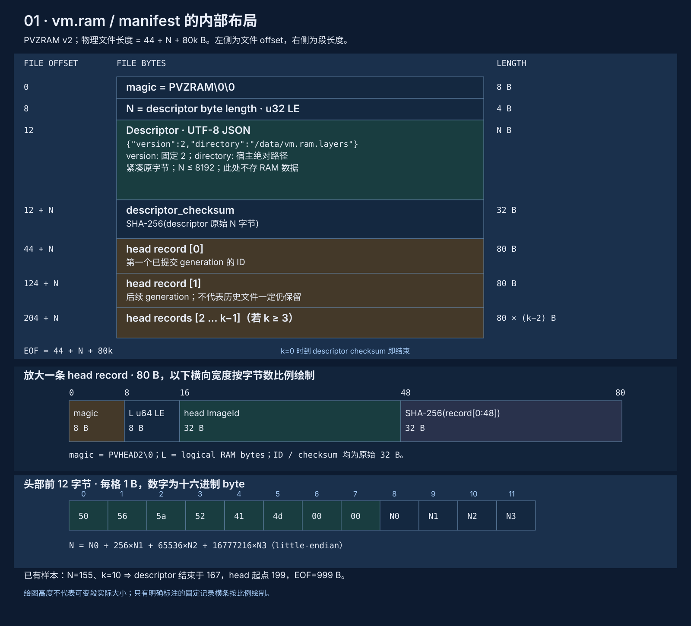
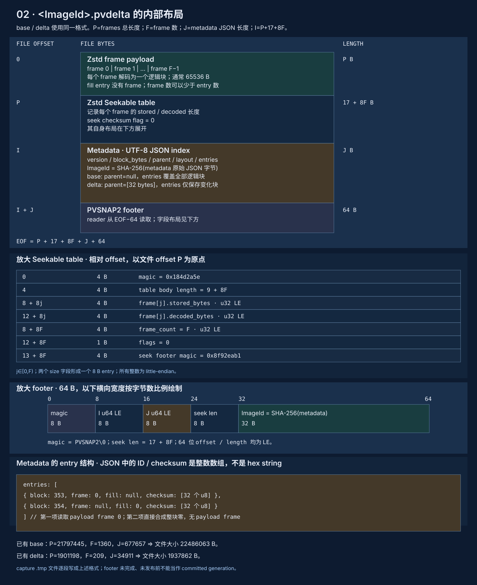
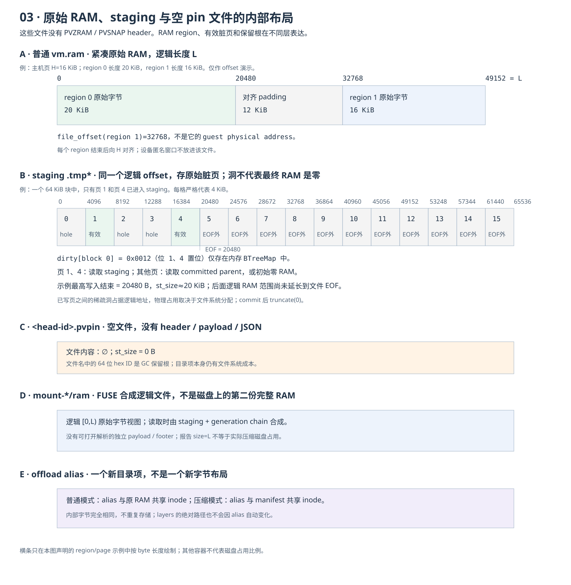

# Offload file formats

[Design](index.md) · [File byte-layout SVG](../../../zh/design/offload/assets/overview.svg)

## 1. Motivation {#motivation}

Retaining RAM files requires knowing what they reference, which files are still writable, and which history can be deleted. Compressed backing distributes that information across manifest, generations and staging. This document specifies directories, byte layouts and size formulas for inspection, capacity planning and retention.

## 2. Core design {#core-design}

The manifest identifies the directory and current head; generations hold committed RAM blocks; staging holds uncommitted pages of the active writer. FUSE synthesizes the logical RAM file mapped by the VM. Permissions in the tree are creation permissions; logical length and physical allocation are separate measurements.

### Directories and file responsibilities

L=file-backed logical RAM length; N=descriptor JSON bytes; k=appended head count; P=compressed frame bytes; F=frame count; J=generation metadata JSON bytes.

```text
Ordinary mode, explicit backing:
/data/
└── vm.ram                    raw RAM, mode 0600; logical length L
                              allocated bytes depend on written pages/filesystem
/exports/
└── idle.ram                  optional hard link to the same inode
                              same st_size L, no second RAM payload

Compressed mode, explicit backing:
/data/
├── vm.ram                    manifest, mode 0600; 44 + N + 80k bytes
└── vm.ram.layers/            private sidecar directory, mode 0700
    ├── .tmp<staging>         uncompressed sparse valid pages
    │                        initially 0; length <= L; truncated after commit
    ├── <base-id>.pvdelta     immutable full base; entries cover every block
    │                        P + 17 + 8F + J + 64 bytes
    ├── <delta-id>.pvdelta    immutable changed blocks plus parent ID
    │                        same size formula; inherits unchanged blocks
    ├── <head-id>.pvpin       optional empty retention-root file, 0 bytes
    └── .tmp<capture>         temporary generation under construction
                              grows from 0, published without replacement
<user-cache>/pvisor/ram/
└── mount-<random>/           temporary FUSE mount, mode 0700
    └── ram                   virtual logical RAM, size L, mode 0600
/exports/
└── idle.ram                  optional manifest hard link
                              layers stay at /data/vm.ram.layers/
```

Without an explicit path, backing is `<cache>/pvisor/ram/.tmp<random>` and compressed sidecar is `layers-<random>/` in the same cache. Alias publication moves neither. Ordinary mode has no layers/mount.

Permissions describe creation intent: explicit regular files 0600, new directories 0700, private tempfile ownership. Creating an already existing cache directory does not repair its parent permissions. Generation files are published from private temporary files.

Runner configuration, attestation and Run Journal/Bundle are variable-sized configuration/evidence files, not RAM formats or manifest dependencies. Experimental pool sockets/inventory JSON have separate roles, described in the [integration boundary](index.md#experimental-integration-boundary).

## 3. Detailed data and mechanisms {#detailed-design}

### File sizes

#### Raw backing and logical FUSE RAM

The VMM packs RAM regions and rounds their ends to host-page alignment H:

```text
L = sum(align_up(region_length_i, H))
```

Aligned 256 MiB file-backed RAM gives L=268435456 bytes. This is an example, not an invariant for every VM configured with memory_mib=256: inspect actual VMM geometry and device windows.

Raw `set_len(L)` can create sparse ranges. Allocated bytes grow with writes; hard links do not duplicate them. FUSE `FileAttr.blocks` reports `ceil(L/512)`, **not actual compressed disk consumption**.

#### Staging contains raw pages at RAM offsets

Staging has no header, JSON or compression. Its file offset equals compact logical RAM offset. First partial-page writes initialize untouched bytes from parent; full-page writes can overwrite directly.

```text
staging offset = logical RAM byte offset
page p = [p*4096, min((p+1)*4096, L))
st_size = highest actual write end; initially and after commit, zero
```

Writing a high-offset page can make logical length approach L with little physical allocation. Many dirty pages can consume close to L. The validity mask is an in-memory `BTreeMap<u64,u16>`, not a file field: staging alone cannot reconstruct an uncommitted epoch. Kernel dirty pages may not have reached staging yet.

#### Generation size

```text
S_seek = 17 + 8F
S_generation = P + S_seek + J + 64
```

P sums encoded frames; fill entries have no frame. A full base has an entry for every logical block; delta entries describe genuinely changed blocks, not every dirty page. Uniform blocks still consume index/checksum bytes even when payload is absent.

J is limited to 64 MiB. IDs/checksums serialize as 32-element integer arrays with significant JSON overhead. The 64 GiB layout limit does not guarantee base metadata fits this budget (VMR-06). Incompressible content and framing/index overhead can exceed raw RAM size.

During compaction, old chain, new full base, capture temporary file, staging and pinned history can coexist. Count them when planning peak disk capacity; a small latest delta is not the complete footprint. Directories also allocate filesystem blocks.

#### Manifest and aliases

```text
S_manifest = 8 + 4 + N + 32 + 80k = 44 + N + 80k
```

N<=8192 and the reader limits k to 1,000,000. Manifest size grows with pathname bytes and publication history, not directly with RAM length. Unchanged content can reuse head, so not every offload appends a record. Hard links share the same bytes; accounting must deduplicate inodes.

### Manifest: binary envelope with a JSON descriptor



#### Exact byte layout

| Offset | Length | Field | Encoding |
|---|---:|---|---|
| 0 | 8 | Magic | `PVZRAM\0\0`; each `\0` is one NUL |
| 8 | 4 | Descriptor length N | u32 little-endian |
| 12 | N | Descriptor | Compact UTF-8 JSON |
| 12+N | 32 | Descriptor checksum | SHA-256 of original JSON bytes |
| 44+N | 80k | Head log | Fixed-length appended records |

Example descriptor:

```json
{"version":2,"directory":"/data/vm.ram.layers"}
```

Approximate schema for the embedded descriptor, not the complete binary file:

```json
{
  "type": "object",
  "additionalProperties": false,
  "required": ["version", "directory"],
  "properties": {
    "version": { "const": 2 },
    "directory": { "type": "string", "description": "宿主绝对 layers 目录" }
  }
}
```

`directory` must be an absolute host path and serialized JSON must fit 8192 bytes. Rust enforces these conditions beyond the basic schema. Pretty-printing JSON changes its checksum; the old digest cannot be retained after editing bytes.

#### Head record: 80 bytes

| Relative offset | Length | Field |
|---|---:|---|
| 0 | 8 | `PVHEAD2\0` |
| 8 | 8 | Logical RAM bytes, u64 LE |
| 16 | 32 | Raw head ID; filename uses its 64-character hex form |
| 48 | 32 | SHA-256(record[0:48]) |

```text
HeadRecord { magic, logical_bytes: u64, head_id: [u8;32], checksum: [u8;32] }
```

This is a semantic representation, not JSON serialization. All record lengths must agree on logical RAM size. Old records do not pin generations; open resolves the final head, whose chain must exist.

### Generation: frames, seek table, JSON index and footer



#### Offsets

Let I=P+(17+8F), the metadata start:

```text
[0, P)          Zstd frames
[P, I)          Seekable table, 17+8F bytes
[I, I+J)        Metadata JSON
[I+J, I+J+64)   Footer
```

| Footer offset | Length | Field |
|---|---:|---|
| 0 | 8 | `PVSNAP2\0` |
| 8 | 8 | Metadata offset I, u64 LE |
| 16 | 8 | Metadata byte count J, u64 LE |
| 24 | 8 | Seekable-table length, u64 LE |
| 32 | 32 | ImageId = SHA-256(original metadata bytes) |

The reader locates footer at EOF-64 and uses it to find metadata. Seekable table consists of skippable magic/length (8), stored/decoded sizes (8F), frame count (4), flags (1), seek footer magic (4). Seek checksum flag is currently zero; outer block SHA-256 handles RAM verification.

#### Metadata schema

This approximate schema describes **normal writer output**, with explicit nulls for parent/frame/fill. Serde can accept missing Option fields, and Rust still enforces cross-field integrity and ancestry. Code examples are identical across locales; human descriptions inside the shared schema retain their source wording.

```json
{
  "$defs": {
    "ImageId": {
      "type": "array", "minItems": 32, "maxItems": 32,
      "items": { "type": "integer", "minimum": 0, "maximum": 255 }
    },
    "Region": {
      "type": "object", "additionalProperties": false,
      "required": ["guest_address", "length"],
      "properties": {
        "guest_address": { "type": "integer", "minimum": 0 },
        "length": { "type": "integer", "minimum": 1 }
      }
    },
    "Entry": {
      "type": "object", "additionalProperties": false,
      "required": ["block", "frame", "fill", "checksum"],
      "properties": {
        "block": { "type": "integer", "minimum": 0 },
        "frame": { "type": ["integer", "null"], "minimum": 0 },
        "fill": { "type": ["integer", "null"], "minimum": 0, "maximum": 255 },
        "checksum": { "$ref": "#/$defs/ImageId" }
      }
    }
  },
  "type": "object", "additionalProperties": false,
  "required": ["version", "block_bytes", "parent", "layout", "entries"],
  "properties": {
    "version": { "const": 2 },
    "block_bytes": { "const": 65536 },
    "parent": { "anyOf": [{ "type": "null" }, { "$ref": "#/$defs/ImageId" }] },
    "layout": {
      "type": "object", "additionalProperties": false,
      "required": ["page_bytes", "regions"],
      "properties": {
        "page_bytes": { "enum": [4096, 8192, 16384, 32768, 65536] },
        "regions": {
          "type": "array", "minItems": 1, "maxItems": 1024,
          "items": { "$ref": "#/$defs/Region" }
        }
      }
    },
    "entries": { "type": "array", "items": { "$ref": "#/$defs/Entry" } }
  }
}
```

IDs/checksums are **32 integers in [0,255]**, not hex strings. Additional constraints:

- Exactly one of frame/fill is non-null; fill represents one repeated byte across the block.
- Entries are sorted and unique; frames are consecutive and every frame is referenced.
- A base has null parent and covers every block; a delta inherits from a same-directory parent.
- Regions are ordered, non-overlapping and bounded. Parent/child layouts match; chains are acyclic.
- Decoded length matches the block, allowing a short final block; checksums verify content.
- The current FUSE adapter writes one compact region beginning at 0 and page_bytes=4096. This does not imply the original VM had one guest physical region.

### Other files



| File | Internal bytes | Independent restore? |
|---|---|---|
| Raw `vm.ram` | Compact RAM bytes, no pVisor header/schema | RAM only, without CPU/device state |
| Staging `.tmp*` | Valid raw pages and sparse holes at logical offsets; masks only in memory | No: validity, epoch and committed chain are needed |
| Capture `.tmp*` | Incomplete generation while writing; footer may be absent | No: not a published committed generation |
| `<id>.pvpin` | Empty; filename encodes the retention root | No: corresponding chain is needed |
| FUSE `mount-*/ram` | Synthesized address space, decoded and overlaid on demand | No independent physical payload/footer |

## 4. Experimental evidence {#experiments}

On 2026-10-03, existing artifacts at `target/offload-validation/final-diagnostics/workdirs/semspec-S-DOC-062-8Fsw80/` were read without running a VM. This is not a new test or evidence for the current uncommitted experiment. The committed layout is 256 MiB; only base and delta remain, with no observed pin/active staging.

```text
semspec-S-DOC-062-8Fsw80/
├── startup.ram                 999 logical B; 4096 allocated B
└── startup.ram.layers/
    ├── a8c9862d…f8b08ab.pvdelta 22486063 logical B; 22487040 allocated B; base
    └── 2304f79b…35bd9e4.pvdelta  1937862 logical B;  1941504 allocated B; delta
```

| File | Measured decomposition | Verified logical length |
|---|---|---:|
| Manifest | N=155, k=10 | 44+155+80×10 = 999 B |
| Base | P=21797445, seek=10897 (F=1360), J=677657, footer=64; 4096 entries | 22486063 B |
| Delta | P=1901198, seek=1689 (F=209), J=34911, footer=64; 209 entries | 1937862 B |

The base has 4096 entries but only 1360 frames; remaining entries use fill. Both generations allocate 24428544 bytes (~23.30 MiB), excluding manifest/directory costs. This is not VM memory consumption or a universal compression ratio.

The descriptor contains the original absolute sidecar path. Moving the directory without rewriting format breaks references. Ten historical heads do not imply ten retained generation files.

## 5. Usage recommendations {#usage}

Use `st_blocks × 512` for allocation accounting and deduplicate inodes. Use `st_size` to parse file boundaries, not to estimate sparse or compressed storage cost. FUSE logical blocks do not measure compressed allocation either.

Stop the writer before inspecting or retaining compressed backing. Keep both manifest and the referenced layers directory. The descriptor contains an absolute path; copying the manifest or publishing an alias does not update it. Do not manually delete generations referenced by current head or pins.

Reserve room for new full base, old chain, staging and pinned history during compaction. Open currently rejects a torn manifest tail instead of falling back. Before archiving, confirm the last offload completed successfully.
