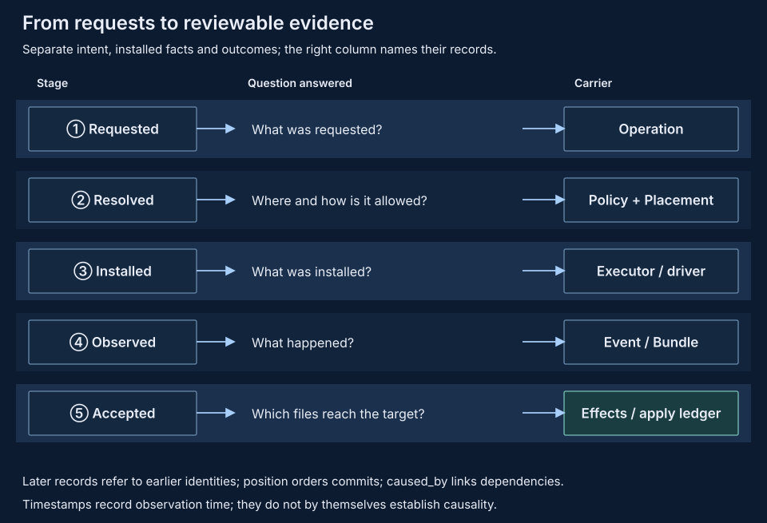

# Operation and Event

Operation describes the requested and effective operation; Event describes facts during processing; Trace records those facts. Definitions belong in `pvisor-core`, construction/scheduling/execution in pvisor and persistence in Journal.



## Operation: the object being processed

`OperationKind::RunExecute` currently corresponds to `run.execute`. Inputs are the program, arguments and working directory; policy decisions and Placement describe how it will execute. Operation schema is currently 1.

| Field | Meaning |
| --- | --- |
| `version` | Operation schema version; unknown versions are rejected |
| `kind` | Operation kind and inputs |
| `run_id` | Run identity, consistent with actual execution inputs |
| `context` | Subject, policy, scope and executor resource bindings |
| `rules` | `OperationDecision` values for file, network, environment and execution dimensions |
| `placements` | VM/Overlay placements ordered from inner to outer |

Each decision has a stable ID, capability dimension, target, action and expected control plan. Resource bindings describe capabilities without granting permission. Expected controls do not prove successful installation. `rules` is a decision list, not an executable Rule/Rewrite language.

Operations omit environment variable values. Arguments and paths can still contain sensitive information, so callers must choose recording scope based on actual payloads. This is not a complete process environment snapshot.

## Rewrites and Placement

Admission selects an executor, applies actual compatibility policies/permission constraints and retains snapshots of original and effective operations. `PVisor::resolve_operation(RunSpec)` returns the effective operation for review before execution.

Requested has no selected Placement. When publishing facts, pvisor compares requested/effective operations without Placement. It publishes Rewritten only when they differ, preserving before/after. Rewrites must preserve Run identity and operation kind and cannot include Placement changes.

Placed then stores the effective operation including its ordered placement list. A host run without VM or Overlay can have an empty list and still publishes Placed. This records selected placement; executor observations determine whether actual controls were installed.

## Event: externally observed facts

The Event envelope and Journal currently use version 5. Event `data` contains a Fact.

| Fact | Payload and meaning |
| --- | --- |
| Context | Subject, policy and resource bindings |
| Requested | Immutable snapshot of the requested Operation |
| Rewritten | Before/after snapshots of an actual rewrite of the same operation |
| Placed | Effective Operation with final placement |
| Dispatched | Selected backend and Run identity; entry into dispatch |
| Completed | Outcome and result provenance |
| Observation | Domain, name, version and JSON observation payload |

The normal startup fact chain is:

```text
Context → Requested → [Rewritten] → Placed → Dispatched → Completed
```

Lifecycle/domain observations may also appear. Dispatched commits before the executor call and does not mean a process started successfully. Admission/preparation failures can lack a complete fact chain; callers must still handle API errors. Completed distinguishes Backend, Policy, Replay and Runtime provenance. Runner failures must not masquerade as backend outcomes.

A successful Outcome includes terminal state and exit code. Errors distinguish Failed, Denied, Unsupported and Unknown. Unknown preserves known effects; side effects may already have occurred.

## Identity, causality and order

| Envelope field | Purpose |
| --- | --- |
| `id` | Event identity for correlation and deduplication |
| `trace_id` | Owning execution record; current run streams filter by Run |
| `producer`, `observed_at_unix_ms` | Producer and observation time |
| `scope` | Event scope; operation facts use Run/Attempt scope |
| `context`, `operation` | Context/operation identities, not complete payloads |
| `caused_by` | Event IDs of known prerequisite facts |
| `level`, `granularity` | Display/filter information |

Facts for the same Attempt share an operation identity and chain causal references. Context facts have no operation reference; domain Observations can lack execution references. Journal validates events/references; commit positions express order in that log.

Processing dependent on an earlier result must wait until that result is determined. Placement/forwarding cannot reverse this dependency. Independent concurrent operations do not become causally related just because timestamps differ. The current mechanism maintains committed facts and known dependencies, without global ordering across Jobs or interception of every syscall inside a command.

## Commit, subscription and failure

After preparing drivers, pvisor commits startup facts before calling the executor. Required-fact commit failure prevents dispatch and requires cleanup. Recording failure after execution is reported as a failure/warning; it cannot undo effects that already happened.

Journal uses one writer and commit receipts, with event deduplication and tail recovery. When commit status is unknown, reconcile effects already performed before deciding whether to retry an external operation. `RunHandle` subscriptions provide committed events for this Run, including Gateway observations in the shared Journal. Live consumers must handle disconnection and lag; read complete history from Journal.

Disabling file recording still permits an in-memory event stream, but produces no file log for recovery after restart. Structured Event is the fact format; `Event::to_text` is only a human-readable projection.

## Observation and reconstruction scope

`OperationObservation` stores outcomes, rule counts and boundary observations and validates terminal/count consistency. `null` means unobservable; zero means observed with no hits. The FUSE path table retains at most 8192 entries; excess hits count toward `overflow_hits`. Operation counts do not replace a final diff. Network counters cover only intercepted traffic.

Snapshots reconstruct observed requests, rewrites, placement and outcomes. Reconstructing complete external behavior also requires initial files, actual environment, external inputs and execution mechanisms. Trace does not contain all of these. Event logs, filesystem checkpoints and agent trajectory replay have different recovery scopes.

Run Bundle currently uses schema 4. Old Bundle and Event/Journal formats are rejected rather than silently mixed. Code constants maintain versions; see the [Records and version matrix](records-and-versions.md#execution-records) for compatibility boundaries and [Capabilities and evidence](../concepts/capabilities-and-evidence.md) for enforcement rules. [Failure semantics](failure-semantics.md) explains reconciliation after commit failures, disconnects and retries.

## Code and validation

| Code | Responsibility |
| --- | --- |
| `pvisor_core::operation`, `pvisor_core::event` | Public structures and validation |
| `pvisor_core::execution` | Execution inputs, capability plans and outputs |
| pvisor `runtime/operation.rs` | Operation/observation construction for requests and actual boundaries |
| pvisor `runtime/event.rs`, `session/lifecycle.rs` | Fact publication, dispatch and completion |
| `pvisor-journal` | Commit, reference validation and recovery |

```sh
just test core pvisor-journal
just test pvisor
```

Operation contract tests cover identity, rewrite/placement separation, terminal states and version rejection. Production-path tests cover fact chains after actual network permission narrowing, causal references and omission of environment values from operation snapshots.
