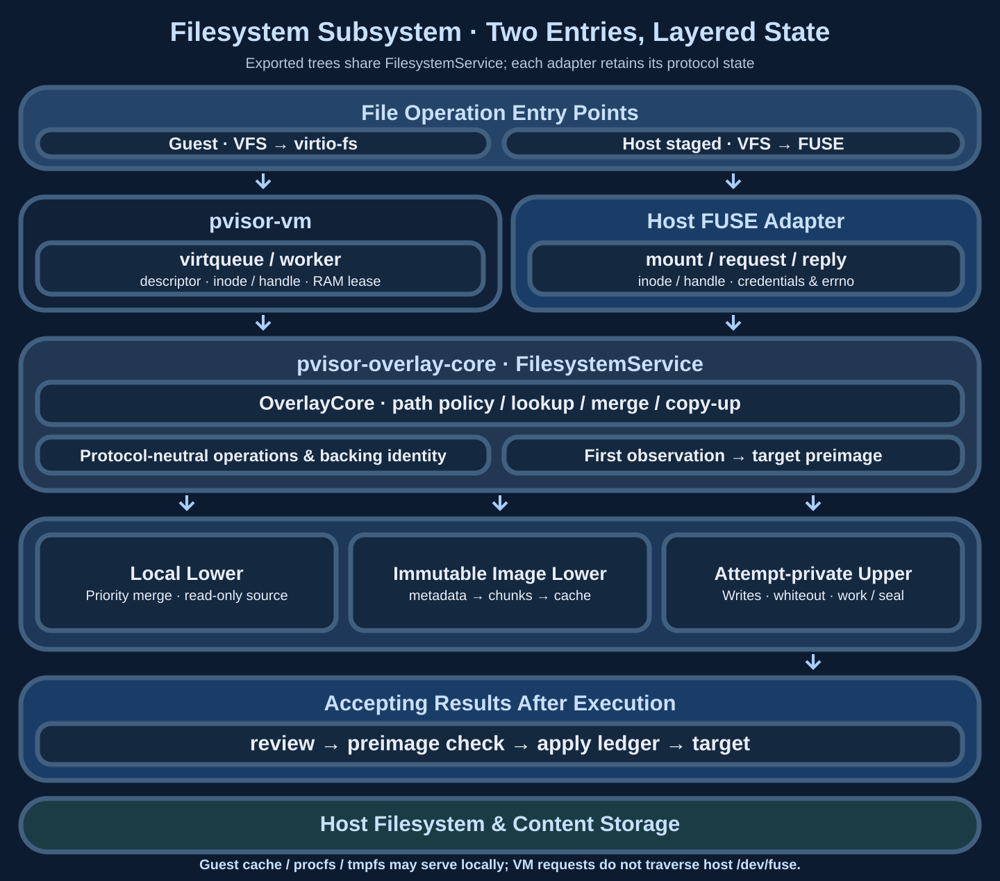
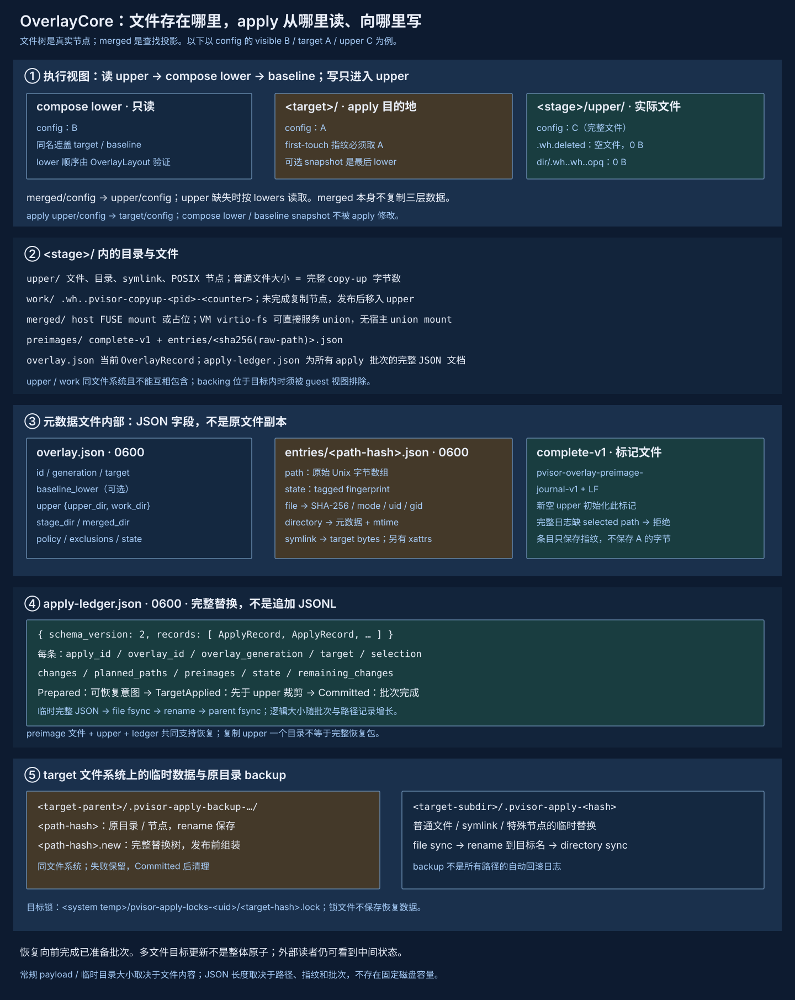

# Filesystem subsystem: OverlayCore and two entry points

## 1. Motivation {#motivation}

When an Agent edits a workspace, developers often want to review the result before accepting selected files. Direct writes leave failed, canceled or unwanted changes mixed with host state. OverlayCore keeps execution-time changes in upper and merges them with lower layers for reads. After execution, upper remains available for review, selective apply or drop.

Copy-on-write alone is insufficient. An editor or another task can change the actual target while the Agent runs, and apply can stop after updating some files. The design therefore records target fingerprints at first content observation or before mutation and persists each apply's intent, allowing conflicts to be rejected and interrupted batches to complete forward.

This covers filesystem trees, not remote requests, database writes or explicitly shared mounts. Multi-file apply is not atomic to external readers, and its target lock only coordinates cooperating pVisor callers. Public semantics are in [Staging and apply](../concepts/staging.md); the workflow is in [Review and apply](../guides/review-apply.md).

## 2. Core design {#core-design}

### Separate the read view from the write target {#layout}

`OverlayLayout` owns priority-ordered lowers, a separate apply target and its target-corresponding baseline. Upper wins, followed by the highest-priority lower, with target or its read-only snapshot baseline last. Construction requires the last lower's canonical path to match the declared baseline, avoiding confusion between the visible file and the file that apply will overwrite.

For example, a compose lower contains `config` B while the host target contains A. The Agent reads B and produces upper C. A live lower fingerprints target A when content is first opened; a frozen layout fingerprints A in its last baseline lower, rather than adopting a changed live target at first mutation. Apply checks that host A remains intact before installing C; B is not the host conflict baseline.

| Data/module | Owned content | Responsibility |
|---|---|---|
| `OverlayCore` / `core.rs` | Layout, upper/work, exclusions, policy, in-memory hard-link index | Lookup, directory merge, copy-up, deletion/rename, first-touch |
| `apply.rs` | Changeset, dependency-closed selection, apply ledger | Review, conflicts, target installation, recovery and drop |
| `sys.rs` | Syscall wrappers, POSIX metadata and xattrs | Unix differences and concentrated unsafe boundaries |
| `pvisor-core::overlay` | `OverlayRecord`, `ApplyRecord`, fingerprints and path encoding | Shared serialization contracts |
| Runtime/filesystem adapters | Attempt lease, mount, handles, requests and observations | Stop writers, manage mounts and call the shared core |

OverlayCore does not own FUSE mounts, Run scheduling or the public Event Journal. It uses `pvisor-journal::atomic_write` for metadata, but `apply-ledger.json` is distinct from the [Event Journal](journal.md): the former replaces complete JSON documents; the latter appends event lines.

### Shared filesystem service with two entry points {#filesystem-service}

Host execution connects through a host FUSE mount; VM execution connects directly
through the guest virtio-fs driver and virtqueues. Both reuse filesystem service
capabilities, with host staged retaining host execution. FUSE names both the
request protocol and the host mount entry: virtio-fs uses FUSE requests, but the
VM service need not send those requests back through host `/dev/fuse`.

The current structure follows. Host FUSE and VM virtio-fs adapters use
`pvisor-overlay-core::service::FilesystemService`, sharing OverlayCore operations
and backend reads. Protocol inode/handle tables, directory cursors and platform
permission handling remain in their entry adapters.



The service receives requests requiring backend work within these exported trees.
Kernel cache hits can avoid requests; guest procfs, tmpfs and network operations
do not enter this service merely because of this structure.

| Layer | Shared or retained responsibilities |
|---|---|
| Entry adapters | FUSE or virtqueue transport, argument/credential conversion, errno/attribute encoding, mount and queue lifecycle; retain Linux guest and host-platform capability differences |
| Shared filesystem service | Share path resolution, directory merging, permission/alias policy, preimages and copy-up through OverlayCore; provide one contract for local and remote reads |
| Local and remote backends | Local file I/O; immutable image stat/list/read, symlinks, object identity, block verification and caching; mutations remain in each Attempt's private local upper |

The public interface expresses capabilities through file operations, metadata,
object identities and I/O results rather than `fuser::Reply*`, guest descriptors
or a mountpoint. Sharing means one implementation and contract, called directly
inside the host execution process. It requires neither a new filesystem RPC nor serialization
of all Runs. Protocol encoding, inode/handle tables and descriptor/used-ring ownership remain
in their entry adapters.

VM lazy images call the remote read-only backend directly, without an
intermediate host FUSE mount. `image/cache/backend.rs` provides transport-neutral
metadata, block reads and bounded caches; `lazy.rs` retains the host FUSE adapter,
and `direct.rs` attaches the backend to VM lowers. Ordinary local lowers and
VM staged workspaces continue serving virtio-fs directly; host staged execution
continues through host FUSE. The backend preserves immutable handles, hard-link
identity, metadata generations and content digests. Shared image caches do not
share writable uppers or journals. Storage contracts are in
[Shared image cache v1](shared-image-cache-storage.md#filesystem-access).

The direct backend creates a private metadata projection to retain existing local
inode/FD, path checks and snapshot contracts. It consists of ordinary directories
and sparse placeholder files, with no FUSE mount. Guest attributes come from image
metadata, and READ fetches blocks through the backend instead of reading placeholder
holes. Copy-up and file digests materialize original bytes when needed; complete
filesystem checkpoints and self-contained tree exports populate the entire image,
so these operations may download unvisited files. An opened server-side lower handle retains
its original read-only content after copy-up; guest inode page caching retains
its kernel semantics. The backend descriptor stays outside
the guest lower and is hidden from workspace views. The VM runner reattaches the
backend before restricting host filesystem access.

Linux runners retain private network namespaces. Filesystem and Unix socket caches
are accessed directly; TCP/S3 cache fetches use private host access restricted to
the pinned image's stat/list/read, without exposing credentials or host networking
to guests. This channel uses the existing cache protocol, separately from the
virtio-fs filesystem entry, and terminates during VM teardown.

Content reads hold neither a service-wide lock nor the metadata map lock; a cache
miss locks only its content block. Tests cover cross-block and warm reads, hard-link
copy-up, guest attributes, open handles, complete tree exports and runner attachment.
Protocol state is not fully shared between adapters; platform permissions and
descriptor semantics remain adapter-specific.
[Filesystem measurements](filesystem-performance-analysis.md#filesystem-service) cover
local workloads and lazy cold/warm caches; version A/B shows localized read gains
and metadata/copy-up regressions, without a general end-to-end speedup. Concurrent
task capacity has not been validated in those measurements.
The shared filesystem service handles filesystems and lazy images; the page-fault path of
[lazy snapshot RAM restore](environment-snapshot.md) as a separate mechanism.

### Completing one virtio-fs request {#virtio-request}


On a guest page-cache miss, virtio-fs places a FUSE READ request and response buffers in a descriptor chain. Addresses are guest physical addresses; the host adapter validates ranges, lengths and directions before invoking the service. Protocol adapters retain inodes and open handles; the file service uses explicit relative paths and backing identities for semantics.

Workers may process requests, while the queue owner retains used-ring publication. A device RAM lease lasts until response bytes and the used entry are published. Freeze, offload and mapping replacement must therefore wait for outstanding device access. Guest-cache hits can return without entering this path.


### Concurrency, caches and freezing {#concurrency}

The virtio-fs queue owner accepts descriptors and publishes used entries. Overlappable large READs (at least 64 KiB) and directory reads can use bounded I/O workers; short metadata requests and serialized mutations remain inline. The default worker limit is the available host CPU count capped at 4, with at most twice that number of in-flight requests.

Read-only operations may share an operation guard; copy-up, rename, writes and restore use an exclusive guard. Handle-map and directory-cache locks obtain stable references, while backing I/O executes outside those table locks. Native lookup references are released only after the last user leaves. A slow read therefore need not lock the whole handle table, and its handle cannot disappear during I/O.

Freeze/reset stops intake, drains requests, publishes completions and joins workers; filesystem capture waits for operation guards to drain. Restore actively scans the available ring. Filesystem optimizations must preserve protocol identities, RAM leases and freezing as well as read latency. VM ordering is in [Devices and consistency](vm-runtime.md#virtio).

### Files and their actual relationships {#disk-layout}



Figure annotations are in Chinese.

```text
<compose lower 0>/ … <compose lower n>/   Read-only layers, first has highest priority
<target>/                                Original workspace and explicit apply destination
<baseline snapshot>/                     Optional final read-only lower replacing target
<stage>/
├── overlay.json                         OverlayRecord, 0600, whole-document replacement
├── upper/                               Real files, directories, links and whiteout deltas
├── work/                                .wh..pvisor-copyup-<pid>-<counter> temporary entries
├── merged/                              Host mount/placeholder; VM path needs no host union mount
├── preimages/
│   ├── complete-v1                      First-touch journal completeness marker
│   └── entries/<sha256(raw-path)>.json   One PathPreimage per relative path, 0600
└── apply-ledger.json                    Complete schema-2 batch ledger, 0600
<target-parent>/
└── .pvisor-apply-backup-<target-hash>-<apply-id-hash>/
    ├── <path-hash>                      Original deleted/replaced directory node, renamed in
    └── <path-hash>.new                  Complete replacement tree awaiting publication
<target-subdirectory>/
└── .pvisor-apply-<destination-hash>      Temporary replacement file/link/special node
<system temp>/pvisor-apply-locks-<uid>/
└── <canonical-target-hash>.lock         0600 advisory lock in a 0700 directory
```

Paths illustrate the layout; configuration may override upper, work and merged. Work and upper must be on the same filesystem and must not contain each other. Backing inside a lower/target must be excluded from the guest view. Canonical-path checks prevent directory aliases from bypassing these rules.

Upper stores complete copied-up files: a one-byte edit can copy the entire file. There is no block delta or compression format. Merged is a projection, not another complete copy. Preimages contain fingerprints rather than original bytes; directory originals that must survive replacement remain in backups beside target.

## 3. Detailed data and mechanisms {#detailed-design}

### Merge, copy-up and POSIX nodes {#copy-up}


Lookup validates each path component, rejecting absolute paths and `..`. Relative ancestors in every candidate layer must be actual directories; lookup does not follow ancestor symlinks outside a layer. Directory listing merges names and removes whiteouts, exclusions and unauthorized names. Lower ordering selects the source for conflicting names.

Before modifying a lower node, copy-up records its target preimage, creates upper ancestors and copies content/metadata into a temporary node in work or the upper parent, then publishes by rename. Regular files copy bytes; a directory initially copies only itself and continues exposing lower children. Symlinks copy target bytes without dereferencing; other nodes preserve POSIX type and rdev. Copy-up rename avoids exposing a half-copied node, but does not establish that every ordinary upper write has been fsynced.

| Upper representation | Bytes/metadata | Meaning |
|---|---|---|
| `name` | Complete file or directory/symlink/other node | Overrides the matching lower entry |
| `.wh.name` | Empty file created by Core, 0 B | Hides lower `name`; apply deletes the target path |
| `.wh..wh..opq` | Empty file created by Core, 0 B | Stops merging lower directory children |
| Opaque xattr | Supported overlay xattr with value `y` | Same interpretation as the opaque marker |
| `.wh..pvisor-root-metadata` | Empty marker, 0 B | Explicit root metadata change rather than incidental mtime |

Recreating a whiteouted directory marks it opaque to prevent old children resurfacing. Moving a lower directory recursively materializes its merged tree first; copying only the directory node would lose children. Review represents rename as deletion plus addition rather than a separate rename operation.

`copied_hard_links` indexes upper aliases by lower `(dev, ino)` and reuses an already copied-up inode when possible; rename/unlink update it. The index is in-memory and is not rebuilt on restart. Existing upper hard links survive in the filesystem, but new copy-ups after restart are not guaranteed to reconnect uncopied lower aliases. With denial rules, multiply-linked regular files are conservatively rejected to prevent inode-alias authorization bypasses. Directory moves inspect physical descendants, not only visible names.

### First-touch and conflict fingerprints {#preimages}

Owned host and VM stages select a compact framed journal and default to `checkpoint` durability. First observations are still captured before exposure/mutation, but first mutations do not each fsync the log. Completion stops writers, syncs the complete journal, then upper data and namespace, and publishes `preimages/sealed-v1` last. `complete-v1` describes observation coverage; it is not a completion acknowledgement. An unsealed managed stage is rejected by apply/reuse; a live workspace checkpoint seals only its private copy. Explicit workload fsync orders observations before data. `--stage-durability strict` retains sync-before-first-mutation. Missing policy files retain the legacy strict contract. The following per-path publication description applies to the legacy strict journal; compact records retain the same first-winner and conflict rules. See [Isolation](isolation.md#workspace-and-lifecycle) for persistence boundaries.

The protection starting point depends on layout. A frozen layout fingerprints the explicit target-corresponding baseline (last lower); higher-precedence extra lowers supply visible content only. A live lower captures the target at first content open or symlink/xattr read. A genuine negative lookup records the observed Absent directly, rather than adopting a host file created before journal publication. Authorization and I/O failures are not absence and must not cause reads of denied paths. Mutation without a prior content observation starts from the target immediately before mutation. Successful stat/lookup and directory listing do not hash every file and do not establish a Run-start snapshot or serializable read-set transaction. Actual FUSE and virtio-fs content entry points call the shared Core's `observe_read()` automatically. External Core adapters must do the same; `resolve()` only resolves paths.

Under the preimage mutex, entries are addressed by raw relative-path bytes, written to private temporary files and atomically published through a hard link that cannot replace an existing destination. Concurrent Core instances validate and keep the first published winner; a mutating loser syncs that actual winner. Read observations do not fsync per path. Before first mutation, `record_preimage()` reuses and validates the same JSON entry, then syncs its file and entries directory before changing upper. Frozen layouts need no early read-only entry because mutation can capture the immutable baseline. Parents, deleted trees and rename destinations still receive synced entries for implicit metadata changes and destructive descendants. Normal stage/checkpoint copying and reopening preserve observations; corrupt entries fail loading or mutation. Read-only observations are not power-loss-durable read transactions: callers promising execution-state recovery must also preserve the baseline and journal. Unselected unrelated read-only paths do not block applying another file.

After partial apply in a frozen layout, pruning an upper path exposes its old baseline again; the read view is not automatically updated. Reopening the same stage and rewriting a committed path from that stale view retains the old baseline and conservatively rejects apply. Rebasing only its fingerprint to the current target would wrongly accept stale-view overwrite. Create a new stage/baseline to continue editing those paths; other uncommitted candidates in the old stage remain reviewable.

Example `PathPreimage`:

```json
{
  "path": [110, 101, 119, 46, 116, 120, 116],
  "state": { "kind": "absent" }
}
```

The path bytes encode `new.txt`. Fingerprint variants are:

| kind | Core fields |
|---|---|
| absent | Path does not exist |
| file | SHA-256, mode, uid, gid, optional xattrs |
| directory | Mode, uid, gid, mtime seconds/nanoseconds, optional xattrs |
| symlink | Raw target bytes, uid, gid, optional xattrs |
| other | Mode, uid, gid, rdev, optional xattrs |

Xattrs distinguish Unsupported from sorted `(name-bytes, value-sha256)` entries; internal opaque xattrs are excluded. Compatibility with older fingerprints lacking xattrs does not claim those attributes were verified. File hashing uses a 64 KiB buffer but reads bytes proportional to file size. Directory fingerprints are not whole-subtree Merkle hashes.

An empty new upper initializes `complete-v1`, containing `pvisor-overlay-preimage-journal-v1` and LF. A complete journal missing a selected path rejects apply. Legacy stages without the marker can fingerprint at apply time for compatibility, without equivalent execution-time conflict protection. Preimages are published atomically per entry, not through whole-document replacement; corrupt complete entries fail loading, with no JSONL-style tail repair.

### Review and selection {#selection}

`overlay_status()` counts upper entries/whiteouts and up to 32 sample_paths. `overlay_changes()` classifies Added/Modified/Deleted/TypeChanged/Opaque from lower path existence and node type without reading every file for a byte diff. A copied-up file restored to its original bytes may still be Modified. This is an applicable upper inventory, not a minimal content diff.

`ApplySelection` supports exact relative paths and git-style include/exclude globs. Empty selection means all; exact paths include descendants. Planning repeatedly expands dependencies to closure:

- Upper hard-link groups are selected together; excluding a sibling rejects the batch.
- An opaque directory is one complete selection unit; selecting only its children or excluding members is rejected.
- Required new upper ancestor directories join selected descendants and cannot be excluded.

Opaque root replacement is unsupported; select explicit subdirectories. `ChangeEntry.path` is for display, with `path_bytes` preserving non-UTF-8 identity. Mutations use `relative_path()`. Non-UTF-8 selection/planned_paths encode as `{ "bytes": [...] }`; lossy display text must not determine mutation paths.

### Apply ledger and recovery {#apply-recovery}


`OverlayRecord` stores ID, generation, target, optional baseline_lower, upper/work, stage/merged, policies, exclusions and state. States are Active/Staged/Applied/Discarded. Generation identifies a new iteration of a reusable environment; a terminal Overlay is not reopened as Active.

The `apply-ledger.json` structure is:

```json
{
  "schema_version": 2,
  "records": [
    {
      "schema_version": 2,
      "apply_id": "apply-demo",
      "created_at_unix_ms": 0,
      "overlay_id": "overlay-demo",
      "overlay_generation": 0,
      "target": "/workspace",
      "selection": { "paths": ["new.txt"] },
      "changes": [{ "path": "new.txt", "kind": "added", "new_type": "file" }],
      "planned_paths": ["new.txt"],
      "preimages": [{ "path": [110,101,119,46,116,120,116], "state": { "kind": "absent" } }],
      "state": "prepared",
      "remaining_changes": 0
    }
  ]
}
```

This illustrates fields; optional mode/size vary by node. Readers accept schema 1/2; legacy records missing state default to Committed. Adding a record or changing state serializes the whole ledger and replaces it through a same-directory temporary file, fsync, rename and parent-directory fsync. It does not append JSON to EOF.

`apply_overlay_selected()` locks target, recovers pending batches, plans selection, gathers all preimages and checks conflicts before persisting Prepared. The lock name hashes the canonical target path. Lock files must be private, current-user-owned single-link regular files. External editors do not participate in this lock.

| Durable state | Actions already taken | Recovery |
|---|---|---|
| Prepared | IDs, generation, paths, changes and preimages persisted; target may be untouched or partly updated | Validate identity and original/desired contents, inspect directory backups and finish target writes forward |
| TargetApplied | Persisted after target updates and before upper cleanup | Only prune upper, handle preimages and save Overlay state; do not reapply a partly pruned opaque tree |
| Committed | Remaining changes/count determined, upper/preimage processing complete | Remove leftover backups; repeating completion does not overwrite target again |

Regular target replacements use deterministic temporary names beside their destinations, sync contents, rename and sync directories. Whiteouts are processed before copying. Destructive directory replacements rename originals into private backups beside target, build replacements in `.new` and publish the complete tree. Backups belong to apply IDs, survive errors and are removed after Committed. They are not generic rollback copies for every modified file.

Prepared recovery cannot accept arbitrary target states: targets must match preimages or, on the recovery branch, the batch's desired result. Directory comparison permits recovery-related mtime changes but still checks mode, ownership and recorded xattrs. Deletes/replacements also validate collapsed descendant preimages. Recovery rejects mismatched Overlay IDs, generations or targets.

Selective completion leaves the Overlay Staged when changes remain and Applied when none remain. Selected upper entries are pruned and corresponding preimages consumed; directories carrying pending children retain the needed baseline. Multiple paths can expose intermediate states. External mutations can still occur after checks and before writes; stop external writers during apply.

### Drop and adapter boundaries {#adapters}

Pending apply prevents drop from destroying recovery data. Drop is idempotent for Discarded and cannot undo Applied. It clears upper/work and saves Discarded; merged cleanup only removes an empty placeholder rather than recursively traversing a possible mount. Callers must stop writers and unmount first. The Core API's Active branch does not replace Attempt leases and lifecycle coordination.

Host `pvisor-overlayfs` adapts FUSE requests, inode/handle ownership and permissions to the shared core. Its adapter handles Linux FUSE and macFUSE kernel/FSKit mounting restrictions. The repository defaults to fskit on its FSKit entry path and rejects macFUSE versions below 5.4.0 through the implemented guard. VM `crates/pvisor-vm/src/devices/virtio/fs/overlay.rs` uses the same Core through guest virtio-fs, without a host FUSE union mount. Guest errno translation, queues and handle lifetime belong to that adapter.

Shared Core does not imply identical POSIX return behavior across backends. Staging contracts still record macOS symlink creation S-STAGE-013 XFAIL. Core tests cannot replace real mount checks.

## 4. Experimental evidence {#experiments}

`JUST_TEMPDIR=/tmp just test pvisor-overlay-core pvisor-overlayfs` runs targeted tests covering public Core/apply behavior and the actual FUSE `open_inode` / `open_path` entry points. The `pvisor` integration regressions also drive the real virtio-fs worker through guest descriptor rings, covering content reads/writes, live/frozen target layouts and device-state restore; logical checkpoint coverage checks that copied/restored read observations constrain later first mutation. These validate shared implementation and adapter wiring, rather than real host FUSE mounts, KVM/HVF guest boot or cross-platform acceptance. The table lists coverage entry points, not counts of independent fault cases.

| Mechanism | Existing tests to inspect |
|---|---|
| Lower composition and separate target baseline | `top_lower_wins_and_directories_merge`, `composed_lower_preimage_tracks_apply_target_not_visible_layer` |
| First-touch synced before mutation without rebasing | `first_touch_preimage_is_durable_and_never_rebased` |
| Backing/alias/authorization boundaries | `backing_symlink_alias_cannot_share_the_upper_and_work_directory`, `access_rules_reject_hardlink_aliases_and_symlink_traversal` |
| Read-before-write, frozen baseline, absence and restore | `read_conflicts` integration tests, `fuse_open_inode_preserves_the_first_read_before_copy_up`, `virtiofs_content_open_preserves_target_preimage_across_restore_and_composed_lowers`, `fork_preserves_read_observation_before_any_upper_mutation` |
| Conflict after target mutation | `apply_rejects_a_target_changed_after_first_touch` |
| Recursive replacement, backups and interruption | `directory_replacement_checks_descendants_and_recovers_after_mutation`, `interrupted_directory_replacement_restores_the_recorded_original` |
| Prepared before/after target changes | `prepared_apply_recovers_before_or_after_target_mutation` |
| Partly pruned upper after TargetApplied | `target_applied_recovery_only_finishes_partially_pruned_opaque_upper` |
| Selection dependencies and terminal states | `selective_apply_expands_hard_link_groups`, `opaque_directory_requires_atomic_selection`, `terminal_decisions_are_idempotent_but_cannot_be_reversed` |

`pvisor-core/tests/overlay_contracts.rs` also checks legacy defaults, fingerprint variants and raw path bytes. `tests/semantics/stage-apply.md` supplies S-STAGE-001–014 runtime contract drafts. Human approval is separate from test success and is not replaced by this document.

The read-before-write conflict regressions do not revalidate copy-up/apply throughput, fsync tails, large real-repository workloads or power-loss recovery. The 1,024-path positive metadata-walk regression verifies that no content-observation entries are created; it is not a throughput benchmark. First content observation still reads/hashes the entire target file and writes a per-path journal entry. First mutation still syncs the preimage, while copy-up, tree traversal and ledger updates retain their costs. Existing [apply cost experiments](../benchmarks/supervision-cost.md#apply-cost) are historical evidence for their fixed workloads and artifacts, not a performance revalidation of read-before-write conflict tracking. In-process recovery controls and guest descriptor tests do not replace a kill/power-loss matrix at arbitrary syscalls or real Linux FUSE and macOS FSKit/HVF acceptance.

## 5. Usage recommendations {#usage}

Keep target and backing boundaries explicit and preserve stage metadata plus upper. Copying upper alone does not preserve both execution-time conflict detection and pending-apply recovery. Do not expose internal stage files to guest modification or edit fingerprints/ledgers to bypass conflicts.

Stop actual writers before reviewing changes and contents. Inspect dependency expansion for selective apply, especially hard links and opaque directories; inventories do not replace content diffs. Stop other target writers during apply. After failure, preserve original stage and target-side backups and reenter apply recovery; drop is not rollback.

For large files, large trees or frequent selective apply, measure copy-up, fingerprint hashing, installation and ledger synchronization separately. Consider segmentation or incremental ledgers only when measured scale requires them, preserving the recovery contract. Stronger concurrency/external-edit protection needs stable snapshots, directory-FD operations or stronger coordination; advisory locks do not establish full transactional isolation.

## 6. System connections and source map {#integration}

The file service connects the overall diagram's virtio-fs and host FUSE paths; the image cache supplies immutable lowers, and the RAM subsystem keeps request buffers valid through completion. After execution, stage sealing fixes reviewable state, while apply separately publishes into the host target. Machine snapshots must also preserve recoverable exported-tree and inode/handle relationships; copying upper alone does not restore execution.

Source entries: `crates/pvisor-overlay-core/src/service.rs`, `core.rs` and `apply.rs` own shared operations, layering and publication. `crates/pvisor-vm/src/devices/virtio/fs/` owns VM protocol and queues. `crates/pvisor/src/image/cache/backend.rs`, `direct.rs` and `lazy.rs` connect shared images to their adapters.
