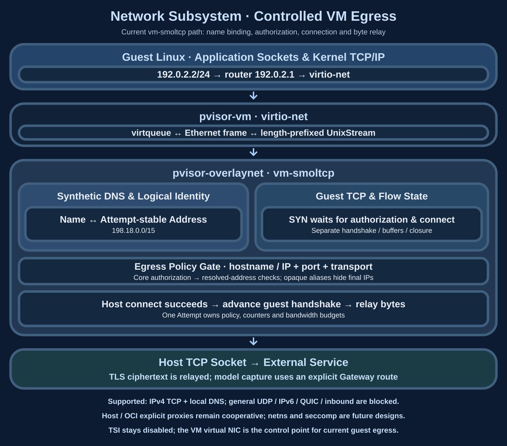

# Network subsystem: OverlayNet and controlled egress

The VM network control point sits after virtio-net: the guest emits Ethernet frames, and OverlayNet terminates TCP on the host, recovers logical destinations, authorizes them and connects to external services. Host/OCI explicit proxies use a separate cooperative path whose coverage depends on application proxy use.

## Subsystem diagram and ownership {#architecture}



| Component | State and responsibility | Lifetime |
| --- | --- | --- |
| `pvisor-guest` / guest Linux | Interface addresses, routes, application sockets and guest TCP | Follows the guest; static setup does not wait for DHCP |
| `pvisor-vm` virtio-net | Descriptors, frame transport and virtual device | Follows the VM; accesses guest RAM under the device contract |
| OverlayNet `VmNetwork` | smoltcp, DNS mappings, flows, connection tasks and bounded buffers | Prepared and closed independently for each Attempt |
| Egress policy / connector | Logical authorization, host resolution, concrete-address checks and connection | Uses the Attempt's effective policy and budgets |

Frames and bytes cross these layers; host egress services do not retain raw guest RAM pointers. The [VM subsystem](vm-runtime.md#virtio) explains the virtual NIC's execution boundary; [Network control](../guides/policies/network.md) owns user-visible proxy and VM boundaries.

## Implemented VM driver

A native pvisor-vm Attempt uses `vm-smoltcp` when `[overlaynet].mode = "auto"`. Guest virtio-net connects to pVisor through pvisor-vm's length-prefixed UnixStream Ethernet transport. The Rust guest supervisor directly configures `192.0.2.2/24` with router `192.0.2.1`, without waiting for DHCP. pVisor provides synthetic DNS (`198.18.0.0/15`, stable per Attempt) and IPv4 TCP. smoltcp holds SYN until hostname/IP, resolved addresses or scoped host connector aliases, port and injected core policies all authorize the connection and the host connection succeeds. TSI stays disabled, leaving no guest path around this data plane.

Some host DNS/TUN connectors return opaque fake IPs in `198.18.0.0/15` for authorized hostnames. The VM connector accepts these only after logical hostname/port pass policy and core authorization; guest literal IPs in that range remain blocked. Because the connector hides the final address, IP/CIDR policy cannot inspect the endpoint behind an alias. Deployments requiring final-address policy should use a resolver exposing concrete addresses.

The MVP deliberately fails closed for general UDP, IPv6, ICMP, QUIC, inbound connections, virtual/link-local/multicast/broadcast destinations and exhausted flow/DNS capacity. Explicit Gateway capture is an internal virtual-router route. All ordinary egress shares policy/bandwidth registries. Transparent host/container interception remains future work.

> Status: the native pvisor-vm driver is implemented on Linux and Apple Silicon macOS. Transparent host-process interception remains an accepted design. Selective host/container policy uses explicit proxies; host deny-all retains platform sandbox behavior.

## The underlying path of a hostname connection {#vm-request-path}


`connect` receives an IP address, while hostname policy needs the application's original query name. Synthetic DNS retains an Attempt-local name/address mapping. On SYN, OverlayNet recovers the logical destination before shared egress authorization and host-resolution checks. Opaque connector aliases retain the final-address visibility limitation described above.

smoltcp terminates guest TCP while the host opens another upstream TCP connection. Each connection has its own buffers, handshake and closure. The guest handshake proceeds only after authorization and upstream success. Byte bridging and counters follow; TLS encryption remains at application endpoints. Plaintext Gateway capture requires its own explicit protocol route.

## Loopback, RFC1918 and host reachability {#local-network-boundaries}

Non-bypassable egress means traffic must pass the policy gate. Effective policy still determines access to host or private-network services. VM hard-deny checks intentionally retain loopback and RFC1918 for explicitly authorized host/LAN services. `public` / Ambient can also allow them when no narrower constraint or deny applies; the name `public` does not mean public-Internet-only access.

| Destination and path | Current behavior |
| --- | --- |
| Guest application directly accesses `127.0.0.1` | Normally handled by the guest's own loopback route; this does not automatically reach a host service |
| A destination carried through egress and resolved on the host to `127.0.0.0/8` or RFC1918 | Outside the VM's fixed hard-deny set; logical target, port, transport, resolved-address and core policy authorization can permit connection within the egress process/connector's network environment |
| Hostname allowlist resolves to loopback / RFC1918 | Default hostname rules reject those answers; explicit `allow_private_ips = true` is required, with other scoped constraints and denies still effective |
| Explicit IP or CIDR rule | The rule itself may authorize matching private addresses without the hostname rule's additional `allow_private_ips` opt-in |
| Link-local, including `169.254.169.254`, multicast/broadcast and special ranges hard-denied by the VM | Rejected for ordinary egress; `allow_private_ips` cannot override that check |
| `198.18.0.0/15` and the virtual router | Guest synthetic addresses require DNS identities; unknown mappings are rejected. The router exposes attached internal routes only. Host connector aliases retain the logical-authorization and final-address-visibility limits above |

RFC1918 covers `10.0.0.0/8`, `172.16.0.0/12` and `192.168.0.0/16`. Authorizing a private API's hostname, port and private-address capability lets host egress connect on the guest's behalf; VM kernel isolation does not cancel that authorization. Deployments requiring host/private-network isolation must constrain these destinations in effective policy and account for the actual connector's address visibility.

Host HTTP proxy selection adds no isolation. For logical `localhost` or loopback IP targets, `connect_via_ambient_http_proxy` skips the environment's HTTP proxy and continues connecting through authorized addresses. Only upstream-proxy selection is skipped; policy authorization has already run. Guest-local loopback and this host connection path are separate.

Source entries: `pvisor-core/src/policy.rs::forbidden_vm_egress_address`, `NetworkRule::allows_resolved_address`, `pvisor-overlaynet/src/vm.rs::connect_vm_egress` and `egress.rs::connect_via_ambient_http_proxy`. [Network policies](../guides/policies/network.md) owns configuration and the executor matrix.

## Flow state, backpressure and failure {#flow-state}

`FlowKey` identifies a connection by guest source port, destination IPv4 and destination port. `FlowDestination` distinguishes ordinary egress, explicit Gateway routes and local DNS. `FlowPhase` tracks `WaitingForSyn`, `Connecting`, `Connected` or `LocalDns`. These belong to the host userspace stack, separate from guest-kernel socket state.

1. An initial SYN recovers a hostname or identifies an IP literal and creates a capacity-limited flow.
2. A connection task performs host connect after the policy gate. Failure is not presented as a successful guest connection.
3. A success event advances the flow. Bounded channels and buffers exchange bytes in both directions; unwritable bytes remain buffered for later progress.
4. EOF, errors, timeouts or Attempt completion trigger their respective close and cleanup paths. Cancellation cannot retract bytes accepted by peers or external effects.

The default flow limit is 256, and synthetic DNS retains at most 4096 mappings. Capacity exhaustion, unsupported protocols and policy rejection cannot switch to direct host networking. Counters describe traffic crossing this data plane; model plaintext capture and connection authorization remain separate observations.

## Capability reporting

Each Run records an `InterceptionProfile` describing driver, strength and protocol coverage. The attached VM smoltcp driver can report `enforce`; explicit proxy alone reports `observe`. Future netns/seccomp drivers still require implementation and coverage validation. The explicit proxy baseline publishes a `cooperative` profile and intercepted/allowed/denied/CONNECT/HTTP/sink/failure counts. These describe traffic reaching OverlayNet, without estimating bypassed traffic.

Host `ProcessExecutor` itself never claims network enforcement. The active OverlayNet driver makes the claim; `PolicyMode::Enforce` can be satisfied only after that driver is attached.

## Configuration

The implemented public mode selector has three values:

```toml
[overlaynet]
mode = "auto"        # auto | off | proxy
policy = "allowlist"

[[overlaynet.rules]]
host = "api.openai.com"
ports = [443]
transports = ["tcp_tunnel"]
```

For native pvisor-vm, `auto` selects `vm-smoltcp`, `off` makes it offline and `proxy` is rejected because it is host/container-only and cooperative. Explicit network flags select `proxy` for host/container Runs. Accepted `netns`/`seccomp` designs remain future internal candidates, not exposed configuration values. `run.json` records the attached driver so `pvisor status` reports actual enforcement.

## Enforcement and capture are separate layers

Transparent interception provides **enforcement** (deny/allowlist) and traffic accounting without deliberate decryption:

- Enforcement requires no MITM CA: mediated DNS names and authorized addresses suffice for VM MVP. A future host netns driver can add passive SNI parsing.
- LLM payload **capture** uses the existing explicit proxy path: Gateway injects configuration into known CLIs and sees plaintext. With a non-bypassable driver, noncooperative traffic cannot leave the allowlist but is not decrypted.

Encrypted ClientHello will hide SNI. Deployments needing that visibility must choose between an opt-in MITM CA for capture and DNS/IP-level enforcement. This is an industry constraint, not specific to one driver.

## System connections and source map {#integration}

OverlayNet sits behind the VM device, prepared by Session and reclaimed when the Attempt ends. It runs alongside file services: files can be staged before apply, while network requests usually produce external effects during execution. Complete machine snapshots cannot roll back remote TCP peers, so current native Job execution checkpoints exclude network devices; see the [Snapshot consistency cut](environment-snapshot.md#consistent-cut).

Source entries: `ensure_listener`, `connect_vm_egress`, `drive_flows` and `SyntheticDns` in `crates/pvisor-overlaynet/src/vm.rs`. `egress.rs` owns shared egress connection paths, and `interception.rs` defines observations of the attached driver. `crates/pvisor-vm/src/devices/virtio/net/` owns the virtual NIC and frame transport; it does not infer network policy.

!!! note "Transparent host / OCI interception: future designs"
    The Problem, Design A, Design B and delivery items 1–5 below describe unimplemented host/container drivers. They do not extend the current VM and explicit-proxy support described above.

## Problem

The host/container data plane is an explicit HTTP/HTTPS proxy. pVisor injects proxy environment variables and configuration arguments for known agent CLIs. Coverage is opt-in: subprocesses ignoring these settings—static Go binaries, raw sockets or processes clearing their environment—access networking directly. This is why host `ProcessExecutor` cannot claim network enforcement and rejects network capability `PolicyMode::Enforce`.

The remaining host-driver design aims for **complete interception with low overhead**: every byte from the agent process tree must pass a pVisor-owned choke point regardless of runtime, linking or syscall behavior, without a VM, root daemon or persistent privilege elevation.

Move interception from a convention a subprocess can ignore to a layer it cannot choose to bypass.

## Design A (primary): unprivileged network namespace and in-process userspace stack

This is the proposed default driver on eligible Linux hosts, mirroring the filesystem design:

```text
filesystem: pVisor embeds a FUSE server and IS the child's filesystem
network:    pVisor embeds a userspace TCP/IP stack and IS the child's network
```

### Mechanism

1. Spawn the Attempt child with `CLONE_NEWUSER | CLONE_NEWNET`. Creating a network namespace inside a new user namespace is **unprivileged**; its owner holds `CAP_NET_ADMIN` inside it.
2. Setup creates a `tun` device, assigns a link-local subnet and installs a default route through it. Bring up loopback for Run-local services.
3. Return the `tun` descriptor to the pVisor parent over `socketpair` before `exec`. pVisor then owns the process tree's only egress path.
4. Run a `smoltcp` userspace stack on the descriptor. TCP flows terminate in the stack and re-originate on the host after the `pvisor-core` policy gate. Existing OverlayNet proxy/Gateway sinks remain the LLM capture path.
5. DNS queries use the virtual resolver advertised through namespace `resolv.conf`. Host-side resolution provides a domain policy gate before a connection exists.

### Properties

- **Complete topology.** libc interposition, static binaries, raw syscalls and forked descendants remain in the namespace with no second egress. Cooperation is neither required nor assumed.
- **No runtime privilege.** No root, setuid helper or daemon. The host prerequisite is unprivileged user namespaces (`kernel.unprivileged_userns_clone` or distribution equivalent).
- **In-process.** Like embedded FUSE, pVisor does not spawn helpers such as `passt` or `slirp4netns`.

### Policy gates

| Layer | Signal | Notes |
| --- | --- | --- |
| DNS | Query name | Virtual resolver; cheapest allowlist gate |
| L4 | Destination IP:port | Final gate for literal-IP traffic |
| TLS | ClientHello SNI | Passive parsing without MITM or injected CA |
| QUIC | Initial-packet SNI, or blocking | Default: deny UDP/443 to force TCP fallback |

### Failure and probing

Probe availability during Attempt preparation. If user namespaces are unavailable:

- `PolicyMode::Observe`: fall back to explicit proxy and record degradation in implant plan notes;
- `PolicyMode::Enforce`: fail Run preparation. Degradation under Enforce must never be silent.

## Design B (limited fallback): seccomp user-notify and socket broker

When unprivileged user namespaces are disabled on hardened hosts or some container runtimes, a second driver could enforce a deliberately smaller socket surface without namespaces. It is not equivalent to the netns driver unless all uncovered channels are denied.

### Mechanism

1. Install a seccomp filter routing `socket`, `connect`, `sendto` and `sendmsg` to `SECCOMP_RET_USER_NOTIF`. To claim enforcement, deny `io_uring_setup`, raw packet sockets, namespace changes and unmediated descriptor passing.
2. Broker `socket`: pVisor creates it, retains a copy of the same open file description and injects a child descriptor with `SECCOMP_IOCTL_NOTIF_ADDFD`.
3. On `connect`, copy the address once, revalidate the notification cookie, evaluate policy and connect through the retained descriptor. Return the actual result rather than continuing the child's pointer-bearing syscall, avoiding check-then-`CONTINUE` TOCTOU.
4. Start with TCP only. Deny unconnected UDP until OverlayNet safely copies/brokers each datagram. DNS must use pVisor's resolver path; destination IP alone cannot reconstruct hostname allowlists.

### Properties and caveats

- Covers static binaries/raw syscalls only for brokered socket families. `AF_UNIX` needs separate path policy, not blanket permission.
- No namespace, tun or userspace stack, but descriptor provenance, `SCM_RIGHTS`, UDP, DNS and `io_uring` must all be denied or mediated before calling it non-bypassable.
- Seccomp observes IP at `connect`, not the application's original hostname. Domain allowlists require mediated DNS, explicit proxy traffic or SNI correlation; IP/CIDR policy can be enforced directly.
- Select per Attempt; prefer Design A when both are available.

## Non-goals

- Transparent **selective** macOS interception via Network Extension or pf UID routing. Selective policy remains observe-level; deny-all is a separate Seatbelt enforcement boundary and reports accordingly.
- eBPF (`cgroup/connect4`) driver: requires CAP_BPF/root and a setup-host deployment model, outside current scope.
- Default TLS decryption. MITM would always be explicit opt-in if introduced.

## Delivery plan and acceptance gates

The VM milestone is complete. Remaining work concerns transparent host/container interception.

0. **Explicit proxy baseline (implemented):** honest cooperative profiles/counters, strict CONNECT parsing, connect-before-200, streaming forwarding, dynamic hop-header stripping, redirect revalidation, no implicit trust for loopback/Gateway upstream egress, structured host/IP/CIDR + port + transport rules, post-DNS address authorization and destination pinning to close policy/connector DNS races.
1. **Probe and selection:** extend public `off | proxy | auto` with internal netns/seccomp probes; record selection before child exec. Fail closed under Enforce without a non-bypassable profile.
2. **Netns TCP/DNS minimum:** spawn plumbing, tun handoff, TCP relay, mediated resolver, DNS/IP allowlists and process-tree/namespace escape tests. Do not claim enforcement before raw syscalls and environment-clearing grandchildren are demonstrated contained.
3. **Protocol closure:** SNI policy, literal IPs, UDP policy, blocked QUIC fallback, `AF_UNIX`, raw/netlink sockets, `SCM_RIGHTS`, namespace changes and `io_uring` conformance cases.
4. **Limited seccomp fallback:** broker TCP first; deny uncovered channels. Add UDP/DNS only after dedicated descriptor/datagram tests.
5. **Operations:** persist final counts/degradation reasons to `run.json`, expose through `pvisor status`, and benchmark proxy/netns/seccomp separately for Python, Node, Rust, static Go and forked grandchildren.
