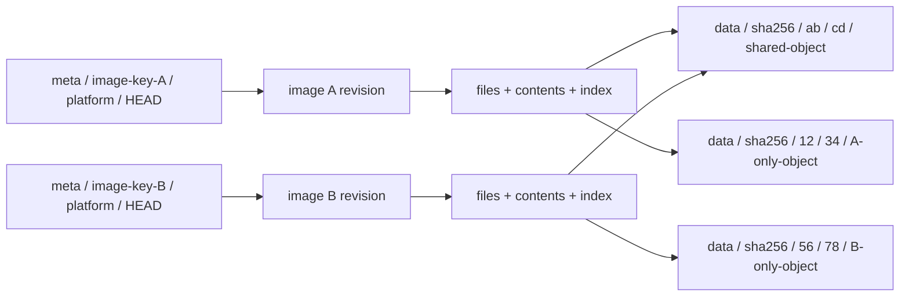

# Shared image cache v2: independent metadata and shared content

> Status: proposed design, not implemented. This layout handles each image independently while sharing actual file content. Existing publishers and readers still use the [implemented v1 format](shared-image-cache-storage.md).

V2 keeps each image's mutable state and file indexes in its own meta directory, sharing only immutable data objects. Different images do not update a common reference table, image index, or mutable pack. Concurrent updates of one image are handled at that platform's own HEAD.

## Complete tree

```text
<cache-prefix>/
├── format.json
├── meta/
│   ├── <image-key-A>/
│   │   ├── identity.json
│   │   └── platforms/
│   │       ├── linux-amd64/
│   │       │   ├── HEAD.json
│   │       │   ├── revisions/
│   │       │   │   ├── <revision-hex-1>/
│   │       │   │   │   ├── manifest.json
│   │       │   │   │   ├── config.json
│   │       │   │   │   ├── files.bin
│   │       │   │   │   ├── contents.bin
│   │       │   │   │   ├── index.bin
│   │       │   │   │   ├── objects.bin
│   │       │   │   │   ├── checksums.bin
│   │       │   │   │   └── COMMIT.json
│   │       │   │   └── <revision-hex-2>/
│   │       │   │       └── <same immutable metadata files>
│   │       │   └── uploads/
│   │       │       └── <upload-id>/
│   │       │           ├── plan.json
│   │       │           └── progress.json
│   │       └── linux-arm64-v8/
│   │           ├── HEAD.json
│   │           ├── revisions/<revision-hex>/
│   │           │   └── <same immutable metadata files>
│   │           └── uploads/<upload-id>/
│   │               ├── plan.json
│   │               └── progress.json
│   └── <image-key-B>/
│       ├── identity.json
│       └── platforms/<platform>/
│           ├── HEAD.json
│           ├── revisions/<revision-hex>/
│           │   └── <same immutable metadata files>
│           └── uploads/<upload-id>/
│               ├── plan.json
│               └── progress.json
└── data/
    └── sha256/
        ├── 00/
        │   ├── 00/<full-object-hex>
        │   └── ff/<full-object-hex>
        ├── ab/
        │   ├── cd/<full-object-hex>
        │   └── ef/<full-object-hex>
        └── ff/
            └── ff/<full-object-hex>
```

The cache-prefix is a prefix inside an S3 bucket or a filesystem cache directory. Every full-object-hex is a complete 64-character digest and its prefixes must match. Angle brackets are structural placeholders; JSON digest/length values are illustrative, not readable published objects.

There are three boundaries:

- `meta/<image-key>/`: management of one canonical image reference, including its tag or pinned digest.
- `platforms/<platform>/`: independent publication for one Linux platform of that reference.
- `data/sha256/<p0>/<p1>/<object-hash>`: immutable content reusable by all images, without a shared mutable index or reference-count file.

Format.json is immutable cache-prefix configuration, conditionally created at initialization. It contains no image list, upload progress, or global current pointer.

## Identities, tags, and revisions

| Identity | Computation/name | Meaning |
|---|---|---|
| image-key | `hex(SHA256(UTF8(canonical_reference)))` | Image name plus tag/pinned digest, excluding platform |
| canonical_reference | `registry/repository@tag-or-digest` | Existing OCI normalization |
| platform | linux-amd64, linux-arm64-v8, etc. | Canonical OS/architecture/variant directory name without slashes |
| revision | `SHA256(exact COMMIT.json bytes)` | Complete immutable metadata revision |
| file-digest | `SHA256(whole raw file bytes)` | File content identity independent of path/mode |
| object-hash | `SHA256(raw chunk bytes)` | Cross-image shared storage identity |

Alpine:3.20 normalizes to registry-1.docker.io/library/alpine@3.20. Alpine:latest, alpine:3.20, and alpine from another repository each have their own image-key but can share identical data. Explicit image@sha256:… references also have their own metadata directories, avoiding a global mutable manifest-to-image lookup.

When a tag resolves to a new manifest, its image-key stays unchanged. Create a revision and update that platform's HEAD, retaining old revisions. Amd64 and arm64-v8 have separate HEADs and cannot overwrite each other's publications.

Queries carry `image-key + platform + revision`. A reader loads HEAD once at startup and pins that handle. Manifest digests verify provenance rather than serving as the complete storage address. A global mutable image index must not be reintroduced merely to preserve the old digest-only query interface.

## meta: what each image owns

| Object | Contents/purpose | Mutability |
|---|---|---|
| identity.json | Version, canonical image reference, image-key | Immutable conditional creation; verify existing identity |
| HEAD.json | Current revision, manifest digest, generation, publication time | Platform-scoped CAS update |
| revisions/<revision>/manifest.json | Provenance: source reference, platform, selected OCI manifest/config/layer digests | Immutable |
| config.json | Environment, entrypoint, command, working directory, startup configuration | Immutable |
| files.bin | Complete paths/raw bytes, types, Unix attributes, hard-link groups, symlink targets, file-digests | Immutable |
| contents.bin | Distinct file contents used by the revision: file-digest, size, ordered chunks | Immutable |
| index.bin | Paths to files entries and directories to ordered child entries | Immutable; derivable from files |
| objects.bin | Unique chunk digest/length set for integrity, statistics, and GC | Immutable; derivable from contents |
| checksums.bin | Per-page SHA-256 catalog for the four binary objects | Immutable; verified by COMMIT |
| COMMIT.json | Revision identity/provenance and digests/lengths of the six metadata files plus checksums.bin | Immutable revision-completion marker |
| uploads/<upload-id>/plan.json | Target platform/revision, source manifest, originally observed HEAD/CAS condition | Independent and immutable per upload |
| uploads/<upload-id>/progress.json | Upload progress and resume hints, excluding storage credentials | Updated only by its uploader |

Files and contents are separate: two paths with different modes can reference one file-digest. Hard links additionally share inode/link-group identity. Empty files have the empty-content digest and no chunks, requiring no zero-byte data object. Directories, symlinks, and special entries have no file-content reference.

Index is derived binary metadata verified as part of the revision. File tables and indexes are read in pages within this image revision, without combining multiple images into one index. Metadata sizes, page counts, and entry counts require explicit limits.

### HEAD and COMMIT

Example HEAD:

```json
{
  "format_version": 2,
  "image_key": "<canonical-reference-sha256-hex>",
  "platform": "linux-amd64",
  "revision": "sha256:<commit-bytes-sha256-hex>",
  "manifest_digest": "sha256:<platform-manifest-hex>",
  "generation": 7,
  "published_at": 1791072000
}
```

Example COMMIT:

```json
{
  "format_version": 2,
  "image_key": "<canonical-reference-sha256-hex>",
  "platform": "linux-amd64",
  "manifest_digest": "sha256:<platform-manifest-hex>",
  "metadata": {
    "manifest.json": {"sha256": "sha256:<hex>", "bytes": 1200},
    "config.json": {"sha256": "sha256:<hex>", "bytes": 800},
    "files.bin": {"sha256": "sha256:<hex>", "bytes": 48000},
    "contents.bin": {"sha256": "sha256:<hex>", "bytes": 16000},
    "index.bin": {"sha256": "sha256:<hex>", "bytes": 12000},
    "objects.bin": {"sha256": "sha256:<hex>", "bytes": 4000},
    "checksums.bin": {"sha256": "sha256:<hex>", "bytes": 256}
  }
}
```

Revision hashes actual COMMIT bytes, so COMMIT **does not contain its own revision field**, avoiding a cyclic digest. Revision directories use the hex portion. Fixed metadata serialization determines exact bytes, lengths, and hashes. COMMIT excludes publication-attempt times and upload IDs so identical metadata can reuse a revision. Time and generation belong to HEAD/upload records.

An existing COMMIT is not tag visibility. Ordinary tag readers use a revision only once HEAD points to it. Pinned readers can continue using retained older revisions.

## Binary file tables and paged indexes

### Why changing the serializer is insufficient

Current v1 fetches the entire JSON index, deserializes all entries, then constructs paths/directories HashMaps. More files increase download, parsing, allocation, and index-building costs. This identifies an optimization opportunity; without component measurements, it does not establish JSON as the main source of current restore latency.

V2 aims to start without visiting every file, perform lookup without building a whole-image in-memory index, and fetch content descriptors only for the requested file. Replacing JSON with MessagePack, Protobuf, or ordinary bincode while eagerly decoding the same structures is insufficient.

Small control objects remain JSON: format, identity, HEAD, COMMIT, manifest, and config, with size limits. Files, contents, index, and objects grow with file counts and use binary encodings; a new checksums.bin supports integrity checks for partial reads. The runtime hot path does not read objects.bin, which serves publication verification, statistics, and offline GC.

### Binary object layout

The baseline is a versioned read-only paged format with fixed record tables, byte arenas, and indexes within pages. The default page size is 64 KiB, with uncompressed metadata initially. S3 uses Range GET; filesystem readers use pread or mmap of fully cached files. Mmap does not eliminate page-fault I/O or provide zero-copy access to remote S3.

```text
files.bin
├── header + section directory
├── fixed FileRecord table
└── raw-byte arena: paths, symlink targets, extended attributes

contents.bin
├── header + section directory
├── fixed ContentRecord table
└── fixed ChunkRecord table

index.bin
├── header + B+tree root
├── internal pages: separators + child page IDs
└── linked leaf pages: (parent file ID, raw basename) -> file ID

objects.bin
├── header
└── sorted unique (32-byte object hash, object length) records

checksums.bin
├── header + per-object page counts
└── SHA-256 page hashes: files / contents / index / objects
```

| Object/structure | Proposed fields and access |
|---|---|
| Common header | Magic, object type, format/schema version, flags, page_bytes, total length, entry counts, section locations; explicitly little-endian multibyte integers |
| FileRecord | File ID, parent file ID, inode/link-group, type and Unix attributes, offset+length for paths/targets/xattrs, content ID; direct addressing by file ID |
| ContentRecord | 32-byte whole-file digest, file length, first chunk ID, chunk count; direct addressing by content ID |
| ChunkRecord | 32-byte data digest and chunk length; file offsets follow fixed chunk_bytes and chunk ordinal |
| Index pages | Bounded page entries, full separator keys, child/adjacent page IDs; sorted by parent file ID and raw basename bytes, without assuming collision-free path hashes |
| Objects records | Digest and length, sorted and deduplicated by full digest; no repeated hexadecimal strings |
| Checksums | Fixed object order, per-object page counts, and 32-byte page digests; page lengths follow total object lengths in COMMIT |

Publishers assign file IDs in raw-path-byte order and content IDs in whole-file-digest order. Indexes, object inventories, and checksum tables use deterministic ordering. Identical input and schemas produce identical bytes; HashMap iteration order or native memory layout is not an encoding specification.

File IDs identify directory entries; inode/link-group identifies hard links. These are distinct. Content IDs address descriptors within this revision rather than providing cross-image identities; sharing still uses whole-file/data digests. Directory hard links are prohibited except for special . / .. semantics. Paths, basenames, and symlink targets retain raw bytes without requiring UTF-8.

Fixed table records cannot straddle pages. Variable byte arenas use offset+length and may span pages. Sections are page-aligned with deterministic zero padding. The specification defines ID-to-section/page offset calculations; Rust struct memory must not be written directly. Exact field offsets, record widths, and schemas must be fixed separately before implementation. This section defines organization and the read protocol rather than a completed binary ABI.

Full paths resolve component by component. Readdir starts at the parent's first key and follows leaf pages; cookies bind to revision and page/slot. Publishers validate unique paths, parent relationships, hard-link attributes, and consistency between index and files. Readers bound tree depth, page visits, key lengths, entry counts, and offset arithmetic, rejecting out-of-bounds references, cycles, and unknown required features. Errors must not become “file not found.”

### Partial reads still require integrity checks

Whole-file SHA-256 alone is insufficient: downloading an entire index before checking its hash defeats paged loading. COMMIT records whole-file digests/lengths for the four binary objects and a digest/length for checksums.bin:

1. Verify COMMIT against the pinned revision digest, then fetch and fully verify size-bounded checksums.bin.
2. Check page_bytes, object order, and page counts against COMMIT lengths; reject overflow or extra pages. COMMIT verifies checksums itself, which does not recursively appear in its own page table.
3. Fetch pages on demand, checking their SHA-256 before using any fields/offsets. Hash only actual bytes of the final page; other pages include deterministic padding.
4. Page-cache keys include revision, object type, and page ID. Cache hits preserve trusted verification state. Full downloads/audits additionally check the whole-file hash.

For example, four objects totaling 64 MiB, with each object's length page-aligned, contain 1,024 digests at 64 KiB per page. The catalog occupies 32 KiB plus a small header. This is a size calculation, not a latency measurement. The catalog still needs a size limit. Larger images requiring paged checksum catalogs need a future authenticated hierarchy rather than skipped verification.

Use bounded LRU and persistent page caches, coalesce adjacent remote Range GETs where possible, and optionally prefetch common header/root pages. Do not unconditionally issue an independent S3 request per path component. Incomplete cached files cannot be mapped as complete objects; use the page cache until a full download has been verified, then allow whole-file mmap. Initial metadata avoids whole-file zstd; independently compressed pages require later benchmark-driven design.

### Queries and encoding choice

Startup reads control objects, checksums, and necessary header/root pages. Lookup reads index traversal pages and the target FileRecord; read subsequently fetches related ContentRecord/ChunkRecord entries and data objects. Directory enumeration and complete file-list export are sequential paged operations, outside the mandatory startup path. Cold queries can still require multiple S3 round trips; binary encoding does not automatically deliver tens of milliseconds.

[FlatBuffers offset-based access](https://flatbuffers.dev/white_paper/) can avoid first converting an entire object and is a prototype comparison candidate. A single whole-image FlatBuffer does not automatically provide remote paging, page integrity, and directory indexing. [SQLite's paged B-tree format](https://www.sqlite.org/fileformat.html) is also a comparison candidate; this use still requires read-only remote page access plus integrity and caching design. V2 currently uses an explicit read-only paged format as its baseline; this documentation change adds no library dependency.

Before implementation, compare current JSON, paged binary, and candidate libraries at 1,000, 10,000, and 100,000 directory entries. Measure cold-S3/warm-local startup to first lookup, first file read, readdir, sequential scan, downloaded bytes, GET counts, parsing/verification CPU, and peak RSS. Results determine page size, prefetch policy, and final encoding; no fixed speedup is claimed before measurement.

## data: share actual file bytes

Example format configuration:

```json
{
  "format_version": 2,
  "hash_algorithm": "sha256",
  "encoding": "raw",
  "chunk_bytes": 1048576,
  "shard_prefix_bytes": 2,
  "metadata_encoding": "pvisor-paged-v1",
  "metadata_page_bytes": 65536
}
```

Default shard prefixes are the first two and next two hex characters. An h starting with abcd maps to `data/sha256/ab/cd/<h>`. Leaf filenames retain full digests to avoid short-hash collisions. Raw encoding, hash algorithm, and shard depth are immutable prefix configuration.

Two levels provide 65,536 possible leaf shards and at most 256 child directories per upper level. Average leaf occupancy is approximately N/65,536; fixed hash prefixes do not impose a hard leaf-object limit. Three two-character levels can be selected at initialization for 16,777,216 possible leaves. Depth cannot then change in place and invalidate existing references. Hard count limits need capacity budgets or an explicit migration/resharding design, rather than claiming two hex characters guarantee unlimited scale.

### File-independent chunks

Each file starts at its own offset zero and is split into sequential chunks of at most 1 MiB. Different files never share a pack object. A small file uses one object, a large file several; hard links and identical files reuse content descriptors and objects. Data digests exclude image-key, path, mode, mtime, and upload time.

The following is a readable illustration of a contents.bin record, **not the actual on-disk JSON encoding**:

```json
{
  "file_digest": "sha256:<whole-file-hex>",
  "size": 1048581,
  "chunks": [
    {"digest": "sha256:<first-chunk-hex>", "length": 1048576},
    {"digest": "sha256:<last-chunk-hex>", "length": 5}
  ]
}
```

This represents a file of 1 MiB plus 5 bytes. A chunk's file offset is the sum of earlier lengths. V1's within-pack file-span offset is unnecessary. Every chunk contains one part of this file; identical complete files produce identical chunks in every image.

Renaming a file, changing images, or changing permissions does not duplicate its data. Different files can also share identical aligned chunks. Fixed chunks are not content-defined chunks: inserting bytes at the beginning can change later chunks, so similar files are not guaranteed high deduplication.

Avoiding cross-file packs increases small-file object counts and GET/PUT requests. This is the tradeoff for stable file-content reuse. Future small-file packing needs independent content addressing and location mapping; a file's physical identity must not depend on its neighbors as in v1 whole-image packing.

## How two images share



Identical /usr/lib/libc.so files in images A and B can use the same file-digest and data chunks. A's modes, paths, and timestamps live in A's files, and B's attributes live in B's files. Neither image modifies shared data or shares mutable metadata.

Data is conditionally created and reused when present; readers verify its digest. Publishers reuse objects they have verified or verify existing objects before reuse. Corruption fails without overwriting content potentially referenced by other images. Physical savings are measured by unique object lengths, not summed image-logical bytes.

## Concurrent publication and commit protocol

1. Normalize the image, choose a platform, and read its HEAD contents and ETag/version, or record a create condition if absent.
2. Prepare the image locally, build file metadata, compute file/chunk hashes, COMMIT, and target revision; create an independent upload plan.
3. Upload/reuse all data using conditional creation, without shared reference counts.
4. Conditionally create full metadata under the image's platform/revision and verify every digest/length.
5. Conditionally create COMMIT last as the revision's completion marker.
6. CAS the platform's HEAD: If-None-Match for initial creation, originally observed If-Match ETag otherwise; clean upload state after success.

**HEAD is the only visibility commit point.** This is not a whole-store transaction. Upload success followed by HEAD failure leaves invisible metadata/reusable data while preserving the image's current readable revision. Dependencies must be complete and readable before HEAD commits.

S3 If-Match uses the returned ETag as a comparison token, not a content SHA-256. Mismatches cause conflicts; conditional writes and GetObject/PutObject permissions are documented in [AWS conditional writes](https://docs.aws.amazon.com/AmazonS3/latest/userguide/conditional-writes.html). Compatible stores must provide equivalent conditional create/update semantics. Filesystems use platform-scoped locks, old-HEAD verification, synced temporary files, and atomic replacement.

| Concurrent case | Outcome |
|---|---|
| Different image-keys | Separate metadata writes; identical data hashes are reused idempotently |
| Same image, different platforms | Separate HEADs and revisions |
| Same image/platform observing the same HEAD | Both build revisions, only one CAS succeeds |
| HEAD CAS conflict | Explicit conflict; never remove the condition or blindly overwrite a newer HEAD with an old source |
| Crash before commit | Existing HEAD stays unchanged; upload state/unreferenced data may remain |
| HEAD timeout with unknown outcome | Reread HEAD to determine whether it committed, without blind overwrite |
| Reader pinned to an old revision | Continues using retained COMMIT/metadata/data |

Generation increments only inside the platform HEAD, decided by successful CAS, not a global clock. A retry after conflict must reobserve HEAD and confirm the source tag instead of unconditionally allowing the last writer to win.

## Reading, deletion, and GC

Reading follows image-key/platform/HEAD → revision/COMMIT → file metadata/content descriptors → data. Pin a revision at reader startup rather than tracking tag changes per file read. Normal readers need only GetObject and do not write leases or counters.

Image deletion first disables new jobs/publications and confirms its readers and publishers have exited, then removes its own meta. Retiring a revision likewise requires confirming no readers use it. Neither directly deletes shared data; retained history retains objects references. Without active-reader coordination, revisions cannot be deleted merely because HEAD moved: read-only clients may still be pinned to them.

Initial GC is offline maintenance: pause publishing/metadata changes and confirm affected readers exited, enumerate all retained committed revisions, mark the union of objects.bin, then sweep unreferenced data. Upload leftovers can be removed only once their writers have stopped. Routine publishing does not depend on a global mutable reference-count database. Online concurrent GC needs separate design.

SHA-256 integrity does not authenticate publishers. Trusted publishers and storage permissions protect format, identity, HEAD, and COMMIT. Publishers need GetObject and PutObject for CAS/reuse verification, readers only GetObject, and GC separate enumeration/deletion privileges.

## Differences from v1 and migration

| Current v1 | Proposed v2 |
|---|---|
| Global refs/images/indexes metadata namespaces | Independent meta per image+tag |
| Overwritable manifest pointers and last-write tag updates | Platform-scoped conditionally committed HEADs |
| Metadata consolidated in one complete JSON tree index | Small JSON control objects separated from paged binary file tables/indexes |
| Neighboring small files packed together, whole-pack deduplication | File-independent chunks with stable cross-image reuse |
| Single-level blob digest paths | Prefix-sharded data |
| Manifest-digest-only queries | Pinned image-key/platform/revision handles |

Implementing v2 requires publisher, reader, handle, and local-cache-key changes. It is incompatible with v1 and cannot be obtained by renaming directories. Migrate each image by rebuilding metadata and file-independent chunks, verify them, then commit its own HEAD. Retain v1 data still needed by running jobs. Existing teaching objects continue documenting v1, without claiming migration.

This page defines layout, consistency, and binary paged reads, without runtime changes. Implementation still needs verification of CAS conflicts/unknown commit outcomes, identical-file reuse across images, independent tags/platforms, historical-reader retention, offline GC, corrupt pages, index bounds, and cold/warm query performance.
