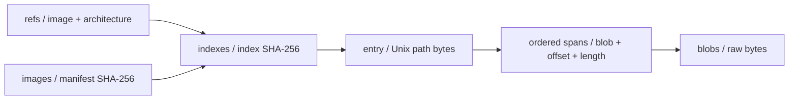

# Shared image cache storage format v1

> The successor design uses independent per-image meta and shared, sharded data; see [shared image cache v2](shared-image-cache-storage-v2.md). This page continues documenting implemented v1 for compatibility and migration.

This page describes the implemented filesystem/S3 direct-storage format and how `pvisor cache publish` produces it. See the [shared image cache reference](../reference/shared-image-cache.md) for operations. Directories, fields, and publication order follow `image/cache/portable.rs`, `portable/publish.rs`, `storage.rs`, and `client.rs`.

Filesystem and S3 backends share relative object keys. The server backend continues querying an existing OCI store; its internal storage does not use this v1 layout.

## Goals and stored data

The publisher resolves the selected Linux platform's OCI manifest, downloads and verifies layers, extracts them, applies whiteouts, and converts the merged file view into indexes and content objects. Workers read indexes and only accessed blocks, without maintaining a cache service or extracting an entire image.

The index preserves paths, types, sizes, modes, UID/GID, hard-link identities, timestamps, symlink targets, and image startup configuration. Names and symlink targets preserve Unix bytes. It does not store complete OCI manifests, original layer tar files, arbitrary xattrs, or runtime writable uppers. CPU/RAM environment snapshots use separate storage.

Content objects hold raw bytes, at most **1 MiB (1,048,576 bytes)**. There is no compression encoding, individual S3 object per file, block header, or embedded offset table. Index `spans` describe all file-to-block relationships.

## Shared storage tree

```text
s3://BUCKET/PREFIX/
└── v1/
    ├── format
    ├── refs/
    │   ├── <tag-reference-and-architecture-hash>.json
    │   └── <pinned-reference-and-architecture-hash>.json
    ├── images/
    │   └── <platform-manifest-hex>.json
    ├── indexes/
    │   └── <index-bytes-hex>.json
    └── blobs/
        ├── <packed-content-hex>
        └── <other-content-hex>
```

S3 “directories” are object-key prefixes. With `s3://images-cache/team-a`, a content key is `team-a/v1/blobs/<64-hex>`. With filesystem location `/mnt/cache`, it is `/mnt/cache/v1/blobs/<64-hex>`. Image path `etc/os-release` maps through the index to blocks, not to a same-named S3 key.

Digest strings use `sha256:<64-hex>`; filenames use only the hex part. Refs, images, and indexes add .json; blobs have no extension. Hashes are SHA-256. Object keys contain no host absolute paths.

| Path | Contents and purpose | Overwrite rule |
|---|---|---|
| `v1/format` | Fixed bytes `pvisor-cache-v1\n`, ending in one LF | Publisher writes the fixed value |
| `v1/refs/<hash>.json` | Reference and architecture → platform manifest and index digest | Both tag and pinned records are overwritten |
| `v1/images/<manifest-hex>.json` | Platform manifest digest → index digest | Overwritable |
| `v1/indexes/<index-hex>.json` | Complete file metadata, startup configuration, and spans | Conditional creation, no overwrite |
| `v1/blobs/<content-hex>` | At most 1 MiB of packed raw bytes | Conditional creation, no overwrite |

Format is written last as an identifying marker, not a global commit point. Readers rely on object versions and index/content digests. Current Ping only attempts to read the marker; it does not validate its presence or text. Successful Ping is not a complete-image integrity check.

## Digests and reference relationships



| Identity | Computation or source | Purpose |
|---|---|---|
| Platform manifest digest | Resolved OCI Linux/amd64 or Linux/arm64 manifest digest | Public digest; multi-platform images use the selected platform manifest |
| Reference-key digest | `SHA256(UTF8(canonical_image) + NUL + UTF8(architecture))` | Distinguishes tag/pinned references and architectures |
| Index digest | `SHA256(exact stored index JSON bytes)` | File-tree generation returned as metadata_generation |
| Content digest | `SHA256(exact raw packed bytes)` | Integrity and whole-block deduplication |

`alpine:latest`, `docker.io/library/alpine:latest`, and `oci://alpine:latest` normalize to `registry-1.docker.io/library/alpine@latest`. The @latest suffix is an internal representation. A pinned reference is `registry-1.docker.io/library/alpine@sha256:…`. Architectures are amd64 or arm64. NUL in key computation is one 0x00 byte, not the two characters backslash and zero.

Index hashing covers original JSON bytes, including whitespace and field order. JSON below is formatted for display. Downloadable objects use compact encoding and filenames derived from actual bytes. Reformatting an index requires a new digest and new pointers.

One platform manifest can produce different index digests when extraction timestamps or metadata change. Images is overwritable and does not permanently bind one generation. Refs stores the index digest directly, so prepare can load it directly. A manifest query without an already loaded index uses images.

## Object fields

### refs: resolve a reference and architecture

```json
{
  "version": 1,
  "image": "registry-1.docker.io/library/example@layout",
  "architecture": "amd64",
  "checked_at": 1700000000,
  "digest": "sha256:cccccccccccccccccccccccccccccccccccccccccccccccccccccccccccccccc",
  "index": "sha256:78fee5fd5d5c698c7513540ebee5b9e033c10c438439ed757c8abf8f954041ad"
}
```

| Field | Type | Meaning |
|---|---|---|
| `version` | u32 | Currently 1 |
| `image` | string | Canonical reference with tag or pinned digest |
| `architecture` | string | amd64 or arm64; part of reference-key identity |
| `checked_at` | u64 | Publication record time in Unix seconds, for the five-minute tag window |
| `digest` | string | Selected platform manifest digest |
| `index` | string | Digest of the indexes object |

Readers check version, reference, architecture, and the index's digest/architecture. Publication writes the requested reference and its pinned counterpart. If the input is already that pinned reference, both writes target the same key.

Writable prepare reuses tag records younger than 300 seconds and queries the registry after expiry. Pinned references do not expire by age. Read-only mode uses published records beyond expiry without registry access; missing records and --refresh fail. Publish never queries remote refs: it always packs and uploads the local prepared result. --refresh controls registry re-resolution.

### images: query directly by manifest

```json
{
  "version": 1,
  "index": "sha256:78fee5fd5d5c698c7513540ebee5b9e033c10c438439ed757c8abf8f954041ad"
}
```

The only fields are `version: u32` and `index: string`. The manifest digest comes from the key and is not repeated in contents. Readers verify the index digest and its manifest digest.

### indexes: complete file view and startup configuration

[Download the complete example index](../../assets/examples/cache-layout-v1/v1/indexes/78fee5fd5d5c698c7513540ebee5b9e033c10c438439ed757c8abf8f954041ad.json).

| Field | Type | Meaning |
|---|---|---|
| `version` | u32 | Currently 1 |
| `digest` | string | Selected platform manifest digest |
| `architecture` | string | Selected platform architecture |
| `env` | object<string, string> | Image default environment |
| `entrypoint` / `cmd` | array<string> | Image startup arguments |
| `totals` | object | files: u64 and bytes: u64; regular-file path count and logical-byte sum |
| `entries` | array<Entry> | Complete tree including root, one entry per path |

Totals count regular-file paths, including each hard-link path. They are not unique-inode counts, physical object sizes, or upload traffic. Directories, symlinks, and special entries do not contribute regular-file/byte totals.

A complete Entry is:

```json
{
  "path": [
    101,
    116,
    99,
    47,
    109,
    101,
    115,
    115,
    97,
    103,
    101
  ],
  "metadata": {
    "status": "metadata",
    "kind": "file",
    "size": 5,
    "mode": 33188,
    "uid": 0,
    "gid": 0,
    "inode": 6,
    "nlink": 2,
    "mtime": 1700000000,
    "mtime_nsec": 0,
    "target": null
  },
  "spans": [
    {
      "blob": "sha256:93355ccb32baf92c9cc4f6ec98a7e5aefc569663ff20a67215db0683fc61da8d",
      "offset": 3,
      "length": 5
    }
  ]
}
```

| Entry field | Type | Meaning |
|---|---|---|
| `path` | array<u8> | Raw bytes relative to the image root; [] represents root |
| `metadata` | object | Reuses the cache protocol's status: metadata response |
| `spans` | array<Span> | Content spans in file-logical order; empty for non-regular files |

The example path decodes to etc/message. Reads look up the index rather than opening a host path. Paths forbid NUL, empty components, dot/parent components, and leading slashes. Parents must exist and be directories. Names need not be UTF-8 and use neither URL encoding nor Base64. JSON integer arrays can occupy more storage than raw path bytes.

| Metadata field | Type | Meaning |
|---|---|---|
| `status` | string | Always metadata |
| `kind` | string | directory, file, symlink, or special |
| `size` | u64 | Logical file/link size; directory size follows source metadata |
| `mode` | u32 | Numeric Unix mode; permissions use permission bits, kind specifies type |
| `uid` / `gid` | u32 | Unix identities preserved by the source OCI view |
| `inode` | u64 | Nonzero portable identity, shared by a hard-link group |
| `nlink` | u64 | Source metadata link count |
| `mtime` / `mtime_nsec` | i64 | Unix seconds and nanosecond component |
| `target` | array<u8> or null | Raw symlink target bytes; null for other types |

Publication maps host inodes to consecutive identities inside an index rather than exposing host inode numbers. Symlinks are recorded without following them. Cache read accepts regular files; FUSE resolves guest symlink paths using targets. Special entries retain metadata but have no spans and cannot be read as regular files. Arbitrary OCI xattrs are not separately stored.

### spans and blobs: file range mapping

Span contains `blob: string`, `offset: u32`, and `length: u32`. Offset is **inside the blob**. File offset is the sum of preceding span lengths. A regular file's span lengths sum to its size; empty files have no spans.

Span lengths are nonzero and offset + length ≤ 1 MiB. Reads also check against actual object length. Blobs have no JSON, compression header, or padding; final packs can be shorter than 1 MiB. The whole object's SHA-256 is verified before slicing.

## A complete readable tree example

This is amd64 teaching data with a placeholder manifest digest of 64 c characters. It does not identify a real registry image and is not a bootable Linux rootfs. All objects live under docs/src/assets/examples/cache-layout-v1/ in the repository. Structure and content digests are valid and readable without S3 or a registry.

```text
/
├── bin/
│   ├── current -> tool
│   └── tool                 # ABC
└── etc/
    ├── message              # hello
    └── message-copy         # hard link to message
```

One block stores ABChellohello, 13 bytes, with digest `sha256:93355ccb32baf92c9cc4f6ec98a7e5aefc569663ff20a67215db0683fc61da8d`:

| Path | File-logical range | Blob offset | Length | Inode |
|---|---|---:|---:|---:|
| `bin/tool` | `[0,3)` | 0 | 3 | 4 |
| `etc/message` | `[0,5)` | 3 | 5 | 6 |
| `etc/message-copy` | `[0,5)` | 8 | 5 | 6 |

Bin/current has target [116,111,111,108], decoding to tool, with empty spans. The two message paths share inode 6 and nlink 2. The publisher reads per path, so they occupy separate spans. Existing deduplication operates on whole blocks, not independently on hard links or individual file spans.

Inspect the [reference record](../../assets/examples/cache-layout-v1/v1/refs/a8d93e91eb6f819b7d43e6cdfa45d577eb739e9efc6bf7ec489b6242097eda03.json), [manifest pointer](../../assets/examples/cache-layout-v1/v1/images/cccccccccccccccccccccccccccccccccccccccccccccccccccccccccccccccc.json), [complete index](../../assets/examples/cache-layout-v1/v1/indexes/78fee5fd5d5c698c7513540ebee5b9e033c10c438439ed757c8abf8f954041ad.json), and [raw content block](../../assets/examples/cache-layout-v1/v1/blobs/93355ccb32baf92c9cc4f6ec98a7e5aefc569663ff20a67215db0683fc61da8d). From the repository root:

```sh
cache_layout_location="$PWD/docs/src/assets/examples/cache-layout-v1"
pvisor cache --backend filesystem --location "$cache_layout_location" \
  --read-only stat sha256:cccccccccccccccccccccccccccccccccccccccccccccccccccccccccccccccc etc/message
pvisor cache --backend filesystem --location "$cache_layout_location" \
  --read-only read sha256:cccccccccccccccccccccccccccccccccccccccccccccccccccccccccccccccc etc/message
```

The last command prints hello. Stat/read by manifest do not require matching host/index architectures, so arm64 hosts can also read it. Prepare by reference selects host-architecture records; this example only supplies amd64 references.

Large files can span blocks and need not start at blob offset zero. If a pack already holds 100 bytes, a 1,048,576-byte file occupies [100,1,048,576) in that pack and [0,100) in the next. File range [1,048,470,1,048,490) combines the first span's final 6 bytes with the next span's first 14 bytes.

## Publication order, concurrency, and failure

Publish completes local OCI preparation and walks the tree in directory sort order. Each regular file appends bytes to the current pack, uploaded when it reaches 1 MiB. The shorter final pack is uploaded after traversal. Packs cross file boundaries and their digests depend on all bytes and boundaries; identical files need not reuse the same S3 object.

1. Conditionally create all blobs.
2. Validate and serialize the complete index, then conditionally create it.
3. Overwrite images/<manifest>.json.
4. Overwrite the requested refs record.
5. Overwrite the corresponding pinned refs record.
6. Write the fixed format marker and return Prepared JSON.

S3 immutable objects use If-None-Match conditional creation and reuse existing objects. Filesystem writes use same-directory temporary files, file sync, no-clobber publication or atomic replacement, and directory sync. Both require complete, atomically visible single-object writes.

This is not a multi-object transaction. Content/index failures do not publish new pointers/references but can leave unreferenced objects. Once images or the requested refs record is written, a later pinned-ref/format failure makes the command fail while earlier writes remain visible. They reference completed content and are not rolled back.

Concurrent publication uses the last completed overwrite, without tag CAS, timestamp monotonicity checks, or a group pointer lock. Refs and images can temporarily point at different indexes. Readers follow the immutable index digest they obtained. Existing readers may retain older indexes after metadata changes, so older indexes and blocks cannot be immediately deleted.

Repeated publish restores missing objects but does not overwrite existing corrupted immutable objects. Conditional creation reuses them and read-time verification fails. Repair requires an administrator to assess the impact, remove the corrupt object, and republish. Retries do not automatically fix arbitrary corruption.

## Demand reads and local trees

Prepare by reference loads indexes directly through refs. Direct stat/list/read resolve manifests through images. Loaded indexes for the same manifest are reused to avoid pointer lookups on every read. A whole index loads once, then directory/attribute queries use memory maps. List sorts raw bytes and pages at most 256 entries, also bounded by the 1 MiB protocol-frame limit.

Range reads download only intersecting blocks. Current GETs fetch whole objects, with no S3 Range GET: reading a small file's 5 bytes can download a whole pack. Memory hits avoid GETs, and independent processes can reuse locally persisted objects.

```text
--image-store DIR/
├── blobs/sha256/<oci-blob-hex>
├── rootfs-v3/sha256/<manifest-hex>/
├── metadata/
│   ├── sha256/<manifest-hex>.json
│   └── prepared-v1/<local-reference-key>.json
└── locks/

<user-cache>/pvisor/
├── cache-v1/objects/<location-hash>/
│   ├── indexes/<index-hex>
│   └── blobs/<content-hex>
├── blocks/<endpoint-hash>/<manifest-hex>/
│   └── <file-block-cache-objects>
└── metadata/v1/<endpoint-hash>/<manifest-hex>/<generation-hash>/
```

Image-store is publisher OCI download/extraction staging, defaulting to pvisor/images in the system user cache. Published objects do not depend on it, so staging can be removed after success. The tree omits auxiliary OCI/FUSE/job files.

Direct-backend readers maintain cache-v1/objects. Location-hash is the SHA-256 hex of the configured address string. Local index/blob names omit sha256:, and indexes omit .json. Address separation avoids mixed namespaces; textually different equivalent addresses may have separate caches.

Blocks and metadata/v1 belong to the VM lazy adapter: logical file blocks and attributes/directory pages keyed by metadata_generation. They can coexist with whole-object caches, so disk accounting must include these copies. Direct-backend LRU caches keep at most 4 indexes and 64 content blocks. Blocks total at most 64 MiB; indexes have a count limit, not a 64 MiB aggregate budget.

Locally persisted objects are reverified and refetched if corrupt. Unwritable local caches still allow verified remote reads. Missing, corrupt, or denied remote objects fail without zero filling or silent registry fallback. Read-only protects shared storage but can still write local acceleration caches.

## Limits, permissions, and lifecycle

| Item | Current value or rule |
|---|---|
| Architectures | amd64 and arm64 |
| Object/index read limit | 64 MiB; blocks additionally limited to 1 MiB |
| Paths per index | 200,000, including root |
| Spans per index | 500,000 |
| File read length | 1…1,048,576 bytes; CLI uses streaming requests |
| Tree structure | Directory root, unique paths, existing directory parents |
| Content relationships | Span-length sum equals size; totals match per-path statistics |
| Versions | Ref, image pointer, and index version must be 1 |
| Unknown fields | Refs/images/index/Entry/Span reject them; metadata follows Response deserialization |

Structure is validated during publication and loading. Long paths or many spans can hit the 64 MiB JSON limit first. Source prepared rootfs must stay immutable while publishing. Truncation, growth, or changing to a non-regular file is rejected, but publication is not a transactional source-tree snapshot and does not detect every same-size mutation.

Publish uploads require s3:PutObject; writable prepare also needs s3:GetObject, and read-only workers need only GetObject. Normal operations use neither ListBucket, DeleteObject, nor bucket creation. Connections and credentials belong to the host; see the [configuration reference](../reference/shared-image-cache.md). Digests provide integrity, not authentication of untrusted publishers. Trusted publishers and storage permissions must protect refs, images, and startup configuration.

There is no automatic GC, quota, lease, or per-reference deletion tool. Direct-backend object caches do not coalesce downloads across processes; VM file-block caches still use local locks. Blocks can be shared by indexes, so deleting an old reference does not make blocks safe to delete. Age-based blob expiry can break valid images. Retire independent buckets/prefixes only after confirming no readers need them. Finer GC must trace references and protect active/historical readers.

V1 readers do not interpret other versions. Field/encoding changes require explicit versions and compatibility strategies; new compression encodings or path meanings cannot silently enter old v1 objects.

## Implementation and validation

| Mechanism | Implementation/test |
|---|---|
| Objects, ranges, reference expiry, loading validation | `crates/pvisor/src/image/cache/portable.rs` |
| Packing, portable inodes, publication order | `crates/pvisor/src/image/cache/portable/publish.rs` |
| Filesystem writes, S3 conditional creation, errors | `crates/pvisor/src/image/cache/storage.rs` |
| Backend configuration and local object paths | `crates/pvisor/src/image/cache/client.rs` |
| Ranges/EOF, hard links, pagination/non-UTF-8 names, failed publication, local corruption | `crates/pvisor/src/image/cache/portable/tests.rs` |
| Signed CLI publication, missing-block repair, independent readers, real VM | `crates/pvisor/tests/cache_backends.rs` |

Publish and read a production image with:

```sh
PVISOR_CACHE_READ_ONLY=false pvisor cache publish alpine:latest \
  --backend s3 --location s3://your-bucket/pvisor-cache \
  --architecture amd64 --image-store /tmp/pvisor-publish

export PVISOR_CACHE_BACKEND=s3
export PVISOR_CACHE_LOCATION=s3://your-bucket/pvisor-cache
export PVISOR_CACHE_READ_ONLY=true
pvisor cache prepare alpine:latest
pvisor cache read sha256:YOUR_MANIFEST_DIGEST etc/os-release
```

These require an existing bucket and valid AWS region/credentials. See the [shared image cache reference](../reference/shared-image-cache.md) for operations. The attached small example validates object structure and reading semantics only.
