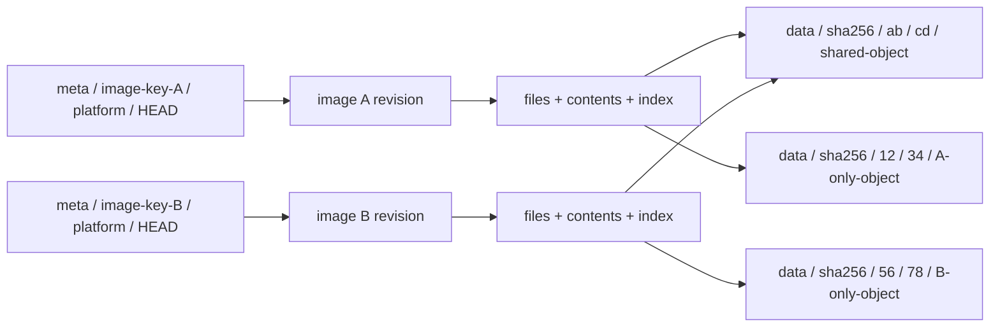

# Shared image cache v1: independent metadata and shared content

> Status: implemented. Filesystem/S3 caches use this v1 format: independently managed image metadata, shared file contents, and paged indexes. This is the sole cache implementation; online/offline GC tooling is not implemented.

See the [Lazy Image V2 design proposal](lazy-image-v2.md) for future small-file packing. The proposal is not implemented and does not change the V1 format or current interfaces described here.

V1 keeps each image's mutable state and file indexes in its own meta directory, sharing only immutable data objects. Different images do not update a common reference table, image index, or mutable pack. Concurrent updates of one image are handled at that platform's own HEAD.

## Filesystem entry points and lazy reads {#filesystem-access}

The v1 storage format is independent of filesystem entry points. The
[shared service and two entry points](overlayfs.md#filesystem-service) are now
connected: host tools retain a read-only host FUSE lower, while VMs call the same
remote read-only backend through virtio-fs without an intermediate host FUSE mount.
Local lowers and VM staged workspaces also serve virtio-fs directly; host staged
retains host execution. This refactor preserves the published v1 format, pinned
revision handles and verification contracts.

`backend.rs` retains stat/list/read, paged indexes, hard-link identity and bounded
content caches; `lazy.rs` handles host FUSE callbacks, and `direct.rs` provides the
private VM metadata projection and runner attachment. The projection has no FUSE
mount, and small reads fetch only their intersected content blocks. First writes
copy up the complete original file into a private upper. Complete checkpoints and
self-contained tree exports populate the full image and may trigger additional
downloads. Content misses hold neither a service-wide lock nor the metadata map.

No performance A/B data exists yet for this direct backend. Measure cold-miss
interference, warm-read cache hits and complete-task time separately; removing
an intermediate layer does not establish overall acceleration.

## Complete tree

```text
<cache-prefix>/
├── format.json
├── meta/
│   ├── <image-key-A>/
│   │   ├── identity.json
│   │   └── platforms/
│   │       ├── linux-amd64/
│   │       │   ├── HEAD.json
│   │       │   ├── revisions/
│   │       │   │   ├── <revision-hex-1>/
│   │       │   │   │   ├── manifest.json
│   │       │   │   │   ├── config.json
│   │       │   │   │   ├── files.bin
│   │       │   │   │   ├── contents.bin
│   │       │   │   │   ├── index.bin
│   │       │   │   │   ├── objects.bin
│   │       │   │   │   ├── checksums.bin
│   │       │   │   │   └── COMMIT.json
│   │       │   │   └── <revision-hex-2>/
│   │       │   │       └── <same immutable metadata files>
│   │       │   └── uploads/
│   │       │       └── <upload-id>/
│   │       │           ├── plan.json
│   │       │           └── progress.json
│   │       └── linux-arm64-v8/
│   │           ├── HEAD.json
│   │           ├── revisions/<revision-hex>/
│   │           │   └── <same immutable metadata files>
│   │           └── uploads/<upload-id>/
│   │               ├── plan.json
│   │               └── progress.json
│   └── <image-key-B>/
│       ├── identity.json
│       └── platforms/<platform>/
│           ├── HEAD.json
│           ├── revisions/<revision-hex>/
│           │   └── <same immutable metadata files>
│           └── uploads/<upload-id>/
│               ├── plan.json
│               └── progress.json
└── data/
    └── sha256/
        ├── 00/
        │   ├── 00/<full-object-hex>
        │   └── ff/<full-object-hex>
        ├── ab/
        │   ├── cd/<full-object-hex>
        │   └── ef/<full-object-hex>
        └── ff/
            └── ff/<full-object-hex>
```

The cache-prefix is a prefix inside an S3 bucket or a filesystem cache directory. Every full-object-hex is a complete 64-character digest and its prefixes must match. Angle brackets are structural placeholders; JSON digest/length values are illustrative, not readable published objects.

There are three boundaries:

- `meta/<image-key>/`: management of one canonical image reference, including its tag or pinned digest.
- `platforms/<platform>/`: independent publication for one Linux platform of that reference.
- `data/sha256/<p0>/<p1>/<object-hash>`: immutable content reusable by all images, without a shared mutable index or reference-count file.

Format.json is immutable cache-prefix configuration, conditionally created at initialization. It contains no image list, upload progress, or global current pointer.

## Identities, tags, and revisions

| Identity | Computation/name | Meaning |
|---|---|---|
| image-key | `hex(SHA256(UTF8(canonical_reference)))` | Image name plus tag/pinned digest, excluding platform |
| canonical_reference | `registry/repository@tag-or-digest` | Existing OCI normalization |
| platform | linux-amd64, linux-arm64-v8, etc. | Canonical OS/architecture/variant directory name without slashes |
| revision | `SHA256(exact COMMIT.json bytes)` | Complete immutable metadata revision |
| file-digest | `SHA256(whole raw file bytes)` | File content identity independent of path/mode |
| object-hash | `SHA256(raw chunk bytes)` | Cross-image shared storage identity |

Alpine:3.20 normalizes to registry-1.docker.io/library/alpine@3.20. Alpine:latest, alpine:3.20, and alpine from another repository each have their own image-key but can share identical data. Explicit image@sha256:… references also have their own metadata directories, avoiding a global mutable manifest-to-image lookup.

When a tag resolves to a new manifest, its image-key stays unchanged. Create a revision and update that platform's HEAD, retaining old revisions. Amd64 and arm64-v8 have separate HEADs and cannot overwrite each other's publications.

Queries carry `image-key + platform + revision`. A reader loads HEAD once at startup and pins that handle. Manifest digests verify provenance rather than serving as the complete storage address. A global mutable image index must not be reintroduced merely to preserve the old digest-only query interface.

Prepare/publish returns image_handle, encoded as pvisor-v1:<image-key>:<platform>:<revision-hex>. Pass it as the first positional argument to CLI list/stat/read. The request field retains the name digest, but v1 requires the complete handle. Response digest remains the OCI manifest provenance digest. FUSE automatically uses image_handle; only server backends read by manifest digest. Metadata_generation is the COMMIT digest. Local file blocks are separated by handle hash to avoid mixing platforms or revisions.

Publishing a tag does not automatically create pinned-digest-reference meta. Read-only nodes preparing IMAGE@sha256:… need that reference published separately. Using a returned image_handle requires no additional pinned-reference directory.

## meta: what each image owns

| Object | Contents/purpose | Mutability |
|---|---|---|
| identity.json | Version, canonical image reference, image-key | Immutable conditional creation; verify existing identity |
| HEAD.json | Current revision, manifest digest, generation, publication time and publication_id | Platform-scoped CAS update |
| revisions/<revision>/manifest.json | Provenance: source reference, platform, selected OCI manifest/config/layer digests | Immutable |
| config.json | Environment, entrypoint, command, architecture, file count and logical bytes | Immutable |
| files.bin | Complete paths/raw bytes, types, Unix attributes, hard-link groups, symlink targets, file-digests | Immutable |
| contents.bin | Distinct file contents used by the revision: file-digest, size, ordered chunks | Immutable |
| index.bin | Paths to files entries and directories to ordered child entries | Immutable; derivable from files |
| objects.bin | Unique chunk digest/length set for integrity, statistics, and GC | Immutable; derivable from contents |
| checksums.bin | Per-page SHA-256 catalog for the four binary objects | Immutable; verified by COMMIT |
| COMMIT.json | Revision identity/provenance and digests/lengths of the six metadata files plus checksums.bin | Immutable revision-completion marker |
| uploads/<upload-id>/plan.json | Target platform/revision, source manifest, originally observed HEAD/CAS condition | Independent and immutable per upload |
| uploads/<upload-id>/progress.json | Upload progress and resume hints, excluding storage credentials | Updated only by its uploader |

Files and contents are separate: two paths with different modes can reference one file-digest. Hard links additionally share inode/link-group identity. Empty files have the empty-content digest and no chunks, requiring no zero-byte data object. Directories, symlinks, and special entries have no file-content reference.

Index is derived binary metadata verified as part of the revision. File tables and indexes are read in pages within this image revision, without combining multiple images into one index. Metadata sizes, page counts, and entry counts require explicit limits.

### HEAD and COMMIT

Example HEAD:

```json
{
  "format_version": 1,
  "image_key": "<canonical-reference-sha256-hex>",
  "platform": "linux-amd64",
  "revision": "sha256:<commit-bytes-sha256-hex>",
  "manifest_digest": "sha256:<platform-manifest-hex>",
  "generation": 7,
  "published_at": 1791072000,
  "publication_id": "00000000-0000-4000-8000-000000000001"
}
```

Example COMMIT:

```json
{
  "format_version": 1,
  "image_key": "<canonical-reference-sha256-hex>",
  "platform": "linux-amd64",
  "manifest_digest": "sha256:<platform-manifest-hex>",
  "metadata": {
    "manifest.json": {"sha256": "sha256:<hex>", "bytes": 1200},
    "config.json": {"sha256": "sha256:<hex>", "bytes": 800},
    "files.bin": {"sha256": "sha256:<hex>", "bytes": 196608},
    "contents.bin": {"sha256": "sha256:<hex>", "bytes": 196608},
    "index.bin": {"sha256": "sha256:<hex>", "bytes": 131072},
    "objects.bin": {"sha256": "sha256:<hex>", "bytes": 131072},
    "checksums.bin": {"sha256": "sha256:<hex>", "bytes": 400}
  }
}
```

Revision hashes actual COMMIT bytes, so COMMIT **does not contain its own revision field**, avoiding a cyclic digest. Revision directories use the hex portion. Fixed metadata serialization determines exact bytes, lengths, and hashes. COMMIT excludes publication-attempt times and upload IDs so identical metadata can reuse a revision. Time and generation belong to HEAD/upload records.

Publication_id is a UUID unique to each upload, stored in HEAD rather than COMMIT/revision. After a commit timeout, match the complete HEAD and this UUID so another publisher committing the same revision cannot be mistaken for this attempt.

An existing COMMIT is not tag visibility. Ordinary tag readers use a revision only once HEAD points to it. Pinned readers can continue using retained older revisions.

## Binary file tables and paged indexes

### Why changing the serializer is insufficient

A complete JSON index requires deserializing all entries and constructing paths/directories HashMaps. More files increase download, parsing, allocation, and index-building costs. This identifies an optimization opportunity; without component measurements, it does not establish JSON as the main source of current restore latency.

V1 aims to start without visiting every file, perform lookup without building a whole-image in-memory index, and fetch content descriptors only for the requested file. Replacing JSON with MessagePack, Protobuf, or ordinary bincode while eagerly decoding the same structures is insufficient.

Small control objects remain JSON: format, identity, HEAD, COMMIT, manifest, and config, with size limits. Files, contents, index, and objects grow with file counts and use binary encodings; a new checksums.bin supports integrity checks for partial reads. The runtime hot path does not read objects.bin, which serves publication verification, statistics, and offline GC.

### Binary object layout

The baseline is a versioned read-only paged format with fixed record tables, byte arenas, and indexes within pages. The default page size is 64 KiB, with uncompressed metadata initially. S3 uses Range GET; filesystem readers use pread or mmap of fully cached files. Mmap does not eliminate page-fault I/O or provide zero-copy access to remote S3.

```text
files.bin
├── header + section directory
├── fixed FileRecord table
└── raw-byte arena: paths, symlink targets

contents.bin
├── header + section directory
├── fixed ContentRecord table
└── fixed ChunkRecord table

index.bin
├── header + B+tree root
├── internal pages: separators + child page IDs
└── linked leaf pages: (parent file ID, raw basename) -> file ID

objects.bin
├── header
└── sorted unique (32-byte object hash, object length) records

checksums.bin
├── header + per-object page counts
└── SHA-256 page hashes: files / contents / index / objects
```

| Object/structure | Proposed fields and access |
|---|---|
| Common header | Magic, object type, format/schema version, flags, page_bytes, total length, entry counts, section locations; explicitly little-endian multibyte integers |
| FileRecord | File ID, parent file ID, inode/link-group, type and Unix attributes, offset+length for paths/targets, content ID; direct addressing by file ID |
| ContentRecord | 32-byte whole-file digest, file length, first chunk ID, chunk count; direct addressing by content ID |
| ChunkRecord | 32-byte data digest and chunk length; file offsets follow fixed chunk_bytes and chunk ordinal |
| Index pages | Bounded page entries, full separator keys, child/adjacent page IDs; sorted by parent file ID and raw basename bytes, without assuming collision-free path hashes |
| Objects records | Digest and length, sorted and deduplicated by full digest; no repeated hexadecimal strings |
| Checksums | Fixed object order, per-object page counts, and 32-byte page digests; page lengths follow total object lengths in COMMIT |

Publishers assign file IDs in raw-path-byte order and content IDs in whole-file-digest order. Indexes, object inventories, and checksum tables use deterministic ordering. Identical input and schemas produce identical bytes; HashMap iteration order or native memory layout is not an encoding specification.

File IDs identify directory entries; inode/link-group identifies hard links. These are distinct. Content IDs address descriptors within this revision rather than providing cross-image identities; sharing still uses whole-file/data digests. Directory hard links are prohibited except for special . / .. semantics. Paths, basenames, and symlink targets retain raw bytes without requiring UTF-8.

Fixed table records cannot straddle pages. Variable byte arenas use offset+length and may span pages. Sections are page-aligned with deterministic zero padding. The specification defines ID-to-section/page offset calculations; Rust struct memory must not be written directly. Field offsets and widths are fixed in the pvisor-paged-v1 schema below. Incompatible changes require a new schema/encoding rather than reinterpreting existing objects. Current FileRecord does not store xattrs and preserves the existing cache attribute scope; reserved bytes do not represent implemented extended attributes.

Full paths resolve component by component. Readdir starts at the parent's first key and follows leaf pages; cookies bind to revision and page/slot. Publishers validate unique paths, parent relationships, hard-link attributes, and consistency between index and files. Readers bound tree depth, page visits, key lengths, entry counts, and offset arithmetic, rejecting out-of-bounds references, cycles, and unknown required features. Errors must not become “file not found.”

### Fixed pvisor-paged-v1 byte layout

All integers are little-endian; signed timestamps use i64, and SHA-256 uses 32 raw bytes. Each main binary object is a multiple of 64 KiB and at most 64 MiB. JSON control objects and checksums.bin are each limited to 1 MiB. Limits are 200,000 file entries and 500,000 content chunk descriptors; paths/symlink targets are at most 16 KiB and basenames 255 bytes.

The common header occupies page 0. Its first 80 bytes are defined below; remaining bytes are zero:

| Offset | Field | Type/width |
|---|---|---|
| 0 | Magic | 8 bytes: PVICB1 followed by two NUL bytes |
| 8 | Schema version | u32, fixed 1 |
| 12 | Object kind | u32: files=1, contents=2, index=3, objects=4 |
| 16 | page_bytes | u32, fixed 65536 |
| 20 | record_width | u32: files=128, contents=64, index=280, objects=40 |
| 24 | object_bytes | u64, including header and padding |
| 32 | record_count | u64; index counts non-root file entries |
| 40 | Primary table offset | u64, fixed 65536 |
| 48 | Auxiliary section offset | u64; byte arena for files, chunk table for contents, otherwise 0 |
| 56 | Auxiliary count | u64; valid arena bytes for files, chunk records for contents, otherwise 0 |
| 64 | Auxiliary record width | u32: files=1, contents=40, otherwise 0 |
| 68 | Reserved | u32, fixed 0 |
| 72 | Index root page ID | u64; nonzero only for index |

Fixed-width tables pack floor(65536 / record_width) records into a page and zero-pad the remaining bytes. IDs start at 0, with position base + floor(id/slots)*65536 + (id%slots)*record_width; simple multiplication across page boundaries is incorrect. Root file ID is 0; other files are sorted by raw path bytes. Root parent and non-regular-file content IDs use u64::MAX.

| FileRecord offset | Field | Type |
|---|---|---|
| 0 / 8 / 16 / 24 | Parent ID / inode / nlink / size | u64 each |
| 32 / 40 | mtime / mtime_nsec | i64 each |
| 48 / 52 / 56 / 60 | mode / uid / gid / kind | u32 each; kind: directory=0, file=1, symlink=2, special=3 |
| 64 | Path offset (absolute within object) | u64 |
| 72 / 76 | Path length / target length | u32 each |
| 80 / 88 | Target offset (absolute within object) / content ID | u64 each |
| 96–127 | Reserved | All zero |

ContentRecord (64 bytes) contains digest[32], size u64, first_chunk_id u64, chunk_count u64, and 8 zero bytes. ChunkRecord and ObjectsRecord (40 bytes) both contain digest[32], length u32, and 4 zero bytes; ObjectsRecord is sorted and deduplicated by digest.

Each index node occupies one page. The first 16 bytes contain level u32, entry_count u32, and next_leaf_page u64. Level 0 is a leaf; internal nodes have next=0, and a leaf's next=0 ends the chain. Each subsequent 280-byte record contains parent ID u64, value u64, basename_length u16, raw basename bytes, and zero padding. Basenames are at most 255 bytes, giving 234 entries per page. Leaf values are file IDs; internal values are child page IDs, with keys equal to child minimum keys. Remaining page bytes are zero. Cookie=page_id*256+slot is returned as next_offset; pass it back unchanged rather than treating it as a sequential file number.

Checksums.bin does not use the common header. Bytes 0–7 contain PVICH1 followed by two NULs, bytes 8–11 page_bytes u32, and bytes 12–15 object count u32 (fixed 4). Bytes 16–79 contain four object_bytes u64/page_count u64 pairs in files/contents/index/objects order. From byte 80, 32-byte page digests follow in the same object order and increasing page ID, with no extra padding.

Implementation starts in crates/pvisor/src/image/cache/portable.rs. Binary schemas, generation and validation live in portable/binary.rs; publication in portable/publish.rs; object Range GET/CAS in storage.rs. Filesystem updates to mutable objects such as HEAD and upload progress use hidden locks in the same directory (for example .HEAD.json.lock). S3 stores no lock objects.

### Partial reads still require integrity checks

Whole-file SHA-256 alone is insufficient: downloading an entire index before checking its hash defeats paged loading. COMMIT records whole-file digests/lengths for the four binary objects and a digest/length for checksums.bin:

1. Verify COMMIT against the pinned revision digest, then fetch and fully verify size-bounded checksums.bin.
2. Check page_bytes, object order, and page counts against COMMIT lengths; reject overflow or extra pages. COMMIT verifies checksums itself, which does not recursively appear in its own page table.
3. Fetch pages on demand, checking their SHA-256 before using any fields/offsets. Hash only actual bytes of the final page; other pages include deterministic padding.
4. Page-cache keys include revision, object type, and page ID. Cache hits preserve trusted verification state. Full downloads/audits additionally check the whole-file hash.

For example, four objects totaling 64 MiB, with each object's length page-aligned, contain 1,024 digests at 64 KiB per page. The catalog occupies 32 KiB plus a small header. This is a size calculation, not a latency measurement. The catalog still needs a size limit. Larger images requiring paged checksum catalogs need a future authenticated hierarchy rather than skipped verification.

Use bounded LRU and persistent page caches, coalesce adjacent remote Range GETs where possible, and optionally prefetch common header/root pages. Do not unconditionally issue an independent S3 request per path component. Incomplete cached files cannot be mapped as complete objects; use the page cache until a full download has been verified, then allow whole-file mmap. Current metadata supports neither whole-file zstd nor page compression. Manifest/config/checksums, the three table headers, and root attributes/index are each read in parallel groups to reduce sequential S3 round trips; dependent index traversal remains sequential. Adjacent-range coalescing and whole-file mmap are not implemented. Filesystem readers currently use seek/read.

### Queries and encoding choice

Startup reads control objects, checksums, and necessary header/root pages. Lookup reads index traversal pages and the target FileRecord; read subsequently fetches related ContentRecord/ChunkRecord entries and data objects. Directory enumeration and complete file-list export are sequential paged operations, outside the mandatory startup path. Cold queries can still require multiple S3 round trips; binary encoding does not automatically deliver tens of milliseconds.

[FlatBuffers offset-based access](https://flatbuffers.dev/white_paper/) can avoid first converting an entire object and is a prototype comparison candidate. A single whole-image FlatBuffer does not automatically provide remote paging, page integrity, and directory indexing. [SQLite's paged B-tree format](https://www.sqlite.org/fileformat.html) is also a comparison candidate; this use still requires read-only remote page access plus integrity and caching design. The current implementation uses an explicit read-only paged format without introducing these libraries.

Future performance evaluation should compare JSON, paged binary, and candidate libraries at 1,000, 10,000, and 100,000 directory entries. Measure cold-S3/warm-local startup to first lookup, first file read, readdir, sequential scan, downloaded bytes, GET counts, parsing/verification CPU, and peak RSS. Results determine page size, prefetch policy, and final encoding; no fixed speedup is claimed before measurement.

## data: share actual file bytes

Example format configuration:

```json
{
  "format_version": 1,
  "hash_algorithm": "sha256",
  "encoding": "raw",
  "chunk_bytes": 1048576,
  "shard_prefix_bytes": 2,
  "metadata_encoding": "pvisor-paged-v1",
  "metadata_page_bytes": 65536
}
```

Default shard prefixes are the first two and next two hex characters. An h starting with abcd maps to `data/sha256/ab/cd/<h>`. Leaf filenames retain full digests to avoid short-hash collisions. Raw encoding, hash algorithm, and shard depth are immutable prefix configuration.

Two levels provide 65,536 possible leaf shards and at most 256 child directories per upper level. Average leaf occupancy is approximately N/65,536; fixed hash prefixes do not impose a hard leaf-object limit. The implementation fixes two levels. A future three-level format could provide 16,777,216 leaves, but requires a new prefix or explicit migration rather than changing existing depth in place. Hard count limits need capacity budgets or an explicit migration/resharding design, rather than claiming two hex characters guarantee unlimited scale.

### File-independent chunks

Each file starts at its own offset zero and is split into sequential chunks of at most 1 MiB. Different files never share a pack object. A small file uses one object, a large file several; hard links and identical files reuse content descriptors and objects. Data digests exclude image-key, path, mode, mtime, and upload time.

The following is a readable illustration of a contents.bin record, **not the actual on-disk JSON encoding**:

```json
{
  "file_digest": "sha256:<whole-file-hex>",
  "size": 1048581,
  "chunks": [
    {"digest": "sha256:<first-chunk-hex>", "length": 1048576},
    {"digest": "sha256:<last-chunk-hex>", "length": 5}
  ]
}
```

This represents a file of 1 MiB plus 5 bytes. A chunk's file offset is the sum of earlier lengths. A within-pack file-span offset is unnecessary. Every chunk contains one part of this file; identical complete files produce identical chunks in every image.

Renaming a file, changing images, or changing permissions does not duplicate its data. Different files can also share identical aligned chunks. Fixed chunks are not content-defined chunks: inserting bytes at the beginning can change later chunks, so similar files are not guaranteed high deduplication.

Avoiding cross-file packs increases small-file object counts and GET/PUT requests. This is the tradeoff for stable file-content reuse. Future small-file packing needs independent content addressing and location mapping; a file's physical identity must not depend on its neighbors as in whole-image packing.

## How two images share



Identical /usr/lib/libc.so files in images A and B can use the same file-digest and data chunks. A's modes, paths, and timestamps live in A's files, and B's attributes live in B's files. Neither image modifies shared data or shares mutable metadata.

Data is conditionally created and reused when present; readers verify its digest. Publishers reuse objects they have verified or verify existing objects before reuse. Corruption fails without overwriting content potentially referenced by other images. Physical savings are measured by unique object lengths, not summed image-logical bytes.

## Concurrent publication and commit protocol

1. Normalize the image, choose a platform, and read its HEAD contents and ETag/version, or record a create condition if absent.
2. Prepare the image locally, build file metadata, compute file/chunk hashes, COMMIT, and target revision; create an independent upload plan.
3. Upload/reuse all data using conditional creation, without shared reference counts.
4. Conditionally create full metadata under the image's platform/revision and verify every digest/length.
5. Conditionally create COMMIT last as the revision's completion marker.
6. CAS the platform's HEAD: If-None-Match for initial creation, originally observed If-Match ETag otherwise; write a committed progress.json receipt. Upload records remain for offline maintenance without requiring DeleteObject in normal publication.

**HEAD is the only visibility commit point.** This is not a whole-store transaction. Upload success followed by HEAD failure leaves invisible metadata/reusable data while preserving the image's current readable revision. Dependencies must be complete and readable before HEAD commits.

S3 If-Match uses the returned ETag as a comparison token, not a content SHA-256. Mismatches cause conflicts; conditional writes and GetObject/PutObject permissions are documented in [AWS conditional writes](https://docs.aws.amazon.com/AmazonS3/latest/userguide/conditional-writes.html). Compatible stores must provide equivalent conditional create/update semantics. Filesystems use platform-scoped locks, old-HEAD verification, synced temporary files, and atomic replacement.

| Concurrent case | Outcome |
|---|---|
| Different image-keys | Separate metadata writes; identical data hashes are reused idempotently |
| Same image, different platforms | Separate HEADs and revisions |
| Same image/platform observing the same HEAD | Both build revisions, only one CAS succeeds |
| HEAD CAS conflict | Explicit conflict; never remove the condition or blindly overwrite a newer HEAD with an old source |
| Crash before commit | Existing HEAD stays unchanged; upload state/unreferenced data may remain |
| HEAD timeout with unknown outcome | Reread HEAD and match the unique publication_id and complete content, without blind overwrite |
| Reader pinned to an old revision | Continues using retained COMMIT/metadata/data |

Generation increments only inside the platform HEAD, decided by successful CAS, not a global clock. A retry after conflict must reobserve HEAD and confirm the source tag instead of unconditionally allowing the last writer to win.

## Reading, deletion, and GC

Reading follows image-key/platform/HEAD → revision/COMMIT → file metadata/content descriptors → data. Pin a revision at reader startup rather than tracking tag changes per file read. Normal readers need only GetObject and do not write leases or counters.

Image deletion first disables new jobs/publications and confirms its readers and publishers have exited, then removes its own meta. Retiring a revision likewise requires confirming no readers use it. Neither directly deletes shared data; retained history retains objects references. Without active-reader coordination, revisions cannot be deleted merely because HEAD moved: read-only clients may still be pinned to them.

GC tooling is not implemented. The planned offline maintenance protocol is: pause publishing/metadata changes and confirm affected readers exited, enumerate all retained committed revisions, mark the union of objects.bin, then sweep unreferenced data. Upload leftovers can be removed only once their writers have stopped. Routine publishing does not depend on a global mutable reference-count database. Online concurrent GC needs separate design.

SHA-256 integrity does not authenticate publishers. Trusted publishers and storage permissions protect format, identity, HEAD, and COMMIT. Publishers need GetObject and PutObject for CAS/reuse verification, readers only GetObject, and GC separate enumeration/deletion privileges.

Writable prepare can reuse a fresh revision from the platform HEAD without registry access. Explicit publish builds metadata and verifies or uploads content objects; expired writable tags and --refresh resolve the source again. New OCI preparations retain their selected manifest bytes; reused older staging can lack these bytes, in which case manifest config_digest/layer_digests are null rather than invented. Data uploads use at most eight workers per publication.

## Format version and validation

This format consistently uses format_version=1, pvisor-v1 read handles, PVICB1/PVICH1 magic, and pvisor-paged-v1 metadata encoding. Local direct-reader caches live under <user-cache>/pvisor/cache-v1/objects/<location-hash>/. The complete JSON tree index and packed-layout implementation has been removed. Neither pvisor-v2 handles nor format_version=2 control objects are accepted. Existing caches in other formats need republication from their OCI sources into an empty cache directory or S3 prefix; changing version fields or directory names is insufficient.

Implementation verifies cross-image/platform sharing, CAS conflicts, historical revisions, format-version rejection, corrupt data/index pages, local cache repair, and index bounds. A 5,000-file regression starts with 5 pages and uses at most 10 cumulative pages for one lookup, then enumerates the entire directory. These are read-count assertions, not latency benchmarks. A signed HTTP fixture also injects a lost HEAD response and verifies reconciliation after conditional retries. Full cold/warm comparisons and GC remain future work.
