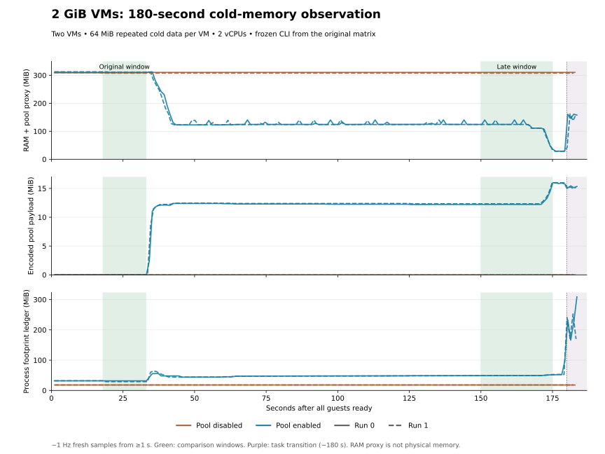
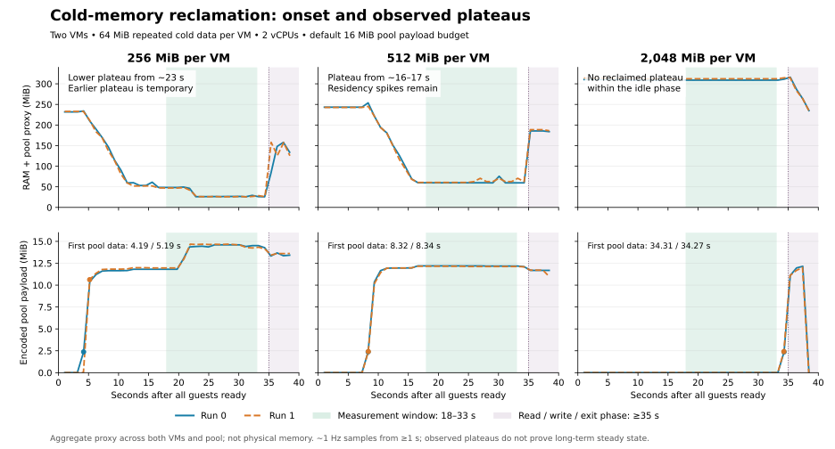

# VM memory performance: technical evidence

> CLI update: the standalone `pvisor snapshot` entry is removed. Old interfaces/measurements below belong to their historical artifacts, not current executable instructions. See [CLI reference](../reference/cli.md) for current entries and capability boundaries.


[Main conclusions](#conclusions) · [Motivation](#motivation) · [Experiment design](#experiment-design) · [Experimental data](#experiment-data) · [Analysis and usage guidance](#analysis) · [Mechanism design](memory-sharing/index.md)

This article records the benefits and costs of idle VM memory reclamation, subsequent access and complete snapshot restoration. Measurements from 2026-10-03 cover shared cold-page reclamation on macOS ARM64 / HVF, and pause/resume, raw/compressed offload and complete snapshots on Linux x86_64 / KVM. Each dataset specifies its environment, workload and timing boundaries; raw records are retained by platform.

## 1. Main conclusions {#conclusions}

**The macOS/HVF pool reclaims cold RAM at 256 MiB, 512 MiB and 2 GiB capacities.** The pool suits repeated compressible data with long idle periods. Latency-sensitive and short tasks should prefer leaving it disabled. The main 2 GiB conclusion uses the sustained 60–90 second window; short terminal lows remain descriptive evidence.

### macOS/HVF: shared cold-page core measurements {#measurements}

The **RAM proxy** combines resident guest RAM, pending reclamation, temporary snapshots and encoded pool data to track cold-page reclamation. It is not whole-host physical memory. Each row aggregates two VMs with 2 vCPUs each, the default pool budget and the same repeated cold data.

| Configured memory per VM | Observation time after all guests ready | RAM proxy: pool off → on | Approximate reduction |
|---|---|---|---|
| 256 MiB | 18–33 seconds | 231 → 27 MiB | **89%** |
| 512 MiB | 18–33 seconds | 243 → 61 MiB | **75%** |
| 2 GiB | 60–90 seconds | 309 → 124 MiB | **60%** |

Capacities need different reclamation times. These rows show observed benefits, not a ranking at equal task duration. Values are rounded for readability; [results](#experiment-data) retain exact measurements, paired ranges and other configurations.

**Costs to account for:** in the extended 2 GiB experiment, the first complete 64 MiB read increases from about 20 ms to 164 ms, with additional CPU consumption over the run. macOS footprint ledgers also increase. Cold RAM residency reduction is established, while whole-host physical-memory or pressure improvements remain unproven. See [access costs](#performance) and [physical accounting](#physical) for the evidence.

### Linux: explicit offload and complete snapshots {#linux-summary}

At 256 MiB / 2 vCPU / raw, pause P50 is **0.24 ms** and offload is **22.98 ms**. Complete snapshot save is **712 ms**, with restoration to guest heartbeat at **933 ms**. Compression reduces disk allocation while increasing save and restore time. [Lifecycle distributions](#linux-lifecycle) and [complete snapshot results](#linux-snapshot) include all configurations, P95 and correctness checks.

The shared cold-page pager currently requires macOS/ARM64. Linux offload explicitly pauses and flushes RAM; complete snapshots also capture CPU, device and filesystem state. Interpret these figures separately from automatic cold-page reclamation above. macOS CLI startup measurements remain in [startup latency](../benchmarks/startup.md).

## 2. Motivation: why measure cold memory {#motivation}

Configured VM capacity, current RAM residency, process footprint and whole-host physical pressure answer different questions. For allocated data that stays idle, pVisor's experimental host path observes cold pages, compresses and shares their content in a same-node pool, then restores private RAM on access. Both reclamation and restoration need measurement.

A single idle reading cannot characterize this path. Scan time grows with guest address capacity, so a short window can end before reclamation starts; later accesses can interrupt a low endpoint. The experiments therefore compare parameters, timelines and restoration costs, recording footprint and host pressure separately.

This run tests mechanism effectiveness for a controlled workload and conditions worth evaluating further. End-to-end agent benefits, additional instance capacity and whole-host physical savings require their own evidence.

## 3. Experiment design {#experiment-design}

### macOS/HVF: shared cold-page experiment scope {#scope}

Run on 2026-10-03 after freezing a build snapshot, using the real `pvisor run` and
`pvisor-memory-pool`, built and signed by `just build release`. Historical SDK
fixture results do not substitute for CLI measurements. Each VM runs the same
static Linux program and actually allocates and accesses 64 MiB of data. This
is a controlled memory-mechanism workload, not an end-to-end benchmark of
Ubuntu, Python agents, LLM inference, or project compilation. Image downloads,
builds, and rootfs preparation are outside the execution samples.

| Environment | Conditions |
|---|---|
| Host | Apple M4, 24 GiB RAM; macOS 27.0.1 / 26A434 |
| pVisor | 0.3.0; commit, runtime worktree sources, and signed executable SHA-256 recorded |
| VM backend | Locally patched libkrun / krun-hvf 1.19.3; HVF |
| Firmware | Existing libkrunfw 5.5.0 cache; actual dylib SHA-256 recorded |
| Guest program | Rust 1.98.0, aarch64 Linux musl, optimization level 2 |
| Host pages | 16 KiB; pager blocks 64 KiB |
| Observation | Process and host samples every second; experimental diagnostics enabled equally for successful cases |
| Pressure control | No additional pressure allocator; record actual pressure levels and stop at critical |

Measurements target the build snapshot fixed for this run. Later source changes or rebuilds from concurrent work do not enter the dataset. Evidence retains binary hashes, the build-time runtime worktree diff, and experiment source files; this report does not validate all subsequent code.

### macOS/HVF: what the two cold-page datasets answer {#datasets}

| Dataset | Runs | Question | Main observation windows |
|---|---:|---|---|
| 35-second parameter matrix | 40 | How parameters and workloads affect reclamation and restoration at equal task duration | 18–33 seconds after ready |
| Extended 2 GiB observation | 4 | Whether larger VMs continue reclaiming after scanning starts | 60–90, 120–150 and 150–175 seconds after ready |

Both use the same frozen CLI, pool and firmware; they do not combine into one savings percentage. The 175–178 second endpoint was added descriptively after inspecting the first curve, with only three samples per case. It does not replace predefined windows or steady-state acceptance. The overview rounds representative results; complete evidence retains original precision.

### Parameter and workload matrix {#design-matrix}

Each configuration compares the pool disabled and enabled, twice. The second
repetition reverses paired order. The formal plan is 10 configurations, 20
pairs, and 40 successful cases. Two repetitions cannot support reliable
across-run p95/p99 or confidence intervals. Preserve paired ranges; multiple
one-second samples are not independent experimental repetitions.

| Variable | Settings |
|---|---|
| Memory per VM | `--memory 256MiB` / `512MiB` / `2048MiB` |
| vCPU | `--cpu 1` / `2` |
| VM count | One / two simultaneous VMs; the latter share one pool |
| Shared pool | Unset / `--vm-memory-pool SOCKET` |
| Pool payload limit | Default 16 MiB / `--max-bytes 1048576` |
| RAM file | Automatic temporary backing / `--vm-ram-backing FILE` |
| Repeated cold data | 64 MiB periodic byte sequence, initially identical in both VMs |
| Random cold data | Independently seeded xorshift content per VM; no compressibility or sharing assumption |
| Hot data | Scan every 4 KiB page every 50 ms, using a compiler barrier to prevent eliminated reads |
| Network | Same cold data plus OverlayNet TCP loopback echo; three checked 32 MiB bursts per VM |

Use seconds 18–33 after all guests become ready as the fixed observation
window. A common time window **does not guarantee steady state**; scanning
and reclamation may still be progressing in larger VMs. Then read and check
all 64 MiB three times, two seconds apart, retaining first and subsequent
access times. Later reads can trigger renewed cold restoration and are not
automatically “warm reads.”

The main checksum workload is single-threaded. The 1 / 2 vCPU comparison covers these settings and this workload, not CPU scalability of multithreaded applications. First-read times take a median across VMs, then across two runs; ratios are calculated per pair and can differ from dividing aggregated times.

This run compares **startup behavior at the same task duration**, not steady state across all capacities. The 2 GiB configuration had zero pool payload within the window, with its first nonzero sample about 34.3 seconds after ready. The [results page](#scan-startup) gives the scan mechanism, timing evidence and requirements for subsequent steady-state measurements.

### Memory, pressure, and performance metrics {#metrics}

| Metric | Calculation / scope | What it does not establish |
|---|---|---|
| RAM plus pool proxy | Runner RAM residency diagnostics + pending file reclamation + staging snapshots + encoded pool payload | Not all process memory or unique host physical pages; not all metadata |
| Process-group footprint ledger | Sum native `proc_pid_rusage` footprint for CLI processes, runners, and pool | File-cache and shared accounting differs from the RAM proxy; they are not substitutes |
| Process-group RSS sum | Sum resident size for the same processes | Shared pages may count repeatedly; not unique physical memory |
| Host pressure | `kern.memorystatus_vm_pressure_level`: 1 NORMAL / 2 WARN / 4 critical | Pressure is not caused only by pVisor |
| Host compressor | `vm_stat` occupied pages × actual page size | Stored pages are logical uncompressed pages, not physical occupancy |
| Swap change | Host swap-used difference between first and last case samples | Cannot be attributed directly to this configuration |
| CPU seconds | Native counters for CLI processes + runners + pool, converted with Mach timebase | Sampling can miss exit tails; excludes the Python observer |
| First read | Guest checksum over all 64 MiB | Not a single-page fault or general shell-command latency |
| Maintenance barrier | Sum of barrier calls for each two-phase iteration; retain per-run P95 and maximum | Excludes publication outside barriers; not total access latency |
| Maximum cold restore | Pager's maximum single-block restore time | Not full restoration time for all 64 MiB |

Raw CPU values must not be treated directly as nanoseconds. This machine's
Mach timebase is 125/3, checked against `time.process_time()` with a short
owned CPU workload. The kernel field assignment is in
[Apple XNU `fill_task_rusage`](https://github.com/apple-oss-distributions/xnu/blob/main/osfmk/kern/bsd_kern.c).
Formal records retain raw ticks, converted ns, and the calibration ratio.

Calculate savings as `1 - pool / baseline` for each pair, then summarize the
two pairs. Within-run P95 comes from that run's maintenance events. Summaries
of two runs' P95 values are not the pooled event P95. Retain medians, sampled
maxima, first wakeups, and restore peaks instead of showing only quiet-period
best results.

Barrier metrics measure wall time of both calls, including possible scheduling and waiting; they are not exact accumulated vCPU stopped time. Single / dual VMs also change each VM's share of the common budget, preventing independent attribution of deduplication benefits.

One-second observations are not atomic across processes: RAM diagnostics, pool payload, and host counters have sampling skew. RAM records must be available and no more than three seconds old. Peaks are observed sample or logged-event maxima, not hard bounds for unobserved intervals.

### Limits and stop conditions {#experiment-limits}

Other applications share this host; background load was not isolated. Host
compressor, swap, and pressure changes describe environment and stop
conditions. This run does not pass full physical-memory acceptance. Two
repetitions also cannot establish long-term stability, application coverage,
or a production SLA.

Stop at critical pressure, at least 2 GiB swap growth from the run's initial
snapshot, or less than 4 GiB free disk. No other applications were closed,
administrator password requested, macFUSE automatically enabled, or existing
physical-memory acceptance threshold lowered.

Pairs run sequentially on one host, but pressure levels and background load are not guaranteed identical. The pressure table exposes each mode and repetition; this is not a causal pressure experiment on an isolated host.

### Reproduce {#reproduce}

Set the existing firmware directory first. The output directory must not
exist, preserving historical data. This command requires Apple Silicon macOS
with usable HVF and permission for host sockets and Hypervisor execution.

```bash
just build release
FIRMWARE_DIR=/path/to/pvisor/firmware/5.5.0/macos-aarch64
EXPERIMENT_BIN=$(mktemp -d /tmp/pvisor-memory-bin.XXXXXX)
cp target/release/pvisor target/release/pvisor-memory-pool "$EXPERIMENT_BIN/"
codesign --verify --strict "$EXPERIMENT_BIN/pvisor"
python3 tools/experiments/macos-memory/cli_decision_matrix.py \
  --firmware "$FIRMWARE_DIR" \
  --binary-dir "$EXPERIMENT_BIN" \
  --output target/memory-cli-matrix-new \
  --repeats 2
```

Raw data uses the separate `pvisor-memory-cli-matrix/v1` schema, not the
existing host microbenchmark's `pvisor-benchmark/v1`. Every case retains full
arguments, stdout, stderr, process identities and clock counters, host
`vm_stat`, pool statistics, and validation results. The summarizer rechecks
pairs, input contents, CPU units, RAM proxies, and reference reclamation.
Failed cases remain in their original directories and are excluded from
successful performance comparisons.

Copy signed executables to isolate concurrent builds. Formal cases check CLI SHA-256 at startup and exit; every pair must match the single digest recorded by the matrix. Do not keep launching samples from a `target/release` directory that another build may replace.

### Reproducing the extended 2 GiB observation {#long-idle-reproduce}

Use the same frozen executables in a separate output directory, retaining two pairs and reversed order. The default remains 35 seconds; the follow-up only extends waiting and matching timeouts. Replace the executable, firmware and output paths below. The [results page](#long-idle-2048) separates predefined windows from the descriptive endpoint.

```bash
python3 tools/experiments/macos-memory/cli_decision_matrix.py \
  --binary-dir /path/to/frozen-binaries \
  --firmware /path/to/firmware \
  --output /path/to/evidence/cases \
  --only cold-2048-dual --idle-seconds 180 --repeats 2
python3 tools/experiments/macos-memory/long_idle_report.py /path/to/evidence
```

### Linux/KVM: lifecycle and complete snapshot experiment design {#linux-methodology}

On 2026-10-03, AMD Ryzen 7 9700X / Linux KVM tests covered pause/resume, RAM offload, compressed backing and complete VM snapshots. All 413 targeted Rust tests passed; Python had 64 passes and 16 skips; six documented VM black-box cases passed (execution PASS; review state UNREVIEWED). All 180 measured lifecycle cycles passed guest RAM integrity checks.

The static musl release artifact also passed raw/compressed private-fork smoke checks, recorded separately from GNU performance distributions.

Complete snapshots use the independent `pvisor snapshot` entry point. Each of 10 measured runs per raw/compressed format stopped the source VM, deleted its source directories, then restored two private forks. All passed. This does not establish support for ordinary Job `checkpoint --kind execution`. The shared cold-page pager currently requires macOS/ARM64 and Linux rejects `vm.memory_pool`; this host validated the cross-process pool protocol, without establishing HVF physical memory savings.

| Item | Conditions |
|---|---|
| Host | AMD Ryzen 7 9700X, 8 cores / 16 threads, approximately 30 GiB total usable RAM |
| System | Fedora; Linux 7.2.8-200.fc44.x86_64; KVM and FUSE |
| Artifacts | Release builds; uncommitted and concurrent workspace edits; binary SHA-256 in raw reports defines the measured version |
| RAM files | Sparse files on local disk; FUSE compression measured separately |
| Lifecycle workload | Python guest, SHA-256 checks of 64 MiB fixed data, 1 MiB mutable data and a heartbeat |
| Lifecycle samples | 3 warmups and 30 measured cycles per configuration; 1/2/4 vCPU, 256/512/2048 MiB; repeated within one VM |
| Snapshot workload | Static musl guest; 64 MiB data, RAM counter, open file and directory cursor, initialization allowed exactly once |
| Snapshot samples | 2 warmups and 10 measured runs per format; 2 vCPU / 256 MiB; fresh source and two restored forks per run |

P50/P95 use linear interpolation over measured samples. Restore timings first take the median of each run's two forks, then summarize 10 independent runs; the forks are not treated as 20 independent repetitions. The sample size supports local descriptions, without a robust cross-host P99 or confidence interval. Host caches were warm and ordinary background workloads were present.

## 4. Experimental data {#experiment-data}

<a id="validity"></a>

The macOS shared cold-page matrix contains 40 runs, with four additional extended 2 GiB runs. All successful runs pass three content checks, private mutation checks and exit reference cleanup. Both datasets use the same frozen CLI, pool and firmware; they remain separate rather than combining into one savings percentage. Expand the exact tables below; original data is retained.

### 2 GiB: observing the full reclamation process {#long-idle-2048}

On the same frozen version, idle observation extends from 35 to 180 seconds. Each VM still owns 64 MiB of repeated cold data: two VMs, 2 vCPUs and the default 16 MiB pool budget. Two pairs reverse order, keeping observation duration separate from configuration changes.

**The sustained-window result is about 60% lower RAM proxy: approximately 309 MiB off and 124 MiB on.** These are samples from seconds 60–90 after ready, with similar results in both pairs. Before roughly 34 seconds, scanning is still starting, explaining negligible reclamation in the original short window.



Top: RAM proxy; middle: encoded pool data; bottom: footprint. Solid / dashed lines show both repetitions. Another decline occurs near three minutes, followed by a RAM increase on reading. Exact short-endpoint readings remain below, but last only seconds and do not establish steady state. See [performance](#performance) for first-access and CPU costs and [physical accounting](#physical) for footprint increases.

??? note "Exact window data (including startup and descriptive endpoint)"

    | Window after ready (seconds) | RAM proxy MiB off / on | Median paired savings (range) | Footprint ledger MiB off / on |
    |---|---|---|---|
    | 18–33 | 309.0 / 310.1 | -0.3% (-1.1–0.4%) | 18.0 / 30.4 |
    | 60–90 | 309.0 / 124.2 | 59.8% (59.7–59.9%) | 18.0 / 47.2 |
    | 120–150 | 309.0 / 124.5 | 59.7% (59.6–59.8%) | 18.0 / 48.7 |
    | 150–175 | 309.0 / 124.4 | 59.7% (59.6–59.9%) | 18.0 / 49.1 |
    | 175–178* | 309.0 / 28.6 | 90.7% (90.7–90.8%) | 18.0 / 52.3 |

??? note "Window accounting, restoration costs and plateau criteria"

    Each case uses the median within a window, followed by aggregation across the two pairs. Ranges are not confidence intervals. The starred 175–178 second interval is a descriptive endpoint added after inspecting the first run, with only a few samples per case; it is neither a predefined window nor steady-state evidence. Samples require diagnostics from both runners no more than three seconds old. Restoration and exit after 180 seconds do not measure idle savings. RAM proxy includes resident RAM, pending file reclamation, temporary snapshots and pool payload. Footprint is a separate ledger and cannot substitute for it.

    **The 2 GiB configuration substantially reduces RAM residency for this workload too.** Both runs begin publishing cold pages around 34 seconds. At 60–90 seconds, proxy memory falls from about 309 MiB with the pool disabled to about 124 MiB enabled, yielding 59.7%–59.9% paired savings. Another decline occurs around 166–176 seconds; the descriptive 175–178 second endpoint is about 28.6 MiB, with roughly 90.7% paired savings. The intermediate plateau has transient increases, and the lower terminal plateau is observed for only a few seconds. **Neither run passes the full predefined plateau criterion; final steady-state time remains unknown.** These curves establish reclamation for this workload, not the same savings for arbitrary 2 GiB applications.

    Costs: whole-run sampled CPU is about 23.6 / 40.2 seconds off / on, with 15.9–17.2 seconds of paired additional CPU. The first 64 MiB read takes about 20.3 / 164.1 ms, or 7.3–8.8 times longer per pair. Terminal footprint ledgers are about 18.0 / 52.3 MiB, still roughly 190% higher. Pool payload approaches the 16 MiB budget, with 30 / 25 whole-run capacity rejections; content checks and exit reference cleanup all pass. Host pressure remains WARN in all four runs without triggering stop guards. Other applications affect whole-host compressor and swap readings, so this follow-up does not prove improved physical-memory pressure. Diagnostics are enabled in both groups and their CPU overhead is included.

    Predefined plateau criteria: at least 25 valid samples per 30-second window; RAM proxy span at most max(4 MiB, 10% of the median); nonzero pool payload with span at most 10% of its median; absolute least-squares RAM trend at most 1 MiB per 30 seconds. Plateau onset also requires every subsequent complete rolling window through 175 seconds to meet those criteria. These criteria describe this experiment, not production steady state.

[Full timeline CSV](../benchmarks/vm-memory/assets/2048-long-idle.csv) · [Independent verification JSON](../benchmarks/vm-memory/assets/2048-long-idle.json). Raw runs, the predefined protocol, source snapshots and input hashes are in `review_project/06-evidence/macos-memory/cli-2048-long-idle-2026-10-03/`, with runs under `cases/`. Binary source provenance remains the original matrix's `input-provenance.json`; follow-up working-tree hashes do not establish the frozen executable's source.

### How parameters affect benefits {#matrix}

Repeated cold data provides the clearest benefits under the default budget. Continuously accessed data, independent random content and smaller pool budgets reduce reclamation. Explicit RAM files perform similarly to default backing; the file option does not itself add compression or sharing. Single-VM benefits include cold compression and cannot all be attributed to cross-VM deduplication.

The original matrix compares seconds 18–33 after ready to observe behavior at equal task duration. The 2 GiB profile has not begun publishing cold pages in that window. Near-zero savings there do not contradict the longer experiment above: short tasks and long idle tasks answer different usage questions.

??? note "Full 35-second parameter matrix and paired ranges"

    | Profile | RAM proxy MiB off / on | Proxy saved | Added CPU seconds | First read ms off / on |
    |---|---|---|---|---|
    | cold-2048-dual | 311.7 / 310.6 | 0.4% | +0.89 | 24.4 / 15.6 |
    | cold-256-cpu1 | 224.1 / 25.2 | 88.8% | +3.94 | 19.7 / 184.1 |
    | cold-256-dual | 231.4 / 26.5 | 88.6% | +4.69 | 23.3 / 176.9 |
    | cold-256-file | 232.0 / 26.1 | 88.7% | +3.66 | 18.4 / 181.3 |
    | cold-256-pool1 | 231.5 / 201.1 | 13.1% | +3.57 | 28.5 / 31.7 |
    | cold-256-single | 115.6 / 19.1 | 83.5% | +2.34 | 18.5 / 189.8 |
    | cold-512-dual | 242.8 / 60.7 | 75.0% | +5.12 | 22.1 / 168.9 |
    | hot-256-dual | 230.1 / 155.7 | 32.4% | +2.55 | 9.1 / 5.5 |
    | network-256-dual | 231.7 / 26.3 | 88.6% | +3.83 | 24.7 / 183.5 |
    | random-256-dual | 230.9 / 187.4 | 18.8% | +3.61 | 22.4 / 26.4 |

    | Profile | Paired savings range | Window sampled-max savings | Max cross-session objects | Max rejection counter |
    |---|---|---|---|---|
    | cold-2048-dual | -0.6–1.3% | 0.6% | 256 | 0 |
    | cold-256-cpu1 | 88.8–88.8% | 76.6% | 597 | 0 |
    | cold-256-dual | 88.5–88.6% | 78.9% | 596 | 0 |
    | cold-256-file | 88.7–88.8% | 74.9% | 583 | 0 |
    | cold-256-pool1 | 12.7–13.5% | 12.7% | 44 | 2173 |
    | cold-256-single | 83.5–83.5% | 74.0% | 0 | 0 |
    | cold-512-dual | 74.7–75.3% | 69.9% | 506 | 0 |
    | hot-256-dual | 32.0–32.7% | 30.1% | 525 | 0 |
    | network-256-dual | 88.5–88.7% | 78.0% | 598 | 0 |
    | random-256-dual | 15.5–22.1% | 15.2% | 254 | 1734 |

    Case memory is the median of samples 18–33 seconds after all guests are ready; these tables then summarize two pairs. The range is not a confidence interval. “Sampled maximum savings” remains within this window, not the whole-run peak from startup through exit. Cross-session objects establish reuse, not its independent contribution to savings.

### Linux/KVM: pause/resume and offload {#linux-lifecycle}

Milliseconds, **P50 / P95** in each cell. SDK timings run from invocation to host acknowledgement and include control exchange and event persistence. Offload pauses, flushes and requests RAM reclamation; explicit resume follows.

| MiB / vCPU / backing | pause | resume | offload | offload resume | heartbeat |
|---|---:|---:|---:|---:|---:|
| 256 / 1 / raw | 0.24 / 0.30 | 0.26 / 0.34 | 20.43 / 21.76 | 0.28 / 0.37 | 49.57 / 51.92 |
| 256 / 2 / raw | 0.24 / 0.31 | 0.29 / 0.35 | 22.98 / 24.90 | 0.29 / 0.40 | 46.79 / 49.83 |
| 256 / 4 / raw | 0.25 / 0.36 | 0.27 / 0.35 | 22.93 / 25.60 | 0.29 / 0.35 | 43.61 / 46.87 |
| 512 / 2 / raw | 0.24 / 0.31 | 0.28 / 0.35 | 26.44 / 29.35 | 0.28 / 0.39 | 44.63 / 46.74 |
| 2048 / 2 / raw | 0.21 / 0.27 | 0.23 / 0.31 | 23.86 / 28.80 | 0.26 / 0.32 | 40.39 / 46.71 |
| 256 / 2 / compressed | 0.21 / 0.33 | 0.25 / 0.40 | 66.93 / 505.43 | 0.24 / 0.31 | 175.09 / 203.24 |

`offload resume` ends when the control call returns; `heartbeat` ends at the first guest progress after that call began. They measure different readiness boundaries.

| MiB / vCPU / backing | 64 MiB read before offload (ms) | First complete read after offload (ms) | Backing allocation (MiB, P50) |
|---|---:|---:|---:|
| 256 / 1 / raw | 32.12 / 32.31 | 109.02 / 111.56 | 200.80 |
| 256 / 2 / raw | 32.12 / 32.37 | 109.49 / 110.84 | 202.23 |
| 256 / 4 / raw | 32.10 / 32.93 | 114.85 / 117.64 | 203.99 |
| 512 / 2 / raw | 32.15 / 32.48 | 115.15 / 117.42 | 206.30 |
| 2048 / 2 / raw | 25.03 / 31.91 | 86.12 / 109.30 | 235.91 |
| 256 / 2 / compressed | 25.06 / 27.64 | 698.71 / 754.50 | 23.96 |

Configured capacity is not the number of dirty workload bytes. The 2 GiB guest still allocates the same 64 MiB data, so this is not throughput for flushing 2 GiB of dirty RAM. The backing inventory exceeds configured capacity by approximately 36.4 MiB, including low-address memory and a separate kernel region.

Immediate post-offload mincore samples were zero in every configuration. This establishes a reduction in that file-backed mapping's sampled residency, without establishing whole-host physical memory reduction or zero process RSS. Reading again brings pages back. Compression uses less disk space but increases the first complete read and tail latency.

A separate real guest check paused for 60 seconds: its heartbeat stopped and its SHA-256 and mutable data survived resume. Initial measurements overlapped diagnostic work; they remain correctness and raw evidence. The headline 2-vCPU timings use a later sequential run.

### Linux/KVM: complete checkpoint save and private forks {#linux-snapshot}

`save` includes CLI startup, vCPU/device freeze, CPU/device/RAM capture, filesystem copy, validation, durable publication and source runner exit. `restore heartbeat` spans a new CLI invocation through the first resumed guest heartbeat, including compatibility checks, RAM decode/validation and private filesystem copy. It is not a register-only restore timing.

| RAM storage | save (ms, P50 / P95) | restore heartbeat (ms, P50 / P95) | Published allocation (MiB, P50 / P95) |
|---|---:|---:|---:|
| raw | 712.11 / 819.75 | 932.88 / 1034.90 | 296.99 / 296.99 |
| compressed | 1236.62 / 1343.63 | 1920.23 / 1947.43 | 16.48 / 16.58 |

Disk allocation sums `st_blocks × 512` for files under one published object. It excludes active forks, temporary artifacts and process memory, and does not measure cold-page pool savings. The guest data is repetitive and compressible; arbitrary Agents may have different compression ratios.

Each run checks that restoration survives source VM exit and source rootfs deletion, guest initialization is not repeated, the 64 MiB data and mutable counter continue, the open file offset remains 2, directory iteration continues, and fork0 writes leave fork1 and the published object intact. Storage tests also cover corruption, truncation, missing blocks, incompatible restore, block sharing between snapshots and collection after the last reference.

This run repaired Linux build/platform issues, missing KVM clock/interrupt-controller and PIO state, and the missing private kernel RAM region on restore. Host requests now publish atomically, preventing empty requests during truncate/write. Failed diagnostic runs remain under local `target/local-vm-validation-20261003/` and do not contribute to the tables.

## 5. Analysis and usage guidance {#analysis}

The following analysis covers the macOS/HVF shared cold-page experiment. Linux offload first reads, compression costs and complete snapshot restoration are covered in the [lifecycle](#linux-lifecycle) and [snapshot](#linux-snapshot) sections.

Reclamation, waiting time and first-access costs jointly determine fit. The following sections explain costs and memory accounting, then scan behavior and capacity timelines, followed by opt-in instructions and verification.

### Usage costs: first access and CPU {#performance}

Reclaimed data must be restored. In the extended 2 GiB experiment, the first complete 64 MiB read increases from about 20 ms to 164 ms. It is 7.3–8.8 times slower per pair, with 15.9–17.2 seconds of additional whole-run sampled CPU. Latency-sensitive tasks should consider this cost before enabling the pool. This is neither single-page fault latency nor end-to-end latency for a typical shell command.

The original short-window 2 GiB run has not reclaimed the same amount of data, so its first read does not exercise equivalent cold restoration. Faster readings there do not establish pool acceleration. Faster hot-access and network echo results describe those controlled measurements, not general acceleration.

??? note "Original 35-second performance data and accounting"

    | Profile | CPU seconds off / on | First-read ratio | Repeated read ms off / on | Barrier P95 / max ms | Max block restore ms | Network burst time ratio / range |
    |---|---|---|---|---|---|---|
    | cold-2048-dual | 5.76 / 6.65 | 0.7× | 7.4 / 12.9 | 49.91 / 60.71 | 0.29 | — |
    | cold-256-cpu1 | 1.80 / 5.74 | 9.4× | 5.3 / 63.4 | 3.28 / 52.60 | 15.62 | — |
    | cold-256-dual | 1.90 / 6.59 | 7.6× | 8.3 / 54.3 | 3.58 / 14.80 | 4.72 | — |
    | cold-256-file | 2.06 / 5.72 | 11.2× | 6.2 / 57.8 | 7.51 / 99.05 | 18.23 | — |
    | cold-256-pool1 | 1.93 / 5.50 | 1.1× | 4.6 / 13.5 | 3.12 / 25.82 | 1.04 | — |
    | cold-256-single | 0.96 / 3.30 | 10.8× | 8.0 / 68.1 | 3.02 / 6.21 | 14.71 | — |
    | cold-512-dual | 2.63 / 7.75 | 7.9× | 6.5 / 7.5 | 3.71 / 17.02 | 10.18 | — |
    | hot-256-dual | 2.49 / 5.04 | 0.6× | 7.5 / 49.3 | 3.09 / 24.75 | 14.07 | — |
    | network-256-dual | 5.06 / 8.89 | 8.6× | 5.7 / 68.6 | 3.33 / 13.35 | 10.67 | 0.58× (0.50–0.66) |
    | random-256-dual | 2.17 / 5.79 | 1.2× | 7.0 / 12.9 | 3.23 / 34.27 | 23.17 | — |

    CPU sums native counters for CLI, runners, and pool, converted through Mach timebase, including startup and execution. One-second sampling can miss exit tails. It is not total host CPU and excludes the observer. The first read verifies all 64 MiB; later reads are separated by two seconds and may restore cold data again, so they are repeated reads rather than guaranteed warm reads. Barrier P95 is the within-run event P95 of the sum of both barrier calls, then summarized across two runs; publication outside barriers is excluded. Maximum restoration measures one 64 KiB block.

    The network configuration sends data through OverlayNet to a host loopback echo service. Every VM opens three connections, each verifying 32 MiB of returned content. This covers TCP echo, not DNS, Gateway / LLM, UDP, or Internet throughput. Its loopback rule explicitly enables allowlist and `allow_private_ips=true`, keeping authorization failures out of throughput measurements.

    Hot sweeping continues only during the 35-second observation phase and stops before verification. The first read can retain hot state while subsequent reads, two seconds apart, can become cold again. A faster first hot read does not establish accelerated computation from the pool. Network ratios describe only these paired echo runs and do not establish general network acceleration.

### Residency reduction and physical accounting {#physical}

RAM proxy answers whether cold guest RAM has been reclaimed; footprint reflects a different macOS process ledger. File and shared pages have different attribution, while the pool, snapshots and metadata add costs. These metrics cannot substitute for each other or be subtracted to obtain net physical benefits.

At the extended 2 GiB endpoint, RAM proxy is about 309 / 29 MiB off / on, while footprint is about 18 / 52 MiB. **Residency reclamation works, but footprint does not fall with it.** The original matrix also shows footprint increases, so this report promises neither whole-host physical savings nor additional instance capacity. The overview curve displays both outcomes.

Other host applications influence pressure, compressor occupancy and swap. These provide environmental records and stop guards; their changes cannot be attributed to a VM alone. All four extended runs remain at WARN without triggering stop guards. Improved physical pressure still requires independent verification.

??? note "Complete footprint, RSS and host environment records"

    | Profile | Footprint MiB off / on | Footprint change | RSS MiB off / on | Whole-run sampled-max footprint MiB off / on |
    |---|---|---|---|---|
    | cold-2048-dual | 18.0 / 31.9 | +77.7% | 440.7 / 260.0 | 18.0 / 71.5 |
    | cold-256-cpu1 | 17.7 / 50.3 | +185.0% | 343.2 / 135.9 | 17.7 / 228.4 |
    | cold-256-dual | 17.9 / 47.7 | +166.2% | 356.3 / 148.2 | 17.9 / 206.9 |
    | cold-256-file | 17.9 / 41.1 | +129.3% | 361.6 / 149.0 | 17.9 / 214.3 |
    | cold-256-pool1 | 18.0 / 24.3 | +34.9% | 361.6 / 325.1 | 18.0 / 42.8 |
    | cold-256-single | 8.9 / 35.9 | +301.8% | 177.7 / 85.2 | 8.9 / 145.2 |
    | cold-512-dual | 18.0 / 47.2 | +161.3% | 372.6 / 157.4 | 18.0 / 298.3 |
    | hot-256-dual | 18.0 / 40.5 | +125.3% | 360.2 / 282.4 | 18.0 / 108.3 |
    | network-256-dual | 17.9 / 40.3 | +124.5% | 362.1 / 149.6 | 19.4 / 288.7 |
    | random-256-dual | 17.9 / 40.9 | +128.5% | 360.4 / 313.0 | 17.9 / 56.5 |

    | Profile | Pool | Pressure r0 / r1 | Swap change MiB r0 / r1 | Physical compressor change MiB r0 / r1 |
    |---|---|---|---|---|
    | cold-2048-dual | off | NORMAL/NORMAL | +0.0/+0.0 | +73.9/-34.9 |
    | cold-2048-dual | on | NORMAL/NORMAL | +0.0/+0.0 | -115.8/+91.1 |
    | cold-256-cpu1 | off | NORMAL/NORMAL,WARN | +0.0/+0.0 | +322.8/-770.5 |
    | cold-256-cpu1 | on | NORMAL,WARN/NORMAL | -32.0/+0.0 | +465.8/+661.4 |
    | cold-256-dual | off | NORMAL/WARN | -24.0/+0.0 | -155.1/+517.9 |
    | cold-256-dual | on | NORMAL/WARN | +0.0/+0.0 | -9.0/-288.0 |
    | cold-256-file | off | WARN/WARN | +0.0/+0.0 | +189.1/-13.2 |
    | cold-256-file | on | WARN/WARN | +0.0/+0.0 | -675.0/-19.1 |
    | cold-256-pool1 | off | WARN/WARN | +0.0/+0.0 | +633.5/-21.8 |
    | cold-256-pool1 | on | WARN/WARN | +0.0/+0.0 | +353.4/-184.5 |
    | cold-256-single | off | NORMAL/NORMAL | +0.0/+0.0 | -9.2/+1036.7 |
    | cold-256-single | on | NORMAL/NORMAL | +0.0/+0.0 | +56.7/-54.2 |
    | cold-512-dual | off | NORMAL/NORMAL,WARN | -8.0/-8.1 | -122.2/-639.2 |
    | cold-512-dual | on | NORMAL/WARN | +0.0/+0.0 | -58.0/-167.7 |
    | hot-256-dual | off | WARN/WARN | +0.0/+0.0 | -66.1/-121.6 |
    | hot-256-dual | on | WARN/WARN | +0.0/+0.0 | +213.1/-245.7 |
    | network-256-dual | off | WARN/WARN | +0.0/+0.0 | -69.0/+189.8 |
    | network-256-dual | on | WARN/WARN | +0.0/+0.0 | -88.3/+296.0 |
    | random-256-dual | off | WARN/WARN | +0.0/+0.0 | -424.0/+23.1 |
    | random-256-dual | on | WARN/WARN | -24.0/+0.0 | +122.2/+670.3 |

    Separate three facts: RAM proxy reduction, whether process-group footprint falls in the same direction, and whether host pressure changes. These are different ledgers and cannot be added: RSS can count shared pages repeatedly, file-backed RAM footprint accounting differs from residency, and the host compressor includes other applications. In some cases compressor changes exceed 1 GiB, far beyond the 64 MiB × instance-count application dataset, preventing attribution to this VM configuration.

    The pressure table describes the actually observed pressure states and host endpoint changes; **it does not prove that the pool reduces physical pressure**. This run adds no pressure allocator and covers no critical phase. Earlier physical-attribution probes lacking administrator privileges are not recast as successes. These measurements cannot promise how many additional instances fit on this host or pass the original whole-physical-memory savings threshold.

### Scan startup and short-window results {#scan-startup}

**This measurement captures reclamation startup delay, not steady-state savings for a 2 GiB VM.** In both `cold-2048-dual` runs, encoded pool payload was zero throughout the 18–33 second window after ready. The first nonzero payload samples occurred at **34.31 and 34.27 seconds**, respectively. The window shows no observed pool reclamation benefit; paired savings range from −0.6% to 1.3%, so the summarized 0.4% is not a reliable benefit.

The experiment version's pager uses one sequential cursor: its first visit arms access observation; only after traversing the address space does it revisit still-cold blocks to snapshot, publish and reclaim them. The 200 ms threshold is a minimum observation period, not a guarantee of reclamation when that period expires. Blocks are 64 KiB, each iteration processes at most 256 blocks, and iterations sleep for 250 ms. Counting only these sleeps gives the theoretical first-pass durations below; scanning, synchronization and scheduling add overhead.

| Memory per VM | Blocks | Theoretical first-pass duration |
|---|---:|---:|
| 256 MiB | 4,096 | About 4 seconds |
| 512 MiB | 8,192 | About 8 seconds |
| 2,048 MiB | 32,768 | About 32 seconds |

Application data remains 64 MiB at every capacity. Enlarging the guest address capacity increases scanning work even when application residency stays the same. Whole-run encoded payload peaks were about 12 MiB in both 2 GiB runs, below the default 16 MiB budget, with zero capacity rejections. Scan scheduling is therefore the primary limitation here. Shared objects at the end of a run do not establish corresponding benefits inside the measurement window.

Follow-up measurements should report first reclamation time, startup savings and steady-state savings after longer idle periods separately. Establish steady state from stabilizing reclamation and residency, rather than simply choosing a later fixed window. First evaluate timely revisits of observation blocks whose threshold has elapsed, then consider scan quotas. Maintenance barrier P95 was 49.91 ms here, so larger batches may increase latency. **This run establishes neither final steady-state savings for 2 GiB VMs nor physical-memory benefits.**

Evidence comes from `cold-2048-dual-r{0,1}-pool/raw.json` in the frozen matrix: each run has 14 window samples, all with zero payload. Times denote the first nonzero samples and have approximately 1 Hz sampling resolution. Source locations are `Pager::sample` and the maintenance loop in `crates/pvisor/src/executor/vm/pager.rs`; see this page's evidence inventory for version provenance.

### When different capacities reach a plateau {#settling-time}

Existing records establish **reclamation onset and observed plateau times**, not steady-state times validated over a long duration. This comparison uses only the matched `cold-{256,512,2048}-dual` profiles: two VMs, 64 MiB of repeated cold data per VM, 2 vCPUs and the default pool budget. Times start when all guests are ready. RAM proxy is the aggregate of both runners and the pool, not physical memory per VM.

| Capacity per VM | First nonzero pool sample r0 / r1 | Observed plateau and timing | Steady-state evidence limit |
|---|---|---|---|
| 256 MiB | 4.19 / 5.19 seconds | Lower plateau near 26 MiB begins at 22.85 / 22.96 seconds; about 25.6–29.3 MiB thereafter until 35 seconds | Only about 12 seconds observed; long-term steady state is unproven |
| 512 MiB | 8.32 / 8.34 seconds | Plateau near 60 MiB begins at 16.61 / 16.57 seconds; about 59.6–75.6 MiB thereafter until 35 seconds | Intermittent residency increases prevent a strict stability claim |
| 2,048 MiB | 34.31 / 34.27 seconds | No post-reclamation plateau observed before 35 seconds | Idle phase ends too early; steady-state time is unknown |

The 256 MiB profile first falls to about 60 MiB at 11–12 seconds, then continues reclaiming and drops again around 21–23 seconds. Its first short plateau is not final steady state. The 512 MiB profile starts reclaiming later but reaches a roughly 60 MiB plateau earlier. This does not establish faster convergence to the same reclamation level in larger VMs: their observed final residency levels and scan progress differ.



Top panels show the aggregate RAM proxy across both VMs and the pool; bottom panels show encoded pool payload. Solid blue and dashed orange lines represent the two runs. Green marks the 18–33 second measurement window; purple marks reads, writes and exit after 35 seconds. Shared axis scales support comparison. Curves start at samples at least one second after ready, excluding lagging diagnostics immediately at ready. The 2 GiB payload remains zero throughout the green window; its final drop to zero occurs during exit and does not indicate completed reclamation.

[Download all six time series](../benchmarks/vm-memory/assets/startup-timeline.csv) to inspect intermediate plateaus and transient changes. Sampling is approximately 1 Hz; plateau times above are descriptive readings of the curves, not results from a predefined steady-state acceptance threshold. After 35 seconds, full reads, private writes and exit change the workload phase, so those samples cannot estimate idle steady state. Capacity-planning measurements need a longer idle phase, predefined bounds on RAM and pool occupancy variation over sustained windows, and confirmation that no downward trend remains. The original 35-second matrix contains no such long-duration measurements. The 180-second follow-up below extends observation but still does not establish final steady state.

### Choosing a configuration {#decisions}

| Scenario | Recommendation |
|---|---|
| Repeated compressible data with long idle periods | Trial the pool while measuring restoration latency and host pressure for your own tasks |
| 2 GiB or larger capacity | Allow longer scan time; a few dozen seconds cannot determine final benefit. Larger capacities remain unmeasured |
| Interactive or short tasks, continuously hot access | Prefer disabling the pool to avoid scan and restoration effects on responses |
| Random or incompressible content | Expect smaller benefits; first check application RAM needs and pool capacity |
| Single VM | Cold compression can help; single-instance benefits do not establish cross-VM deduplication |

Explicit RAM files do not inherently compress or share memory. FUSE-compressed RAM is a separate, mutually exclusive path with no performance data in this run.

### macOS/HVF: minimal opt-in {#usage}

In one terminal, create a new owner-private directory and start the service; if the directory already exists, choose a new path or verify its permissions. Keep Unix socket paths short.

```bash
mkdir -m 700 /tmp/pvisor-pool-demo
pvisor service memory-pool /tmp/pvisor-pool-demo/p
```

Run VMs in other terminals sharing the same socket. This rootfs image differs from the static guest measured here, so its actual benefits require separate measurement.

```bash
pvisor run --vm --memory 256MiB --cpu 2 \
  --vm-memory-pool /tmp/pvisor-pool-demo/p \
  --rootfs image=ubuntu:24.04 -- /bin/sh
```

Omit `--vm-memory-pool` to disable this experimental path. Do not stop the service before tasks finish: pool loss fails dependent VMs, and recovery after service restart is unsupported. The default 16 MiB budget limits encoded payload, not all physical memory used by the service. `--max-bytes 1048576` limits payload to 1 MiB and can increase capacity rejections.

`--vm-ram-backing FILE` requires a different, nonexistent file for each VM; it does not automatically share live RAM. `--vm-ram-compression` selects a separate FUSE path and cannot be combined with the pool.

### Usage boundaries {#limits}

Guest RAM must still cover application peaks. Validate first access, CPU, footprint, host pressure and swap for your workload. Lower cold residency does not establish how many additional instances a machine can run. Two pairs establish a direction for this workload, not long-term steady state, larger concurrency, real agent tasks or a production SLA.

For verification, consult [results and evidence](#experiment-data) for the full matrix, diagnostic ledgers and failure records, then reproduce with the [methodology](#reproduce).

### macOS/HVF: unsupported, failed, and uncovered combinations {#compatibility}

| Combination / condition | This run | User implication |
|---|---|---|
| `--vm-memory-pool` + `--vm-ram-compression` | Explicit rejection before VM initialization | Do not stack the two compression paths |
| `--cpu 0` / `--cpu 9` | Reject nonpositive CPU and more than 8 vCPUs respectively | Use 1–8; only 1 / 2 measured here |
| Missing pool socket | Explicit path-resolution failure | Start the owner-private same-UID service first |
| `--vm-ram-compression` alone | Performance unmeasured: an earlier environment check reported the macFUSE extension disabled | Neither zero savings nor a performance pass |
| Initial network arguments | Missing allowlist caused CLI rejection; after correction a two-connection fixture refused later connections | Both were experiment setup errors, corrected with failures retained and excluded from product performance samples |
| Initial echo summary check | Six separate connections succeeded, but the check expected two aggregated connections | Corrected and rerun; failed status was not changed to passed |
| Initial explicit RAM-file path | Relative output path was passed to a child with a different cwd; backing creation failed | Tool switched to absolute paths, retaining the failure and rerunning |
| Earlier matrix without frozen executables | Another build replaced the CLI; an HVF startup failed with errno 22, and replacement time per case is unavailable | All 26 successful measurements excluded from formal performance tables; rebuilt, froze signed executables, and checked hashes per case |
| Process sampling timeout in the fixed matrix | `ps` exceeded the initial 2-second limit; observer aborted the case | Failure retained and rerun with a bounded 5-second sampling timeout; coverage and pressure guards unchanged |
| Other hosts, higher concurrency, TOML / SDK performance, whole-VM offload combined with pool | Unmeasured here | Do not extrapolate compatibility or performance |

Earlier pilot issues with ready/read matching, long socket paths, and CPU units remain separate; uncalibrated pilot CPU values do not enter formal performance tables. Resume reuses only passed cases, verifies signed executables, firmware and runtime source hashes, retains earlier batch metadata, and keeps the original whole-run host guard reference.

### macOS/HVF: evidence and reproduction {#evidence}

[Download summary JSON](../benchmarks/vm-memory/assets/decision.json) · [Configuration CSV](../benchmarks/vm-memory/assets/decision.csv) · [Parameter-boundary JSON](../benchmarks/vm-memory/assets/compatibility.json)

| Object | Record |
|---|---|
| Executable pvisor | `37feeb598fec93ae088883c489bf13e0a1daa7dd9c1f5db60081e2ef391e4289` |
| Executable pvisor-memory-pool | `a6ef7d43509e98081cc8b1b1ebd4331175a4e9e9eef8fdf777bf16e6bd4d63ef` |
| libkrunfw SHA-256 | `d6010939236331445d2415152f7d1ffa9f3aed7d473dc410ea85b2943bdc6dca` |
| Initial source HEAD | `2b3cca8add4580a4d6a9175cd95aade96eb350d0` |
| Guest source SHA-256 | `239a82e7017aee968dbb8fc5b372db62a9450793cf11810614f9936829a6a00b` |

Observed pressure levels: [1, 2] (1=NORMAL, 2=WARN, 4=CRITICAL). Host swap at the first / last samples: 9.86 / 9.76 GiB. No pressure guard stopped this matrix.

Complete commands and logs live under repository directory `review_project/06-evidence/macos-memory/cli-decision-frozen-matrix-2026-10-03/`. Every case contains `raw.json` and each VM's stdout/stderr. The summary retains successful raw-record SHA-256 hashes, and failed directories are not overwritten. Historical experiments remain in the evidence parent directory and do not substitute for this run.

After the [reproduction command](#reproduce), use this read-only summarizer to recheck contents, pairing and accounting:

```bash
python3 tools/experiments/macos-memory/cli_decision_report.py \
  target/memory-cli-matrix-new/summary.json \
  --output target/memory-cli-report
```

### Linux/KVM: shared-pool protocol and validation boundaries {#linux-pool}

Two independent clients published identical 64 KiB content, received the same content ID and shared a 271-byte encoded payload. Per-session budget rejection, restore after peer disconnect, survival of another reference after release, and zero objects after final disconnect all passed. These checks cover compression, deduplication and reference lifetime; the Linux guest cold-page pager was not enabled.

macOS/HVF reclamation measurements are in this page's [shared cold-page results](#matrix). These Linux results apply to the named artifacts and workloads. The updated macOS implementation, cross-host/boot/build restore, active external connections and larger concurrency are outside this measurement's conclusions.

### Linux/KVM: reproduction and raw evidence {#linux-evidence}

```bash
just test pvisor pvisor-core pvisor-overlayfs pvisor-overlay-core
just test-py
just vm-cases
cargo build --release --locked -p pvisor --bin pvisor --example vm_lifecycle_bench

target/release/examples/vm_lifecycle_bench \
  --rootfs / --firmware /path/to/libkrunfw-directory \
  --output target/vm-lifecycle-new --memory 256 --cpus 2 \
  --samples 30 --warmups 3 --long-pause-seconds 60
# Add --compressed to measure FUSE-backed RAM compression.

rustc --target x86_64-unknown-linux-musl -C opt-level=2 \
  benchmark/pvisor/snapshot_guest.rs -o /tmp/snapshot-guest
python3 benchmark/pvisor/vm_snapshot.py \
  --output target/vm-snapshot-new --binary /path/to/archived/pvisor-with-snapshot \
  --guest /tmp/snapshot-guest --samples 10 --warmups 2
```

Supply a prepared guest rootfs and firmware directory. The complete snapshot benchmark requires a new output directory and copies the CLI to pin compatibility identity. It retains each private store, separate logs and correctness result. Source/artifact preparation and compilation are excluded from timings.

- [Per-cycle lifecycle data](../../assets/benchmarks/vm-lifecycle-20261003/lifecycle.tsv)
- [Snapshot samples and artifact digests](../../assets/benchmarks/vm-lifecycle-20261003/snapshot.tsv)
- [Environment, pool and validation results](../../assets/benchmarks/vm-lifecycle-20261003/validation.tsv)
