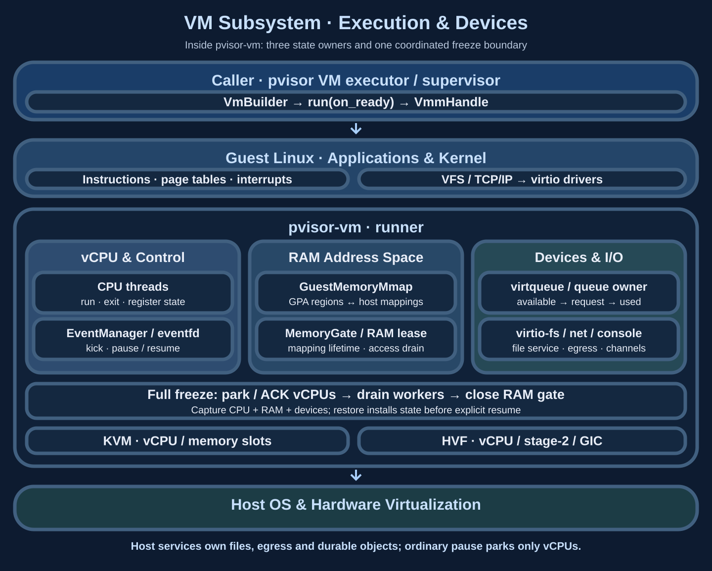

# VM subsystem: execution, devices and consistency

`pvisor-vm` manages guest CPUs, RAM and virtual devices within one lifecycle. Hardware virtualization executes guest instructions, host devices handle I/O, and control interfaces coordinate pausing, mapping maintenance and capture. The enclosing `pvisor` runtime supplies file trees, network egress, storage and runner supervision; VM internals determine when these operations can safely access machine state.

## Subsystem diagram and ownership {#architecture}

The three parallel state groups must remain alive together: vCPU threads own execution and registers, RAM mappings provide the guest address space, and device queues retain pending I/O. Platform backends connect them to Linux KVM or macOS Hypervisor.framework. A uniform Rust API does not imply identical capabilities across platforms.

| Owner | Retained state | Boundary |
| --- | --- | --- |
| Caller / supervisor | Runner process, host sandbox, supplied FDs, file/network services, storage leases | Preparation, supervision, termination and durable publication |
| `VmBuilder` | CPU/RAM, kernel, device and boot configuration | `run` consumes the builder and enters the runner event loop |
| Private `Vmm` | vCPU handles, guest memory, device buses, control state and RAM gate | Coordinates machine transitions; internal state stays behind `api` |
| vCPU / device threads | CPU state, queues, request buffers and RAM leases | Return control or ownership at acknowledged boundaries |
| `VmmHandle` | Weak reference and controls for a running VM | Does not extend VM lifetime; controls fail after VM exit |

Public entry points live in `pvisor_vm::api`: traits declare configuration, execution, control and snapshot contracts, while private modules implement methods, resource management and platform dispatch. Callers import the traits they need without accessing backend, VMM or device fields.

## From configuration to guest execution {#boot}

1. The caller resolves execution settings, prepares rootfs, exported trees, network channels and trusted firmware inputs, then constructs `VmBuilder` in a dedicated runner.
2. The builder establishes RAM regions, kernel and boot parameters, installs selected devices, and asks the platform backend to register memory and create vCPUs.
3. `VmRuntime::run(self, on_ready)` consumes the configuration and delivers `VmmHandle` through its ready callback. The callback must return promptly so the event loop can progress. The function returns an execution result, not a handle.
4. vCPUs enter hardware virtualization. CPU threads or the event loop handle exits requiring host work, device notifications, interrupts and control requests.
5. The guest `pvisor-guest` supervisor manages guest startup and process context; the host Session retains ownership of Attempt cleanup and result publication.

Ordinary guest instructions and most system calls execute inside the guest. A guest `read` reaches virtio-fs when an exported tree requires backend I/O; cached pages, tmpfs or procfs operations may complete locally. Network connections cross guest TCP/IP and virtio-net to host egress.

`run` targets a dedicated runner: normal guest shutdown exits that process, while initialization failures return errors. External services cannot treat it as a side-effect-free function in an arbitrary application thread. The caller reconciles ownership and cleans resources when the runner disappears; identity contracts are in the [Execution model](execution-model.md).

## Why vCPUs, events and devices are separate {#execution}

vCPU threads repeatedly enter their backend and handle registers, device access or stopping according to the exit reason. Device I/O may instead wait for host files, sockets or workers. Treating parked vCPUs as proof that all access has stopped would allow devices to write RAM while it is copied or remapped.

The event loop receives device events and control notifications. CPU control requires kicks and acknowledgements; device freeze requires stopping intake, completing accepted work and returning queues. Device types and platform capabilities determine available capture operations. There is no general virtual-hardware hotplug guarantee; vCPU observation provides explicitly enabled experimental data without automatically triggering offload.

## Virtio requests, concurrency and RAM leases {#virtio}

The guest driver places request and response buffers in RAM, records GPA, length and direction in a descriptor chain, publishes an available entry and notifies the device. The host validates those ranges before converting GPA into an accessible host mapping. On completion, the queue owner writes the response and publishes a used entry, allowing the guest to reuse its buffers.

virtio-fs currently retains one normal request queue and one hiprio queue. Overlappable large READs and directory reads use bounded blocking I/O workers; the queue owner handles short requests and mutations requiring serialization. Workers return results, while the owner alone updates available/used rings. Concurrent I/O preserves ring ownership.

Devices retain RAM leases from buffer access through used-ring publication. Freeze/reset stops intake, drains accepted requests, publishes results and joins workers before returning. Thaw/restore actively checks the available ring rather than relying on an earlier guest kick. In-flight host I/O is not serialized into a machine snapshot as replayable requests.

This connects three subjects: [Memory](memory-optimization/index.md) defines mappings and recovery sources, [Filesystems](overlayfs.md#filesystem-service) explains lower lookups and upper writes, and [Networking](overlaynet.md#vm-request-path) explains how Ethernet frames become authorized host connections. They share device/RAM lifecycles while retaining their own service state.

## Pause, full freeze and restore {#freeze}

| Operation | What stops | Permitted next steps |
| --- | --- | --- |
| Ordinary `pause` | Acknowledged vCPU parking | Devices may continue I/O; insufficient for arbitrary RAM replacement or complete capture |
| Full snapshot freeze | Parked vCPUs, returned device queues, drained RAM leases and a closed gate | Capture CPU, RAM and devices under a compatible profile and coordinate file state |
| Restore | Validated mappings, CPU, devices and file copies are installed while paused | Caller explicitly resumes after successful installation |

Freeze proceeds through **vCPU acknowledgement → device drain → RAM gate closure**. Existing completion paths must be able to progress during drain; their required RAM access cannot be closed prematurely. `VmmHandle` control transactions serialize transitions and release the VMM lock while awaiting workers so device cleanup can execute.

A freeze timeout or failed control state requires the caller to terminate the failed runner, rather than resuming a guest alongside unknown device state. Complete snapshots also need filesystem state within their capture profile and compatibility bindings. Network peers do not roll back with local RAM, so the current native Job execution profile excludes network devices. [Environment snapshots](environment-snapshot.md) owns durable publication and restore contracts.

## System connections and source map {#integration}

The VM exclusively owns machine state; its caller selects files, networking, storage and failure handling for the Attempt. Memory optimizations pass through VM consistency boundaries. File and network services must not independently retain raw guest pointers. Snapshot stores pin objects and publish recoverable state. Host services and storage can evolve while guest address spaces and queue lifecycles remain centrally managed.

| Source entry, relative to `crates/pvisor-vm/src/` | Focus |
| --- | --- |
| `api.rs`, `builder.rs` | Configuration, ready callback, resource and platform contracts |
| `vmm/mod.rs`, `handle.rs` | VMM state, control transactions and freeze ordering |
| `backend.rs`, `vmm/linux/vstate.rs`, `hvf/` | KVM/HVF adaptation and CPU execution |
| `devices/virtio/fs/worker.rs` | Request dispatch, I/O workers and queue completion |
| `devices/virtio/memory_gate.rs`, `devices/snapshot.rs` | RAM leases, device freeze and restore topology |

