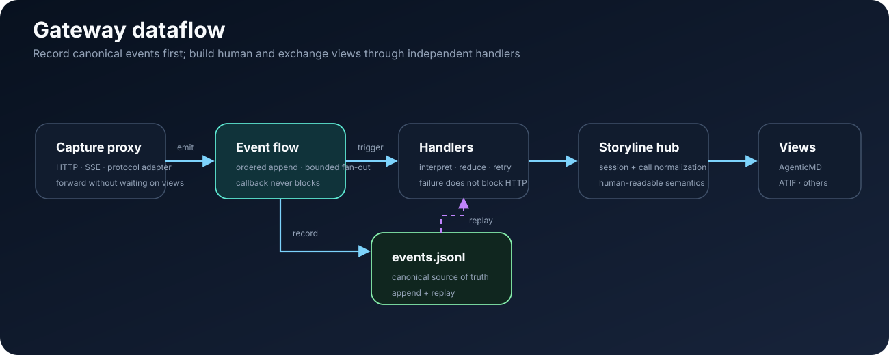
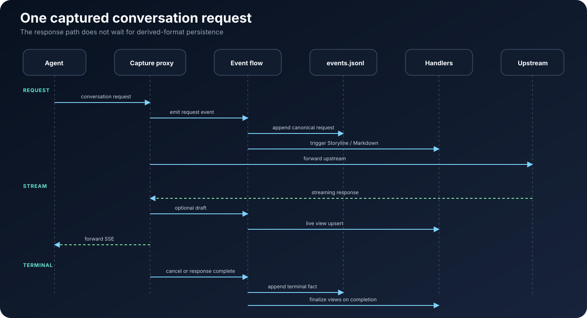

# pVisor Gateway — architecture and design

This page covers model routing, protocol adaptation, non-blocking capture,
and event emission. How to capture a Run belongs to the
[Capture guide](../guides/capture.md). Captured events stay with the Run.

> **Audience**: platform engineers, architects, and integrators who need
> **observable, replayable, auditable** trajectories between Agents and
> LLMs.
> **Version**: 1.1 (external) &emsp;|&emsp; **Last updated**: 2026-07-30

This document describes the product role, core concepts, and architectural
trade-offs of **Persisting Gateway**. Implementation details (block-format
field tables, CLI flags, directory layout) are in Further reading at the
end. The text avoids binding to specific source-code paths.

---

## Contents

1. Summary
2. Problem and value
3. Design principles
4. Core concepts
5. System overview
6. Data flow: from HTTP to trajectory (including §6.4 multimodal)
7. Storage and consistency
8. Gateway and protocols
9. Multi-agent and sessions
10. Reliability and runtime shapes
11. Evolution
12. Further reading

---

## 1. Summary

**Persisting Gateway is the trajectory observation layer for coding
agents.** Run **Claude Code** or **OpenAI Codex** through a local explicit
proxy from `persisting-overlaynet` and you get a replayable event stream
persisted as EventRecord JSONL with the Run (and optional live Markdown).

Main path:

```text
HTTP  ──►  events stream
              ├─ record (append → events.jsonl, SoT)
              └─ trigger (subscribe / handler)
                   └─ optional live Markdown projection
```

It is an embeddable **event observer and state machine** on top of the
overlaynet proxy. On supported clients, `pvisor run` injects the proxy or
sets the model API address so that, **without changing application
code**, you can:

- transparently forward dialogue traffic to the upstream model;
- write every HTTP exchange into the **events stream** (durable and
  replayable);
- let subscriptions on events trigger optional live Markdown instead of
  hard-coding formats on the proxy path.

Gateway is not a substitute for a general enterprise API gateway, and it
does not own the network data-plane implementation. As an OverlayNet
sink, it interprets proxy exchanges, forwards protocols, and produces
events around the **Agent trajectory**.

---

## 2. Problem and value

### 2.1 Typical pain points

| Pain point | Gateway response |
|------|----------------|
| Agent dialogue is scattered across vendor APIs and hard to analyze uniformly | Normalize to a shared event record, then materialize a dialogue view |
| Want logs without changing code | Reverse proxy + environment injection (`pvisor run`) |
| Need a human-reviewable session transcript | TLV Markdown: readable body, metadata in comments |
| Want streaming output visible as it is generated | Live Markdown upsert (draft block → final block) |
| Subagents and multiple sessions mix together | One file per storyline + spawn links; do not inline full subagent text |
| Capture must not delay the LLM first token | **Observation does not block**: capture is async; failures go to dead letter |

### 2.2 Client support (live capture)

| Client | `pvisor run` live capture | Notes |
|--------|:----------------------:|------|
| **Claude Code** | ✅ | Primary target: Anthropic Messages, subagent tracks, history-replay dedup |
| **OpenAI Codex** | ✅ | Responses API path; inject the gateway with `-c openai_base_url=…` and similar |
| **Cursor** | ❌ | **Not supported in this version** (no official injection or traffic adapter) |
| **Custom / generic OpenAI SDK** | ⚠️ | May work if the client uses `HTTP_PROXY` or `OPENAI_BASE_URL` / `ANTHROPIC_BASE_URL`; no dedicated guarantee |

Post-hoc **import** from local IDE JSONL follows the CLI docs. Cursor
local-log import is also planned and is independent of the live-capture
table above.

### 2.3 Capability bounds

**Strengths**

- Embedded Gateway in `pvisor run` capturing **Claude Code / Codex**
  dialogue;
- History-replay dedup and subagent tracks for Claude Code;
- Responses ↔ Completions bridging and context-injection filtering for
  Codex;
- Dual storage: EventRecord JSONL plus an optional live Markdown view;
- Lightweight model routing and protocol bridging (Messages /
  Completions / Responses, and so on).

**Does not replace**

- Multi-tenant billing, complex RBAC, MCP/A2A federation, and similar
  enterprise gateways (see projects such as
  [agentgateway](https://github.com/agentgateway/agentgateway));
- A one-stop SDK for 100+ vendors (see LiteLLM-style projects);
- Token compression of terminal command output (complements tools such
  as [RTK](https://github.com/rtk-ai/rtk)).

### 2.4 Place in the Persisting ecosystem

```text
Agent client
      │ HTTP
      ▼
┌─────────────────────────────────────┐
│  Persisting Gateway                  │
│  HTTP → events stream                │
│   · record → events.jsonl (SoT)      │
│   · trigger → optional Markdown      │
└──────────────┬──────────────────────┘
               │ capture stays with the Run
               ▼
┌─────────────────────────────────────┐
│  Run storage (JSONL + Run Bundle)    │
└─────────────────────────────────────┘
```

---

## 3. Design principles

| Principle | Meaning |
|------|------|
| **Observation does not block** | User-request latency and success come first. Capture failures write dead letter and do **not** interrupt the HTTP response because a disk write failed. |
| **HTTP → events** | The proxy's primary product is the **events stream** (HTTP-first wire), not a direct Markdown / ATIF write. |
| **Record and trigger are separate** | The same event can **append** to storage and **fan-out** to downstream handlers; the two are decoupled. |
| **Derived views are optional** | Live Markdown is a handler on the events stream, not a second source of truth beside JSONL. |
| **JSONL is the source of truth** | Canonical storage is EventRecord JSONL (`events.jsonl`). Markdown is **derived** and may be lossy. |
| **Single write gate** | JSONL appends go through one engine path, avoiding dual-write races. |

---

## 4. Core concepts

### 4.1 Main path

```text
Agent HTTP
    │
    ▼
overlaynet proxy (CONNECT / forward / network policy)
    │
    ▼
Gateway Sink (LLM protocol adapt + emit trajectory observations)
    │
    ▼
events stream ─────────────────────────────────────────┐
    │                                              │
    ├─ record append ──► events.jsonl (SoT / replay) │
    │                                              │
    └─ trigger handler ──► optional live Markdown    │
                                                   │
(optional) replay from JSONL ──────────────────────┘
```

Key points:

1. **overlaynet owns the proxy mechanism**: request classification,
   CONNECT, absolute-URI forwarding, egress policy, and connection
   counts.
2. **Gateway Sink owns business semantics**: LLM routing/protocol
   conversion, session association, and capture events. It does not
   implement a second proxy.
3. **The events stream is the bus**: it can be recorded and subscribed.
   The same record can persist and trigger at once.
4. **Derived views are downstream**: optional live Markdown is produced by
   handlers on the events stream; capture stays with the Run.

Auxiliary coordinates (session bounds, not SoT):

| Concept | Meaning |
|------|------|
| **Run** | One `pvisor run` / root workspace |
| **session** | One Agent conversation line (≈ ATIF `session_id` / storyline `session`) |
| **call_id** | Ties request/response of one HTTP round-trip (events envelope field) |

### 4.2 Layers

```text
┌─────────────────────────────────────────────────────────────┐
│  Protocol layer: HTTP, SSE, OpenAI / Anthropic / Responses   │
│  Role: forward, translate; emit HTTP-first observations      │
└───────────────────────────┬─────────────────────────────────┘
                            │ emit
                            ▼
┌─────────────────────────────────────────────────────────────┐
│  events stream                                               │
│  Role: ordered events; append records; fan-out triggers      │
└───────────────┬─────────────────────────┬───────────────────┘
                │ record                  │ trigger
                ▼                         ▼
         events.jsonl             handlers (interpret)
                                          │
                                          ▼
                                   optional live Markdown
```

**Ingress**: protocol layer → events (keep the wire when possible;
summary fields are optional).
**Egress**: events replay / subscribe → optional live Markdown; decoupled
from the capture hot path.



### 4.3 Write path and derived path

| | Write path (record) | Derived path (trigger) |
|---|--------|--------|
| **Input** | Event emitted by proxy / import | Event already in the stream (live or replay) |
| **Output** | `events.jsonl` append | optional live Markdown |
| **Failure** | dead letter; do not block HTTP | Independent retry; does not affect SoT |
| **Fidelity** | HTTP-first, target is replay | Lossy fold is allowed |

Live Markdown, turn indexes, and similar are **handlers triggered by
events**, not a second source of truth beside events.

## 5. System overview

### 5.1 Logical components

```text
                    ┌───────────────┐
                    │ Agent process │
                    └───────┬───────┘
                           │ HTTP(S)
                           ▼
              ┌────────────────────────┐
              │   Capture Proxy        │
              │   · routing / auth     │
              │   · protocol bridge    │
              │   · stream forward     │
              │   · emit → events      │
              └───────────┬────────────┘
                          │
          ┌───────────────┼───────────────┐
          ▼               ▼               ▼
   ┌────────────┐  ┌────────────┐  ┌────────────┐
   │ events     │  │ upstream   │  │ session    │
   │ engine     │  │ LLM        │  │ index      │
   │ · record   │  │            │  │            │
   │ · trigger  │  └────────────┘  └────────────┘
   └──────┬─────┘
          │
    ┌─────┴──────────────────┐
    ▼                        ▼
 events.jsonl          handlers → optional Markdown
 (SoT)
```

| Component | Role |
|------|------|
| **Proxy** | Sole HTTP entry; forwards up and down stream; **emits** observations **into the events stream** (does not write multiple formats directly). |
| **events engine** | Maintains the ordered stream: **record** (append JSONL) and **trigger** (fan-out handlers). |
| **Record path** | WAL → per-session ordered apply → `events.jsonl`. |
| **Trigger path** | Subscribe events → interpret → optional live Markdown. |
| **Session index** | Lightweight `sessions.json`: listing, tokens, cost estimates. |
| **Reconcile and dead letter** | Consistency of SoT vs derived persist; failed events can be replayed. |

### 5.2 Integration (conceptual)

- **Library embed**: a Rust project can mount OverlayNet and the Gateway
  sink and supply its own trajectory event sink.
- **CLI**: `pvisor run` wraps the child process and manages the
  Run-scoped Gateway lifecycle.
- **Config**: TOML declares listen address, model routes, capture level,
  and storage root; Agent source code does not change.

The public API is published by **module boundary** (proxy, engine,
record, trajectory, session) rather than a flat export of hundreds of
symbols. The story read model is visible mainly through snapshots and
reconcile artifacts.

### 5.3 Relationship to agentgateway

Gateway borrows a subset of agentgateway **config semantics and routing
model**, and can use its fixtures for protocol regression. The two
runtimes are **independent**. Positioning: agentgateway is a cluster-
scale multi-protocol gateway; Persisting Gateway is an **embedded,
single-node trajectory source of truth**.

---

## 6. Data flow: from HTTP to trajectory

Main path: **HTTP → events stream → (record | trigger) → persist**.

### 6.1 One dialogue request (conceptual sequence)



Key points:

1. The **Proxy does not wait** for derived persist to finish before
   responding; it emits first, then continues forwarding.
2. **Drafts trigger handlers only by default** (for example Live
   Markdown). Only a complete response is **recorded** into JSONL, so
   partials do not pollute SoT.
3. Live Markdown is produced by handlers on the events stream; it can
   trigger live or be replayed from JSONL later.

### 6.2 Capture events and record types

The write path drives all persistence from a small set of **event
kinds**:

| Event | Typical effect (Dialogue level) |
|------|---------------------------|
| Request arrived | JSONL: request record; Markdown: user block |
| Streaming draft | Markdown only: assistant draft (in-place overwrite) |
| Response complete | JSONL: stream/full response record; Markdown: final assistant |
| Call canceled | JSONL only: cancel record |
| Spawn link | JSONL + Markdown: association metadata (not skippable noise) |

**Capture level** (Summary / Dialogue / Full) controls record grain.
Production default is **Dialogue**:

| Level | JSONL / Markdown summary fields | `payload.body` |
|------|---------------------------|----------------|
| `summary` | model, path, byte counts only | ❌ |
| `dialogue` (default) | visible dialogue text in `user_content` / `assistant_content` | ❌ |
| `full` | same plus the fully parsed request/response JSON | ✅ |

Rules that omit unrelated probe traffic (for example `count_tokens`,
history replay) are independent of capture level. Materialize filtering
handles them uniformly. See §6.4 on this page.

Storage record types (`http.request` / `llm.request`,
`llm.response.stream`, `session.*`, and so on) belong to the **events
vocabulary** and are emitted by the Proxy. Handlers then fold them into
Markdown handlers; they need not map one HTTP frame to one dialogue turn.

#### 6.2.1 Timestamps and order

Every `EventRecord` that enters durable capture carries two consistent
observation times: `timestamp` (RFC3339 UTC) and `timestamp_unix_ms`
(Unix milliseconds). Request events use the time the request was
accepted; response events use the time the response was captured. The
Gateway sink is the last common write boundary and fills both values for
older producer records that lack them. Runtime lifecycle events from
pVisor also write both forms, and the two must agree at millisecond
precision.

Event order is still defined by `source + seq`. Timestamps are only for
wall-clock correlation, latency display, and cross-component alignment.
They do not replace sequence ordering. Different sources may have
independent `seq` spaces.

### 6.3 Streaming and the human-readable view

```text
Assistant:  "H" → "He" → "Hello, I can help…"
Markdown:   [draft] → [overwrite draft] → [final]
JSONL:      —      —                    one final response event
```

- Draft blocks are explicitly marked. On finalize, the same block is
  overwritten by **call + role**, avoiding duplicate paragraphs.
- The block-header schema carries a version (`v: 1`) so the line format
  can evolve without changing the file suffix.

See the capture guide for Markdown layout.

### 6.4 Visible-dialogue extraction (including multimodal)

At the **Dialogue** level, Gateway extracts human-visible body text from
the client's original HTTP body (not the upstream-transformed form),
writes `payload.user_content` / `payload.assistant_content`, and drives
Markdown block bodies, frontmatter `turns`, and derived stats.

**Single entry**: the `dialogue_extract` module, branched by wire
protocol:

| Client / API | Typical path | User input | Assistant output |
|--------------|----------|----------|----------|
| Claude Code | `/v1/messages` | `content[]`: `text` / `image` / `tool_result` | SSE / JSON: `text` / `tool_use` |
| Codex | `/v1/responses` | `input[]`: `input_text` / `input_image` / tool round-trips | SSE / JSON: `output_text` / `function_call` / `image_generation_call` |
| OpenAI SDK | `/v1/chat/completions` | `messages[]`: `text` / `image_url` | `choices[].message` / streaming delta |

**Multimodal Phase 0 (current)**: images are **not written as blobs**.
Placeholders stay in the dialogue string so `turns` counts stay correct
and review still "knows there was an image":

| Direction | Placeholder example |
|------|------------|
| User input (URL) | `[image: url:https://…]` |
| User input (base64 / data URL) | `[image: base64:128KB image/png hash=abc…]` |
| Assistant image (Codex Responses) | `[image_generated: ig_xxx, png, 1024x1024, ~1MB]` + optional `prompt: …` |

An image-only user turn with no text still **counts as 1 turn** (fixes
"image but no text → stats 0 turns").
When `capture_level = full`, the complete JSON remains in
`payload.body`, but Markdown materialize **still shows only
placeholders** and does not embed pixel data.

**Later (planned)**: a sidecar asset directory
`{run}/assets/{call_id}/…` plus payload references. An internal
materializer can emit Markdown images that point at `assets/…`.
See §11 Evolution on this page.

Protocol regression:
`crates/persisting-gateway/tests/ag_fixture_tests.rs` +
`tests/support/ag_capture_cases.rs` (agentgateway fixture matrix).

---

## 7. Storage and consistency

> Dual storage, directory conventions, and materialize/import paths are
> in Run storage.

### 7.1 Dual storage

| | JSONL (source of truth) | Markdown (optional view) |
|---|----------------|----------------------|
| **Reader** | Programs, retrieval, replay | Humans, git, review |
| **Completeness** | Lossless (within the capture level) | Lossy: filters internals and repeated history |
| **Write** | append to `events.jsonl` | live upsert when `--gateway-stream-markdown` is enabled |
| **Relation** | canonical event count ≥ block count | Rebuild from JSONL can repair drift |

### 7.2 Materialize filtering (one policy)

Whether the write is live or a later materialize, **the same rules**
decide whether an event appears in Markdown, for example:

- Internal `count_tokens` and shadow-model warmup;
- Claude Code-style **history replay** (resend that does not increase
  the user-message count);
- Empty records with no visible body;
- Pure lifecycle and cancel-only records (kept in JSONL).

Events that still matter to humans, such as spawn links, are **not**
dropped by mistake.

### 7.3 Session summary (frontmatter)

Each Markdown session file may carry a YAML summary: `turns`, tokens,
estimated cost, subagent list, client info, and so on.
**Turn count follows the story read model.** The in-block `turn` field
is a display heuristic only, not the authoritative count.

### 7.4 Reconcile

When a Run ends normally, the human-readable Markdown view (when enabled)
is compared against the JSONL event log. On mismatch, replay handlers or
inspect dead letter rather than trusting Markdown directly.

### 7.5 Auxiliary artifacts

| Artifact | Role |
|------|------|
| Event WAL | Replay unconfirmed capture events after a process crash |
| dead letter | Retain and replay apply failures or JSONL flush failures |

---

## 8. Gateway and protocols

Persisting Gateway is a **lightweight LLM protocol gateway**. It serves
"local or team-fixed upstream + capture" and does not replace a cloud
vendor console.

| Capability | Notes |
|------|------|
| **Model routing** | Match model names in config order; prefix/wildcard and single-hop forward. |
| **Protocol bridge** | For example Anthropic Messages ↔ OpenAI Completions. Responses API falls back when the upstream is not OpenAI. |
| **Stream translation** | Unified SSE shape; TTFT observation and cached replay of reasoning fields. |
| **Auth** | Inject API keys from config, environment, or client headers; header names follow the provider. |

Gateway logic stays strictly at the **protocol layer**. It does not
enter the story-layer state machine, so routing rules stay decoupled
from turn semantics.

---

## 9. Multi-agent and sessions

### 9.1 Routing and storage keys

Each HTTP request binds a **capture route**: logical session, on-disk
storage key (which decides the `.md` filename and the JSONL event-log
path), and an optional subagent id.
Under a Capture run, subagents usually write `agent-{id}.md`; the main
session writes `run-{id}.md` or a flat session name.

### 9.2 File-isolation invariants

- Subagent body text appears only in **agent-*** files;
- The main Agent's spawn references and links appear in **run-*** files
  and do **not inline** the full subagent text;
- Block-header JSON carries machine-readable links; body footnotes are
  human-only (parse roundtrip strips footnote lines).

### 9.3 Spawn linking

The spawn hint in a main-Agent assistant message and the subagent's
first-packet registration may be **time-skewed**. A Run-level registry
does delayed match and backfill so the main session can still see, after
the fact, which subagent was called and where its trajectory file is.

### 9.4 One run, several `session_id`s

`--record-destination` writes EventRecord JSONL under the destination
directory. Rows in that file may still mix several `session_id` values:

| Typical source | `session_id` value |
|----------|-------------------|
| pVisor lifecycle / Run header | `run-{uuid}` (matches the directory name) |
| Claude Code dialogue HTTP | UUID injected via header (different from the run id) |

---

## 10. Reliability and runtime shapes

### 10.1 Reliability model

```text
Request thread ──► emit event (non-blocking WAL enqueue + apply enqueue) ──► continue forward
                    │
                    └──► background: ordered apply ──► events.jsonl / Markdown
                              │
                              ├─ success → confirm WAL
                              └─ failure → dead letter + keep WAL (replay on restart; HTTP unaffected)
```

| Mechanism | Purpose |
|------|------|
| **Async apply** | Capture does not occupy the upstream connection thread |
| **Blocking-sink isolation** | durable ACK wait runs on a blocking pool, not Gateway Tokio HTTP workers |
| **Per-session ordered queue** | Event order is reproducible inside one session |
| **Event WAL** | The request thread only does a bounded `try_send`; the background waits at most 2 ms to batch and `sync_data`. Persisted events can replay after a crash |
| **ACK WAL** | Async best-effort batching. A lost ACK only causes safe replay. The flush/shutdown barrier persists already-received ACKs first |
| **Barrier flush** | Drain queues and actor mailboxes before graceful exit |
| **Dead letter** | Operable replay instead of silent drop |

Known limits (implementation still tightening): WAL sequence and
duplicate-delivery policy under extreme crash, and the I/O cost of
full-file Markdown upsert on very long sessions — see §11 Evolution.

### 10.2 Runtime shapes

| Shape | When to use |
|------|----------|
| **`pvisor run`** | Wrap one Agent command (for example `claude`, `codex`); inject proxy environment variables and manage the embedded Gateway |
| **JSONL recording** | `--record-destination` writes EventRecord JSONL; enable `--gateway-stream-markdown` as well when live Markdown is needed |
| **Dead letter** | Retained in Run storage for capture diagnosis |

Config excerpt:

```toml
listen = "127.0.0.1:19080"
admin_listen = "127.0.0.1:9876"
agent_id = "my-team"
capture_level = "dialogue"

[[models]]
name = "deepseek-chat"
upstream = "https://api.deepseek.com/v1"
api_key_env = "DEEPSEEK_API_KEY"
```

The admin port serves health and session-list queries (usage, model,
active request count) for sidecar monitoring.

---

## 11. Evolution

!!! note "Target architecture"
    The items below are product-level directions. They are not current
    capabilities and they do not commit a schedule.

| Direction | Motive |
|------|------|
| **Multimodal sidecar (Phase 1)** | Persist base64 / generated images under `{run}/assets/`; JSONL stores references only |
| **Cursor live capture and import** | Injection and JSONL import on par with Claude Code |
| JSONL compaction | Split or rotate strategy when `events.jsonl` grows too large on a long run |
| Stronger WAL and sequence recovery | Lower risk of duplicate apply and seq conflict after a crash |
| Markdown append log + periodic compact | I/O and git-diff friendliness of live upsert on long sessions |
| External price table | Configurable cost estimates in the summary |
| Session read-model enrich | Close the loop on parent/child sessions, call metadata, and spawn |
| Narrower protocol surface | Shrink the conversion matrix as industry APIs stabilize |

Block format is explicitly versioned with `v: 1`. See
the capture guide for Markdown layout.

---

## 12. Further reading

| Document | Contents |
|------|------|
| [Capture quick start](../guides/capture.md) | **Getting started**: build the CLI, `pvisor run`, view trajectories, troubleshoot |
| [pVisor commands](../reference/cli.md) | Single-Run execution, status, and filesystem operations |

**Runnable examples**:

- [Gateway capture and LLM control](https://github.com/DeepLink-org/Persisting/tree/main/examples/pvisor/04-gateway-llm-control)

---

*This page tracks Persisting Gateway releases. If behavior and the
document disagree, the tests and golden fixtures in the repository
win.*
