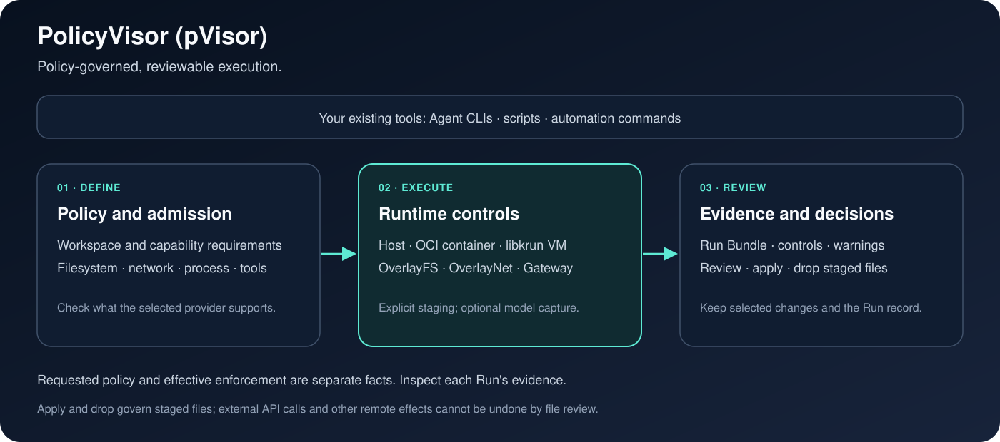

# End-to-end architecture

This document defines the contracts inside pVisor. Provider mechanisms belong
to pVisor Design; commands belong to the pVisor Reference.



## Product ownership

| Product or layer | Owns | Does not own |
| --- | --- | --- |
| `persisting-events` contract | storage-independent `EventRecord` identity and envelope | storage engines, query, or projection |
| pVisor | one Run, its Attempts, execution environment, capability admission, effects, and runtime evidence | many-Run scheduling |
| Runtime provider | one physical execution mechanism | logical Run identity or product policy |

Gateway, OverlayFS, and OverlayNet are pVisor runtime mechanisms. They do not
form independent control planes.

## Runtime placement and platform boundary

The logical Run contract is portable across providers, but the enforcement
boundary follows the selected platform:

| Placement | Workload boundary | Workspace behavior | Security qualification |
| --- | --- | --- | --- |
| Linux host | private user/mount/PID namespaces plus Landlock | staged FUSE workspace | filesystem and network capabilities are reported separately; unavailable setup fails before execution |
| macOS host | Seatbelt where available, with staged macFUSE writes | staged host workspace | safe best-effort host isolation; host kernel and ambient reads remain visible in Evidence |
| Linux or Apple Silicon macOS VM | guest kernel with an OCI or prepared Linux rootfs | staged workspace inside the guest | stronger kernel boundary, while the macOS VMM still runs with the invoking user's host authority |
| native OCI container | OCI runtime and bundle selected by pVisor | bundle-mounted rootfs and staged paths | container isolation is recorded; it is not treated as a complete hostile multi-tenant boundary |

The provider reports requested versus effective capability dimensions in the Run
Bundle. A successful process exit does not imply that the requested boundary
was installed, and a workspace stage remains reviewable independently of the
provider that produced it. See [pVisor isolation design](../pvisor/design/isolation.md)
and the [execution guide](../pvisor/guides/execution.md) for provider-specific
behavior and prerequisites.

## Independent ingress paths

```text
Configured runtime capture
  Gateway trajectory events ─┐
  pVisor lifecycle records ──┴─> canonical event Source ──────────────┐
Pinned external Sources                                                │
  local/S3 ATIF, ACTF, OpenAI Messages files ──────────────────────────┼─> Snapshot
  local/S3 Storyline Sources ──────────────────────────────────────────┘
                                                                         └─> normalized Dataset views
```

pVisor completes its standalone loop with a terminal RunResult, staged
Effects, and a private, versioned Run Bundle. Configured capture is not a pVisor
runtime prerequisite. External file and Storyline Sources are pinned and
normalized directly; they neither pass through pVisor nor become canonical
runtime events, and they do not acquire pVisor execution guarantees.

## Stable objects

```text
RunSpec
  └── Run
      ├── Attempt 1
      ├── Attempt 2
      └── Attempt finalization
          ├── terminal RunResult
          ├── private versioned Run Bundle
          └── staged Effects → later review / apply / drop

Optional configured event handoff
  └── Gateway trajectory events + pVisor lifecycle records
```

The logical Run is portable. An Attempt is provider-specific. Infrastructure
retry creates another Attempt; a semantic retry creates a derived Run. A Run
may have multiple Attempts but only one visible terminal result.

Where a Source carries it, the stable cross-product identity is `run_id`.
Session, Step, call, event, and Artifact identities remain scoped and retain
their Source lineage. A process ID, container ID, VM ID, or worker lease is
never a substitute for Run identity.

## Single-Run path

```text
User or Agent framework
  → RunSpec
  → pVisor admission
  → capability-by-dimension provider selection
  → Attempt execution
  → terminal RunResult + private versioned Run Bundle + staged Effects
  → later review / apply / drop
```

Admission compares requested capability dimensions with evidence the selected
provider can produce. A required dimension that cannot be enforced fails before
workload execution. Optional degradation is recorded explicitly in the Run
Bundle.

Filesystem promotion is an Effect decision, not the Run terminal commit.
Selected paths can be applied more than once while the stage remains available.
Network requests and remote tool mutations are separate effect dimensions and
cannot be inferred from filesystem state.

When configured, pVisor writes Gateway trajectory events plus `run.created`,
`run.state_changed`, and terminal lifecycle records as EventRecord JSONL with
the Run. Those records carry Run/Attempt identity, lifecycle facts, and
available event-carried Evidence. Artifact references, lineage, staged
filesystem Effects, AgentCtl/network/resource Evidence, and the full Run Bundle
remain local unless moved separately.

## Dataset path

Canonical runtime writers and pinned external Sources are independent Source
paths. They converge only at the Snapshot and normalized Dataset views:

```text
configured Gateway and pVisor lifecycle writers
  → canonical event Source ────────────────────────────────┐
pinned local/S3 external Sources                           │
  → ATIF / ACTF / OpenAI Messages files ───────────────────┼─> Snapshot
  → Storyline Sources ─────────────────────────────────────┘     ├─> normalized Run / Step / ToolCall views
                                                                 └─> query / export / revision lineage
```

Canonical facts are append-oriented. Storyline and other normalized views are
rebuildable projections. Exchange files are interoperability boundaries, not a
replacement source of truth. Each read operation fixes a Snapshot; it
does not invent a global transaction across unrelated Sources. Pinning an
external file does not convert it into a canonical runtime event Source.

## Source-specific guarantees

| Source path | Supported claim | Explicit non-claim |
| --- | --- | --- |
| External file or imported Source | discovered content, pinned Source version, normalized representation, and recorded conversion lineage where implemented | completeness of an external task manifest or absence of unreported trajectories |
| Gateway capture | requests and responses observed and durably published through the configured Gateway path | absence of traffic that bypassed Gateway |
| pVisor Run | Run/Attempt identity, recorded terminal facts, installed mechanisms, observed Effects, and provider-specific Evidence | enforcement a selected provider did not supply |

Ingestion preserves these boundaries. A normalized representation or Catalog
Snapshot does not upgrade the evidence supplied by its Source.

Capture writes `EventRecord` values into the Run as local JSONL; this
repository does not start a separate history process. Flag names belong to the
[pVisor CLI reference](../pvisor/reference/cli.md).

## Failure and recovery

| Failure | Owner | Required behavior |
| --- | --- | --- |
| Attempt exits or provider disappears | pVisor | finalize evidence; expose failure or create a fenced replacement Attempt |
| sidecar append queue is saturated or closed | pVisor/Gateway producer | reject before submission and report the failure; do not claim durability |
| append connection is lost | producer | preserve the write as unknown; do not reuse its sequence as if definitely rejected |
| history publication conflicts | capture sink | preserve the previously published records; surface or retry according to the sink contract |
| view generation fails | Gateway | keep canonical events readable |

Recovery never upgrades uncertainty into success. A missing terminal fact, a
lost callback, and an unenforced capability remain visible states.

## Security and evidence chain

Security is reported per capability dimension. pVisor records requested policy,
installed mechanism, provider identity, enforcement result, and observed
effects. Configured capture stores lifecycle facts and only the Evidence
carried by Gateway or lifecycle event records; the broader Run Bundle evidence
inventory remains local.

This produces a chain rather than a boolean label. The local Run evidence
chain does not mean every layer is automatically published into durable
history:

```text
requested policy
  → admission decision
  → installed mechanism
  → provider-bound evidence
  → observed effects
  → terminal result

Optional configured persistence
  Gateway trajectory events + pVisor lifecycle records
    → event-carried Evidence only
    → Run-local capture
```

See [Security and evidence](security-evidence.md) for evidence levels and
[Local to fleet](local-to-fleet.md) for portability requirements.

## Public boundaries

| Boundary | Contract owner | Detailed document |
| --- | --- | --- |
| logical runtime event | `persisting-events` | [pVisor Gateway design](../pvisor/design/gateway.md) |
| Agent execution and Effect review | pVisor | [pVisor concepts](../pvisor/concepts/index.md) and [guides](../pvisor/guides/index.md) |
| provider and runtime mechanisms | pVisor | [pVisor design](../pvisor/design/index.md) |
| stable command syntax | pVisor | [pVisor reference](../pvisor/reference/index.md) |

This document changes only when a cross-product contract changes. Product
implementation status and roadmap details belong to their owning Design pages
or Project engineering notes.
