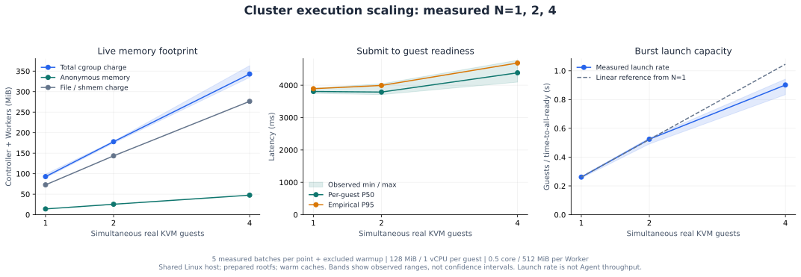
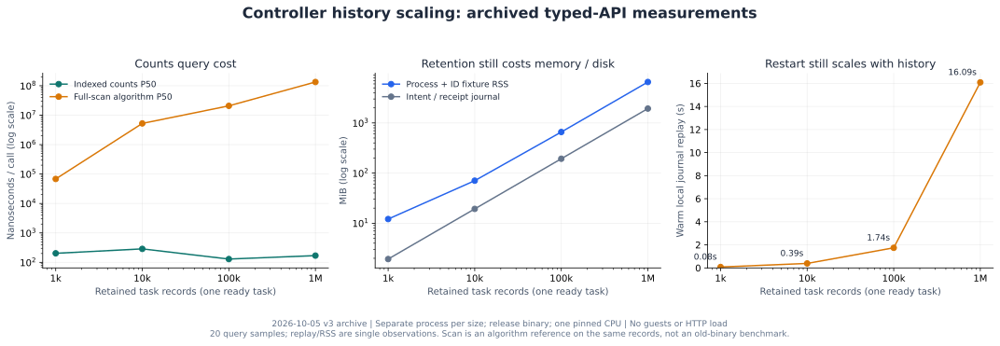

# Cluster 扩展性曲线

2026-10-05 的探索性测量观察到：**增加 Worker 和 CPU 预算后，1→4 台轻量 VM 可并行就绪、内存近似线性增长；Controller 的计数查询避免了随历史量全表扫描**。这尚未验证固定宿主预算下的有效 Agent 吞吐、密度或完整系统扩展性。

下一轮先冻结问题、假设、对照和判定标准，再采样；详见[benchmark 应先回答的问题](cluster-questions.md)。该协议在本次测量之后编写，不追认已有曲线为预注册验证。保留历史的内存和回放增长是待定位问题，不是某项优化已获验证的收益。

这批任务没有指定不可变环境 handle 或 checkpoint restore，且每 VM一个独立Worker，未覆盖[共享工作集与惰性加载](../design/cluster/shared-working-set.md)的关键复用路径。后续优先验证 S1共享RAM 与 S2大环境小工作集，而不是把本图当作这些机制的性能结论。

本页把新跑的真实 VM 实验与已有的 Controller 历史负载分别绘图。两组制品、负载和统计口径不同，不拼成一条曲线，也不和其他沙箱的不同条件结果排名。

## 真实 VM：内存、就绪延迟与启动速率 {#execution}



| 同时存活 VM | 总内存 P50 | 每 VM 就绪 P50 | 观测 P95 | 批量启动速率 |
|---|---:|---:|---:|---:|
| 1 | 92.93 MiB | 3.807 s | 3.893 s | 0.261 台/s |
| 2 | 178.00 MiB | 3.789 s | 3.993 s | 0.525 台/s |
| 4 | 342.96 MiB | 4.383 s | 4.686 s | 0.901 台/s |

1→4 的内存为 **3.69 倍**，就绪 P50 增加 **15.1%**，批量启动速率为 **3.45 倍**，相对从单台基准推得的理想线性速率为 **86.2%**。在这个负载和范围内，内存近似按 VM 数线性增长，没有观察到明显的超线性放大；就绪延迟没有随 VM 数同比增长。

这里扩展的是 **Worker 数量与 CPU 总预算**：每台 VM 独占一个 Worker，增加 VM 时 CPU 预算同步增加。它观察了这批探针的并行就绪行为；没有固定预算、完整有用任务和对应对照，因此不能把 86.2% 称为 pVisor 的整体扩展效率，也不测试单个 Worker 的高密度或跨主机扩展。

### 测量协议

- 同一台共享 Linux 宿主：AMD Ryzen 7 9700X，约 30.5 GiB RAM，Linux 7.2.8，KVM/FUSE；宿主其他负载没有停止。
- 顺序测试 1、2、4 台，每档 1 批预热、5 批测量，共 35 台测量 guest 加 7 台预热 guest，**42/42 成功**。每批结束后才启动下一批；最多 4 台并行。
- 每 VM 为 128 MiB guest RAM / 1 vCPU；每个 Worker 连同全部子进程由 cgroup 硬限制为 512 MiB / 0.5 核，Controller 为 256 MiB / 0.25 核，swap 为 0。任务 CPU 时间限制 2,000 ms、超时 60 s。硬限制总和最大为 2.25 GiB / 2.25 核；开始前要求可用内存至少 3 GiB。
- 使用已准备的最小 rootfs，只包含 shell、sleep 及依赖库；guest 写就绪标记后 sleep 6 s，再输出 `scale-ok`。没有模型调用、网络或真实 Agent 工具链。
- 使用上手指南已验证的 `target/debug` 制品，开始前复制固定二进制，所有规模使用相同 SHA-256；libkrunfw 5.5.0。它不是优化发布制品的性能上限。工作树在开发，源码 revision 不等于冻结发布身份，二进制哈希是本批实际制品身份。
- **就绪时间**从每个任务开始执行提交 CLI，到 guest 自己写出标记，包括 CLI/HTTP、意图记录落盘、调度和 VM 启动；不含服务/rootfs 准备。Worker 轮询间隔 200 ms，标记观察间隔 20 ms。不能与[纯 VM 启动](startup.md)约 110 ms 的口径直接比较。
- **总内存**为全部 guest 同时就绪后，Controller 和所有 Worker 的互不重叠 cgroup `memory.current` 之和；连续 10 次、间隔 50 ms 的中位数，再取 5 批中位数。不是启动瞬时峰值，也不是 guest RAM 配置值。
- 图中的 `file` 包含页缓存以及 shmem/memfd/tmpfs 等内存，guest RAM 可能计入其中；**不能把这条线当成可随意扣除的缓存**。匿名内存、file 类内存和 native 进程 PSS 原样记录，cgroup 总值不重复相加共享进程 RSS。
- 真实 KVM fd、native PID/start time 和 guest 标记一起确认实际存活的 N 台 VM；最终状态、stdout、Worker 放置及所有 cgroup OOM 计数检查全部通过。独立记录 native 进程 PSS，不把它当作全服务内存。

阴影是观测范围，不是置信区间：内存/速率为 5 批最小到最大值，就绪为全部 guest 样本最小到最大值。P95 使用线性插值，分别只有 5、10、20 个 guest 样本，不代表生产尾延迟 SLO。宿主缓存未清空，各规模按顺序测量，仍可能存在缓存和宿主负载混杂。

**批量启动速率 = N / 从首个提交开始到全部 guest 就绪的秒数**。它不包含后续固定 6 s 的等待，也不是 Agent 完成吞吐量。CLI 逐个提交，提交间隔也计入批量就绪时间。

## Controller：查询、内存与重启成本 {#controller}



| 保留任务记录 | 索引计数 P50 | 全扫描算法参考 P50 | 进程与 ID fixture RSS | 意图/回执日志 | 热回放 |
|---|---:|---:|---:|---:|---:|
| 1,000 | 202.83 ns | 0.068 ms | 12.13 MiB | 1.93 MiB | 0.079 s |
| 10,000 | 286.78 ns | 5.254 ms | 70.59 MiB | 19.33 MiB | 0.388 s |
| 100,000 | 129.40 ns | 20.789 ms | 658.82 MiB | 193.25 MiB | 1.744 s |
| 1,000,000 | 169.47 ns | 134.204 ms | 6,540.58 MiB | 1,932.55 MiB | 16.090 s |

这组图来自仓库已有 `controller-indexes-20261005-v3-history-*` 归档，本次**没有重跑百万记录实验**。每档独立进程，release 制品、固定一个 CPU、本地 NVMe 日志和热缓存回放；每档只有一个 ready task，其余是已取消历史。没有执行 guest，也没有 HTTP 压测，因此没有增加沙箱并发。

索引与全扫描都读取同一组权威 TaskRecord；全扫描是旧算法参考，**不是旧版 Controller 制品的吞吐量**。计数每档 20 个样本，索引每样本批量调用 100 次；返回已维护的计数器成本已经基本与历史规模脱钩。完整分配 poll 每档只观测一次，为 0.811–6.235 ms，均一轮分配，不能据此推算生产 QPS。

内存含 Controller、ID fixture、分配器留存，不是纯 Controller 对象的净占用；RSS 和回放是每档单次观察，图中不虚构误差条。回放包含从意图/回执日志恢复控制记录，**不包含跨主机 Worker 重新对账至完整可调度状态**。这不是要求 Worker 实时状态强一致落盘的实验。

**剩余瓶颈很清楚**：百万保留记录仍占约 6.39 GiB RSS、1.89 GiB 日志，热回放约 16.09 s。查询索引解决了热路径扫描，尚未解决历史保留和冷恢复的增长成本。

## 能支持的判断与下一步 {#limits}

这些曲线描述了小规模探针在增配资源后的并行就绪和内存增长，以及计数索引这一局部机制。它们没有测量单 Worker 多 guest 密度、固定预算的真实 Agent/Gateway 吞吐、冷镜像拉取、大规模活跃任务、故障时扩展效率或跨主机网络和存储。此前“单机执行近似线性扩展”的表述应按上述探针与资源增长条件理解，不能升级为产品整体结论。

下一步优先做终态记录压缩/归档、历史与活跃状态分层及有界保留，再分别测冷恢复和 Worker 全量对账。执行面则在仍不超过 4 个沙箱的条件下，先补单 Worker、固定总 CPU 及真实 Agent 负载对照，找出资源与调度瓶颈。更大并发需要在隔离测试宿主重新授权资源预算后测量，不能用这三个点外推容量承诺。

## 复现与原始证据 {#reproduce}

前提与受限构建方法见[Cluster 上手](../guides/cluster/index.md)。准备好 `pvisor-cluster` / `pvisor-worker` 二进制、firmware、Linux user systemd、KVM/FUSE 后，在仓库根目录运行：

```bash
SCALING_PARENT=$(mktemp -d /tmp/pvisor-cluster-scaling.XXXXXX)
python3 benchmark/pvisor/cluster_scalability.py \
  --state "$SCALING_PARENT/state" \
  --output "$SCALING_PARENT/vm.json" \
  --firmware-dir target/libkrunfw/5.5.0-x86_64-unknown-linux-musl \
  --sizes 1 2 4 --repetitions 5
```

脚本仅接受 1、2、4 三档，启动时核查硬限额和可用内存，正常结束、异常和终止信号都会停止自己的服务；私有状态留在输出目录供复核，不含在公开归档中。初次准备有一次 `trace=false` 保留配置被拒绝，没有接受任务或启动 VM；修正后全部实测成功，失败报告同样保留。

从公开归档重新绘图（需要 matplotlib）：

```bash
MPLCONFIGDIR=/tmp/pvisor-plot-cache python3 benchmark/pvisor/plot_cluster_scalability.py
```

[执行 JSON](../../assets/benchmarks/cluster-scalability-20261005/vm.json) · [执行汇总 CSV](../../assets/benchmarks/cluster-scalability-20261005/vm-summary.csv) · [Controller 汇总 CSV](../../assets/benchmarks/cluster-scalability-20261005/controller-summary.csv) · [Controller 源码/构建身份](../../assets/benchmarks/cluster-scalability-20261005/controller-provenance.json) · [归档 manifest](../../assets/benchmarks/cluster-scalability-20261005/manifest.json) · [首次配置失败](../../assets/benchmarks/cluster-scalability-20261005/setup-failure.json)
