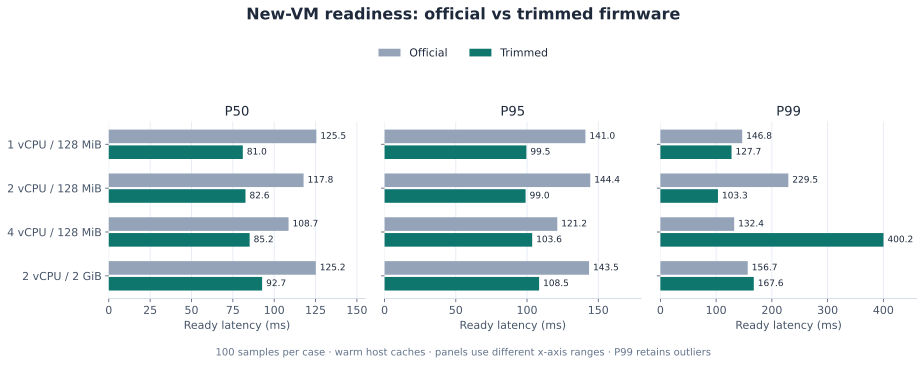
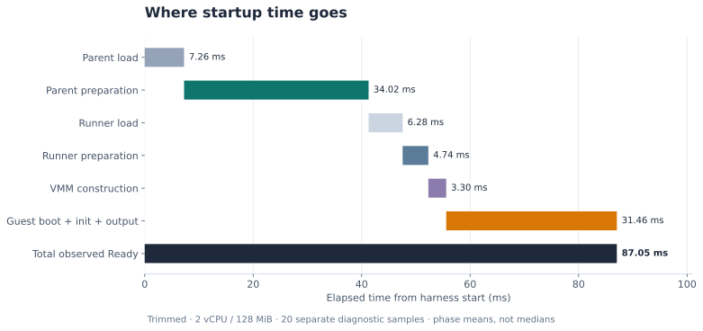
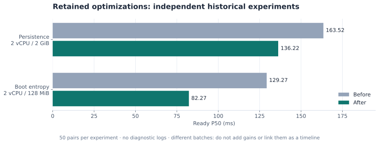

# pVisor 启动时间：优化过程与完整基准

## 1. 结论

两轮 P0 的最新受控复测中，裁剪 firmware、2 vCPU / 128 MiB 的 Ready P50 从 **90.50 ms** 降到 **84.35 ms**，优化后 P95 为 **112.14 ms**；同轮配对中位数节省 **5.64 ms**。这批常态日志开启，N=100/组，与下面原完整矩阵分开统计。

在 Apple M4 上，前一轮完整矩阵中的 release CLI 使用裁剪版 libkrunfw、2 vCPU / 128 MiB 启动新 VM，到工作负载输出就绪标记的 **P50 为 82.64 ms，P95 为 98.98 ms**。同一 CLI 使用官方 5.6.2 firmware 的 P50 为 117.77 ms。每组 100 个正式样本，另取诊断样本拆分宿主启动路径。

这个数字包括 CLI 准备、持久化运行记录、启动 runner、构造 VMM、Linux 初始化与 guest 执行 shell。rootfs 已准备、宿主缓存已预热；它描述新 VM 启动，不包括镜像下载，也不是磁盘冷启动或完整 Agent 服务启动。

同轮配对比较中，2 vCPU / 128 MiB 的裁剪版中位数节省 **33.79 ms**，95% bootstrap 区间为 **[32.35, 37.14] ms**。独立诊断显示，父进程准备与 guest 到输出到达仍是主要耗时；部分规格存在超过 400 ms 的长尾，因此不能只用约 83 ms 的中位数描述全部启动体验。

## 2. Motivation

Agent 执行器可能反复创建隔离环境，启动等待会直接影响首次命令的响应时间，也会影响短任务的整体成本。因此，这次优化关注从开发者启动 CLI 到 guest 真正执行工作负载的完整路径，而不只关注内核的一段初始化日志。

此前调查覆盖了运行记录持久化、runner 参数传递、早期随机数初始化和 firmware 裁剪。需要用统一口径确认当前实现的表现，并将已经验证的收益与没有稳定收益的实验区分开。本次测量回答三个问题：

- 当前新 VM 从 CLI 启动到负载就绪需要多久，退出收尾又需要多久？
- 相同 CLI 使用官方与裁剪 firmware 时，中位数和尾延迟有什么差异？
- 宿主准备、进程装载、VMM 构造与 guest 执行分别占多少时间，下一步应该优化哪里？

优化的约束是保留隔离、运行记录持久化和执行证明的语义。性能改善必须由成功运行的样本支持；内核日志更短、文件更小或代码更少，都不能单独替代端到端测量。

## 3. 实验设计

### 计时边界与工作负载

起点是 Python harness 调用 `Popen` 前的宿主单调时钟；终点是宿主读取到 guest shell 输出的独立 `PVISOR_BENCH_READY` 行。负载只执行 `/bin/sh -c 'printf "PVISOR_BENCH_READY\n"'`，不在标记前后运行 `dmesg`。因此 Ready 包含输出传输和宿主读取线程调度，不能缩写成“内核启动时间”。

Exit 是同一起点到 CLI 退出被阻塞等待线程观察到的时间，包含 guest 退出、sync/reboot、VMM 退出及运行结果持久化。读取标记与等待退出分别使用线程，避免带 timeout 的轮询等待制造人为延迟；线程被调度的误差仍包含在观测值中。

正式矩阵关闭 `PVISOR_STARTUP_TIMING`，诊断矩阵单独开启。每次正式启动都使用新工作目录，跳过个人 Agent 默认配置，关闭 OverlayNet，使用继承 stdio，没有 Gateway 或 TUI。原生 shell 和 host 执行器是上下文对照：macOS 与 Alpine shell 实现不同，不能用相减结果精确代表虚拟化成本。

### 环境与对照制品

| Item | Value |
|---|---|
| Date | 2026-10-03 |
| Host | Apple M4, 10 cores, 24 GiB RAM, AC power |
| OS / filesystem | macOS 27.0.1 (26A434), APFS |
| Executor | pVisor 0.3.0 release, libkrun 1.19.3, HVF / aarch64 |
| Source HEAD at measurement | `d6c607e79b8c497d2994731beb2ce2b3dfe628c0`; working tree status preserved in raw data |
| CLI SHA-256 | `04d4c05fbc706d34738f4a453449f9f670a7a89021f261b133aa855cb9bc19b4` |
| Guest rootfs | Alpine 3.22.1 aarch64, prepared directory, virtio-fs |
| Firmware | official libkrunfw 5.6.2 / locally trimmed 5.6.2; Linux 6.12.109 |
| Samples | 100 per main case + 5 discarded warmups; 20 per diagnostic case + 5 warmups |
| Load average, before / after | 3.23, 3.35, 4.25 / 3.31, 3.79, 4.29 |

官方 firmware 来自上游 5.6.2 发布的预编译 aarch64 `kernel.c`，只在 macOS 包装成 dylib；裁剪版来自本地 libkrunfw 构建。官方源码无需完整重编译。两者内核版本一致，但本地源码为 `v5.6.2-3-gf6a710f`，因此比较的是这两个真实制品，不是严格只改变一项 Kconfig 的因果实验。CLI 当前默认下载器仍固定 5.5.0，本实验显式选择 5.6.2，不把默认版本混进表格。

官方 dylib 为 23.715 MiB，裁剪版为 11.307 MiB，文件大小减少约 52.3%；这不等于 guest 或宿主物理内存降低 52.3%。完整 SHA-256、参数、源码状态和每个样本见[原始 JSON](../../assets/benchmarks/startup-20261003.json)。原始 JSON 保留测量时的绝对路径作为来源记录，复现时替换为自己的路径。

### 采样、验证与统计方法

正式矩阵共 1,000 个成功样本，另外 80 个成功诊断样本；预热共 70 次，总计 1,150 次启动。VM 样本在计时结束后检查 Bundle 为 completed、零退出，并确认 `virtual_machine` 隔离。任一失败、缺少标记或隔离不符都会终止测量，不能作为快速样本。

每轮随机排列所有案例；将同轮、同规格的官方值减去裁剪值，再对差值取中位数。置信区间使用固定 seed 的 5,000 次 bootstrap 重采样，它反映本批次样本变化，不能覆盖不同机器或负载条件的系统误差。

### 常态化启动诊断日志

当前实现默认输出 `pvisor-startup level=info` 阶段日志，无需调试开关。字段包括 Unix 时间 `timestamp_ms`、`pid`/`ppid`、JSON 引号包裹的 `run_id`、`stage`、`monotonic_us` 和 `process_elapsed_us`。Run ID 生成前的进程事件使用 `"-"`；结合 PID 与后续带 Run ID 的事件关联，父进程和 runner 的同一 Run 使用相同 ID。时间差使用宿主单调时钟计算，不能使用可能调整的墙上时钟。

普通 CLI 输出到 stderr，可由生产日志采集器保留；TUI 沿用前端诊断日志文件，VM runner 通过预先打开的专用描述符写入同一通道，避免污染 Agent 终端。日志只包含阶段与身份计时字段，不含命令、环境变量或凭据。输出尽力而为，不增加 fsync，也不作为恢复元数据。

`PVISOR_STARTUP_TIMING=0` 可显式关闭计时日志，用于无埋点基准；`1` 与不设置都开启。本文历史测量值来自归档制品，不能据此声称新增常态日志没有任何开销。`cli.session_started` 和 `runner.vmm_built` 分别表示 Session 已启动和 VMM 已构造，不代表 guest 或业务服务就绪；还没有通用 guest-ready 通知。

### 复现与原始数据

先准备 release CLI、Alpine rootfs 和两个 firmware 目录，再运行：

```bash
python3 benchmark/pvisor/vm_ready.py \
  --binary target/release/pvisor \
  --rootfs target/guest-init-benchmark/rootfs \
  --official target/firmware-official-compare-20261003/official \
  --trimmed target/firmware-official-compare-20261003/trimmed \
  --output target/vm-startup-new \
  --samples 100 --warmups 5 --profile-samples 20
```

输出目录必须尚不存在。harness 只依赖 Python 标准库，复用已有百分位数计算和 Bundle 验证。主矩阵与诊断矩阵隔离；预热不计入摘要；输出包括 `results.json`、逐行刷新的 `samples.jsonl`、输入 hash 和逐次 stdout/stderr。它使用独立 schema `pvisor-vm-readiness/v1`，不要与 `startup.py` 的命令完成耗时 schema 混用。

本次本地日志位于 `target/vm-startup-20261003/`，正式报告为上方原始 JSON 链接。历史持久化、熵优化与 firmware 对照的完整实验说明保留在 `review_project/03-modules/`；旧 C/Rust guest init 的 runner 基准保留在 `benchmark/pvisor/README.md`，它不包含完整 CLI 准备，不能与本表直接比较。

测量时的 harness 快照保留在 `review_project/06-evidence/vm-startup-20261003/`；可复用入口随后补上管道显式关闭，并在无日志矩阵中显式设置 `PVISOR_STARTUP_TIMING=0`；归档源码保留测量时的实现。

## 4. 数据分析

### 无诊断日志的端到端结果



图 1：各规格的就绪延迟。三个面板使用不同的横轴范围；P99 保留长尾样本，不能把中位数改善解释为每次启动都同样快。

下表单位均为毫秒；每行 N=100。`direct` 是原生 shell，`host` 是 pVisor host 执行器，其余名称为 firmware、vCPU 数和 MiB。

| Case | Ready P50 | Ready P95 | Ready P99 | Exit P50 | Exit P95 |
|---|---:|---:|---:|---:|---:|
| `direct` | 5.16 | 7.36 | 8.15 | 5.44 | 7.66 |
| `host` | 31.49 | 37.34 | 44.08 | 56.63 | 70.56 |
| `official-1cpu-128` | 125.49 | 140.99 | 146.79 | 202.61 | 302.99 |
| `trimmed-1cpu-128` | 81.03 | 99.55 | 127.66 | 138.58 | 200.79 |
| `official-2cpu-128` | 117.77 | 144.38 | 229.53 | 190.21 | 291.47 |
| `trimmed-2cpu-128` | 82.64 | 98.98 | 103.31 | 142.56 | 194.52 |
| `official-4cpu-128` | 108.68 | 121.24 | 132.39 | 188.59 | 262.58 |
| `trimmed-4cpu-128` | 85.15 | 103.62 | 400.23 | 153.01 | 199.25 |
| `official-2cpu-2048` | 125.15 | 143.53 | 156.74 | 211.97 | 314.88 |
| `trimmed-2cpu-2048` | 92.71 | 108.48 | 167.57 | 167.68 | 252.12 |

100 个样本足以描述这次测量的中位数和常见尾部，但 P99 接近最大观测值，不能据此保证长期尾延迟。后台负载、电源状态、APFS 持久化与宿主调度都可能影响下一批结果；之前约 84 ms 是另一批次的观测，不是固定性能常数。

本次也出现了明显长尾：裁剪版 4 vCPU / 128 MiB 有 2/100 次超过 200 ms，最大 412.91 ms；官方 2 vCPU / 128 MiB 有 3/100 次超过 200 ms，最大 389.00 ms。第 15 和 68 轮分别包含多个较慢案例。正式矩阵没有细粒度埋点，无法确定是持久化、调度还是其他宿主活动导致；这些成功样本全部保留，不剔除后再报告更漂亮的 P99。

#### 同轮配对的 firmware 收益

| vCPU / MiB | Paired saving P50 | Bootstrap 95% CI | Trimmed faster |
|---|---:|---:|---:|
| 1cpu-128 | 44.62 | [42.60, 47.18] | 98/100 |
| 2cpu-128 | 33.79 | [32.35, 37.14] | 99/100 |
| 4cpu-128 | 23.88 | [22.72, 25.15] | 96/100 |
| 2cpu-2048 | 34.94 | [32.21, 37.13] | 98/100 |

配对差值中位数不必等于两个组中位数的相减。增加 vCPU 或分配 RAM 也不保证更快，应按实际工作负载选择配置。这里未使用快照恢复、常驻 VM 池或共享内存扫描。

### 启动账本：时间去了哪里



图 2：六段按时间顺序排列，横向位置表示累计经过的时间。图使用诊断批次的均值，合计 87.05 ms；下表另列 P50。guest 段包含初始化、负载执行和输出到达。

下面是裁剪版 2 vCPU / 128 MiB 的独立诊断批次，N=20；诊断 Ready P50 为 87.67 ms。它不能与正式批次直接相减来估计日志开销。

| Boundary | P50 (ms) | Mean (ms) |
|---|---:|---:|
| `parent_load` | 7.14 | 7.26 |
| `parent_prepare` | 33.73 | 34.02 |
| `runner_load` | 6.17 | 6.28 |
| `runner_prepare` | 4.78 | 4.74 |
| `vmm_build` | 3.19 | 3.30 |
| `guest_and_output` | 31.08 | 31.46 |

六段的边界依次是：harness 起点 → 父进程 `main` → 开始 spawn runner → runner `main` → 进入 libkrun → VMM 构造完成 → 宿主读到就绪标记。父子进程埋点和 harness 使用同一宿主 `CLOCK_MONOTONIC` 时间域。每个样本的六段相加都必须严格闭合到该样本 Ready；各段均值也可以相加，独立中位数通常不能相加。

`guest_and_output` 包括 guest boot、PID1 初始化、exec shell、virtio 控制台传输和宿主读线程调度，并不是纯 Linux 初始化。guest `dmesg` 使用 guest 时钟，不能直接与宿主时间戳相减。此前同制品的独立 kernel 日志对照中，官方到 `Run /init.krun` 约 42–43 ms，裁剪版约 21 ms；该历史辅助批次不参与本表统计。

准备阶段中的嵌套区间如下。它们存在包含关系，不能把 storage、record、overlay 全部相加。

| Nested span | P50 (ms) |
|---|---:|
| `storage` | 30.72 |
| `record` | 18.02 |
| `overlay` | 12.15 |
| `agentctl` | 0.14 |
| `ram` | 0.18 |
| `spec` | 0.11 |
| `attestation` | 4.12 |

记录持久化和 overlay 准备是父进程路径的主要组成；runner 还包含设备配置与证明文件准备。仅阅读 JSON 或 virtio-fs 的某条日志，不能解释整段 guest 启动时间。

### 已验证并保留的优化



图 3：两次历史对照实验分别验证持久化优化和启动熵优化。每次 50 对样本，资源规格与批次不同；它们不是连续的优化时间线，收益不能相加。

#### 缩减重复持久化，保持运行记录语义

非 Gateway 路径合并重复的初始 RunRecord 写入；未变化的索引复用原 inode 与内容，并保留必要的文件和目录同步。runner spec 使用父进程持有的私有临时文件进行 IPC，无需按长期业务记录执行 fsync。失效索引、权限不符和路径迁移仍会修复。

此前相同裁剪 firmware、2 vCPU / 2 GiB、50 对无日志样本中，Ready P50 从 163.522 降到 136.217 ms；配对中位数节省 24.507 ms，48/50 对更快。父进程 main 到 spawn 的 P50 从 54.804 降到 34.675 ms。这组历史数据验证持久化优化，不能与本次结果串成同一实验曲线。

#### 给 Linux 传入新鲜的启动熵

aarch64 FDT 为每台新 VM 注入独立的 32 字节 `rng-seed`，使用宿主操作系统随机源；生成失败会阻止启动，不回退到固定 seed。它让 Linux 更早获得可用熵，避免早期随机数准备拉长关键路径，保留 guest 的 DRBG 和熵健康检查。

此前 2 vCPU / 128 MiB、50 对无日志样本中，Ready P50 从 129.270 降到 82.268 ms；配对节省 47.614 ms，95% CI [46.590, 48.750]，50/50 对更快。诊断中的 CPU_ON 区间也由约 49.849 降到 4.080 ms。后者包含启动调用路径，不能认作 PSCI 本身执行了 50 ms。

#### 按实际 VM 设备与 Agent 需求裁剪 firmware

裁剪无使用路径的 GPU/显示/物理输入设备、罕见文件系统与加密算法、调试导出以及内存和电源管理的多余能力，保留 pVisor 实际依赖的 virtio、virtio-fs、控制台、网络和必要密码能力。加密算法自检与 Jitterentropy 健康检查是不同机制；没有把安全检查一概关掉。

本次配对数据验证裁剪制品的整体收益，不能把收益精确分摊到某一驱动。内核代码量减少会影响映射、初始化和缓存，但文件体积不直接决定启动时间。完整设备能力和配置变化仍需以 libkrunfw 的定制配置为准。

#### 清理未稳定获益的实验

init argv 压缩参数通道已撤下，guest 仍读取有大小上限的 JSON。内核随机能力探测缓存补丁只保留实验记录，没有成为默认：在 FDT seed 已启用时，附加收益未稳定。清理前后 20 对无日志样本未观察到稳定回归。实验性逐 exit/MMIO 与 virtio-fs 细粒度埋点也已移除，当时保留轻量且默认关闭的宿主启动计时；目前该机制已升级为上文所述的常态诊断日志。

### 两轮 P0 的受控复测

本次以固定提交 `52e77c60d6352960a4d2ab4ef8661f3d5b1b2797` 为基线，依次叠加两项修改，排除同时进行的其他 HVF/VMM 工作区改动。三个 release 制品使用同一个隔离源码目录与构建目录：`baseline` 为原始实现，`attestation` 仅取消临时证明同步，`both` 再加入目录同步去重。firmware 与 prepared rootfs 不变，常态阶段日志全部开启（`1` 与默认行为相同）。这次没有重测官方 firmware，也不能把新的结果与上方另一批次的官方数值当作同轮对照。

第一轮保留证明完整写入、正常退出判定和失败入口清空，只移除两处 `sync_data()`。第二轮先创建完整目录树，再同步最上层新目录的父目录与每个新目录；新建 N 层时，目录屏障从 2N 次降到 N＋1 次。已有目录行为与同步错误传播保持原有合同；RunRecord 和索引的原子写入没有改成后台任务。

2 vCPU，128 MiB / 2048 MiB，各制品每规格 100 个正式样本，另有 5 次预热。共 600 个正式样本、30 次预热，每轮随机排列六组。时间单位均为 ms，起止仍为 harness 创建进程前到负载输出标记；Ready 与 Exit 分开记录。原始样本及制品 hash 见[两轮 P0 JSON](../../assets/benchmarks/startup-p0-20261003.json)。

| MiB | Variant | Ready P50 | Ready P95 | Ready P99 | Exit P50 |
|---:|---|---:|---:|---:|---:|
| 128 | `baseline` | 90.50 | 107.99 | 717.92 | 155.10 |
| 128 | `attestation` | 84.69 | 101.89 | 149.32 | 144.91 |
| 128 | `both` | 84.35 | 112.14 | 193.52 | 144.60 |
| 2048 | `baseline` | 97.27 | 116.15 | 183.06 | 182.45 |
| 2048 | `attestation` | 94.36 | 108.69 | 503.98 | 177.42 |
| 2048 | `both` | 94.55 | 110.57 | 145.46 | 176.42 |

| MiB | Comparison | Paired saving P50 | Bootstrap 95% CI | Faster |
|---:|---|---:|---|---:|
| 128 | `baseline → attestation` | 6.61 | [2.98, 8.80] | 70/100 |
| 128 | `attestation → both` | 1.30 | [-0.98, 3.35] | 53/100 |
| 128 | `baseline → both` | 5.64 | [4.00, 8.46] | 73/100 |
| 2048 | `baseline → attestation` | 3.61 | [2.01, 6.35] | 66/100 |
| 2048 | `attestation → both` | 2.31 | [-0.31, 4.42] | 56/100 |
| 2048 | `baseline → both` | 4.24 | [1.61, 5.77] | 66/100 |

| Variant (128 MiB) | Attestation P50 | Storage P50 | Parent preparation mean | Ready mean |
|---|---:|---:|---:|---:|
| `baseline` | 4.03 | 33.33 | 48.66 | 104.74 |
| `attestation` | 0.04 | 33.63 | 42.32 | 91.34 |
| `both` | 0.04 | 32.57 | 37.42 | 88.73 |

第一轮在两档内存下的端到端配对区间均为正，attestation 子区间从约 4.03 ms 降到 0.04 ms；128 MiB 的 100/100 对该子区间都更快。第二轮单独的端到端区间仍跨零，不能宣称它额外带来稳定毫秒级收益；它确定减少了冗余目录同步调用。两轮叠加在本批次有稳定中位数收益，但 128 MiB 的 Ready P95 从 107.99 ms 变为 112.14 ms，尾延迟并未全面改善。

此前还取过一批每组 50 个样本，宿主 1 分钟 load average 从 18.38 降到 8.66，端到端区间均跨零；这批完整保留在[首批原始 JSON](../../assets/benchmarks/startup-p0-20261003-first.json)，不与本批合并。第二批 load average 为 5.67 → 6.87；负载较前一批低，但不是完全隔离的空闲宿主环境。所有成功长尾样本保留。

配对节省为同轮差值的中位数，区间由 5,000 次 bootstrap 得到；两轮中位数不能直接相加。子区间 P50 也不能直接相加为总耗时。对 CI 包含零的结果不宣称稳定收益；退出尾延迟与就绪尾延迟仍需分别观察。

目录检查验证了三层目录对应四个同步目标、已有目录不新增屏障、同步失败立即返回。三个制品均检查了真实 VM 的成功、guest 非零退出和超时：前两者保留隔离证明，超时保持未知，不把临时证明文件当成恢复状态。该检查覆盖运行语义，不等同于实际断电测试。

### 下一步优化的边界

临时 attestation 同步与单次目录创建中的重复屏障已按上方两轮 P0 实验处理。接下来调查 RunRecord/索引及不同准备步骤之间的屏障合并，再测父子进程装载和 guest PID1 后的具体工作；继续维持失败、取消和执行证明的语义。

RunRecord 是执行前的权威状态，不能为了更快把必要持久化改成无等待的后台任务。安全可行的方向是合并重复屏障、并行真正独立的准备工作，并用同轮配对实验确认收益。需要保留失败注入与恢复验证，速度不是取消一致性的理由。

Linux/KVM、Docker、Firecracker、a3s 和真实 Agent 就绪没有在本矩阵中测量，不据此声称比它们更快。首次镜像准备、磁盘冷缓存、TUI、Gateway、并发密度及服务健康检查，需要独立矩阵。
