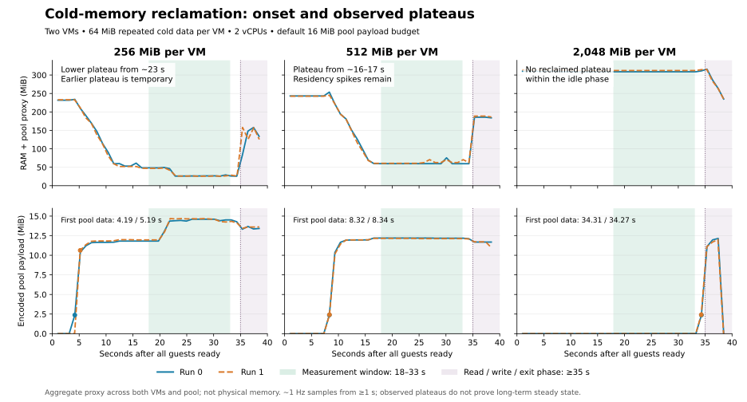

# VM 内存：冷页回收、offload 与完整快照

[主要结论](#conclusions) · [Motivation](#motivation) · [实验设计](#experiment-design) · [实验数据](#experiment-data) · [分析与使用建议](#analysis) · [机制设计](../../design/memory-sharing/index.md)

本文记录闲置 VM 的内存回收、再次访问与完整快照恢复的收益和代价。2026-10-03 的 macOS ARM64 / HVF 数据覆盖共享冷页回收；Linux x86_64 / KVM 数据覆盖 pause/resume、raw/compressed offload 和完整快照。两组环境、负载与计时边界分别说明，原始数据按平台保留。

## 一、主要结论 {#conclusions}

**macOS/HVF 共享池在 256 MiB、512 MiB 和 2 GiB 配置中均观察到冷 RAM 回收。** 它适合重复、可压缩且允许较长静默期的数据；延迟敏感或短任务应优先保持关闭。2 GiB 的主结论采用 60–90 秒的持续窗口，末尾短暂低点保留为描述性证据。

### macOS/HVF：共享冷页核心测量 {#measurements}

这里的 **RAM 代理** 是驻留 guest RAM、待回收页、临时快照和池编码数据的合计，用于判断冷页是否被回收。它不是整机物理内存。下表均为两台 VM 的合计，每台 2 vCPU、默认池预算、相同重复冷数据。

| 每 VM 配置内存 | 观察时间：全部 guest 就绪后 | RAM 代理：关闭池 → 启用池 | 约降低 |
|---|---|---|---|
| 256 MiB | 18–33 秒 | 231 → 27 MiB | **89%** |
| 512 MiB | 18–33 秒 | 243 → 61 MiB | **75%** |
| 2 GiB | 60–90 秒 | 309 → 124 MiB | **60%** |

不同容量需要不同的回收时间；此表说明各配置已经观察到的收益，不用来比较同等任务时长下的优劣。数值为便于阅读的四舍五入，精确结果、配对范围和其他配置见[结果页](#experiment-data)。

**需要同时接受的代价：** 2 GiB 延长实验首次完整读取 64 MiB 从约 20 ms 增至 164 ms，全程还增加 CPU 消耗。macOS 的 footprint 账目也增加，因此目前能确认的是冷 RAM 驻留下降，尚不能承诺整机物理内存或压力改善。[访问代价](#performance)和[物理账目](#physical)给出完整证据。

### Linux：显式 offload 与完整快照 {#linux-summary}

256 MiB / 2 vCPU / raw 的 pause P50 为 **0.24 ms**，offload 为 **22.98 ms**；完整快照保存为 **712 ms**，恢复至 guest heartbeat 为 **933 ms**。压缩格式降低磁盘占用，但增加保存和恢复时间。[生命周期分布](#linux-lifecycle)与[完整快照结果](#linux-snapshot)包含全部规格、P95 和正确性检查。

共享冷页 pager 当前仅支持 macOS/ARM64。Linux 的 offload 是显式暂停并写回 RAM，完整快照还包含 CPU、设备与文件系统状态；这些数字与上面的自动冷页回收收益分别解释。macOS 的 CLI 启动结果继续保留在[启动延迟](../startup.md)中。

## 二、Motivation：为什么测冷内存 {#motivation}

一台 VM 的配置容量、当前驻留 RAM、进程 footprint 和全机物理压力回答不同的问题。对于已经分配但长时间不访问的数据，pVisor 的实验路径由宿主观察冷页，将内容压缩并在同节点池中共享，再按访问恢复私有 RAM；既要测回收，也要测恢复。

只记录一次空闲读数不足以判断这条路径。扫描时间随 guest 地址容量增长，短窗口可能结束在回收开始之前；短暂低点也可能被后续访问打断。因此实验同时比较参数、时间曲线和恢复代价，并单独记录 footprint 与宿主压力。

本轮验证的是机制是否对受控负载有效，以及哪些条件值得用户继续验证。真实 Agent 的端到端收益、更多实例容量和整机物理节约需要各自的证据。

## 三、实验设计 {#experiment-design}

### macOS/HVF：共享冷页实验范围 {#scope}

2026-10-03 固定构建快照后执行，使用 `just build release` 构建并签名的
真实 `pvisor run` 和 `pvisor-memory-pool`，不使用旧 SDK fixture 的结果替代
CLI 测量。每个 VM 运行同一个静态 Linux 程序，实际分配并访问 64 MiB 数据。
这是内存机制的受控负载，不是 Ubuntu、Python Agent、LLM 推理或编译项目的
端到端基准。镜像下载、构建和 rootfs 准备不计入运行样本。

| 环境 | 本轮条件 |
|---|---|
| 宿主 | Apple M4，24 GiB RAM；macOS 27.0.1 / 26A434 |
| pVisor | 0.3.0；记录提交号、工作树运行源码与签名二进制 SHA-256 |
| VM 后端 | 本地修补 libkrun / krun-hvf 1.19.3；HVF |
| 固件 | 已有 libkrunfw 5.5.0 缓存；记录实际 dylib SHA-256 |
| guest 程序 | Rust 1.98.0，aarch64 Linux musl，优化级别 2 |
| 宿主页 | 16 KiB；pager 块 64 KiB |
| 观测 | 每秒采样进程与宿主；所有成功 case 同样开启实验诊断 |
| 压力控制 | 不增加额外压力分配器；观测真实 NORMAL / WARN，critical 时停止 |

测量针对本轮固定的构建快照。并行工作的后续源码修改或重新构建不进入这组数据；二进制摘要、构建时 runtime 工作树差异与实验源文件保存在 evidence 中，不能把本报告称作后续全部代码的验证。

### macOS/HVF：两组冷页数据分别回答什么 {#datasets}

| 数据集 | 运行数 | 要回答的问题 | 主要观察窗口 |
|---|---:|---|---|
| 35 秒参数矩阵 | 40 | 相同任务时长下，不同参数与负载怎样影响回收和恢复 | ready 后 18–33 秒 |
| 2 GiB 延长观察 | 4 | 大容量 VM 在扫描启动后是否继续回收 | ready 后 60–90、120–150、150–175 秒 |

两组使用相同固定 CLI、池与固件，不合并成一个节约率。175–178 秒的末段在查看首轮曲线后作为描述性补充，每次只有三个采样，不能代替预设窗口或稳态验收。首页采用四舍五入后的代表性结果；完整证据保留原精度。

### 参数与负载矩阵 {#design-matrix}

每个配置比较共享池关闭与开启，各重复两次；第二次反转配对顺序。
正式计划为 10 个配置、20 对、40 个成功 case。重复次数不够支持可靠的
跨运行 p95/p99 或置信区间，因此保留两次配对的范围，不把多个秒级采样点
当作独立重复实验。

| 变量 | 设置 |
|---|---|
| 每 VM 内存 | `--memory 256MiB` / `512MiB` / `2048MiB` |
| vCPU | `--cpu 1` / `2` |
| VM 数 | 单 VM / 同时两个 VM；后者共享同一个池 |
| 共享池 | 未指定 / `--vm-memory-pool SOCKET` |
| 池 payload 上限 | 默认 16 MiB / `--max-bytes 1048576` |
| RAM 文件 | 自动临时 backing / `--vm-ram-backing FILE` |
| 重复冷数据 | 64 MiB 周期性字节序列，两 VM 初始内容相同 |
| 随机冷数据 | 各 VM 使用独立种子的 xorshift 内容，不假设可压缩或可共享 |
| 热数据 | 每 50 ms 扫描各 4 KiB 页，使用编译器屏障避免读取被消除 |
| 网络 | 相同冷数据＋OverlayNet TCP loopback echo；每 VM 三次 32 MiB，校验内容 |

所有 guest 就绪后，第 18–33 秒作为固定观测窗口。它是统一时间窗口，
**不保证所有配置已进入稳态**；大 VM 的扫描与回收可能仍在推进。之后
完整读取 64 MiB 三次，每次间隔两秒，并保留首次与后续访问的耗时。
后续读取也可能再次触发冷恢复，不能把它们自动称为“热读”。

校验主体是单线程；1／2 vCPU 对比覆盖参数可运行性与该负载代价，不是多线程应用的 CPU 扩展性结论。每台 VM 的 64 MiB 首次读先求 VM 间中位数，再求两次运行中位数；倍率按每对计算，可能不同于汇总耗时相除。

本轮是**相同任务时长下的启动阶段比较**，不是所有容量的稳态比较。2 GiB 配置在统计窗口内池 payload 为 0，首次非零采样约在 ready 后 34.3 秒；[结果页](#scan-startup)给出扫描机制、时间证据和后续稳态测量要求。

### 内存、压力与性能口径 {#metrics}

| 指标 | 计算 / 范围 | 不代表什么 |
|---|---|---|
| RAM＋池代理 | 各 runner 的 RAM 驻留诊断＋待文件回收字节＋暂存快照字节＋池编码 payload | 不是全部进程或全机唯一物理页；不含所有元数据 |
| 进程组 footprint 账目 | 各 CLI、runner、池的原生 `proc_pid_rusage` footprint 相加 | 文件缓存和共享归因与 RAM 代理不同，不能互相替代 |
| 进程组 RSS 总和 | 同一组进程的 resident size 相加 | 共享页可能重复计量，不是唯一物理内存 |
| 全机压力 | `kern.memorystatus_vm_pressure_level`，1 NORMAL / 2 WARN / 4 critical | 不是只由 pVisor 造成的压力 |
| 宿主压缩器 | `vm_stat` 的 occupied pages × 实际页大小 | stored pages 是逻辑未压缩页数，不能替代物理占用 |
| swap 变化 | 每 case 首尾的全机 swap used 差 | 不可直接归因给当前配置 |
| CPU 秒 | CLI＋runner＋池的原生 CPU 计数，经 Mach timebase 转为秒 | 采样可能漏掉退出前尾段；不包含 Python 观测器 |
| 首次读取 | guest 完整读取 64 MiB 的校验耗时 | 不是单页 fault 或一般 shell 命令延迟 |
| 维护屏障 | 两阶段发布的同轮屏障调用合计；保留各运行 P95 与最大值 | 不包括屏障外发布，也不是总访问延迟 |
| 冷恢复最大值 | pager 记录的单块 restore 最大耗时 | 不是整段 64 MiB 的完整恢复时间 |

CPU 原始值不能直接当作纳秒。本机 Mach timebase 为 125/3；使用自有
短时 CPU 负载与 `time.process_time()` 校准。内核填充字段的位置见
[Apple XNU `fill_task_rusage`](https://github.com/apple-oss-distributions/xnu/blob/main/osfmk/kern/bsd_kern.c)。
正式记录同时保存原始 ticks、换算后的 ns 和校准比值。

节约率按每对 `1 - pool / baseline` 计算，再汇总两次配对。运行内的 P95
来自该运行的维护事件；两次运行的 P95 汇总不能解释为全体事件的 P95。
保留中位数、采样最大值、首次唤醒和恢复峰值，避免只展示安静期的最佳数字。

屏障指标测量两次调用的墙钟耗时，可能包含调度和等待，不是 vCPU 停止时间的精确累计。单／双 VM 还改变每 VM 可分的共享预算，不能独立识别去重贡献。

每秒观测不是跨进程原子快照，RAM 诊断、池 payload 与宿主计数存在采样时间差；RAM 记录要求可用且不超过三秒旧。所谓峰值都是观测到的采样最大值或日志事件最大值，不是未观测间隙的硬上界。

### 限制与停止条件 {#experiment-limits}

同一台宿主还有其他应用，后台负载没有被隔离。宿主压缩器、swap 和压力
变化只作为环境与停止依据；本轮不宣布完整物理内存验收通过。两次重复也
不能证明长期稳定性、应用覆盖或生产 SLA。

守卫在 critical、swap 相比本轮起点增长至少 2 GiB，或可用磁盘低于 4 GiB
时停止。没有关闭其他应用、索取管理员密码、自动启用 macFUSE，或降低
已有物理收益验收门槛。

配对在同一宿主顺序执行，但不保证压力等级或后台负载完全一致；压力表逐模式、逐重复公开环境变化，不能把这个实验当作隔离主机上的因果压力实验。

### 复现 {#reproduce}

先设置已有固件目录；输出目录必须不存在，避免覆盖旧数据。命令只适用于
可运行 HVF 的 Apple Silicon macOS，需要允许宿主 socket 与 Hypervisor。

```bash
just build release
FIRMWARE_DIR=/path/to/pvisor/firmware/5.5.0/macos-aarch64
EXPERIMENT_BIN=$(mktemp -d /tmp/pvisor-memory-bin.XXXXXX)
cp target/release/pvisor target/release/pvisor-memory-pool "$EXPERIMENT_BIN/"
codesign --verify --strict "$EXPERIMENT_BIN/pvisor"
python3 tools/experiments/macos-memory/cli_decision_matrix.py \
  --firmware "$FIRMWARE_DIR" \
  --binary-dir "$EXPERIMENT_BIN" \
  --output target/memory-cli-matrix-new \
  --repeats 2
```

原始记录使用独立 `pvisor-memory-cli-matrix/v1` schema，不伪装成现有 host
microbenchmark 的 `pvisor-benchmark/v1`。每个 case 保留完整参数、stdout、
stderr、进程身份与时钟计数、宿主 `vm_stat`、池统计和校验结果。
汇总器重新核对配对、输入内容、CPU 单位、RAM 代理和引用回收，失败样本
留在原目录中，不参与成功样本的性能比较。

复制签名后的可执行文件是为了隔离同时发生的构建。正式案例启动与结束均核验 CLI SHA-256，所有配对必须匹配矩阵记录中的同一摘要。不要从正在被构建覆盖的 `target/release` 持续启动样本。

### 2 GiB 延长观察复现 {#long-idle-reproduce}

在独立输出目录运行同一固定二进制，保留两次配对与反转顺序。默认仍为 35 秒；补测只增加等待时长和与之匹配的超时。下列路径需替换为实际的固定二进制、固件及输出目录。[结果页](#long-idle-2048)区分预设窗口和描述性末段。

```bash
python3 tools/experiments/macos-memory/cli_decision_matrix.py \
  --binary-dir /path/to/frozen-binaries \
  --firmware /path/to/firmware \
  --output /path/to/evidence/cases \
  --only cold-2048-dual --idle-seconds 180 --repeats 2
python3 tools/experiments/macos-memory/long_idle_report.py /path/to/evidence
```

### Linux/KVM：生命周期与完整快照实验设计 {#linux-methodology}

2026-10-03 在 AMD Ryzen 7 9700X / Linux KVM 上验证 pause/resume、RAM offload、压缩 backing 和完整 VM 快照。413 项 Rust 定向测试通过，Python 64 项通过、16 项跳过；六个 VM 文档黑盒场景通过（执行 PASS，审阅状态 UNREVIEWED）。生命周期共 180 个有效计时样本，全部通过 guest 内存校验。

静态 musl 发布制品也通过 raw/compressed 双 fork 功能 smoke；其数据单列，不混入 GNU 性能分布。

完整快照使用 `pvisor snapshot` 独立入口。raw 和 compressed 各 10 次有效运行，每次终止源 VM、删除源目录，再恢复两个独立 fork；全部通过。本轮不把这些结果推广为普通 Job 的 `checkpoint --kind execution` 已接通。多 VM 共享冷页 pager 当前只支持 macOS/ARM64，Linux 会拒绝 `vm.memory_pool`；这里验证了共享池跨进程协议，不能从本机数据推导 HVF 的物理内存收益。

| 项目 | 条件 |
|---|---|
| 宿主 | AMD Ryzen 7 9700X，8 核 / 16 线程，约 30 GiB 可用总 RAM |
| 系统 | Fedora；Linux 7.2.8-200.fc44.x86_64；KVM、FUSE |
| 制品 | release 构建；工作区包含未提交及并行修改，以原始报告中的二进制 SHA-256 为准 |
| RAM 文件 | 本地磁盘上的稀疏文件；FUSE 压缩模式单独统计 |
| 生命周期负载 | Python guest，64 MiB 固定数据 SHA-256 校验，另有 1 MiB 可变数据与 heartbeat |
| 生命周期样本 | 每组 3 次预热、30 次计时；1/2/4 vCPU、256/512/2048 MiB；同一个 VM 内连续采样 |
| 完整快照负载 | 静态 musl guest，64 MiB 数据、RAM 计数、打开的文件及目录游标、初始化只允许执行一次 |
| 快照样本 | 每种格式 2 次预热、10 次计时；2 vCPU / 256 MiB；每次从独立 VM 保存、恢复两个 fork |

P50/P95 对有效样本做线性插值，不把预热计入结果。快照恢复先取每次两个 fork 的中位数，再对 10 次独立运行汇总；不把两个 fork 当成 20 次独立重复。样本量用于本机描述，不给出稳健的跨机器 P99 或置信区间。宿主缓存已预热，环境存在日常后台负载。

## 四、实验数据 {#experiment-data}

<a id="validity"></a>

macOS 共享冷页参数矩阵为 40 次运行，2 GiB 延长观察增加 4 次。全部成功运行通过三次内容校验、本 VM 私有修改校验及退出引用清理。两组使用同一固定 CLI、池与固件；下面分别展示，不合并成一个节约率。精确表格可展开查看，原始数据未删减。

### 2 GiB：把回收过程看完整 {#long-idle-2048}

同一固定版本，将静默观察从 35 秒延长到 180 秒；每台仍为 64 MiB 重复冷数据，两台 VM、2 vCPU、默认 16 MiB 池预算。两次配对反转顺序，隔离配置变化和观察时间的区别。

**持续窗口中的结果是约 60% 的 RAM 代理下降：关闭池约 309 MiB，启用池约 124 MiB。** 这是 ready 后 60–90 秒的采样结果，两次配对接近。约 34 秒之前还处于扫描启动阶段，所以原短窗口几乎没有回收收益。


图中上排为 RAM 代理，中排为池编码数据，下排为 footprint；实线／虚线为两次运行。接近三分钟时再出现一轮下降，随后读取使 RAM 回升。末尾短段的精确数据保留在下面，但只持续数秒，尚不能称为稳态。首次访问和 CPU 的代价见[性能](#performance)，footprint 增加的结果见[物理账目](#physical)。

??? note "逐窗口精确数据（包含启动阶段和描述性末段）"

    | ready 后窗口（秒） | RAM 代理 MiB 关闭／启用 | 配对节约中位数（范围） | footprint 合计 MiB 关闭／启用 |
    |---|---|---|---|
    | 18–33 | 309.0 / 310.1 | -0.3% (-1.1–0.4%) | 18.0 / 30.4 |
    | 60–90 | 309.0 / 124.2 | 59.8% (59.7–59.9%) | 18.0 / 47.2 |
    | 120–150 | 309.0 / 124.5 | 59.7% (59.6–59.8%) | 18.0 / 48.7 |
    | 150–175 | 309.0 / 124.4 | 59.7% (59.6–59.9%) | 18.0 / 49.1 |
    | 175–178* | 309.0 / 28.6 | 90.7% (90.7–90.8%) | 18.0 / 52.3 |

??? note "窗口口径、恢复代价和平台判定细节"

    窗口内先求每个 case 的采样中位数，再汇总两次配对；范围不是置信区间。带 * 的 175–178 秒是看过首轮曲线后追加的描述性末段，每次仅少量采样，不属于预设窗口或稳态证据。只纳入两台 runner 均有诊断且诊断年龄不超过 3 秒的样本。180 秒后的恢复与退出阶段不参与静默收益判断。RAM 代理包含驻留 RAM、待回收文件页、临时快照及池 payload；footprint 是另一种账目，不能互相替代。

    **2 GiB 配置也能显著降低本负载的 RAM 驻留。** 两次运行在约 34 秒开始提交冷页，60–90 秒的代理量从关闭池的约 309 MiB 降到约 124 MiB，配对节约 59.7%–59.9%；约 166–176 秒又出现一轮下降，175–178 秒描述性末段约 28.6 MiB，配对节约约 90.7%。中间低平台有瞬时上升，末尾较低平台只观察了几秒；**两次运行都未通过完整的预设平台判定，最终稳态时间仍未知**。这组曲线证明本负载上的回收效果，不证明任意 2 GiB 应用都能获得相同比例。

    代价：全程采样 CPU 关闭／启用约 23.6／40.2 秒，配对额外 CPU 为 15.9–17.2 秒；首次 64 MiB 读取约 20.3／164.1 ms，配对慢 7.3–8.8 倍。末段 footprint 账目约 18.0／52.3 MiB，仍增加约 190%；池 payload 接近 16 MiB 上限，全程容量拒绝分别为 30／25 次，内容校验和退出引用清理仍全部通过。四次运行的宿主压力均为 WARN，未触发中止保护；全机压缩器与 swap 受其他应用影响，本补测不能证明整机物理压力改善。诊断在两组均启用，CPU 数字也包含诊断开销。

    预先设定的平台条件：每个 30 秒窗口至少 25 个有效采样；RAM 代理跨度不超过 max(4 MiB, 中位数的 10%)，池 payload 非零且跨度不超过中位数的 10%，RAM 代理的最小二乘趋势绝对值不超过 1 MiB／30 秒。平台起点还要求后续所有完整滚动窗口直至 175 秒均满足条件。此条件只刻画本实验，不是生产稳态保证。

[完整曲线 CSV](assets/2048-long-idle.csv) · [独立复核 JSON](assets/2048-long-idle.json)。原始运行、预先记录的 protocol、输入源码快照与哈希位于 `review_project/06-evidence/macos-memory/cli-2048-long-idle-2026-10-03/`；运行记录在其 `cases/` 下，二进制源码归属沿用原矩阵的 `input-provenance.json`，不使用补测时工作树哈希冒充二进制来源。

### 参数怎样影响收益 {#matrix}

默认预算下，重复冷数据是收益最明显的负载。持续触碰的数据、独立随机内容或较小池预算，会降低回收效果；显式 RAM 文件与默认 backing 的结果接近，文件选项本身不提供额外压缩或共享。单 VM 的收益包含冷压缩，不能全部归因于跨 VM 去重。

以下原矩阵只比较 ready 后 18–33 秒，适合观察相同任务时长的行为。2 GiB 在该窗口尚未开始向池提交冷页，因此其接近零的节约率与上方长时间实验的收益并不矛盾。短任务和长静默任务回答的是不同的使用问题。

??? note "完整 35 秒参数矩阵与配对范围"

    | 配置 | RAM 代理 MiB 关闭／启用 | 代理节约 | 额外 CPU 秒 | 首次读 ms 关闭／启用 |
    |---|---|---|---|---|
    | cold-2048-dual | 311.7 / 310.6 | 0.4% | +0.89 | 24.4 / 15.6 |
    | cold-256-cpu1 | 224.1 / 25.2 | 88.8% | +3.94 | 19.7 / 184.1 |
    | cold-256-dual | 231.4 / 26.5 | 88.6% | +4.69 | 23.3 / 176.9 |
    | cold-256-file | 232.0 / 26.1 | 88.7% | +3.66 | 18.4 / 181.3 |
    | cold-256-pool1 | 231.5 / 201.1 | 13.1% | +3.57 | 28.5 / 31.7 |
    | cold-256-single | 115.6 / 19.1 | 83.5% | +2.34 | 18.5 / 189.8 |
    | cold-512-dual | 242.8 / 60.7 | 75.0% | +5.12 | 22.1 / 168.9 |
    | hot-256-dual | 230.1 / 155.7 | 32.4% | +2.55 | 9.1 / 5.5 |
    | network-256-dual | 231.7 / 26.3 | 88.6% | +3.83 | 24.7 / 183.5 |
    | random-256-dual | 230.9 / 187.4 | 18.8% | +3.61 | 22.4 / 26.4 |

    | 配置 | 节约配对范围 | 窗口采样最大值节约 | 跨会话对象最大数 | 容量拒绝计数最大值 |
    |---|---|---|---|---|
    | cold-2048-dual | -0.6–1.3% | 0.6% | 256 | 0 |
    | cold-256-cpu1 | 88.8–88.8% | 76.6% | 597 | 0 |
    | cold-256-dual | 88.5–88.6% | 78.9% | 596 | 0 |
    | cold-256-file | 88.7–88.8% | 74.9% | 583 | 0 |
    | cold-256-pool1 | 12.7–13.5% | 12.7% | 44 | 2173 |
    | cold-256-single | 83.5–83.5% | 74.0% | 0 | 0 |
    | cold-512-dual | 74.7–75.3% | 69.9% | 506 | 0 |
    | hot-256-dual | 32.0–32.7% | 30.1% | 525 | 0 |
    | network-256-dual | 88.5–88.7% | 78.0% | 598 | 0 |
    | random-256-dual | 15.5–22.1% | 15.2% | 254 | 1734 |

    每个 case 的内存取所有 guest ready 后第 18–33 秒的采样中位数；上表再汇总两次配对，范围不是置信区间。“采样最大值节约”仍限于这个窗口，不是从启动到退出的全程峰值。跨会话对象来自 runner 统计，说明共享对象存在，不量化它独立贡献了多少节约。

### Linux/KVM：pause/resume 与 offload {#linux-lifecycle}

单位 ms；每格为 **P50 / P95**。pause、resume 和 offload 是 SDK 调用开始至宿主确认完成，包含控制交换与事件持久化。offload 自动暂停、写回并请求回收 RAM；返回后仍需 resume。

| MiB / vCPU / backing | pause | resume | offload | offload resume | heartbeat |
|---|---:|---:|---:|---:|---:|
| 256 / 1 / raw | 0.24 / 0.30 | 0.26 / 0.34 | 20.43 / 21.76 | 0.28 / 0.37 | 49.57 / 51.92 |
| 256 / 2 / raw | 0.24 / 0.31 | 0.29 / 0.35 | 22.98 / 24.90 | 0.29 / 0.40 | 46.79 / 49.83 |
| 256 / 4 / raw | 0.25 / 0.36 | 0.27 / 0.35 | 22.93 / 25.60 | 0.29 / 0.35 | 43.61 / 46.87 |
| 512 / 2 / raw | 0.24 / 0.31 | 0.28 / 0.35 | 26.44 / 29.35 | 0.28 / 0.39 | 44.63 / 46.74 |
| 2048 / 2 / raw | 0.21 / 0.27 | 0.23 / 0.31 | 23.86 / 28.80 | 0.26 / 0.32 | 40.39 / 46.71 |
| 256 / 2 / compressed | 0.21 / 0.33 | 0.25 / 0.40 | 66.93 / 505.43 | 0.24 / 0.31 | 175.09 / 203.24 |

`offload resume` 测的是控制调用返回；`heartbeat` 测的是从恢复调用开始到 guest 首次推进。两者不是同一个就绪指标。

| MiB / vCPU / backing | 64 MiB read before offload (ms) | First complete read after offload (ms) | Backing allocation (MiB, P50) |
|---|---:|---:|---:|
| 256 / 1 / raw | 32.12 / 32.31 | 109.02 / 111.56 | 200.80 |
| 256 / 2 / raw | 32.12 / 32.37 | 109.49 / 110.84 | 202.23 |
| 256 / 4 / raw | 32.10 / 32.93 | 114.85 / 117.64 | 203.99 |
| 512 / 2 / raw | 32.15 / 32.48 | 115.15 / 117.42 | 206.30 |
| 2048 / 2 / raw | 25.03 / 31.91 | 86.12 / 109.30 | 235.91 |
| 256 / 2 / compressed | 25.06 / 27.64 | 698.71 / 754.50 | 23.96 |

配置容量不等于实际被工作负载写入的字节。2 GiB guest 仍只分配同一段 64 MiB 数据，不能把它解释为写回了 2 GiB 脏 RAM 的吞吐量。backing 的逻辑 RAM 范围比配置容量大约 36.4 MiB，包含低地址内存与单独的 kernel 区域。

所有组的 offload 后即时 mincore 采样均为 0，说明该次映射驻留采样下降；这是 file-backed RAM 的观测，不能等同于全机物理内存下降或进程 RSS 归零。首次重新访问会重新带入页面。压缩模式的磁盘空间更小，但完整首次读取与尾延迟更高。

另有一次 60 秒暂停的真实 guest 验证：暂停期间 heartbeat 不推进；恢复后内存 SHA-256 和可变数据保持。该组最初采样与诊断工作重叠，保留为正确性及原始证据，首页 2 vCPU 的性能使用后续独立顺序采样。

### Linux/KVM：完整 checkpoint 保存与双 fork 恢复 {#linux-snapshot}

`save` 包含 CLI 启动、全部 vCPU/设备冻结、CPU/设备/RAM 捕获、文件复制、校验、持久发布，以及源 runner 退出。`restore heartbeat` 从新 CLI 启动到恢复 guest 首次 heartbeat 更新，包含兼容性检查、RAM 解码/校验与私有文件副本；不是仅恢复寄存器的耗时。

| RAM storage | save (ms, P50 / P95) | restore heartbeat (ms, P50 / P95) | Published allocation (MiB, P50 / P95) |
|---|---:|---:|---:|
| raw | 712.11 / 819.75 | 932.88 / 1034.90 | 296.99 / 296.99 |
| compressed | 1236.62 / 1343.63 | 1920.23 / 1947.43 | 16.48 / 16.58 |

磁盘数值是单个已发布对象下文件的 `st_blocks × 512` 合计，不包含活动 fork、临时制品或进程内存，也不是共享冷页池的节约率。该 guest 数据重复且可压缩，不代表任意 Agent 的压缩率。

每次运行检查：源 VM 退出后仍可恢复；源 rootfs 删除不影响快照；guest 初始化不会再次执行；64 MiB 数据及可变计数连续；打开文件偏移仍为 2；目录迭代可继续；fork0 的写入不影响 fork1 或已发布对象。存储测试另外覆盖损坏、截断、缺失块、兼容性拒绝、压缩块跨快照共享及最后引用释放后回收。

本轮修复了 Linux 构建与快照平台调用问题、KVM VM 时钟/中断控制器和 PIO 状态遗漏，以及恢复时独立 kernel RAM 区域遗漏。宿主请求改为原子发布，避免测试脚本在截断写入过程中向 guest 发出空请求。失败诊断保留在本机 `target/local-vm-validation-20261003/`，失败轮不计入上表。

## 五、分析与使用建议 {#analysis}

以下分析针对 macOS/HVF 共享冷页实验。Linux offload 的首次读取、压缩开销及完整快照恢复结果分别见[生命周期](#linux-lifecycle)与[快照](#linux-snapshot)章节。

回收量、等待时间和首次访问代价共同决定适用场景。以下先讨论代价与内存账目，再解释扫描过程和容量曲线，最后给出启用方式与复核入口。

### 使用代价：第一次访问与 CPU {#performance}

回收后的数据需要恢复。2 GiB 长时间实验第一次完整读取 64 MiB 从约 20 ms 增至 164 ms；两次配对分别慢 7.3–8.8 倍，全程额外采样 CPU 为 15.9–17.2 秒。延迟敏感任务应把这项成本放在启用决策之前。这不是单页 fault 延迟，也不是一般 shell 命令的端到端延迟。

原短窗口中尚未回收的 2 GiB 数据，首次读取没有触发同等规模的冷恢复；其中较快的读数不能解释为共享池加速。热访问和网络 echo 中的较快结果也只代表该次受控测量，不支持普遍加速结论。

??? note "原 35 秒矩阵的性能数据与计量解释"

    | 配置 | CPU 秒关闭／启用 | 首次读倍率 | 重复读 ms 关闭／启用 | 屏障 P95／最大 ms | 单块恢复最大 ms | 网络 burst 耗时倍率／范围 |
    |---|---|---|---|---|---|---|
    | cold-2048-dual | 5.76 / 6.65 | 0.7× | 7.4 / 12.9 | 49.91 / 60.71 | 0.29 | — |
    | cold-256-cpu1 | 1.80 / 5.74 | 9.4× | 5.3 / 63.4 | 3.28 / 52.60 | 15.62 | — |
    | cold-256-dual | 1.90 / 6.59 | 7.6× | 8.3 / 54.3 | 3.58 / 14.80 | 4.72 | — |
    | cold-256-file | 2.06 / 5.72 | 11.2× | 6.2 / 57.8 | 7.51 / 99.05 | 18.23 | — |
    | cold-256-pool1 | 1.93 / 5.50 | 1.1× | 4.6 / 13.5 | 3.12 / 25.82 | 1.04 | — |
    | cold-256-single | 0.96 / 3.30 | 10.8× | 8.0 / 68.1 | 3.02 / 6.21 | 14.71 | — |
    | cold-512-dual | 2.63 / 7.75 | 7.9× | 6.5 / 7.5 | 3.71 / 17.02 | 10.18 | — |
    | hot-256-dual | 2.49 / 5.04 | 0.6× | 7.5 / 49.3 | 3.09 / 24.75 | 14.07 | — |
    | network-256-dual | 5.06 / 8.89 | 8.6× | 5.7 / 68.6 | 3.33 / 13.35 | 10.67 | 0.58× (0.50–0.66) |
    | random-256-dual | 2.17 / 5.79 | 1.2× | 7.0 / 12.9 | 3.23 / 34.27 | 23.17 | — |

    CPU 是 CLI、runner 和池的原生计数之和，按 Mach timebase 转换，包含启动与执行；每秒采样可能漏掉退出尾部。它不是宿主总 CPU，也不包含观察脚本。第一次读校验整个 64 MiB；后两次相隔两秒，可能再次冷恢复，因此称“重复读”而不是保证的热读。屏障 P95 是每个 run 内两次屏障调用耗时之和的事件 P95，再对两次 run 汇总；不包含屏障外发布时间。最大恢复耗时是一个 64 KiB 块的最大值。

    网络组合通过 OverlayNet 向宿主回环 echo 服务传输。每个 VM 发起三次连接，每次完整核验 32 MiB 回传；这只覆盖 TCP echo，不代表 DNS、Gateway/LLM、UDP 或真实互联网吞吐。回环规则显式设置 allowlist 和 `allow_private_ips=true`，避免把网络授权失败误计作吞吐。

    热负载只在 35 秒观察阶段持续扫描，进入校验阶段后停止热扫。因此第一次读可保留热态，后两次间隔两秒时可重新变冷；不能把第一次热读更快当作共享池加速计算的证明。网络倍率也只描述这两次配对的 echo 结果，不能推导普遍网络加速。

### 驻留下降与物理账目 {#physical}

RAM 代理回答“冷 guest RAM 是否已回收”；footprint 回答 macOS 对进程的另一套内存记账问题。文件页和共享页的归因不同，池、快照及元数据也产生开销，两种指标不能互相替代或相减后当作净物理收益。

2 GiB 长时间实验的末段，RAM 代理约为关闭／启用 309／29 MiB，而 footprint 账目约为 18／52 MiB。**驻留回收有效，但 footprint 没有随之下降。** 原矩阵也观察到 footprint 增加，因此本报告不承诺整机物理内存节约或更多实例容量。首页的曲线同时呈现这两类结果。

全机压力、压缩器与 swap 还受宿主其他应用影响，使用它们作为环境记录和中止保护，不能把首尾变化归因于某个 VM。2 GiB 补测四次运行均为 WARN，没有触发中止保护；实际物理压力改善仍需独立验证。

??? note "完整 footprint、RSS 与宿主环境记录"

    | 配置 | Footprint MiB 关闭／启用 | Footprint 变化 | RSS MiB 关闭／启用 | 全程采样最大 footprint MiB 关闭／启用 |
    |---|---|---|---|---|
    | cold-2048-dual | 18.0 / 31.9 | +77.7% | 440.7 / 260.0 | 18.0 / 71.5 |
    | cold-256-cpu1 | 17.7 / 50.3 | +185.0% | 343.2 / 135.9 | 17.7 / 228.4 |
    | cold-256-dual | 17.9 / 47.7 | +166.2% | 356.3 / 148.2 | 17.9 / 206.9 |
    | cold-256-file | 17.9 / 41.1 | +129.3% | 361.6 / 149.0 | 17.9 / 214.3 |
    | cold-256-pool1 | 18.0 / 24.3 | +34.9% | 361.6 / 325.1 | 18.0 / 42.8 |
    | cold-256-single | 8.9 / 35.9 | +301.8% | 177.7 / 85.2 | 8.9 / 145.2 |
    | cold-512-dual | 18.0 / 47.2 | +161.3% | 372.6 / 157.4 | 18.0 / 298.3 |
    | hot-256-dual | 18.0 / 40.5 | +125.3% | 360.2 / 282.4 | 18.0 / 108.3 |
    | network-256-dual | 17.9 / 40.3 | +124.5% | 362.1 / 149.6 | 19.4 / 288.7 |
    | random-256-dual | 17.9 / 40.9 | +128.5% | 360.4 / 313.0 | 17.9 / 56.5 |

    | 配置 | 共享池 | 压力状态 r0／r1 | Swap 变化 MiB r0／r1 | 物理压缩器变化 MiB r0／r1 |
    |---|---|---|---|---|
    | cold-2048-dual | 关闭 | NORMAL/NORMAL | +0.0/+0.0 | +73.9/-34.9 |
    | cold-2048-dual | 启用 | NORMAL/NORMAL | +0.0/+0.0 | -115.8/+91.1 |
    | cold-256-cpu1 | 关闭 | NORMAL/NORMAL,WARN | +0.0/+0.0 | +322.8/-770.5 |
    | cold-256-cpu1 | 启用 | NORMAL,WARN/NORMAL | -32.0/+0.0 | +465.8/+661.4 |
    | cold-256-dual | 关闭 | NORMAL/WARN | -24.0/+0.0 | -155.1/+517.9 |
    | cold-256-dual | 启用 | NORMAL/WARN | +0.0/+0.0 | -9.0/-288.0 |
    | cold-256-file | 关闭 | WARN/WARN | +0.0/+0.0 | +189.1/-13.2 |
    | cold-256-file | 启用 | WARN/WARN | +0.0/+0.0 | -675.0/-19.1 |
    | cold-256-pool1 | 关闭 | WARN/WARN | +0.0/+0.0 | +633.5/-21.8 |
    | cold-256-pool1 | 启用 | WARN/WARN | +0.0/+0.0 | +353.4/-184.5 |
    | cold-256-single | 关闭 | NORMAL/NORMAL | +0.0/+0.0 | -9.2/+1036.7 |
    | cold-256-single | 启用 | NORMAL/NORMAL | +0.0/+0.0 | +56.7/-54.2 |
    | cold-512-dual | 关闭 | NORMAL/NORMAL,WARN | -8.0/-8.1 | -122.2/-639.2 |
    | cold-512-dual | 启用 | NORMAL/WARN | +0.0/+0.0 | -58.0/-167.7 |
    | hot-256-dual | 关闭 | WARN/WARN | +0.0/+0.0 | -66.1/-121.6 |
    | hot-256-dual | 启用 | WARN/WARN | +0.0/+0.0 | +213.1/-245.7 |
    | network-256-dual | 关闭 | WARN/WARN | +0.0/+0.0 | -69.0/+189.8 |
    | network-256-dual | 启用 | WARN/WARN | +0.0/+0.0 | -88.3/+296.0 |
    | random-256-dual | 关闭 | WARN/WARN | +0.0/+0.0 | -424.0/+23.1 |
    | random-256-dual | 启用 | WARN/WARN | -24.0/+0.0 | +122.2/+670.3 |

    这里必须区分三个事实：RAM 代理量下降；进程组 footprint 是否同向下降；整机压力是否变化。它们不是同一种账目，也不能相加：RSS 会重复计算共享页，file-backed RAM 的 footprint 记账与 RAM 驻留不同，整机压缩器还包含其他应用。某些案例中宿主压缩器变化超过 1 GiB，远超过 64 MiB×实例数的应用数据规模，无法把它归因给该 VM 组合。

    压力表描述本轮实际观测到的压力状态和宿主首尾变化，**不证明共享池使物理压力下降**。本轮不额外制造压力，不包含 critical 场景；也没有把历史管理员权限不足的物理归因探针包装成通过。不能承诺“内存池让这台机器多跑多少实例”或原完整物理节约门槛已经达标。

### 扫描启动时间与短窗口结果 {#scan-startup}

**这项测量反映回收启动延迟，不是 2 GiB VM 的稳态节约能力。** `cold-2048-dual` 的两次运行在 ready 后第 18–33 秒统计窗口内，池编码 payload 均为 0 字节；首次采样到非零 payload 分别在 **34.31 秒、34.27 秒**。窗口内没有观察到池回收收益，配对节约范围为 −0.6%–1.3%，不能把汇总的 0.4% 当作可靠收益。

实验版本的 pager 使用同一顺序游标：首次经过内存块设置访问观察，绕完地址空间后再次经过，才对仍冷的块取快照、发布并回收。200 ms 是最低观察时间，不是到期自动回收的保证。每块 64 KiB，每轮最多处理 256 块，轮间等待 250 ms；只计算等待时间，首次全地址扫描的理论耗时如下，实际还包含扫描、同步与调度开销。

| 每 VM 配置内存 | 块数 | 首轮扫描理论耗时 |
|---|---:|---:|
| 256 MiB | 4,096 | 约 4 秒 |
| 512 MiB | 8,192 | 约 8 秒 |
| 2,048 MiB | 32,768 | 约 32 秒 |

各容量的业务数据均为 64 MiB；扩大 guest 地址容量会增加扫描工作，即使业务驻留数据不变。2 GiB 两次运行的全程编码 payload 峰值约 12 MiB，低于默认 16 MiB 预算，容量拒绝均为 0，因此本例的主要限制是扫描调度，而不是池满。全程末尾有共享对象，不表示统计窗口内已经获得对应收益。

后续应分别报告首次回收时间、启动阶段收益和延长静默后的稳态收益；稳态需以回收量与驻留量趋稳为依据，不能只换一个更晚的固定窗口。优先验证到期观察块的及时回访，再评估扫描配额；本例维护屏障 P95 为 49.91 ms，直接增大批次可能增加延迟。**本轮没有测出 2 GiB 配置的最终稳态节约率，也没有证明物理内存收益。**

证据来自固定版本矩阵中的 `cold-2048-dual-r{0,1}-pool/raw.json`：每次窗口内各 14 个采样，payload 全为 0；时间是首次非零采样时间，受约 1 Hz 采样粒度限制。源码定位为 `crates/pvisor/src/executor/vm/pager.rs` 的 `Pager::sample` 与维护循环，版本归属见本页证据清单。

### 不同容量何时进入平台 {#settling-time}

现有记录可以给出**开始回收时间和观察到的平台时间**，不能给出经过长期验证的稳态时间。下表只比较相同的 `cold-{256,512,2048}-dual` 配置：两台 VM、每台 64 MiB 重复冷数据、2 vCPU、默认池预算；时间均从所有 guest ready 起算。RAM 代理是两台 runner 加池的合计，不是每台 VM 的物理内存。

| 每 VM 容量 | 首次非零池采样 r0 / r1 | 观察到的平台与时间 | 稳态证据边界 |
|---|---|---|---|
| 256 MiB | 4.19 / 5.19 秒 | 22.85 / 22.96 秒进入约 26 MiB 的较低平台，此后至 35 秒前约 25.6–29.3 MiB | 只观察约 12 秒；不能证明长期稳态 |
| 512 MiB | 8.32 / 8.34 秒 | 16.61 / 16.57 秒进入约 60 MiB 平台，此后至 35 秒前约 59.6–75.6 MiB | 有间歇驻留上升，不能称为严格稳定 |
| 2,048 MiB | 34.31 / 34.27 秒 | 35 秒前尚未观察到回收后的平台 | 静默阶段结束太早，稳态时间未知 |

256 MiB 在约 11–12 秒先降到约 60 MiB，随后仍继续回收，在约 21–23 秒出现第二轮下降；第一段短平台不能算最终稳态。512 MiB 虽然开始回收较晚，却先达到约 60 MiB 的平台，不能据此认定大 VM 更快达到相同回收程度：两者最终观测到的驻留水平不同，扫描进度也不同。



上排为两台 VM 加池的 RAM 代理合计，下排为池编码 payload；蓝色实线和橙色虚线对应两次运行。绿色区域是 18–33 秒统计窗口，紫色区域是 35 秒后读取、写入与退出阶段。统一坐标便于比较；曲线从 ready 后至少 1 秒的采样开始，排除紧邻 ready 的滞后诊断点。2 GiB 在绿色窗口内 payload 始终为零；末尾归零发生于退出阶段，不能理解为回收完成。

[下载六条完整时间序列](assets/startup-timeline.csv)，可核对中间平台与瞬时波动。时间序列按约 1 Hz 采样；上表平台是曲线的描述性判断，未使用预先定义的稳态验收阈值。35 秒后开始全量读取、私有写入与退出，负载阶段改变，这些样本不能继续用于估计静默稳态。要获得可用于容量规划的稳态时间，需延长静默阶段，预先定义持续窗口内 RAM 与池占用的波动阈值，并确认不存在继续下降的趋势；原 35 秒矩阵没有这类长时间测量；下方 180 秒补测延长了观察，但仍未证明最终稳态。

### 如何选择 {#decisions}

| 场景 | 建议 |
|---|---|
| 重复、可压缩数据，任务有较长静默期 | 试用共享池，同时测量自己任务的恢复延迟和宿主压力 |
| 2 GiB 或更大容量 | 预留更长扫描时间；不要用几十秒的观察判断最终收益，更大容量尚未测量 |
| 交互、短任务、持续热访问 | 优先关闭共享池，避免扫描和恢复影响响应 |
| 随机、不可压缩内容 | 预期收益较小；先核对应用所需 RAM 与池容量 |
| 单 VM | 可利用冷压缩；不能把单实例收益称为跨 VM 去重 |

显式 RAM 文件本身不带来压缩或共享。FUSE 压缩 RAM 是另一条路径，与共享池互斥，本轮没有它的性能数据。

### macOS/HVF：最小启用方式 {#usage}

在第一个终端创建仅自己可访问的新目录并运行服务；目录已经存在时应换新路径或核验权限。Unix socket 路径应保持短。

```bash
mkdir -m 700 /tmp/pvisor-pool-demo
pvisor memory-pool /tmp/pvisor-pool-demo/p
```

在其他终端运行 VM，共用同一个 socket；rootfs 镜像不是本次测量使用的静态 guest，所以实际收益必须另测。

```bash
pvisor run --vm --memory 256MiB --cpu 2 \
  --vm-memory-pool /tmp/pvisor-pool-demo/p \
  --rootfs image=ubuntu:24.04 -- /bin/sh
```

省略 `--vm-memory-pool` 即关闭这一实验路径。不要在任务完成前停止服务；池丢失会让依赖 VM 失败，当前不支持服务重启后恢复。16 MiB 默认预算只约束编码 payload，不约束服务全部物理内存。`--max-bytes 1048576` 是 1 MiB payload 上限，也会增加容量拒绝的机会。

`--vm-ram-backing FILE` 要求每台 VM 使用不同、尚不存在的文件；它不使 live RAM 自动共享。`--vm-ram-compression` 是另一条 FUSE 路径，不能与共享池组合。

### 使用边界 {#limits}

选择 guest RAM 时仍须满足应用峰值需求。首次访问、CPU、footprint、宿主压力与 swap 都应纳入自己的验证；减少冷驻留不等于已经证明可以多运行多少实例。两次配对提供本负载上的方向，尚不覆盖长期稳态、更多并发、真实 Agent 任务或生产 SLA。

需要复核时，按[结果与证据](#experiment-data)查看完整参数矩阵、诊断账目和失败记录，再用[测量方法](#reproduce)复现。

### macOS/HVF：不支持、失败和未覆盖组合 {#compatibility}

| 组合／条件 | 本轮结果 | 用户含义 |
|---|---|---|
| `--vm-memory-pool` + `--vm-ram-compression` | VM 初始化前明确拒绝 | 不要把两条压缩路径叠加 |
| `--cpu 0`／`--cpu 9` | 分别拒绝非正 CPU 与超过 8 vCPU | 使用 1–8；本轮只测 1／2 |
| 不存在的 pool socket | 明确拒绝解析路径 | 先启动同 UID 的私有服务 |
| `--vm-ram-compression` 单独启用 | 未测性能：此前环境验证报告 macFUSE 扩展未启用 | 不是零收益或性能通过 |
| 初始网络参数 | 缺少 allowlist 导致 CLI 拒绝；修正后 fixture 仅接两次连接导致后续连接拒绝 | 两者是实验设置错误，修正并保留失败记录，不作为产品性能样本 |
| 最初回传汇总检查 | 六次独立连接已成功，但检查误期待两次聚合连接 | 修正检查后重新跑，不把失败状态改成通过 |
| 初始显式 RAM 文件路径 | 相对输出目录传入改变 cwd 的子进程，创建 backing 失败 | 工具改为绝对路径，保留失败后重跑 |
| 未固定二进制的早期矩阵 | 另一轮构建替换 CLI，出现 errno 22 的 HVF 启动失败；无法逐 case 确认替换时间 | 26 次成功测量也全部排除出正式性能表；重新构建、固定签名二进制并逐 case 核验摘要 |
| 固定版本中的进程采样超时 | `ps` 超过原 2 秒期限，观察器中止 case | 保留失败，改为 5 秒有界采样后重跑；有效覆盖与压力守卫未放宽 |
| 非 macOS / Apple Silicon、更多并发、TOML／SDK 接入性能、整机 offload 与 pool 组合 | 本轮未测 | 本报告不外推兼容性或性能 |

前期 pilot 的 ready/read 标记匹配、长 socket 路径和 CPU 单位问题均另存；CPU 未校准的 pilot 不进入正式性能表。续跑只复用已通过案例，核对 signed binary、固件和 runtime 源码摘要，保留先前批次 metadata，沿用原整轮宿主守卫起点。

### macOS/HVF：证据与复现 {#evidence}

[可下载的汇总 JSON](assets/decision.json) · [配置结果 CSV](assets/decision.csv) · [参数边界 JSON](assets/compatibility.json)

| 对象 | 记录 |
|---|---|
| 二进制 pvisor | `37feeb598fec93ae088883c489bf13e0a1daa7dd9c1f5db60081e2ef391e4289` |
| 二进制 pvisor-memory-pool | `a6ef7d43509e98081cc8b1b1ebd4331175a4e9e9eef8fdf777bf16e6bd4d63ef` |
| libkrunfw SHA-256 | `d6010939236331445d2415152f7d1ffa9f3aed7d473dc410ea85b2943bdc6dca` |
| Initial source HEAD | `2b3cca8add4580a4d6a9175cd95aade96eb350d0` |
| Guest source SHA-256 | `239a82e7017aee968dbb8fc5b372db62a9450793cf11810614f9936829a6a00b` |

本轮观测压力等级：[1, 2]（1=NORMAL、2=WARN、4=CRITICAL）；首／末宿主 swap 为 9.86／9.76 GiB。没有发生压力守卫停止。

完整命令与日志保存在仓库目录 `review_project/06-evidence/macos-memory/cli-decision-frozen-matrix-2026-10-03/`，每个 case 含 `raw.json` 和各 VM 的 stdout/stderr。汇总保留成功原始记录的 SHA-256；失败目录不覆盖。历史实验仍留在同一 evidence 父目录，不能替代本轮数据。

在完成[复现命令](#reproduce)后，用下面的只读汇总器重验内容、配对和计量：

```bash
python3 tools/experiments/macos-memory/cli_decision_report.py \
  target/memory-cli-matrix-new/summary.json \
  --output target/memory-cli-report
```

### Linux/KVM：共享池协议与验证边界 {#linux-pool}

两个独立客户端发布同一 64 KiB 内容，获得同一内容 ID；共享编码 payload 为 271 字节。每会话预算拒绝、另一客户端断连后的内容恢复、单个引用释放不破坏其余引用，以及最终对象归零均通过。此测试验证压缩/去重/引用生命周期；没有启用 Linux guest 冷页 pager。

macOS/HVF 的回收数据见本页[共享冷页结果](#matrix)。本轮 Linux 结果按上述制品和负载单独记录，macOS 新版本、跨 host/boot/build 恢复、活动外部连接及更大并发规模仍不在本次实测结论中。

### Linux/KVM：复现与原始证据 {#linux-evidence}

```bash
just test pvisor pvisor-core pvisor-overlayfs pvisor-overlay-core
just test-py
just vm-cases
cargo build --release --locked -p pvisor --bin pvisor --example vm_lifecycle_bench

target/release/examples/vm_lifecycle_bench \
  --rootfs / --firmware /path/to/libkrunfw-directory \
  --output target/vm-lifecycle-new --memory 256 --cpus 2 \
  --samples 30 --warmups 3 --long-pause-seconds 60
# Add --compressed to measure FUSE-backed RAM compression.

rustc --target x86_64-unknown-linux-musl -C opt-level=2 \
  benchmark/pvisor/snapshot_guest.rs -o /tmp/snapshot-guest
python3 benchmark/pvisor/vm_snapshot.py \
  --output target/vm-snapshot-new --binary target/release/pvisor \
  --guest /tmp/snapshot-guest --samples 10 --warmups 2
```

传入已准备好的 guest rootfs 与 firmware 目录。完整快照 benchmark 的 output 必须是新目录，脚本复制 CLI 固定制品身份；每次保留私有 store、独立日志和正确性结果。源码/制品准备及编译时间不计入采样。

- [生命周期逐次数据](../../../assets/benchmarks/vm-lifecycle-20261003/lifecycle.json)
- [完整快照逐次数据与制品摘要](../../../assets/benchmarks/vm-lifecycle-20261003/snapshot.json)
- [环境、共享池及验证结果](../../../assets/benchmarks/vm-lifecycle-20261003/validation.json)
