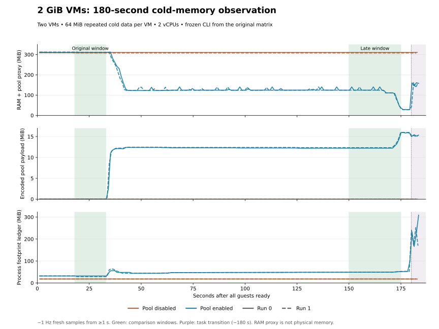

# VM 冷内存回收：收益与使用建议

[完整结果与证据](results.md) · [测量方法](methodology.md) · [机制设计](../../design/memory-sharing/index.md)

**共享池能减少长时间闲置的 VM RAM 驻留，2 GiB 配置也已观察到显著回收。** 它适合可以等待冷页扫描、并容忍首次访问恢复成本的任务。需要一直保持快速响应的任务，应优先保持共享池关闭。

这份报告测量的是冷内存机制：每台 VM 持有 64 MiB 数据，使用固定的 2026-10-03 签名版本。完成了 10 种配置的 40 次运行，以及 2 GiB 延长观察的 4 次运行；内容校验与退出清理均通过。它不代表 Ubuntu 或 Agent 的端到端性能。

## 核心测量 {#measurements}

这里的 **RAM 代理** 是驻留 guest RAM、待回收页、临时快照和池编码数据的合计，用于判断冷页是否被回收。它不是整机物理内存。下表均为两台 VM 的合计，每台 2 vCPU、默认池预算、相同重复冷数据。

| 每 VM 配置内存 | 观察时间：全部 guest 就绪后 | RAM 代理：关闭池 → 启用池 | 约降低 |
|---|---|---|---|
| 256 MiB | 18–33 秒 | 231 → 27 MiB | **89%** |
| 512 MiB | 18–33 秒 | 243 → 61 MiB | **75%** |
| 2 GiB | 60–90 秒 | 309 → 124 MiB | **60%** |

不同容量需要不同的回收时间；此表说明各配置已经观察到的收益，不用来比较同等任务时长下的优劣。数值为便于阅读的四舍五入，精确结果、配对范围和其他配置见[结果页](results.md)。

**需要同时接受的代价：** 2 GiB 延长实验首次完整读取 64 MiB 从约 20 ms 增至 164 ms，全程还增加 CPU 消耗。macOS 的 footprint 账目也增加，因此目前能确认的是冷 RAM 驻留下降，尚不能承诺整机物理内存或压力改善。[访问代价](results.md#performance)和[物理账目](results.md#physical)给出完整证据。

## 2 GiB 的回收过程 {#long-idle-2048}

共享池在 guest 就绪后约 34 秒开始提交冷页，随后 RAM 代理降到约 124 MiB；接近三分钟时又出现一轮下降。两次启用运行的曲线接近，关闭池的基线保持在约 309 MiB。**大 VM 需要更长的观察时间，短任务可能在明显回收之前已经结束。**



蓝线为启用共享池，棕线为关闭；实线和虚线为两次运行。上排展示 RAM 代理下降，中排展示池占用，下排展示 footprint；绿色是对比窗口，紫色是约 180 秒开始的读取与退出阶段。中间有波动，末尾较低位置持续时间有限，最终稳态尚未确认。[延长实验与判定条件](results.md#long-idle-2048)保留全部阶段。

## 如何选择 {#decisions}

| 场景 | 建议 |
|---|---|
| 重复、可压缩数据，任务有较长静默期 | 试用共享池，同时测量自己任务的恢复延迟和宿主压力 |
| 2 GiB 或更大容量 | 预留更长扫描时间；不要用几十秒的观察判断最终收益，更大容量尚未测量 |
| 交互、短任务、持续热访问 | 优先关闭共享池，避免扫描和恢复影响响应 |
| 随机、不可压缩内容 | 预期收益较小；先核对应用所需 RAM 与池容量 |
| 单 VM | 可利用冷压缩；不能把单实例收益称为跨 VM 去重 |

显式 RAM 文件本身不带来压缩或共享。FUSE 压缩 RAM 是另一条路径，与共享池互斥，本轮没有它的性能数据。

## 最小启用方式 {#usage}

在第一个终端创建仅自己可访问的新目录并运行服务；目录已经存在时应换新路径或核验权限。Unix socket 路径应保持短。

```bash
mkdir -m 700 /tmp/pvisor-pool-demo
pvisor memory-pool /tmp/pvisor-pool-demo/p
```

在其他终端运行 VM，共用同一个 socket；rootfs 镜像不是本次测量使用的静态 guest，所以实际收益必须另测。

```bash
pvisor run --vm --memory 256MiB --cpu 2 \
  --vm-memory-pool /tmp/pvisor-pool-demo/p \
  --rootfs image=ubuntu:24.04 -- /bin/sh
```

省略 `--vm-memory-pool` 即关闭这一实验路径。不要在任务完成前停止服务；池丢失会让依赖 VM 失败，当前不支持服务重启后恢复。16 MiB 默认预算只约束编码 payload，不约束服务全部物理内存。`--max-bytes 1048576` 是 1 MiB payload 上限，也会增加容量拒绝的机会。

`--vm-ram-backing FILE` 要求每台 VM 使用不同、尚不存在的文件；它不使 live RAM 自动共享。`--vm-ram-compression` 是另一条 FUSE 路径，不能与共享池组合。


## 使用边界 {#limits}

选择 guest RAM 时仍须满足应用峰值需求。首次访问、CPU、footprint、宿主压力与 swap 都应纳入自己的验证；减少冷驻留不等于已经证明可以多运行多少实例。两次配对提供本负载上的方向，尚不覆盖长期稳态、更多并发、真实 Agent 任务或生产 SLA。

需要复核时，按[结果与证据](results.md)查看完整参数矩阵、诊断账目和失败记录，再用[测量方法](methodology.md#reproduce)复现。
