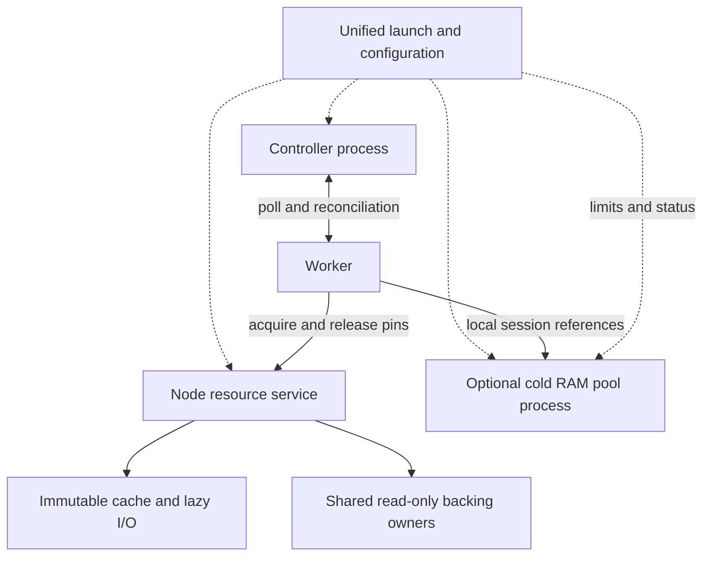

# Cache、Memory Pool 与 Cluster 服务整合

**建议统一部署入口和节点资源管理，保留 Controller 与存活 VM 数据的独立故障边界。**这里的 Cluster server 指当前 `pvisor-cluster serve`。当前已交付 `pvisor service`、跨 Worker 的节点 owner 和 retained cache payload 总预算；部署与正确性验收见[统一服务指南](../../guides/cluster/service.md)。下文同时保留后续目标与性能验收问题，未测的性能收益不作为完成项。

整合的主要价值是减少重复资源管理，让同节点任务共用不可变环境和 backing，并统一限制缓存与在途成本。少几个进程或端口本身不能证明启动更快或内存更省。

## 三类职责如何收敛 {#roles}

| 职责 | 适合的归属 | 整合后的目标 |
|---|---|---|
| 任务意图、执行身份、调度、控制修订、终态回执 | Cluster Controller | 一个控制面；运行观察仍由 Worker 对账重建 |
| 环境 CAS、按需读、下载/解码、只读 mount、共享 RAM backing owner | 节点资源服务 | 同节点统一身份、active pin、保温与资源预算 |
| 实验性冷 RAM 压缩对象与会话引用 | 节点资源服务下的可选 pool 模块 | 复用管理入口与预算，但保留不可丢弃的活动数据合同与故障隔离 |
| 最终准入、执行器、watchdog、终态 outbox | Worker | 持有任务生命周期；向节点服务申请资源，向 Controller 报告事实 |

同一节点可以服务多个 Worker；跨节点通过不可变存储复用内容，不能共享物理 RAM。不要把所有 Worker 的 page fault 都送到中央 Controller。

目标布局如下。一个启动入口可以管理多个受限进程，并不要求用户手动维护三个 daemon。



Pool 在实现中保留独立进程，服务入口统一其配置、限额与状态；pool 内部 payload 预算仍独立，尚未与节点 cache 动态仲裁。后续可以在明确接受节点级故障影响后与 cache 同进程；模块、队列与数据保留规则仍分别成立。

## 当前实现说明的机会与限制 {#current}

- `image/cache/server.rs` 已经把慢 registry/提取准备与文件服务分开：准备队列容量 16、两个线程；连接队列容量 16、16 个服务线程。整合时保留这种隔离，不把全部 I/O 放入同一个 executor 或全局锁。
- `bin/pvisor-memory-pool.rs` 独立接入 Unix socket，默认最多 16 个连接；`ram_backing/ipc.rs` 按连接保留引用并串行 RPC。客户端断开即释放会话引用，没有磁盘恢复或透明重连恢复合同。
- `node.rs` 与 `node/registry.rs` 提供跨 Worker 的资源 owner。环境以 handle/digest 为身份；RAM 以封存 ID/compatibility 为身份，每次 acquire 仍校验 store 的授权根和发布状态。同一身份的 mount 准备 single-flight；每个任务用连接 pin 保留 owner，最后释放或有界保温。未设置节点 socket 时仍使用原进程内注册表。
- Controller `server/dispatcher.rs` 是容量 256 的控制命令队列和独立单写者线程。对象读取、解压、FUSE fault 与 pool RPC 不应进入这条队列。
- 当前 `vm.memory_pool` 的执行器支持限制仍是 macOS/Apple Silicon。Linux native restore 的只读 RAM inode/COW 路径可以先整合，不等待实验性 cold pool，也不因统一部署就扩大 pool 的支持范围。

节点模式当前用共享 FUSE mount 交付环境；未配置 node socket 的 Linux native Worker 可使用 direct virtio-fs lower。这是两个不同的数据通道，性能 A/B 必须固定 backend，不能把 direct lower 的独立收益归因于服务入口整合。

## 统一对象管理，区分数据权威 {#authority}

统一管理的是身份、预算、观测和生命周期接口，不是把所有字节都变成可驱逐 cache。

| 对象类型 | 内容来源与保留 | 重启/驱逐边界 |
|---|---|---|
| 可重新获取的镜像块与 decoded cache | 有效不可变版本、FS/S3/CAS 源；读取仍校验 | 可以丢弃热数据后重取；不能用 cache 命中替代发布授权 |
| 活动只读 RAM backing / FUSE mount | 有效封存快照及其 pins；guest 私有写入 COW | 未使用的 decoded 块可再读；活动 mount/owner 不可因 TTL 卸载。存在持久源不等于 owner 进程故障后 live VM 自动恢复 |
| 冷 RAM pool 活动对象 | 私有页移出原 backing 后，pool 可能是唯一剩余副本 | 不能 LRU/TTL 丢弃；会话失效、pool 丢失或恢复失败可使依赖 VM fail-stop |
| 已提交检查点与终态证据 | 持久存储、已发布引用与 GC 根 | 沿用原提交/保留合同，不能由节点热度决定删除 |

**最终一致性解决的是 Controller 如何重新知道 Worker 的状态，不能重新生成已经丢失的 VM RAM。**不需要为了整合增加逐页 WAL；也不能用“重启后问 Worker”替代 cold pool 的数据保留。

Controller 单独重启时，Worker、pool 会话和节点 backing owner 不应被顺带重启。Worker 在现有租约/watchdog 合同内运行与对账，不承诺无限脱离 Controller 继续执行。统一入口的 `restart controller` 与全节点 `stop` 必须具有不同作用范围。

## 节点统一预算与并发机制 {#budget}

节点目标账目为：

```text
node memory = service overhead
            + shared resident working-set union
            + private task state
            + pinned cold-pool objects
            + bounded caches, metadata and in-flight scratch
```

物理共享只计一次，逻辑 RAM reservation 保持单独记账。Kernel page cache 的精确驱逐不由用户态服务承诺；仍用内核限额与观察约束整组服务。冷 pool 的 payload 上限不等于整个 pool 进程内存上限。

统一预算先留出活动对象、fault 恢复与临时解码所需空间，再分配可驱逐 cache 和可选预取。压力下先停止预取、驱逐未 pin 的可重取热数据、拒绝新保温/准入；不能驱逐 live VM 的唯一字节，也不能把恢复队列需要的空间全部给压缩对象。

按对象身份做 single-flight 与有界下载/解码，保留不同权限与版本的边界。需求读取、恢复、后台准备/预取与管理请求使用各自有界队列；需求优先于可选预取。避免持有管理锁做网络 I/O 或压缩。不同 Worker/租户的活动引用与可驱逐份额分别计量，防止一个大环境挤掉全部容量。

Worker 上报有新鲜度的本地缓存/压力摘要，Controller 内存视图通过对账收敛。逐次 cache hit、页面驻留变化和 pool GET 不需要写入 Controller 日志。管理 API 可以统一入口；本地 fault 数据通道保留 Unix socket/句柄，且不自动获得 Controller 管理令牌的权限。

## 部署方式与迁移顺序 {#migration}

单机模式由一个入口启动 Controller、Worker 与节点服务；多机模式由同一制品选择 Controller 或节点角色，节点连接远端 Controller。当前命令继续工作；`pvisor service run/status/restart/stop` 已支持独立状态、日志、角色级停止与 delegated cgroup 限额。Controller 退出不会触发其他角色重启；自动重启与跨节点迁移尚未实现。源配置解析后写入私有 `active-config.toml`，角色 restart 使用同一配置快照。

1. **先统一入口与配置。**保留现有进程和协议，梳理启动顺序、socket 生命周期、健康与停止语义；先减少部署负担，性能收益保持未测。
2. **提取节点资源 owner。**先连接不可变环境与 Linux 共享 RAM backing。定义同节点身份、pin/acquire/release、句柄或 mount 交付、取消及异常退出清理；保持活动 owner 到 native runner 回收为止。远端注册表不是共享 backing 的替代品。
3. **统一可管理预算。**纳入 metadata、热块、保温 owner、解码与在途请求，补容量回收与压力观察；用既有 S1/S2 验证共享/lazy，再用 S3 验证重复 miss。
4. **接入可选 cold pool。**保留会话授权、引用与 fail-stop 合同，默认单独受限进程；不要对活跃会话做透明断开/重连或升级。没有无损排空能力时，升级必须等待依赖 VM 退出。
5. **证据支持后再评估同进程。**cache 与 pool 的统一内存仲裁可能有价值，但要计入更大的故障范围。Controller 同进程仅可作为明确接受整体重启影响的实验部署，不能标成在线恢复等价模式。

## 本轮已实现范围 {#implemented}

| 能力 | 当前实现与限制 |
|---|---|
| 统一入口 | 一份 TOML 管理独立角色；同安装目录可信 companion；管理 socket 仅同 UID；Controller admin token 不传给数据角色 |
| 节点生命周期 | active pin、总 owner 数、强引用保温、准备并发均有界；取消释放准备许可，慢卸载在 blocking 路径执行；停止等待 pin 与准备任务排空 |
| 共享环境与 RAM | Worker 环境层共用节点 mount，私有 upper 保留；跨授权 store 的同封存 RAM 共用 inode，native guest 继续 `MAP_PRIVATE`；每次申请校验有效发布与兼容性 |
| 缓存预算 | 同进程热内容块、分页 metadata 和 Linux decoded RAM 的 retained payload 总预算；本地 LRU/FIFO 可替换旧条目，容量不足则校验后不缓存；不覆盖完整 metadata、scratch、外部 Arc 或 kernel pages |
| 内核边界 | 专用 delegated cgroup 在角色 exec 前安装内存/CPU/零 swap 限额；无 cgroup 的 preview 在 status 明示；独立 Apple Silicon pool 不在 node payload 计数内 |
| 停止与故障 | Controller 独立 restart；active pin 阻止 node restart；Workers → pool → node → Controller 排空；30 秒超时保留数据 owner，未实现 live owner/pool 重连恢复 |

这完成了迁移步骤 1–2、步骤 3 的 payload/数量/并发边界，以及步骤 4 的独立进程管理与等待会话停止。完整 metadata/scratch 仲裁、动态缓存 hint、预取、cold pool 的共享预算与无损迁移仍待实现。步骤 5 的同进程合并尚未实施。

`just test-service` 覆盖真实服务重启、共享 RAM inode、host `MAP_PRIVATE` 隔离和实际 cgroup 限额；`just test-service-vm` 单独覆盖最多两个 128 MiB/1 vCPU 原生 guest 的共享环境与 private upper。后者不证明恢复 RAM 的物理驻留收益，前者不替代真实 restored VM 的 fault/COW 性能采样；macOS pool 仍需独立硬件验收。

## 整合前应冻结的验收问题 {#acceptance}

这是待冻结的实验草案，不是 PASS 声明。A/B 使用相同任务、环境、后端和整组 CPU/内存预算；最多四个并行真实沙箱，源 VM 也计入，逐沙箱安装 RAM/CPU 限额，并限制所有服务的资源。

| 问题 | 必须观察的结果与反例 |
|---|---|
| B1：整合是否减少重复 backing、读取和解码？ | 结合 S1/S3 测同对象/不同对象，记录 inode、共享/私有页、origin 请求、解码次数与整组物理内存；只减少 daemon 数不能算共享收益 |
| B2：统一预算是否改善固定资源下的有效工作？ | 结合 S2/S5 与 Q3 测首个结果、完整正确吞吐、CPU秒/任务、内存时间/任务、峰值与排队；扩大预算或只推迟读取不算提升 |
| B3：慢 cache 会不会拖垮控制与恢复？ | 私有测试后端延迟/失败、限制预取，测 poll/控制响应、fault 等待和 watchdog；无界排队、死锁或非预期租约失效则失败 |
| B4：独立重启是否符合声明？ | 重启 Controller，确认 Worker/owner/pool 会话与执行身份保持、对账收敛；另测 owner/pool 故障，记录受影响 VM，不能宣称尚未实现的 live 重连 |
| B5：引用和权限是否仍正确？ | COW 私有写隔离、版本校验、未授权句柄/会话拒绝、最后释放与 GC；进程合并不能绕过已有校验或导致活动数据删除 |

先冻结具体负载、样本量、尾延迟阈值、资源上限和有效收益门槛；不凭架构图提前上调评分。整合的第一收益是部署与资源管理收敛，性能分数由上述验收决定。

相关设计：[共享工作集](shared-working-set.md)、[状态与恢复](state-and-recovery.md)、[冷 RAM pool](../memory-sharing/index.md)和[问题驱动实验](../../benchmarks/cluster-questions.md)。
