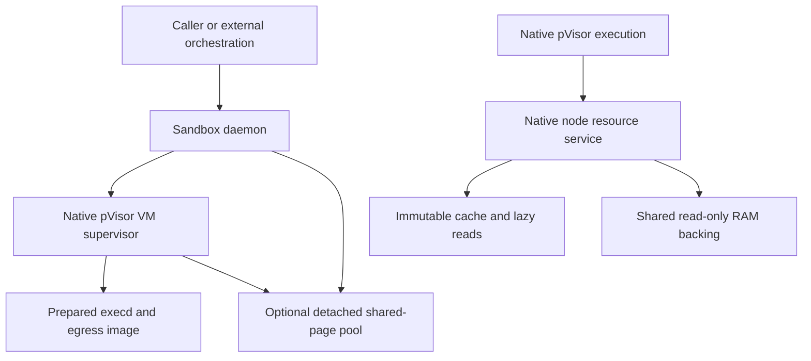

# 服务职责收敛

为每种本机资源明确所有者，减少重复管理，而不是把所有服务合并到 daemon 进程。Sandbox 生命周期、原生不可变 backing 和不可丢失的活动 RAM 有不同权威与故障边界。

## 当前职责 {#roles}

| 职责 | 所有者 | 与 daemon 的关系 |
| --- | --- | --- |
| Sandbox 准入、意图、过期、端点 | `pvisor-daemon` | 由 VM-only NativeRuntime 实现，已接入可执行入口／CLI |
| Job/Attempt 生命周期、暂存、Gateway、原生 VM 检查点 | `pvisor` Session／执行器 | Supervisor 嵌入 VM 执行；不暴露 staging/Gateway/checkpoint API |
| 不可变环境挂载与共享只读 RAM backing | 原生 node 资源服务（`pvisor/src/node.rs`） | 运行时协议保留；旧 CLI node supervisor 已移除；没有 daemon acquire/release 适配器 |
| 镜像准备、发布、服务和读取 | 独立 `pvisor-cache` 与运行时 cache 模块 | 独立程序、数据路径与预算；未并入 daemon |
| 可选共享页与 session 引用 | `pvisor-daemon/src/memory_pool.rs` | `serve --memory-pool` 启动／复用独立 `memory-pool --directory DIR` 组件；默认关闭 |
| 主机选择、工作流与重试策略 | 外部编排 | 不属于产品控制面 |

Node 运行时协议仍供嵌入式原生调用方使用；已移除的 CLI node supervisor 不是 daemon 功能。它的身份是 image handle/digest 或 sealed RAM 身份／兼容性，不是 sandbox ID。一个连接 pin 一个 owner。同身份准备 single-flight，活动 owner/session/preparation 数量与 warming 有界。原生调用方不配置 node socket 时，仍可使用进程本地 registry。

刻意不画 daemon 到 node 的连接。同包发布、统一启动入口或更少端口不补齐缺失 runtime 适配器，也不建立更快启动、更低内存或更高有效工作密度。

## 数据权威与重启边界 {#authority}

| 对象 | 可以回收什么？ | 故障边界 |
| --- | --- | --- |
| 可重新获取的镜像／decoded 块 | 有有效持久来源、未 pin 的热内容 | 命中不能替代发布授权 |
| 活动只读 RAM/FUSE owner | 活动 pin 结束后的闲置 warming，不能回收活动挂载 | 持久来源不自动恢复 owner 故障后的 live VM |
| 转移到 pool 的私有冷 RAM | 不能回收唯一剩余副本 | Session/pool 内容丢失可能使依赖 VM fail-stop |
| 已发布 checkpoint／证据 | 仅通过各自保留与 GC roots 回收 | 原生 registry 保温不能授权删除 |
| Daemon sandbox 记录 | 确认原生删除后 | 正常 daemon 关闭保留 supervisor/VM 与 registry |

只重启 daemon 会保留独立原生 supervisor/VM 及绑定配置的池组件，不会恢复已失败的池或重建其活动页。重启 backing owner 或 cold pool 是另一种操作，不能承诺透明 session reconnect。原生 runner 回收前保持 pin；没有无损排空时，升级须等待依赖 VM 退出。不能从 metadata 文件恢复推断 live RAM 可重建。

## 预算与并发 {#budget}

原生 node 配置限制 owner、warm owner、session、preparation 和 retained cache payload。Payload counter 聚合内容块、分页 metadata 与 Linux decoded RAM，不含完整 metadata、scratch、外部引用和内核驻留。Daemon 池有独立、有界的页／对象／连接／引用预算，位于单个 sandbox cgroup 之外，不与 node cache 动态仲裁，也不等于整个进程上限；见[池预算](../../guides/daemon/index.md#memory-pool)。

给可选缓存／预取分配预算前，先预留活动对象与恢复余量。压力下丢弃可牺牲 warming／可重新获取内容，或拒绝新准备，不删除唯一活动字节。慢 teardown 与 I/O 不持管理 map 锁；同身份串行仍须保留授权与兼容性检查。

Daemon CPU/内存准入仍是 supervisor/VM 树硬限制的独立保守求和，不与原生 node/pool 形成联合物理内存记账。宿主 cgroup 监督与观察需覆盖服务及瞬时工作，而非只算工作负载。

## 接入方向 {#migration}

1. 退役旧分布式角色时，保留独立 owner 与故障范围。
2. 为已有原生运行时接入 node 资源前，定义获取、私有写入状态、取消、原生终止和 pin 释放。
3. 区分预留、物理共享页、可驱逐 payload 与不可丢失 RAM 后，再统一观察及可控预算。
4. 明确重启／排空和数据保全合同后才考虑进程合并，并通过固定预算测量评估。

职责收敛不建立 live-VM 接管、共享 cold-pool 仲裁、自动 node 获取或密度优势。原生资源正确性证据和旧 service 实验保留原范围，不是 daemon 验收结果。

独立缓存保留 `prepare`、`publish`、`serve`、`list`、`stat`、`read`；移除 service 层不会把 cache 或 node 协议并入 daemon。

相关合同：[共享工作集](shared-working-set.md)、[状态与恢复](state-and-recovery.md)、[原生共享镜像存储](../shared-image-cache-storage.md)与[实验 pool](../memory-optimization/proof-of-concept.md)。
