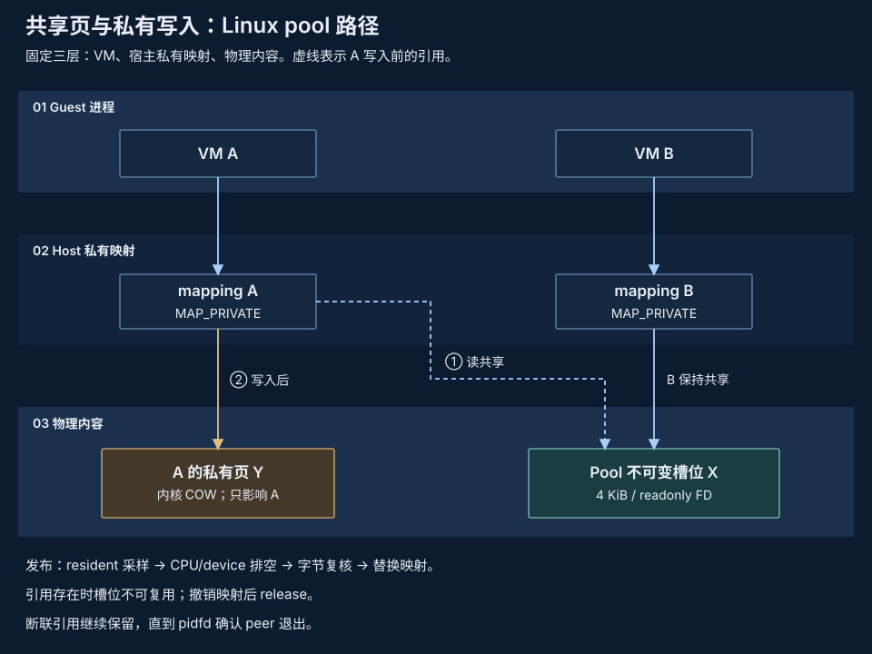

# 共享工作集与按需加载

按身份复用不可变内容，同时显式计算实际访问与私有修改的成本。原生 pVisor 缓存与 node 资源提供这一路径的机制；Daemon 可显式启用自有 Linux physical pool；它尚无通用 node acquire/release 适配器，完整 API 路径的密度收益仍待验证。



## 三种不同机制 {#principles}

1. **内容去重**减少重复磁盘／对象字节，不自动减少 guest RAM。
2. **共享驻留页**要求正确 backing 身份与映射。原生恢复可用同一只读 RAM inode 配合 `MAP_PRIVATE`，未修改页可共享，写入保持私有。相同镜像名或内容相同的独立文件不等于相同 backing。
3. **按需加载**避免读取／解码未访问内容，但成本转移到缺页和后续工具访问。仅凭就绪时间不能建立首个结果或完成成本更低的结论。

匿名页扫描、冷页压缩与整 VM offload 仍是独立策略，不能把各自宣称收益相加当成一种机制。

## 现有原生基础 {#current}

| 组件 | 机制 | 边界 |
| --- | --- | --- |
| `pvisor/src/node.rs`、`node/registry.rs` | 同用户、同主机不可变 owner；按身份准备、连接 pin、有界 warming | 供原生调用方使用的运行时协议；无 daemon 适配器或透明 live 接管 |
| 原生镜像缓存 | 校验后的按需读、分页 metadata 与内容复用 | 已发布 FS/S3 对象支持分页读；普通未缓存 OCI prepare 仍可能全部准备后返回 |
| 原生 Linux RAM 恢复 | 经授权的 sealed 身份／兼容性与共享只读 inode，guest 私有 COW 映射 | 普通新启动绕过 RAM restore；仍要求兼容原生 profile |
| Snapshot lazy reader | 缺页时校验／解码块，decoded cache 有界 | 保留首次访问成本；旧 raw 格式可能要求完整校验 |
| 历史 macOS 压缩池 | Session 引用与私有冷页恢复 | 记录版本的机制；与当前 Linux 协议分开 |
| Daemon 自有 Linux 池 | 重复驻留 4 KiB 页，通过有界 memfd slot 和私有 COW 映射共享 | 显式 `serve --memory-pool`；独立预算和故障范围，不压缩唯一页 |
| NativeRuntime daemon | 独立不可变 rootfs、VM 私有写入 | 可选 daemon 自有池；无自动 node socket 获取、RAM restore 或 lazy snapshot 集成 |

其他源码区域：`image/cache/lazy.rs`、`image/cache/portable/binary.rs`、`executor/vm/restore_ram.rs`、`environment_snapshot/lazy.rs` 与 `pvisor-vm/src/memory.rs`。原生 node acquire 校验授权 store、发布与兼容性，不以缓存存在替代权威。

## 工作集记账 {#model}

原生共享的成本模型是：

```text
节点内存 = 服务开销
         + 共享驻留工作集并集
         + 私有脏 RAM 与私有文件系统状态
         + 逐执行运行时开销
         + 有界缓存与在途 scratch
```

物理共享页只计一次。共享成本随版本和访问模式改变，私有成本随执行数和写比例增长。分散访问与大量写入可以消除收益。文件 copy-up、传输块、read-ahead 与 COW 可能放大请求字节。

逻辑预留、物理占用和可回收缓存分开。原生 node retained-payload 记账覆盖内容块、分页 metadata 和 decoded RAM，不含完整 metadata、scratch、外部引用或内核页。仍需内核上限和整组观察。这些机制不放宽 daemon 的[硬限制准入](admission.md)。

## 所有权与未来接入 {#integration}

连接 pin 保护活动不可变挂载／backing，直到原生 runner 已回收。最后释放后才能拆除或有界 warming。同身份准备串行，慢 I/O 不占用全局 map 锁。可重新获取的 decoded cache 可以驱逐，活动 owner 或私有冷 RAM 唯一剩余副本不能视为缓存。

为已有原生运行时接入 node 共享需要显式 acquire/release、取消、兼容输入交接、清理、证据和预算合同。Daemon 没有 node acquire/release 适配器。通用 warm-template Agent 恢复尚不可用，来源 command/input/environment/policy 绑定与原生 no-network 恢复限制仍适用。

有界关键页预取、进一步合并同对象 miss、扩展完整 metadata/scratch 记账是可能后续工作。Daemon 没有主机亲和策略或 placement hint 协议，主机选择属于外部编排。

## 证据问题 {#experiments}

没有新测量或 PASS 声明。原生路径实验与 daemon node 共享集成评估分开：

| 问题 | 必要对照与观察 |
| --- | --- |
| 共享基底 | 相同 sealed 字节与访问工作集，分别控制共享／独立 backing、eager/lazy、写比例；整组物理内存、原生 PSS、COW 与写隔离 |
| Lazy 环境 | 相同已发布版本与验证输出，未访问字节增加时固定访问集；首个结果及完整完成前的源读／解码 |
| 并发 miss | 相同／不同对象；逐唯一对象请求／解码、scratch 峰值及等待时延，区分重试/read-ahead |
| 预取与保温 | 固定总资源与到达过程；首个结果、正确完成吞吐、CPU 与 memory-time、长尾及摊销准备成本 |
| 故障保全 | 发布授权、pin/owner 释放、GC、慢／失败读与 owner/pool 丢失，不声称未实现 reconnect |

最多同时四个真实原生 guest，包括活动 source VM；限制每个 guest 与服务。不要清空全局 page cache，也不从未触碰页节省推断共享。采集前固定工作负载、样本数和有效阈值。历史独立 fresh-boot 探针既不建立也不否定原生共享，不建立 daemon 密度。

Daemon 池与 node backing 恢复分开。池丢失会使依赖 VM 失败；API 重启保留独立组件，但不能恢复已失败的池内容。见[启用、所有权和限制](../../guides/daemon/index.md#memory-pool)。

相关设计：[职责收敛](responsibility-convergence.md)、[共享镜像存储](../shared-image-cache-storage.md)、[内存优化](../memory-optimization/index.md)与[实验冷 RAM pool](../memory-optimization/proof-of-concept.md)。
