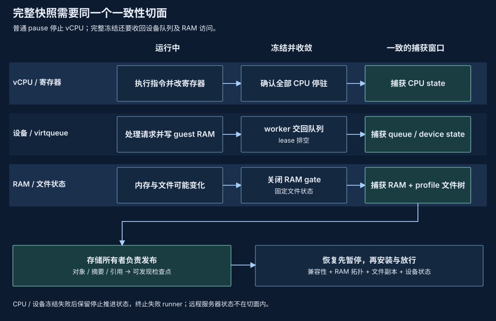

# 快照子系统：一致性与状态存储

原生 VM 和存储 SDK 提供完整状态封存、RAM 编码、基底引用与恢复机制。CLI 通过普通 Job 提供原生完整执行捕获与恢复，不提供独立 `pvisor snapshot` 工作流；旧 store 不自动转换为 Job 检查点。

## 一致性切面：CPU 停驻之后还有什么 {#consistent-cut}



| 状态 | 捕获所有者 | 恢复前必须保留的关系 |
| --- | --- | --- |
| CPU 与设备 | VM runtime | CPU 状态、队列进度、中断与设备拓扑来自同一冻结窗口 |
| RAM | VM 映射层与宿主存储 | 地址布局、字节身份、backing 与租约一致 |
| 导出文件系统 | 文件服务与宿主协调方 | 捕获 profile 中的文件副本、lower 引用、inode/handle 可重新绑定 |
| 持久对象与 Job head | snapshot store 与 Job 服务 | 校验完整对象及兼容性后，再发布供后续恢复选择的引用 |

普通 pause 只确认 vCPU 停驻。virtio 设备仍可能持有 guest RAM 缓冲区，并将 I/O 结果写回。若先复制 RAM、后保存设备队列，恢复出的 used ring 可能显示“已完成”，对应缓冲区却没有那次结果。

完整冻结先停驻 CPU，再等待设备 worker 停止并交回队列所有权，排空设备 RAM lease，最后关闭访问 gate。等待 worker 时释放 VMM 锁，让完成路径可以推进。只有完整冻结窗口内的 CPU、RAM、设备状态才能组合为同一个机器状态；文件系统也必须按捕获 profile 保全。

VM runtime 提供这个窗口，存储所有者在窗口内完成必要捕获，并负责对象引用、兼容性与持久发布。恢复机器先保持暂停，安装验证后的 RAM、CPU、设备与文件副本，再放行。冻结超时不能放任尚未结束的 worker 与恢复运行并发，调用方必须终止失败 runner。

网络对端不会随本地快照回退，因此当前原生 Job execution profile 排除网络设备。workspace checkpoint 与 Agent trajectory 也不包含这个完整机器切面。

## 存储与内部生命周期 {#storage-contract}

封存对象仍包含兼容性绑定、CPU/设备状态和 RAM，以及实际 profile 捕获的文件系统。不可变基底和压缩内容可复用，恢复写入保持私有；普通新启动不会自动共享 guest 匿名 RAM。

SDK `SnapshotStore` 保留对象校验、引用与 GC；`open_for_restore`/`ram_reader` 提供带租约的按需读。`open_owned_stage_for_restore` 与 `materialize_owned_stage` 提供已由本地发布校验的 stage 复制，仍要求兼容性、基底 pin、拓扑检查与发布对象租约；不适用于有外部写者的 payload。完整审计继续使用 `open`/`open_for_restore`。

RAM server/watchdog 使用 native runner 的私有启动路径，提供 EOF 排空与清理。它们不依赖公开 `snapshot` 命令，也不改变 `run` 的参数和默认执行行为。

### 仅宿主可用的 snapshot RAM 挂载 {#ram-runtime}

快照数据与临时 RAM 挂载分别管理生命周期。原生恢复和 node 共享在经过验证的私有宿主运行时目录创建 RAM 挂载，不放进 snapshot store 或 node 状态目录。Linux 优先选择所有者正确、权限为 `0700` 的 `/run/user/<effective-UID>`，再尝试 root 所有、权限为 `1777` 的固定 `/tmp`；macOS 使用 `/private/tmp`。每个挂载目录权限为 `0700`。选择过程拒绝符号链接祖先，以及与已知 workspace、HOME/XDG、状态根的重叠；不使用 `TMPDIR` 或 `XDG_RUNTIME_DIR` 决定挂载位置。没有安全位置时准备失败，不退回持久状态目录。

`SnapshotRamMount::new` 和 `PublishedEnvironment::ram_mount` 的 `directory` 参数表示需要避开的状态根，而不是挂载点的父目录。调用方不能通过枚举该目录发现挂载。所有 RAM 文件和 VM 映射释放之前必须保留挂载 owner。外部 pager 的 spec 使用独立私有运行时目录，文件权限为 `0600`，在 readiness 或启动失败后移除。Owner EOF 触发清理；helper 等待有上限，helper 异常退出时只清理该 owner 的私有挂载。挂载清理不删除持久快照数据，也不自动接管或卸载已有旧挂载。

Linux rootless host 暂存仍不支持投影状态根中的嵌套挂载。它在 Agent 执行之前失败，不把子挂载以可写方式暴露，也不静默隐藏其内容。诊断指出状态根、覆盖该根的挂载及嵌套挂载，并保留底层 mount 错误。私有运行时目录将 pVisor 的临时 RAM 挂载留在投影状态根之外；这种分离不构成对任意用户挂载布局的支持保证。

## 当前用户入口 {#current-entry}

普通 Job 的检查点、挂起、恢复与分叉只通过 `checkpoint`、`suspend`、`resume`、`fork` 管理。支持停止 Job 的 workspace 检查点，以及符合原生 profile 的 VM execution 检查点。

```bash
pvisor checkpoint create last --request-id before-refactor --json
pvisor checkpoint list last --json
pvisor fork last --state workspace --stage ./stage/branch -- codex
```

原 `save` 对应 `suspend`；恢复当前执行点用 `resume`，恢复历史点或创建分支用 `fork --state execution --checkpoint ID`。原 `run` 使用普通 `run --executor vm`；list/delete/gc、基底导入和校验进入 Job 的 `checkpoint` 命令。无网络设备、私有 RAM、拥有完整 rootfs 的原生 VM 支持 capture-and-continue 和完整恢复；普通 `run` 的配置不会自动改变。接口和限制见 [CLI 参考](../reference/cli.md#full-vm-execution-checkpoints)，交接设计见[Job 检查点设计](job-checkpoint-cli.md#10-当前实现与验收边界)。

[单节点 daemon](daemon/index.md) 使用原生 VM 执行，但没有捕获／恢复 API。其 pause/resume 是同一 Attempt 上已确认的 live vCPU 控制，不是 cgroup freeze 或快照。Snapshot、checkpoint/fork、stage/apply 和 offload API 仍未实现。不要把已退役 Cluster 控制当作快照入口。

原生 node backing 归属仍独立于 daemon 生命周期，见[职责收敛](daemon/responsibility-convergence.md)。

## 历史证据 {#historical-evidence}

2026-10-03/04 的独立 snapshot 正确性和时延记录属于当时的源码/制品。历史 harness 必须明确传入仍支持该旧命令的归档 binary，不能用当前 binary 复现；它们不是当前 Job execution profile 已交付的证据。原始数据保留在[VM 内存实验](../benchmarks/vm-memory/index.md)。

## 回到整体架构与源码 {#integration}

完整快照是 VM、内存和文件服务的交汇点：VM 提供静止边界，存储固定可恢复字节，Job 服务管理用户可选择的检查点与执行身份。Journal 中的一条成功事件不能代替机器 payload；存储对象的存在也不能单独证明 Job head 已推进，恢复必须沿各自合同核对。

源码入口：`crates/pvisor-vm/src/handle.rs` 与 `devices/snapshot.rs` 拥有机器捕获和设备合同；`crates/pvisor/src/environment_snapshot/store.rs`、`filesystems.rs` 负责存储与文件副本；`crates/pvisor/src/executor/vm/restore_ram.rs` 负责 runner 恢复的 RAM 接入。执行身份与重试见[Job 检查点设计](job-checkpoint-cli.md)，事实提交见[Journal](journal.md)。
