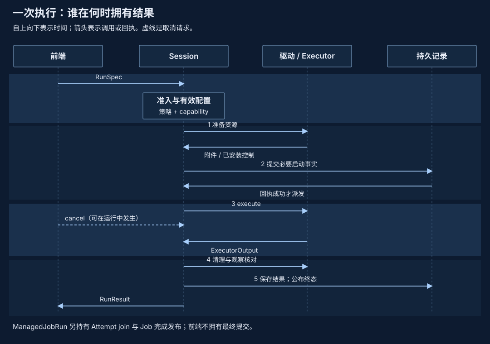

# 失败语义与重试

pVisor 中的错误需要连同发生阶段理解。准入拒绝、宿主 I/O 失败、回执丢失和调用方取消，留下的状态不同。重试前先固定原 Job、Attempt、request/event ID 与目标，再区分“没有接纳”“已接纳但结果未知”“已经完成”；换一个 ID 再提交会绕开原有核对关系。

## 一次执行包含多个提交点 {#commit-boundaries}

Session 准备文件和网络资源，提交必要启动事实，再派发执行器。执行器退出后，清理、控制观察、stage seal、Bundle 与终态发布继续发生。文件 apply、Journal append、快照对象发布和 Job head 更新有自己的提交边界；当前没有覆盖它们与外部服务的一笔总事务。

因此，`Dispatched` 表示进入派发阶段，不能证明 guest 已开始执行；缺少 `Completed` 也不能证明命令没有产生效果。HTTP 请求可能已被远端处理，文件可能已更新，而调用方只看到了超时。事实合同见[Operation 与 Event](operations-events.md)，记录身份和版本见[记录矩阵](records-and-versions.md)。

## 按失败位置决定下一步 {#failure-matrix}

| 失败位置 | 可能保留的状态或效果 | 应核对什么 | 重试边界 |
| --- | --- | --- | --- |
| 准入 / 驱动准备 / 启动事实提交 | 工作负载尚未派发；准备可能已创建目录、挂载或 socket | Session 清理结果与准备错误 | 先处理资源与能力问题；启动事实失败时不能绕过该门直接派发 |
| 执行后记录或清理失败 | 工作负载已经运行；upper、网络请求等效果可能存在 | Attempt、实际退出、Bundle/日志和 stage 完整性 | 不为补齐记录自动重跑命令 |
| Host CLI 超时、断连或取消 | listener/worker 可能已接纳并产生效果，清理仍可能进行 | 固定目标的 Job 状态、产物与原 request 关联 | Host envelope 不提供通用去重；前端不自动重试 |
| Journal append 返回 Unknown | 无字节、部分尾部或完整记录均可能存在；句柄 poisoned | 释放 clone 和活跃写任务后，reopen 恢复并查原 Event ID | 用同一 Event ID 和完整内容重试 append；不重做外部操作 |
| execution capture / suspend / resume / fork 回执不明 | 持久请求、对象、分支或继任 Attempt 可能已建立 | 原 request ID、Job head、当前 Attempt、终止或启动回执 | 在对应操作范围内重用原 ID 和原参数；状态不明时可继续返回 Unknown |
| apply 中断 | 部分 target 已更新，upper 可能尚未裁剪 | 目标锁下的 Prepared / TargetApplied / Committed 账本及原像 | 沿已有批次恢复；不删除 ledger 后重做整批 |
| 受管理 stage 未完整 seal | upper 或观察日志可能不完整 | 写入者是否停止、原像完整性与 seal | 拒绝 apply/复用；不能手工补一个 seal 将残留提升为可信结果 |
| VM 冻结或映射迁移进入失败状态 | CPU、设备与 RAM 可能未达成可恢复的一致状态 | 控制事务的失败结果与 runner 归属 | 终止失败 runner；健康 VM 的 unsupported 拒绝按其 API 合同处理 |
| daemon API 进程重启 | supervisor 和 VM 可能仍存活 | 持久 owner、进程身份、凭据和实际 supervisor | 先核对归属；PID 存在或缺失都不足以自动接管或重建执行 |

这些分类表达故障语义，不是新增的统一错误枚举。Journal 的 `Rejected` / `Unknown`、Operation 的 Outcome、Host 类型化错误和 execution Job 状态由各自协议定义。`Rejected` 只证明该接口没有接纳当前动作，不能抹掉先前已经发生的业务效果。

## ID 的去重范围 {#idempotency}

| 身份 | 实际用途 | 重复提交时的限制 |
| --- | --- | --- |
| Event ID | Journal 内的事件去重，返回原 position/receipt | 同 ID 必须有相同序列化内容；时间戳或 payload 变化也冲突 |
| execution 生命周期 request ID | 相应 Job 操作的持久请求和结果关联 | capture/suspend/resume/execution fork 校验各自绑定参数；不扩展成所有命令的 exactly-once |
| Host envelope `request_id` | 关联请求、响应、ticket、错误和取消 | 传输层不因此拥有持久队列或通用去重 |
| checkpoint ID / manifest digest | 标识已保存的状态或内容 | 对象存在不证明 source 已终止、Job head 已提交或恢复已启动 |

Journal 重试要保留原 Event 对象。再次调用 `Trace::event()` 会生成新 UUID，即使文字相同也成为另一条事件。Job 重试同样应保留原请求参数；新 request ID 表达新请求，不能用它“探测”上次是否成功。

## 恢复不是重新派发 {#reconciliation}

以 suspend 为例：接收请求、发布机器对象、确认源 runner 退出、写入 suspended head 是不同步骤。只有匹配 Job/Attempt/request 的 `ExecutionSuspension` 终态回执才提供对应终止证明。仅看到 snapshot 目录或 PID 消失，不能据此启动第二个 VM。

resume 先保存恢复请求与目标 Attempt 路径。重复请求若发现继任记录尚不确定，返回 `EXECUTION_UNKNOWN`，不会为了得到成功响应再启动一份。启动错误后的回退也受条件约束：必须仍拥有本次恢复迁移，且没有 live 继任与其 `run.json`，才恢复先前 Job 状态。已经发生的执行不能自动回滚成“从未运行”。具体状态机见[Job 检查点设计](job-checkpoint-cli.md#10-当前实现与验收边界)。

Journal 恢复只修复合法完整前缀后的未完成尾部。已完成但损坏的行、版本不支持和因果环必须拒绝，不能删除它们来制造成功。apply 恢复则读取持久意图，对已有目标状态向前核对；外部编辑器不遵守目标锁时仍可能产生冲突。两者分别见[Journal 恢复](journal.md#recovery)和[文件 apply 恢复](overlayfs.md#apply-recovery)。

## 等待取消、执行取消与资源终止 {#cancellation}

取消等待只改变观察方。已提交到阻塞池的 Journal append 可以继续完成；已接受的持久 Job 由 `ManagedJobRun` 保留 Attempt join 和完成发布。前端掉线会请求取消，但取消请求、进程退出、设备停止和资源清理是不同事实。runtime 的继续存活也是异步收尾能完成的前提。

调用方应先核对终态和清理结果，再决定是否释放 stage、快照租约或共享页引用。网络对端已接受的内容不会随取消撤销，文件 `drop` 也只处置候选文件。不同执行器的进程控制范围见[隔离机制](isolation.md)，VM 的失败停止边界见[冻结与恢复](vm-runtime.md#freeze)。

## 源码入口 {#source-map}

| 入口（`crates/` 下） | 负责的判断 |
| --- | --- |
| `pvisor/src/session.rs`、`session/lifecycle.rs` | 准备、派发、清理和事实发布 |
| `pvisor/src/runtime/job_service/managed.rs` | 已接受 Attempt 的 join、前端取消与终态发布 |
| `pvisor-cli/src/cli/host_service.rs` | listener、worker ticket、取消与请求清理 |
| `pvisor-journal/src/journal.rs` | Rejected/Unknown、poisoned、去重和 reopen |
| `pvisor/src/runtime/job_execution.rs`、`runtime/job_service/lifecycle.rs`、`fork.rs` | 持久请求、恢复与分支核对 |
| `pvisor-overlay-core/src/apply.rs`、`stage.rs` | apply 前向恢复与 stage 完整性 |
| `pvisor-vm/src/handle.rs`、`vmm/mod.rs` | 控制事务、冻结失败与 runner 处置要求 |

