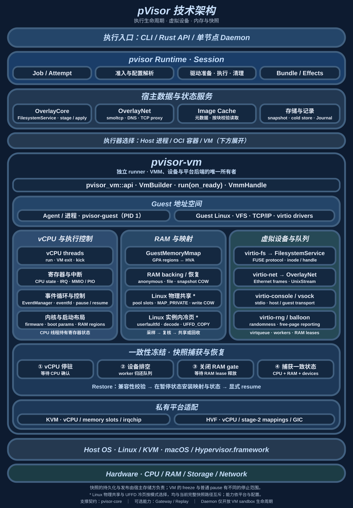
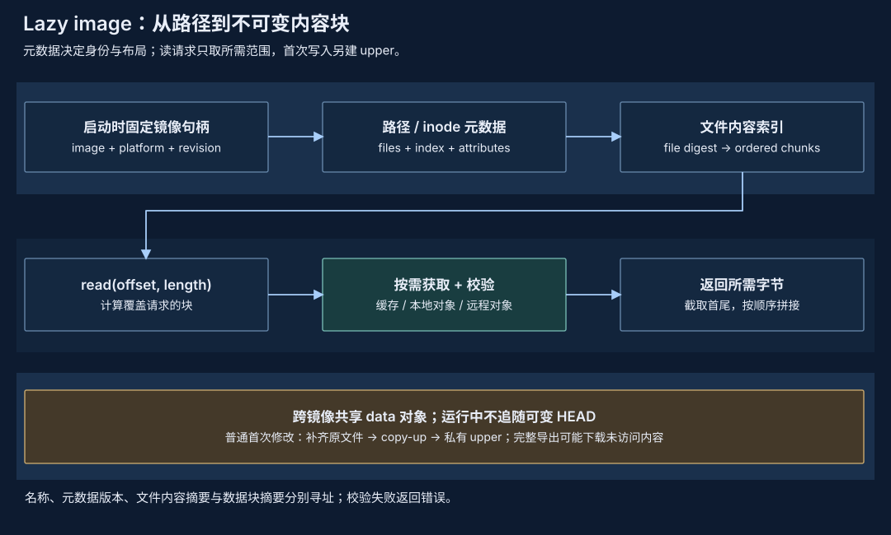
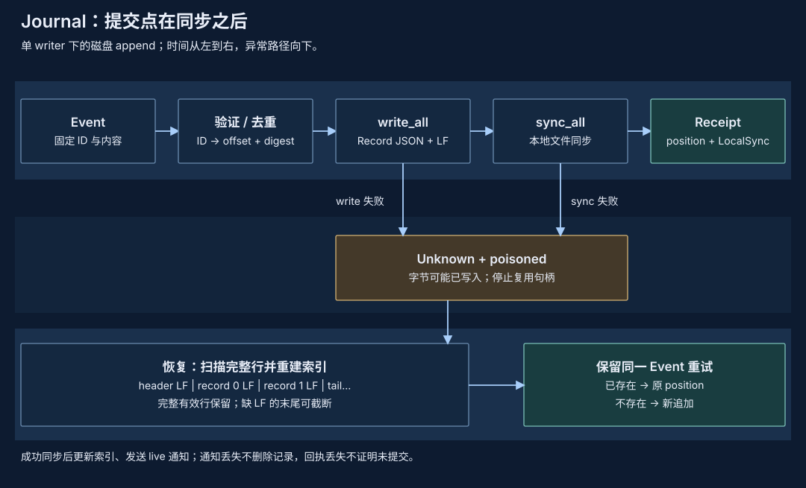

# pVisor 设计与底层原理

让 Agent 连续执行一项任务，实际上是把一组进程、文件修改、网络请求和内存状态交给系统管理。任务启动以后，开发者关心三件事：它能触及哪些资源，执行到一半能否保留状态，最终哪些结果值得接受。大量任务同时运行时，还要回答第四件事：哪些内容可以只保存一份，哪些成本必然随任务数增长。

pVisor 将这些问题落实到执行、文件、网络和状态存储的具体路径中。先用一个小任务建立模型：Agent 读取 `config.toml`，通过 HTTPS 查询外部服务，再写回新的配置。假设它选择 VM 执行并启用了工作区暂存。这个任务足以说明从用户命令到 guest 内核、虚拟设备、宿主文件以及最终 apply 的完整关系。普通 Host Job 默认直接写工作区；暂存需要 `--safe`、`--ask` 或显式 stage。

## 1. 整体设计：执行边界与结果边界 {#architecture}

图中的 runtime 把一次运行组织成 Session：准入决定有效配置，驱动准备资源，执行器运行进程，Session 在结束时收回资源并发布结果。`pvisor-core` 提供它们共同使用的身份、策略和事实定义；具体系统调用和平台资源由执行器及驱动拥有。

文件和网络从这里分开。文件修改可以先留在私有 upper，等运行结束后再决定是否合入；发给远程服务的请求通常已经产生了外部效果。因此，文件 apply 是一个独立的发布动作，而执行边界必须在请求发出之前生效。仅在结束后检查日志无法替代运行时限制。

| 层次 | 主要所有者 | 必须解决的问题 |
| --- | --- | --- |
| 用户与服务入口 | `pvisor-cli`、嵌入应用、`pvisor-daemon` | 谁发起操作，目标是哪次运行，如何传递取消和结果？ |
| 运行生命周期 | `pvisor` 的 Job 服务与 Session | 谁拥有 Attempt，何时派发、清理、保存与公布终态？ |
| 执行与访问路径 | Host/OCI/VM executor、OverlayCore、OverlayNet | 哪个内核或设备处理请求，权限检查在哪里生效？ |
| 状态与事实 | snapshot store、image cache、Journal、apply ledger | 哪些内容不可变，谁持有引用，失败后如何核对？ |

独立 daemon 在每个 sandbox 的 supervisor 中嵌入 runtime。API 进程重启后可以重新核对存活 supervisor 的归属；VM 的生命周期不会因此自动结束。daemon 暴露 sandbox 生命周期与服务代理，原生 Job 提供文件审查和受支持的检查点流程；两者的接口范围见[核心架构](architecture.md)和[daemon 设计](daemon/index.md)。跨节点选机、队列和业务重试属于外部编排。

内存、文件系统和网络分别围绕地址映射、导出文件树和虚拟网卡组织。快照将这些局部状态收敛到一致性切面，执行记录保存可核对的操作事实；单节点 Daemon 再管理多个 VM 的准入、归属和共享资源。各子系统因此既有自己的状态所有者，也有与 VM 和 Session 共同遵守的生命周期。

## 2. 一次任务怎样开始，又由谁结束 {#execution}

### Job、Attempt 与 Session

Job 表示需要持续管理的任务身份；Attempt 表示一次实际执行。受支持的 execution resume 保留 Job 身份并创建新的 Attempt，execution fork 创建带 lineage 的独立 Job。Session 是 runtime 内部拥有一次 Attempt 资源的对象。

这些身份的作用可以从取消看出来：前端终端关闭，只说明观察或等待发生变化；取消请求只说明有人希望任务结束；进程退出以后，文件系统卸载、设备停止、记录写入仍可能继续。若这些动作分别由随时会消失的前端负责，就容易出现“进程结束了，资源或 Job 状态却没有收尾”的窗口。

实际顺序是先解析 RunSpec，确定有效策略与执行器能力，再准备文件、网络和运行附件。必要启动事实提交成功后才调用 `RunExecutor::execute`。准备本身可能创建目录或 socket，所以提交失败仍需要清理已准备资源。

执行器返回 `ExecutorOutput`，Session 继续做清理、控制观察核对和结果保存。持久 Job 服务的 `ManagedJobRun` 另外拥有真实 Attempt join 与 `Server::finish`；前端拿到等待适配器。前端等待出错或被丢弃会请求取消，已接受的完成发布仍由 runtime 任务持有，只要其 Tokio runtime 继续存活。

### 策略为何要解析一次

假设请求允许网络访问，workspace 策略却拒绝全部网络。准入需要得到一份有效网络配置，并把同一份配置交给网络驱动和执行器。若准备阶段重新读取一份可变配置，记录中的决定与真正安装的出口可能不同。

因此请求快照、策略收窄、Placement 和最终观察分别保留。`resolve_operation` 可用于执行前审查，但仅有解析成功还不能证明控制已经安装。身份、结果和取消的具体合同见[执行模型](execution-model.md)。

源码入口：`pvisor/src/runtime/run.rs::resolve_run`、`pvisor/src/session.rs`、`pvisor/src/runtime/job_service/managed.rs`。

## 3. VM 与虚拟设备：执行器下面的操作系统 {#os-foundations}

总图中的 `pvisor-vm` 由 vCPU、RAM 与设备三类状态共同组成：CPU 运行 guest，设备处理宿主 I/O，RAM 将二者连接起来。[VM 子系统](vm-runtime.md)展开它们的启动、队列所有权和一致性边界。

### 进程、内核与虚拟机

程序调用 `read`、`write` 或 `connect` 时，最终由它所在的内核解释文件描述符、地址空间和权限。Host 进程直接使用宿主内核；OCI 容器也使用宿主内核，通过 namespace、资源控制和 runtime 配置形成边界；VM 内程序先进入 guest 内核，guest 再通过虚拟设备访问宿主提供的资源。

VM 中的大部分普通指令和 guest 内核工作由硬件虚拟化直接执行。pVisor 不需要在每次 guest 系统调用时解释其含义；它重点拥有导出的文件树、虚拟网络设备及 VM 生命周期。需要服务的设备请求才进入相应的宿主实现。VM 自己的 tmpfs 或内核缓存命中，也不会自动生成 OverlayCore 请求。

这个差异决定了控制点。Host 上设置代理环境变量，需要程序遵守；VM 把唯一虚拟网卡接到受控数据面，可以让忽略代理变量的程序仍然经过同一个出口。反过来，VM 也增加了 guest RAM、设备处理和启动成本。实际支持的控制要按执行器与平台判断，见[隔离机制](isolation.md)。

### Virtio：用共享队列传递 I/O

virtio 设备让 guest 驱动和宿主设备实现共享一组队列。guest 在自己的 RAM 中准备请求缓冲区，把描述符放入可用队列；描述符指出缓冲区的 guest 地址、长度及方向。宿主读取请求，将结果写入响应缓冲区，再发布 used 条目并按协议通知 guest。

队列里的地址来自 guest，宿主必须校验它是否落在允许的 RAM 范围内、长度是否溢出、缓冲区方向是否正确。设备处理过程中还需要保证这些 RAM 映射保持有效。这正是后面“暂停 CPU 后为什么仍不能立即复制或回收 RAM”的原因：设备线程仍可能读写请求缓冲区。

以一次没有命中 guest 页缓存的读取为例：

1. `read(fd, …)` 进入 guest VFS，找到文件所属的 virtio-fs 挂载。
2. virtio-fs 构造 FUSE `READ` 消息。这里的 FUSE 是文件操作协议。
3. guest 把描述符链交给 virtqueue，并通知宿主设备。
4. `pvisor-vm` 的 worker 读取并校验请求，处理该入口自己的 inode 与 handle。
5. 导出树中的操作进入共享 `FilesystemService` 和 OverlayCore，执行路径授权、分层查找或后端读取。
6. 字节写回 guest 缓冲区后，队列 owner 发布 used 条目；设备的 RAM lease 保持到发布完成。

Host 暂存路径通过宿主 FUSE 挂载接入相同文件服务；VM 路径直接从 virtio-fs 调用它，不再经过一次宿主 `/dev/fuse`。共享的是文件语义实现，各入口仍拥有协议状态、权限转换和队列生命周期。

源码入口：`pvisor-vm/src/devices/virtio/fs/worker.rs`、`pvisor-overlay-core/src/service.rs`。细节见[统一文件服务](overlayfs.md#filesystem-service)。

## 4. 内存：共享的是哪一层，写入又落在哪里 {#resources}

### 三种地址与一份物理内容

guest 进程使用虚拟地址 GVA，guest 页表把它映射到 guest 物理地址 GPA。VMM 在宿主地址空间中建立 RAM 映射 HVA，并向 KVM/HVF 注册 guest 内存区域；硬件虚拟化再把 guest 物理地址对应到宿主物理页。HVA 也是宿主设备实现访问 guest 缓冲区的入口。

两个 VM 都使用 GPA `0x1000`，并不意味着它们共享同一物理页。要共享内容，宿主必须让两个私有映射引用同一不可变 backing；写入时再由内核复制出各自的私有页。图中映射箭头表达地址关系，并不是每次 CPU 访存都依次调用这些软件组件。

snapshot 恢复可以从相同、已验证的基线建立私有 COW 映射。A 和 B 最初读取相同 backing；A 改写一页后得到自己的副本，B 继续读取基线。共享减少未修改页的重复驻留，同时把一部分分配与复制成本推迟到写入发生时。

### 正在运行的相同页怎样进入物理池

Linux daemon 的可选物理池处理不同 VM session 中相同的驻留 4 KiB 页。候选先保留有界摘要；跨 session 出现相同内容后，池为内容提供被引用固定的 memfd 槽位。VM 在 CPU 停驻、设备访问排空的窗口中复核 live 字节，再用只读 FD 的 `MAP_PRIVATE` 映射替换相应区域。

这里有两个关键顺序。内容必须在替换映射前复核，否则采样后发生的 guest 写入会丢失；仍被映射的旧槽位必须在撤销映射后释放，否则被复用的槽位会改变另一个 VM 看到的字节。连接断开也不能直接释放引用，池需等 pidfd 确认对端退出。

raw-page 共享不需要 userfaultfd，也不压缩独有内容。它增加了池进程的故障域和引用开销；当前池丢失会让依赖 VM 失败。snapshot COW、KSM、物理池、冷压缩和 offload 有各自的兼容性限制，不能把它们的收益相加成一个已交付组合。具体预算见[内存优化](memory-optimization/index.md)。

### 冷压缩为何需要两次静止窗口

实例内 live 压缩处理另一种情况：内容没有跨 VM 重复，但可以用较少字节编码。释放原 RAM 之前，系统必须保留可恢复对象，并确保从采样到发布之间内容没有变化。

Linux 实验 pager 在第一次短窗口捕获候选块，随后放行 guest，在窗口外编码和发布；第二次窗口复核 live 内容。变化、不可压缩或预算拒绝的块继续驻留；只有未变且已有恢复来源的块才被 discard。

访问被回收地址时，支持内核缺页的 userfaultfd 阻塞访问方。pager 解码、校验长度与 checksum，完成 `UFFD_COPY` 后才唤醒访问并释放冷引用。恢复损坏会使 runner 失败，不能用零页代替原数据。字节长期不变也可能被高频读取，因此这只是实验性的驱逐/refault 探测，不能把“未修改”当成“冷”。

容量规划应计入共享页、私有 COW、池索引、压缩对象、编码 scratch 与恢复峰值；仅把每个进程 RSS 相加会重复计数共享页，仅看压缩率又会漏掉 CPU 与缺页长尾。

源码入口：`pvisor-vm/src/handle.rs`、`pvisor-vm/src/cold_ram_linux.rs`；契约集中在 `pvisor_vm::api`。不同恢复路径见[实例内压缩](memory-optimization/compression-local.md)和[整 VM offload](memory-optimization/offload.md)。

## 5. 文件暂存：从 copy-up 到冲突检测 {#file-mechanism}

### Lower、upper 和读视图

分层文件系统将读取与写入的位置分开。lower 提供已有内容，upper 保存本次运行的修改；同一相对路径优先读取 upper，没有覆盖时再按优先级查找 lower。merged 是合成视图，不需要提前复制整棵目录。

第一次原位修改 lower 的 `config.toml` 时，OverlayCore 保存目标原像，将原内容及元数据复制到私有临时节点，再用 rename 发布到 upper。之后的修改落在 upper，lower 保持原状。对于普通文件，这通常是整文件 copy-up；代码为安全的 `O_TRUNC` 情形提供跳过旧字节复制的分支，不能把所有写入都理解成块级增量。

目录需要额外表示删除。直接删掉 upper 中的节点，会让 lower 的同名节点重新显露，所以删除 lower 文件使用 `.wh.name` whiteout。重建或替换某些目录时，opaque 标记阻止旧 lower 子项再次合并。重命名 lower 目录还需要先物化它的合成内容，不能只移动一个空目录壳。

rename 使临时复制不会以半个文件的形态暴露；持久性仍需要同步。受管理 stage 的默认策略在任务完成、写入者停止后同步观察日志与 upper，最后发布 seal。没有完成 seal 的 stage 拒绝 apply 或重新使用。严格策略则更早同步首次修改记录，具体顺序由[OverlayCore](overlayfs.md#preimages)定义。

### 为什么仅保留 upper 还不够

Agent 读到 A 并生成 C 时，开发者可能已把目标文件改成 D。upper 只告诉系统“想写入 C”，无法告诉系统“C 基于哪一个旧状态”。preimage 保存目标原像的内容与元数据指纹，用来在 apply 时识别这种冲突。

live lower 的保护起点是首次实际内容观察，或未读即写时的修改前状态；冻结布局使用明确对应目标的 baseline。普通 stat 和目录枚举不会哈希所有文件。若额外 lower 提供 B，而真正要覆盖的 target 是 A，冲突基线仍是 A。

apply 在目标锁下恢复已有未完成批次，展开选中路径的必要依赖，再检查目标是否匹配 preimage。通过后先持久化 Prepared 意图，再写目标；目标更新完成后记录 TargetApplied，裁剪已接受的 upper，最后提交 Committed。中断后可以根据保留的阶段向前核对和恢复。

这是一组有序文件操作。外部读者可能看见中间状态；advisory lock 也只协调合作调用方。它提供冲突检测、选择性接受与恢复所需的信息，不提供任意编辑器之间的串行化事务。`drop` 删除候选文件，对已经发出的 HTTPS 请求没有撤销能力。

源码入口：`pvisor-overlay-core/src/core.rs::copy_up_for_open`、`apply.rs::apply_overlay_selected`。完整路径校验、硬链接和恢复规则见[OverlayCore 详细设计](overlayfs.md#detailed-design)。

## 6. 镜像：共享内容与按需读取 {#image-mechanism}

完整解包每个镜像会重复存储文件，也会在任务尚未访问文件时支付全部下载成本。共享镜像缓存将路径、权限、目录和硬链接身份放在每个镜像自己的元数据中，把文件内容分成可复用的不可变对象。

路径与内容身份分开后，两个镜像里的不同路径可以引用同样的字节；同一路径在不同 revision 中也可以引用不同内容。运行开始时固定 `image + platform + revision`，后续查找不追随可变 tag/HEAD，避免同一次运行混入新旧版本。

一次 `read(offset, length)` 先定位 inode 和文件内容索引，计算所需块；缓存未命中才访问本地或远程对象，完成对应完整性校验后截取所需范围。元数据分页和内容缓存有各自边界；内容 miss 不占用整个文件服务的全局锁。

VM 的 lazy lower 直接接入共享文件服务。私有元数据投影保留本地 inode/FD 与路径检查所需结构，文件 READ 由内容后端提供；占位文件的空洞不作为真实文件内容返回。首次普通修改需要物化原文件并 copy-up，完整导出或快照也可能下载此前未访问的内容。

因此 lazy 的主要取舍是把部分准备成本转到第一次访问。热缓存下减少的读取与冷 miss、元数据、copy-up 的成本需要分别测量。存储格式与发布规则见[共享镜像缓存](shared-image-cache-storage.md)，源码入口是 `pvisor/src/image/cache/backend.rs`、`direct.rs`、`storage.rs`。

## 7. 网络：为什么拦截点决定权限强度 {#network-mechanism}

### 从域名到两条 TCP 连接

VM 路径把 guest virtio-net 输出的 Ethernet frame，经带长度前缀的 UnixStream 交给 OverlayNet 的 smoltcp 用户态网络栈。guest 认为自己连接目标服务，宿主实际负责新建向外的连接，并在两条 TCP 连接之间桥接字节。

域名策略有一个基础问题：`connect` 使用 IP 地址，应用原先请求的名称已经不在这个调用里。pVisor 的合成 DNS 为名称分配 Attempt 内稳定的地址，保留名称与地址的映射。看到 guest SYN 时，出口因此能找回逻辑名称，再检查端口、transport、解析结果和 scoped policy。

对 `api.example.com:443`，先授权名称和连接参数，再处理宿主解析地址及对应限制；允许且宿主连接成功后才推进 guest 握手。这里的合成地址用作关联身份，并不直接代表公网地址。若配置的宿主 connector 用不透明 alias 隐藏最终地址，IP/CIDR 策略的可见范围也会受限。

VM 当前交付 IPv4 TCP 与本地 DNS 服务。通用 UDP、IPv6、QUIC、入站连接和未支持目的地拒绝通过；TSI 保持关闭。Host/container 的选择性策略仍主要依赖显式代理，规划中的 netns/seccomp driver 有独立实现状态。完整矩阵见[OverlayNet](overlaynet.md)。

### 出口授权与模型观察

TCP 出口能决定连接是否建立，却看不到普通 TLS 密文中的模型消息。Gateway 通过已知 Agent 的显式协议配置接收模型请求，做路由、转换和可选捕获。它观察的是经过 Gateway 的模型流量；文件系统写入与其他网络请求继续走各自路径。

因此“已允许一个 HTTPS 连接”和“已记录完整模型调用”是不同事实。理解这两个观察位置，也就能理解为什么网络计数、Gateway 轨迹和 Event Journal 需要分别标注范围。

源码入口：`pvisor-overlaynet/src/vm.rs` 的 `ensure_listener`、`connect_vm_egress`，以及 `pvisor-gateway`。协议路由见[Gateway 设计](gateway.md)。

## 8. 快照：为什么保存 RAM 还不够 {#snapshot-mechanism}

假设 guest CPU 已停住，但 virtio-fs worker 正准备把读取结果写回 guest RAM。此时复制 RAM，随后才保存队列状态，得到的镜像可能同时包含“请求已完成”的 used ring 与“数据尚未写入”的缓冲区。恢复后 guest 不会重新发出这次请求，却读到不完整结果。

所以完整 checkpoint 需要 CPU、RAM、设备队列和捕获范围内的文件系统处在同一个一致性切面。pvisor-vm 先确认 CPU 停驻，再让设备 worker 返回队列所有权并排空 RAM lease，关闭内存访问 gate；调用方在这个窗口里取得可组合的状态。

VM runtime 负责冻结和状态捕获，存储层负责对象、摘要、引用与检查点的持久发布。恢复方先验证 build/host/profile 与 RAM 拓扑等兼容性，准备独立文件副本与私有 RAM 映射，安装 CPU/设备状态后再放行运行。冻结或设备排空失败的 runner 保持停止推进，由调用方终止。

workspace checkpoint 只保存文件分支；Agent trajectory 保存模型上下文与工具历史；execution checkpoint 保存受支持 profile 的机器状态。三者的恢复范围不同。当前原生 Job 的完整 VM 检查点要求无网络设备、私有 RAM 和拥有完整 rootfs；前面带网络的示例任务不能直接假定支持这种捕获。

远程服务器状态不在机器切面内。即使保存了本地 socket 数据，也不能让服务器回到同一个时刻；当前 profile 的限制避免把这种分布式恢复当成本地快照能力。

源码入口：`pvisor-vm/src/vmm/mod.rs::freeze_for_snapshot`、`handle.rs`、`pvisor/src/environment_snapshot/`。用户合同见[完整环境快照](environment-snapshot.md)和[Job 检查点](job-checkpoint-cli.md)。

## 9. Journal：事实何时才算提交 {#boundaries}

运行事实可能来自不同异步任务，时间戳不能给出可靠的提交顺序。磁盘 Journal 用单 writer 和进程内 mutex 串行化追加，为每条记录分配递增 position；Event 的 ID 支持重试识别，`caused_by` 表达因果依赖。

正常路径是验证 Event、检查重复 ID、追加带 LF 的 JSON Record、`sync_all`、更新内存索引，再发送实时通知并返回 LocalSync 回执。position 是记录序号，不是文件字节偏移；通知适合实时展示，持久历史仍由文件保存。

如果 write 或 sync 失败，字节可能已经部分或完整落盘，调用方无法从错误推断“没有提交”。Journal 返回 Unknown 并隔离当前句柄。重新打开时扫描完整行、重建索引；缺 LF 的末尾可以截断，完整损坏行则报错。保留原 Event ID 和内容重试，已存在的记录返回原位置，同 ID 不同内容被拒绝。

这解释了三个容易混淆的动作：重试记录、重新执行任务、重新发送远程请求。Journal 只为第一个动作提供自己的去重合同；后两个动作可能产生新效果。RunRecord、Bundle、Event Journal 和 apply ledger 也没有共同的原子提交点，故障恢复需要核对各自状态。

源码入口：`pvisor-journal/src/journal.rs::append`、`trace.rs`。文件格式、取消与恢复规则见[Journal 设计](journal.md)；跨模块记录的兼容边界见[版本矩阵](records-and-versions.md)，效果不确定时的核对顺序见[失败语义与重试](failure-semantics.md)。

## 10. 从设计取舍到研究问题 {#principles}

上述机制都在转移成本。copy-up 推迟文件复制，lazy image 推迟内容读取，COW 推迟私有页分配，冷压缩用 CPU 与恢复延迟交换驻留量。它们是否提高任务密度，要看转移后的成本在真实负载中是否更小。

可以从具体反例建立实验：重复、读多的 VM 适合观察共享页收益；频繁写入的任务会打破共享；只读取少量镜像文件的任务可能受益于 lazy，完整遍历或大量 copy-up 则可能把准备成本搬到运行中。冷块反复 refault 可能降低 ready 内存，却恶化工具调用长尾。

固定任务、输入、输出检查、版本和总预算，分别记录正确完成量、CPU、内存峰值、memory-time 与恢复延迟。监督成本还需要实际审查、拒绝和返工数据，不能用机器运行时间代替人的注意力。[研究方向](research/index.md)维护这些假设和接入边界；现有数据在[基准测试](../benchmarks/index.md)中保留各自测量范围。

## 11. 回到整个系统 {#results}

现在可以把示例任务完整串起来：准入固定策略；Session 准备 VM、文件与网络；guest 经 virtio-fs 读取 lower，HTTPS 经受控出口建立连接；文件修改 copy-up 到 upper；执行结束后同步 stage、清理资源、保存事实；开发者最后通过 preimage 检查，把选中的候选文件发布到 target。

执行隔离约束访问，暂存约束文件发布，快照约束可恢复状态，Journal 约束已提交事实。每个模块因此有明确的状态所有者、发布点和失败结果，外部编排才能在这些结果上决定重试、分叉或接受。

当前实现状态也需要保持清楚：daemon 已有 VM-only NativeRuntime 和显式启用的 Linux 物理池，其 API 尚未暴露原生 Job 的 stage/apply 或 execution checkpoint；外部编排与 RL 接入仍需要独立交接和端到端验证。实现机制并不自动建立生产密度或长期恢复结论。

组织方式参考 [ByteHook 的项目介绍和原理概述](https://github.com/bytedance/bhook/blob/main/doc/overview.zh-CN.md)：把必要基础原理、请求路径与工程约束连续讲清楚。更多表达参考及使用方式见[开源设计文档参考](research/design-documents.md)。
