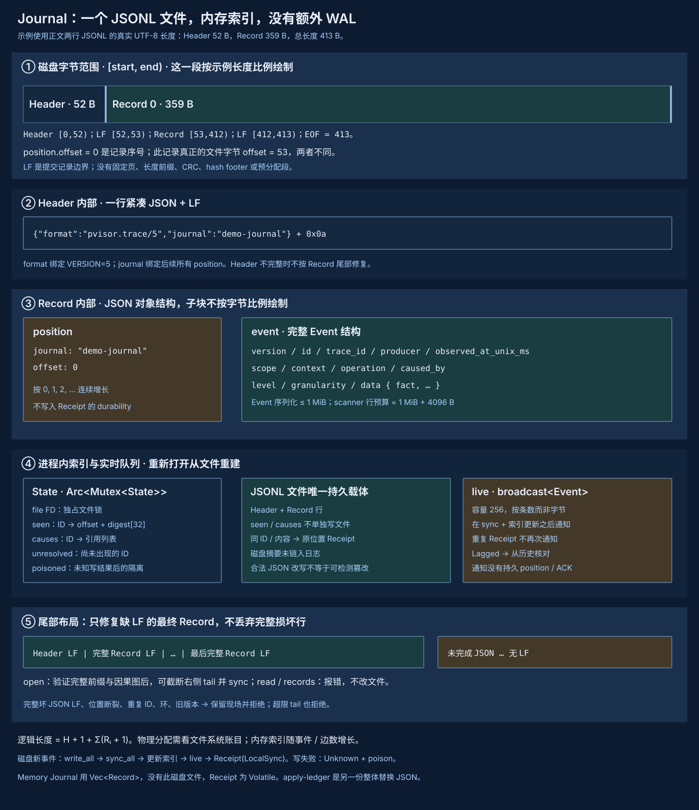

# Journal 设计

## 1. Motivation {#motivation}

一次 Run 会产生准入、改写、放置、派发、执行结果及 Gateway 观察。它们可能来自不同异步任务，观察时间也不保证严格单调。开发者需要一份可恢复的事实序列，回答“哪些事件已经提交、顺序是什么、重试是否重复”，而不是依赖 stderr 或实时订阅是否收到消息。

Journal 选择单写入者、JSONL 和逐条同步。提交接口返回包含事件 ID、Journal position 与 durability 的 Receipt。这样生产者可以在回执之后发布已提交事实，消费方可以在落后时读取历史。代价是每条磁盘事件一次同步，恢复和历史读取需要扫描文件。

它保存执行事实，不把日志追加与外部请求绑成同一事务。LocalSync 不等于跨节点复制，不证明外部副作用 exactly-once，也不使 RunRecord、Bundle 和文件 apply 账本获得共同提交锚点。Event 字段合同见 [Operation 与 Event](operations-events.md)，本页说明存储、提交和恢复。

## 2. 核心设计 {#core-design}

### 一份状态，一个提交顺序 {#ownership}

`Journal` 的克隆共享 `Arc<Mutex<State>>`。State 持有 journal ID、可选文件 FD、事件去重索引、因果图、未解析引用集合及 poisoned 标记。磁盘模式持独占文件锁，进程内 mutex 串行化同一 Journal 的追加；内存模式使用 `Vec<Record>`，回执为 Volatile。

| 数据 | 内容与用途 |
|---|---|
| `seen` | event ID → `(offset, SHA-256(serialized Event))`，定位重复提交并检查内容一致性 |
| `causes` | event ID → caused_by 列表，验证已知图中的环 |
| `unresolved` | 尚未出现的因果 ID，减少普通 append 的图遍历 |
| `memory` | 仅内存模式保存全部 Record；磁盘模式从文件重读 |
| `file` / `poisoned` | FD 与未知提交状态后的句柄隔离 |
| `live` | 容量 256 的 Tokio broadcast，提交后的实时 Event 通知 |

position 的 offset 是从 0 开始的记录序号，不是字节 offset，也不是观察时钟。同一 Journal 的提交顺序由它确定；`caused_by` 表达因果边，前向引用可以暂时未解析。二者不能替代外部系统的请求顺序或事务时序。

### 磁盘文件与内存索引 {#disk-layout}



```text
<recording destination>/
└── events.trace.jsonl         一行 header + 零到多行 Record；写入模式为 0600
```

CLI 的 `JournalRecording::open()` 在 destination 没有扩展名时选用上述文件名；有扩展名时直接作为文件路径。锁附着在这个文件 FD 上，没有独立 `.lock` 或 WAL 文件。新的父目录通过 durable mkdir helper 创建并同步目录项，但不自动保证整个路径树为私有 0700；应由调用方选定可信目录。

文件是 UTF-8 JSON 文本，没有固定二进制页、长度前缀或磁盘 hash footer。索引只在内存中，重新打开时扫描重建；没有 sidecar index、分段或自动 GC。SHA-256 用于当前句柄的事件去重，不是磁盘防篡改链。

## 3. 关键数据和核心机制详细设计 {#detailed-design}

### JSONL 布局与 schema {#format}

当前 `pvisor-core::event::VERSION` 为 5。第一行是 Header，后续每行是一个 Record，所有完整行都以 LF（`0x0a`）结束。下面是结构正确的示例，身份与时间值仅用于说明：

```jsonl
{"format":"pvisor.trace/5","journal":"demo-journal"}
{"position":{"journal":"demo-journal","offset":0},"event":{"version":5,"id":"event-0","trace_id":"trace-demo","producer":"demo","observed_at_unix_ms":0,"scope":["runtime:demo"],"context":null,"operation":null,"caused_by":[],"level":"info","granularity":"operation","data":{"fact":"observation","domain":"runtime","name":"example","version":1,"payload":null}}}
```

| 结构 | 字段与检查 |
|---|---|
| Header | `format` 必须等于 `pvisor.trace/5`；`journal` 非空且不超过 256 B；拒绝未知字段 |
| Record | `position: {journal, offset}` 与完整 Event；journal 与 Header 相同，offset 必须连续 |
| Event | version、id、trace_id、producer、observed_at_unix_ms、scope、context、operation、caused_by、level、granularity、data |
| Receipt | `event`、`position`、`durability`，不单独写入文件 |

Fact 采用 `fact` tagged enum。Header、Record、Position、Event 和 Fact 的未知字段都拒绝；Event 的具体校验由 Core 承担：身份长度、scope 数量与内容、caused_by 上限 64、禁止自身和重复引用、事实类型及引用字段的组合，序列化 Event 不超过 1 MiB。

若 Header JSON 长度为 H，第 i 个 Record JSON 长度为 Rᵢ，则文件逻辑大小为 `H + 1 + Σ(Rᵢ + 1)`，第 i 行开始位置为 `H + 1 + Σⱼ<i(Rⱼ + 1)`。物理分配使用文件系统账目，不由上述逻辑公式推断。scanner 每行限制为 `MAX_EVENT_BYTES + 4096`；超限行拒绝，不能把超大 EOF 尾部一概当作可修复数据。

### 打开、锁与初始化 {#open}

`Journal::open()` 创建父目录，使用 read/write/create、0600 与 `O_NOFOLLOW` 打开日志，修正文件权限，再尝试独占锁。`O_NOFOLLOW` 约束最后一个路径组件，不是整条目录链的认证。第二个合作 writer 不能同时打开同一锁定文件；锁不约束绕过协议直接改文件的程序。

空文件写 Header、LF，同步文件和父目录。非空文件执行可修复尾部的 scan，随后再次 `sync_all`，确保恢复到的完整记录在返回 LocalSync 重试回执前已经同步。重建 seen、causes、unresolved 后交付 Journal。

`Journal::read()` 用共享锁只读检查，要求 writer 已释放，不修复、不截断。`records()` 通过共享状态在 writer 句柄内读取，磁盘模式持 mutex 扫描，内存模式克隆 Vec。所有 Journal clone 和已接受的阻塞写任务都持有同一状态；只 drop 一个外层句柄不一定释放 writer 锁。

### 追加与回执 {#append}

`append()` 的顺序为：

1. 验证 Event，计算其序列化摘要，然后取得 mutex。
2. 拒绝 poisoned 状态；已见相同 ID 时比较摘要，相同返回原 Receipt，不追加也不再通知。
3. 检查新节点是否闭合因果环，分配 `seen.len()` 为下一个 offset，序列化 Record 并附 LF。
4. 磁盘模式 seek EOF、write_all、sync_all；内存模式将 Record 放入 Vec。
5. 更新 seen、unresolved、causes，发送 live Event，返回 Receipt。

因此正常磁盘回执发生在同步和索引更新之后。去重比较的是 Event 经 serde 重新序列化的内容，不是用户原始 JSON 空白；改动时间戳、producer 或 payload 后再用同 ID 会被拒绝。`Trace::event()` 每调用一次都会生成新 UUID，重试必须保留原 Event，不能重新调用工厂后期待去重。

`Trace` 提供 trace ID 与 producer，负责构造事实、默认 level / granularity 和时间戳；`emit()` 只返回 receipt.event。需要确认 position 与 durability 的调用方应保留完整 append 回执。同步辅助函数 `atomic_write()` 另用于 Overlay 元数据：它是临时文件＋rename 的整体替换，不是 Event append。

### 前向因果引用 {#causality}

Event 自身禁止 self-reference。一般新节点此前没有被任何记录引用，因此不能闭合旧环；append 只在 `unresolved` 包含新 ID 时沿其 caused_by 迭代遍历已知图。找到自身则 Rejected，未知父节点暂时留在 unresolved。

重新扫描时对全图执行迭代 DFS，避免长链递归栈溢出。验证只覆盖当前已知节点，不要求 EOF 时全部前向引用已解析，也不证明 operation/context 定义一定在本 Journal 中存在。timestamp 不参与环判断或位置分配。

### Unknown、污染与尾部恢复 {#recovery}

| 情况 | 返回 / 后续行为 |
|---|---|
| Event 无效、同 ID 不同内容、因果环 | Rejected，没有接纳这条新记录 |
| seek、write 或 sync 失败 | Unknown，置 poisoned，可能已有部分或完整字节 |
| poisoned 后 append / records | 拒绝继续使用；所有 clone 释放后重新打开 |
| 完整有效记录已落盘，但回执丢失 | reopen 同步并重建索引；同 Event ID 重试返回原位置 |
| 最后 Record 没有 LF | open 可截到最后完整行并同步；read / records 报错 |
| 完整 LF 行不是合法 JSON、位置断裂、重复 ID、版本不支持或因果环 | 报错，不能静默跳过或自动删掉完整行 |
| Header 缺 LF 或无效 | 打开失败，不按普通记录尾部修复 |

scan 在确认完整前缀格式和因果图后才执行尾部截断。即使最后 JSON 本身已经完整，没有 LF 也按未完成 Record 处理。截断后该事件不存在，需要用原 ID 再追加；反之完整行可能已经存在，所以 Unknown 不能解释成“没有提交”。

校验不是防篡改证明：把磁盘中的 payload 改成另一份仍合法的 JSON，且保持身份与图约束，并没有持久摘要链检测它。日志目录和文件权限是当前可信边界。文件损坏保留现场，不直接删除完整行以恢复可读性。

### 异步取消与实时订阅 {#async-live}

`append_async()` 将 journal clone 和 Event 交给 `spawn_blocking`。任务已提交给阻塞池后，等待方被取消不表示底层 append 被取消；它可能稍后拿到锁并完成写入。阻塞任务异常也返回 Unknown。超时后应按稳定事件 ID 查提交结果，不能重复派发外部操作来“补齐”事件。

live 只在成功提交后 send，重复 receipt 不再次 send，没有 receiver 也不影响提交。broadcast 保存最多 256 个 Event，按条数而非字节限制；慢消费者会 Lagged。通知不带持久 position，历史补读可通过事件 ID 与 Record position 关联。订阅不是完整 replay、持久 cursor 或消费者确认协议。

广播缓冲之外，文件模式 seen / causes 的内存随事件及因果边增长。open 和每次 records 都读取完整历史；当前没有页式查询或总 Journal 配额。只有这些成本确实成为瓶颈后，才应在保留身份与恢复合同的前提下引入分段或索引。

## 4. 实验数据支撑 {#experiments}

本次仅阅读代码与已有文档，没有编译或运行产品测试。源码提供两个 Journal 单元测试和四个 pvisor 集成测试；以下数字是测试构造与断言，不能写成新一轮实测结果。

| 文件 / 测试 | 场景与可复核断言 |
|---|---|
| `pvisor-journal/src/lib.rs::write_error_requires_recovery_before_another_receipt` | 注入只读 FD 写失败；Unknown 后继续 append / records 拒绝；reopen 后 offset 0 与 LocalSync |
| `cancelling_waiter_does_not_cancel_accepted_append` | mutex 阻塞已接受的 append，丢弃等待 Future 后仍可观察记录；重复提交仍只有一条 |
| `pvisor/tests/trace_journal.rs::durable_identity_and_idempotence_survive_reopen_and_truncated_tail` | 单写入锁、同 ID 重试、冲突内容拒绝、只读不修复、reopen 截尾和位置延续 |
| `complete_corruption_and_old_formats_are_never_silently_repaired` | 完整损坏行和旧版本拒绝，文件字节保持原状 |
| `forward_causal_references_resolve_but_cycles_are_rejected` | 前向引用可解，闭环及 self-reference 拒绝 |
| `concurrent_appends_have_unique_positions_and_duplicate_retries_converge` | 40 个并发任务，其中 20 个提交同一 Event，另 20 个独立；断言共 21 条连续位置 |

这些检查验证去重、顺序和部分故障边界。只读 FD 注入不是 sync_all 在写后失败的完整实验；Future 取消测试使用内存模式，不测磁盘持久化；并发位置测试也不是吞吐基准。当前缺少每种 syscall 时刻的进程崩溃、断电、长日志恢复、subscriber lag 补读与设备存储故障矩阵。

没有可归入本次文档的磁盘吞吐 / p99 fsync / 恢复峰值内存数据，因此不虚构数值。代码路径明确每条磁盘新事件一次 sync_all、重复提交不再写文件、open / records 做全量扫描。量级增长与同步成本是下一轮应测的重点。

## 5. 使用建议 {#usage}

需要磁盘回执的生产者显式使用 `Journal::open()` 并选可信目录；`Journal::default()` 和 `Journal::memory()` 只提供 Volatile。不同 producer 分享同一 Journal clone，不能各自打开同文件争夺 writer。CLI `finish()` 没有额外批量 flush，成功 append 已逐条同步。

为每个待提交 Event 保留稳定 ID 与完整内容，成功后保留 Receipt。Unknown 或等待取消后，停止复用不可信句柄，释放所有 clone / 活跃写任务，再恢复并核对记录；不要生成新 Event ID 掩盖原提交是否成功，也不要重做远程副作用作为日志重试。

完整历史从 Journal 读取，live 仅用于及时展示。消费端显式处理 Lagged，磁盘运行中的历史查询用已有 Journal.records；独立 read 必须等 writer 关闭。对大型 payload，256 条通知也可能占用可观内存，应同时量事件大小与消费者速度。

保留 damaged 文件及 RunRecord / Bundle / apply ledger 进行联合诊断；它们没有共同原子提交点，缺一项不能自动判定整个 Run 未执行。规模评估应分别测 append 同步、索引增长、历史扫描和恢复。当前不加入 group commit 或分布式日志假设：若需要，先定义更弱 / 更强回执、失败恢复和兼容格式，再改变实现。
