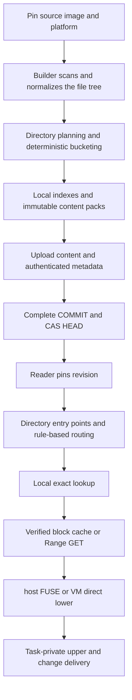

# Lazy Image V2：目录局部化打包与按需索引

以目录为访问局部性边界，在发布时合并小文件，在读取时按需加载精确索引与内容块，减少 S3-backed 镜像的小对象请求与启动期索引驻留。

| 项目 | 状态／范围 |
| --- | --- |
| 文档状态 | RFC／设计提案，2026-10-06；未批准、未实现、无性能验收结果 |
| 前置实现 | [共享镜像缓存 V1](shared-image-cache-storage.md)，当前唯一受支持格式 |
| 目标入口 | 文件系统／S3 backing store；host FUSE lower 与 VM direct virtio-fs lower |
| 格式关系 | 新格式、新 prefix、新句柄；不原地解释或改写 V1 |
| 跟踪入口 | [路线图：小文件供给优化](../community/roadmap.md#lazy-image-small-files) |

## 1. 问题与决策摘要 {#summary}

V1 已有独立镜像元数据、分页索引、内容寻址与条件发布，不要求启动时展开整个目录树。其内容块以每个文件的 offset 0 独立切分，最大 1 MiB；不同文件不共享 pack，小文件使用自身大小的对象，**不是每个小文件都补齐为 1 MiB**。大量不同小文件仍可能产生大量 GET／PUT；冷元数据查询还会产生依赖性的分页读取。

V2 提议：

1. 小目录的直接文件集合使用一个 pack；大目录中的小文件使用固定算法的 hash 前缀分桶，超限桶递归细分。
2. 顶层保存目录与规则入口，不保存全镜像逐文件物理位置表；精确文件条目在目录局部、可分页的索引中。
3. 文件内容身份与 pack 位置分离；pack 内容不可变、可范围读取，索引与属性变化不强制改写内容包。
4. 使用元数据缓存、已校验内容块缓存、相邻请求合并和有界预取，不把每个文件访问直接翻译为一个 S3 GET。
5. 保留 V1 的平台隔离、固定 revision、HEAD CAS 与内容校验原则；格式演进不改变执行器隔离和任务修改语义。

这是减少准备与访问成本的假设，不保证所有任务更快。纯 hash 分组会损失局部性，打包会造成更新放大与物理去重损失；低复用首次发布必须入账。

## 2. 目标与非目标 {#scope}

目标：减少小对象数量、冷启动必需的索引下载／解析／RSS，以及小文件密集负载的远端等待；控制读取、缓存、发布内存与请求并发的上界；保持文件系统正确性。

非目标：消除全部文件元数据、提供可变共享 pack、构建跨镜像全局引用计数数据库、替代 OCI 构建流水线、提供集群调度或在线并发 GC、自动获得 DAX／guest-host 页共享。完整扫描、copy-up 和自包含导出仍可能读取全部相关内容。

Nydus／EROFS 是实现路线的评估对象，不是当前依赖承诺。若成熟组件满足接入与语义要求，可复用其数据面，不要求为实施本提案重复开发全部机制。

## 3. 必须保持的不变量 {#invariants}

- 一次打开固定 `image-key + platform + revision`；tag 变化不改变运行中的视图。
- 镜像／平台元数据独立，可共享的只有不可变内容；不同租户共享还须服从权限边界。
- 路由成功不代表文件存在；不存在由精确查找确认，网络／校验失败不能转成 ENOENT。
- 文件路径、basename 和 symlink 目标保留原始字节，不强制 UTF-8；hash 不替代路径比较。
- 属性、目录项、内容身份、hardlink 身份分别建模。相同内容不意味着相同 inode。
- 所有返回数据和使用的索引页先验证；S3 ETag 只作 CAS token，不作 SHA-256。
- 任意元数据与内容 miss 不持有全服务锁；下载、解析、解压与缓存均有预算。
- HEAD 是新 revision 的可见性提交点；COMMIT 可读不代表 tag 已提交。

## 4. 架构与职责 {#architecture}



构建器负责源内容固定、目录规划、序列化、校验与发布。读取器负责路径查找、枚举、范围读取和故障传播。节点缓存负责预算、淘汰和 miss 合并。Overlay／runner 继续负责私有修改、copy-up 和生命周期，不能让某个任务写入共享 pack。

## 5. 目录边界与初始策略 {#policy}

### 5.1 目录的定义

基础策略按**一个目录的直接子项**规划；子目录独立递归规划，不把整个根目录或子树自动吞并。这样路径逐级解析清晰，父目录变化不必重打所有子目录。

例如 `pkg/` 与 `pkg/sub/` 可以各有一个 pack。未来的“小子树整体打包”须定义 owner、子目录入口和拆分迁移规则，使用新的 policy ID；不是基础格式的隐式行为。

### 5.2 初始候选参数

这些参数用于原型，须通过实验选择；不是现有默认值或性能承诺。每个 revision 记录实际 policy，读取器不能依赖本机默认配置。

| 参数 | 初始候选 | 计量定义 |
| --- | --- | --- |
| small_file_max_bytes | 64 KiB | 普通文件的逻辑长度；超过者走独立大文件块 |
| pack_max_payload_bytes | 1 MiB | 去重后原始内容总长；不含索引，不按压缩后大小判定 |
| bucket_max_entries | 4,096 | 精确目录项数量，包括空文件与非普通文件 |
| bucket_max_metadata_bytes | 1 MiB | 局部索引完整编码长度，包括页 padding |
| metadata_page_bytes | 64 KiB | 局部索引与路由索引页大小 |
| payload_block_bytes | 64 KiB | raw pack 的读取与校验块大小 |
| large_file_chunk_bytes | 1 MiB | 独立大文件内容块大小 |
| route_radix_bits | 4 | 每次 hash 前缀细分的位数 |
| initial_encoding | raw | 初版不引入整包压缩 |

小文件筛选与桶限额是两件事：目录可包含大文件，局部索引仍保存其条目，但不把其大文件内容放进小文件 pack。空文件不占内容空间，仍计入条目和元数据预算。

内容、条目数与元数据长度任一超限就拆桶。1 MiB 内容阈值不能限制百万个空文件；单条记录超出格式限制则明确拒绝发布。

### 5.3 确定性 hash 分桶

目录使用 `single` 或 `hash-prefix` 模式：所有条目及小文件去重内容符合限额时为 `single`，否则按以下规则划分其直接子项，包括子目录、大文件、空文件和 symlink 的条目。

路由 key 定义为 `SHA256(domain || u32_le(basename_length) || basename_bytes)`；domain 是版本固定的字节串 `pvisor-lazy-v2-route` 后跟一个 NUL。basename 不包含父路径、不含 `/` 或 NUL；不进行大小写折叠或 Unicode 规范化。root 使用独立目录标识，不作为 basename 参与此算法。

先按最高 4 bits 分 16 桶；超限桶再使用下一组 4 bits，直至满足预算。空桶使用显式 EMPTY；正常桶使用 LEAF；分裂桶使用 SPLIT。完整 SHA-256 最多提供 64 级前缀；极端冲突或同 hash 的不同名称超限时使用有界的 raw-basename B+tree 溢出桶，不无限递归，也不假设没有碰撞。

溢出桶的 B+tree 按原始名称分割为满足同样内容／元数据预算的叶分区，每分区拥有自己的 pack；只有溢出入口可超过单桶总量，其页大小、树深度与总访问量仍受限。重复名称拒绝发布，不能用 hash 碰撞机制接纳重复目录项。

同输入、同 policy、同编码版本必须产生相同路由、条目顺序、对象字节与摘要。使用 raw-basename 排序，不使用 HashMap 遍历顺序。先统计再分桶；不能让输入遍历顺序决定边界。

hash 前缀允许局部桶分裂，不使用会导致全目录重分布的 `hash % bucket_count`。阈值变化仍可能改变布局，因此属于不同 policy；不得在读取时重新计算发布布局。

## 6. 两级索引与“通配符”语义 {#index}

### 6.1 路由索引，不是文件存在性索引

概念上可以把某条路由写成 `hash=a* -> bucket-X`，但它**不是路径 glob**，不能解释为某类路径一定存在。落盘是 radix 路由记录，不保存通配符字符串。

路由叶指向经过认证的局部索引根；SPLIT 指向下一路由页；EMPTY 才能证明该桶无条目。读取器必须验证前缀覆盖、互斥、深度和页引用。

小目录只需要一个精确索引入口；巨型目录的路由本身也分页，不能把所有桶映射放进启动 JSON。启动读取有界控制对象和 root 页，不递归下载全目录树。

### 6.2 局部精确索引

局部索引使用 raw-basename 排序的只读 B+tree，记录名称、类型、属性、inode/link-group、symlink 目标、子目录描述符或内容描述符。可变字节保存在认证 arena 页中；叶记录可以引用 arena，不能依靠未经校验的外部 offset。

普通文件内容描述符为 `EMPTY`、`PACK_SPAN` 或 `CHUNKS`：

| 类型 | 必需信息 |
| --- | --- |
| EMPTY | 文件长度 0 与空内容摘要，无数据对象 |
| PACK_SPAN | whole-file SHA-256、长度、pack ID、pack 内 offset、认证块目录引用 |
| CHUNKS | whole-file SHA-256、长度、按序独立块的 digest／length；描述符列表分页 |

文件元数据与 pack 分开，路径或权限改变不必改变 payload。hardlink 使用镜像 revision 内稳定分配的 link-group；禁止不一致的属性与内容。V1 没有实现 xattr 存储，V2 不把它当作已有能力：启用 xattr 需要明确编码／预算与入口支持；未支持的必需属性不得静默丢弃。

### 6.3 readdir 与负查找

`lookup(parent, basename)` 计算路由，读取目标局部索引并精确比较名称；hash 碰撞使用原始名称区分。缺失只有在已校验页确定没有条目时返回。

`readdir` 按 radix 桶顺序、桶内 raw-basename 顺序输出；跨桶不承诺全目录词典序。cookie 绑定 revision、目录、叶桶和页／slot，保持同 revision 可重现；不能沿用 V1 cookie 编码。完整枚举需要遍历所有相关页，是 O(N) 工作，不承诺常数时间。

负查找缓存按 revision 与父目录／basename 隔离；错误不缓存成负条目。symbolic link 解析、路径权限检查和 escape 防护由文件服务按现有契约执行，索引不得把 symlink 当作目录直接遍历。

### 6.4 索引规模边界

总文件元数据仍为 O(N)，路由规模随桶数增长。优化目标是少重复完整路径、使用紧凑局部记录，并让启动下载／RSS 不必 O(N)，不是消除文件信息。完整扫描与全树投影仍会消耗相应资源。

### 6.5 查找示例

访问 `/usr/lib/pkg/config.py` 时，读取器从固定 root 逐级查询 `usr`、`lib`、`pkg` 的已校验条目，取得 `pkg` 目录描述符。若它为 `single`，直接查局部索引；若为 `hash-prefix`，计算 `config.py` 的路由 key，并沿已发布的 LEAF／SPLIT 记录找到桶。前缀 `a*`、`a3*` 仅作路由示意，不是这些名称的实际 hash。

在桶中精确匹配 `config.py`，得到属性和 PACK_SPAN，验证对应块目录，再从缓存或远端取覆盖 span 的块。读取另一个文件若命中相同块，不再请求 S3；若只是位于同一个 pack 的其他未缓存块，仍可能产生请求。目录元数据已缓存时跳过相应远端访问，首次 miss 不能承诺固定 GET 数。

查找一个不存在的名称，只能由认证 EMPTY 路由或精确索引的缺失结果确认；S3 对象缺失意味着损坏／依赖缺失，不是路径不存在。

## 7. pack 内容布局、读取与完整性 {#packs}

### 7.1 内容与物理位置解耦

同桶内按 whole-file digest 去重并排序，payload 是独特非空小文件内容的无间隙拼接；不同内容摘要相同但长度／字节不一致时拒绝发布。索引保存 span，文件属性和路径不写进 payload。

`pack_id = SHA256(payload_bytes)`。相同内容集合产生相同 payload，不受目录名称、权限、发布时间影响；不同邻居集合仍可能产生不同 pack。此规则使改属性／部分重命名有机会复用，但不承诺任意跨镜像去重。

每 pack 最多 1 MiB 的候选 raw 内容，可被 64 KiB 校验块覆盖。小文件可跨块；读取范围按覆盖它的块取回，末块使用实际长度。不能把未校验的精确字节 Range GET 直接返回应用。

### 7.2 部分读取的认证链

COMMIT 认证元数据根描述符；目录／路由／局部索引内部页携带子页摘要，叶引用认证的内容描述符。pack 描述符引用有大小上限的块目录，其 digest／length 由认证索引覆盖；目录包含每块长度与 SHA-256。块目录不需要包含自身 digest。

首次读取验证块目录，随后只获取、验证覆盖的内容块。整包下载额外验证 pack_id；整文件物化额外验证 whole-file digest。页引用包含对象长度、页 offset／length 与摘要，验证成功后才解释记录。认证树不需要启动时下载全镜像 checksums 清单。

所有页的编码使用固定版本、little-endian、长度前缀原始字节和确定性 padding；摘要不依赖本机 struct 布局。COMMIT 的 exact-byte hash 是 revision，COMMIT 不含自身 revision；子引用只指向下层对象，禁止认证依赖环。

这是逻辑 schema，不是已冻结的逐字节 ABI。编码实现之前必须补齐 header、record width、offset、错误码与 golden fixtures；禁止仅据此文档发布生产 V2 对象。

### 7.3 压缩演进

初版 raw 用于隔离打包与合并读取的收益。未来可增加独立压缩 frame：记录压缩／解压长度、offset、codec、encoded digest 与解压上限；每次只解压所需 frame。codec 参数和版本进入 policy／feature 标识。不能整包 gzip 后声称支持低放大随机访问，也不能用压缩后大小规避逻辑容量预算。

## 8. 存储树与身份 {#storage}

以下是 V2 提议布局；与 V1 使用不同 bucket prefix／目录。

```text
<v2-prefix>/
├── format.json
├── meta/<image-key>/identity.json
├── meta/<image-key>/platforms/<platform>/HEAD.json
├── meta/<image-key>/platforms/<platform>/revisions/<revision>/
│   ├── manifest.json
│   ├── config.json
│   ├── policy.json
│   ├── tree/                 # 分页目录、路由与局部精确索引
│   ├── inventory/            # 分页完整对象清单，非启动必读
│   └── COMMIT.json
├── meta/<image-key>/platforms/<platform>/uploads/<upload-id>/
│   ├── plan.json
│   └── progress.json
└── data/
    ├── packs/sha256/<p0>/<p1>/<full-digest>
    ├── pack-tables/sha256/<p0>/<p1>/<full-digest>
    └── chunks/sha256/<p0>/<p1>/<full-digest>
```

format 固定版本、hash、支持的编码与硬上限；policy 固定本 revision 的规划参数并被 COMMIT 认证。目录描述符和内容位置属于镜像 revision，不建立可变全局位置表。身份规范沿用 V1 的 canonical reference、image-key 和 platform 定义。

提议句柄为 `pvisor-v2:<image-key>:<platform>:<revision-hex>`，不是当前可用接口。manifest digest 继续表示 OCI provenance，不代替完整物理句柄。读者缓存必须隔离 V1／V2、存储权限域和对象类型。

## 9. 发布、去重与增量更新 {#publication}

发布流程：固定源 manifest／platform，观察 HEAD CAS token；扫描文件树，构建确定性计划；生成／上传 pack、chunk 和块目录；自底向上上传认证元数据与 inventory；验证完整闭包；写 COMMIT；最后 CAS HEAD。

immutable 对象条件创建，复用前验证摘要／长度；同镜像同平台冲突明确失败，不盲覆盖。HEAD 包含唯一 publication_id；提交响应丢失时，重新读取并匹配完整内容和该 ID，区分本次提交与其他发布。上传进度不含凭据，不参与 revision hash。

构建内存必须有预算，可用临时磁盘排序与分桶；候选限额不能被“先把整个镜像装进 HashMap”绕过。源必须不可变或已冻结；扫描期间变化导致失败／重试，不生成混合状态镜像。

### 去重边界

- 相同完整 pack／chunk／块目录可跨镜像复用；大文件保留 V1 风格的内容块复用。
- 小文件内容身份仍独立，但**相同小文件位于不同 pack 时，其物理字节可能重复**。内容身份与位置分离只是进一步复用的前提，不保证物理去重。
- 优先复用未变化的目录桶与公共依赖的既有 pack。允许已知基准 revision 的整个相同桶复用，但基准身份与策略必须固定。
- 不引入为单文件去重而查询的全局可变数据库。跨不同桶／不同目录的细粒度复用如需新增位置层，另立 RFC，计入索引和请求成本。

修改一个文件会重新生成所在 pack，改变条目数可能触发桶分裂／合并。初版布局只由当前输入与 policy 决定，不采用历史相关的 hysteresis；更新放大是显式代价。应测 rename、加删文件、修改公共依赖的对象 churn 和重上传字节。

## 10. 读取、缓存与请求预算 {#runtime}

启动只验证 format、HEAD／固定 handle、COMMIT、必要 config／policy 与 root 索引；不读取完整 inventory 或所有子目录。控制对象和根入口使用有界并行组，依赖性遍历仍可能串行。

缓存分三层：认证元数据页、认证内容块、可选完整已校验 pack。key 包含存储位置／权限域、格式、对象 digest 与块／页位置；目录结果另绑定 revision。不能因跨镜像去重绕过授权，也不能把一种权限域的缓存用于另一域。

同块并发 miss 使用 singleflight；不相关请求不串行化。相邻块可合并为连续 Range GET，返回后逐块校验再标记 ready。短响应、错误范围或校验失败丢弃，不污染命中状态。持久缓存通过原子提交记录已校验范围，崩溃后不把部分文件当完整对象。

预取必须设并发、字节和缓存预算，前台请求优先；初版仅按已选桶和相邻块预取，不默认下载整个目录。暂停任务或取消读取只释放其等待者，不能无条件取消其他任务共享的下载。超时、重试次数与总截止时间显式配置；权限错误不无限重试。

copy-up 完整物化原文件后才写私有 upper；checkpoint／自包含导出按现有范围补齐内容，不因打包遗漏未访问文件。VM direct 后端不应为采用 V2 自动退回中间 host FUSE；若选择 Nydus 挂载方案，单独评价额外路径与部署成本。

## 11. 兼容、迁移与 GC {#compatibility}

V1 prefix 与 format.json 保持不变，旧程序拒绝 V2。V2 读支持须通过版本显式分派，不能把 `format_version` 改为 2 或改目录名视为迁移。

迁移工具读取固定 V1 revision，验证元数据／内容，生成 V2 revision，输出旧句柄到新句柄与逻辑树等价报告；迁移可能需全量下载，应记录字节与成本。也可从固定 OCI manifest 重新发布。不能静默替换旧 Job／checkpoint 的 lower handle。

回滚依赖保留的 V1 revision 与对象；双格式运行会占额外空间。V2 发布失败不影响旧 HEAD。源码或存储删除前必须证明所有仍需恢复的 Job／checkpoint 依赖已迁移或明确退休。

pack 是共享对象，删除一个镜像不能直接删 pack。离线 GC 的初始边界沿用 V1：冻结发布与元数据变更，确认涉及读者／发布者停止，遍历所有保留 COMMIT 的 inventory，mark 所有 pack、块目录、chunks 与元数据依赖，然后 sweep。无租约的只读客户端不能靠 grace period 推断已退出；S3 lifecycle 不能盲删仍被固定 revision 引用的数据。

在线并发 GC 不在本提案内。读取缓存的有界淘汰与 backing store 对象回收是不同机制；离线恢复需要哪些对象，不能由节点缓存命中情况决定。

## 12. 安全与资源上限 {#security}

除每桶限额外，读取器必须限制控制对象长度、全镜像条目数、路径／目标长度、目录深度、B+tree 深度、单操作页访问数、总下载字节、并发 miss 与预取内存。具体硬上限与拒绝错误码在编码冻结前确定，不能继承 V1 的 200,000 条目上限同时声称 V2 已支持百万文件。

验证整数溢出、offset+length、重复名称、非法 parent、link-group 一致性、前缀重叠／遗漏、页循环和无效对象引用。未知必需 feature 拒绝打开。设备／特殊节点遵循执行器 admission，不因镜像包含它们自动在宿主创建。

SHA-256 校验不是发布者认证。bucket 权限保护可变 HEAD、format 与 provenance；读者最小 GetObject，发布者条件读写，GC 单独列举／删除权限。摘要、对象大小、访问时序也可能泄露内容关系，跨租户共享需独立评估。

## 13. 验证与可观测性 {#validation}

正确性先于计时。使用固定输入和输出校验，对比 V1 与 V2 的完整逻辑树、属性、hardlink 和读内容；覆盖非 UTF-8 名称、空文件、symlink、阈值边界、跨块 span、大目录、单个超长记录和人工注入的 hash 碰撞。

格式测试包括 golden bytes、跨进程可重复构建、随机遍历顺序、未知版本、截断页、错误 Range 响应、损坏块、恶意 offset／循环、缓存中断与修复。状态测试包括不同镜像／平台并发、HEAD 冲突和响应丢失、固定旧 revision、取消共享 miss、首次 copy-up 与完整导出。host／VM 两入口分别验证，不用一个入口的通过替代另一个。

| 指标组 | 必需指标 |
| --- | --- |
| 索引 | 控制／路由／精确索引请求数、下载字节、解析／验证 CPU、启动与峰值 RSS |
| 内容 | GET／PUT、请求合并率、singleflight 等待者、有效字节／传输字节、缓存命中与占用 |
| 发布 | 扫描／hash／打包／上传耗时、峰值内存与临时磁盘、对象数、unique physical bytes、更新 churn |
| 任务 | 首次有效工具调用、正确完成时间、失败／重试／超时、同机活跃任务受干扰程度 |
| 成本 | 首次发布、持久存储、请求、传输、节点缓存与执行资源；每个正确完成任务总成本 |

指标记录格式、policy、源 digest、缓存状态与并发预算，区分前台和预取流量；不要把失败记为零耗时。

### 工程实验计划

尚未运行实验。开始测量前必须在 benchmark registry 登记问题、角色、入口与对照；不在此 RFC 创建已完成的 benchmark ID 或性能结论。

对照为 V1；V2 pack 但逐文件范围请求；V2 pack 加块缓存／请求合并／预取。另评估 Nydus／EROFS 路线，保持隔离方式、后端和总预算尽量一致，区分格式收益与运行路径收益。

负载覆盖 Python import、Node.js 依赖加载、目录 stat／readdir、Git 扫描、真实编译／测试；构造小文件密集目录、嵌套目录、空文件密集目录及稀疏／全量访问。规模覆盖 1,000／10,000／100,000 条目，更大规模在硬上限允许后加入；fanout 覆盖 1／3／28，访问比例覆盖 5%／10%／50%／100%。

分别测首次导入／发布、已发布镜像冷节点、暖缓存，以及并发 burst 和持续淘汰。首次 OCI 准备不得移出总成本口径。扫阈值和粒度，报告请求节省与读放大的 Pareto 权衡。

按仓库 benchmark 规则同批随机对照，报告样本数、失败、干扰剔除及中位差的 95% CI。尾延迟需足够样本；不凭少量样本报告 P99。工程 A/B 与诊断保留在设计／证据中，不直接变成用户页优势百分比。

## 14. 实施阶段与未决事项 {#delivery}

| 阶段 | 输出与退出条件 |
| --- | --- |
| P0：设计审查 | 确认直接目录边界、路由 key、局部元数据与物理去重权衡；评估 Nydus／EROFS；不宣布架构已批准 |
| P1：格式原型 | 冻结字节编码与硬上限，planner／builder／离线 validator、golden fixtures；验证确定性和异常拒绝 |
| P2：读路径 | 文件系统先实现，S3 Range／校验／有界缓存随后；host 与 VM 接入，完整语义与故障测试 |
| P3：发布与迁移 | CAS／恢复、inventory、V1 双读与显式迁移工具；明确保留与离线 GC 操作边界 |
| P4：性能验收 | 完成登记的工程 A/B 与全成本评估；结果决定阈值、预取默认与是否启用 V2 |

启用前仍需决策：1 MiB／64 KiB 是否合适，raw 是否足够，目录与 package 分组的取舍，跨不同 pack 的小文件物理复用是否值得额外位置索引，xattr／特殊节点的准确支持矩阵，以及选择自有格式还是成熟组件的数据面。

V2 不能仅凭减少对象数量进入默认路径：必须同时证明文件语义、可恢复性、资源上界和目标负载的端到端收益；收益不成立时保留 V1／全量准备选项，不弱化验收条件。
