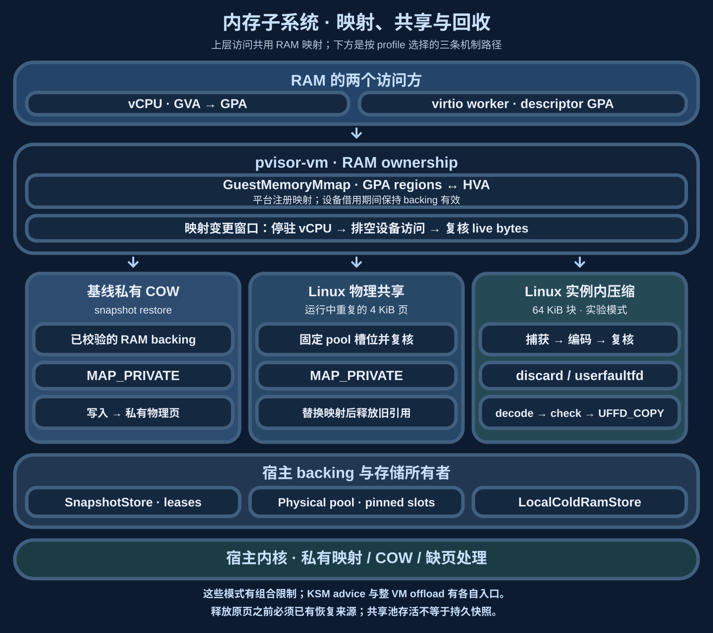
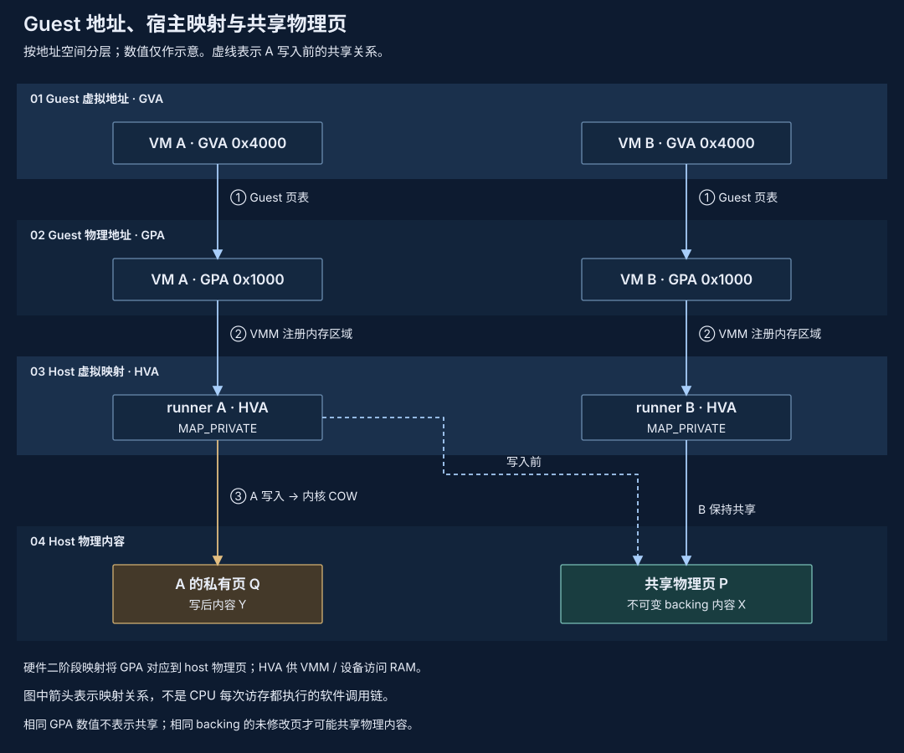
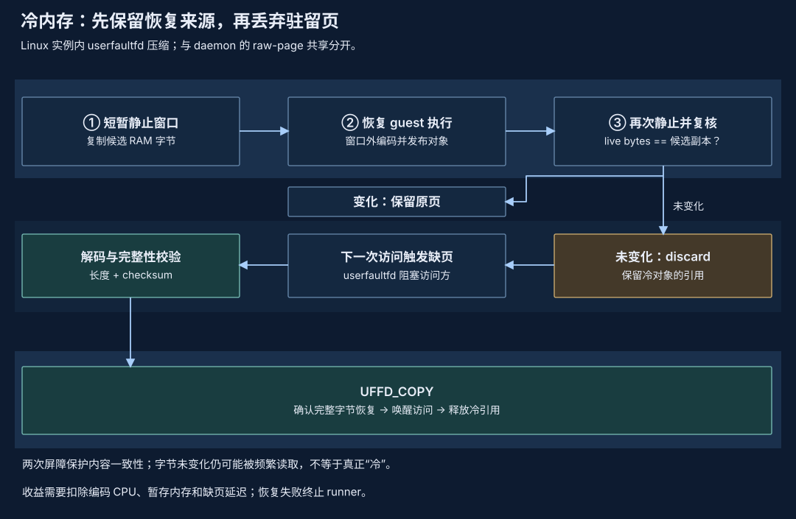

# 内存子系统：映射、共享与回收

相似环境与暂时闲置的工作集需要不同策略：共享减少重复副本，压缩减少保留字节，offload 降低驻留量。选择机制时同时考虑恢复来源、私有写入、CPU、峰值与下一次工具访问的延迟。

## 总体架构与设计理念 {#architecture}

总图中的 RAM 块同时服务 vCPU 和虚拟设备。vCPU 通过硬件地址转换访问 guest RAM；设备从 descriptor 中取得 GPA，通过 VMM 映射访问同一批字节。共享、压缩与回收都要覆盖这两类访问方。

| 对象 | 所有者 | 生命周期约束 |
| --- | --- | --- |
| GPA 区域与 HVA 映射 | `pvisor-vm` 的 guest memory / backend | 设备 lease 存续期间不得撤销其映射 |
| 快照 backing 与租约 | snapshot store；VM 持有映射 | 验证身份与范围后映射，所有使用结束后才释放 |
| 共享槽位与引用 | daemon physical pool；VM 持有私有映射 | 仍被映射的槽位不能重用；断连需要核对进程存活 |
| 编码冷块与恢复引用 | cold store；VM pager 持有块状态 | 有可校验恢复对象才回收原页，恢复成功后释放冷引用 |

### 地址转换与写入隔离 {#address-space}

GVA 是 guest 进程地址，guest 页表将它转成 GPA；KVM/HVF 注册 guest 内存区域，使 GPA 对应到宿主物理页。HVA 是宿主设备实现访问这批 RAM 的虚拟地址。相同 GPA 只表示各自机器里的相同位置，共享物理内容还需要相同 backing 和适当映射。

`MAP_PRIVATE` 让多个实例读取同一不可变 backing，并把写入分离到自己的物理页。GPA 和 HVA 可以保持不变，背后的宿主物理页却已经不同；这正是 COW 的隔离点。guest 页表转换、宿主映射与文件内容共享是不同层次，不能用每个进程 RSS 的总和直接计算实际物理占用。

VM runtime 拥有地址映射和 CPU/设备一致性，Job 与 snapshot store 拥有完整状态发布和持久引用。Linux physical page pool 保管被引用的共享槽位，local compressed store 保管实例冷页的编码内容；两者有不同的恢复与故障合同。

在撤销原映射或回收原 RAM 前，先固定可靠的 backing 或恢复来源。Private COW 保持写入独立；活跃 pool reference 保证槽位不能被复用。运行态共享不是持久机器 checkpoint，pool 存活也不替代 durable state。

## 机制与适用工作集 {#capabilities}

| 机制 | 适用内容 | 主要代价与边界 |
| --- | --- | --- |
| snapshot 基线＋private COW | 从同一已校验 backing 恢复的未修改页 | 写后私有化；要求正确 backing 身份与兼容 profile |
| Linux KSM advice | 合格私有 RAM 中的重复内容（包括私有文件 COW 候选） | 异步扫描与 COW；宿主管理员控制 scanner |
| daemon physical page pool | 不同 VM session 中相同的驻留 4 KiB 页 | 有界扫描、引用和独立 pool 故障域；不压缩唯一页 |
| local live compression | 实例内独特但可压缩的冷内容 | userfaultfd 权限、编码 CPU 与 refault 成本 |
| whole-VM offload | 可停驻并保留恢复来源的闲置状态 | 写入与恢复成本、存储和峰值余量 |

去重机制见[内存去重](deduplication.md)，编码与存储取舍见[内存压缩](compression.md)、[实例内压缩](compression-local.md)与[卸载文件格式](offload-format.md)。历史[池化服务器压缩](compression-pool.md)保存编码对象，当前 Linux daemon physical pool 共享原文页，两种机制分别维护。

## 所有权与发布顺序 {#ownership}

1. 选择 resident 候选并获取内容快照，避免为了优化而触碰全部 sparse RAM。
2. 在 CPU/设备排空的边界内复核 live bytes。
3. 固定池对象引用，以 `MAP_PRIVATE` 替换匹配页；写入由内核 COW 私有化。
4. 撤销旧映射后释放旧引用。断联保留引用，直到 pidfd 确认 peer 退出。

这些步骤描述 Linux physical pool 路径。Snapshot COW、local compression 和 offload 各自拥有发布、恢复及清理顺序。映射替换和冻结由 VM 所有者执行，pool 不接受 guest 指针或直接发布完整 checkpoint。

同 UID peer 校验与 private socket 限定当前宿主信任边界，不提供任意多租户隔离。内容存在性与共享时延仍需纳入信任域选择。

### 压缩、缺页恢复与整机卸载 {#reclaim-path}

Linux 实例内冷压缩以 64 KiB 块工作。第一次短静止窗口捕获候选，窗口外编码并发布，第二次窗口复核 live bytes；只有未变且已有恢复引用的块才 discard。编码失败、预算拒绝或内容变化时，原页继续驻留。它依赖支持内核缺页的 userfaultfd 权限，并限制 RAM profile；普通 userspace fault 支持不足以恢复 vCPU 的内核访问。

访问冷块时，pager 取得恢复对象，校验长度与 checksum，将完整块通过 `UFFD_COPY` 放回原地址，再唤醒访问者。数据损坏会使 runner 失败。存储编码、暂存原文和恢复缓冲都有峰值开销；长期不变的块也可能频繁被读，现有策略属于驱逐/refault 探测。

整 VM offload 在机器一致性边界保留可恢复状态，再降低整机 RAM 驻留；它与在线逐块优化有不同的停止范围。当前 vCPU observation 是实验性观察接口，没有完整 wake deadline，不能据此自动判断可卸载。平台、profile 和恢复次序见[内存卸载](offload.md)；块级状态机见[实例内压缩](compression-local.md)。

## 容量与故障预算 {#budgets}

节点预算包含共享工作集、私有 COW、逐实例开销、pool/index、在途 scratch 和恢复余量。Sandbox hard limit、pool payload limit、PSS 与整组 cgroup charge 分开记账。Pool 在单 sandbox cgroup 外，不能仅按低 RSS 放宽准入。

默认 Linux daemon pool 配置有512 MiB storage、32,768 objects、32 connections和每连接32,768 references；4 KiB object ceiling实际将distinct共享内容限制为128 MiB。索引、映射与线程另有开销；put被拒绝时保留原 resident 页。具体部署见[共享工作集](../daemon/shared-working-set.md)和[daemon 运维](../daemon/operations.md)。

Pool丢失会使依赖VM失败；API重启可复用仍存活的pool，pool进程或宿主重启恢复尚未实现。压缩路径恢复时需要原文和缓冲，节省量也不能直接换成相同数量的新实例。

## 当前实现与组合限制 {#direction}

Linux daemon 使用显式 `serve --memory-pool` 启用原文页共享；它不需要 userfaultfd。实例内 live compression 使用独立 userfaultfd 模式。Snapshot capture/restore、file backing、whole-VM offload、KSM advice与冷页路径存在明确互斥检查；调用方应按支持profile选择，组合不自动热切换。

新共享和offload证据按配置、样本和计费范围保留在[VM 内存基准](../../benchmarks/vm-memory/index.md)。Ready省内存不保证更低lifecycle peak，高写入会减少共享收益。[概念验证](proof-of-concept.md)保留历史机制和失败材料；完整状态合同见[环境快照](../environment-snapshot.md)。

## 回到整体架构与源码 {#integration}

映射与块状态留在 VM 内，池或 store 只提供受引用保护的内容。虚拟设备经 RAM lease 加入同一静止边界；[完整快照](../environment-snapshot.md#consistent-cut)再把 CPU、RAM、设备和文件状态组合起来。[Daemon 准入](../daemon/admission.md)需要按整个节点预算容纳私有页、共享服务与恢复峰值，不能把某个局部压缩比直接换成并发上限。

源码入口：`crates/pvisor-vm/src/memory.rs`、`handle.rs`、`cold_ram_linux.rs`、`ram_dedup.rs` 与 `devices/virtio/memory_gate.rs`。接口与生命周期由 `api.rs` 定义；daemon 的共享对象预算与进程归属见[共享工作集](../daemon/shared-working-set.md)。
