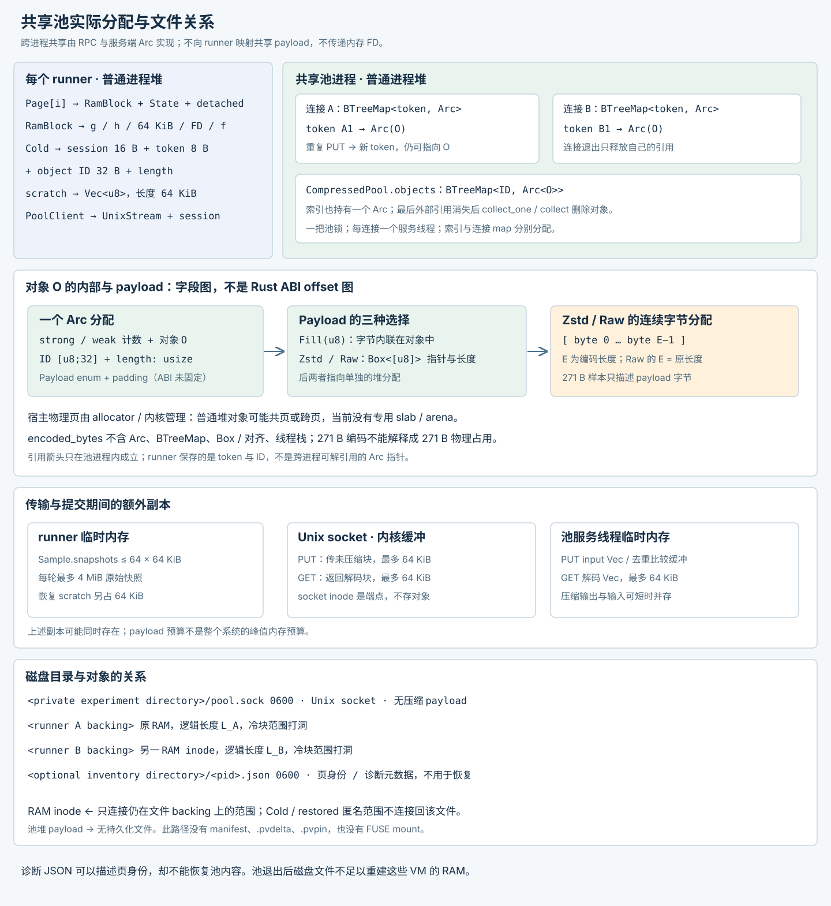

# 跨 VM 内存去重与冷页压缩

## 1. Motivation {#motivation}

多个 Agent VM 往往运行相同的系统和工具，保留相似的代码、缓存与运行时数据。每个 VM 各存一份 RAM，隔离关系简单，却会重复支付这些内容的内存成本。交互间隔还会留下暂时不用、下一次执行又需要的工作集。只暂停 vCPU 并不能释放它们。

pVisor 当前选择在宿主侧处理冷块：观察哪些 RAM 块暂时没有 CPU 或设备访问，将内容压缩并交给同一宿主上的共享池。相同内容只保存一份编码对象；访问时恢复到各 VM 自己的可写页。这样不要求 guest 配置 zram，也不要求应用主动保存状态。

收益取决于三个条件：内容是否重复、是否可压缩，以及冷窗口是否足够长。每次观察会改变 guest 访问权限，每次恢复都要付出传输、校验和重映射成本。写密集或频繁扫描整个工作集的负载可能很快抵消冷态收益。内存与执行延迟必须一起衡量。

本文描述 2026-10-03 工作树中的 macOS / Apple Silicon 实验实现，默认关闭。首版提供前台 `pvisor memory-pool` 服务及显式 CLI/SDK 接入，仍无池重启恢复或完整物理内存收益验收。旧的逐轮设计记录保留在仓库 `docs/macos-memory-sharing.md`，原始证据保留在 `review_project/06-evidence/macos-memory/`；本文按当前机制组织，实验数字只对应记录中的执行版本。

## 2. 核心设计 {#core-design}

### 共享对象，私有恢复页 {#ownership}

池持有不可变内容，不持有 guest 地址、vCPU 或设备对象。每个 runner 管理自己的地址映射、块状态和连接引用。两个 VM 交出相同块时，池中只保留一个对象；它们的引用独立释放。恢复后的可写匿名页属于各自 VM，一台 VM 的写入不会修改另一台的内容。

实际的地址映射、池分配和磁盘关系见下方[物理布局与文件关系](#physical-layout)。

这是压缩态的内容去重。当前 pager 没有将任意热匿名页合并成共同可写映射，也没有运行后台 KSM 扫描；恢复后再次出现两份驻留数据是允许的。原生共享基底 COW 已做过探针验证，但尚不是当前 pager 的热页共享策略。

| 方案 | 已有工作 | 取舍 |
|---|---|---|
| A：共同只读文件基底＋`MAP_PRIVATE` COW | 两进程 HVF 探针、页身份和写入隔离验证 | 利用系统 COW；私有修改需要独立的提交与回收合同 |
| B：共享基底＋HVF 写保护＋显式私有化 | stage-2 写 fault、重试与基底不变验证 | 控制更直接，但 CPU 与设备写必须都经过私有化入口 |
| C：不可变压缩池＋宿主冷页 pager | 当前完整 Linux VM 实验主线 | 压缩态去重，恢复为私有 RAM；增加 fault、RPC 和映射维护 |
| D：FUSE 压缩 backing＋整 VM offload | 独立的 [offload 实现](../offload/index.md) | 适合整 VM 闲置；没有页级温度判断，不能与 C 混用 |

### 职责与可用性 {#components}

| 组件 | 持有的数据 | 职责 |
|---|---|---|
| `CompressedPool` | 内容 ID → `Arc<CompressedObject>` | 编码、去重、预算和对象回收 |
| `ipc::serve` / `PoolClient` | session、token、连接引用 | 跨进程 PUT / GET / RELEASE / STATS |
| `vm::pager::Pager` | `Vec<Page>`、cursor、64 KiB scratch | 观察、冷块提交、CPU / 设备恢复 |
| `RamBlock` | GPA、host 地址、文件 FD / offset | HVF 权限、解除映射、私有恢复、文件打洞 |
| `VmmHandle` / `MemoryGate` | 状态转换锁、设备访问 lease | 在映射修改前暂停 CPU 并排空设备访问 |
| `inventory` 与实验脚本 | 页身份、驻留和进程账目 | 诊断与匹配实验，不参与去重决策 |

池是进程内存对象，没有 `.pvdelta` 后备。一个 Cold 块在原文件回收完成后，池引用是其内容的唯一保存来源。断线、协议损坏或恢复失败会停止受影响 runner；当前没有将它自动降级为原 backing 的能力。共享池因此也是共同的可用性边界，应只服务同用户、同信任域的实验 VM。

## 3. 关键数据和核心机制详细设计 {#detailed-design}

### 内容身份、编码与预算 {#content}

对象 ID 为：

```text
SHA-256("PVRES1\0\0" || decoded_length:u64_le || decoded_bytes)
```

域前缀使它与磁盘 generation ID 分开。输入长度为 1–65,536 B。`intern()` 先计算 ID；遇到已有 ID，Fill／Raw 直接逐字节核验内容，Zstd 解码后核验，长度与内容均一致才复用。新内容按以下顺序编码：

| Payload | 选择条件 | `encoded_bytes` 计量 |
|---|---|---:|
| `Fill(u8)` | 全块为同一字节，包括全零块 | 1 B |
| `Zstd(Box<[u8]>)` | zstd level 1 输出小于原内容 | 编码长度 |
| `Raw(Box<[u8]>)` | 压缩没有变小 | 原内容长度 |

`Box<[u8]>` 避免保留压缩 `Vec` 的最坏情况容量。恢复检查输出长度、解码长度和内容 ID。池同时限制 payload 总字节和对象数量；payload 预算不包括树节点、Arc、连接 token、线程栈、scratch 或分配器开销，也不限制处理一个新输入时的瞬时内存峰值。

索引用 `BTreeMap`，首版由一把池锁串行化。哈希、旧对象比较和新压缩发生在 `intern()` 中，调用者在此期间持有池锁，因此多 VM 提交可能互相等待。GET 持有本连接的 Arc，解码不需要持池锁。释放已知对象使用 `collect_one(id)`；容量不足或连接结束时才做全索引回收。对象仅在最后外部 Arc 释放后删除，没有隐藏 GC 线程，也没有磁盘代际合并。

### 物理布局与文件关系 {#physical-layout}

第一张图展开同一个 64 KiB 块的 GPA、HVA、宿主 backing 和文件 offset。本机一个块覆盖四个 16 KiB 宿主页：驻留时它们来自文件映射；Cold 时 GPA 解映射、HVA 替换为匿名 `PROT_NONE`；恢复后 HVA 不变，但 backing 已是私有匿名 RAM。原文件的洞不会被重新填成当前 RAM。


图中的 P / Q 只表示 backing 页，不是已测 PFN，也不保证物理连续或始终驻留。文件映射及其页缓存不是两份独立 RAM；虚拟范围也不等于已经分配了相同大小的物理页。

第二张图展开池进程的普通堆分配：内容索引和各连接的 token 表引用同一个 Arc 对象；对象包含 ID、长度和 Payload，Zstd / Raw 字节由单独的 `Box<[u8]>` 分配保存。runner 只持 token 与 ID，经过 Unix socket 传输原始块，没有直接映射池 payload。



当前没有专用 slab / arena，不能把小编码对象画成紧密占满一组宿主页。对象布局也没有固定 Rust ABI：图只列字段及真实分配关系，不给出未经验证的 struct offset。文件树中只有 socket 端点、各 VM 原 backing 和可选诊断 JSON；压缩对象没有磁盘文件，诊断 JSON 不是 manifest。

### 块状态与冷窗口 {#page-state}

pager 的 `Page` 由 `RamBlock`、`State` 和 `file_detached` 构成。`RamBlock` 保存 guest 地址、稳定 host 地址、64 KiB 长度及原文件范围。宿主页大小从系统读取；实验机器为 16 KiB，所以一个块覆盖四个宿主页，不能将 offload 的 4 KiB staging 单位当作重映射单位。

| State | CPU / 设备访问 | 内容位置 | 后续动作 |
|---|---|---|---|
| `Resident` | 正常访问 | 初始文件映射或恢复后的匿名页 | 后续轮转可启动观察 |
| `Observing(Instant)` | CPU 访问触发 fault；设备准备取消观察 | 宿主内容仍完整，HVF 权限为 no-access | 访问则回 Resident；无访问满 200 ms 可提交 |
| `Publishing` | CPU / 设备访问取消发布资格并回 Resident | 原映射仍在；另有块快照，PUT 在暂停区外执行 | 再次静止且状态未被访问作废才回收；否则释放多余池引用 |
| `Cold(RemoteObject)` | CPU fault / 设备准备必须先恢复 | 池内不可变对象；host 范围为匿名 `PROT_NONE` | GET、校验、私有映射、释放引用 |
| `Deferred(Instant)` | 正常访问 | 仍保留提交拒绝前的驻留内容 | 30 s 后重新观察，不沿用旧冷判断 |

no-access 覆盖 CPU 读、写和取指；设备访问通过准备入口取消观察。`mincore` 只能报告驻留，不能证明冷页。`ColdWindows` 另提供带 observation 版本的候选账本，供独立接口使用；当前 pager 直接用上述状态机，不依赖该账本执行回收。

启动等待 1 s，维护轮次之间休眠 250 ms。当前源码准备阶段最多执行 256 次观察/复制，访问最多一圈；提交阶段最多处理 64 个候选，两阶段各有 8 ms 软预算。Cold、未到期 Deferred 和未成熟 Observing 不占准备操作配额。每轮还限制最多 64 个原始快照（4 MiB）；快照与映射提交分别使用静止区，PUT、统计和文件回收在其外执行。软预算不是硬实时限制，250 ms 也不是严格周期。

十轮匹配 v1 对应修改前的“访问 256 块”配额；操作配额修正后的 v2 同负载三对复验已通过，见下方增量结果。两批运行时间不同，不能把全部差异精确归因于配额修改。

### 回收事务与文件关系 {#eviction}

`with_ram_quiesced()` 先取得 VM 状态转换锁，暂停 vCPU，再释放 VMM 锁尝试关闭设备 gate。用户已暂停的 VM 跳过；还有 retained buffer 时恢复 CPU 并跳过本轮。gate 成功关闭后才在 VMM / pager 锁内修改映射，完成后恢复执行。后台维护不把正常繁忙当作故障，也不等待普通 offload 的五秒设备排空期限。

成熟 Observing 块按当前 `Publishing` 实现执行：

1. 在第一个静止 epoch 将每块复制到独立 64 KiB snapshot，标记 Publishing，随后恢复 CPU / 设备执行。
2. 在暂停区外向池 PUT 快照并校验回复。此期间 CPU fault 或设备 prepare 可恢复原访问权限，并把 Publishing 置回 Resident，使该快照失去回收资格。
3. 再次尝试进入静止 epoch。仅对仍为 Publishing 且持有成功池引用的块置 Cold、解除 GPA 映射，并将原 HVA 替换成匿名 `PROT_NONE`。
4. 容量拒绝的未取消块回到 Deferred；被访问作废、提交超过软预算或没有取得静止窗口的块保留原内容，不使用旧快照破坏映射。多余池引用在暂停区外 RELEASE。
5. 恢复执行后，对首次脱离文件的范围执行 `F_PUNCHHOLE`；快照批次释放后，临时原始副本也释放。

这次把池发布移到暂停区外的修改已在工作树中。下方 v1 / v2 数据是其之前的运行；不能据此承诺新实现的暂停时间或峰值占用。

先取得内容引用，再破坏旧映射。文件打洞移到暂停区外，避免把文件 I/O 长尾放进 CPU 停顿；这依赖该文件范围永不重新映射给 VM。恢复始终使用私有匿名页，因此可以与原文件打洞并行。`file_detached` 保证每块只打洞一次；`PENDING_FILE_BYTES` 记录尚未完成的原文件回收范围，`PENDING_SNAPSHOT_BYTES` 记录暂存快照字节；恢复 scratch 另保留 64 KiB。

```text
<private experiment directory>/       调用方创建，属当前用户且权限不开放给其他用户
└── pool.sock                         Unix socket；实验 server 设为 0600

<VM backing path>                    原 file-backed RAM，长度不变，冷块范围逐步打洞
                                    不再是完整 RAM 快照；池内容不写入该文件
<optional inventory directory>/
└── <pid>.json                        诊断输出，不是恢复 manifest
```

池中对象没有单独文件，也没有持久 pin。FUSE 压缩 backing 在 executor 创建时被拒绝与实验池同开；whole-VM offload 也被拒绝。后台冷回收不发布 checkpoint，不改变公开 RunState，也不保存 CPU / 设备状态供新进程恢复。

### CPU 与设备恢复 {#restore}

HVF 在 MMIO 解码前将 data / instruction abort 交给 RAM resolver。pager 用 GPA 查找所属块；属于本 VM RAM 的 fault 恢复后返回 handled，重试原指令，不推进 PC。范围之外保留原 MMIO 路径。另一 vCPU 或设备可能已恢复该块，因此过期 fault 仍须返回 handled 并重试。

Cold 恢复由 pager 锁串行化：GET 到预留 scratch，检查长度和 ID，在原 host 地址分配可写私有匿名映射，复制非零内容，同步指令缓存，安装 GPA 映射，然后置 Resident 并 RELEASE。全零内容不主动写脏匿名页。同一内容在两 VM 中恢复为两份私有映射。记录的恢复耗时包含 RPC 和映射操作，但不包含等待 pager 锁的时间。

设备不能依赖 CPU fault。queue ring、descriptor header 和 payload 必须在读取或建立 slice 前准备其地址范围；准备 callback 运行时已持有访问 lease，且不持 gate 锁。descriptor、Reader / Writer 和保留的 packet 继续持 lease，使维护不能替换它们仍在使用的映射。空范围保守恢复全部 RAM，可能造成长停顿。准备错误或 panic 会 abort 隔离 VMM，因为当前 queue API 无法安全传播可恢复的 RAM 错误。VMM 在取得实验 RAM 块时拒绝带未受 gate 保护的 GPU、audio、input 或 TEE feature 的构建。

### 连接引用与协议 {#protocol}

协议为实验版本 `PVMEMP2`，数值使用小端序；它与 JSON VM 控制协议独立。server 为每个连接生成 16 B session。token 仅在该连接内有效，不允许用全局内容 ID 请求任意对象。

| 消息 | 请求布局 | 成功回复布局 |
|---|---|---|
| 握手 | 无 | magic 8 B（`PVMEMP2\0`）＋session 16 B |
| PUT（opcode 1） | opcode 1 B＋length u32＋原始数据 | status 1 B＋token u64＋ID 32 B＋length u32 |
| GET（opcode 2） | opcode 1 B＋token u64 | status 1 B＋length u32＋解码后的数据 |
| RELEASE（opcode 3） | opcode 1 B＋token u64 | status 1 B |
| STATS（opcode 4） | opcode 1 B | status 1 B＋四个 u64：payload、对象数、本连接引用数、跨连接对象数 |

成功 status 为 0；拒绝为 1＋消息长度 u32＋最多 256 B UTF-8。每次 PUT 都获得新 token，相同内容仍共享一个 Arc。RELEASE 只释放指定 token；断线释放全部本连接引用。跨连接对象数是本连接所持对象中还有外部引用的数量，是即时引用统计，不是精确的共享物理字节数。

`PoolClient` 通过非阻塞 socket 和 `poll` 实现每笔 exchange 的绝对期限，当前 runner 设为 5 s。部分读写、EINTR 和零星回复不刷新期限；握手单独计时。完整容量拒绝保留既有引用，pager 确认连接健康后保留驻留内容并退避。超时、截断或校验错误永久关闭会话并触发 fail-stop。期限仍受线程调度影响；服务端没有空闲引用过期，也没有通用的对端身份认证。端点授权、连接数量和服务生命周期由调用方负责。

### 诊断数据与源码位置 {#diagnostics}

页查询返回 `(object_id, object_offset, disposition)`，它是 VM backing 对象身份，不是 PFN。进程映射联集可按对象与偏移去重，但包括共享文件缓存；合成身份也可能让多个页报告同一键。RAM 校验依据当前“单 VM 无内部物理 alias”合同拒绝重复驻留键，同时验证覆盖和 disposition，不把键联集当作全机物理占用。

RAM inventory 的主要字段为 `pid`、`timestamp_ns`、`page_bytes`、`query_transaction_us`、`pending_file_bytes_upper`、`columns` 与 `pages`；pages 每行是 `[guest_address, object_id, object_offset, disposition]`。进程 inventory 使用 host 地址，另记录 region / scanned_pages / query_attempts。完整诊断只在显式开启后执行，可能暂停数百毫秒，应与普通 pager 延迟分开。

| 源码 | 核心入口 |
|---|---|
| `crates/pvisor/src/ram_backing/resident.rs` | `identity`、`intern`、`restore`、`collect_one` |
| `crates/pvisor/src/ram_backing/ipc.rs` | `serve`、`DeadlineStream`、`PoolClient` |
| `crates/pvisor-vm/src/cold_ram.rs` | `sample`、`fault`、`device_prepare`、VM 自有 worker |
| `crates/pvisor/src/executor/vm/pager.rs` | pool 授权及诊断目录配置 |
| `crates/pvisor-vm/src/vmm/ram.rs` | `RamBlock` 的 observe / discard / reclaim_file / restore |
| `crates/pvisor-vm/src/handle.rs` | `with_ram_quiesced`、offload 互斥 |
| `crates/pvisor-vm/src/hvf/mod.rs` | RAM fault 在 MMIO 前的分流与指令重试 |
| `crates/pvisor-vm/src/devices/virtio/memory_gate.rs` | 设备准备与访问 lease |
| `crates/pvisor/src/ram_backing/inventory.rs` | 映射页诊断与完整查询重试 |

## 4. 实验数据支撑 {#experiments}

以下整理仓库保留的实验及最新操作配额复验。原始 JSON 保留执行时源码 hash；历史版本、单次样本和三对匹配实验分别解释。完整物理收益的原验收目标为至少下降 40%，目前仍未通过。

### 从机制验证到完整 VM {#correctness-evidence}

| 证据文件（位于 `review_project/06-evidence/macos-memory/`） | 结果 | 可以支持的判断 |
|---|---|---|
| `hvf-cow-probe.json` | 四条原生路径各三次，12 组通过 | 底层共享基底、COW、冷恢复可行；没有完整设备路径 |
| `pool-check.json` | 两客户端各两份 64 KiB 引用，只存一份 271 B 编码对象；断线与最终回收通过 | 跨进程去重与独立引用生命周期正确；不是总内存测量 |
| `cold-vm-check.json` | 两个 2 vCPU / 256 MiB Linux VM，冷恢复与独立可变内容通过 | 首次完整路径；逻辑回收包含未使用零页 |
| `pool-loss-vm-release.json` | 依赖池的两 VM Failed，独立两 VM 正常；检测收尾约 0.369 s | 池丢失后的 fail-stop 与故障隔离，不是容错恢复 |
| `pool-stall-unbounded-io-vm-release.json` | 旧逐次 I/O 超时未在 10 s 窗口内失败 | 保留的失败证据，推动绝对期限修复 |
| `pool-stall-vm-release.json` | 修复后两依赖 VM Failed，独立 VM 正常；检测约 5.338 s | 卡住服务不会无限等待；没有高可用合同 |
| `cold-vm-stress-50-rounds-backoff-release.json` | 约 611 s 的冷热切换、RAM 与文件 I/O、容量拒绝退避通过 | 持续循环与资源回收的有限覆盖 |

### 匹配网络负载 {#network-evidence}

`matched-net-10-rounds-vm-release-sustained-net-10-v1.json` 是三对 baseline/cold，共六个 case；每 case 两 VM、每 VM 十轮网络 burst。单 case 约 151–161 s，累计 932.5 s；120 次 burst 接收 payload 合计 3.75 GiB，回显方向另计。它不是同一 VM 连续运行 15.5 分钟。

guest 内容、每轮网络内容、VM 写入独立性、共享引用和 runner 收尾均通过。持续采样覆盖率六次均为 100%；后段 2,690 次宿主样本为真实 WARN，无守卫错误或终止。这是观察既有 WARN 下的运行，没有主动压力升级。

| 指标 | 三对结果 | 中位数 / 解释 |
|---|---|---|
| 初始 quiet RAM＋pool 代理下降 | 76.42% / 76.95% / 76.16% | 76.42%，只代表初始静默期 |
| 持续 RAM＋pool 代理中位数下降 | 33.52% / 33.37% / 37.40% | 33.52%，覆盖 burst 与 quiet |
| 持续代理采样最大值下降 | 10.46% / 26.83% / 16.31% | 16.31%，非原子峰值 |
| burst 中位耗时 cold/base | 0.588 / 0.861 / 0.470 | 0.588，限本机回环 fixture |
| cold quiesce P95 | 9.090 / 9.122 / 9.111 ms | 约 9.1 ms |
| cold quiesce 最大值 | 22.543 / 29.810 / 14.565 ms | 观测最大 29.810 ms |

RAM＋pool 代理为两 runner 的 `resident_bytes + pending_file_bytes` 之和，再加池进程 footprint，不覆盖全部 SDK、runner、缓存及内核成本。持续样本在 35 s 后按最近时间匹配，允许最多 1.25 s 差距；降幅按 `1 − cold / baseline` 计算，先算每对再取三对中位数。三次 cold 的 3,466 个 quiesce 事务关闭了完整页诊断；事务时间包含状态锁等待、CPU 暂停、gate、action 和恢复，文件打洞在其外。它不是 CPU fault 的 p99。

同组常规 `phys_footprint` 账目反而增加，中位数约 143.8%。这些口径描述不同成本，不能只保留下降最多的那个。另一个 CPU 校验/全量修改配对负载的 body 中位耗时增加 7.32%，RAM＋pool 代理只下降 16.84%（原始数据为 `matched-stress-3-rounds-vm-release.json`）；网络 fixture 的结果不能代表 CPU 活跃负载。

### 操作配额修正复验 {#work-quota-evidence}

`matched-net-10-rounds-vm-release-sustained-net-10-work-quota-v2.json` 的六个 case 全部通过，累计 936.2 s；每 VM 十轮，120 次 burst、3.75 GiB 接收 payload。后段 2,752 次样本全部真实 WARN，持续采样覆盖率六次均为 100%，无守卫错误或终止。`work-quota-validation.json` 核验列出的运行源码 hash、重算持续样本，汇总还检查操作配额和跳过无操作块的路径确实执行。

| 指标 | 三对结果 | 中位数 / 解释 |
|---|---|---|
| 持续 RAM＋pool 代理中位数下降 | 65.03% / 53.72% / 56.11% | **56.11%** |
| 持续代理采样最大值下降 | 20.08% / 16.22% / 16.71% | **16.71%**，非原子峰值 |
| burst 中位耗时 cold/base | 0.798 / 0.786 / 0.698 | **0.786**，仅当前 fixture |
| cold quiesce P95 | 9.200 / 9.285 / 9.197 ms | 约 9.2 ms |
| cold quiesce 最大值 | 17.987 / 80.281 / 14.381 ms | **80.281 ms**，尾延迟未闭合 |

持续代理收益支持保留配额修正，但峰值余量仍大；常规 footprint 账目增加约 138.7%。少量池容量拒绝正常退避。最大暂停事务包括 58.737 ms pause 和 21.525 ms action，8 ms 软预算不能约束它们。三次宿主压缩器物理差值虽均下降，仍包含其他应用，不能归因给 pVisor。完整物理和稳定性验收保持未通过。

### 首版两阶段发布 {#two-phase-publication}

当前工作树把 PUT、拒绝后的健康检查、RELEASE 和 STATS 移到维护屏障外。第一阶段只观察或复制成熟候选，标记为 Publishing，再恢复 CPU 与设备；每轮最多 64 份 64 KiB 私有快照，即每 VM 4 MiB。发布时不持 pager 状态锁；CPU/设备可取消 Publishing，恢复原页正常访问。第二阶段重新取得 CPU/device 屏障，只对仍为 Publishing 的候选解除映射。已经被访问的快照、超过提交软预算的引用或因忙设备未能提交的整批引用，都在屏障外释放；原内容保留。

同一 runner 只有一个维护线程，上一批完成前不会重新创建 Publishing，故该状态检查不会将另一轮候选误当成当前候选。连接 RPC 仍由同一个 pool mutex 串行，冷恢复可能等待正在进行的发布请求；本修改不承诺消除全部池故障或冷恢复尾延迟。pool 锁必须在申请 pager 锁或维护屏障前释放。

`pending_snapshot_bytes` 加入 RAM＋pool 代理，按每秒采样前后计数的较大值保守计入，避免遗漏暂存成本。`pvisor-cold-transaction` 汇总同轮两个屏障调用的耗时，publication_us 单独记录；单次屏障变短不等于整轮总开销一定下降。日志补充 PID；invalidated_publications 只统计访问使候选失效，总取消计数还包括提交预算耗尽。三对三轮真实双 VM 网络检查全部通过，238 个候选因实际访问失效。同轮两个屏障调用合计 P95 为 2.4–3.1 ms，冷恢复最大耗时 41.4 ms；这些是限定负载的实验结果，仍有连接竞争尾延迟。

### 内存计量与尚未证明的收益 {#memory-evidence}

`matched-deferred-ram-vm-release-process-inventory-dual-ledger-host-v7.json` 对同一进程组同时采集两种原生账目。三对结果的 VM-object 驻留账目下降中位数为 61.50%，pmap 驻留账目下降 14.16%。宿主压缩器物理差值分别为 −419.88、−205.86、＋333.36 MiB，包含其他应用，方向也不一致，不能归因给 pVisor。

`group-validation-summary.json` 保留派生公式和数据 hash，`global_physical_memory_reduction_verified` 仍为 false。未映射 owned objects、全机物理页、内核与恢复临时成本没有形成完整的统一验收。页身份查询可以证明对象共享与私有化，却不能补齐这些成本。

当前数据足以说明冷块去重、恢复和引用合同在所测负载中可用，也说明静默期收益会在反复访问后下降。它尚不能承诺任意负载的物理节省、生产密度或尾延迟。操作配额已有同负载三对复验；暂停与池发布尾延迟、更长同 VM 运行、更多设备组合与主动压力变化仍需验证。

## 5. 使用建议 {#usage}

优先用在同用户、同信任域、内容重复且有明显静默期的实验 VM。只需要整 VM 等待期回收时，可先选择 [offload](../offload/index.md)；需要运行中的部分冷块回收，才评估这条 pager 路径。随机内容、频繁全量写入和连续设备访问必须各自建立基线。

实验环境变量 `PVISOR_EXPERIMENTAL_MEMORY_POOL` 指向私有目录中的池 socket；所有参与 runner 连接同一个池。实验入口在 `tools/experiments/macos-memory/`，服务示例为 `crates/pvisor/examples/memory_pool_case.rs`。当前 `vm-server` 接受两个连接，payload 预算 16 MiB、对象上限 8,192、每连接引用上限 8,192，是双 VM fixture，不是通用生产服务。不要仅扩大预算就推导可支持更多租户。

`PVISOR_EXPERIMENTAL_MEMORY_METRICS` 打开每秒 RAM 驻留计量。`PVISOR_EXPERIMENTAL_MEMORY_PAGE_INVENTORY` 与 `PVISOR_EXPERIMENTAL_MEMORY_PROCESS_INVENTORY` 指向诊断目录；完整页查询会增加暂停，启用诊断的结果应独立归档，不混入 pager 性能基线。权限、页大小、构建模式、运行时源码 hash 和宿主压力状态都应随数据记录。

容量规划使用持续工作集与峰值，预留池进程、索引、连接、恢复页和暂存空间。初始 quiet 的 76% 代理下降不能直接转换成 VM 密度；当前持续样本最大值的改善约 16%，需要保留较大的突发余量。若池容量满，Deferred 保留原内容；若池失效，依赖 VM 会失败，这两种结果应分别监控。

不要将实验模式的 backing 文件用于 checkpoint，也不要与 FUSE RAM compression 或 whole-VM offload 混用。正式接入前，先决定池故障时能否丢失运行状态；若不能接受，必须建立可恢复的内容所有权，再讨论 daemon、自动启动与更大并发。下一轮验收应同时报告持续内存、恢复尾延迟、维护暂停、吞吐和清理结果，并保留失败样本。


## 6. 收敛版本与产品接入 {#v1-integration}

本轮收敛为显式启用的 macOS / Apple Silicon 实验 v1：不可变共享压缩池、宿主冷块观察、两阶段发布、私有页恢复。CLI 的 `--vm-memory-pool SOCKET` 会选择 VM executor；TOML 对应 `[vm].memory_pool`，Rust SDK 对应 `VmSettings.memory_pool`。省略它时默认关闭；旧实验环境变量仅作兼容入口。此内存路径不依赖 guest zram 或 macFUSE RAM adapter。

在一个终端创建私有目录并运行前台池；目录已存在时先确认其所有者和权限：

```bash
mkdir -m 700 /tmp/pvisor-memory-pool-v1
pvisor memory-pool /tmp/pvisor-memory-pool-v1/pool.sock
```

在其他终端启动 VM，使用同一个 socket；也可直接运行 `pvisor-memory-pool`：

```bash
pvisor run --vm-memory-pool /tmp/pvisor-memory-pool-v1/pool.sock --rootfs image=ubuntu:latest -- bash
```

池默认预算为 16 MiB 编码 payload、8192 对象、16 连接、每连接 32768 引用；最后一项覆盖 2 GiB RAM 的 64 KiB 分块。四项预算可通过服务参数分别设置，编码预算不包含全部堆元数据。服务仅接受当前 UID，socket 权限为 0600，拒绝覆盖已有端点。SIGINT/SIGTERM 关闭连接、等待引用回收并删除自己创建的 socket；停止池会使依赖的活 VM 失败。它是操作方管理的前台组件，暂不自动重启或恢复池内容。

v1 接入验证使用产品池程序和显式 SDK 参数，父进程未设置旧池环境变量。两个真实 VM 的共享对象、内容恢复、独立写入和正常退出通过；池退出及 socket 清理通过，约 36.6 s，无宿主守卫错误。原始记录为 `v1-product-integration.json`。定向 Rust 回归、Clippy 与安装/打包检查见 review 的收敛报告。

首版完成接入后停止扩展实验矩阵。已有性能、计量和池故障限制随版本保留；更长压力、完整物理收益与恢复尾延迟优化作为后续按具体使用反馈安排的工作，不将它们宣称为首版已解决。

当前 CLI 的参数组合、节约量和访问代价见[VM 内存实验报告](../../benchmarks/vm-memory/index.md)，旧数据只支持其记录版本的结论。
