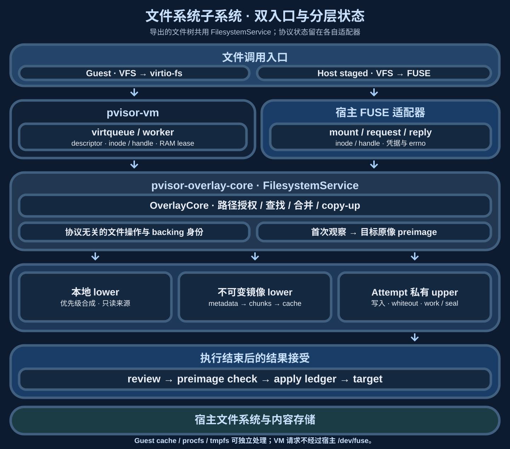
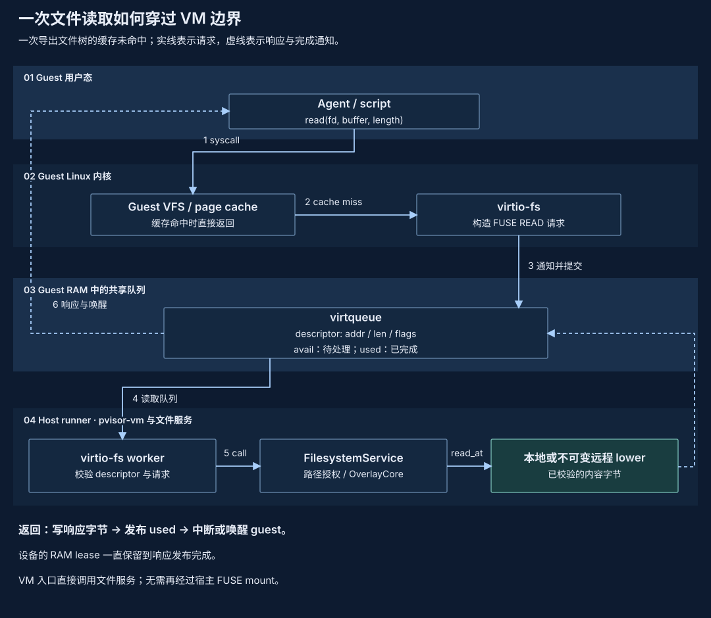
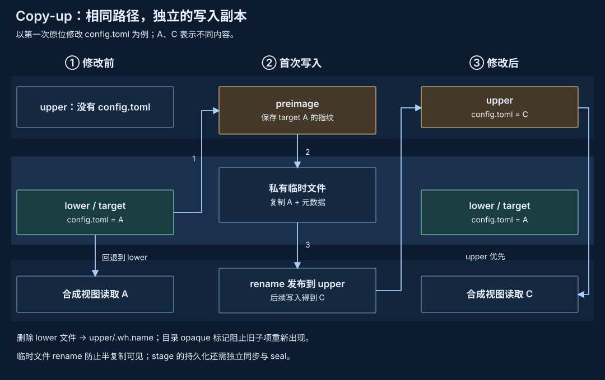
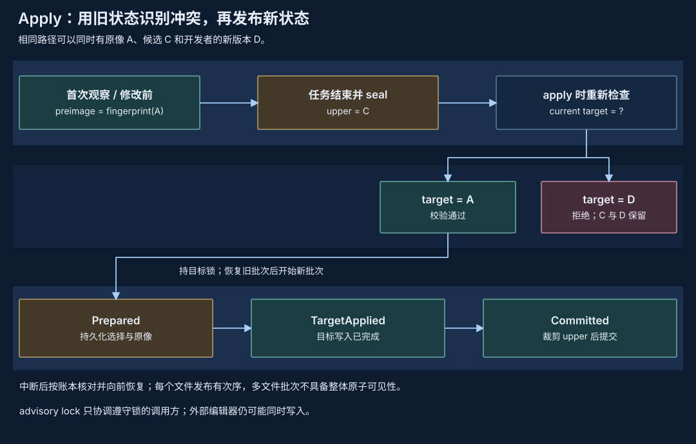

# 文件系统子系统：OverlayCore 与双入口

## 1. Motivation {#motivation}

Agent 修改工作区时，开发者通常希望先看结果，再决定合入哪些文件。如果直接写宿主工作区，失败、取消和不满意的修改都会留下需要人工辨认的状态。OverlayCore 将执行中的修改保留在 upper，读取时与 lower 合成视图；执行结束后，upper 留作审查、选择性 apply 或 drop。

仅有写时复制还不够。Agent 运行期间，编辑器或其他任务可能修改真正的目标；一次 apply 也可能在更新几个文件后中断。因此设计同时保存首次内容观察或修改前的目标指纹，以及每次 apply 的持久意图，让冲突可以被拒绝，中断可以按已记录的批次向前完成。

这套机制覆盖文件树，不覆盖远程请求、数据库写入或显式共享挂载的副作用。多文件 apply 不是对外部读者原子的事务，目标锁也只协调遵守该锁的 pVisor 调用。对外语义见[暂存与 apply](../concepts/staging.md)，用户流程见[审查与应用](../guides/review-apply.md)。

## 2. 核心设计 {#core-design}

### 读视图与写目标分开 {#layout}

`OverlayLayout` 保存按优先级排列的 lowers、独立的 apply target 与目标对应 baseline。upper 优先，随后是最高优先级 lower，最后是 target 或它的只读 snapshot baseline。构造时要求最后一层 canonical path 与明确 baseline 一致，避免把“看见的文件”误当成“将覆盖的文件”。

例如 compose lower 的 `config` 为 B，宿主 target 的 `config` 为 A。Agent 读取 B，修改后 upper 为 C；live lower 在首次实际内容打开时记录 target A；冻结布局则记录末层 baseline 中的 A，不能在首次修改时改取已变化的 live target。apply 判断宿主 A 是否仍完整，然后将 C 合入，不能以 B 作为宿主冲突基线。

| 数据 / 模块 | 持有的内容 | 职责 |
|---|---|---|
| `OverlayCore` / `core.rs` | layout、upper/work、排除项、访问策略、内存硬链接索引 | 查找、目录合成、copy-up、删除与重命名、first-touch |
| `apply.rs` | changeset、依赖闭合选择集合、apply ledger | 审查、冲突检测、目标写入、恢复与 drop |
| `sys.rs` | syscall 包装、POSIX 元数据与 xattr 操作 | 集中 Unix 平台差异及 unsafe 边界 |
| `pvisor-core::overlay` | `OverlayRecord`、`ApplyRecord`、指纹与路径编码 | 跨 runtime / driver 共享的序列化合同 |
| runtime / 文件服务适配器 | Attempt lease、mount、文件 handle、请求与观察 | 停止写入、挂载生命周期、调用共享 core |

OverlayCore 不拥有 FUSE mount、Run 调度或公开 Event Journal。它借用 `pvisor-journal::atomic_write` 持久化元数据，但 `apply-ledger.json` 不是 [Event Journal](journal.md)：前者整体替换 JSON，后者逐行追加事件。

### 统一文件服务与双入口 {#filesystem-service}

host 执行通过宿主 FUSE 挂载接入，VM 执行通过 guest virtio-fs 驱动和
virtqueue 直接接入。两者复用文件服务能力，host staged 保留宿主执行。
FUSE 在这里同时指请求协议和宿主挂载入口：virtio-fs 使用 FUSE 请求协议，
但 VM 服务不需要把请求重新送入宿主 `/dev/fuse`。

当前结构如下。host FUSE 和 VM virtio-fs 适配器使用
`pvisor-overlay-core::service::FilesystemService`，共享 OverlayCore 操作与
后端读取。协议 inode/handle 表、目录游标和平台权限处理仍由各入口管理。



进入服务的是这些导出文件树中需要后端处理的请求。内核缓存命中可以不发
请求，guest 的 procfs、tmpfs 和网络操作也不因这一结构进入文件服务。

| 层 | 共享或保留的职责 |
|---|---|
| 入口适配器 | FUSE 或 virtqueue 收发、请求参数与凭据转换、errno/属性编码、挂载和队列生命周期；保留 Linux guest 与宿主平台能力差异 |
| 统一文件服务 | 通过 OverlayCore 共享路径解析、目录合成、权限/别名策略、原像记录与 copy-up；统一本地和远程读取合同 |
| 本地与远程后端 | 本地文件 I/O；不可变镜像的 stat/list/read、符号链接、对象身份、内容块校验和缓存；修改仍落入每个 Attempt 独立的本地 upper |

公共接口使用文件操作、元数据、对象身份和读写结果表达能力，不依赖
`fuser::Reply*`、guest descriptor 或某个挂载点。统一是同一套实现及合同，
各入口在宿主执行进程内直接调用；不要求新增文件系统 RPC 或把全部 Run 串行化。
协议编码、inode/handle 表和 descriptor/used-ring 管理仍属于各自入口。

VM 的 lazy image 直接调用远程只读后端，无需中间宿主 FUSE 挂载。
`image/cache/backend.rs` 提供与 FUSE 无关的元数据、按块读取和有界缓存，
`lazy.rs` 保留 host FUSE 适配器，`direct.rs` 将后端接入 VM lower。
普通本地 lower 和 VM staged workspace 继续经 virtio-fs 直接服务；host
staged 仍通过宿主 FUSE 执行。不可变句柄、硬链接对象身份、元数据 generation
和内容摘要由后端保留；共享镜像缓存不共享可写 upper 或 journal。
镜像存储合同见[共享镜像缓存 v1](shared-image-cache-storage.md#filesystem-access)。

直接后端建立私有元数据投影，以保留现有本地 inode/FD、路径检查和快照合同。
投影是普通目录及稀疏占位文件，没有 FUSE 挂载；guest 属性来自镜像元数据，
READ 内容通过后端按需取块，不读取占位文件中的空洞。copy-up 和文件摘要
需要原始内容时才填充本地文件；完整文件系统快照和自包含目录导出会补齐全树，
因此这些操作可能下载尚未访问的文件。服务端已打开的 lower handle 在 copy-up 后
仍指向原始只读内容；guest 的 inode 页缓存继续遵循内核的缓存语义。后端描述文件保存在 guest lower 之外，并从 workspace
视图隐藏；VM runner 在收紧宿主文件访问前重新接入后端。

Linux runner 保持独立网络命名空间。本地文件和 Unix socket 缓存直接访问；
TCP/S3 通过只允许固定镜像 stat/list/read 的私有宿主访问通道获取缓存内容，
不把存储凭据或宿主网络权限交给 guest。该通道使用已有缓存协议，与
virtio-fs 文件服务入口分开，随 VM teardown 释放。

内容读取不持有服务全局锁或元数据表锁，缓存 miss 仅锁住相应的内容块。
测试覆盖跨块与热缓存读取、硬链接 copy-up、guest 属性、打开句柄、完整目录
导出及 runner 接入。两套入口的协议状态尚未全部共享；平台权限和描述符
语义仍由各自适配器处理。[文件系统测量](filesystem-performance-analysis.md#filesystem-service)
已覆盖本地完整负载和 lazy 冷/热缓存：读路径有局部收益，元数据和 copy-up
出现回归，尚未显示普遍端到端加速；并发任务容量未在这批测量中验证。
统一文件服务处理文件系统及 lazy image；[快照 RAM lazy 恢复](environment-snapshot.md)
的缺页加载路径是独立机制。

### 一次 virtio-fs 请求怎样完成 {#virtio-request}



Guest 页缓存未命中时，virtio-fs 将 FUSE READ 请求及响应缓冲区放入 descriptor chain。链里的地址是 guest 物理地址；宿主适配器校验范围、长度与方向，再将请求交给文件服务。inode 和已打开 handle 属于协议入口，文件服务使用明确的相对路径与 backing 身份执行语义。

请求处理可以交给 worker，但 used-ring 发布仍由队列 owner 管理。响应写完并公布 used 条目之前，设备保留 RAM lease；冻结、offload 和页映射替换因此必须等待未完成设备访问。guest 内核缓存命中可以直接返回，不会每次都进入这条路径。


### 并发、缓存与冻结的连接点 {#concurrency}

virtio-fs 的 queue owner 负责描述符接收与 used-ring 发布。可重叠的大 READ（至少 64 KiB）和目录读取可交给有界 I/O worker；短元数据请求和需要串行的修改仍内联处理。默认 worker 上限取宿主可用 CPU 数且不超过 4，在途请求不超过 worker 数的两倍。

只读操作可以持有共享 operation guard，copy-up、改名、写入与恢复等操作持有独占 guard。handle map 和目录缓存锁只用于取得稳定引用，实际 backing I/O 在这些表锁外执行；最后一个使用者离开后才释放原生 lookup 引用。这避免一条慢读取锁住整张 handle 表，同时阻止句柄在读取中途被释放。

freeze/reset 停止接收、排空在途请求、发布完成并 join worker；文件系统快照等待 operation guard 释放。恢复后主动扫描 available ring。因此文件服务优化必须同时维持协议身份、RAM lease 和冻结合同，不能只比较 `read` 本身耗时。VM 侧顺序见[设备与一致性](vm-runtime.md#virtio)。

### 文件布局与实际关系 {#disk-layout}


```text
<compose lower 0>/ … <compose lower n>/   只读组合层，前者优先
<target>/                                原工作区；明确 apply 目的地
<baseline snapshot>/                     可选：替代 target 的最后只读 lower
<stage>/
├── overlay.json                         OverlayRecord，0600，整体替换
├── upper/                               常规文件、目录、链接、whiteout 等实际增量
├── work/                                .wh..pvisor-copyup-<pid>-<counter> 临时节点
├── merged/                              host mount / 占位；VM mountless 路径无需宿主 union mount
├── preimages/
│   ├── complete-v1                      首次触达日志完整性的标记
│   └── entries/<sha256(raw-path)>.json   每相对路径一份 PathPreimage，0600
└── apply-ledger.json                    schema 2 的完整批次账本，0600
<target-parent>/
└── .pvisor-apply-backup-<target-hash>-<apply-id-hash>/
    ├── <path-hash>                      删除 / 替换目录的原节点，rename 进入
    └── <path-hash>.new                  待发布的完整替换目录
<target-subdirectory>/
└── .pvisor-apply-<destination-hash>      单文件 / 链接 / 特殊节点的临时替换名
<system temp>/pvisor-apply-locks-<uid>/
└── <canonical-target-hash>.lock         0600 advisory lock；目录为 0700
```

路径为布局示意，upper、work、merged 可由配置覆盖。work 与 upper 必须同文件系统、不能相互包含；若 backing 位于 lower / target 内，它必须被排除在 guest 视图之外。目录别名按 canonical path 检查，不能只比较字符串。

upper 保存完整 copy-up 文件，修改一字节也可能复制整个文件；没有块级 delta 或压缩格式。merged 是投影视图，不是一份额外完整副本。preimage 只存指纹，不存原文件内容；真正需要保留的目录原数据在 target 旁的 backup 中。

## 3. 关键数据和核心机制详细设计 {#detailed-design}

### 合成、copy-up 与 POSIX 节点 {#copy-up}



查找逐组件验证路径，拒绝绝对路径和 `..`。每一层的祖先都必须是实际目录，不跟随祖先 symlink 去层外找子节点。目录读取合并名字，再移除 whiteout、排除项与不允许访问的名字。lower 顺序决定同名节点的读取来源。

第一次写入 lower 节点时，先记录目标 preimage，再创建 upper 父目录，在 work 或 upper 同目录的临时节点中复制内容及元数据，最后 rename 发布。普通文件复制字节；目录初次只复制自身，子节点仍可由 lower 提供；symlink 复制目标字节而不解引用；其他节点保留 POSIX 类型与 rdev。copy-up 的 rename 避免暴露半复制节点，不代表普通 upper 写入都已 fsync。

| upper 表达 | 字节 / 元数据 | 语义 |
|---|---|---|
| `name` | 文件完整内容，或目录 / symlink / 其他节点 | 覆盖 lower 同名节点 |
| `.wh.name` | Core 创建的空文件，0 B | 隐藏 lower 的 `name`；apply 删除目标路径 |
| `.wh..wh..opq` | Core 创建的空文件，0 B | 目录不再合并 lower 子节点 |
| opaque xattr | 支持的 overlay xattr 值为 `y` | 与 opaque marker 一致解释 |
| `.wh..pvisor-root-metadata` | 空 marker，0 B | 根目录显式元数据修改，不把 incidental mtime 当作同类修改 |

重建已 whiteout 的目录会标为 opaque，防止旧子节点重新出现。移动 lower 目录先递归 materialize 合成树再移动，不能只 copy-up 一个空目录。rename 在审查中表现为删除和新增，不保存独立 rename 操作。

`copied_hard_links` 按 lower `(dev, ino)` 记录 upper aliases，尽量复用已 copy-up inode，rename / unlink 更新索引。该表只在内存中，重启不重建它；upper 上已存在的硬链接仍由文件系统保存，但不能承诺重启后的新 copy-up 继续关联未复制的 lower alias。有拒绝规则时，多链接普通文件保守拒绝，防止路径授权被 inode alias 绕过；目录移动还检查物理后代，而不只检查可见名字。

### 首次触达与冲突指纹 {#preimages}

受 pVisor 管理的 host 与 VM stage 选择 compact 帧日志，默认使用 `checkpoint` 持久化策略。首次观察仍在暴露内容或修改前捕获，但首次修改不逐项 fsync 日志。任务完成先停止所有写入者，同步完整日志，再同步 upper 数据和目录，最后发布 `preimages/sealed-v1`。`complete-v1` 表示观察覆盖完整，不是任务完成确认。没有完成标记的受管理 stage 拒绝 apply／重新使用；运行中的 workspace checkpoint 只持久化自己的副本。程序显式 fsync 时仍先同步观察记录，再同步数据。`--stage-durability strict` 保留首次修改前同步日志；没有策略文件的旧 stage 保留严格合同。下面的逐路径发布描述针对旧的严格日志；compact 记录保留同样的首个胜者和冲突规则。持久化边界见[隔离机制](isolation.md#workspace-and-lifecycle)。

冲突保护起点取决于布局。冻结布局从明确的 target 对应 baseline（最后一个 lower）捕获原像；最高优先级的额外 lower 仅供应可见内容。live lower 从首次实际内容打开或 symlink/xattr 读取捕获 target 原像；真实缺失 lookup 直接记录已观察到的 Absent，不能在稍后取指纹时改为宿主刚创建的文件。授权与 I/O 拒绝不是缺失，不记录也不读取被拒路径；没有先读取的 mutation 从修改前的 target 状态开始。普通成功的 stat/lookup 和目录列表不哈希每个文件，也不承诺 Run 起点完整快照或全读集串行化。FUSE 与 virtio-fs 的实际内容入口自动调用共享 Core 的 `observe_read()`；调用 Core 的外部适配器也必须这样做，`resolve()` 仅解析路径。

观察文件按相对路径原始字节寻址，在 mutex 内以私有临时文件写完后、通过不覆盖已有目的地的 hard link 原子发布；多个 Core 争同一条目时验证并保留先发布的原像，修改方同步真正的胜者；读取阶段不逐项 fsync。首次修改时 `record_preimage()` 复用该原像，验证 JSON 并同步文件和 entries 目录，完成后才修改 upper。冻结布局无需提前记录只读观察，修改时从 baseline 捕获。父目录、删除树与 rename 目的地仍记录并同步，覆盖隐含元数据变化与递归破坏范围。普通 stage/checkpoint 复制和 reopen 保留读观察；损坏条目拒绝加载或修改。只读观察并不是断电持久的读事务，带运行态恢复合同的调用方必须同时保全 baseline/journal。未选中的无关只读路径不阻止其他文件 apply。

冻结布局部分 apply 后，被裁剪的 upper 路径会重新露出旧 baseline；当前不会自动更新该读视图。重新打开同一 stage 后基于旧内容改写已提交路径，仍以旧 baseline 校验并保守拒绝，不能仅将 fingerprint 重取为当前 target 后放行旧视图覆盖。继续编辑这类路径应创建新 stage/基线；原 stage 中未提交的其他路径可继续审查。

`PathPreimage` 的结构示例：

```json
{
  "path": [110, 101, 119, 46, 116, 120, 116],
  "state": { "kind": "absent" }
}
```

这里的 path 是 `new.txt` 的原始 Unix 字节。指纹变体分别记录：

| kind | 核心字段 |
|---|---|
| absent | 路径不存在 |
| file | SHA-256、mode、uid、gid、可选 xattrs |
| directory | mode、uid、gid、mtime 秒 / 纳秒、可选 xattrs |
| symlink | 链接 target 原始字节、uid、gid、可选 xattrs |
| other | mode、uid、gid、rdev、可选 xattrs |

xattrs 区分 Unsupported 与排序后的 `(name-bytes, value-sha256)`；内部 opaque xattr 排除在用户元数据指纹之外。旧条目没有 xattrs 时，兼容比较也不宣称验证过 xattrs。普通文件哈希使用 64 KiB 缓冲，但总读取量仍与文件长度成正比；目录指纹不是整个子树的 Merkle hash。

新空 upper 初始化 `complete-v1`，内容为 `pvisor-overlay-preimage-journal-v1` 加换行。完整日志缺少选中路径时直接拒绝 apply。没有标记的旧 stage 可在 apply 时补取指纹以兼容，但不提供从执行期开始的同等冲突保护。preimage 每条独立原子发布，不整体替换；完整条目损坏会让加载失败，没有类似 JSONL 的尾部修复。

### 审查与选择集合 {#selection}

`overlay_status()` 统计 upper 节点、whiteout 和最多 32 个 sample_paths；`overlay_changes()` 按 lower 的路径存在性及类型分类 Added / Modified / Deleted / TypeChanged / Opaque，不读取全部内容做字节 diff。copy-up 后又恢复原字节的文件仍可能列为 Modified；这是可应用的 upper 清单，不是最小内容差异。

`ApplySelection` 支持精确相对路径及 git-style include/exclude glob。空选择为全部；精确路径包含后代。规划反复扩展集合直到闭合：

- upper 硬链接组必须一起选择，排除同组成员会拒绝；
- opaque 目录必须作为完整单元选择，不能只选择其子节点或排除其中部分；
- 所选子节点需要的新增 upper 祖先目录会一起加入，不能将必要祖先排除。

根 opaque replacement 不支持，要求选择明确子目录。`ChangeEntry.path` 是展示字符串；非 UTF-8 名称另存 `path_bytes`，实际变更调用 `relative_path()`。selection / planned_paths 中的非 UTF-8 路径编码为 `{ "bytes": [...] }`，不能从有损显示字符串反推操作路径。

### apply 账本与恢复 {#apply-recovery}



`OverlayRecord` 保存 id、generation、target、可选 baseline_lower、upper/work、stage/merged、策略、排除项和状态。状态为 Active / Staged / Applied / Discarded；generation 标识可复用环境的新一轮，终态 Overlay 不重新打开为 Active。

`apply-ledger.json` 的结构为：

```json
{
  "schema_version": 2,
  "records": [
    {
      "schema_version": 2,
      "apply_id": "apply-demo",
      "created_at_unix_ms": 0,
      "overlay_id": "overlay-demo",
      "overlay_generation": 0,
      "target": "/workspace",
      "selection": { "paths": ["new.txt"] },
      "changes": [{ "path": "new.txt", "kind": "added", "new_type": "file" }],
      "planned_paths": ["new.txt"],
      "preimages": [{ "path": [110,101,119,46,116,120,116], "state": { "kind": "absent" } }],
      "state": "prepared",
      "remaining_changes": 0
    }
  ]
}
```

这是字段示例；具体 mode / size 等可选字段随节点变化。读端接受 schema 1 / 2；旧 records 缺少 state 时按 Committed 处理。每次增记或状态变化都序列化整份 ledger，通过同目录临时文件写入、fsync、rename、父目录 fsync 替换，不是在 JSON 末尾追加。

`apply_overlay_selected()` 取得目标锁，先恢复 pending 批次，再规划选择、收集全部 preimages 并检查冲突，最后保存 Prepared。该锁以 canonical target 路径的 SHA-256 命名，锁文件必须为本用户私有、单链接的普通文件；外部编辑器不受此锁约束。

| 持久状态 | 已发生的动作 | 下次恢复 |
|---|---|---|
| Prepared | ID、generation、路径集合、changes、preimages 已写入 ledger；目标可能尚未或部分更新 | 校验身份及原像 / 期望结果，检查目录 backup，向前完成目标写入 |
| TargetApplied | 目标更新后先写入此状态，upper 尚可未清理 | 只裁剪 upper、处理 preimage、保存 Overlay 状态，不重新应用半裁剪的 opaque 树 |
| Committed | 剩余清单及数量已确定，upper / preimage 处理结束 | 清理遗留 backup；重复完成不再覆盖目标 |

普通文件写入目标旁的 deterministic 临时名，同步内容后 rename，再同步目录；删除先处理 whiteout。破坏性目录替换先将原节点 rename 到 target 旁的私有 backup，在 `.new` 组装替换树后发布。backup 与 apply ID 绑定，失败时保留，Committed 后清理；它不是所有修改的通用回滚副本。

Prepared 恢复不能接受任意目标新状态：目标必须仍匹配原像，或在恢复分支中匹配该批次的期望结果。目录允许与恢复相关的 mtime 变化，但仍检查权限、所有权及已记录 xattrs；删除 / 替换会额外验证被折叠的后代原像。恢复拒绝 Overlay ID、generation、target 不匹配的旧批次。

选择性完成后，有残留则 Overlay 为 Staged，没有残留则为 Applied。所选数据从 upper 裁剪，相关 preimage 被消费；仍承载待应用子节点的目录保留需要的基线。整个过程可跨多个路径暴露中间状态，检查后与写入间仍存在外部修改窗口，使用时必须停止外部写入者。

### drop 与适配器边界 {#adapters}

pending apply 存在时不能 drop，以免删掉恢复所需的 upper。已 Discarded 的 drop 幂等；已 Applied 不能靠 drop 撤销。清理 upper/work 后写入 Discarded；merged 只尝试移除空占位，不递归删除可能仍挂载的目录。调用方必须先停止实际写入并完成卸载；Core API 的 Active 分支本身不代替 Attempt lease 和执行生命周期协调。

宿主 `pvisor-overlayfs` 将 FUSE 请求、inode/handle 与权限转换接到共享 core；Linux FUSE、macFUSE kernel / FSKit 的挂载约束由适配器处理。仓库 FSKit 入口默认选择 fskit，并按实现中的版本检查拒绝低于 5.4.0 的 macFUSE。VM 的 `crates/pvisor-vm/src/devices/virtio/fs/overlay.rs` 使用相同 Core，经 virtio-fs 服务 guest，不需要宿主 FUSE union mount；guest errno 转换、设备队列与 handle 生命周期属于该适配器。

共享 Core 不代表全部后端的 POSIX 返回行为相同。现有暂存契约仍记录 macOS symlink 创建的 S-STAGE-013 XFAIL，不能以 Core 测试覆盖替代实际挂载检查。

## 4. 实验数据支撑 {#experiments}

`JUST_TEMPDIR=/tmp just test pvisor-overlay-core pvisor-overlayfs` 运行定向测试，覆盖公共 Core/apply 行为以及 FUSE 的实际 `open_inode` / `open_path` 路径。`pvisor` 集成回归还通过 guest descriptor ring 驱动真实 virtio-fs worker，覆盖内容读取、写入、live/frozen 目标布局和设备状态恢复；逻辑 checkpoint 回归检查只读观察在复制/restore 后仍能约束首次修改。它们验证共享实现与适配器接线，不等同真实宿主 FUSE 挂载、KVM/HVF guest 启动或跨平台验收。以下是可复核的覆盖入口，不能将函数数量当作独立故障场景数量。

| 机制 | 现有可复核测试 |
|---|---|
| lower 组合与独立目标基线 | `top_lower_wins_and_directories_merge`、`composed_lower_preimage_tracks_apply_target_not_visible_layer` |
| first-touch 在修改前持久且不重取 | `first_touch_preimage_is_durable_and_never_rebased` |
| backing / alias / 授权边界 | `backing_symlink_alias_cannot_share_the_upper_and_work_directory`、`access_rules_reject_hardlink_aliases_and_symlink_traversal` |
| 先读后修改、冻结基线、缺失路径与恢复 | `read_conflicts` 集成测试、`fuse_open_inode_preserves_the_first_read_before_copy_up`、`virtiofs_content_open_preserves_target_preimage_across_restore_and_composed_lowers`、`fork_preserves_read_observation_before_any_upper_mutation` |
| 主动修改目标后的冲突拒绝 | `apply_rejects_a_target_changed_after_first_touch` |
| 递归替换、backup 与中断恢复 | `directory_replacement_checks_descendants_and_recovers_after_mutation`、`interrupted_directory_replacement_restores_the_recorded_original` |
| Prepared 前后目标变化 | `prepared_apply_recovers_before_or_after_target_mutation` |
| TargetApplied 后 upper 已部分裁剪 | `target_applied_recovery_only_finishes_partially_pruned_opaque_upper` |
| 选择依赖与终态 | `selective_apply_expands_hard_link_groups`、`opaque_directory_requires_atomic_selection`、`terminal_decisions_are_idempotent_but_cannot_be_reversed` |

`pvisor-core/tests/overlay_contracts.rs` 另覆盖旧 schema 默认值、指纹变体和原始路径字节。`tests/semantics/stage-apply.md` 提供 S-STAGE-001～014 的运行语义草稿；其人工审批状态独立于测试通过，不能由这份文档替代。

先读后修改的冲突回归没有重新验证 copy-up / apply 吞吐、fsync 尾延迟、大型真实仓库负载或断电恢复。1,024 路径的普通 metadata walk 回归确认不会创建内容观察条目，不是吞吐 benchmark。首次内容观察仍需读取并哈希整个目标文件及写入每路径 journal；首次修改仍同步原像，copy-up、目录遍历与 ledger 更新也有成本。已有 [apply 成本实验](../benchmarks/supervision-cost.md#apply-cost) 是历史固定工作负载和制品的具体证据，不能当作先读后修改冲突跟踪的性能复验。进程内恢复控制组与 guest descriptor 测试也不替代任意 syscall 处 kill / 断电、真实 Linux FUSE 或 macOS FSKit/HVF 矩阵。

## 5. 使用建议 {#usage}

执行时保持 target 与 backing 的明确隔离，保留 stage 内元数据和 upper；只复制 upper 无法同时保留运行期冲突检测与 pending apply 恢复信息。不要将 stage 内部文件暴露为 guest 可修改内容，也不要直接修改 preimage 或 ledger 来绕过冲突。

先结束实际写入，再审查 changeset 和文件内容。选择性 apply 前查看依赖扩展，尤其是硬链接组与 opaque 目录；展示清单不能替代内容 diff。apply 期间停止其他目标写入者，失败后保留 target 旁 backup 与原 stage，重新进入 apply 恢复流程，不能把 drop 当作回滚。

对大文件、高文件数或频繁选择性 apply 的负载，分别量 copy-up、preimage 哈希、目标安装和 ledger 同步成本。只有测到索引或 ledger 规模确实成为瓶颈，再考虑分段或增量账本；当前格式清晰，优先保住恢复合同。需要更强并发或外部编辑保护时，应先建立稳定快照、目录 FD 操作或更强协调机制，不能从 advisory lock 推导完全事务隔离。

## 6. 回到整体架构与源码 {#integration}

文件服务承接总图中的 virtio-fs 和 Host FUSE，镜像缓存为它提供不可变 lower；RAM 子系统保证请求缓冲区在完成前有效。执行结束后，stage seal 固定可审查状态，apply 独立发布到宿主 target。机器快照还需要保留导出树与 inode/handle 的可恢复关系，单独拷贝 upper 不等于完整执行恢复。

源码入口：`crates/pvisor-overlay-core/src/service.rs`、`core.rs` 和 `apply.rs` 分别拥有共享操作、分层语义和结果发布；`crates/pvisor-vm/src/devices/virtio/fs/` 拥有 VM 协议与队列；`crates/pvisor/src/image/cache/backend.rs`、`direct.rs`、`lazy.rs` 连接共享镜像与各适配器。
