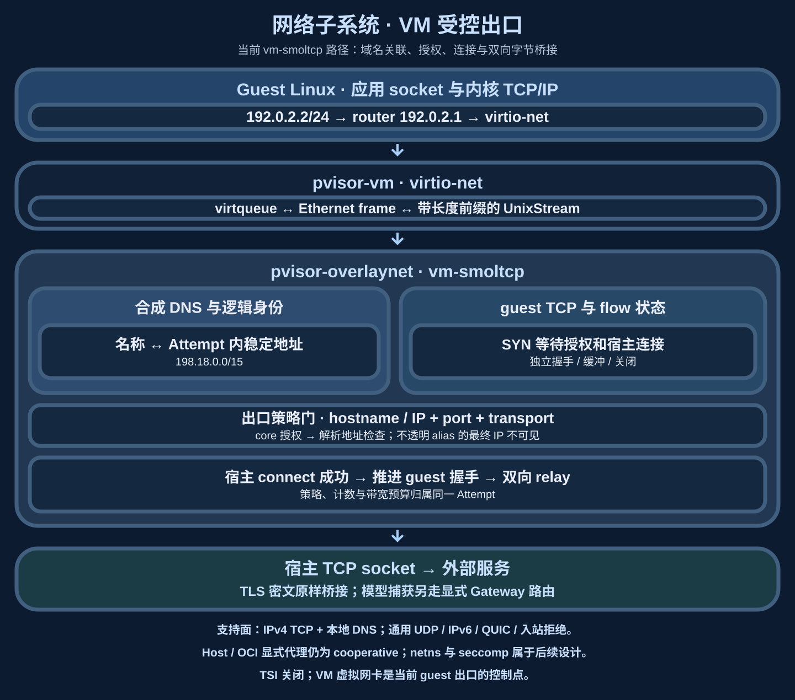
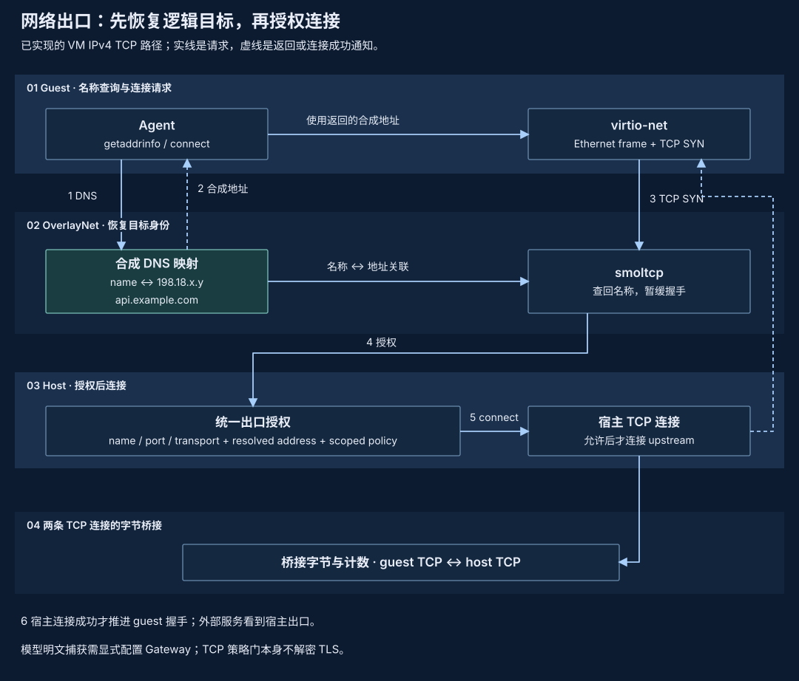

# 网络子系统：OverlayNet 与受控出口

VM 的网络控制点位于 virtio-net 之后：guest 输出 Ethernet frame，OverlayNet 在宿主终止 TCP、还原逻辑目标、完成策略授权，再连接外部服务。Host/OCI 的显式代理是另一条协作路径，其覆盖取决于应用是否使用代理。

## 子系统框图与所有权 {#architecture}



| 组件 | 状态与职责 | 生命周期 |
| --- | --- | --- |
| `pvisor-guest` / guest Linux | 接口地址、路由、应用 socket 与 guest TCP | 跟随 guest；静态网络配置不等待 DHCP |
| `pvisor-vm` virtio-net | descriptor、帧收发与虚拟设备 | 跟随 VM；按设备合同访问 guest RAM |
| OverlayNet `VmNetwork` | smoltcp、DNS 映射、flow 表、连接任务和有界缓冲 | 每个 Attempt 独立准备与关闭 |
| egress policy / connector | 逻辑目标授权、宿主解析、具体地址检查和连接 | 使用本次 Attempt 的有效策略与预算 |

层间传递帧与字节，宿主出口服务不持有 guest RAM 裸指针。虚拟网卡所在的执行边界见[VM 子系统](vm-runtime.md#virtio)；显式代理与 VM 的用户可见边界见[网络控制](../guides/policies/network.md)。

## 已实现的 VM driver

原生 pvisor-vm Attempt 在 `[overlaynet].mode = "auto"` 时使用 `vm-smoltcp`。
guest virtio-net 设备通过 pvisor-vm 带长度前缀的 UnixStream Ethernet 传输连到
pVisor。Rust guest supervisor 直接配置 `192.0.2.2/24` 和路由器 `192.0.2.1`，
不等待 DHCP。pVisor 提供合成 DNS（`198.18.0.0/15`，每个 Attempt 稳定）
以及 IPv4 TCP。SYN 会在 smoltcp 中暂停，
直到 hostname/IP、解析后的地址或 scoped host connector alias、端口以及注入的
core 策略全部授权，并且 host 连接成功。TSI 保持关闭，因此不存在绕过该
data plane 的 guest 路径。

部分 host DNS/TUN connector 会为已授权 hostname 返回不透明的 `198.18.0.0/15`
假 IP。VM connector 只有在逻辑 hostname 与端口通过策略和 core 授权后才接受
该结果；同一范围内的 guest IP 字面量仍然被拦。因为 connector 隐藏了真实最终
地址，IP/CIDR 策略无法检查该 alias 背后的端点。需要最终地址策略的部署应使用
会暴露具体地址的 resolver。

MVP 对通用 UDP、IPv6、ICMP、QUIC、入站连接、virtual/link-local/multicast/
broadcast 目的地，以及耗尽的 flow/DNS 容量，刻意 fail closed。显式 Gateway
capture 是内部 virtual-router 路由；所有普通出口共享同一策略和带宽注册表。
host 与 container 透明拦截仍是后续工作。

> 状态：原生 pvisor-vm driver 已在 Linux 和 Apple Silicon macOS 上实现。host-process
> 透明 driver 仍是已接受的设计。Host/container 选择性
> 策略仍使用显式代理；host deny-all 保持现有平台 sandbox 行为。

## 一次域名连接的底层路径 {#vm-request-path}



`connect` 接收 IP 地址，域名策略却需要知道应用原先查询的名称。合成 DNS 因此保留 Attempt 内的名称—地址映射；收到 SYN 时，OverlayNet 先还原逻辑目标，再经统一 egress 授权与宿主解析检查。配置了不透明 connector alias 时，最终真实地址仍受前述可见性限制。

smoltcp 终止 guest TCP，宿主创建另一条 upstream TCP；两条连接的缓冲、握手和关闭分别管理。只有授权与 upstream 建立成功，guest 握手才继续。随后桥接字节并记录计数，TLS 内容仍由应用端点加解密。Gateway 明文 capture 需要单独的显式协议路由。

## Loopback、RFC1918 与宿主可达性 {#local-network-boundaries}

不可绕过出口描述的是流量必须经过策略门，实际能否访问宿主或内网仍由有效策略决定。VM 的硬拒绝地址检查有意保留 loopback 和 RFC1918，以支持显式授权的宿主/LAN 服务；`public` / Ambient 在没有额外收窄或拒绝规则时也可允许它们。`public` 这个名字不能理解为“仅允许公网”。

| 目标和路径 | 当前行为 |
| --- | --- |
| guest 程序直接访问 `127.0.0.1` | 通常由 guest 自己的 loopback 路由处理；不会因此自动到达宿主服务 |
| 经出口路径送到宿主、解析为 `127.0.0.0/8` 或 RFC1918 的目标 | 不属于 VM 固定硬拒绝；经过逻辑目标、端口、transport、解析地址及 core 策略授权后，可在出口进程/connector 的网络环境中连接 |
| 域名 allowlist 解析到 loopback / RFC1918 | 默认域名规则不接受这类解析结果；规则需显式 `allow_private_ips = true`，其他 scoped 约束与 deny 仍生效 |
| 显式 IP 或 CIDR 规则 | 规则本身可授权其匹配的私有地址；不要求再用域名规则的 `allow_private_ips` 开关 |
| link-local（包括 `169.254.169.254`）、multicast/broadcast 与 VM 硬拒绝的特殊网段 | 普通 egress 拒绝；`allow_private_ips` 不覆盖该检查 |
| `198.18.0.0/15` 与虚拟 router | guest 合成地址需有对应 DNS 身份；未知映射拒绝。router 只暴露已接入的内部路由，host connector alias 继续遵守前述逻辑授权和最终地址可见性限制 |

RFC1918 指 `10.0.0.0/8`、`172.16.0.0/12` 和 `192.168.0.0/16`。例如批准内网 API 的域名、端口与私有地址能力后，宿主出口会代表 guest 发起连接；VM 内核隔离不会再额外取消这份授权。需要隔离宿主或内网的部署必须在有效策略中明确限制这些目标，并按实际 connector 的地址可见性判断覆盖范围。

宿主 HTTP 代理选择也不提供额外隔离。对于逻辑目标 `localhost` 或 loopback IP，`connect_via_ambient_http_proxy` 跳过环境中的 HTTP proxy，继续通过已授权地址执行 connect；跳过的是上游代理选择，策略检查此前已经完成。guest 内部 loopback 与这个宿主连接路径应分别理解。

源码入口：`pvisor-core/src/policy.rs::forbidden_vm_egress_address`、`NetworkRule::allows_resolved_address`，以及 `pvisor-overlaynet/src/vm.rs::connect_vm_egress`、`egress.rs::connect_via_ambient_http_proxy`。配置和执行器矩阵由[网络策略](../guides/policies/network.md)维护。

## Flow 状态、背压与失败 {#flow-state}

`FlowKey` 用 guest 源端口、目标 IPv4 和目标端口识别连接；`FlowDestination` 区分普通出口、显式 Gateway 路由和本地 DNS。`FlowPhase` 跟踪 `WaitingForSyn`、`Connecting`、`Connected` 或 `LocalDns`。这里的状态属于宿主用户态栈，与 guest 内核持有的 socket 状态分开。

1. 收到初始 SYN，恢复域名或识别 IP 字面量，建立受容量限制的 flow。
2. 连接任务在策略门后执行宿主 connect；失败不会被伪装成已经成功的 guest 连接。
3. 成功后事件推进 flow，两个方向通过有界通道与缓冲交换字节；暂时无法写出的内容保留并等待后续推进。
4. EOF、错误、超时或 Attempt 结束触发各自关闭与回收。对端已经接受的字节和外部效果不会因为取消而撤销。

默认 flow 上限是 256，合成 DNS 映射容量是 4096。容量耗尽、协议不支持与策略拒绝都不能改走宿主直连。计数描述实际经过本数据面的流量；模型明文捕获与连接授权分别记录。

## Capability 报告

每次 Run 记录一份 `InterceptionProfile`，描述 driver、强度和协议覆盖：当前已接入的 VM smoltcp 可报告 `enforce`，显式代理报告 `observe`；
未来 netns/seccomp 仍需完成实现与覆盖验证。profile 随显式代理基线发布为 `cooperative`，并发布 intercepted/allowed/denied/CONNECT/HTTP/sink/failure
计数；这些计数只说明什么到达了 OverlayNet，不估计被绕过的流量。

host `ProcessExecutor` 本身从不声称网络 enforcement；声称由当前 OverlayNet driver
做出，且只有在该 driver 已挂上时 `PolicyMode::Enforce` 才可满足。

## 配置

已实现的公开 mode 选择器有三个值：

```toml
[overlaynet]
mode = "auto"        # auto | off | proxy
policy = "allowlist"

[[overlaynet.rules]]
host = "api.openai.com"
ports = [443]
transports = ["tcp_tunnel"]
```

对 原生 pvisor-vm，`auto` 选择 `vm-smoltcp`；`off` 让 VM 离线；`proxy` 被拒绝，
因为它是仅 host/container 的协作 driver。对 host/container Run，显式网络标志
选择 `proxy`；已接受的 `netns` 与 `seccomp` host driver 仍是未来内部候选，
而不是暴露的配置值。`run.json` 记录实际挂上的 driver，因此 `pvisor status`
报告真实 enforcement 级别。

## Enforcement 与 capture 是分开的层

透明拦截提供 **enforcement**（deny / allowlist）和流量记账。它刻意不解密：

- Enforcement 不需要 MITM CA：中介 DNS 名和已授权目的地址对 VM MVP 已经足够；
  未来的 host netns driver 可以增加被动 SNI 解析。
- LLM payload 的 **Capture** 仍走现有显式代理路径：Gateway 向已知 Agent CLI
  注入代理配置并看到明文。在不可绕过 driver 下，不配合的流量不能离开
  allowlist，但不会被解密。

已知侵蚀：Encrypted ClientHello 最终会隐藏 SNI。当这很重要时，部署在 capture
级可见性的 opt-in MITM CA 与回退到 DNS/IP 级 enforcement 之间选择。这是行业
约束，不是某个 driver 特有的。

## 回到整体架构与源码 {#integration}

OverlayNet 接在 VM 设备后，由 Session 准备并在 Attempt 结束时收回。它与文件服务平行：文件可暂存后 apply，网络请求通常在执行时就产生外部效果。完整机器快照无法回退远端 TCP 对端，因此当前原生 Job execution checkpoint 排除网络设备，见[快照一致性切面](environment-snapshot.md#consistent-cut)。

源码入口：`crates/pvisor-overlaynet/src/vm.rs` 的 `ensure_listener`、`connect_vm_egress`、`drive_flows` 与 `SyntheticDns`；`egress.rs` 拥有共享出口连接路径，`interception.rs` 定义实际 driver 的观察。`crates/pvisor-vm/src/devices/virtio/net/` 只拥有虚拟网卡和帧传输，网络策略不由设备自行推断。

!!! note "Host / OCI 透明拦截：后续设计"
    下方“问题”、Design A、Design B 和交付计划第 1–5 项描述待实现的 host/container driver。它们不扩展上方当前 VM 与显式代理的支持面。

## 问题

OverlayNet 的 host/container data plane 是显式 HTTP/HTTPS 代理。pVisor 注入
代理环境变量，并对已知 Agent CLI 注入代理配置参数。覆盖因此是 opt-in：任何
忽略代理环境变量的子进程——静态 Go 二进制、原始 socket、清洗环境的
subprocess——都会直接访问网络。这就是 host `ProcessExecutor` 不能声称
enforcement，并拒绝网络 Capability 的 `PolicyMode::Enforce` 的原因。

剩余 host-driver 设计的目标是**完整拦截且占用轻**：无论语言 runtime、链接
方式还是 syscall 纪律，Agent 进程树发出的每个字节都必须经过 pVisor 拥有的
choke point——且不需要 VM、root daemon 或持久提升权限。

关键动作是把拦截点从*约定*（子进程可以忽略的环境变量）移到*子进程无法选择
绕过的一层*。

## Design A（主路径）：无特权 network namespace + 进程内 userspace 网络栈

这是计划用于具备条件的 Linux host 的默认 driver。它镜像 pVisor 文件系统路径的设计：

```text
filesystem: pVisor embeds a FUSE server and IS the child's filesystem
network:    pVisor embeds a userspace TCP/IP stack and IS the child's network
```

### 机制

1. Attempt 子进程以 `CLONE_NEWUSER | CLONE_NEWNET` 派生。在新的 user
   namespace 内创建 network namespace **不需要特权**；namespace 所有者在其中
   持有 `CAP_NET_ADMIN`。
2. 在 namespace 内，setup 代码创建 `tun` 设备，分配 link-local 子网，并安装
   指向它的默认路由。loopback 被拉起，以便 Run 本地服务继续工作。
3. `tun` 文件描述符在 `exec` 之前经 `socketpair` 回传给 pVisor 父进程。此后
   pVisor 拥有整棵进程树的唯一出口路径。
4. pVisor 在 `tun` fd 上运行基于 `smoltcp` 的 userspace 栈。入站 TCP 流在栈
   内终止，通过 `pvisor-core` 策略门后在 host 侧重起源。现有
   OverlayNet 代理 / Gateway sink 仍是 LLM capture 路径，保持不变。
5. DNS：栈回答经 namespace `resolv.conf` 通告的虚拟 resolver 地址。查询在
   host 侧解析，从而在任何连接存在之前给出域名级策略点。

### 性质

- **拓扑完整。** libc interposition、静态二进制、原始 syscall 和 fork 出的
  孙进程都在 namespace 内；没有第二条出路。不需要、也不假设子进程配合。
- **运行时零特权。** 无 root、无 setuid helper、无 daemon。唯一的 host 前提
  是无特权 user namespace（`kernel.unprivileged_userns_clone` / 发行版等价
  项）。
- **进程内。** 与嵌入 FUSE 的决策一致：pVisor 不派生 `passt` /
  `slirp4netns` 一类 helper。

### 策略评估点

| 层 | 信号 | 说明 |
|---|---|---|
| DNS | 查询名 | 虚拟 resolver；最便宜的 allowlist 点 |
| L4 | 目的 IP:port | 字面量 IP 流量的最后手段 |
| TLS | ClientHello 中的 SNI | 被动解析，无 MITM，无注入 CA |
| QUIC | Initial 包中的 SNI，或被拦截 | 默认：拒绝 UDP/443 以迫使 TCP fallback |

### 失败与探测

Driver 可用性在 Attempt prepare 时探测。若 user namespace 不可用，行为取决于
请求的策略模式：

- `PolicyMode::Observe`：回退到显式代理 driver，并在 implant plan notes 中
  记录降级。
- `PolicyMode::Enforce`：让 Run 准备失败。Enforce 下的降级绝不能静默。

## Design B（受限 fallback）：seccomp user-notify + socket broker

在无特权 user namespace 被关闭的 host 上（加固发行版、部分 container
runtime），第二个 driver 可以在没有 namespace 的情况下强制一组刻意更小的
socket 面。除非未覆盖通道都被拒绝，它不被视为与 netns driver 等价。

### 机制

1. Attempt 子进程安装 seccomp filter，把 `socket`、`connect`、`sendto` 和
   `sendmsg` 路由到 `SECCOMP_RET_USER_NOTIF`。当该 driver 声称 enforcement
   时，`io_uring_setup`、原始 packet socket、namespace 变更和未中介的描述符
   传递都被拒绝。
2. `socket` 被 broker：pVisor 创建 socket，保留同一 open file description
   的副本，并用 `SECCOMP_IOCTL_NOTIF_ADDFD` 注入子进程描述符。
3. 在 `connect` 上，pVisor 复制一次 socket 地址，重新校验 notification
   cookie，评估策略，并通过它保留的描述符执行 `connect`。然后返回真实结果，
   而不允许子进程原来带指针的 syscall 继续。这避免了 check-then-`CONTINUE`
   的 TOCTOU 窗口。
4. 初始 seccomp driver 仅 TCP。未连接的 UDP 会被拒绝，直到 OverlayNet 能安全
   复制并 broker 每个 datagram。DNS 必须走 pVisor 提供的 resolver 路径；否则
   无法从 `connect` 观察到的目的 IP 重建域名 allowlist。

### 性质与注意点

- 覆盖显式 broker 的 socket 族上的静态二进制和原始 syscall。`AF_UNIX` 有单独
  的路径策略；不是一律放行。
- 无 namespace、无 tun、无 userspace 栈——但描述符来源、`SCM_RIGHTS`、UDP、
  DNS 和 `io_uring` 必须全部关闭或中介，该 driver 才能被描述为不可绕过。
- Seccomp 在 `connect` 时看到的是 IP 地址，不是应用最初解析的 hostname。域名
  allowlist 需要中介 DNS、显式代理流量或 SNI 关联；IP/CIDR 策略可以直接强制。
- 按 Attempt 选择；两者都可用时仍优先 Design A。

## 非目标

- macOS 透明*选择性*拦截（Network Extension、基于 pf 的 UID 路由）。选择性
  策略仍是 observe 级；deny-all 是单独的 Seatbelt 强制边界，并按此报告。
- eBPF（`cgroup/connect4`）driver。优雅，但需要 CAP_BPF/root 以及 setup-host
  部署模型；目前不在范围内。
- 默认 TLS 解密。MITM 始终是显式 opt-in（如果将来有）。

## 交付计划与验收门

VM milestone 已经完成。剩余计划适用于透明 host/container
拦截。

0. **显式代理基础（已实现）：** 诚实的 cooperative profile、拦截计数、严格
   CONNECT 解析、connect-before-200、流式转发、动态 hop-header 剥离、redirect
   再校验、无隐式 loopback 或 Gateway-upstream 出口信任、结构化
   host/IP/CIDR + port + transport 规则、DNS 后地址授权，以及钉住已授权目的
   地以关闭策略/connector DNS 竞态。
1. **Driver 探测与选择：** 在已实现的公开 `off | proxy | auto` 选择器上扩展
   内部 netns/seccomp 探测；在子进程 exec 前记录所选 profile。若没有不可绕过
   profile，`Enforce` fail closed。
2. **Netns TCP + DNS 最小集：** spawn plumbing、tun 交接、TCP relay、中介
   resolver、DNS/IP allowlist、进程树与 namespace 逃逸测试。在原始 syscall
   和环境被清洗的孙进程被证明包含之前，不得声称 enforcement。
3. **协议闭合：** SNI 策略、字面量 IP 行为、UDP 策略、被拦 QUIC fallback、
   `AF_UNIX`、raw/netlink socket、`SCM_RIGHTS`、namespace 变更以及
   `io_uring` 符合性用例。
4. **受限 seccomp fallback：** 先 broker TCP socket；拒绝未覆盖通道。只有在
   描述符和 datagram 语义有专门测试后才加入 UDP/DNS。
5. **运维：** 把最终计数和降级原因持久化到 `run.json`，通过 `pvisor status`
   暴露，并分别对 Python、Node、Rust、静态 Go 以及 fork 出的孙进程做
   proxy/netns/seccomp 模式 benchmark。
