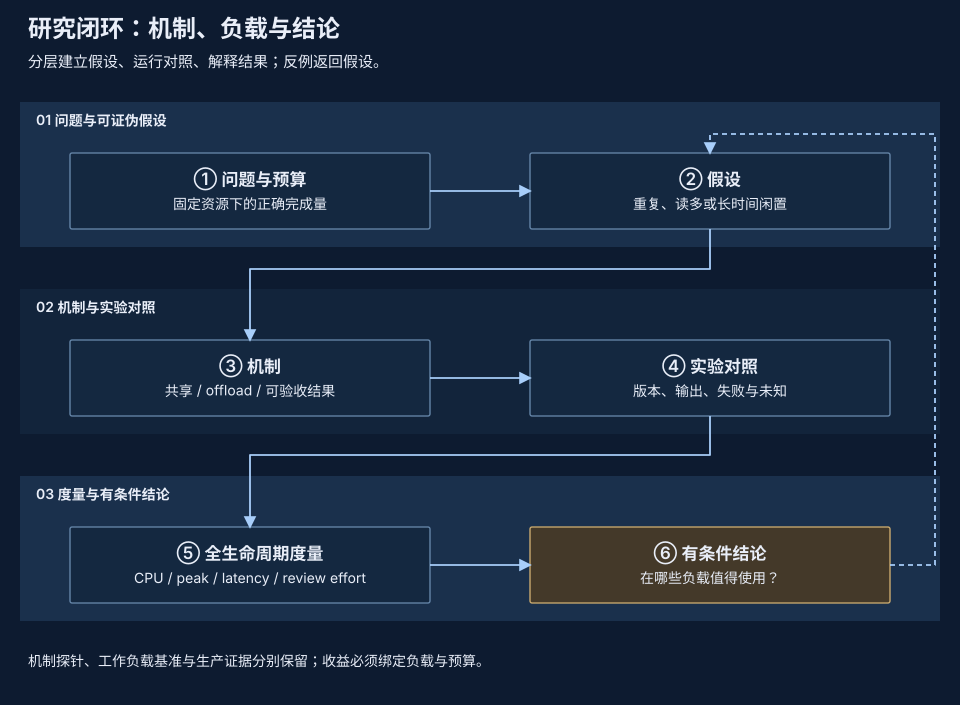

# 开源设计文档参考

[ByteHook 的《项目介绍和原理概述》](https://github.com/bytedance/bhook/blob/main/doc/overview.zh-CN.md)是 pVisor 设计章节的主要写作参考。它先建立理解机制所需的底层模型，再用图说明对象和调用关系，最后解释工程选择与约束。读者沿着因果关系进入实现。

对应到 pVisor，讲解顺序是：执行问题与总体所有权 → VM、vCPU 和 virtio → 内存映射、共享与缺页 → 文件系统、镜像与网络请求 → 快照一致性和日志提交 → 成本与实验。图里应出现真实的缓冲区、文件、队列、引用和状态变化，正文沿图解释每一步为什么必要。

[设计与底层原理](../index.md)以一个读文件、访问 HTTPS、写回配置的任务贯穿这些层次。下面保留其他项目在局部主题上的参考，作为这种连续原理讲解的补充。

## 参考项目与具体文章 {#projects}

以下评价针对文档表达与组织，是设计写作建议，不评价项目整体质量或给出性能排名。来源于 2026-10-07 访问的官方文档；实现细节以各项目明确版本为准。

| 项目与文章 | 值得学习的表达 | 在 pVisor 中的落点 |
| --- | --- | --- |
| [ByteHook · 项目介绍和原理概述](https://github.com/bytedance/bhook/blob/main/doc/overview.zh-CN.md) | 从必要底层模型推导机制，用图连接对象与调用，解释工程约束 | 将 syscall、virtqueue、backing、preimage 和提交点接回完整执行路径 |
| [TigerBeetle · Architecture](https://github.com/tigerbeetle/tigerbeetle/blob/main/docs/ARCHITECTURE.md) | 从工作负载和约束开始，沿总体模型进入持久化与设计决定，解释机制为何适合问题 | 先说明状态复用、写入、故障与预算，再解释 slot/reference、Journal 和 snapshot |
| [Firecracker · Design](https://github.com/firecracker-microvm/firecracker/blob/main/docs/design.md) | 宿主集成、进程/线程与设备模型放在同一架构叙述中，明确热路径和宿主责任 | 画出 API、supervisor、VM、设备与 pool；分别解释控制路径和数据路径 |
| [gVisor · Architecture guide](https://gvisor.dev/docs/architecture_guide/intro/) | 用系统调用例子解释 Sentry/宿主关系，把边界机制和兼容性放在一起 | 沿一次文件或网络请求展示实际拦截位置，说明 Host/OCI/VM 的不同覆盖 |
| [Tokio · Runtime](https://docs.rs/tokio/latest/tokio/runtime/index.html) | 先给使用模型，再写线程寿命、公平性假设和具体调度行为；实现细节与保证分开 | 明确 waiter cancellation、accepted operation、completion task 与 runtime shutdown 的关系 |
| [etcd · Client design](https://etcd.io/docs/v3.6/learning/design-client/) | 以客户端职责、错误和重试语义解释连接与请求行为 | 说明 lost ACK、Unknown、request ID、重试和核对；用时序图定位结果不明的窗口 |
| [Ray · Architecture whitepapers](https://docs.ray.io/en/latest/ray-contribute/whitepaper.html) | 总体架构与内部专题分开，论文保留版本身份 | 将外部编排、节点 owner、执行数据面和研究材料分层，避免把提案写成现有控制面 |
| [Rust Compiler Development Guide · Overview](https://rustc-dev-guide.rust-lang.org/overview.html) | 从处理流程进入 query、数据结构与源码入口，明确简化模型的边界 | 从 Job/Attempt 到调用链，再进入核心数据、生命周期和实现文件 |
| [CockroachDB · Design](https://github.com/cockroachdb/cockroach/blob/master/docs/design.md) | 分层图连接数据抽象、组件与物理布局；历史设计保留局限 | 用 logical Job、persistent records、backing/object 层说明存储；引用历史文章时注明身份 |

选择局部参考时，先确定要解释的具体问题：宿主集成可查 Firecracker，并发保证可查 Tokio，失败重试可查 etcd。pVisor 的主线仍围绕自身的数据和执行路径展开，避免让读者先记住大量组件名称才能理解行为。

## 一项机制的完整解释 {#structure}

1. **问题与约束。** 谁遇到什么成本？固定哪些资源和信任前提？
2. **最小系统模型。** 哪个组件拥有状态，谁能修改，谁负责释放？
3. **正常流程。** 沿一个实际请求画出调用、数据、提交点和返回值。
4. **失败流程。** 找出取消、断联、写失败与进程退出时留下的状态及核对路径。
5. **取舍。** 说明减少哪项成本、增加哪项成本，以及替代方案的适用范围。
6. **实现与证据。** 给出源码入口和现有材料，将已实现行为、工作负载结果与提案分别标明。

例如 Journal：先说明事件身份与幂等重试，再画 append、write、sync 与 receipt；写失败保留 Unknown，重复相同 event 不产生第二条记录。这样读者能理解失败语义，同时不会把 LocalSync 推成远端复制保证。[Journal 设计](../journal.md)维护具体合同。

## 图的选择与信息密度 {#figures}

| 读者的问题 | 合适的图 | 图中必须可辨认的内容 |
| --- | --- | --- |
| 谁负责哪件事？ | 分层架构 / 所有权图 | owner、边界、调用方向、外部依赖 |
| 一次操作如何完成？ | 时序 / 生命周期图 | 接受、提交、确认、取消、返回 |
| 数据究竟放在哪里？ | 物理布局 / 映射图 | 对象、引用、偏移、private/shared、回收条件 |
| 崩溃后会留下什么？ | 故障状态图 | 持久意图、live observation、Unknown、核对 |
| 为何更便宜或更慢？ | 有来源的实验图 | 预算、基线、样本、失败、峰值与适用负载 |

每张图只解释一个核心问题。箭头说明调用、数据、引用或状态变化；实线和虚线的含义在各图中明确标注。SVG 保持文字可搜索、矢量可缩放，正文补充一个具体例子与主要取舍。图中的组件关系应能在源码或合同中找到对应入口。

总体架构图采用与文档一致的深蓝底、蓝灰分层、浅蓝标题和嵌套圆角，以执行机制为视觉中心，保留清晰的描边来表达嵌套关系。`pvisor-vm` 内并列展开 vCPU、RAM 和虚拟设备，下方呈现三者共同参与的一致性冻结与平台适配；共享契约和可选扩展只保留辅助标注。VM、内存、文件系统与网络的子系统框图沿用这套视觉语言，放大总图中的相应边界。每个专题依次解释框图与所有权、一次访问、核心数据和机制、失败与回收、与整体的连接及源码入口。更细的原理图采用教材分层风格：明暗不同的蓝色横带划分执行层、地址空间或阶段，深色卡片表示具体对象，同一对象在不同层或前后状态中保持对齐。编号连接正文步骤；颜色含义同时写在标签中。时序图保留时间轴，字节布局图保留偏移和比例，长图按主题拆成可单独阅读的局部图。

图的底色使用 `#0d1b30`，卡片使用 `#142840`，强调色使用 `#a8cefa`，文字使用 `#e9eef8`，与站点主题保持一致。青绿、琥珀和暗红按原图语义区分共享、变化和冲突等状态，并保留文字标注。SVG 内保存完整配色，独立打开和导出的 PNG 也保持相同观感。

## 设计、决策和研究分别维护 {#status}

实现设计维护当前所有权与行为；[ADR](../decisions/index.md)维护决定的背景、选项和后果；研究材料维护假设、实验及反例。外部项目文章是表达参考；pVisor 的实现状态和性能结论继续由自己的版本与证据约束。
