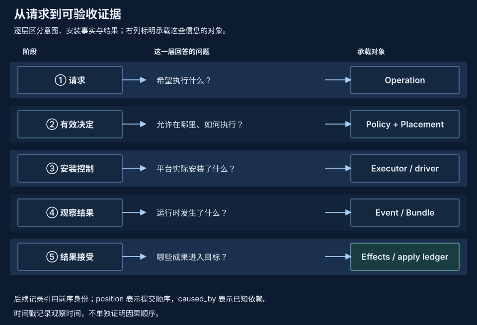

# 研究方向

OS 与 MLSys 研究关注固定资源下的正确任务完成量，以及人类处理这些结果的成本。pVisor 提供执行、状态与证据的机制；外部编排和训练器把它们组合成工作负载，再用对照实验判断收益。

## 从机制到可证伪结论 {#research-loop}

一个有用的假设应写出适用负载和反例。例如，相同基线、读多的 VM 可能从共享页受益；高比例私有写入会减少共享，扫描和 COW 峰值可能抵消 ready 阶段的节省。实验同时固定正确输出与预算，结论报告适用范围。

## 执行与编排的所有权 {#ownership}

pVisor 拥有单次执行的边界与观察；单节点 daemon 拥有本机 sandbox 归属与生命周期。外部编排拥有主机选择、队列、依赖与业务重试；训练器拥有模型、采样、奖励和评估器版本。[Daemon API](../daemon/index.md)尚未暴露原生 Job 暂存、execution checkpoint 和 Run Bundle 导出，因此研究接入需要显式的执行／证据交接。

拟议适配把外部工作身份绑定到本机 Job/Attempt 或 sandbox，固定输入与运行时版本，将结果和制品一起收集。超时或断联保留未知结果，先核对再重试。[外部编排研究](cluster-execution.md)研究这一交接边界，主机调度继续由外部提供。

## 三类状态、三个评价对象 {#state}

| 状态 | 保留的内容 | 独立评价对象 |
| --- | --- | --- |
| 文件 checkpoint | 候选文件、冲突基线、来源关系 | 分支隔离、合入正确性、copy-up 与存储成本 |
| Agent 轨迹 | 模型上下文与工具历史 | 前缀准备、工具重执行差异、模型续跑 |
| VM execution checkpoint | 支持 profile 的 CPU/RAM/设备/文件状态 | 一致性、兼容性、恢复与分叉成本 |

工具重执行产生 fresh observation，远程服务状态和训练 metadata 另行保存。执行成功、任务 reward 和文件接受分别判定，具体接合见[RL 执行基座](rl-execution-substrate.md)。

## 评价收益的证据层次 {#evidence}

- **机制证据：** 验证字节、映射、写入隔离、引用与失败状态。
- **工作负载证据：** 固定任务、输入、输出检查、模型容量与总资源，记录正确完成量、首次结果、恢复长尾、CPU、peak 和 memory-time。
- **产品证据：** 包含准备、SDK、guest 服务、回收、长期并发与故障波及范围。
- **监督证据：** 记录实际审查时间、拒绝与返工；machine CPU 成本不代替人类注意力。

原生 pool 或 offload 探针不能单独建立完整 daemon 密度。旧 Controller/Worker 数据保留其历史身份。外部编排和 RL 适配仍在研究／规划阶段，收益需要各自工作负载验证。

## 设计与论文的使用方式 {#references}

[公开研究产出](publications.md)保留材料、版本与实验范围；当前尚未登记正式论文、外部报告或演讲。[开源设计文档参考](design-documents.md)解释如何借鉴问题定义、分层图、时序、失败语义与取舍，不把文档写法转成产品保证。
