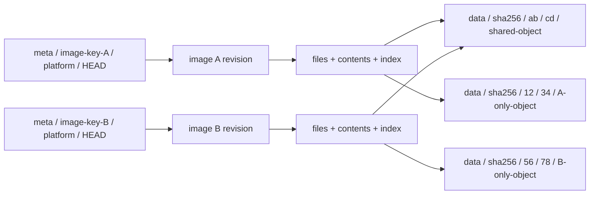

# 共享镜像缓存 v2：独立元数据与共享内容

> 状态：目标设计，尚未实现。本文按“每个镜像单独处理、镜像之间共享实际文件内容”重新设计布局。现有发布器和读取器仍使用[已实现的 v1 格式](shared-image-cache-storage.md)。

v2 把每个镜像的可变状态与文件索引收进自己的 meta 目录，只共享不可变 data 对象。不同镜像不更新同一个引用表、镜像索引或可变打包文件；同一镜像的并发更新在其自身的平台 HEAD 上处理。

## 完整目录树

```text
<cache-prefix>/
├── format.json
├── meta/
│   ├── <image-key-A>/
│   │   ├── identity.json
│   │   └── platforms/
│   │       ├── linux-amd64/
│   │       │   ├── HEAD.json
│   │       │   ├── revisions/
│   │       │   │   ├── <revision-hex-1>/
│   │       │   │   │   ├── manifest.json
│   │       │   │   │   ├── config.json
│   │       │   │   │   ├── files.bin
│   │       │   │   │   ├── contents.bin
│   │       │   │   │   ├── index.bin
│   │       │   │   │   ├── objects.bin
│   │       │   │   │   ├── checksums.bin
│   │       │   │   │   └── COMMIT.json
│   │       │   │   └── <revision-hex-2>/
│   │       │   │       └── <same immutable metadata files>
│   │       │   └── uploads/
│   │       │       └── <upload-id>/
│   │       │           ├── plan.json
│   │       │           └── progress.json
│   │       └── linux-arm64-v8/
│   │           ├── HEAD.json
│   │           ├── revisions/<revision-hex>/
│   │           │   └── <same immutable metadata files>
│   │           └── uploads/<upload-id>/
│   │               ├── plan.json
│   │               └── progress.json
│   └── <image-key-B>/
│       ├── identity.json
│       └── platforms/<platform>/
│           ├── HEAD.json
│           ├── revisions/<revision-hex>/
│           │   └── <same immutable metadata files>
│           └── uploads/<upload-id>/
│               ├── plan.json
│               └── progress.json
└── data/
    └── sha256/
        ├── 00/
        │   ├── 00/<full-object-hex>
        │   └── ff/<full-object-hex>
        ├── ab/
        │   ├── cd/<full-object-hex>
        │   └── ef/<full-object-hex>
        └── ff/
            └── ff/<full-object-hex>
```

S3 的 cache-prefix 是 bucket 内的前缀，文件系统是一个独立缓存目录。树中各处的 full-object-hex 均为完整 64 位摘要，前缀必须与该摘要对应。尖括号是结构占位符，JSON 示例中的摘要和长度是示意值，不能作为真实已发布对象读取。

这个布局有三个边界：

- `meta/<image-key>/`：一个规范化镜像引用（镜像名 + tag 或 pinned digest）的管理边界。
- `platforms/<platform>/`：该引用下某个 Linux 平台的独立发布边界。
- `data/sha256/<p0>/<p1>/<object-hash>`：全部镜像可以复用的不可变内容；没有共享可变索引或引用计数文件。

format.json 是缓存前缀的不可变配置，仅初始化时条件创建。它不保存镜像清单、发布进度或全局 current 指针。

## 身份、tag 与版本

| 身份 | 计算或命名 | 说明 |
|---|---|---|
| image-key | `hex(SHA256(UTF8(canonical_reference)))` | 镜像名与 tag/pinned digest，不含平台 |
| canonical_reference | `registry/repository@tag-or-digest` | 复用 OCI 规范化规则 |
| platform | linux-amd64、linux-arm64-v8 等 | OS/架构/variant 的规范化目录名，不含斜杠 |
| revision | `SHA256(COMMIT.json 实际字节)` | 一个完整不可变元数据版本 |
| file-digest | `SHA256(完整文件原始字节)` | 单个文件内容身份，与路径/权限无关 |
| object-hash | `SHA256(数据块原始字节)` | 跨镜像共享数据的存储身份 |

例如 alpine:3.20 规范化为 registry-1.docker.io/library/alpine@3.20。alpine:latest、alpine:3.20、另一个仓库的 alpine 都有自己的 image-key，但只要文件内容相同，就能指向相同 data 对象。显式的 image@sha256:… 也有自己的元数据目录，避免引入全局“manifest → 镜像”可变表。

tag 改指向新 manifest 时，image-key 不变；创建新 revision 并更新该平台的 HEAD。旧 revision 留在原目录。amd64 和 arm64-v8 有不同 HEAD，各自发布互不覆盖。

查询必须携带 `image-key + platform + revision`，运行开始时读一次 HEAD 并固定该句柄。manifest 摘要用于验证来源，不单独充当全部存储查询的地址；不能为了兼容旧的“仅按 digest 查找”接口，再加回一个全局可变镜像索引。

## meta：每个镜像单独管理什么

| 对象 | 内容与用途 | 可变性 |
|---|---|---|
| identity.json | version、规范化镜像引用、image-key | 不可变，条件创建；存在时核对身份 |
| HEAD.json | 当前 revision、manifest 摘要、generation、发布时间 | 平台范围内 CAS 更新 |
| revisions/<revision>/manifest.json | 来源引用、平台、所选 OCI manifest/config/layer 摘要等 provenance | 不可变 |
| config.json | env、entrypoint、cmd、working directory 等启动配置 | 不可变 |
| files.bin | 完整文件列表：路径原始字节、类型、Unix 属性、硬链接组、符号链接目标、file-digest | 不可变 |
| contents.bin | 该版本用到的不同文件内容：file-digest、size、有序 chunks | 不可变 |
| index.bin | 路径 → files 条目，以及目录 → 有序子条目索引 | 不可变，可从 files 重建 |
| objects.bin | chunks 的去重并集：数据摘要及长度，供校验/统计/GC 使用 | 不可变，可从 contents 重建 |
| checksums.bin | 四个二进制对象的逐页 SHA-256 校验目录 | 不可变，由 COMMIT 校验 |
| COMMIT.json | 版本身份、来源摘要、上述六个元数据文件及 checksums.bin 的摘要和长度 | 不可变，版本完成标记 |
| uploads/<upload-id>/plan.json | 本次上传的目标平台/revision、源 manifest、开始时观察的 HEAD/CAS 条件 | 每次上传独立，不变 |
| uploads/<upload-id>/progress.json | 本次上传的进度与恢复提示，不保存存储凭据 | 仅所属上传者更新 |

这里 files 与 contents 分开：同镜像中的两个路径即使权限不同，也可以引用同一个 file-digest。硬链接同时共享 inode/link-group 身份。空文件有空内容的 file-digest 和空 chunks，无须创建零字节 data 对象。目录、符号链接、special 的文件内容引用为空。

index 是派生的二进制索引，并作为版本的一部分校验。文件表与索引在本镜像 revision 内按页读取，不把多个镜像合并到一个索引；元数据大小、页数与条目数都需明确上限。

### HEAD 与 COMMIT

HEAD 示例：

```json
{
  "format_version": 2,
  "image_key": "<canonical-reference-sha256-hex>",
  "platform": "linux-amd64",
  "revision": "sha256:<commit-bytes-sha256-hex>",
  "manifest_digest": "sha256:<platform-manifest-hex>",
  "generation": 7,
  "published_at": 1791072000
}
```

COMMIT 示例：

```json
{
  "format_version": 2,
  "image_key": "<canonical-reference-sha256-hex>",
  "platform": "linux-amd64",
  "manifest_digest": "sha256:<platform-manifest-hex>",
  "metadata": {
    "manifest.json": {"sha256": "sha256:<hex>", "bytes": 1200},
    "config.json": {"sha256": "sha256:<hex>", "bytes": 800},
    "files.bin": {"sha256": "sha256:<hex>", "bytes": 48000},
    "contents.bin": {"sha256": "sha256:<hex>", "bytes": 16000},
    "index.bin": {"sha256": "sha256:<hex>", "bytes": 12000},
    "objects.bin": {"sha256": "sha256:<hex>", "bytes": 4000},
    "checksums.bin": {"sha256": "sha256:<hex>", "bytes": 256}
  }
}
```

revision 取 COMMIT 的实际字节摘要，所以 COMMIT **不包含自己的 revision 字段**，避免循环散列。revisions 的目录名取摘要的 hex 部分。元数据按固定编码序列化；COMMIT 中的长度/摘要覆盖实际存储字节。COMMIT 不包含发布尝试时间和 upload-id，使相同完整元数据能复用同一 revision；时间与发布代际放在 HEAD/上传记录。

COMMIT 已存在不代表对 tag 可见。只有 HEAD 成功指向它，普通 tag 读者才使用这个版本。固定句柄的读者可继续使用保留的旧 revision。

## 二进制文件表与按页索引

### 为什么不只换一种序列化格式

现有 v1 完整获取 JSON 索引，反序列化全部 entries，再构建 paths/directories 的 HashMap。文件数量增加，会增加下载、解析、分配与建索引成本。这说明存在可优化的路径，但没有分项测量前，不能断言 JSON 是当前恢复延迟的主要来源。

v2 的目标是：启动无需遍历所有文件，lookup 无需建立全镜像内存索引，read 只获取对应文件的内容描述。把 JSON 换成 MessagePack、Protobuf 或普通 bincode，再完整反序列化成同样的结构，并不足以达到这个目标。

小型控制对象仍保留 JSON：format、identity、HEAD、COMMIT、manifest 和 config，并设置大小上限。随文件数增长的 files、contents、index、objects 使用二进制；另增 checksums.bin 支持局部读取校验。运行热路径不读取 objects.bin，它服务于发布检查、统计与离线 GC。

### 二进制对象布局

基线方案采用明确版本的只读分页格式：固定记录表、字节区与页内索引。默认页大小 64 KiB，初版不压缩元数据；S3 用 Range GET 取页，文件系统用 pread 或对已完整缓存的文件 mmap。mmap 不免除缺页 I/O，也不意味着远端 S3 零拷贝。

```text
files.bin
├── header + section directory
├── fixed FileRecord table
└── raw-byte arena: paths, symlink targets, extended attributes

contents.bin
├── header + section directory
├── fixed ContentRecord table
└── fixed ChunkRecord table

index.bin
├── header + B+tree root
├── internal pages: separators + child page IDs
└── linked leaf pages: (parent file ID, raw basename) -> file ID

objects.bin
├── header
└── sorted unique (32-byte object hash, object length) records

checksums.bin
├── header + per-object page counts
└── SHA-256 page hashes: files / contents / index / objects
```

| 对象/结构 | 设计字段与访问方式 |
|---|---|
| 通用 header | magic、对象类型、format/schema version、flags、page_bytes、总长度、条目数、section 位置；多字节整数明确 little-endian |
| FileRecord | file ID、parent file ID、inode/link-group、类型与 Unix 属性、路径/目标/xattr 的 offset+length、content ID；按 file ID 直接定位 |
| ContentRecord | 32 字节完整文件摘要、文件长度、首 chunk ID、chunk 数；按 content ID 直接定位 |
| ChunkRecord | 32 字节数据摘要、块长度；文件 offset 由固定 chunk_bytes 与 chunk 序号计算 |
| 索引页 | 有界页内条目、完整分隔键、子页/相邻页 ID；按 parent file ID 与 basename 原始字节排序，不依赖路径哈希无碰撞假设 |
| Objects 记录 | 摘要和长度，按完整摘要排序去重；不把十六进制字符串存进每条记录 |
| Checksums | 固定对象顺序、每个对象的页数，以及每页 32 字节摘要；页长度从 COMMIT 中的对象总长度推导 |

发布器按路径原始字节排序分配 file ID，按完整文件摘要排序分配 content ID；索引、对象清单与页表采用确定顺序。相同输入与相同 schema 生成相同字节，不能把 HashMap 迭代顺序或本机内存布局当作编码规范。

file ID 标识目录项，inode/link-group 标识硬链接身份，两者不能混用。content ID 只在本 revision 内定位描述，不是跨镜像身份；跨镜像共享仍以完整文件/数据摘要为准。目录不允许除特殊 . / .. 语义外的硬链接。路径、basename 与符号链接目标保持原始字节，不强制 UTF-8。

各固定记录表的记录不得跨页；变长字节区通过 offset+length 访问，可以跨页。section 在页边界对齐，padding 固定为零。ID 与 section/page 偏移按规范换算，不能直接把 Rust struct 内存写入文件。具体字段偏移、记录宽度和 schema 需在实现前单独固定；这里确定的是组织与读取协议，并非已经完成的二进制 ABI。

完整路径逐组件 lookup；readdir 从该 parent 的第一条键顺序读取叶子页，cookie 绑定 revision 与页/槽位置。发布器验证路径唯一、父子关系、硬链接属性，以及索引与 files 一致。读取器限制树深度、页访问次数、键长度、条目数与 offset 运算，拒绝越界、循环与未知必要特性；错误不能被当作“文件不存在”。

### 局部读取也必须校验

只有整文件 SHA-256 不够：若读取前下载全文件来验摘要，就失去了按页加载的收益。COMMIT 记录四个二进制对象的整文件摘要/长度，以及 checksums.bin 的摘要/长度：

1. 核对 COMMIT 与固定 revision 的摘要，读取并完整校验有大小上限的 checksums.bin。
2. 校验 page_bytes、对象顺序、页数与 COMMIT 长度一致，拒绝溢出或额外页。checksums 自身由 COMMIT 校验，不递归列入自己的页表。
3. 按需获取页，在使用任何字段/offset 前核对该页 SHA-256。末页只散列实际存在的字节，其他页包括确定的 padding。
4. 页缓存键包括 revision、对象类型与 page ID，缓存命中遵循可信校验状态。完整下载/审计时额外校验整文件摘要。

例如四个对象共 64 MiB，且各对象长度整页对齐，64 KiB 分页产生 1,024 个摘要，校验目录占 32 KiB 加少量 header。这是大小计算，不是延迟测试结果。页表仍需大小上限；超大镜像若要求分页校验目录，需后续引入有认证路径的层级结构，不能跳过校验。

页缓存使用有界 LRU 与持久化缓存，远端缺页尽可能合并相邻 Range GET，常用 header/root 页可预取；不要逐路径组件无条件发出独立 S3 请求。缺页文件不可作为完整文件 mmap；先以页缓存读取，完整下载并验证后才能整文件 mmap。初版不使用整文件 zstd；独立页压缩留待基准后设计。

### 查询与格式选型

启动读取控制对象、checksums 和必要 header/root 页；lookup 读取索引路径上的页与对应 FileRecord，read 再读取相关 ContentRecord/ChunkRecord 和 data 对象。目录枚举和全文件清单导出是顺序分页操作，不占据启动必经路径。冷查询仍可能产生多次 S3 往返，“二进制”不自动等于“几十毫秒”。

[FlatBuffers 的 offset 访问方式](https://flatbuffers.dev/white_paper/)可避免先转换整个对象，是原型对比候选；但整个镜像一个 FlatBuffer 并不自动提供远端分页、页校验和目录索引协议。[SQLite 的分页 B-tree 格式](https://www.sqlite.org/fileformat.html)也适合比较；用于这里还需要只读远端分页访问与完整性/缓存设计。v2 当前以明确分页的只读格式为基线，本次文档变更不加入库依赖。

实现前对 1 千、1 万、10 万条目录项比较当前 JSON、分页二进制与候选库：记录冷 S3/热本地的启动到首个 lookup、首个文件读取、readdir、顺序扫描、下载字节、GET 数量、解析/校验 CPU 与峰值 RSS。依据结果确定页大小、预取策略和最终编码，不在测量前给出固定加速倍数。

## data：共享真实文件内容

格式配置示例：

```json
{
  "format_version": 2,
  "hash_algorithm": "sha256",
  "encoding": "raw",
  "chunk_bytes": 1048576,
  "shard_prefix_bytes": 2,
  "metadata_encoding": "pvisor-paged-v1",
  "metadata_page_bytes": 65536
}
```

默认两级前缀分别取摘要前两个、第三第四个 hex 字符。若 h 以 abcd 开头，则对象键为 `data/sha256/ab/cd/<h>`。叶子对象名仍是完整摘要，避免短摘要冲突。内容为 raw，算法/编码和分片深度属于前缀的不可变格式配置。

两级分片有 65,536 个可能的叶子分片，上层每层最多 256 个子目录。叶子对象平均约为 N/65,536；固定哈希分片不构成叶子对象数的严格上限。可在初始化时选三层两位前缀，让叶子空间达到 16,777,216；初始化后不能直接修改深度，使旧引用失效。确有硬对象数上限时，应配置容量预算或设计明确的迁移/扩分片机制，不能声称“两位前缀即可保证无限规模”。

### 文件独立分块

每个文件从自身 offset 0 开始，按最多 1 MiB 顺序切块，不把两个不同文件装进同一 data 对象。小文件一个对象，大文件多个对象；硬链接与相同文件复用同一 contents 描述和 data 对象。数据摘要不含 image-key、路径、mode、mtime 或上传时间。

以下是 contents.bin 中一个内容记录的可读示意，**不是实际磁盘 JSON 格式**：

```json
{
  "file_digest": "sha256:<whole-file-hex>",
  "size": 1048581,
  "chunks": [
    {"digest": "sha256:<first-chunk-hex>", "length": 1048576},
    {"digest": "sha256:<last-chunk-hex>", "length": 5}
  ]
}
```

这是长度 1 MiB + 5 字节的文件。chunk 在文件内的起点由此前 length 求和得到，不再需要 v1 pack 的“块内文件片段 offset”。每块的完整字节属于这个文件的一段，相同完整文件在任何镜像中得到相同切块结果。

相同文件换路径、换镜像或修改权限都不重复存数据。两个不同文件的相同对齐块也可共享。固定切块不是内容定义分块：文件头部插入字节可能改变后续块，不能承诺相似文件一定有高去重率。

不跨文件 pack 会增加小文件的 S3 对象数量和 GET/PUT 次数；这是保证文件内容稳定复用的取舍。若后续增加小文件合包，必须提供独立的内容寻址与定位方案，不能让同一个文件的物理身份依赖其邻居，退回 v1 的整镜像打包方式。

## 两个镜像如何共享



镜像 A 的 /usr/lib/libc.so 与镜像 B 的相同文件可以引用同一 file-digest 和相同 data 块。A 的权限、文件名和时间保存在 A 的 files；B 的属性保存在 B 的 files。两者不修改共享数据，也不共享可变元数据。

data 对象以“已存在则复用”的条件创建写入；读取核对内容摘要。发布器使用自己验证过的对象或校验已有对象后复用，损坏必须报错，不覆盖仍被其他镜像引用的对象。数据存储节约按唯一对象总长度统计，不能拿所有镜像的逻辑字节数相加当作实际占用。

## 并发发布与提交协议

1. 规范化镜像引用，选平台，读取该平台 HEAD 的内容与 ETag/版本。不存在则记录创建条件。
2. 完成本地镜像解析和文件索引，计算文件/块摘要、COMMIT 和目标 revision；创建独立 upload-id 的 plan。
3. 上传/复用全部 data 对象，仅用条件创建，不写共享引用计数。
4. 在自己的 meta/image-key/platform/revision 中条件创建完整元数据文件，校验各摘要/长度。
5. 最后条件创建 COMMIT，作为这个 revision 的完整标记。
6. CAS 更新自身平台的 HEAD：初次用 If-None-Match，已有时用开始观察的 If-Match ETag；成功后清理上传状态。

**HEAD 是唯一的可见性提交点。** 它不是整个对象存储的事务：上传成功而 HEAD 失败会留下不可见版本/可复用数据，但不会改变该镜像当前可读版本。所有依赖应先完成写入并可读，再提交 HEAD。

S3 的 If-Match 使用服务返回的 ETag 作为比较令牌，ETag 不当作内容 SHA-256；不匹配时报冲突。条件更新及所需 GetObject/PutObject 权限参见 [AWS 条件写入说明](https://docs.aws.amazon.com/AmazonS3/latest/userguide/conditional-writes.html)。S3 兼容后端必须提供等价条件创建/覆盖语义。文件系统用该平台范围的锁、核对旧 HEAD、临时文件同步和原子替换实现同一条件。

| 并发场景 | 结果 |
|---|---|
| 不同 image-key | meta 目录各自写；data 相同摘要幂等复用 |
| 同镜像不同平台 | HEAD 与 revisions 分离 |
| 同镜像同平台，两者看到同一个旧 HEAD | 两者能各自构建版本，只有一个 CAS 成功 |
| HEAD CAS 冲突 | 明确报冲突；不能自动去掉条件覆盖，也不能直接重试旧来源覆盖新 HEAD |
| 提交前崩溃 | 当前 HEAD 不变；留下上传状态或未引用数据 |
| HEAD 写入超时、结果未知 | 重新读取 HEAD 判断是否已提交，不盲目覆盖 |
| 已固定旧 revision 的读者 | 继续沿原 COMMIT/元数据读取保留的数据 |

generation 只在平台 HEAD 内递增，由成功 CAS 决定，不作为全局时钟。发布冲突后重新尝试需要重新观察 HEAD 和确认源 tag，而不是无条件“最后写入者获胜”。

## 读取、删除与 GC

读取顺序是 image-key/platform/HEAD → revision/COMMIT → 文件元数据与内容描述 → data。reader 启动后固定 revision，不在每个文件读取时追踪 tag。日常读取只需 GetObject，不要求 reader 写租约或更新计数。

删除镜像需要先停用该镜像的新任务/发布，并确认其读者和发布者已退出，再删除它自己的 meta；退役指定 revision 也必须确认没有读者使用。不直接删除共享 data，保留历史 revision 就保留其 objects 引用。没有活跃读者协调时，不能仅因版本不在 HEAD 就删除它：只读节点可能仍在使用已固定版本。

首版 GC 采用离线维护：暂停发布/元数据变更，确认受影响读者已经退出；枚举全部保留的已提交 revision，以 objects.bin 的并集标记存活数据，最后删除未引用对象。uploads 残留也只能在确认上传者停止后清理。日常发布不依赖一个全局可变引用计数库，在线并发 GC 留待专门设计。

SHA-256 完整性不认证发布者。格式配置、身份和 HEAD/COMMIT 必须由可信发布者及存储权限保护。发布器为 CAS/复用校验需 GetObject 和 PutObject，读取者只需 GetObject，GC 使用独立的枚举/删除权限。

## 与现行 v1 的差异及迁移

| v1 当前实现 | v2 目标设计 |
|---|---|
| 全局 refs/images/indexes 元数据命名空间 | 每个 image+tag 的独立 meta 目录 |
| 单个 manifest 指针可覆盖，tag 最后覆盖写 | 每个平台独立 HEAD，带条件提交 |
| 元数据集中在完整 JSON 整树索引中 | 小型 JSON 控制对象与分页二进制文件表/索引分开 |
| 小文件与相邻文件打包，整块去重 | 文件独立切块，相同文件/块跨镜像稳定共享 |
| blobs 单层摘要路径 | data 按摘要前缀分层 |
| 按 manifest digest 单独查询 | 按 image-key/platform/revision 固定句柄查询 |

实现 v2 必须同步改发布器、读取器、句柄和本地缓存键。格式并不兼容，不能仅把 v1 的目录改名。迁移需逐镜像重新生成元数据与文件独立分块，验证后提交自己的 HEAD；保留仍有任务使用的 v1 数据。现有 v1 教学对象继续用于记录旧格式，不声称已经迁移。

本文确定的是目录、一致性与二进制分页读取设计，未在此变更运行时。实现时还需要补充 CAS 冲突/未知提交结果、同文件跨镜像复用、独立 tag/平台、历史读者保留、离线 GC、局部页损坏、索引边界与冷热查询性能的验证。
