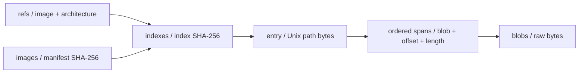

# 共享镜像缓存存储格式 v1

> 新发布已采用[共享镜像缓存 v2](shared-image-cache-storage-v2.md)的独立 meta、共享分片 data 与分页二进制索引。本文记录旧 v1 格式，读取器保留兼容，便于迁移核对。

本文描述已实现的文件系统/S3 直接存储格式，以及 `pvisor cache publish` 生成它的过程。操作步骤见[共享镜像缓存参考](../reference/shared-image-cache.md)。目录、字段和发布顺序对应 `image/cache/portable.rs`、`portable/publish.rs`、`storage.rs` 与 `client.rs`。

文件系统和 S3 使用相同的相对对象键。服务器后端继续查询已有 OCI 暂存，其内部存储不采用这个 v1 布局。

## 设计目标与数据范围

发布端完成所选 Linux 平台的 OCI manifest 解析、层下载、校验、解包和 whiteout 应用，再将合并后的文件视图转为索引和内容对象。工作节点只读取索引与访问到的块，因此不需要维护缓存服务或解包完整镜像。

索引保留路径、类型、大小、权限、UID/GID、硬链接身份、时间、符号链接目标和镜像启动配置。文件名与符号链接目标使用 Unix 原始字节。它不保存完整 OCI manifest、原始层 tar、任意 xattr 或运行时 writable upper，也不承载 CPU/RAM 环境快照。

内容对象是至多 **1 MiB（1,048,576 字节）** 的原始字节。当前没有压缩编码、逐文件 S3 对象、块头或对象内偏移表；文件与块的关系全部由索引中的 `spans` 描述。

## 共享存储目录树

```text
s3://BUCKET/PREFIX/
└── v1/
    ├── format
    ├── refs/
    │   ├── <tag-reference-and-architecture-hash>.json
    │   └── <pinned-reference-and-architecture-hash>.json
    ├── images/
    │   └── <platform-manifest-hex>.json
    ├── indexes/
    │   └── <index-bytes-hex>.json
    └── blobs/
        ├── <packed-content-hex>
        └── <other-content-hex>
```

S3 中的“目录”是对象键前缀。配置 `s3://images-cache/team-a` 时，内容对象的键为 `team-a/v1/blobs/<64位hex>`；文件系统配置 `/mnt/cache` 时，同一对象位于 `/mnt/cache/v1/blobs/<64位hex>`。镜像的 `etc/os-release` 在索引中映射到内容块，不生成同名 S3 键。

所有摘要字符串采用 `sha256:<64位hex>`，文件名只使用 hex 部分。`refs`、`images`、`indexes` 加 `.json`，`blobs` 无扩展名。散列使用 SHA-256；对象键不包含宿主绝对路径。

| 路径 | 内容与用途 | 覆盖规则 |
|---|---|---|
| `v1/format` | 固定字节 `pvisor-cache-v1\n`，末尾为一个 LF | 每次发布写固定值 |
| `v1/refs/<hash>.json` | 镜像引用与架构 → 平台 manifest 和索引摘要 | tag 与 pinned 引用记录均覆盖写 |
| `v1/images/<manifest-hex>.json` | 平台 manifest 摘要 → 索引摘要 | 可覆盖 |
| `v1/indexes/<index-hex>.json` | 完整文件元数据、启动配置、内容片段索引 | 不覆盖，条件创建 |
| `v1/blobs/<content-hex>` | 至多 1 MiB 的打包原始内容 | 不覆盖，条件创建 |

`format` 最后写入，是识别标记，不是全局提交点。读取器依赖各对象的 version、索引和块摘要。当前 Ping 只尝试读取标记，不校验其存在性或文本值，不能把 Ping 成功当作完整镜像校验。

## 摘要与引用关系



| 身份 | 计算或来源 | 用途 |
|---|---|---|
| 平台 manifest 摘要 | OCI 解析得到的 Linux/amd64 或 Linux/arm64 manifest 摘要 | 对外 digest；多平台镜像使用所选平台 manifest |
| 引用键摘要 | `SHA256(UTF8(canonical_image) + NUL + UTF8(architecture))` | 区分 tag/pinned 引用和架构 |
| 索引摘要 | `SHA256(索引 JSON 实际存储字节)` | 文件树版本，作为 metadata_generation 返回 |
| 内容摘要 | `SHA256(打包块实际原始字节)` | 完整性校验和块级去重 |

`alpine:latest`、`docker.io/library/alpine:latest` 和 `oci://alpine:latest` 规范化为 `registry-1.docker.io/library/alpine@latest`；`@latest` 是内部引用表示。固定引用为 `registry-1.docker.io/library/alpine@sha256:…`。架构取 amd64 或 arm64。键计算的 NUL 是一个 `0x00` 字节，不是反斜杠与数字 0 两个字符。

索引散列覆盖原始 JSON 字节，包括空白和字段顺序。下面的 JSON 为排版展示；下载示例使用紧凑编码，其对象名按实际字节计算。重新排版索引后必须重新计算摘要并发布新指针。

同一平台 manifest 可以有不同索引摘要，例如解包时间或文件元数据变化。images 可覆盖，不会永久固定某个索引版本。refs 直接保存索引摘要，prepare 可以直接加载；直接按 manifest 查询且尚未加载索引时，才查询 images。

## 对象字段

### refs：按引用与架构定位镜像

```json
{
  "version": 1,
  "image": "registry-1.docker.io/library/example@layout",
  "architecture": "amd64",
  "checked_at": 1700000000,
  "digest": "sha256:cccccccccccccccccccccccccccccccccccccccccccccccccccccccccccccccc",
  "index": "sha256:78fee5fd5d5c698c7513540ebee5b9e033c10c438439ed757c8abf8f954041ad"
}
```

| 字段 | 类型 | 说明 |
|---|---|---|
| `version` | u32 | 当前为 1 |
| `image` | string | 规范化引用，包含 tag 或 pinned 摘要 |
| `architecture` | string | amd64 或 arm64，也是引用键身份 |
| `checked_at` | u64 | 发布记录的 Unix 秒时间戳，用于五分钟 tag 有效期 |
| `digest` | string | 所选平台 manifest 摘要 |
| `index` | string | indexes 对象的摘要 |

读取时核对 version、引用、架构，以及索引中的 digest/architecture。发布会写调用方引用和对应的 pinned 引用；若输入已经是该 pinned 引用，两次写入落在同一个键。

读写 prepare 在 tag 记录不足 300 秒时复用，超时重新查询 registry。pinned 引用不因时间过期。只读模式使用已发布记录，即使记录过期也不查询 registry；记录缺失和 --refresh 明确失败。publish 不查询远端 refs，总是从本地准备结果打包上传；--refresh 控制是否重新查询 registry。

### images：直接按 manifest 查询

```json
{
  "version": 1,
  "index": "sha256:78fee5fd5d5c698c7513540ebee5b9e033c10c438439ed757c8abf8f954041ad"
}
```

只有 `version: u32` 和 `index: string` 两个字段。manifest 摘要来自对象键，不重复写入内容。加载后校验索引摘要和索引中的 manifest 摘要。

### indexes：完整文件视图与启动配置

完整的示例索引可[下载](../../assets/examples/cache-layout-v1/v1/indexes/78fee5fd5d5c698c7513540ebee5b9e033c10c438439ed757c8abf8f954041ad.json)。

| 字段 | 类型 | 说明 |
|---|---|---|
| `version` | u32 | 当前为 1 |
| `digest` | string | 所选平台 manifest 摘要 |
| `architecture` | string | 所选平台架构 |
| `env` | object<string, string> | 镜像默认环境变量 |
| `entrypoint` / `cmd` | array<string> | 镜像启动参数 |
| `totals` | object | files: u64、bytes: u64；普通文件路径数和逻辑字节总和 |
| `entries` | array<Entry> | 包含根目录的完整树，每个路径恰好一项 |

totals 按普通文件路径统计，硬链接每个路径都参与计数；它不是唯一 inode 数、物理对象大小或上传流量。目录、符号链接和 special 不计入普通文件/字节总量。

下面是一项完整的 Entry：

```json
{
  "path": [
    101,
    116,
    99,
    47,
    109,
    101,
    115,
    115,
    97,
    103,
    101
  ],
  "metadata": {
    "status": "metadata",
    "kind": "file",
    "size": 5,
    "mode": 33188,
    "uid": 0,
    "gid": 0,
    "inode": 6,
    "nlink": 2,
    "mtime": 1700000000,
    "mtime_nsec": 0,
    "target": null
  },
  "spans": [
    {
      "blob": "sha256:93355ccb32baf92c9cc4f6ec98a7e5aefc569663ff20a67215db0683fc61da8d",
      "offset": 3,
      "length": 5
    }
  ]
}
```

| Entry 字段 | 类型 | 说明 |
|---|---|---|
| `path` | array<u8> | 相对根目录的原始字节，[] 表示根 |
| `metadata` | object | 复用 cache 协议 status: metadata 响应 |
| `spans` | array<Span> | 按文件逻辑顺序保存片段，非普通文件必须为空 |

示例 path 解码为 etc/message。文件读取查索引，不按该路径打开宿主文件。路径禁止 NUL、空组件、dot/parent 组件和前导斜杠；父路径必须存在且为目录。名称无需 UTF-8，不使用 URL 编码或 Base64。JSON 整数数组会使路径存储大小超过原始字节数。

| metadata 字段 | 类型 | 含义 |
|---|---|---|
| `status` | string | 固定为 metadata |
| `kind` | string | directory、file、symlink、special |
| `size` | u64 | 文件/链接逻辑大小；目录大小沿用源元数据 |
| `mode` | u32 | Unix mode 数值，权限取其权限位，类型由 kind 指定 |
| `uid` / `gid` | u32 | 源 OCI 视图保留的 Unix 身份 |
| `inode` | u64 | 非零可移植 inode 身份，同一硬链接组相同 |
| `nlink` | u64 | 源元数据的链接数 |
| `mtime` / `mtime_nsec` | i64 | Unix 秒和纳秒分量 |
| `target` | array<u8> 或 null | symlink 原始目标字节，其他类型为 null |

发布将宿主 inode 转成当前索引中的连续身份，不直接暴露宿主 inode。符号链接只记录元数据，不在发布时跟随。cache read 只接受普通文件，guest 的符号链接路径由 FUSE 使用 target 解析。special 保留元数据，没有内容片段，也不能当普通文件读取。任意 OCI xattr 未单独写入索引。

### spans 与 blobs：文件范围映射

Span 有 `blob: string`、`offset: u32`、`length: u32` 三个字段。offset 是**块内偏移**；文件内偏移由此前 span 的 length 累加得到。普通文件的片段长度总和必须等于 size，空文件的 spans 为 []。

span 长度非零，offset + length ≤ 1 MiB，读取时还检查片段落在实际对象长度内。blobs 没有 JSON、压缩头或补齐，尾块可以不足 1 MiB。下载后校验整个对象的 SHA-256，再切取所需字节。

## 可读取的完整树形示例

这是 amd64 格式的教学数据，manifest 使用 64 个 c 的占位摘要，不对应真实 registry 镜像，也不是可启动的 Linux rootfs。全部对象位于仓库 docs/src/assets/examples/cache-layout-v1/。对象结构和内容摘要真实可校验，读取无需 S3 或 registry。

```text
/
├── bin/
│   ├── current -> tool
│   └── tool                 # ABC
└── etc/
    ├── message              # hello
    └── message-copy         # hard link to message
```

一个块存储 ABChellohello，共 13 字节，摘要为 `sha256:93355ccb32baf92c9cc4f6ec98a7e5aefc569663ff20a67215db0683fc61da8d`：

| 路径 | 文件逻辑范围 | 块内 offset | length | inode |
|---|---|---:|---:|---:|
| `bin/tool` | `[0,3)` | 0 | 3 | 4 |
| `etc/message` | `[0,5)` | 3 | 5 | 6 |
| `etc/message-copy` | `[0,5)` | 8 | 5 | 6 |

bin/current 的 target 是 [116,111,111,108]，解码为 tool，spans 为空。两个 message 路径共用 inode 6、nlink 2；发布器仍逐路径读取内容，因此在这个 pack 中各占一段。现有去重粒度是整个块，未单独按硬链接或每个文件去重片段。

可查看[引用记录](../../assets/examples/cache-layout-v1/v1/refs/a8d93e91eb6f819b7d43e6cdfa45d577eb739e9efc6bf7ec489b6242097eda03.json)、[manifest 指针](../../assets/examples/cache-layout-v1/v1/images/cccccccccccccccccccccccccccccccccccccccccccccccccccccccccccccccc.json)、[完整索引](../../assets/examples/cache-layout-v1/v1/indexes/78fee5fd5d5c698c7513540ebee5b9e033c10c438439ed757c8abf8f954041ad.json)和[原始内容块](../../assets/examples/cache-layout-v1/v1/blobs/93355ccb32baf92c9cc4f6ec98a7e5aefc569663ff20a67215db0683fc61da8d)。仓库根目录执行：

```sh
cache_layout_location="$PWD/docs/src/assets/examples/cache-layout-v1"
pvisor cache --backend filesystem --location "$cache_layout_location" \
  --read-only stat sha256:cccccccccccccccccccccccccccccccccccccccccccccccccccccccccccccccc etc/message
pvisor cache --backend filesystem --location "$cache_layout_location" \
  --read-only read sha256:cccccccccccccccccccccccccccccccccccccccccccccccccccccccccccccccc etc/message
```

最后一条输出 hello。按 manifest 的 stat/read 不要求宿主与索引架构相同，所以 arm64 宿主也能读取；按引用 prepare 使用宿主架构，示例仅提供 amd64 引用。

大文件可跨块，第一块也未必从 offset 0 开始。例如当前 pack 已有 100 字节，则长度 1,048,576 的文件先占该块 [100,1,048,576)，再占下一块 [0,100)。文件范围 [1,048,470,1,048,490) 由前一片段末尾 6 字节和下一片段开头 14 字节组成。

## 发布顺序、并发与失败

publish 先完成本地 OCI 准备，再按目录排序遍历树。每个普通文件向当前 pack 追加字节，满 1 MiB 就上传，遍历完成后上传尾 pack。pack 可跨文件边界，其摘要取决于整块字节和边界；不能承诺每个相同文件都复用同一个 S3 对象。

1. 条件创建全部 blobs。
2. 校验并序列化完整索引，条件创建 indexes 对象。
3. 覆盖写 images/<manifest>.json。
4. 覆盖写调用方 refs 记录。
5. 覆盖写对应 pinned refs 记录。
6. 写固定 format 标记，返回 Prepared JSON。

S3 不可变对象使用 If-None-Match 条件创建，已存在则复用。文件系统用同目录临时文件、文件同步、不可覆盖发布或原子替换、目录同步。两者要求单对象写入完整、原子可见。

这不是多对象事务。数据/索引失败时不会发布新指针/引用，可能留下无引用对象。images 或调用方 refs 写入后，后续 pinned refs/format 失败会使命令报错，已写入的对象仍可见；它们指向已完成的内容，不会自动回滚。

并发发布同一引用采用最后一次完成的覆盖写，没有 tag CAS、时间戳单调检查或整组指针锁。refs 与 images 可能暂时指向不同索引；读者沿自己取到的索引摘要读取不可变对象。元数据变化时既有读者仍可能使用旧索引，不能立即删除旧索引或块。

重复 publish 会补齐缺失对象，但不会覆盖“已存在但损坏”的不可变对象；条件创建复用它，读取校验仍失败。修复需管理员确认影响后清理损坏对象并重发，重发不代表自动修复任意损坏。

## 按需读取与本地目录树

按引用 prepare 从 refs 直接加载索引；直接 stat/list/read 按 manifest 查询 images。客户端已加载该 manifest 的索引时优先复用，避免每次查指针。完整索引一次加载，之后属性/目录查询只访问内存映射；list 按原始字节排序分页，每页最多 256 项，同时受 1 MiB 协议帧约束。

范围读取只下载与请求范围相交的块。当前使用完整对象 GET，没有 S3 Range GET：读取小文件的 5 字节可能下载整个 pack。热内存命中不再 GET，独立进程可复用本地持久化对象。

```text
--image-store DIR/
├── blobs/sha256/<oci-blob-hex>
├── rootfs-v3/sha256/<manifest-hex>/
├── metadata/
│   ├── sha256/<manifest-hex>.json
│   └── prepared-v1/<local-reference-key>.json
└── locks/

<user-cache>/pvisor/
├── cache-v1/objects/<location-hash>/
│   ├── indexes/<index-hex>
│   └── blobs/<content-hex>
├── blocks/<endpoint-hash>/<manifest-hex>/
│   └── <file-block-cache-objects>
└── metadata/v1/<endpoint-hash>/<manifest-hex>/<generation-hash>/
```

image-store 是发布端 OCI 下载/解包暂存，默认在系统用户缓存下的 pvisor/images。发布对象不依赖它，成功后可移除。上图仅列相关路径，不包含全部 OCI/FUSE/任务辅助文件。

cache-v1/objects 由直接后端读者维护，location-hash 是配置地址字符串的 SHA-256 hex。本地索引/块名不带 sha256:，索引不带 .json。地址隔离避免混用命名空间；文本不同的等价地址也可能各有一份本地缓存。

blocks 与 metadata/v1 属于 VM 懒加载适配器，分别缓存文件逻辑块、按 metadata_generation 保存的属性/目录页；它们可与整块对象缓存同时存在，磁盘统计需包含这些副本。直接后端内存 LRU 最多保留 4 个索引和 64 个块；块至多 64 MiB，索引则是数量限制，不是 64 MiB 总预算。

本地对象重新读取时校验摘要，损坏则重新获取；本地加速缓存不可写时仍能返回校验过的远端内容。远端缺失、损坏或权限错误会失败，不补零、不静默改走 registry。只读限制针对共享后端，仍可写本地加速缓存。

## 限制、权限与生命周期

| 项目 | 当前值或规则 |
|---|---|
| 架构 | amd64、arm64 |
| 单对象/索引读取上限 | 64 MiB，内容块另限 1 MiB |
| 单索引路径数 | 200,000，包含根 |
| 单索引片段数 | 500,000 |
| 单次文件读取 | 1…1,048,576 字节，CLI 分次流式读取 |
| 树结构 | 根为 directory，路径唯一，父目录存在 |
| 内容关系 | span 长度总和等于 size，totals 与逐路径统计一致 |
| 版本 | refs、images、index 的 version 必须为 1 |
| 未知字段 | refs/images/index/Entry/Span 拒绝；metadata 沿用 Response 的反序列化规则 |

发布和加载时校验结构；长路径或大量片段可能先触及 64 MiB JSON 上限。源 prepared rootfs 在发布期间必须不可变。截断、增长或变成非普通文件会拒绝，但发布不是源目录的事务快照，不检测所有同长度变更。

publish 上传需 s3:PutObject，读写 prepare 还需 s3:GetObject，只读节点只需 GetObject；正常操作不用 ListBucket、DeleteObject 或创建桶。连接与凭据属于宿主，见[配置参考](../reference/shared-image-cache.md)。摘要用于完整性，不能认证不可信发布者；refs、images 和启动配置须由可信发布者及存储权限保护。

当前没有自动 GC、配额、租约或逐引用删除工具。直接后端整块对象缓存不合并跨进程并发下载；VM 的按文件块缓存仍有本地锁。块可被多个索引引用，删除旧引用不表示块可删除；按年龄清理 blobs 会破坏仍有效的镜像。可按独立 bucket/prefix 分组保存，确认无读者使用后整体退役。更细的 GC 必须遍历引用关系，并保护活跃/历史读者。

v1 读取器不解释其他版本。改变字段或编码需明确的版本与兼容策略，不能把压缩编码或新路径含义直接写进旧 v1 对象。

## 实现与验证依据

| 机制 | 实现/测试 |
|---|---|
| 对象、范围读取、引用有效期、加载校验 | `crates/pvisor/src/image/cache/portable.rs` |
| 打包、可移植 inode、发布顺序 | `crates/pvisor/src/image/cache/portable/publish.rs` |
| 文件系统写入、S3 条件创建与错误处理 | `crates/pvisor/src/image/cache/storage.rs` |
| 后端配置和本地对象路径 | `crates/pvisor/src/image/cache/client.rs` |
| EOF/范围、硬链接、分页/非 UTF-8 名称、失败发布、本地损坏 | `crates/pvisor/src/image/cache/portable/tests.rs` |
| SigV4 CLI 发布、补齐缺失块、独立只读节点、真实 VM | `crates/pvisor/tests/cache_backends.rs` |

生产镜像的发布和读取入口：

```sh
PVISOR_CACHE_READ_ONLY=false pvisor cache publish alpine:latest \
  --backend s3 --location s3://your-bucket/pvisor-cache \
  --architecture amd64 --image-store /tmp/pvisor-publish

export PVISOR_CACHE_BACKEND=s3
export PVISOR_CACHE_LOCATION=s3://your-bucket/pvisor-cache
export PVISOR_CACHE_READ_ONLY=true
pvisor cache prepare alpine:latest
pvisor cache read sha256:YOUR_MANIFEST_DIGEST etc/os-release
```

以上要求已有 bucket 和有效 AWS 区域/凭据。操作参考见[共享镜像缓存](../reference/shared-image-cache.md)；附带的小型示例只验证对象结构与读取语义。
