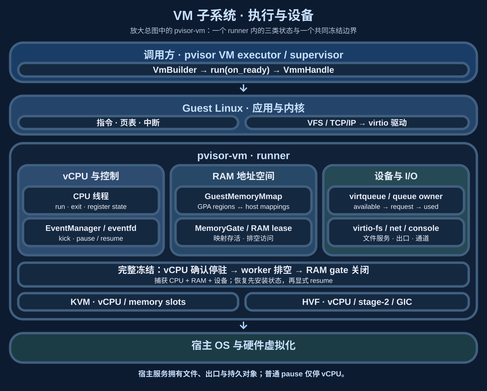

# VM 子系统：执行、设备与一致性

`pvisor-vm` 把 guest CPU、RAM 和虚拟设备放在同一个生命周期内管理。硬件虚拟化执行 guest 指令，宿主设备处理 I/O，控制接口协调暂停、映射维护与状态捕获。上层 `pvisor` 提供文件树、网络出口、存储和 runner 监督；VM 内部掌握这些操作何时可以安全触碰机器状态。

## 子系统框图与所有权 {#architecture}

图中并列的三块状态必须共同存活：vCPU 线程拥有运行与寄存器状态，RAM 映射提供 guest 地址空间，设备队列保存正在处理的 I/O。平台后端将它们接到 Linux KVM 或 macOS Hypervisor.framework；相同的 Rust API 不表示所有平台具有相同能力。

| 所有者 | 持有的状态 | 边界 |
| --- | --- | --- |
| 调用方 / supervisor | runner 进程、宿主隔离、传入 FD、文件与网络服务、存储租约 | 负责准备、监督、终止和持久发布 |
| `VmBuilder` | CPU/RAM、内核、设备及启动配置 | `run` 消费 builder，进入 runner 事件循环 |
| 私有 `Vmm` | vCPU handles、guest memory、设备总线、控制状态与 RAM gate | 协调机器状态迁移，内部状态不越过 `api` |
| vCPU / 设备线程 | CPU 状态、队列、请求缓冲区与 RAM lease | 在确认边界交回控制或所有权 |
| `VmmHandle` | 对运行中 VM 的弱引用和控制入口 | handle 不延长 VM 生命周期；VM 结束后控制失败 |

公开入口集中在 `pvisor_vm::api`：trait 声明配置、运行、控制和快照合同，私有模块负责方法实现、资源管理和平台分派。调用方显式导入需要的 trait，不访问 backend、VMM 或设备内部字段。

## 从配置到 guest 执行 {#boot}

1. 调用方解析执行配置，准备 rootfs、导出树、网络通道和可信固件输入，并在专用 runner 中构造 `VmBuilder`。
2. builder 建立 guest RAM 区域、内核与启动参数，安装所选虚拟设备，交给平台后端注册内存和创建 vCPU。
3. `VmRuntime::run(self, on_ready)` 消费配置，在 VM 可控制时向回调交付 `VmmHandle`。回调应及时返回，让事件循环推进；这个函数的返回值是运行结果，不是 handle。
4. vCPU 进入硬件虚拟化执行。需要宿主处理的 VM exit、设备通知、中断和控制请求，由相应 CPU 线程或事件循环处理。
5. guest 的 `pvisor-guest` supervisor 负责 guest 内启动与进程环境；宿主 Session 继续拥有整个 Attempt 的收尾和结果发布。

普通 guest 指令与大部分系统调用在 guest 内执行。一次 guest `read` 只有在导出文件树需要后端 I/O 时才到 virtio-fs；guest 内存页命中、tmpfs 或 procfs 操作可由 guest 自己完成。网络连接通过 guest TCP/IP 和 virtio-net 进入宿主出口。

`run` 为专用 runner 设计，正常 guest 关机路径会结束该进程；初始化失败通过错误返回。外部服务不能把它当作任意应用线程里的无副作用函数。调用方负责 runner 消失时的归属核对和资源清理，具体身份关系见[执行模型](execution-model.md)。

## vCPU、事件与设备为什么分开 {#execution}

vCPU 线程反复进入后端执行，再根据 exit 原因处理寄存器、设备访问或停止状态。设备 I/O 则可能等待宿主文件、socket 或 worker 完成。如果让控制线程直接假定“vCPU 已停，所以所有访问已停”，仍在执行的设备就可能写入正在复制或重新映射的 RAM。

事件循环接收设备事件与控制通知；CPU 控制需要 kick 和确认，设备冻结需要停止接收、完成在途请求并交回队列。设备类型与平台能力决定支持哪些状态捕获。当前没有统一的虚拟硬件热插拔承诺；vCPU 观测也只提供显式启用的实验数据，不据此自动 offload。

## Virtio 请求、并发与 RAM lease {#virtio}

guest 驱动将请求和响应缓冲区放进 RAM，把 GPA、长度与方向写入 descriptor chain，再发布 available 条目并通知设备。宿主必须校验这些范围，才能把 GPA 转成可访问的宿主映射。请求完成后，queue owner 写回响应并发布 used 条目，guest 才能重用对应缓冲区。

virtio-fs 目前保留一个普通 request queue 和一个 hiprio queue。可重叠的大 READ 与目录读取交给有界 blocking I/O worker，短请求和需要串行的修改由队列 owner 处理。worker 返回结果，owner 独占 available/used ring 更新；并发 I/O 不改变 ring 的所有权。

设备从访问缓冲区到发布 used ring 保留 RAM lease。freeze/reset 停止接收、排空已接收请求、回填结果并 join worker 后才返回；thaw/restore 主动检查 available ring，不能依赖已经过去的 guest kick。尚在执行的宿主 I/O 不作为可重放请求序列化进入机器快照。

这里连接了三个专题：[内存子系统](memory-optimization/index.md)定义映射与恢复来源，[文件系统](overlayfs.md#filesystem-service)解释请求如何查找 lower 或修改 upper，[网络](overlaynet.md#vm-request-path)解释 Ethernet frame 如何变成受控宿主连接。它们共享设备/RAM 生命周期，但保留各自的业务状态。

## Pause、完整冻结与恢复 {#freeze}

| 动作 | 停止范围 | 之后允许做什么 |
| --- | --- | --- |
| 普通 `pause` | 确认 vCPU 停驻 | 设备可能继续 I/O；不足以任意替换 RAM 或捕获完整状态 |
| 完整 snapshot freeze | vCPU 停驻、设备返回队列、RAM lease 排空且 gate 关闭 | 在兼容 profile 下捕获 CPU、RAM 和设备，并协调文件状态 |
| Restore | 校验并安装映射、CPU、设备与文件副本，保持暂停 | 成功完成后由调用方显式 resume |

冻结按 **vCPU 确认 → 设备排空 → RAM gate 关闭** 推进。排空期间必须允许已有完成路径前进，不能提前关闭它们所需的 RAM 访问。`VmmHandle` 的控制事务串行化状态迁移；等待 worker 时释放 VMM 锁，让设备收尾有机会执行。

冻结超时或控制状态失败时，调用方必须终止失败 runner，不能让未知设备状态与 guest 并发恢复。完整快照还需要捕获范围内的文件系统和兼容性绑定；对端网络不会随本地 RAM 回退，所以当前原生 Job execution profile 排除网络设备。持久发布与恢复合同由[环境快照](environment-snapshot.md)维护。

## 回到整体架构与源码 {#integration}

VM 承担机器状态的唯一所有权，上层仍决定这次 Attempt 的文件、网络、存储与失败处置。内存优化必须经过 VM 的一致性边界；文件系统和网络服务不得自行保存 guest 裸指针；snapshot store 固定对象并发布可恢复状态。这个拆分让宿主存储和服务能够演进，同时保持 guest 地址空间与队列生命周期集中管理。

| 源码入口（相对 `crates/pvisor-vm/src/`） | 重点 |
| --- | --- |
| `api.rs`、`builder.rs` | 配置、ready 回调、资源与平台合同 |
| `vmm/mod.rs`、`handle.rs` | VMM 状态、控制事务和冻结顺序 |
| `backend.rs`、`vmm/linux/vstate.rs`、`hvf/` | KVM/HVF 适配与 CPU 执行 |
| `devices/virtio/fs/worker.rs` | 请求分派、I/O worker、队列收尾 |
| `devices/virtio/memory_gate.rs`、`devices/snapshot.rs` | RAM lease、设备冻结和恢复拓扑 |

