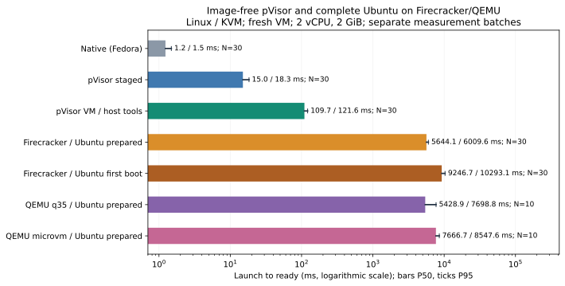
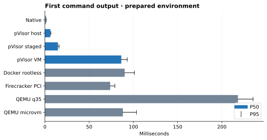

# VM 启动：技术分析与实验记录

## 1. 结论

pVisor 新 VM 返回首条命令输出，在 macOS / Apple M4 上约 **84 ms**、Linux / Ryzen 7 9700X 上约 **110 ms**，均为 **0.1 秒量级**。Linux 同机 Firecracker 启动完整 Ubuntu，已配置环境约 **5.64 秒**、首次启动约 **9.25 秒**；pVisor 直接使用目录，无需系统镜像。各批次配置不同，完整数据分别保留。

## 2. Motivation

Agent 执行器可能反复创建隔离环境，启动等待会直接影响首次命令的响应时间，也会影响短任务的整体成本。因此，这次优化关注从开发者启动 CLI 到 guest 真正执行工作负载的完整路径，而不只关注内核的一段初始化日志。

此前调查覆盖了运行记录持久化、runner 参数传递、早期随机数初始化和 firmware 裁剪。需要用统一口径确认当前实现的表现，并将已经验证的收益与没有稳定收益的实验区分开。本次测量回答三个问题：

- 当前新 VM 从 CLI 启动到负载就绪需要多久，退出收尾又需要多久？
- 相同 CLI 使用官方与裁剪 firmware 时，中位数和尾延迟有什么差异？
- 宿主准备、进程装载、VMM 构造与 guest 执行分别占多少时间，下一步应该优化哪里？

优化的约束是保留隔离、运行记录持久化和执行证明的语义。性能改善必须由成功运行的样本支持；内核日志更短、文件更小或代码更少，都不能单独替代端到端测量。

## 3. 实验设计

### 计时边界与工作负载

我们测量从启动 pVisor 到新 VM 执行第一条 shell 命令并返回输出的时间，表中记为 **Ready**。它覆盖宿主准备、VM 启动和命令执行，反映用户发出命令后的启动等待。

**Exit** 从同一起点计到运行时正常退出，包含结果保存和关机等收尾工作。每次创建新 VM，宿主缓存已预热；pVisor 使用目录，参考运行时的镜像下载和制作在计时前完成。完整 Ubuntu 还要求发行版系统服务就绪，其新批次单独给出。

??? note "精确计时与对照设置（复现用）"

    计时使用宿主单调时钟，在创建 CLI 进程前开始，以宿主收到 guest 的独立 `PVISOR_BENCH_READY` 输出为 Ready 终点。负载只执行 `/bin/sh -c 'printf "PVISOR_BENCH_READY\n"'`，不在标记前后运行 `dmesg`。输出传输和宿主读取线程调度也计入耗时。

    Exit 以等待线程观察到 CLI 退出为终点，包含 guest 退出、sync/reboot、VMM 退出及运行结果持久化。就绪输出和进程退出由独立线程等待，避免轮询间隔造成额外延迟；线程调度仍会影响观测值。

### 环境与配置

| 项目 | macOS / HVF | Linux / KVM |
|---|---|---|
| 宿主 | Apple M4，24 GiB RAM | Ryzen 7 9700X，约 30 GiB RAM |
| 系统 / 架构 | macOS 27.0.1 / ARM64 | Fedora 44 / x86_64 |
| guest 根目录 | 已准备的 Alpine 3.22.1 目录 | 最新 `--rootfs host`；历史准备 Fedora 目录 |
| VM 规格 | 1/2/4 vCPU、128/2048 MiB；最新复测为 2 vCPU | 2 vCPU、128/256/2048 MiB |
| firmware | 官方与裁剪的 libkrunfw 5.6.2 | 最新静态内置 Linux 6.12.109；早期 libkrunfw 5.5.0 |
| 缓存与预先准备 | 宿主缓存预热，目录准备在计时前 | 宿主缓存预热，参考镜像下载/准备在计时前 |

硬件、guest 文件系统、firmware 和 CLI 制品分别记录。两组共享计时标准，结果说明各自环境中的启动耗时；跨平台数值不用于单独判断操作系统或虚拟化后端的速度。

??? note "macOS 制品与环境详细记录"

    | Item | Value |
    |---|---|
    | Date | 2026-10-03 |
    | Host | Apple M4, 10 cores, 24 GiB RAM, AC power |
    | OS / filesystem | macOS 27.0.1 (26A434), APFS |
    | Executor | pVisor 0.3.0 release, libkrun 1.19.3, HVF / aarch64 |
    | Source HEAD at measurement | `d6c607e79b8c497d2994731beb2ce2b3dfe628c0`; working tree status preserved in raw data |
    | CLI SHA-256 | `04d4c05fbc706d34738f4a453449f9f670a7a89021f261b133aa855cb9bc19b4` |
    | Guest rootfs | Alpine 3.22.1 aarch64, prepared directory, virtio-fs |
    | Firmware | official libkrunfw 5.6.2 / locally trimmed 5.6.2; Linux 6.12.109 |
    | Samples | 100 per main case + 5 discarded warmups; 20 per diagnostic case + 5 warmups |
    | Load average, before / after | 3.23, 3.35, 4.25 / 3.31, 3.79, 4.29 |

    官方 firmware 来自上游 5.6.2 发布的预编译 aarch64 `kernel.c`，只在 macOS 包装成 dylib；裁剪版来自本地 libkrunfw 构建。官方源码无需完整重编译。两者内核版本一致，但本地源码为 `v5.6.2-3-gf6a710f`，因此比较的是这两个真实制品，不是严格只改变一项 Kconfig 的因果实验。CLI 当前默认下载器仍固定 5.5.0，本实验显式选择 5.6.2，不把默认版本混进表格。

    官方 dylib 为 23.715 MiB，裁剪版为 11.307 MiB，文件大小减少约 52.3%；这不等于 guest 或宿主物理内存降低 52.3%。完整 SHA-256、参数、源码状态和每个样本见[原始 TSV](../../assets/benchmarks/startup-20261003.tsv)。原始 JSON 保留测量时的绝对路径作为来源记录，复现时替换为自己的路径。

<a id="linux-methodology"></a>

??? note "Linux 制品、环境与校验详细记录"

    Linux 使用相同的首条命令输出作为就绪标准，每次启动新 VM。2 vCPU 下测量 128、256 和 2048 MiB 三档内存，并保留宿主直接执行和 pVisor host 两个对照。

    | 项目 | 条件 |
    |---|---|
    | 日期 | 2026-10-03 |
    | 宿主 | AMD Ryzen 7 9700X，8 核 / 16 线程，约 30 GiB RAM；btrfs |
    | 系统 / 后端 | Fedora 44；Linux 7.2.8-200.fc44.x86_64；KVM / x86_64 |
    | guest 文件系统 | 已准备的宿主 Fedora 根目录，`--rootfs /`；命令由 `/bin/sh` 执行 |
    | 制品 | 固定 GNU release CLI，沿用本轮 VM 验证制品；libkrunfw 5.5.0，未做 firmware 裁剪对照；完整 SHA-256 见原始数据 |
    | 样本 | 每组 5 次预热、100 次正式测量；每轮随机排列五组；关闭启动诊断日志 |
    | 宿主负载 | 1 分钟 load average 0.67 → 1.32；保留日常后台负载 |

    共 500 个正式样本，其中 300 次真实 VM 启动；另有 25 次预热。每个 pVisor 样本检查运行记录已完成、退出码为零，VM 样本还验证实际隔离为 `virtual_machine`。失败会停止测量，原始日志保留；不把失败算成更快的样本。

    Linux 与 macOS 的首条输出计时边界一致，但硬件、guest 文件系统、firmware 和 CLI 制品不同。这组数据说明各自环境中的启动耗时，不能据此单独判断操作系统或虚拟化后端的速度差异。Linux 使用固定制品，后续源码改动不进入本组结果。

### 采样、校验与统计

各组先预热、按轮随机排列，Ready 与 Exit 分别统计，成功长尾保留。macOS 与早期 Linux 主矩阵 N=100，新增部署对照 N=30；细分阶段诊断另列。各表写明 N，预热不计入结果。

每个 pVisor 样本检查运行记录已完成、退出码为零，VM 样本还检查实际隔离为 `virtual_machine`。失败或缺少就绪输出不得计入成功分布；历史主矩阵遇失败会停止测量，新的部署对照记录失败并继续其他组。百分位数反映本批次分布，不保证长期尾延迟或其他机器的表现。

??? note "macOS 配对统计与对照设置"

    正式矩阵共 1,000 个成功样本，另外 80 个成功诊断样本；预热共 70 次，总计 1,150 次启动。VM 样本在计时结束后检查 Bundle 为 completed、零退出，并确认 `virtual_machine` 隔离。任一失败、缺少标记或隔离不符都会终止测量，不能作为快速样本。

    每轮随机排列所有案例；将同轮、同规格的官方值减去裁剪值，再对差值取中位数。置信区间使用固定 seed 的 5,000 次 bootstrap 重采样，它反映本批次样本变化，不能覆盖不同机器或负载条件的系统误差。

    原完整矩阵关闭 `PVISOR_STARTUP_TIMING`，诊断矩阵单独开启；后文两轮 P0 复测开启常态日志。每次正式启动使用新工作目录，跳过个人 Agent 默认配置，关闭 OverlayNet，使用继承 stdio，没有 Gateway 或 TUI。原生 shell 和 host 执行器作为上下文对照；macOS 与 Alpine shell 实现不同，两者耗时相减不能精确代表虚拟化成本。

### 常态化启动诊断日志

启动日志帮助定位等待发生在哪个阶段，默认开启；设置 `PVISOR_STARTUP_TIMING=0` 可关闭。本文分别保留无日志的原完整矩阵和开启日志的最新复测，比较时应使用同一批次。

??? note "日志字段与采集方式"

    当前实现默认输出 `pvisor-startup level=info` 阶段日志，无需调试开关。字段包括 Unix 时间 `timestamp_ms`、`pid`/`ppid`、JSON 引号包裹的 `run_id`、`stage`、`monotonic_us` 和 `process_elapsed_us`。Run ID 生成前的进程事件使用 `"-"`；结合 PID 与后续带 Run ID 的事件关联，父进程和 runner 的同一 Run 使用相同 ID。时间差使用宿主单调时钟计算，不能使用可能调整的墙上时钟。

    普通 CLI 输出到 stderr，可由生产日志采集器保留；TUI 沿用前端诊断日志文件，VM runner 通过预先打开的专用描述符写入同一通道，避免污染 Agent 终端。日志只包含阶段与身份计时字段，不含命令、环境变量或凭据。输出尽力而为，不增加 fsync，也不作为恢复元数据。

    `PVISOR_STARTUP_TIMING=0` 可显式关闭计时日志，用于无埋点基准；`1` 与不设置都开启。本文历史测量值来自归档制品，不能据此声称新增常态日志没有任何开销。`cli.session_started` 和 `runner.vmm_built` 分别表示 Session 已启动和 VMM 已构造，不代表 guest 或业务服务就绪；还没有通用 guest-ready 通知。

## 4. 实验数据与分析

本次测量的新 VM 启动中位耗时为 **0.1–0.2 秒量级**。macOS 数据包含 firmware 对照、阶段诊断与优化前后复测；Linux 数据包含三个内存规格及宿主对照。以下分别给出两组完整结果和分析。

### macOS / HVF {#macos}

Apple M4 上最新复测的启动中位耗时为 **84.35 ms**，P95 为 **112.14 ms**。[两轮优化复测](#macos-p0)记录这组结果；下面的完整矩阵和启动账本来自此前独立批次，分别保留。

#### 完整矩阵：无诊断日志的端到端结果 {#macos-results}


图 1：各规格的就绪延迟。三个面板使用不同的横轴范围；P99 保留长尾样本，不能把中位数改善解释为每次启动都同样快。

下表单位均为毫秒；每行 N=100。`direct` 是原生 shell，`host` 是 pVisor host 执行器，其余名称为 firmware、vCPU 数和 MiB。

| Case | Ready P50 | Ready P95 | Ready P99 | Exit P50 | Exit P95 |
|---|---:|---:|---:|---:|---:|
| `direct` | 5.16 | 7.36 | 8.15 | 5.44 | 7.66 |
| `host` | 31.49 | 37.34 | 44.08 | 56.63 | 70.56 |
| `official-1cpu-128` | 125.49 | 140.99 | 146.79 | 202.61 | 302.99 |
| `trimmed-1cpu-128` | 81.03 | 99.55 | 127.66 | 138.58 | 200.79 |
| `official-2cpu-128` | 117.77 | 144.38 | 229.53 | 190.21 | 291.47 |
| `trimmed-2cpu-128` | 82.64 | 98.98 | 103.31 | 142.56 | 194.52 |
| `official-4cpu-128` | 108.68 | 121.24 | 132.39 | 188.59 | 262.58 |
| `trimmed-4cpu-128` | 85.15 | 103.62 | 400.23 | 153.01 | 199.25 |
| `official-2cpu-2048` | 125.15 | 143.53 | 156.74 | 211.97 | 314.88 |
| `trimmed-2cpu-2048` | 92.71 | 108.48 | 167.57 | 167.68 | 252.12 |

100 个样本足以描述这次测量的中位数和常见尾部，但 P99 接近最大观测值，不能据此保证长期尾延迟。后台负载、电源状态、APFS 持久化与宿主调度都可能影响下一批结果；之前约 84 ms 是另一批次的观测，不是固定性能常数。

本次也出现了明显长尾：裁剪版 4 vCPU / 128 MiB 有 2/100 次超过 200 ms，最大 412.91 ms；官方 2 vCPU / 128 MiB 有 3/100 次超过 200 ms，最大 389.00 ms。第 15 和 68 轮分别包含多个较慢案例。正式矩阵没有细粒度埋点，无法确定是持久化、调度还是其他宿主活动导致；这些成功样本全部保留，不剔除后再报告更漂亮的 P99。

##### 同轮配对的 firmware 收益

| vCPU / MiB | Paired saving P50 | Bootstrap 95% CI | Trimmed faster |
|---|---:|---:|---:|
| 1cpu-128 | 44.62 | [42.60, 47.18] | 98/100 |
| 2cpu-128 | 33.79 | [32.35, 37.14] | 99/100 |
| 4cpu-128 | 23.88 | [22.72, 25.15] | 96/100 |
| 2cpu-2048 | 34.94 | [32.21, 37.13] | 98/100 |

配对差值中位数不必等于两个组中位数的相减。增加 vCPU 或分配 RAM 也不保证更快，应按实际工作负载选择配置。这里未使用快照恢复、常驻 VM 池或共享内存扫描。

#### 启动账本：时间去了哪里

诊断结果显示，宿主准备和 guest 启动到返回输出是两项主要耗时，各约 **30 ms**；VMM 构造约 **3 ms**。进一步降低启动等待，需要优先关注运行记录与文件系统准备，以及 guest 的启动路径。


图 2：六段按时间顺序排列，横向位置表示累计经过的时间。图使用诊断批次的均值，合计 87.05 ms；下表另列 P50。guest 段包含初始化、负载执行和输出到达。

下面是裁剪版 2 vCPU / 128 MiB 的独立诊断批次，N=20；诊断 Ready P50 为 87.67 ms。它不能与正式批次直接相减来估计日志开销。

| Boundary | P50 (ms) | Mean (ms) |
|---|---:|---:|
| `parent_load` | 7.14 | 7.26 |
| `parent_prepare` | 33.73 | 34.02 |
| `runner_load` | 6.17 | 6.28 |
| `runner_prepare` | 4.78 | 4.74 |
| `vmm_build` | 3.19 | 3.30 |
| `guest_and_output` | 31.08 | 31.46 |

??? note "阶段划分与时钟校验（复核用）"

    六段的边界依次是：harness 起点 → 父进程 `main` → 开始 spawn runner → runner `main` → 进入 libkrun → VMM 构造完成 → 宿主读到就绪标记。父子进程埋点和 harness 使用同一宿主 `CLOCK_MONOTONIC` 时间域。每个样本的六段相加都必须严格闭合到该样本 Ready；各段均值也可以相加，独立中位数通常不能相加。

    `guest_and_output` 包括 guest boot、PID1 初始化、exec shell、virtio 控制台传输和宿主读线程调度，并不是纯 Linux 初始化。guest `dmesg` 使用 guest 时钟，不能直接与宿主时间戳相减。此前同制品的独立 kernel 日志对照中，官方到 `Run /init.krun` 约 42–43 ms，裁剪版约 21 ms；该历史辅助批次不参与本表统计。

准备阶段中的嵌套区间如下。它们存在包含关系，不能把 storage、record、overlay 全部相加。

| Nested span | P50 (ms) |
|---|---:|
| `storage` | 30.72 |
| `record` | 18.02 |
| `overlay` | 12.15 |
| `agentctl` | 0.14 |
| `ram` | 0.18 |
| `spec` | 0.11 |
| `attestation` | 4.12 |

记录持久化和 overlay 准备是父进程路径的主要组成；runner 还包含设备配置与证明文件准备。仅阅读 JSON 或 virtio-fs 的某条日志，不能解释整段 guest 启动时间。

#### 已验证并保留的优化


图 3：两次历史对照实验分别验证持久化优化和启动熵优化。每次 50 对样本，资源规格与批次不同；它们不是连续的优化时间线，收益不能相加。

##### 缩减重复持久化，保持运行记录语义

非 Gateway 路径合并重复的初始 RunRecord 写入；未变化的索引复用原 inode 与内容，并保留必要的文件和目录同步。runner spec 使用父进程持有的私有临时文件进行 IPC，无需按长期业务记录执行 fsync。失效索引、权限不符和路径迁移仍会修复。

此前相同裁剪 firmware、2 vCPU / 2 GiB、50 对无日志样本中，Ready P50 从 163.522 降到 136.217 ms；配对中位数节省 24.507 ms，48/50 对更快。父进程 main 到 spawn 的 P50 从 54.804 降到 34.675 ms。这组历史数据验证持久化优化，不能与本次结果串成同一实验曲线。

##### 为 guest 提供新鲜的启动熵

aarch64 FDT 为每台新 VM 注入独立的 32 字节 `rng-seed`，使用宿主操作系统随机源；生成失败会阻止启动，不回退到固定 seed。它让 Linux 更早获得可用熵，避免早期随机数准备拉长关键路径，保留 guest 的 DRBG 和熵健康检查。

此前 2 vCPU / 128 MiB、50 对无日志样本中，Ready P50 从 129.270 降到 82.268 ms；配对节省 47.614 ms，95% CI [46.590, 48.750]，50/50 对更快。诊断中的 CPU_ON 区间也由约 49.849 降到 4.080 ms。后者包含启动调用路径，不能认作 PSCI 本身执行了 50 ms。

##### 按实际 VM 设备与 Agent 需求裁剪 firmware

裁剪无使用路径的 GPU/显示/物理输入设备、罕见文件系统与加密算法、调试导出以及内存和电源管理的多余能力，保留 pVisor 实际依赖的 virtio、virtio-fs、控制台、网络和必要密码能力。加密算法自检与 Jitterentropy 健康检查是不同机制；没有把安全检查一概关掉。

本次配对数据验证裁剪制品的整体收益，不能把收益精确分摊到某一驱动。内核代码量减少会影响映射、初始化和缓存，但文件体积不直接决定启动时间。完整设备能力和配置变化仍需以 libkrunfw 的定制配置为准。

##### 清理未稳定获益的实验

init argv 压缩参数通道已撤下，guest 仍读取有大小上限的 JSON。内核随机能力探测缓存补丁只保留实验记录，没有成为默认：在 FDT seed 已启用时，附加收益未稳定。清理前后 20 对无日志样本未观察到稳定回归。实验性逐 exit/MMIO 与 virtio-fs 细粒度埋点也已移除，当时保留轻量且默认关闭的宿主启动计时；目前该机制已升级为上文所述的常态诊断日志。

#### 两轮 P0 的受控复测 {#macos-p0}

本次以固定提交 `52e77c60d6352960a4d2ab4ef8661f3d5b1b2797` 为基线，依次叠加两项修改，排除同时进行的其他 HVF/VMM 工作区改动。三个 release 制品使用同一个隔离源码目录与构建目录：`baseline` 为原始实现，`attestation` 仅取消临时证明同步，`both` 再加入目录同步去重。firmware 与 prepared rootfs 不变，常态阶段日志全部开启（`1` 与默认行为相同）。这次没有重测官方 firmware，也不能把新的结果与上方另一批次的官方数值当作同轮对照。

第一轮保留证明完整写入、正常退出判定和失败入口清空，只移除两处 `sync_data()`。第二轮先创建完整目录树，再同步最上层新目录的父目录与每个新目录；新建 N 层时，目录屏障从 2N 次降到 N＋1 次。已有目录行为与同步错误传播保持原有合同；RunRecord 和索引的原子写入没有改成后台任务。

2 vCPU，128 MiB / 2048 MiB，各制品每规格 100 个正式样本，另有 5 次预热。共 600 个正式样本、30 次预热，每轮随机排列六组。时间单位均为 ms，起止仍为 harness 创建进程前到负载输出标记；Ready 与 Exit 分开记录。原始样本及制品 hash 见[两轮 P0 TSV](../../assets/benchmarks/startup-p0-20261003.tsv)。

| MiB | Variant | Ready P50 | Ready P95 | Ready P99 | Exit P50 |
|---:|---|---:|---:|---:|---:|
| 128 | `baseline` | 90.50 | 107.99 | 717.92 | 155.10 |
| 128 | `attestation` | 84.69 | 101.89 | 149.32 | 144.91 |
| 128 | `both` | 84.35 | 112.14 | 193.52 | 144.60 |
| 2048 | `baseline` | 97.27 | 116.15 | 183.06 | 182.45 |
| 2048 | `attestation` | 94.36 | 108.69 | 503.98 | 177.42 |
| 2048 | `both` | 94.55 | 110.57 | 145.46 | 176.42 |

| MiB | Comparison | Paired saving P50 | Bootstrap 95% CI | Faster |
|---:|---|---:|---|---:|
| 128 | `baseline → attestation` | 6.61 | [2.98, 8.80] | 70/100 |
| 128 | `attestation → both` | 1.30 | [-0.98, 3.35] | 53/100 |
| 128 | `baseline → both` | 5.64 | [4.00, 8.46] | 73/100 |
| 2048 | `baseline → attestation` | 3.61 | [2.01, 6.35] | 66/100 |
| 2048 | `attestation → both` | 2.31 | [-0.31, 4.42] | 56/100 |
| 2048 | `baseline → both` | 4.24 | [1.61, 5.77] | 66/100 |

| Variant (128 MiB) | Attestation P50 | Storage P50 | Parent preparation mean | Ready mean |
|---|---:|---:|---:|---:|
| `baseline` | 4.03 | 33.33 | 48.66 | 104.74 |
| `attestation` | 0.04 | 33.63 | 42.32 | 91.34 |
| `both` | 0.04 | 32.57 | 37.42 | 88.73 |

第一轮在两档内存下的端到端配对区间均为正，attestation 子区间从约 4.03 ms 降到 0.04 ms；128 MiB 的 100/100 对该子区间都更快。第二轮单独的端到端区间仍跨零，不能宣称它额外带来稳定毫秒级收益；它确定减少了冗余目录同步调用。两轮叠加在本批次有稳定中位数收益，但 128 MiB 的 Ready P95 从 107.99 ms 变为 112.14 ms，尾延迟并未全面改善。

此前还取过一批每组 50 个样本，宿主 1 分钟 load average 从 18.38 降到 8.66，端到端区间均跨零；这批完整保留在[首批原始 TSV](../../assets/benchmarks/startup-p0-20261003-first.tsv)，不与本批合并。第二批 load average 为 5.67 → 6.87；负载较前一批低，但不是完全隔离的空闲宿主环境。所有成功长尾样本保留。

配对节省为同轮差值的中位数，区间由 5,000 次 bootstrap 得到；两轮中位数不能直接相加。子区间 P50 也不能直接相加为总耗时。对 CI 包含零的结果不宣称稳定收益；退出尾延迟与就绪尾延迟仍需分别观察。

目录检查验证了三层目录对应四个同步目标、已有目录不新增屏障、同步失败立即返回。三个制品均检查了真实 VM 的成功、guest 非零退出和超时：前两者保留隔离证明，超时保持未知，不把临时证明文件当成恢复状态。该检查覆盖运行语义，不等同于实际断电测试。

#### 下一步优化的边界

临时 attestation 同步与单次目录创建中的重复屏障已按上方两轮 P0 实验处理。接下来调查 RunRecord/索引及不同准备步骤之间的屏障合并，再测父子进程装载和 guest PID1 后的具体工作；继续维持失败、取消和执行证明的语义。

RunRecord 是执行前的权威状态，不能为了更快把必要持久化改成无等待的后台任务。安全可行的方向是合并重复屏障、并行真正独立的准备工作，并用同轮配对实验确认收益。需要保留失败注入与恢复验证，速度不是取消一致性的理由。

### Linux / KVM {#linux}

#### 无镜像 pVisor 与完整 Ubuntu：实际部署等待 {#full-ubuntu}

**新建短任务 VM 的等待约 0.11 秒；Firecracker 上的完整 Ubuntu 开机进入可执行命令的状态约 5.64–9.25 秒。** 这里的 Ubuntu 来自官方最新云虚拟机发布，固定为 26.04.1 LTS / 20260927。保留原厂 `7.0.0-34-generic` 内核、initrd、模块与系统服务，等待 systemd multi-user、网络、cloud-init 和 SSH socket 就绪后才执行命令。pVisor 使用 `--rootfs host` 和自身内置内核，直接复用宿主工具，不准备系统镜像。



Linux / KVM，2 vCPU / 2 GiB、相同宿主两核预算，原批次前五行各 30 次正式样本，QEMU 补测两行各 10 次，均 3 次预热；分别 150/150、20/20 通过。每次创建新 VM，无 RAM 快照或常驻池；宿主磁盘缓存已预热。已配置 Ubuntu 使用安装好工具、完成初次 cloud-init 的磁盘模板；首次启动使用尚未初始化的完整 Ubuntu 模板，预置 NoCloud 网络配置和测量服务，没有安装完整 Agent 工具。首次启动不等于首次下载。

| Backend | N | Ready P50 / P95 / P99 ms | Exit P50 / P95 ms |
|---|---:|---|---|
| Native / Fedora | 30 | 1.23 / 1.49 / 1.73 | 1.29 / 1.57 |
| pVisor staged | 30 | 15.04 / 18.32 / 19.35 | 43.75 / 44.52 |
| pVisor VM / host | 30 | 109.69 / 121.62 / 141.53 | 173.57 / 193.94 |
| Firecracker / Ubuntu | 30 | 5644.11 / 6009.57 / 6583.04 | 9234.94 / 9626.10 |
| Firecracker / Ubuntu first boot | 30 | 9246.65 / 10293.13 / 10322.29 | 12862.17 / 13875.61 |
| QEMU q35 / Ubuntu | 10 | 5428.90 / 7698.78 / 8968.91 | 9054.86 / 12078.24 |
| QEMU microvm / Ubuntu | 10 | 7666.69 / 8547.61 / 8706.71 | 11199.06 / 12100.94 |

**QEMU 使用同一完整 Ubuntu，而不是历史裁剪内核。** q35 与 microvm 共用 Firecracker 的原厂内核、initrd、工具和已初始化磁盘模板。这个配置下，最小设备模型并没有消除发行版的秒级开机成本。各组是同机独立批次，QEMU N=10、宿主仍有后台负载，个别波动保留；相近的中位数不支持精细的 VMM 排名。QEMU 首次 cloud-init 尚未补测。

[QEMU CSV](../../assets/benchmarks/full-ubuntu-qemu-20261004/samples.csv) · [QEMU protocol](../benchmarks/methodology.md#full-ubuntu-qemu)

**选择含义：** 频繁创建环境、执行一两条命令时，无镜像路径能减少秒级 OS 开机等待；需要完整 Ubuntu 系统服务和发行版环境时，这些秒数是获得该环境的成本。此表比较两种真实部署方式，包含不同内核、初始化路径和文件系统，不能据此声称 libkrun 本身比 Firecracker 快约 50 倍。长任务更应看[任务与工具内部时间](../benchmarks/agent-tasks.md#full-ubuntu)，启动差距会被摊薄。

Exit 还包含正常关机：pVisor 中位数 174 ms，Firecracker/Ubuntu 约 9.23 / 12.86 秒。Firecracker/Ubuntu 使用默认 MMIO 设备和原厂 initrd，正常 guest reboot 后 VMM 零退出；每次记录完整 OS 证明且无失败 unit。工作区复制或私有磁盘克隆单列 `prepare_ms`，中位数约 37 / 29 ms，不含在 Ready 内。图采用对数轴，条形 P50、标记 P95；N=30 的 P99 接近最大值，只描述本批次。

[逐样本 CSV](../../assets/benchmarks/full-ubuntu-20261004/samples.csv) · [分布与阶段计时](../../assets/benchmarks/full-ubuntu-20261004/summary.tsv) · [方法与复现](../benchmarks/methodology.md#full-ubuntu) · [运行证据](../../assets/benchmarks/full-ubuntu-20261004/ubuntu-ready-mmio-20261004/evidence.tar.gz)

#### 新 VM 启动结果 {#linux-results}

2 vCPU / 128 MiB 下，中位耗时为 **172.69 ms**，P95 为 **180.37 ms**；256 MiB 的中位耗时约 **175 ms**，2 GiB 约 **220 ms**。本负载仅执行一条输出命令，增大配置内存并未降低启动等待。

下表单位为 ms，每行 100 个正式样本；Ready 是首条命令返回输出，Exit 包含退出收尾。宿主对照在同一轮测量，VM 均通过隔离检查。

| 场景 | Ready P50 | Ready P95 | Ready P99 | Exit P50 | Exit P95 |
|---|---:|---:|---:|---:|---:|
| 宿主直接执行 | 0.66 | 0.75 | 0.86 | 0.72 | 0.83 |
| pVisor host | 6.62 | 7.08 | 8.00 | 13.18 | 13.57 |
| KVM / 2 vCPU / 128 MiB | 172.69 | 180.37 | 182.39 | 233.97 | 254.22 |
| KVM / 2 vCPU / 256 MiB | 175.41 | 183.74 | 186.86 | 233.99 | 254.13 |
| KVM / 2 vCPU / 2048 MiB | 220.47 | 228.20 | 231.22 | 284.08 | 294.39 |

在这批测量中，新 VM 就绪约需 **0.2 秒**，完成退出约需 **0.23–0.28 秒**；两者应分别评估。这里测的是新建 VM；[快照恢复](../benchmarks/vm-memory/index.md#linux-snapshot)的耗时另外记录。没有采集 Linux 的细分启动账本，不能把 macOS 的阶段比例直接套用到 Linux。

#### 裁剪内核与直接 init：Docker / Firecracker / QEMU 历史对照 {#reference-startup}

这组 Firecracker/QEMU 使用裁剪内核和静态 init，跳过 Ubuntu 的系统服务启动；73.74 ms 是这条最小路径的结果。完整 Ubuntu 的默认部署对照见[上节](#full-ubuntu)。pVisor 本组使用准备好的工具目录，经 virtio-fs 共享，仍不使用系统镜像。

同机、相同两核执行预算的准备环境中，pVisor VM Ready 中位数 **86.29 ms**，与 Docker **90.12 ms**、QEMU microvm **88.10 ms**接近，Firecracker 为 **73.74 ms**。这给出了“百毫秒量级”的位置：它接近成熟 microVM 路径，并没有全面胜过它们。



条形为 P50，横线为 P95；不是置信区间。N=30、3 次预热，按轮随机排列。128 MiB/2 vCPU，所有运行时绑定宿主物理核心 0、1；Docker daemon 与容器内工具也明确绑定。环境已包含完整 Python/Node/Rust/Git/Claude/Codex 工具，工作区包含 2,048 文件及 64 MiB 输入；准备与克隆成本另计。

| Backend | N | Ready P50 / P95 / P99 ms |
|---|---|---|
| Native | 30 | 1.20 / 1.42 / 1.49 |
| pVisor host | 30 | 6.10 / 6.65 / 7.01 |
| pVisor staged | 30 | 14.68 / 15.94 / 16.09 |
| pVisor VM | 30 | 86.29 / 92.99 / 94.89 |
| Docker rootless | 30 | 90.12 / 101.13 / 112.01 |
| Firecracker PCI | 30 | 73.74 / 79.06 / 81.21 |
| QEMU q35 | 30 | 218.12 / 235.27 / 237.07 |
| QEMU microvm | 30 | 88.10 / 103.42 / 109.75 |


QEMU q35 的 218 ms 不能代表 QEMU 的最低启动成本；关闭可选传统设备的 microvm 配置为 88 ms。因此本页同时保留两者。Firecracker/QEMU 共用裁剪 Linux 6.12.109 和 ext4，pVisor 使用自己的内置 firmware 与 staged virtio-fs；这里比较完整命令路径，不能把差值都归因于 VMM。

**首条输出不等于 Agent 已能完成任务。** 七种工具完成版本自检需要 pVisor VM 1.40 秒；实际修复测试任务与 CLI 兼容性见[完整工具环境](../benchmarks/agent-tasks.md#reference-env)。上一节 172.69 ms 的旧 GNU/libkrunfw 5.5.0 批次继续保留；本轮为新的固定静态制品，不能当作只改变一项配置的优化实验。

[本轮配置与复现](../benchmarks/methodology.md#reference-env) · [逐样本 CSV](../../assets/benchmarks/reference-env-20261004/samples.csv) · [分布与阶段计时](../../assets/benchmarks/reference-env-20261004/summary.tsv) · [原始证据](../../assets/benchmarks/reference-env-20261004/evidence.tar.gz) · [兼容性矩阵](../../assets/benchmarks/reference-env-20261004/compatibility.tsv)

#### 完整退出补测：不要把清理时间当作 Ready {#reference-exit}

同配置，单独 30 次/组、3 次预热。用专用进程等待记录退出时间，替代主批次的轮询；两批 Ready 百分位数分别保留，不合并。pVisor VM 首条输出约 88 ms，完整 CLI 退出约 153 ms；用户开始使用环境和宿主完成记录/清理是两个预算。

| Backend | Ready P50/P95 ms | Exit P50/P95 ms |
|---|---|---|
| Native | 1.27 / 1.99 | 1.35 / 2.05 |
| pVisor host | 5.98 / 9.91 | 13.23 / 15.78 |
| pVisor staged | 14.61 / 21.83 | 43.52 / 47.36 |
| pVisor VM | 88.46 / 142.99 | 153.11 / 207.68 |
| Docker rootless | 94.29 / 237.58 | 123.38 / 286.71 |
| Firecracker PCI | 74.18 / 92.76 | 101.82 / 121.81 |
| QEMU q35 | 219.74 / 306.82 | 248.39 / 338.34 |
| QEMU microvm | 87.42 / 170.44 | 116.09 / 199.42 |


[精确退出报告](../../assets/benchmarks/reference-env-20261004/followups/reference-startup-exit-20261004/report.tsv) · [逐样本](../../assets/benchmarks/reference-env-20261004/followups/reference-startup-exit-20261004/samples.csv) · [证据](../../assets/benchmarks/reference-env-20261004/followups/reference-startup-exit-20261004/evidence.tar.gz)


## 5. 复现与原始数据

### macOS / HVF

先准备 release CLI、Alpine rootfs 和两个 firmware 目录，再运行：

```bash
python3 benchmark/pvisor/vm_ready.py \
  --binary target/release/pvisor \
  --rootfs target/guest-init-benchmark/rootfs \
  --official target/firmware-official-compare-20261003/official \
  --trimmed target/firmware-official-compare-20261003/trimmed \
  --output target/vm-startup-new \
  --samples 100 --warmups 5 --profile-samples 20
```

输出目录必须尚不存在。harness 只依赖 Python 标准库，复用已有百分位数计算和 Bundle 验证。主矩阵与诊断矩阵隔离；预热不计入摘要；输出包括 `results.json`、逐行刷新的 `samples.jsonl`、输入 hash 和逐次 stdout/stderr。它使用独立 schema `pvisor-vm-readiness/v1`，不要与 `startup.py` 的命令完成耗时 schema 混用。

本次本地日志位于 `target/vm-startup-20261003/`，正式报告为上方原始 JSON 链接。历史持久化、熵优化与 firmware 对照的完整实验说明保留在 `review_project/03-modules/`；旧 C/Rust guest init 的 runner 基准保留在 `benchmark/pvisor/README.md`，它不包含完整 CLI 准备，不能与本表直接比较。

测量时的 harness 快照保留在 `review_project/06-evidence/vm-startup-20261003/`；可复用入口随后补上管道显式关闭，并在无日志矩阵中显式设置 `PVISOR_STARTUP_TIMING=0`；归档源码保留测量时的实现。

### Linux / KVM {#linux-reproduce}

使用已准备的 guest 根目录和 firmware；输出目录必须不存在。脚本复用首条输出的计时与运行结果检查，并复制 CLI 和 firmware 固定制品身份。

```bash
python3 benchmark/pvisor/linux_vm_ready.py \
  --binary target/release/pvisor \
  --rootfs / \
  --firmware /path/to/libkrunfw-5.5.0-directory \
  --output target/vm-startup-linux-new \
  --samples 100 --warmups 5
```

[Linux 原始样本、环境与制品摘要](../../assets/benchmarks/startup-linux-20261003.tsv)。本机逐次 stdout/stderr、预热日志和固定二进制保存在 `target/local-vm-validation-20261003/startup-linux-100/`。更换制品或 rootfs 后应重新测量，保留为新批次。

## 6. 尚未覆盖的场景

Docker、Firecracker、QEMU 和受控 Agent 工具闭环已有同机数据；完整 Ubuntu 的初次启动与部分准备成本也已单列。a3s、真实模型推理、大型项目、公网依赖、磁盘冷缓存、TUI、Gateway、并发密度及应用服务健康检查，仍需要独立矩阵。
