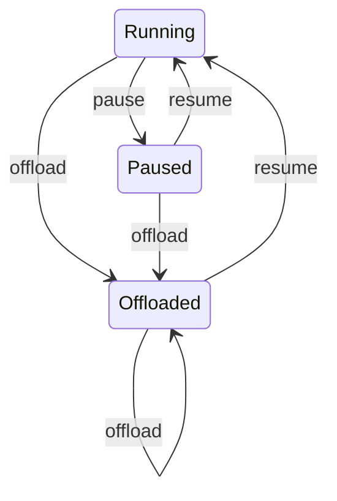

# VM 原语与文件 RAM backing

完整设计与文件内部 SVG 见 [VM RAM offload](src/zh/design/offload/index.md)；逐文件大小与 schema 见 [磁盘格式](src/zh/design/offload/disk-layout-and-schema.md)。

> 当前实现仅完成静态检查；未编译、未运行测试或启动 VM。

pVisor 的 VM 生命周期支持 `run.pause`、`run.resume`、`run.offload`。
Linux/KVM 和 Apple Silicon macOS/HVF 使用同一套 Rust 接口、控制协议和
文件布局，回收步骤按宿主平台处理。

可选 `vm.ram_compression = true` 或 `--vm-ram-compression` 使用自定义 PVZRAM
v2 manifest 与不可变 Seekable base/delta bundle，依赖 FUSE/macFUSE kernel backend。详见
[压缩 backing 与文件格式](ram-compression.md)；该路径同样未运行验收。

## 使用

启动时可以在配置中指定**尚不存在**的 backing 文件：

```toml
[vm]
ram_backing = "/data/pvisor/session-001.ram"
```

CLI 对应参数是 `--vm-ram-backing FILE`。该参数可以选择 VM executor，
但 macOS 仍需要显式的 Linux rootfs 或镜像。父目录必须已经存在。
未指定文件时，pVisor 在用户缓存的 `pvisor/ram/` 下创建临时文件，
正常退出时删除；明确指定的文件以及 offload 发布的文件保留。

拿到正在运行的 `RunHandle` 后：

```rust
handle.pause().await?;
handle.resume().await?;

// 使用启动时的文件，或默认临时 backing。
let memory = handle.offload(None).await?;
println!("{:?}", memory);
handle.resume().await?;

// 也可以在 offload 时指定保留位置。
let memory = handle.offload(Some("/data/pvisor/session-001.ram".into())).await?;
handle.resume().await?;
```

最后一种方式要求目标是当前 backing **同一文件系统上的新路径**。
如果需要放在其他挂载卷，应在启动时通过 `ram_backing` 指定该卷。
原有 `pause_vm()`、`resume_vm()` 保留为别名。

也可以调用 `RunHandle::control(OperationKind)`，使用 core 中的原语：

```json
{"op":"run.pause"}
{"op":"run.resume"}
{"op":"run.offload","file":"/data/pvisor/session-001.ram"}
```

`run.offload` 的 `file: null` 或省略表示沿用现有文件。这些是持有
RunHandle 的宿主调用者使用的控制原语，不是开放给 guest 的任意宿主文件
操作。没有新增独立控制面或跨进程 CLI 控制服务。

## 状态和事件



- pause 和 offload 成功后，外层 RunState 为 `Suspended`；resume 成功后为
  `Running`。原语结果细分为 `VmState::{Running,Paused,Offloaded}`。
- offload 自动暂停全部 vCPU，并关闭/排空设备 RAM 访问；写回并请求回收
  RAM，保持门禁关闭及暂停，直到显式 resume。设备排空限时 5 秒。
- 重复 pause、resume 是幂等操作。调用前应等待 Run 进入 `Running`；
  非 VM、未启动、已退出及正在取消的 Attempt 返回错误。
- 控制操作串行执行并记录 `vm.control_requested`、`vm.control_completed`
  或 `vm.control_failed`。宿主确认交换不会因调用方停止等待而中断。
- 部分失败、断连或超时会取消 Attempt，避免复用状态不明确的 VMM。
  确认预算为全 vCPU 3 秒，普通宿主交换 10 秒，offload 写回 300 秒。
- 事件落盘在实际操作完成后失败时，返回错误中会明确说明操作已完成；
  状态不会为了补事件而回滚。

## 内存布局与回收

```text
RunHandle / core 原语
  └─ Attempt 私有 socketpair（FD 199）
       └─ runner 的 VmmHandle
            ├─ 全部 vCPU 的暂停 / 恢复与确认
            └─ 普通 RAM 的 MAP_SHARED 文件映射（启动继承 FD 200）
                 ├─ Linux：MS_SYNC → MADV_DONTNEED → 文件缓存回收请求
                 └─ macOS：解除 HVF RAM 映射 → MS_SYNC | MS_INVALIDATE
                            → MADV_DONTNEED → resume 时恢复 HVF 映射
```

普通 RAM 按 guest 地址排序，在逻辑文件中顺序排列，并按宿主页大小对齐。
x86_64 的直接 kernel bundle 也复制到该 backing，避免留下一个不能回收的
外部 kernel 映射。virtio-fs DAX 与 GPU 共享窗口不计入该文件或回收范围。
压缩模式的逻辑文件由私有 FUSE 提供，写回提交不可变 generation；manifest
与 sidecar 不能直接按 RAM 偏移 mmap，也不能单独复制 manifest 完成迁移。

宿主虚拟地址一直有效，设备线程已有的 RAM 引用不会因 offload 失效。
文件由可信宿主先以 `0600`、`create_new` 创建，再通过 FD 交给 runner；
runner 不获得对 offload 目标目录的路径写权限。启动时隐藏 backing 文件
及压缩 sidecar、托管 RAM 缓存目录在 root/workspace lower 中的入口。

offload 指定路径时，以硬链接发布**同一个 inode**，不复制 RAM，不切换
映射，也不覆盖已有文件。跨文件系统返回错误，并保留原状态。
若要支持任意跨卷迁移，需要额外实现设备后端静止与安全切换，不能只暂停
vCPU 后边复制边替换 backing。

原语返回 `VmMemory`：

| 字段 | 含义 |
|---|---|
| `backing_file` | 当前 live backing 的绝对路径 |
| `backed_bytes` | 本次覆盖的 RAM 范围大小，包含单独 kernel 区域 |
| `resident_before_bytes` | 回收前 mincore 驻留页采样，无法获取时为 null |
| `resident_after_bytes` | 回收后采样，无法获取时为 null |

mincore 统计的是映射的驻留页，Linux 上包含文件页缓存，不能等同于进程
RSS。这些值是即时采样，设备线程或其他访问可以再次带入页面。

## 边界

- backing 是正在使用的 RAM，**不是完整快照**。普通 pause 时设备 I/O
  继续运行；offload 期间设备 RAM 访问等待 resume，未保存 CPU 和设备状态。
  GPU/audio/input/TEE 构建拒绝 offload，避免未经门禁保护的特殊访存。
- 写回及回收请求成功不保证驻留内存归零。内核、HVF 与设备访问可能保留
  或重新带入部分页；macOS 恢复映射的实际预读/驻留行为尚未运行验证。
- 文件是稀疏分配的；实际磁盘空间随脏页增长。应使用磁盘文件系统，放在
  tmpfs 上不能期待同等的磁盘 offload 收益。文件系统耗尽时可能使 guest
  映射访问触发 SIGBUS。不要在 VM 存活时删除、替换、截断或修改 backing。
- 正常退出删除自动临时文件；宿主被强制终止时可能留下缓存文件，当前未
  增加后台清理器。明确指定的文件由调用者管理。
- guest 时钟、Run deadline 和外部连接超时继续推进，没有虚拟时钟冻结。
  Linux 长暂停后的时钟/看门狗行为仍需运行验收。
- 这是 1.19.3 基线上的 Rust handle 适配，不是 libkrun 2.0 C ABI 升级。
  TEE/Nitro 不接受该 backing 接口。

## 静态依据与待验收项

平台调用依据：[Linux mmap](https://man7.org/linux/man-pages/man2/mmap.2.html)、
[Linux madvise](https://man7.org/linux/man-pages/man2/madvise.2.html)、
[Apple msync](https://developer.apple.com/library/archive/documentation/System/Conceptual/ManPages_iPhoneOS/man2/msync.2.html)、
[Apple HVF unmap](https://developer.apple.com/documentation/hypervisor/hv_vm_unmap(_:_:))。

新增但**未执行**的检查覆盖：原语序列化与结果合同、文件不覆盖和 inode
保持、确认等待与调用方中断、回收后的 RAM 内容保持及共享窗口排除。
进一步补充协议畸形/超大帧/错误状态/断连、源文件被替换、文件权限、CLI 与
TOML 配置、重复回收和文件字节校验。六条黑盒 DOC 场景见
[VM cases](src/zh/reference/cases-vm.md)，通过 `just vm-cases` 准备 SDK 驱动后运行；
规格与词汇未经人工审批，尚未执行。
真实 KVM/HVF 的 guest 写入内容保持、多 vCPU、空闲 CPU、启动竞争、长暂停恢复、回收量、磁盘
错误与尾延迟仍需编译和运行验收。本页不借用此前 libkrun 补丁的测试结果。
